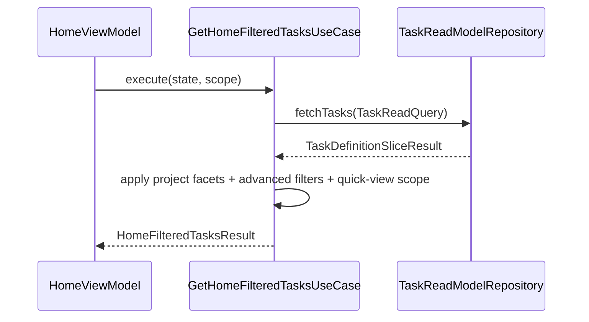
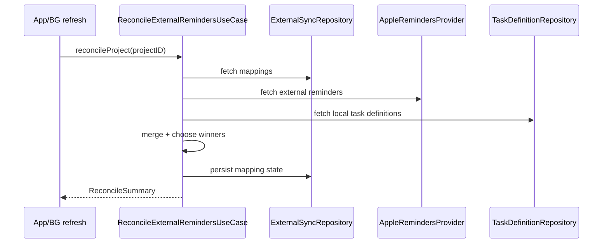
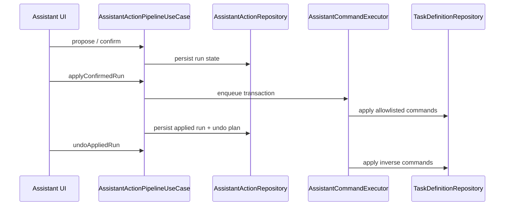
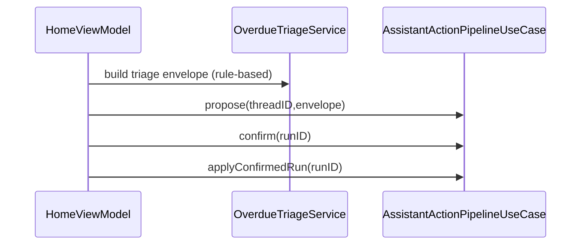

# Tasker Usecases and Contracts (V3 Runtime)

**Last validated against code on 2026-02-21**

This document is the contract map for the current usecase layer.
It includes active usecase inventory, dependency surfaces, side effects, and orchestration flows.

Primary source anchors:
- `To Do List/UseCases/*`
- `To Do List/UseCases/Coordinator/UseCaseCoordinator.swift`
- `To Do List/Domain/Interfaces/V2RepositoryProtocols.swift`
- `To Do List/Domain/Interfaces/TaskReadModelRepositoryProtocol.swift`
- `To Do List/Services/V2FeatureFlags.swift`
- `To Do List/Presentation/DI/PresentationDependencyContainer.swift`
- `To Do List/LLM/Views/Chat/ChatView.swift`
- `To Do List/Presentation/ViewModels/HomeViewModel.swift`

## Inventory (All Active UseCase Files)

| Module | Files |
| --- | --- |
| Analytics | `CalculateAnalyticsUseCase.swift`, `GenerateProductivityReportUseCase.swift` |
| Coordinator | `UseCaseCoordinator.swift` |
| Gamification | `RecordXPUseCase.swift` |
| Habit | `ManageHabitsUseCase.swift` |
| LLM | `AssistantActionPipelineUseCase.swift`, `AssistantCommandExecutor.swift` |
| LifeArea | `ManageLifeAreasUseCase.swift` |
| Project | `EnsureInboxProjectUseCase.swift`, `FilterProjectsUseCase.swift`, `GetProjectStatisticsUseCase.swift`, `ManageProjectsUseCase.swift` |
| Reminder | `ScheduleReminderUseCase.swift` |
| Schedule | `GenerateOccurrencesUseCase.swift`, `MaintainOccurrencesUseCase.swift`, `ResolveOccurrenceUseCase.swift` |
| Section | `ManageSectionsUseCase.swift` |
| Sync | `LinkExternalRemindersUseCase.swift`, `ReconcileExternalRemindersUseCase.swift`, `ReminderMergeEngine.swift` |
| Tag | `ManageTagsUseCase.swift` |
| Task | `CreateTaskDefinitionUseCase.swift`, `UpdateTaskDefinitionUseCase.swift`, `DeleteTaskDefinitionUseCase.swift`, `CompleteTaskDefinitionUseCase.swift`, `RescheduleTaskDefinitionUseCase.swift`, `GetTasksUseCase.swift`, `GetHomeFilteredTasksUseCase.swift`, `SortTasksUseCase.swift` |

## Coordinator Surface

`UseCaseCoordinator` is the orchestration facade consumed by presentation.
It exposes:
- Query/read usecases (`getTasks`, `getHomeFilteredTasks`, analytics and project stats)
- Canonical task-definition mutation usecases
- Planning/schedule/reminder/sync/assistant/gamification usecases
- High-level workflows (`completeMorningRoutine`, `rescheduleAllOverdueTasks`, `createProjectWithTasks`, `getDailyDashboard`, `performEndOfDayCleanup`)

## Contract Legend

- Inputs: primary arguments/request structs.
- Outputs: success payloads.
- Dependencies: injected protocol/services.
- Side effects: writes, notifications, provider I/O, logs.
- Errors: explicit error enums or propagated repository errors.

## Module Contracts

### Analytics

| Usecase | Inputs | Outputs | Dependencies | Side effects |
| --- | --- | --- | --- | --- |
| `CalculateAnalyticsUseCase` | date scopes and range requests | `DailyAnalytics`, `WeeklyAnalytics`, `MonthlyAnalytics`, `PeriodAnalytics` | `TaskReadModelRepositoryProtocol?`, scoring service, cache | read-only computation + optional cache usage |
| `GenerateProductivityReportUseCase` | `ReportPeriod` | report payloads | `TaskReadModelRepositoryProtocol?` | read-only report generation |

### Planning (LifeArea/Section/Tag/Habit)

| Usecase | Inputs | Outputs | Dependencies | Side effects |
| --- | --- | --- | --- | --- |
| `ManageLifeAreasUseCase` | create/list/archive args | `LifeArea` values | `LifeAreaRepositoryProtocol` | life-area CRUD |
| `ManageSectionsUseCase` | project/section IDs + names | `TaskerProjectSection` values | `SectionRepositoryProtocol` | section CRUD/rename |
| `ManageTagsUseCase` | tag create/list/delete args | `TagDefinition` values | `TagRepositoryProtocol` | tag CRUD |
| `ManageHabitsUseCase` | habit create/list/pause args | `HabitDefinitionRecord` values | `HabitRepositoryProtocol` | habit CRUD and status updates |

### Project

| Usecase | Inputs | Outputs | Dependencies | Side effects |
| --- | --- | --- | --- | --- |
| `EnsureInboxProjectUseCase` | execute() | canonical Inbox `Project` | `ProjectRepositoryProtocol` | ensures Inbox exists and is canonical |
| `FilterProjectsUseCase` | status/priority filters | filtered project lists | `ProjectRepositoryProtocol` | read-only |
| `GetProjectStatisticsUseCase` | overview query | `ProjectOverview` | `ProjectRepositoryProtocol` | read-only aggregation |
| `ManageProjectsUseCase` | create/update/delete/repair/move requests | `Project`, `ProjectWithStats`, `ProjectRepairReport` | `ProjectRepositoryProtocol` | project writes, notifications, identity repair |

### Task Query/Presentation Support

| Usecase | Inputs | Outputs | Dependencies | Side effects |
| --- | --- | --- | --- | --- |
| `GetTasksUseCase` | scope/date/project/type/search filters | task result structs + task arrays | `TaskReadModelRepositoryProtocol?`, `CacheServiceProtocol?` | read-model queries + optional cache writes |
| `GetHomeFilteredTasksUseCase` | `HomeFilterState`, `HomeListScope` | `HomeFilteredTasksResult` | `TaskReadModelRepositoryProtocol?` | read-only facet/quick-view filtering |
| `SortTasksUseCase` | task list + `SortCriteria` | `SortedTasksResult` | `CacheServiceProtocol?` | in-memory sorting/grouping |

### Task Mutation (Canonical)

| Usecase | Inputs | Outputs | Dependencies | Side effects |
| --- | --- | --- | --- | --- |
| `CreateTaskDefinitionUseCase` | `CreateTaskDefinitionRequest` (or scalar convenience args) | `TaskDefinition` | `TaskDefinitionRepositoryProtocol`, optional tag/dependency link repositories | creates task + persists links + posts task mutation notifications |
| `UpdateTaskDefinitionUseCase` | `UpdateTaskDefinitionRequest` | `TaskDefinition` | same as create | updates task + replaces links + posts task mutation notifications |
| `DeleteTaskDefinitionUseCase` | task ID | `Void` | `TaskDefinitionRepositoryProtocol`, optional `TombstoneRepositoryProtocol` | deletes task, optionally writes tombstone, posts task deletion notifications |
| `CompleteTaskDefinitionUseCase` | task ID + completion toggle | `TaskDefinition` | `TaskDefinitionRepositoryProtocol`, optional `RecordXPUseCase` | completion writes, optional XP write, completion notifications |
| `RescheduleTaskDefinitionUseCase` | task ID + new date | `TaskDefinition` | `UpdateTaskDefinitionUseCase` | due-date mutation via update path |
| `GetTaskChildrenUseCase` | parent task ID | `[TaskDefinition]` | `TaskDefinitionRepositoryProtocol` | read-only child fetch |

### Schedule + Reminder + Sync + Gamification + Assistant

| Usecase | Inputs | Outputs | Dependencies | Side effects |
| --- | --- | --- | --- | --- |
| `GenerateOccurrencesUseCase` | `daysAhead` | `[OccurrenceDefinition]` | `SchedulingEngineProtocol` | occurrence generation writes |
| `ResolveOccurrenceUseCase` | resolution request | `Void` | `SchedulingEngineProtocol` | resolution writes |
| `MaintainOccurrencesUseCase` | execute() | `Void` | occurrence + tombstone repositories | maintenance/purge routines |
| `PurgeExpiredTombstonesUseCase` | reference date | `Void` | `TombstoneRepositoryProtocol` | deletes expired tombstones |
| `ScheduleReminderUseCase` | reminder/trigger/delivery requests | reminder domain values | `ReminderRepositoryProtocol`, optional `NotificationServiceProtocol` | reminder graph writes + optional local notifications |
| `LinkExternalRemindersUseCase` | project/list mapping and optional bootstrap import args | mapping/import results | `ExternalSyncRepositoryProtocol`, optional provider and task repository | provider reads + mapping writes + optional local task imports |
| `ReconcileExternalRemindersUseCase` | mapping snapshots or project reconcile | counts / `ReconcileSummary` | external repository, optional provider/task repository, `ReminderMergeEngine` | two-way provider/local sync writes |
| `RecordXPUseCase` | task completion IDs | `Void` / reconciled profile | `GamificationRepositoryProtocol` | XP and achievement writes |
| `AssistantActionPipelineUseCase` | propose/confirm/apply/reject/undo calls | `AssistantActionRunDefinition` | assistant action repo, task definition repo, command executor | transactional task mutations + run lifecycle persistence |
| `ReminderMergeEngine` | merge envelopes/clocks/state | merge decisions + encoded envelope | pure component | deterministic in-memory merge logic |

## LLM Surface Services (Non-UseCase, Runtime-Owned)

These components are intentionally not usecases and stay in the local-LLM/runtime layer:
- `AssistantPlannerService`, `AssistantEnvelopeValidator`, `AssistantDiffPreviewBuilder` (chat plan/apply bridge)
- `AISuggestionService`, `TaskBreakdownService`, `OverdueTriageService`, `DailyBriefService`
- `TaskEmbeddingEngine`, `TaskSemanticIndexStore`, `TaskSemanticRetrievalService`

### Boundary rule
1. Runtime services may assemble prompts, cards, and UI-facing AI outputs.
2. Runtime services must not mutate tasks directly.
3. All assistant mutations must still traverse `AssistantActionPipelineUseCase`.

This keeps deterministic domain mutations in usecases while allowing UI-facing local-AI composition to evolve independently.

## Assistant Mutation Invariants

1. Pipeline signatures are stable in this cycle and unchanged:
- `propose(threadID:envelope:)`
- `confirm(runID:)`
- `applyConfirmedRun(id:)`
- `reject(runID:)`
- `undoAppliedRun(id:)`
2. Ask mode is non-mutating and must not invoke pipeline mutation methods.
3. Proposal card actions must validate run/thread ownership before confirm/apply/reject/undo.
4. Home overdue triage “Apply All” must still use `propose -> confirm -> applyConfirmedRun`.

## Feature Flag Gating

| Flow | Flags |
| --- | --- |
| reminders link/reconcile | `remindersSyncEnabled` |
| reminder notification scheduling side effects | `remindersSyncEnabled` |
| assistant apply | `assistantApplyEnabled` |
| assistant undo | `assistantUndoEnabled` |
| reminders background refresh scheduling | `remindersBackgroundRefreshEnabled` |
| assistant plan mode surface | `assistantPlanModeEnabled` |
| assistant copilot surfaces | `assistantCopilotEnabled` |
| assistant semantic retrieval | `assistantSemanticRetrievalEnabled` |
| assistant daily brief | `assistantBriefEnabled` |
| assistant breakdown | `assistantBreakdownEnabled` |

## Critical Flow Sketches

### Home filtering pipeline

### External reminders reconcile pipeline

### Assistant apply/undo pipeline

### Home triage apply-all contract

## UI Integration Map

| ViewModel | Primary dependency surface |
| --- | --- |
| `HomeViewModel` | `UseCaseCoordinator` (home filtering, query, analytics, project surfaces) + `AISuggestionService` + assistant pipeline provider |
| `AddTaskViewModel` | `createTaskDefinition`, `rescheduleTaskDefinition`, planning usecases + read model + `AISuggestionService` |
| `TaskDetailViewModel` | task mutation/query surfaces + `TaskBreakdownService` |
| `ProjectManagementViewModel` | `manageProjects`, `getTasks` |
| `ChartCardViewModel` | read-model repository |
| `RadarChartCardViewModel` | project repository + read-model repository |
| `ProjectSelectionViewModel` | project repository + read-model repository |

## Cross-Links

- `docs/architecture/clean-architecture-v2.md`
- `docs/architecture/data-model-v2.md`
- `docs/architecture/state-repositories-and-services-v2.md`
- `docs/architecture/llm-assistant-stack-v2.md`
- `docs/architecture/llm-feature-integration-handbook.md`
- `docs/architecture/risk-register-v2.md`
