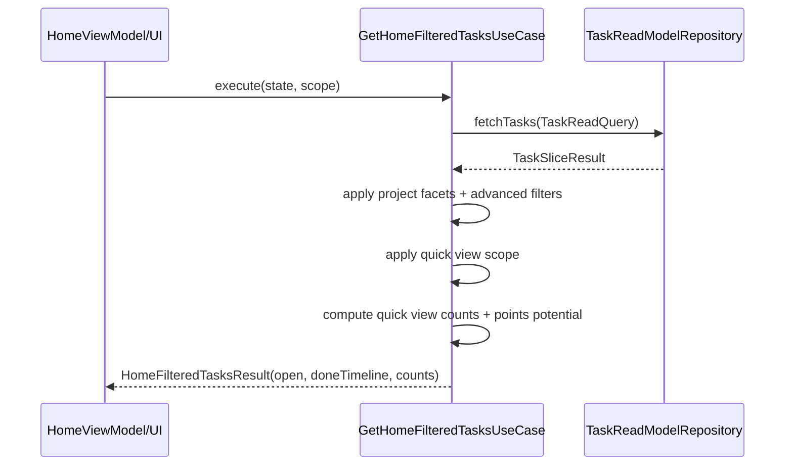
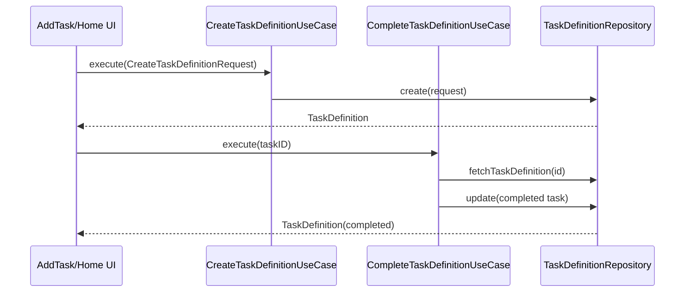
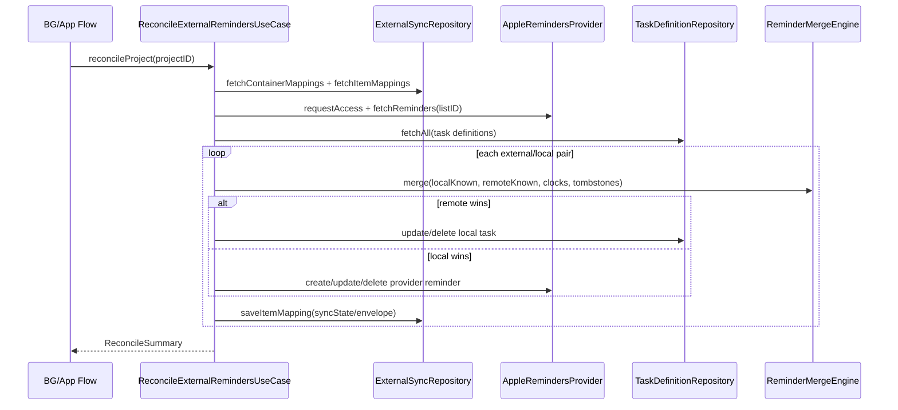
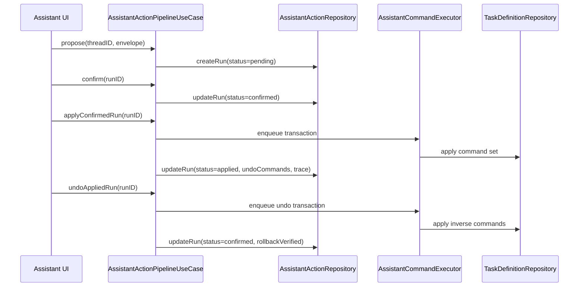

# Tasker V2 Usecases And Contracts

**Last validated against code on 2026-02-18**

## Scope

This document catalogs usecase surfaces and execution contracts for Tasker V2, including:
- Taxonomy by module
- Inputs/outputs/dependencies/side effects/error surfaces
- Idempotency and rollback notes where applicable
- UI integration contracts

Primary sources:
- `To Do List/UseCases`
- `To Do List/UseCases/Coordinator/UseCaseCoordinator.swift`
- `To Do List/Domain/Interfaces/TaskRepositoryProtocol.swift`
- `To Do List/Domain/Interfaces/TaskReadModelRepositoryProtocol.swift`
- `To Do List/Domain/Interfaces/V2RepositoryProtocols.swift`
- `To Do List/Domain/Models/TaskReadQueries.swift`
- `To Do List/Services/V2FeatureFlags.swift`

## Taxonomy By Module (All Files)

| Module | Files |
| --- | --- |
| Analytics | `To Do List/UseCases/Analytics/CalculateAnalyticsUseCase.swift`, `To Do List/UseCases/Analytics/GenerateProductivityReportUseCase.swift` |
| Coordinator | `To Do List/UseCases/Coordinator/UseCaseCoordinator.swift` |
| Gamification | `To Do List/UseCases/Gamification/RecordXPUseCase.swift` |
| Habit | `To Do List/UseCases/Habit/ManageHabitsUseCase.swift` |
| LLM | `To Do List/UseCases/LLM/AssistantActionPipelineUseCase.swift`, `To Do List/UseCases/LLM/AssistantCommandExecutor.swift` |
| LifeArea | `To Do List/UseCases/LifeArea/ManageLifeAreasUseCase.swift` |
| Project | `To Do List/UseCases/Project/EnsureInboxProjectUseCase.swift`, `To Do List/UseCases/Project/FilterProjectsUseCase.swift`, `To Do List/UseCases/Project/GetProjectStatisticsUseCase.swift`, `To Do List/UseCases/Project/ManageProjectsUseCase.swift` |
| Reminder | `To Do List/UseCases/Reminder/ScheduleReminderUseCase.swift` |
| Schedule | `To Do List/UseCases/Schedule/GenerateOccurrencesUseCase.swift`, `To Do List/UseCases/Schedule/MaintainOccurrencesUseCase.swift`, `To Do List/UseCases/Schedule/ResolveOccurrenceUseCase.swift` |
| Section | `To Do List/UseCases/Section/ManageSectionsUseCase.swift` |
| Sync | `To Do List/UseCases/Sync/LinkExternalRemindersUseCase.swift`, `To Do List/UseCases/Sync/ReconcileExternalRemindersUseCase.swift`, `To Do List/UseCases/Sync/ReminderMergeEngine.swift` |
| Tag | `To Do List/UseCases/Tag/ManageTagsUseCase.swift` |
| Task | `To Do List/UseCases/Task/ArchiveCompletedTasksUseCase.swift`, `To Do List/UseCases/Task/AssignOrphanedTasksToInboxUseCase.swift`, `To Do List/UseCases/Task/BulkUpdateTasksUseCase.swift`, `To Do List/UseCases/Task/CompleteTaskDefinitionUseCase.swift`, `To Do List/UseCases/Task/CompleteTaskUseCase.swift`, `To Do List/UseCases/Task/CreateTaskDefinitionUseCase.swift`, `To Do List/UseCases/Task/CreateTaskUseCase.swift`, `To Do List/UseCases/Task/DeleteTaskUseCase.swift`, `To Do List/UseCases/Task/FilterTasksUseCase.swift`, `To Do List/UseCases/Task/GetHomeFilteredTasksUseCase.swift`, `To Do List/UseCases/Task/GetTaskStatisticsUseCase.swift`, `To Do List/UseCases/Task/GetTasksUseCase.swift`, `To Do List/UseCases/Task/RescheduleTaskUseCase.swift`, `To Do List/UseCases/Task/SearchTasksUseCase.swift`, `To Do List/UseCases/Task/SortTasksUseCase.swift`, `To Do List/UseCases/Task/TaskGameificationUseCase.swift`, `To Do List/UseCases/Task/TaskHabitBuilderUseCase.swift`, `To Do List/UseCases/Task/UpdateTaskUseCase.swift` |

## Contract Legend

- Inputs: primary call arguments / request structs.
- Outputs: success payload shapes.
- Dependencies: repository/service protocols injected.
- Side Effects: data mutation, notifications, logging, external writes.
- Errors: principal error enums or propagated repository errors.
- Idempotency/Rollback: practical behavior under retries/failures.

## Core Orchestrator Contracts

| Contract | Inputs | Outputs | Dependencies | Side Effects | Errors | Idempotency/Rollback |
| --- | --- | --- | --- | --- | --- | --- |
| `UseCaseCoordinator` | Constructor dependencies + optional V2 bundle; workflow method parameters | Workflow result structs (`MorningRoutineResult`, `DailyDashboard`, etc.) | Legacy repositories + optional V2 repositories via `V2Dependencies` | Coordinates multi-usecase workflows; no direct storage access | `WorkflowError` + propagated errors | Delegates idempotency to underlying usecases |
| `AssistantCommandExecutor` (support actor) | async closure | closure result | internal serialized queue | serializes command execution | propagated closure errors | queue-based single-run serialization; no storage writes itself |
| `ReminderMergeEngine` (support component) | merge inputs/envelope data | merge result and encoded envelope data | pure in-memory merge logic | none directly; used by reconcile usecase | none (returns decisions) | deterministic by provided clocks and known state |

Sources:
- `To Do List/UseCases/Coordinator/UseCaseCoordinator.swift`
- `To Do List/UseCases/LLM/AssistantCommandExecutor.swift`
- `To Do List/UseCases/Sync/ReminderMergeEngine.swift`

## Module Contracts

## Analytics

| Usecase | Inputs | Outputs | Dependencies | Side Effects | Errors | Idempotency/Rollback |
| --- | --- | --- | --- | --- | --- | --- |
| `CalculateAnalyticsUseCase` | time scopes / completion handlers | analytics structs (`DailyAnalytics`, `WeeklyAnalytics`, etc.) | `TaskRepositoryProtocol`, scoring service, optional cache | reads tasks; computes aggregates | `AnalyticsError`/repository errors | read-only deterministic for same snapshot |
| `GenerateProductivityReportUseCase` | date period + completion | report payload | task and analytics dependencies | read-only report generation | propagated errors | read-only |

## Gamification

| Usecase | Inputs | Outputs | Dependencies | Side Effects | Errors | Idempotency/Rollback |
| --- | --- | --- | --- | --- | --- | --- |
| `RecordXPUseCase` | task/occurrence completion events | updated profile/snapshot or void | `GamificationRepositoryProtocol` | writes profile, XP events, unlock records | propagated repository errors | relies on idempotency keys in XP events to avoid duplicate award writes |

## Habit + LifeArea + Section + Tag

| Usecase | Inputs | Outputs | Dependencies | Side Effects | Errors | Idempotency/Rollback |
| --- | --- | --- | --- | --- | --- | --- |
| `ManageHabitsUseCase` | create/pause/list arguments | habit records | `HabitRepositoryProtocol` | CRUD on habit definitions | propagated repository errors | create non-idempotent; list/read idempotent |
| `ManageLifeAreasUseCase` | create/archive/list args | `LifeArea` models | `LifeAreaRepositoryProtocol` | CRUD on life areas | propagated repository errors | create non-idempotent; archive idempotent by state |
| `ManageSectionsUseCase` | project/section IDs and names | section models | `SectionRepositoryProtocol` | CRUD on project sections | propagated repository errors | rename/update idempotent with same payload |
| `ManageTagsUseCase` | name/color/icon/id inputs | tag models | `TagRepositoryProtocol` | create/delete tags | propagated repository errors | delete idempotent when item absent if repo tolerates |

## Project

| Usecase | Inputs | Outputs | Dependencies | Side Effects | Errors | Idempotency/Rollback |
| --- | --- | --- | --- | --- | --- | --- |
| `EnsureInboxProjectUseCase` | execute() | canonical inbox `Project` | `ProjectRepositoryProtocol` | may create inbox and normalize defaults | `EnsureInboxError` | intended idempotent canonicalization |
| `FilterProjectsUseCase` | status/priority filters | filtered projects | `ProjectRepositoryProtocol` | read-only filtering | `FilterProjectsError` | read-only |
| `GetProjectStatisticsUseCase` | project ID/name scope | project overview stats | project + task repos | read-only aggregation | propagated errors | read-only |
| `ManageProjectsUseCase` | create/update/delete/move/repair requests | project/result structs + repair report | `ProjectRepositoryProtocol`, `TaskRepositoryProtocol` | mutates projects and optionally task assignments | `ProjectError` | delete/move non-idempotent unless guarded externally |

## Reminder + Schedule

| Usecase | Inputs | Outputs | Dependencies | Side Effects | Errors | Idempotency/Rollback |
| --- | --- | --- | --- | --- | --- | --- |
| `ScheduleReminderUseCase` | reminder/trigger/delivery inputs | saved reminder/trigger/delivery | `ReminderRepositoryProtocol` | writes reminder graph and delivery updates | propagated errors | repeated same save may upsert/duplicate depending repository behavior |
| `GenerateOccurrencesUseCase` | daysAhead | `[OccurrenceDefinition]` | `SchedulingEngineProtocol` | writes generated occurrences through engine | propagated errors | generation should be window-bound; repository enforces occurrence key uniqueness |
| `MaintainOccurrencesUseCase` | execute() | `Void` | occurrence/tombstone/scheduling dependencies | prunes/maintains occurrences and cleanup routines | propagated errors | maintenance is repeat-safe when boundaries unchanged |
| `PurgeExpiredTombstonesUseCase` | reference date | `Void` | `TombstoneRepositoryProtocol` | deletes expired tombstones | propagated errors | idempotent for same reference cutoff |
| `ResolveOccurrenceUseCase` | resolution request | `Void` or updated state | `OccurrenceRepositoryProtocol` | writes occurrence resolution records | propagated errors | repeated identical resolution may duplicate unless repo dedupes |

## Sync

| Usecase | Inputs | Outputs | Dependencies | Side Effects | Errors | Idempotency/Rollback |
| --- | --- | --- | --- | --- | --- | --- |
| `LinkExternalRemindersUseCase` | project + external list/link args | mapping results/import summary | `ExternalSyncRepositoryProtocol`, optional provider/task repo | writes container/item mappings and optional bootstrap imports | propagated errors | upsert paths designed to be repeat-safe |
| `ReconcileExternalRemindersUseCase` | snapshots or `projectID` | merge count or `ReconcileSummary` | external repo + optional provider/task repo + merge engine | two-way mutations: task updates/deletes, provider create/update/delete, mapping state updates | propagated errors + feature-disabled errors | partially transactional by item; failures can leave partial reconciliation |

## Task (Legacy + V2 Bridge + V2-Specific)

| Usecase | Inputs | Outputs | Dependencies | Side Effects | Errors | Idempotency/Rollback |
| --- | --- | --- | --- | --- | --- | --- |
| `CreateTaskUseCase` | `CreateTaskRequest` | `Task` | task repo, project repo, notifications | creates legacy-bridge task, optional notifications | `CreateTaskError` | non-idempotent |
| `UpdateTaskUseCase` | update request / batch requests | updated tasks | task repo, project repo, notifications | mutates tasks | `UpdateTaskError` | non-idempotent |
| `DeleteTaskUseCase` | single/batch/delete-range inputs | void/batch result | task repo + optional services | deletes tasks and optionally emits analytics/notifications | `DeleteTaskError` | delete is effectively idempotent if entity already absent |
| `CompleteTaskUseCase` | task ID + completion toggle methods | `TaskCompletionResult` | task repo, scoring service, optional analytics | updates completion state and score impact | `CompleteTaskError` | repeat complete/uncomplete transitions are state dependent |
| `RescheduleTaskUseCase` | task ID/date/suggestions | updated task or suggestions | task repo + optional notifications | due-date mutations and bulk overdue reschedule | `RescheduleTaskError` | non-idempotent for moving dates |
| `GetTasksUseCase` | scope/date/project/type/search inputs | typed task result structs | task repo + optional read model + cache | read-only; query and optional caching | `GetTasksError` | read-only |
| `GetHomeFilteredTasksUseCase` | `HomeFilterState`, scope | `HomeFilteredTasksResult` | read-model repository | read-only home focus pipeline | `GetHomeFilteredTasksError` | read-only deterministic for same query and clock |
| `FilterTasksUseCase` | `FilterCriteria` | `FilteredTasksResult` | task repo + optional cache | read-only filtering + optional cache writes | `FilterError` | read-only |
| `SortTasksUseCase` | task array + sort criteria | `SortedTasksResult` | optional cache | read-only sort/group operations | `SortError` | read-only |
| `SearchTasksUseCase` | search query/scope | `SearchResult` + suggestions | task repo + optional read model + cache | read-only search + optional cache writes | `SearchError` | read-only |
| `GetTaskStatisticsUseCase` | stats scope/date/project | statistics structs | task repo + optional cache | read-only aggregation | `StatisticsError` | read-only |
| `BulkUpdateTasksUseCase` | task ID set + bulk operation payload | `BulkOperationResult` | task repo + optional event publisher | multi-task updates/deletes/archive moves | `BulkUpdateError` | partially successful batches allowed |
| `ArchiveCompletedTasksUseCase` | strategy/project/restore/delete controls | archive/restore/deletion result structs | task repo + optional event publisher | project reassignment, restore, permanent delete | `ArchiveError` | partially idempotent based on selection/state |
| `AssignOrphanedTasksToInboxUseCase` | execute/validate | orphan report | task repo + project repo | assigns tasks lacking valid project | `OrphanedTasksError` | intended idempotent canonicalization |
| `TaskGameificationUseCase` | completion quality/challenge/streak queries | gamification DTOs | task + analytics dependencies | may publish domain events | `GameificationError` | mostly read/compute with event emissions |
| `TaskHabitBuilderUseCase` | habit task create/complete/pause/resume/suggestions/template ops | habit task/result DTOs | task repository + habit logic dependencies | task/habit writes and domain events | `HabitBuilderError` | mixed; create non-idempotent, pause/resume state-based |
| `CreateTaskDefinitionUseCase` | `CreateTaskDefinitionRequest` or domain object | `TaskDefinition` | `TaskDefinitionRepositoryProtocol` | canonical V2 task creation | propagated errors | non-idempotent |
| `GetTaskChildrenUseCase` | parent task ID | `[TaskDefinition]` | `TaskDefinitionRepositoryProtocol` | read-only | propagated errors | read-only |
| `CompleteTaskDefinitionUseCase` | task definition ID | `TaskDefinition` | `TaskDefinitionRepositoryProtocol` | marks V2 task definition completed | propagated errors | state-based |

## LLM Assistant Pipeline

| Usecase | Inputs | Outputs | Dependencies | Side Effects | Errors | Idempotency/Rollback |
| --- | --- | --- | --- | --- | --- | --- |
| `AssistantActionPipelineUseCase` | propose/confirm/apply/reject/undo calls; run IDs; command envelopes | persisted `AssistantActionRunDefinition` with status transitions | `AssistantActionRepositoryProtocol`, `TaskDefinitionRepositoryProtocol`, `AssistantCommandExecutor` | persists runs, mutates tasks transactionally, writes trace/rollback status, logs events | feature-disabled errors, schema validation errors, transaction failures | apply builds deterministic undo plan; rollback verification executed on failure; undo allowed only inside window |

Sources:
- `To Do List/UseCases/LLM/AssistantActionPipelineUseCase.swift`
- `To Do List/Domain/Models/AssistantAction.swift`

## Critical Flow Deep Dives

## 1) Home Focus Filtering Pipeline

Flow notes:
- Requires read-model repository configured.
- Uses project narrowing, advanced tag/priority/context/energy/date/dependency filters.
- Produces both open and done timeline outputs with quick-view count map.

Sources:
- `To Do List/UseCases/Task/GetHomeFilteredTasksUseCase.swift`
- `To Do List/Domain/Models/HomeFilterState.swift`
- `To Do List/Domain/Models/HomeQuickView.swift`

## 2) Task Definition Create + Complete

Sources:
- `To Do List/UseCases/Task/CreateTaskDefinitionUseCase.swift`
- `To Do List/UseCases/Task/CompleteTaskDefinitionUseCase.swift`
- `To Do List/Domain/Interfaces/V2RepositoryProtocols.swift`

## 3) External Reminders Two-Way Reconcile

Sources:
- `To Do List/UseCases/Sync/ReconcileExternalRemindersUseCase.swift`
- `To Do List/UseCases/Sync/ReminderMergeEngine.swift`
- `To Do List/Domain/Models/ExternalSyncModels.swift`
- `To Do List/Domain/Models/SyncMergeState.swift`

## 4) Assistant Propose -> Confirm -> Apply/Undo

Sources:
- `To Do List/UseCases/LLM/AssistantActionPipelineUseCase.swift`
- `To Do List/UseCases/LLM/AssistantCommandExecutor.swift`
- `To Do List/Domain/Models/AssistantAction.swift`

## UI Integration Contracts

## Read Surfaces For UI
- Focus/home views: `GetHomeFilteredTasksUseCase`.
- Generic lists/search/stats: `GetTasksUseCase`, `SearchTasksUseCase`, `GetTaskStatisticsUseCase`.
- Project charts/counts: read-model repository-backed paths.

Source anchors:
- `To Do List/UseCases/Task/GetHomeFilteredTasksUseCase.swift`
- `To Do List/UseCases/Task/GetTasksUseCase.swift`
- `To Do List/UseCases/Task/SearchTasksUseCase.swift`
- `To Do List/State/Repositories/CoreDataTaskReadModelRepository.swift`

## Write Surfaces For UI
- Canonical task-definition path: `CreateTaskDefinitionUseCase`, `CompleteTaskDefinitionUseCase`.
- Compatibility path: legacy task usecases via `TaskRepositoryProtocol` bridge.
- Higher-level mutations: bulk/archive/reschedule/orphan-assignment.

Source anchors:
- `To Do List/UseCases/Task/CreateTaskDefinitionUseCase.swift`
- `To Do List/UseCases/Task/CompleteTaskDefinitionUseCase.swift`
- `To Do List/UseCases/Task/BulkUpdateTasksUseCase.swift`
- `To Do List/UseCases/Task/ArchiveCompletedTasksUseCase.swift`
- `To Do List/UseCases/Task/AssignOrphanedTasksToInboxUseCase.swift`

## Sync vs Async Expectations

| Path Type | Contract Style |
| --- | --- |
| All usecases in repository | completion-handler async APIs |
| Assistant apply/undo internals | async transaction wrapped by completion APIs |
| Merge engine | synchronous pure function logic |

Sources:
- `To Do List/UseCases/**/*.swift`

## Feature-Flag-Dependent Flows

| Flow | Required Flags | Source |
| --- | --- | --- |
| Assistant apply | `v2Enabled`, `assistantApplyEnabled` | `To Do List/UseCases/LLM/AssistantActionPipelineUseCase.swift` |
| Assistant undo | `v2Enabled`, `assistantUndoEnabled` | `To Do List/UseCases/LLM/AssistantActionPipelineUseCase.swift` |
| External reminders reconcile | `v2Enabled`, `remindersSyncEnabled` | `To Do List/UseCases/Sync/ReconcileExternalRemindersUseCase.swift` |
| Background reminders refresh | `remindersSyncEnabled`, `remindersBackgroundRefreshEnabled` | `To Do List/AppDelegate.swift` |

## Sync/Asynchrony and Concurrency Matrix

| Surface | Contract Style | Concurrency Notes |
| --- | --- | --- |
| Core usecases (`Task`, `Project`, `Schedule`, `Sync`, etc.) | completion-handler async APIs | dispatch groups/locks used in multi-item flows; partial-failure semantics in batch paths |
| Read model usecases (`GetHomeFilteredTasksUseCase`, read paths in `GetTasksUseCase`) | async callbacks over query repository | deterministic ordering done after fetch; bounded query limits/offsets |
| `AssistantActionPipelineUseCase` | callback API wrapping async internals | serial execution via `AssistantCommandExecutor` actor; run timeout and command timeout budgets |
| `ReminderMergeEngine` | synchronous pure function | deterministic merge outcome based on clocks + known-state envelope |
| Domain event publication | synchronous publish + reactive stream emission | handlers run inline; subscribers receive Combine events asynchronously by chain setup |

Sources:
- `To Do List/UseCases/LLM/AssistantActionPipelineUseCase.swift`
- `To Do List/UseCases/LLM/AssistantCommandExecutor.swift`
- `To Do List/UseCases/Sync/ReminderMergeEngine.swift`
- `To Do List/UseCases/Task/GetHomeFilteredTasksUseCase.swift`
- `To Do List/Domain/Events/DomainEventPublisher.swift`

## Critical Flow Concurrency Notes

| Flow | Concurrency Characteristic | Failure Containment |
| --- | --- | --- |
| Home focus filtering | single fetch + synchronous in-memory filter pipeline | missing read-model dependency fails fast with explicit error |
| Task definition create/complete | single-entity transaction style updates | repository error returned directly; no hidden retries |
| External reminders reconcile | multi-item iterative reconciliation with lock-protected shared counters | per-item failures captured; reconciliation can finish partially |
| Assistant apply/undo | globally serialized command execution and rollback verification | failed apply marks run failed and records rollback status/trace |

## Side-Effect Inventory

| Usecase/Area | Side Effects |
| --- | --- |
| Task mutation usecases | task create/update/delete/complete writes, potential notification/analytics emissions |
| Project management | project identity normalization, task reassignment during merge/delete workflows |
| Schedule/occurrence | generation/rebuild/deletion of occurrences and exception application |
| Reminder flows | reminder/trigger/delivery persistence and provider synchronization during reconcile |
| Sync flows | provider create/update/delete operations plus mapping/sync-state persistence |
| Gamification | XP profile/ledger mutations and unlock writes |
| Assistant pipeline | persisted run state transitions, task-definition mutations, rollback trace persistence |
| Domain events | in-memory event storage, handler dispatch, NotificationCenter bridge posting |

## UI Surface Map (ViewModel -> Usecase Dependencies)

| ViewModel | Primary Usecase/Coordinator Surface | Source |
| --- | --- | --- |
| `HomeViewModel` | `UseCaseCoordinator` (`getHomeFilteredTasks`, task/project/stat/search/filter/sort surfaces) | `To Do List/Presentation/ViewModels/HomeViewModel.swift`, `To Do List/UseCases/Coordinator/UseCaseCoordinator.swift` |
| `AddTaskViewModel` | `CreateTaskUseCase`, `ManageProjectsUseCase`, `RescheduleTaskUseCase`, optional V2 create/manage usecases | `To Do List/Presentation/DI/PresentationDependencyContainer.swift` |
| `ProjectManagementViewModel` | `ManageProjectsUseCase`, `GetTasksUseCase` | `To Do List/Presentation/DI/PresentationDependencyContainer.swift` |
| `ChartCardViewModel` | read-model repository-backed task counts/scores via read surfaces | `To Do List/Presentation/DI/PresentationDependencyContainer.swift` |
| `RadarChartCardViewModel` | project repository + read-model repository | `To Do List/Presentation/DI/PresentationDependencyContainer.swift` |
| `ProjectSelectionViewModel` | project repository + read-model repository | `To Do List/Presentation/DI/PresentationDependencyContainer.swift` |

## Public Contract Coverage Checkpoints

The following public interfaces must remain aligned with this doc after each change:
- `To Do List/Domain/Interfaces/V2RepositoryProtocols.swift`
- `To Do List/Domain/Interfaces/TaskRepositoryProtocol.swift`
- `To Do List/Domain/Interfaces/TaskReadModelRepositoryProtocol.swift`
- `To Do List/UseCases/Coordinator/UseCaseCoordinator.swift`
