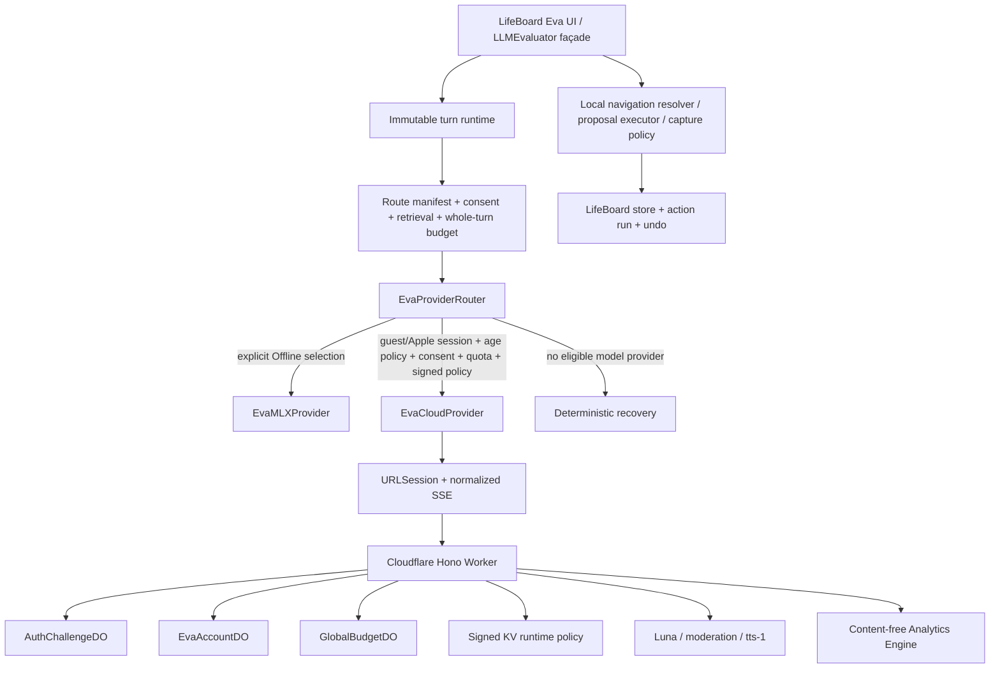

# Cloud EVA Product and Technical Guide

**Product role:** LifeBoard's user-controlled Chief of Staff  
**Implementation status:** Contract v4 architecture implemented; staging end-to-end qualification in progress
**Text provider:** OpenAI [`gpt-5.6-luna`](https://developers.openai.com/api/docs/models/gpt-5.6-luna)
**Spoken output:** OpenAI [`tts-1`](https://developers.openai.com/api/docs/models/tts-1), `nova`; no cloud speech-to-text or full duplex
**Last verified:** 2026-08-21

## Product promise

Eva helps a person understand what matters, turn ambiguity into a workable plan, capture small facts without friction, and recover when reality changes. It is not an autonomous operator. It explains, answers, classifies, navigates, breaks work down, and prepares bounded proposals. A narrow set of today-only, reversible captures may execute locally and immediately; broader or consequential changes use LifeBoard's canonical review and apply path.

Cloud EVA extends that experience with Luna while preserving Offline EVA through MLX and deterministic fallbacks. Cloud is explicit, 13+, guest-first, consent-scoped, rolling-quota controlled, and independently disableable. Ordinary LifeBoard remains useful without it.

## What ships in the implementation

Implementation availability is not production availability. The current source contains the contract-v4 platform spine, navigation/capture authority, memory/evidence controls, and proactive governor. Production Cloud Eva and TTS remain disabled pending physical-device, quality, privacy, operations, load, and staged-rollout gates. The maintained comparison is [Eva roadmap status and gap analysis](EVA_ROADMAP_STATUS.md).

### Text intelligence

- Free-text conversation with moderated streaming, grounded in a typed context
  envelope rather than a plain-text summary.
- Planning and one bounded structured repair.
- Field suggestions and dynamic prompt chips.
- Explicit top-three prioritization and task breakdown.
- A daily brief that separates what is fixed from what is suggested, names one
  explicit tradeoff, and cites the records it rests on.
- Universal-input classification after submission; live preview stays deterministic.
- Typed navigation intent that is resolved against eligible destinations and records on-device.
- One to three strict capture commands, with deterministic local parsing for common cases and local policy as the final execution boundary.
- Correctable memory candidates that require local user confirmation before persistence.
- Journal, Knowledge, and Siri/Shortcuts answers using only authorized projections.
- A debug smoke route for qualified non-production environments.

All structured routes use route-specific schemas and semantic validation. Model output cannot invent context identifiers or obtain mutation authority. No OpenAI tools, browsing, file search, or autonomous app actions are enabled. Direct capture is not a cloud write: the cloud returns a typed candidate command, then the device checks the allowlist, value bounds, today-only and batch policy, idempotency, and persistence before it can create a receipt.

### Spoken output

The person may request an AI-generated reading of a successful answer. The first rendering is included through a signed, single-use speech ticket. PCM is streamed into a centralized Apple audio-session arbiter, with play/pause/resume/stop/replay, interruption and route-change handling, headphone-disconnect pause, and recording arbitration. A protected local 100 MB/30-day LRU supports free replay. Text and TTS have independent kill switches.

### Account and trust

- Server-random guest accounts with rotating 15-minute access/30-day refresh sessions, reuse detection, active-session deletion, and unrecoverable-by-default reinstall semantics.
- Optional Protect & Sync with Apple, including quota union, consent intersection/re-review, session migration, revocation observation, and recently reauthenticated Apple-account deletion.
- App Attest exact-request binding, DeviceCheck/App Transaction risk signals, and low-trust fallback without quota reduction.
- Optional 13+ age-band evidence with known-under-13 denial and signed mandatory-region fail-closed mode.
- Account-wide consent revisions, 20-answer rolling quota, 100-helper rolling quota, and request/speech idempotency.

### Context controls

Base context may include the prompt, typed task records, projects and life areas,
habits with their recent history, capacity for the day, goals, the day-loop
state, the weekly retrospective the person wrote, a read-only calendar
  projection, relevant Knowledge excerpts, executive/slash-command state, and bounded chat history. Journal,
health, Life Moments, and personal memory remain separate grants. Activation
preselects them for review, but the person can disable any category before the
single explicit confirmation.
Revocation is authoritative on the server before the next accepted request on any
device.

Two properties are worth being precise about, because the first is easy to
overstate and the second is easy to miss:

- **The envelope is typed, not free-form.** Every category has a schema in
  `Shared/EVACloudContracts/src/context.ts`, so a client projection that drifts
  fails at the request boundary instead of quietly degrading answers.
- **Size is governed by the server, not the phone.** The client reads
  `RoutePolicy.inputTokenCap` from the signed configuration. Offline EVA keeps its
  own, much smaller per-model budgets, and the resolver fails closed to those
  whenever a cloud turn cannot be positively confirmed.
- **Relevance is route-scoped and auditable.** Contract v4 requires turn context
  and explicit selection reasons on every included section. A manifest prevents
  routes such as navigation and classification from receiving stored-life data
  they do not need.
- **More model capacity does not relax minimization.** The allocator reserves the
  complete turn budget, admits whole records in priority order, and drops records
  rather than truncating IDs or structured evidence.

## User journeys

### Activate Cloud EVA

Activation happens in post-onboarding Setup Center. Core Life Weave completion
never activates EVA. The ordinary Setup Center path presents Cloud EVA only;
Offline EVA remains an advanced Settings option and explicit recovery route.

1. The person reviews the cloud processor disclosure and preselected sensitive-context grants.
2. One **Continue with Cloud EVA** action confirms those grants and creates/resumes a server-random guest account; no Apple sheet appears.
3. App Attest registration follows bootstrap and assigns high or low trust without changing the 20-answer allowance.
4. The app force-refreshes signed configuration, consent, and rolling quota. Mandatory-region age policy may require a 13+ system decision; ordinary unknown-age users continue.
5. Cloud EVA becomes available and onboarding stages opening prompts composed from the person's own Life Map answers. Protect & Sync with Apple remains an optional Settings upgrade.

Declining or deferring is a first-class outcome: the prompts are staged either
way, and the EVA tab offers connection inline rather than reopening setup.

### Ask and review

1. The app builds a bounded context projection using the current consent revision.
2. One immutable turn runtime selects Cloud or explicitly selected Offline before context assembly.
3. The Worker validates body, session/device binding, age policy, route, consent, rate, rolling quota, and budget.
4. Input plus projected context is moderated as untrusted content.
5. Luna streams safe text or returns one validated structured object.
6. One rolling timestamp commits only for a nonempty, nonrefusal, valid result.
7. The Cloud message persists an immutable context receipt. Proposals pass through review/apply; eligible direct captures pass through local policy and produce a reversible receipt.

Contract v3 added typed availability/count metadata and stable source identifiers
and forbade conversation summaries. Contract v4 adds required turn context and
per-section selection provenance. User-owned
memory is capped at 30 confirmed 240-character statements. A non-billable route
may propose one inactive memory after a Cloud turn; Save/Edit/Later/Dismiss keep
the user as the activation boundary.

### Navigate and capture

1. The app handles exact, deterministic navigation or capture locally when it can do so safely.
2. Otherwise it sends the narrow `navigation` or `capture` route with only manifest-eligible context.
3. Navigation returns a closed target plus an optional query; the device resolves general, exact, ambiguous, protected, and missing destinations.
4. Capture returns a strict command. The local authority policy either rejects it, converts it to review, or executes an allowlisted today-only write.
5. A successful write persists an assistant-action run and shows a receipt with **Open** where available and **Undo** for 30 minutes.

The immediate allowlist currently covers body mass, notes, journal appends, hydration, mood, tracker deltas, and life moments. Medication/dose, nutrition/calories/fasting, historical or future entries, destructive operations, and broader mixed batches never execute in the direct lane.

### Recover

- Expired guest session: resume with the rotating device credential; after reinstall, activate a new guest unless Apple protection was linked.
- Mandatory regional age decision: request a current 13+ range; ordinary unknown-age access needs no recovery.
- Stale consent: reload the authoritative revision.
- Disabled/degraded policy: show its maintenance reason and offer explicit Offline EVA.
- No quota: show the next individually expiring timestamp; never loop retries.
- Provider/cancellation/schema/refusal failure: release quota/cost reservations and preserve settled client state.
- TTS unavailable: keep text fully usable.

## Architecture



`LLMEvaluator` remains the observable UI façade, limiting feature churn. The router never switches provider mid-response. Offline MLX is permanent and explicit, not an invisible error fallback.

## Request admission model

```text
body ceiling → schema → network rate limit → access token/device binding → age policy
→ signed policy/route → consent revision → rolling quota reserve → cost reserve
→ moderation → Luna/repair → output moderation/schema/semantics
→ quota timestamp and cost commit → optional speech ticket
```

Any failed gate returns a stable error and avoids billable upstream work. Request IDs make the account lifecycle idempotent across replay, disconnect, retry, repair, and Durable Object alarms.

## Safety model

- Projected records are delimited untrusted input, never developer-authority instructions.
- All model-visible text is moderated without logging it.
- High-risk self-harm content uses a dedicated supportive policy; EVA does not monitor, diagnose, or contact emergency services.
- Streaming text is held in bounded segments and moderated before release; structured output is buffered and moderated completely.
- Refusal, incomplete output, final schema/semantic failure, cancellation, or provider failure releases reservations.
- Luna has no mutation tools. LifeBoard canonical validators, local authority policy, and either explicit review or the narrow reversible-capture allowlist remain the action boundary.

## Economics and rolling quota

The product exposes 20 successful billable answers during the preceding rolling 24 hours; cost fuses protect the service independently. Active reservations count with committed timestamps, timestamps expire one by one, and linking unions both accounts' usage. Background model helpers have a separate 100-success rolling cap and 10/minute burst. Maximum attempt-graph cost is reserved globally/account-wide and actual usage is committed from provider telemetry.

Repairs, retries, failures, refusals, moderation responses, cancellation, deterministic work, and Offline EVA do not consume the 20-answer quota. Successful background classification, suggestions, chips, and other helpers consume only their separate helper allowance. Current pricing is versioned server policy and must be verified against the real OpenAI project before an environment is enabled.

## Environment and rollout posture

- Debug builds use the staging `workers.dev` origin and staging Ed25519 pin. As of 2026-08-17, all staging text routes and TTS are enabled for end-to-end testing.
- Release builds use `https://api.getlifeboard.app` and the production pin. Production cloud and TTS remain disabled.
- Runtime policy independently controls guest bootstrap, guest inference, Apple linking, quota values, helper limits, age-policy mode, text routes, and TTS. A higher-version signed policy is the first rollback mechanism.
- The marketing apex and `www` continue to serve GitHub Pages and are operationally separate from the `api` Worker hostname.

## Product quality scorecard

| Dimension | Launch measure | Guardrail |
|---|---|---|
| Activation | Qualified users reaching first answer | Exact gate-specific recovery; no trust bypass |
| Utility | Useful completion, proposal accept/edit, navigation success, capture correction/undo | No mutation outside local authority policy |
| Grounding | Share of answers naming a real task, project, or habit from the supplied context | An answer that cannot cite a supplied signal is a generic answer, and token count alone does not detect it |
| Subtraction | Share of over-committed days where the answer proposes deferring or dropping work | Capacity before ambition: a denser plan for an impossible day is a failure, not a helpful response |
| Reliability | Completion, cancellation reconciliation, schema validity | ≥99.5% structured validity after one repair |
| Speed | Classifier, text TTFT, TTS first audio | p95 ≤1.5s, ≤5s, and ≤3s respectively |
| Trust | Consent comprehension, Offline selection, deletion success | No private content in logs/storage |
| Economics | Cost/success, cache efficiency, budget headroom | Account/global hard fuses and approved pricing; `cachedInputTokens` staying substantial on second turns |
| Accessibility | VoiceOver/Dynamic Type/keyboard/audio-control journeys | No capability depends on inaccessible disclosure or control |

## Known release gaps

- Complete a fresh physical-iPhone staging run through guest consent confirmation, bootstrap, optional App Attest/DeviceCheck signals, the first Luna response, rolling-quota exhaustion, optional Apple linking, refresh, deletion, and TTS.
- Complete regional age-assurance and legal review before enabling guest access outside approved launch regions.
- Qualify real Sandbox and Production Catalyst App Transaction chains.
- Observe live route evaluation and 10× launch load thresholds.
- Record OpenAI Zero Data Retention status and complete privacy/threat-model/App Store/TestFlight gates.
- Approve and document an inactive-guest retention period; automatic guest creation must not imply indefinite abandoned-account storage.
- Observe the protected remote CI and staged production rollout.

These gaps form roadmap P0. Differentiated decision loops such as Commitment Realism, Renegotiation, Drift Report, Weekly Reset, and Scenario Studio begin only after the platform spine is qualified; they are not implied by the presence of supporting context or authority primitives.

## Documentation map

- [API contract](API_CONTRACT.md) defines the wire boundary.
- [Context and prompt architecture](CONTEXT_AND_PROMPT_ARCHITECTURE.md) defines retrieval, selection provenance, budgeting, and prompt construction.
- [Navigation and capture authority](NAVIGATION_AND_CAPTURE_AUTHORITY.md) defines local resolution, execution, receipts, and undo.
- [Memory, evidence, and proactivity](MEMORY_EVIDENCE_AND_PROACTIVITY.md) defines durable personalization and proactive trust controls.
- [Evaluation and observability](EVALUATION_AND_OBSERVABILITY.md) defines quality measurement and release gates.
- [Backend runbook](BACKEND_RUNBOOK.md), [privacy and data flow](PRIVACY_AND_DATA_FLOW.md), [incident runbook](INCIDENT_RUNBOOK.md), [migration TODO](EVA_CLOUD_MIGRATION_TODO.md), and [risk register](RISK_REGISTER.md) cover operation and readiness.
