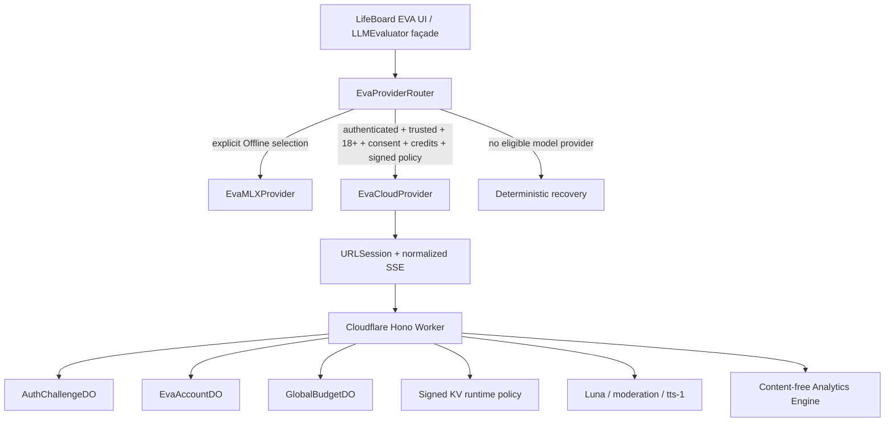

# Cloud EVA Product and Technical Guide

**Product role:** LifeBoard's user-controlled Chief of Staff  
**Implementation status:** Complete architecture; staging end-to-end qualification in progress  
**Text provider:** OpenAI [`gpt-5.6-luna`](https://developers.openai.com/api/docs/models/gpt-5.6-luna)
**Spoken output:** OpenAI [`tts-1`](https://developers.openai.com/api/docs/models/tts-1), `nova`; no cloud speech-to-text or full duplex
**Last verified:** 2026-08-19

## Product promise

EVA helps a person understand what matters, turn ambiguity into a workable plan, and recover when reality changes. It is not an autonomous operator. It explains, answers, classifies, breaks work down, and prepares bounded proposals; the person reviews meaningful changes through LifeBoard's canonical Apply/Edit/Not Now, receipt, and Undo paths.

Cloud EVA extends that experience with Luna while preserving Offline EVA through MLX and deterministic fallbacks. Cloud is explicit, 18+, account-based, consent-scoped, credit-controlled, and independently disableable. Ordinary LifeBoard remains useful without it.

## What ships in the implementation

### Text intelligence

- Free-text conversation with moderated streaming, grounded in a typed context
  envelope rather than a plain-text summary.
- Planning and one bounded structured repair.
- Field suggestions and dynamic prompt chips.
- Explicit top-three prioritization and task breakdown.
- A daily brief that separates what is fixed from what is suggested, names one
  explicit tradeoff, and cites the records it rests on.
- Universal-input classification after submission; live preview stays deterministic.
- Journal, Knowledge, and Siri/Shortcuts answers using only authorized projections.
- A debug smoke route for qualified non-production environments.

All structured routes use route-specific schemas and semantic validation. Model output cannot invent context identifiers or obtain mutation authority. No OpenAI tools, browsing, file search, or autonomous app actions are enabled.

### Spoken output

The person may request an AI-generated reading of a successful answer. The first rendering is included through a signed, single-use speech ticket. PCM is streamed into a centralized Apple audio-session arbiter, with play/pause/resume/stop/replay, interruption and route-change handling, headphone-disconnect pause, and recording arbitration. A protected local 100 MB/30-day LRU supports free replay. Text and TTS have independent kill switches.

### Account and trust

- Sign in with Apple, rotating 15-minute access/30-day refresh sessions, reuse detection, logout, revocation observation, and recently reauthenticated deletion.
- App Attest on physical iOS, with exact request binding and counter replay protection.
- Signed App Transaction risk evidence and lower limits on Catalyst.
- Apple Declared Age Range with a per-device 18+ lease, refreshed within 24 hours.
- Account-wide consent revisions, credits, and request/speech idempotency.

### Context controls

Base context may include the prompt, typed task records, projects and life areas,
habits with their recent history, capacity for the day, goals, the day-loop
state, the weekly retrospective the person wrote, a read-only calendar
projection, executive/slash-command state, and bounded chat history. Journal,
health, Life Moments, and personal memory remain separate, off-by-default grants.
Revocation is authoritative on the server before the next accepted request on any
device.

Two properties are worth being precise about, because the first is easy to
overstate and the second is easy to miss:

- **The envelope is typed, not free-form.** Every category has a schema in
  `Shared/EVACloudContracts/src/context.ts`, so a client projection that drifts
  fails at the request boundary instead of quietly degrading answers.
- **Size is governed by the server, not the phone.** The client reads
  `RoutePolicy.inputTokenCap` from the signed configuration. Offline EVA keeps its
  own, much smaller per-model budgets, and the resolver fails closed to those
  whenever a cloud turn cannot be positively confirmed.

## User journeys

### Activate Cloud EVA

Activation happens inside app onboarding, as an optional step in the connect
chain after the Life Map reveal. There is no separate EVA activation flow: the
EVA tab opens straight into chat.

1. The person reaches the EVA step and reads the private-context and AI-processing disclosure.
2. Sign in with Apple establishes a pseudonymous account.
3. The app qualifies device trust and asks Apple for an 18+ age-range result.
4. The app force-refreshes signed configuration, then loads consent and credits.
5. Sensitive-context grants are then offered as off-by-default toggles. Skipping them is the expected path — a fresh account bootstraps at revision 0 with no grants, which is already sufficient for chat — and each toggle is a compare-and-swap on the server revision, so it is written one at a time and never retried.
6. If all gates pass, Cloud EVA becomes available and onboarding stages opening prompts composed from the person's own Life Map answers. Otherwise the exact failed gate is shown with an explicit recovery path; Offline EVA remains available from Settings.

Declining or deferring is a first-class outcome: the prompts are staged either
way, and the EVA tab offers connection inline rather than reopening setup.

### Ask and review

1. The app builds a bounded context projection using the current consent revision.
2. The provider router selects cloud once for this request.
3. The Worker validates body, identity, trust, age, policy, route, consent, rate, credits, and budget.
4. Input plus projected context is moderated as untrusted content.
5. Luna streams safe text or returns one validated structured object.
6. Credits commit only for a nonempty, nonrefusal, valid result.
7. Any proposal still passes through LifeBoard's review/apply boundary.

### Recover

- Expired session: refresh or sign in again.
- Stale age lease: request a new Apple range.
- Stale consent: reload the authoritative revision.
- Disabled/degraded policy: show its maintenance reason and offer explicit Offline EVA.
- No credits: show balance and refill time; never loop retries.
- Provider/cancellation/schema failure: release credit/cost reservations and preserve settled client state.
- TTS unavailable: keep text fully usable.

## Architecture



`LLMEvaluator` remains the observable UI façade, limiting feature churn. The router never switches provider mid-response. Offline MLX is permanent and explicit, not an invisible error fallback.

## Request admission model

```text
body ceiling → schema → rate limit → access token → platform trust → age lease
→ signed policy/route → consent revision → credit reserve → cost reserve
→ moderation → Luna/repair → output moderation/schema/semantics
→ credit and cost commit → optional speech ticket
```

Any failed gate returns a stable error and avoids billable upstream work. Request IDs make the account lifecycle idempotent across replay, disconnect, retry, repair, and Durable Object alarms.

## Safety model

- Projected records are delimited untrusted input, never developer-authority instructions.
- All model-visible text is moderated without logging it.
- High-risk self-harm content uses a dedicated supportive policy; EVA does not monitor, diagnose, or contact emergency services.
- Streaming text is held in bounded segments and moderated before release; structured output is buffered and moderated completely.
- Refusal, incomplete output, final schema/semantic failure, cancellation, or provider failure releases reservations.
- Luna has no mutation tools. LifeBoard canonical validators and explicit user approval remain the action boundary.

## Economics and credits

Credits make use understandable; cost fuses protect the service. A new account has 100 credits and gains 20 per complete elapsed 24-hour interval, capped at 100. User credits and dollar budgets are independent ledgers: one successful billable answer commits one user credit, while maximum attempt-graph cost is reserved globally/account-wide and actual usage is committed from provider telemetry.

Classification, suggestions, chips, repairs, retries, failures, cancellation, deterministic work, and Offline EVA are unmetered. Current pricing is versioned server policy and must be verified against the real OpenAI project before an environment is enabled.

## Environment and rollout posture

- Debug builds use the staging `workers.dev` origin and staging Ed25519 pin. As of 2026-08-17, all staging text routes and TTS are enabled for end-to-end testing.
- Release builds use `https://api.getlifeboard.app` and the production pin. Production cloud and TTS remain disabled.
- Runtime policy controls text state, every route, and TTS independently. A higher-version signed policy is the first rollback mechanism.
- The marketing apex and `www` continue to serve GitHub Pages and are operationally separate from the `api` Worker hostname.

## Product quality scorecard

| Dimension | Launch measure | Guardrail |
|---|---|---|
| Activation | Qualified users reaching first answer | Exact gate-specific recovery; no trust bypass |
| Utility | Answer helpfulness, proposal accept/edit rate | No autonomous mutation |
| Grounding | Share of answers naming a real task, project, or habit from the supplied context | An answer that cannot cite a supplied signal is a generic answer, and token count alone does not detect it |
| Subtraction | Share of over-committed days where the answer proposes deferring or dropping work | Capacity before ambition: a denser plan for an impossible day is a failure, not a helpful response |
| Reliability | Completion, cancellation reconciliation, schema validity | ≥99.5% structured validity after one repair |
| Speed | Classifier, text TTFT, TTS first audio | p95 ≤1.5s, ≤5s, and ≤3s respectively |
| Trust | Consent comprehension, Offline selection, deletion success | No private content in logs/storage |
| Economics | Cost/success, cache efficiency, budget headroom | Account/global hard fuses and approved pricing; `cachedInputTokens` staying substantial on second turns |
| Accessibility | VoiceOver/Dynamic Type/keyboard/audio-control journeys | No capability depends on inaccessible disclosure or control |

## Known release gaps

- Complete a fresh physical-iPhone staging run through current 18+ lease, credits, consent, refresh, first Luna response, and TTS.
- Qualify real Sandbox and Production Catalyst App Transaction chains.
- Observe live route evaluation and 10× launch load thresholds.
- Record OpenAI Zero Data Retention status and complete privacy/threat-model/App Store/TestFlight gates.
- Observe the protected remote CI and staged production rollout.

See `EVA_CLOUD_MIGRATION_TODO.md` for the authoritative ledger, `API_CONTRACT.md` for the wire boundary, `BACKEND_RUNBOOK.md` for operation, `PRIVACY_AND_DATA_FLOW.md` for data controls, `INCIDENT_RUNBOOK.md` for response, and `RISK_REGISTER.md` for open exposure.
