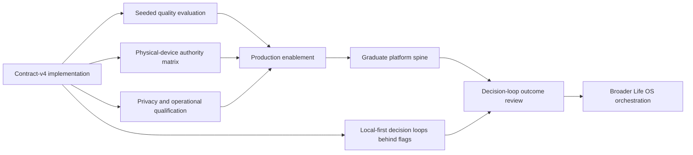

# Eva roadmap status and gap analysis

**Classification:** Canonical current-state report
**Audience:** Product, design, engineering, privacy/security, QA, release, support, and leadership
**Status date:** 25 August 2026
**Roadmap authority:** [Eva intelligence roadmap](EVA_INTELLIGENCE_ROADMAP.md) and [Life OS product roadmap](LIFE_OS_PRODUCT_ROADMAP.md)
**Delivery authority:** [Cloud migration TODO](EVA_CLOUD_MIGRATION_TODO.md)

## Executive summary

Eva is at the roadmap's **production enablement prepared; qualification exception requested** stage. The core intelligence and authority architecture is implemented and documented. Make It Fit Today, Friction Detective, and Weekly Reset now default on in Debug and Release and each also respects an independent signed `appRuntime` kill switch. Version-controlled staging policy v3 and production policy v2 are validated for all supported routes, TTS, and 100% guest rollout, with higher-version disabled rollback policies prepared.

Cloud publication is not complete. The 25 August remote preflight found that both Cloudflare environments lack `APPLE_DEVICECHECK_KEY_ID` and `APPLE_DEVICECHECK_PRIVATE_KEY_P8`. The runbook treats that as an authentication/trust deployment blocker, so the current staging v2 policy and production disabled fallback remain live. The requested 100% exposure is therefore prepared, not claimed as production-enabled.

The roadmap should be read as follows:

| Roadmap layer | Current state |
|---|---|
| Intelligence and authority foundation | Implemented in code and documented |
| A — Navigator and actuator | Implemented; full physical-device and adversarial qualification remains |
| B — Ask my life | Retrieval/evidence foundation implemented; answer-quality graduation remains |
| C — Differentiated intelligence | First three decision loops implemented and presentation-enabled by default; cloud qualification and rollout remain |
| Horizon 0 — Trustworthy production launch | In progress |
| Horizons 1–4 | Future product delivery |

The immediate challenge is qualification, not another architecture rewrite. After qualification, the strategic gap is productization: turning the foundation into a small number of distinctive decision loops that a generic chatbot cannot reproduce.

## Status vocabulary

Use these labels consistently in planning, release notes, reviews, and support material:

| Label | Meaning |
|---|---|
| **Defined** | Product, authority, context, UX, and measurement contract are documented |
| **Implemented** | The capability exists in the current source tree with relevant automated coverage |
| **Staging-qualified** | Integrated real-device/staging evidence meets the approved gates |
| **Production-enabled** | Signed production policy permits the capability for at least one cohort |
| **Graduated** | The capability meets product outcome, trust, reliability, and operational thresholds at its intended exposure |

“Implemented” must never be used as a synonym for “available in production.” A shared platform primitive may be implemented while its complete user-facing product arc remains only defined.

## Where we are

### Platform spine

The five compounding platform assets anticipated by the roadmap now exist:

1. **Shared life ontology:** typed references for records, destinations, evidence, actions, and results.
2. **Context compiler:** route manifests, typed and semantic retrieval, consent/protection/exclusion checks, selection provenance, and one whole-turn budget.
3. **Authority kernel:** local risk policy, resolvers, domain executors, idempotent action runs, receipts, and undo.
4. **Correctable personalization:** confirmed memory, provenance, correction/deletion controls, and cross-surface evidence exclusions.
5. **Evaluation foundation:** route corpus, contract fixtures, subtraction/exclusion requirements, content-free telemetry definitions, and release gates.

This moves Eva beyond an MLX-era chat prompt. The cloud model can reason over a richer view of the current decision while the device retains authority over data access, identity, navigation, and mutation.

### Roadmap sequence

#### A — Navigator and actuator

**State: implemented, not fully qualified.**

Navigation has closed targets, durable references, local resolution, protected Journal routing, ambiguity handling, and shared Swift/TypeScript drift fixtures. Capture has deterministic-first interpretation, strict cloud commands, local domain authorization, persisted action runs, receipts, and time-bounded undo.

The remaining gate is integrated proof across every destination and capture family on physical devices, including malformed, ambiguous, protected, duplicate, persistence-failure, relaunch, and undo scenarios.

#### B — Ask my life

**State: foundation implemented; quality graduation pending.**

Eva can assemble route-relevant tasks, capacity, calendar constraints, goals, habits, day-loop state, retrospective, Knowledge, and explicitly authorized personal evidence. It can attach stable evidence references and remove excluded records before generation.

The remaining gate is a seeded evaluation showing that richer context improves decisions: required evidence is retrieved, irrelevant evidence does not distort the answer, excluded evidence has no influence, overloaded plans cause subtraction, and material claims remain traceable.

#### C — Differentiated intelligence

**State: first connected arc implemented and presentation-enabled by default; Cloud EVA not production-enabled.**

Make It Fit Today, Friction Detective, and Weekly Reset with EVA now exist as local-first product rituals that default on in both app configurations. Their promoted local flags and signed runtime switches must both permit presentation, preserving three independent remote kill switches without making offline use depend on Cloud EVA. They use canonical capacity and weekly planning, evidence/choice/preview/receipt states, IDs-only draft restoration, local-only structured friction findings, corrected Carry/Later/Release semantics, and deterministic Undo. See [EVA Decision Loops implementation](EVA_DECISION_LOOPS_IMPLEMENTATION.md).

Drift Report, habit timing coaching, Scenario Studio, Life Moments pressure, onboarding continuity, and broader orchestration remain defined future arcs.

### Production posture

- Debug continues to use staging; Release continues to use production. There is no separate Production Xcode configuration.
- The desired staging v3 policy enables all 16 routes including `debugSmoke`; the desired production v2 policy enables the 15 supported user/helper routes and excludes `debugSmoke`.
- The live production endpoint remains fail-closed until the missing DeviceCheck secrets are provisioned and staging verification passes.
- Production enablement is requested at 100%, but will be recorded as production-enabled—not graduated—only after the signed policy is actually published and verified.
- The worker supports contract versions 1–4 and emits contract v4 for current clients.
- Signed runtime configuration schema v2 owns provider, route, quota, model, rollout, and kill-switch policy.
- Offline Eva remains explicit; a failed cloud turn never silently switches providers.
- Ordinary LifeBoard remains usable without either model provider.

## What is done

### Product contract

- Eva's job is defined as capture, find, understand, decide, and recover—not open-ended autonomous operation.
- Answer, clarification, navigation, direct capture, proposal, and limitation/recovery are distinct response types.
- Completed, proposed, failed, stopped, unavailable, and undone states have separate UX semantics.
- Direct capture is a narrow exception to proposal-first behavior, not a general permission.
- Memory is user-owned and correctable.
- Evidence and exclusions are part of the trust contract.
- Proactivity is scarce, dismissible, and governed outside the model.
- Success measures meaningful outcomes rather than messages, session length, or assistant streaks.

### Context and prompting

- Contract v4 requires temporal/surface turn context and selection reasons.
- All 16 semantic routes and 13 context categories have typed contracts.
- The route manifest is a deny-by-default upper bound.
- Journal, health, Life Moments, and personal memory remain independently consent-gated.
- Planning and Knowledge use typed/semantic selection.
- Journal retrieval adds local evidence permission and entry-level protection.
- Context is allocated globally and drops complete records rather than truncating identifiers.
- Stable doctrine, route instruction, fenced preferences, untrusted evidence, messages, and output schema form explicit prompt layers.
- Legacy conversation-summary transport is prohibited in contract v3 and later.

### Navigation and authority

- The cloud returns closed navigation intent, never arbitrary application routes.
- General destinations and named records are resolved locally.
- Ambiguous, protected, missing, archived, and stale references fail safely.
- The cloud cannot write LifeBoard state.
- Local policy and domain executors remain the mutation boundary.
- Broader task/planning changes retain editable proposal and apply flows.

### Direct capture

- Deterministic interpretation runs before cloud interpretation.
- Current allowlisted domains are body mass, notes, Journal append, hydration, mood, tracker delta, and life moments.
- Direct execution is current-day, same-kind, reversible, and limited to at most three actions.
- Medication/dose, nutrition/calories/fasting, historical/future, destructive, invalid, and broader mixed requests cannot auto-apply.
- Successful actions persist a typed assistant-action run, exact result reference, receipt, and 30-minute undo.
- Network or model success is never displayed as mutation completion before local persistence succeeds.

### Memory, evidence, and proactivity

- Memory candidate and confirmed memory are separate states.
- Confirmation, editing, provenance, correction, supersession, deletion, and cloud-disable controls are defined.
- Repetition cannot silently promote an inference into memory.
- Evidence Lens exclusions operate before generation across Eva, Insights, and Home.
- One Insight identity supports multiple presentation densities and one dismissal state.
- The proactive governor enforces a maximum of two deliveries per day, a 0.65 probability floor, quiet hours, and 21-day topic dormancy after two dismissals.

### Operations and documentation

- Runtime policy provides independent cloud, route, guest, Apple-link, and TTS controls.
- Backend, privacy, incident, risk, API, context, authority, memory, evaluation, and roadmap documentation are reconciled.
- Content-free operational telemetry and trace identifiers are defined.
- Production release gates and incident containment paths are documented.
- Shared contract typecheck and contract tests pass; cross-document links and route/category coverage are validated.

## Decisions taken

### D1 — Larger context is for better evidence, not bulk transfer

Provider capacity does not relax minimization. Every record must be route-eligible, authorized, protected, relevant, budget-admitted, and accompanied by selection provenance.

### D2 — Cloud reasons; device authorizes and acts

Cloud output is untrusted interpretation. The device owns consent, identifiers, navigation resolution, risk classification, validation, persistence, receipts, and undo.

### D3 — Authority is tiered

Eva chooses the lowest-authority result that completes the job. A request for explanation must not become a mutation. A narrow reversible capture need not be forced through an unnecessarily heavy proposal flow.

### D4 — No generic agent tool bus

Each write domain independently earns authority through a closed schema, local executor, validation, reversibility, idempotency, activity history, and kill switch. Authority in one domain never transfers to another.

### D5 — Deterministic-first for common actions

Exact navigation and common captures should stay local when safe. Cloud interpretation is used when broader language understanding creates value.

### D6 — Route eligibility is not consent

A category appearing in a route manifest only makes it technically eligible. Sensitive categories still require a current grant and local record-level eligibility.

### D7 — Memory is user-owned

The model may normalize a candidate, but only a local user-confirmed transition creates durable memory. Every confirmed item remains inspectable and removable.

### D8 — Exclusion removes influence, not just presentation

“Don't use this signal” is enforced in the shared projection layer. Hiding a citation after generation is not an acceptable implementation.

### D9 — Interruption authority is deterministic

The model cannot increase notification frequency or override quiet hours, dismissal dormancy, consent, or the useful-probability floor.

### D10 — Provider and contract versions are independent

Wire contract, prompt policy, planner schema, runtime-config schema, and model identity evolve separately. Compatibility and release decisions must name the relevant version domain.

### D11 — No silent provider fallback

Cloud and Offline Eva are explicit choices. A cloud failure may offer Offline Eva, but it never resends the accepted turn to another provider without user action.

### D12 — Outcomes, not engagement, define success

Primary outcomes are grounded useful completion, correct destination, unreversed capture, productively accepted/edited decision, fewer repeated corrections, and helpful action per interruption.

## What is left

### P0 — Qualify the platform spine

P0 is the critical path to any production cohort.

#### Physical-device and staging qualification

- [ ] Complete guest activation, trust, applicable age policy, consent, quota, refresh, first Luna answer, and TTS on physical iOS.
- [ ] Complete optional Apple linking, consent intersection/re-review, session migration, reinstall recovery, and recently reauthenticated deletion.
- [ ] Pass real Sandbox and Production Catalyst App Transaction chains.
- [ ] Exercise every navigation target through exact, ambiguous, missing, stale, archived, excluded, and protected outcomes.
- [ ] Exercise every capture family through success, value boundaries, escalation, malformed output, duplicate retry, persistence failure, relaunch, receipt, and undo.

#### Intelligence-quality qualification

- [ ] Establish a versioned baseline for the current model, prompt policy, retrieval policy, and route manifest.
- [ ] Run required-context recall and irrelevant-context resistance cases.
- [ ] Run grounding and evidence-open cases.
- [ ] Run subtraction cases proving conclusions depend on admitted evidence.
- [ ] Run exclusion cases proving rejected evidence has no influence.
- [ ] Run prompt-injection fixtures inside every retrievable record type.
- [ ] Verify overcommitted planning produces keep/drop/defer tradeoffs rather than denser plans.
- [ ] Reconcile token/cache usage and provider cost against signed pricing policy.

#### Memory, evidence, and proactive qualification

- [ ] Qualify memory confirmation, editing, conflict correction, supersession, deletion, export, and cloud-disable flows.
- [ ] Prove exclusions propagate across Eva, Insights, Home, and derived summaries.
- [ ] Validate proactive consent, probability floor, quiet hours, daily cap, dismissal dormancy, duplication, and lock-screen privacy.

#### Operations, privacy, and release qualification

- [ ] Establish route-level availability, context, authority, quality, privacy, and cost dashboards.
- [ ] Meet structured-validity and latency thresholds at 10× expected launch load.
- [ ] Complete OpenAI Zero Data Retention determination and keep disclosures aligned with the result.
- [ ] Complete privacy, threat-model, App Store, accessibility, localization, and TestFlight gates.
- [ ] Rehearse route, TTS, guest acquisition, guest inference, cloud, budget, and Worker rollback controls.
- [ ] Observe a clean protected remote CI run.

#### P0 exit criteria

- No unresolved sensitive-context or authority hard failure.
- Route-specific offline evaluation meets approved bands.
- Real-device degraded and recovery states are accurate and accessible.
- Accounting and provider usage reconcile.
- Dashboards and alerts lead to rehearsed runbook actions.
- Each capability can be disabled independently.
- Product, engineering, privacy/security, QA, and release owners approve exposure, or the accountable release owner records a time-bounded exception that still preserves every zero-tolerance gate.

### P1 — Production enablement exception

- [ ] Provision the missing DeviceCheck secrets and pass the staging v3 deployment/smoke gate.
- [ ] Deploy production while fail-closed, verify the tested Worker, then publish production policy v2 directly at the release-owner-requested 100% guest rollout.
- [ ] Verify signature, environment, route/TTS policy, quota/accounting, telemetry, and rollback readiness immediately after publication.
- [ ] Hold the production-enabled, not-graduated state to a seven-day review on 1 September 2026.
- [ ] Preserve explicit Offline Eva and ordinary LifeBoard recovery throughout.

The direct 100% request is a time-bounded release exception to the normal internal → 5% → 25% progression. It does not waive signature, authentication, privacy, accounting, schema, or mutation-authority gates.

### P2 — Differentiated decision loops

Implementation sequence and current state:

1. [x] **Make It Fit Today:** compare ambition with capacity and turn overload into explicit keep/move/release choices.
2. [x] **Friction Detective:** explain repeated task replanning without causal overclaim and change one reversible condition.
3. [x] **Weekly Reset with EVA:** connect outcomes, carry-over, friction, and a separately confirmed next-week shape.
4. [ ] **Manual dogfood and qualification:** complete device, accessibility, privacy, migration, contract, and telemetry gates per ritual.
5. [ ] **Proactive EVA:** enable governed overload and friction suggestions only after manual reliability is demonstrated.
6. [ ] **Scenario Studio and broader drift coaching:** compare bounded alternatives and extend evidence-led diagnosis without mutating canonical state.

Each arc requires:

- a validated user decision and explicit non-goals;
- one declared authority level;
- eligible context, evidence, consent, and freshness rules;
- a dedicated deterministic service or route contract where needed;
- loading, empty, partial, stale, ambiguous, protected, offline, error, and recovery states;
- an evaluation corpus and measurable user outcome;
- content-free operational signals and an independent kill switch.

### P3 — Broader Life OS orchestration

Later investments include:

- cross-domain life questions;
- explicit Life Graph relationships;
- user-created playbooks and reusable workflows;
- cross-device receipt and undo convergence where repositories can guarantee it;
- more proactive surfaces after explanation and topic controls are proven;
- additional independently governed action domains;
- Portable Life Archive;
- capability SDK;
- selective coordination;
- improved local/cloud orchestration.

An open-ended agent with arbitrary tools, broad background autonomy, or one global “allow Eva to act” permission remains a non-goal.

## Critical path

Quality, authority, and privacy/operations are parallel P0 workstreams. None can be replaced by success in another workstream.

## Ownership

| Area | Accountable owner | Required decision |
|---|---|---|
| Product arc | Product | User job, authority level, UX, success and non-goals |
| Domain mutation | Domain engineering | Validation, transaction, reversibility, conflict behavior |
| Context and prompts | Intelligence platform | Manifest, retrieval, budgeting, schema, evaluation |
| Privacy and security | Privacy/security | Data classification, consent, retention, abuse, incident posture |
| Client experience | Design and Apple platform | State semantics, accessibility, recovery, local authority |
| Release | QA and release/operations | Evidence, dashboards, signed policy, load, rollback, cohort decision |

No capability graduates until these owners agree on its context, authority, degraded behavior, measurement, and kill switch.

## Reporting cadence

Update this report when any of the following changes:

- a capability becomes implemented, staging-qualified, production-enabled, or graduated;
- a route, context category, consent grant, write domain, or proactive rule changes;
- a P0 gate passes or fails materially;
- a production cohort changes;
- an incident changes a risk or release threshold;
- a differentiated product arc is approved, paused, or graduated.

Use [the migration TODO](EVA_CLOUD_MIGRATION_TODO.md) for detailed evidence tasks and this report for portfolio-level status. Historical unchecked items in the migration ledger may describe the same consolidated gate; they should not be counted as independent roadmap initiatives.

## Related documents

- [Eva documentation index](README.md)
- [Insights and Eva product specification](../product/INSIGHTS_AND_EVA.md)
- [Cloud Eva product and technical guide](CLOUD_EVA_PRODUCT_AND_TECHNICAL_GUIDE.md)
- [Context and prompt architecture](CONTEXT_AND_PROMPT_ARCHITECTURE.md)
- [Navigation and capture authority](NAVIGATION_AND_CAPTURE_AUTHORITY.md)
- [Memory, evidence, and proactivity](MEMORY_EVIDENCE_AND_PROACTIVITY.md)
- [Evaluation and observability](EVALUATION_AND_OBSERVABILITY.md)
- [Privacy and data flow](PRIVACY_AND_DATA_FLOW.md)
- [Risk register](RISK_REGISTER.md)
- [EVA Decision Loops implementation](EVA_DECISION_LOOPS_IMPLEMENTATION.md)
