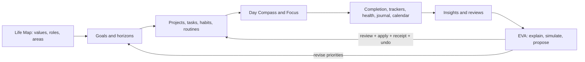

# EVA and the Ultimate Life OS — Product Roadmap

> **Implementation companion:** [Eva Intelligence Roadmap — from chat box to Life OS layer](./EVA_INTELLIGENCE_ROADMAP.md) defines the actuation, navigation, retrieval, evidence, and proactivity spine beneath these horizons.

> **Current-state report:** [Eva roadmap status and gap analysis](./EVA_ROADMAP_STATUS.md) distinguishes implemented foundations, production qualification, and future product arcs.

> **Classification:** Future product strategy. Nothing below is shipped unless the current Feature Catalog says so.  
> **Horizon:** 24 months, sequenced by trust and evidence rather than calendar promises  
> **Last grounded in code and product documentation:** 2026-08-21

## North star

LifeBoard should become the trusted operating system that closes one humane loop:

`intention → realistic commitment → focused action → honest evidence → reflection → adaptation`

The product already has unusually strong ingredients: a Life Map; canonical areas, projects, goals, tasks, habits, routines, trackers, calendar projections, Focus, Journal, Knowledge, health/wellness, Daily and Weekly recovery, Insights, system surfaces, and a proposal/receipt/Undo contract. EVA should connect these systems without becoming a surveillance layer or an unaccountable autopilot.

The north-star outcome is not time-in-app. It is: **people keep more of the commitments that matter, carry less impossible work, and can explain why the system suggested a change.**

## Strategic doctrine

1. **Evidence before inference.** Recorded facts, source provenance, and uncertainty must be distinguishable from model interpretation.
2. **Capacity before ambition.** EVA should subtract, defer, and renegotiate before manufacturing a denser plan.
3. **Authority follows risk.** Consequential changes use a visible diff and explicit Apply/Edit/Not Now. A narrow capture class may auto-apply only locally allow-listed, today-only, reversible batches of at most three same-kind writes, followed by a visible receipt and Undo.
4. **Local by default, cloud by choice.** Deterministic and local flows stay strong; remote categories remain independently granted.
5. **One life graph, many views.** Home, Plan, Track, Insights, EVA, widgets, Watch, and Shortcuts project canonical records rather than create rival truth.
6. **Calm over compulsion.** Optimize for relief, clarity, follow-through, and return-to-life—not streak anxiety, alerts, or chat dependency.
7. **Accessibility is operating-system behavior.** VoiceOver, Dynamic Type, keyboard, reduced motion, denied permissions, offline, and protected-data states are first-class modes.
8. **Trust compounds.** EVA earns broader help through proven accuracy, reversibility, transparent context, and successful deletion—not through a single onboarding consent.

## Product architecture of the future

The foundational technical bet is a privacy-classified, provenance-rich Life Graph composed from existing canonical repositories. It is not a giant cloud profile. Local graph edges describe relationships such as “task advances goal,” “habit supports outcome,” “meeting constrains day,” and “evidence changed this recommendation.” Remote projection remains narrow and request-scoped.

### Platform spine already implemented

The roadmap begins from an implemented contract-v4 spine: route-scoped typed context, hybrid Knowledge and authorized Journal retrieval, selection provenance, whole-record budgeting, closed navigation and capture schemas, durable record references, local authority policy, receipts and undo, correctable memory, cross-surface evidence exclusions, and a deterministic proactive governor. “Implemented” does not mean production-qualified; physical-device, privacy, quality, load, and staged rollout gates remain part of Horizon 0.

Portfolio reporting uses the labels defined in the current-state report: defined, implemented, staging-qualified, production-enabled, and graduated. Horizon descriptions are intended outcomes, not release claims.

## Horizon 0 — Make Cloud EVA boringly trustworthy

**Timing:** Now to six weeks  
**Promise:** The cloud option works predictably, explains why it cannot, and never jeopardizes local LifeBoard.

| Initiative | User outcome | Product/technical work | Success gate |
|---|---|---|---|
| Activation closure | Activate as a guest and understand every gate; optionally Protect & Sync with Apple | Physical iOS guest/App Attest/13+-policy/consent/quota/refresh test; optional Apple-link and Catalyst trust qualification; exact readiness UI | Qualified activation and first-answer completion; no generic dead ends |
| Route quality baseline | Every existing Eva job behaves at least as well as accepted local behavior | Privacy-safe corpus by semantic route; retrieval/subtraction/exclusion; authority; structured/semantic validity; refusal and cancellation tests | Approved route bands, no privacy/authority hard failures, and ≥99.5% valid repair-eligible structured results after one repair |
| Operational confidence | Failures are contained without app releases | Dashboards, alert thresholds, key-rotation drill, kill-switch drill, request/account reconciliation | Incident simulation passes; zero content in logs |
| Trust completion | Product claims match processor reality | ZDR decision, privacy labels/report, threat model, account deletion/revocation, consent comprehension test | Privacy/security/App Store approval |
| Controlled launch | Contain a release-owner-approved broad exposure | Default internal → 5% → 25% → 100%; current exception requests direct 100% after staging and zero-tolerance checks, with signed rollback and a seven-day review | Latency, safety, cost, helpfulness, and recovery thresholds hold before graduation |

Do not start a broad proactive-agent initiative before Horizon 0 closes. Reliability and trust are product features.

## Horizon 1 — The Daily Chief of Staff

**Timing:** Six weeks to three months after launch  
**Promise:** LifeBoard helps shape a believable day and recover it when reality changes.

### Day Compass

A concise morning briefing that integrates fixed calendar reality, planned work, habits/routines, energy preference, overdue risk, and one explicit tradeoff. It should say “what fits,” “what does not,” and “why”—then offer a reviewable day proposal.

- Enablers: existing daily brief, top-three, calendar projection, task planning, Focus Now, capacity settings, receipts.
- KPI: brief helpfulness; accepted-without-edit vs edited proposal; reduction in same-day overload.
- Guardrail: no inferred health state without a Health grant; no auto-scheduling.

### Momentum Rescue

When the day slips, EVA proposes a Minimum Viable Day: protect one commitment, shrink or defer another, and state the cost. This joins existing Overdue Rescue and planning repair into a single calm recovery language.

- Enablers: plan repair, task breakdown, overdue workspace, execution modes, canonical Undo.
- KPI: recovery completion within 24 hours; lower abandonment after overload.
- Guardrail: “do less” must be a valid successful outcome; never shame missed work.

### Evidence Lens

Every recommendation exposes the small evidence bundle behind it: calendar constraint, due date, task readiness, recent pattern, or user-stated preference. Users can correct the source or say “do not use this signal.”

- Enablers: existing evidence links, Insights provenance, consent policy, proposal rationale.
- KPI: “why this?” comprehension and correction success.
- Guardrail: correlation is not causation; sparse evidence is labeled.

### Weekly Reset with EVA

EVA prepares a reflection—not a report card—connecting planned versus actual work, unfinished commitments, wins, friction, and a proposed next-week shape.

**Implementation status (25 August 2026):** Implemented and enabled by default in Debug and Release together with Make It Fit Today and Friction Detective. Each retains an independent signed runtime kill switch. Review completion and next-week planning are separate commits. Cloud production publication and outcome graduation remain distinct; see [EVA Decision Loops implementation](./EVA_DECISION_LOOPS_IMPLEMENTATION.md).

- Enablers: This Week workspace, weekly reflection, Journal, goal and habit evidence.
- KPI: weekly plan completion quality and fewer endlessly carried items.
- Guardrail: protected Journal context is opt-in and never required.

## Horizon 2 — Life Graph and Personal Operating Manual

**Timing:** Three to six months  
**Promise:** LifeBoard understands relationships the user has explicitly established and helps make the system more coherent.

### Personal Operating Manual

A user-authored, editable guide to capacity, planning style, focus conditions, reminder tone, non-negotiables, recovery preferences, and context boundaries. EVA may suggest a revision from repeated evidence, but can never silently convert an inference into a preference.

- Data: versioned statement, user/inferred provenance, confidence, effective period, revision history.
- KPI: fewer repeated corrections; increased recommendation acceptance without broader data access.
- Guardrail: sensitive identity/ability claims remain private, tentative, and deletable.

### Life Graph v1

Add explicit links across existing entities: goal ↔ project, task ↔ milestone, habit/routine ↔ outcome, evidence ↔ insight, commitment ↔ person/role, and plan change ↔ reason/receipt.

- Technical sequence: portable identifiers → graph projection API → provenance and deletion semantics → local query/evidence engine → bounded cloud projection.
- KPI: percentage of active work with a meaningful parent/outcome; reduction in orphaned commitments.
- Guardrail: no inferred relationship becomes canonical without confirmation.

### Playbooks

Turn successful routines into reusable, branch-aware playbooks: “prepare for a client meeting,” “recover after travel,” “weekly household reset,” or “ship a release.” EVA can draft from selected past runs, then the user edits and saves a versioned routine.

- Enablers: current routines/runs, Knowledge templates, task breakdown, calendar constraints.
- KPI: reuse and completion with lower setup time.
- Guardrail: imported history is minimized; execution remains local and interruptible.

### Scenario Studio

Ask “What if I add this goal?”, “What if Tuesday disappears?”, or “Which commitment should move?” EVA simulates capacity and dependencies without changing the real plan. The output is a diff with assumptions and uncertainty.

- Enablers: project execution mode, dependencies, calendar, capacity, proposal schemas.
- KPI: avoided overload and scenario-to-plan conversion quality.
- Guardrail: simulated state is visually and structurally isolated from canonical state.

## Horizon 3 — Adaptive, permissioned Life OS

**Timing:** Six to twelve months  
**Promise:** LifeBoard notices useful moments without becoming noisy or manipulative.

### Quiet Autopilot

Despite the name, this is not general autonomy. It is a small rule engine for pre-approved, reversible, low-risk actions such as preparing—not applying—a morning plan, refreshing a local summary after calendar changes, or suggesting a reschedule after a missed Focus block.

- Each rule declares trigger, required context, allowed output, expiry, rate, notification policy, and revocation.
- Every execution has an activity-history event; mutations still require approval unless a future action class passes a dedicated risk review.
- KPI: useful proposal rate minus dismiss/snooze burden.

### Life Experiments

Users define a hypothesis such as “Two focus blocks before noon improve project progress,” choose a short period and evidence, then review results without causal overclaim. EVA helps design and summarize the experiment.

- Enablers: goals, trackers, Focus, habits, calendar, Journal, Insights.
- KPI: completed experiments and decisions made, not positive outcomes.
- Guardrail: health experiments stay non-clinical; no treatment or dosage advice.

### Energy-aware planning

With explicit Health/wellness consent, EVA may incorporate user-recorded energy, sleep availability, or recovery preferences to propose workload shape. It must never diagnose or present a biological score as destiny.

- KPI: plan adherence and self-reported fit.
- Guardrail: fully usable manual energy setting; protected data never required or shown on unsafe surfaces.

### Ambient continuity

Widgets, Watch, Siri/Shortcuts, notifications, Spotlight, and Live Activities should expose the smallest next useful action and safe status, not a duplicated mini-app. Spoken output can read a brief on demand; Apple remains the dictation/transcription stack.

- KPI: successful cross-surface completion and return-to-source fidelity.
- Guardrail: redacted projections, protected routes, no surprise private text.

## Horizon 4 — A user-owned Life OS platform

**Timing:** Twelve to twenty-four months  
**Promise:** People can extend, move, and selectively coordinate their system without surrendering ownership.

### Portable Life Archive

Versioned, documented export/import for canonical records, attachments, provenance, graph edges, consent, receipts, and deletion tombstones. A restore drill is a product ritual, not a backend checkbox.

### Capability SDK

A tightly scoped integration model where a capability declares readable projections, proposed actions, privacy class, platform support, and test fixtures. Third-party integrations never receive a general LifeBoard database handle or EVA prompt stream.

### Selective coordination

Household, partner, caregiver, or team coordination begins with individual object grants, ownership, revocation, and conflict history. Personal health, journal, and preference inference never bleed into shared work. Collaboration is a distinct system, not “share my Life Map.”

### Local/cloud intelligence orchestration

Choose execution based on privacy class, latency, device capability, user preference, and quality evidence. This may include stronger future local models, but the provider seam remains stable and the UI tells the truth about where work runs.

## Portfolio prioritization

Use a weighted decision score, with trust gates able to veto the score:

| Factor | Weight | Question |
|---|---:|---|
| User outcome | 25% | Does this reduce burden or improve a meaningful commitment? |
| Strategic compounding | 20% | Does it strengthen the Life Graph, evidence, or canonical action layer? |
| Trust and reversibility | 20% | Can the user understand, correct, revoke, delete, and undo it? |
| Reach and frequency | 15% | How many intended users encounter the problem, how often? |
| Evidence quality | 10% | Can we know whether it helped without invasive analytics? |
| Cost and feasibility | 10% | Is latency/economics/engineering sustainable? |

Privacy, safety, accessibility, data migration, and rollback are pass/fail gates, not score bonuses.

## Metrics tree

### North-star measures

- Meaningful commitments completed or consciously renegotiated.
- Weekly plan realism: planned load versus completed/deferred-with-reason.
- Recovery success after an interrupted or overloaded day.
- User trust: context comprehension, correction, revocation, and deletion success.

### EVA product measures

- Time from activation to first useful answer.
- Answer helpfulness and “why this?” comprehension.
- Proposal accept/edit/decline rate and successful Undo.
- Repeat correction rate by recommendation type.
- Explicit Offline EVA use and successful recovery from cloud failure.
- Navigation success/disambiguation and capture correction/undo rates.
- Memory correction/deletion and proactive helpful-action-per-interruption.
- Safety/refusal/schema-repair rates by route.

### System health measures

- Availability, TTFT, completion latency, TTS startup, cancellation reconciliation.
- Credit accuracy and surprise-charge reports.
- Cost per successful outcome, cache efficiency, and budget headroom.
- Accessibility journey completion and localization defects.
- Zero prohibited content in logs/retained backend state.

Do not use messages sent, session duration, notification opens, streak length, or raw context volume as primary success measures.

## Discovery and experiment queue

1. Interview users after an overloaded-day recovery; map decisions they needed, not features requested.
2. Prototype three Day Compass densities and test whether people can identify the main tradeoff in ten seconds.
3. Compare Evidence Lens explanations: source list, short causal narrative, and visual constraint map.
4. Test consent by asking participants to predict exactly which data a sample request would send.
5. Measure proposal edits to discover where EVA misunderstands duration, energy, priority, or role.
6. Run willingness-to-pay research only after cost-per-success and trust are stable; do not let credit mechanics become accidental pricing strategy.
7. Diary-study Offline EVA versus Cloud EVA choices to learn when privacy, speed, quality, and connectivity matter.

## Deliberate non-goals

- No full-duplex companion or always-listening microphone.
- No silent external messages, purchases, bookings, cancellations, health actions, financial actions, or destructive mutations.
- No raw Journal/Health/Knowledge bulk upload “for personalization.”
- No hidden background goals, emotional dependency tactics, social comparison feed, or productivity shame.
- No diagnosis, therapy replacement, emergency monitoring, investment/tax/legal advice, or employee/student scoring.
- No general-purpose agent toolset until each action domain has explicit authority, preview, idempotency, partial-failure semantics, activity history, and revocation.
- No team/family sharing built atop personal account access; selective collaboration needs its own model.

## Graduation gates

An initiative moves from roadmap to current capability only when it has:

1. Validated user problem and explicit non-goals.
2. Canonical schema, ownership, migration, provenance, deletion, export, and conflict behavior.
3. Threat model, consent model, privacy labels, safety policy, and processor review.
4. Empty, loading, stale, offline, denied, protected, partial, and error states.
5. Accessibility and platform qualification.
6. Deterministic fixtures, adversarial tests, evaluation thresholds, operational signals, kill switch, and rollback.
7. Product evidence that it improves a meaningful outcome without unacceptable burden or trust cost.

This roadmap complements the broader `docs/product/LIFEOS_FUTURE_BLUEPRINT.md`. The blueprint defines complete future domains; this document sequences EVA and intelligence investments that compound the LifeBoard system already present in code.
