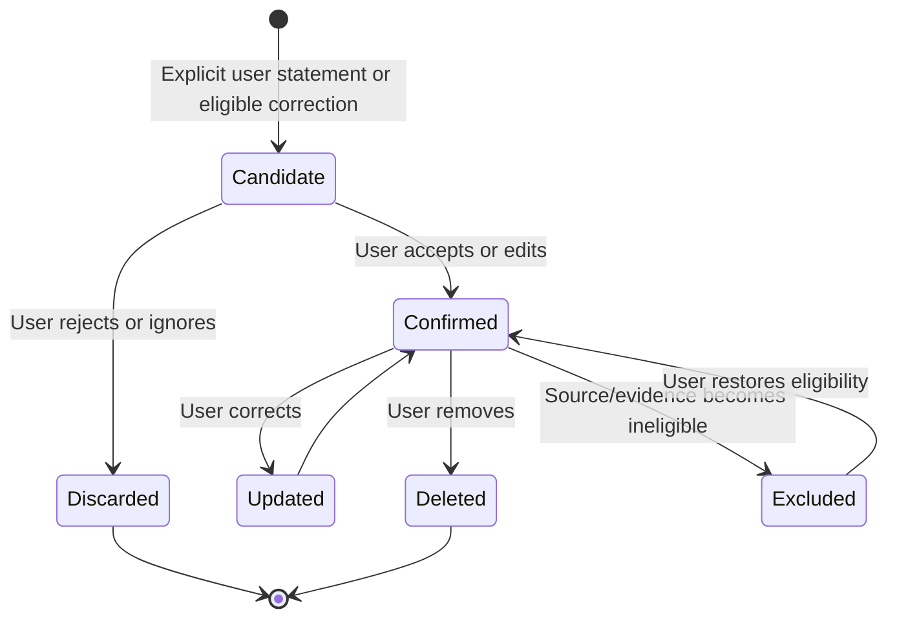

# Eva memory, evidence, and proactivity

**Audience:** product, design, client, privacy, support, applied AI, and QA
**Status:** canonical product and data contract
**Verified against implementation:** 21 August 2026

## Purpose

Personalization becomes useful when Eva can retain durable context, show the evidence behind its claims, and surface help at the right moment. It becomes unsafe when inference is mistaken for fact, exclusions are bypassed, or notifications turn into pressure. This document defines the trust model for those three connected systems.

## Memory model

Eva memory stores a small set of durable, user-correctable facts or preferences—not a hidden transcript archive and not a generic embedding store.

Examples of appropriate memory:

- preferred planning style or time of day;
- recurring constraint such as “avoid scheduling focused work after 6 pm”;
- stable preference such as concise daily briefs;
- an explicitly confirmed long-term responsibility relevant to planning.

Examples that should not become durable memory automatically:

- a mood or temporary condition;
- a speculative personality label;
- health inference;
- content from a protected or excluded record;
- a fact mentioned by the assistant rather than the user;
- a detail relevant only to the current conversation.

## Memory lifecycle

The cloud `memoryCandidate` route may normalize a candidate into a typed, concise statement. It cannot persist the memory. The device presents the candidate, applies user edits, and owns confirmation and deletion.

## Provenance and correction

Each confirmed memory retains:

- stable memory ID;
- normalized statement;
- category or scope;
- provenance type and eligible source reference where applicable;
- creation and last-confirmed timestamps;
- correction or supersession relationship;
- cloud-use eligibility and user controls.

If the user says “that is wrong,” “don’t remember this,” or provides a conflicting durable fact, Eva should offer to correct or remove the specific memory. Repetition is not consent: repeated inference must never silently promote a candidate to confirmed memory.

Users must be able to inspect, edit, delete, and disable cloud use of memories. Deletion removes the memory from future context projections and derived local indexes according to the privacy deletion contract.

## Evidence Lens

Evidence Lens is the shared provenance layer for answers and proactive insights. It lets users understand why Eva made a claim and open the underlying record when eligible.

An evidence reference includes a stable local record reference, a safe label, relevance/provenance metadata, and availability state. It does not copy an entire source record into the rendered insight.

### Exclusion invariant

An exclusion made in Evidence Lens is enforced in the projection layer used by:

- Eva context assembly;
- Insights;
- Home projections;
- derived evidence summaries.

This is stronger than hiding a citation after generation: excluded data must not influence the generated conclusion. Restore reverses the exclusion only after explicit user action.

Protected or deleted evidence is treated as unavailable. The UI must not replace it with a similarly named record or reveal protected preview content.

## Insight model

An insight is an evidence-backed, non-mutating observation or suggestion. Its shared model should capture:

- identity and insight kind;
- concise headline and supporting explanation;
- confidence or eligibility score used by policy, not overstated as certainty;
- evidence references;
- optional safe call to action;
- created, surfaced, dismissed, acted-on, and expiry state;
- presentation density for compact, standard, and expanded surfaces;
- provenance and model/policy version necessary for evaluation.

Insights never apply changes by themselves. A call to action may navigate, open evidence, or begin a separate proposal flow.

### Presentation contract

- Lead with the useful observation, not “AI discovered.”
- Separate observed facts from interpretation and suggestion.
- Show evidence without forcing expansion.
- Make dismissal immediate and non-judgmental.
- Avoid streak loss, guilt, urgency, or medical certainty language.
- Preserve a calm empty state when no qualified insight exists.

## Proactive governor

The proactive governor is deterministic policy around candidate insights and notifications. Model confidence alone cannot authorize interruption.

Current hard limits:

- at most two proactive surfaces per user per day;
- minimum candidate probability of 0.65;
- 21-day dormancy for a topic after two dismissals;
- quiet hours suppress interruptive delivery;
- consent, category eligibility, evidence availability, freshness, and duplication checks must all pass.

The daily maximum is a ceiling, not a target. Zero notifications is correct when nothing is sufficiently useful.

### Candidate decision order

1. Verify feature and notification settings.
2. Reject sensitive or excluded evidence without current authorization.
3. Reject stale, duplicate, expired, or low-confidence candidates.
4. Apply dismissal dormancy and quiet hours.
5. Apply daily frequency cap.
6. Choose the least interruptive eligible surface.
7. Record the content-free decision outcome for evaluation.

## Privacy and safety

- Memory is locally authoritative and cloud inclusion requires the `personalMemory` grant.
- Candidates and confirmed memories are different data classes; neither is inferred consent for sensitive categories.
- Journal, health, and life-moment content cannot become memory through a side channel.
- Analytics record outcome categories and counts, not memory statements, evidence text, or journal content.
- Notification previews must respect device lock-screen privacy and app protection settings.
- Export and deletion must include confirmed memory and its local provenance metadata.

## Success measures

| Dimension | Measure | Guardrail |
|---|---|---|
| Memory usefulness | Fewer repeated preference corrections; accepted candidate rate | No growth in unwanted-memory deletion rate |
| Correctability | Time and taps to inspect/edit/delete | 100% of confirmed memories remain user-editable |
| Grounding | Evidence-supported claim rate | Zero influence from excluded evidence in subtraction tests |
| Insight usefulness | Open/action rate and explicit helpfulness | Dismissal and disable rates stay within qualification bands |
| Proactivity | Helpful action per interruption | Never exceed frequency, quiet-hour, or dormancy policy |

## Acceptance tests

- [ ] A memory candidate cannot persist without a local confirmation path.
- [ ] Edit, supersede, delete, export, and cloud-disable flows are covered.
- [ ] Conflicting statements prompt correction instead of silent accumulation.
- [ ] Excluding evidence changes the generated result in subtraction tests.
- [ ] Excluded records remain absent from Eva, Insights, and Home projections.
- [ ] Protected and deleted evidence render as unavailable without leaking content.
- [ ] Two dismissals activate 21-day topic dormancy.
- [ ] The daily cap, probability floor, quiet hours, and consent checks are deterministic.
- [ ] VoiceOver identifies insight state, evidence controls, dismiss, and actions.
- [ ] Telemetry contains no memory statement or evidence body.

## Related documents

- [Context and prompt architecture](CONTEXT_AND_PROMPT_ARCHITECTURE.md)
- [Privacy and data flow](PRIVACY_AND_DATA_FLOW.md)
- [Evaluation and observability](EVALUATION_AND_OBSERVABILITY.md)
- [Insights and Eva product specification](../product/INSIGHTS_AND_EVA.md)
