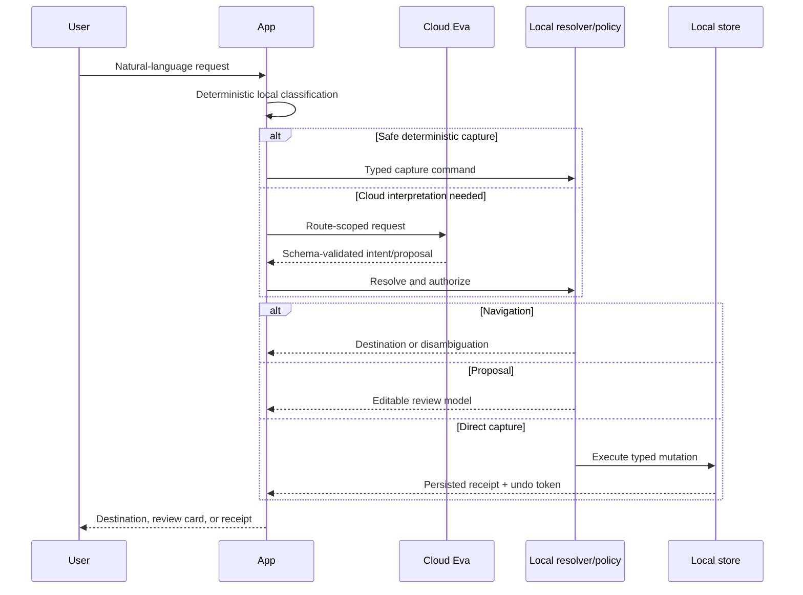

# Eva navigation and capture authority

**Audience:** product, design, client, backend, privacy, support, and QA
**Status:** canonical safety and interaction contract
**Verified against implementation:** 21 August 2026

## Product principle

Eva may use cloud intelligence to understand language and propose a typed intent. The device decides whether that intent maps to a real destination or an authorized mutation. This separation combines broad reasoning with a narrow, testable authority boundary.

Three rules govern the experience:

1. **Cloud reasons; device resolves and acts.** The model never receives general database authority.
2. **Ambiguity becomes a choice, not a guess.** Similar records produce disambiguation UI.
3. **Immediate writes are narrow and reversible.** Everything else remains a proposal or requires review.

## Authority levels

| Level | Meaning | Examples | UX requirement |
|---|---|---|---|
| Read-only answer | No app state changes | Explain a pattern, summarize a plan | Evidence links where applicable |
| Navigation | Opens an existing app surface or locally resolved record | “Open my weekly review” | Clear destination; disambiguate uncertainty |
| Proposal | Structured changes awaiting user approval | Create a multi-step plan, reschedule several tasks | Editable review before commit |
| Direct capture | Allowlisted local append/write with bounded fields | “Log 500 ml water” | Immediate receipt and undo |
| Prohibited | Not available through Eva | Medication dosing, destructive bulk action, security changes | Explain limitation; offer safe manual path |

## End-to-end flow

## Navigation contract

The navigation route returns a closed `EvaNavigationTarget` kind plus an optional search query. It does not return arbitrary routes, deep links, Swift type names, or trusted database identifiers.

The client then:

1. validates the target enum;
2. maps general targets to known app destinations;
3. uses the query to search eligible local records;
4. checks protection and visibility rules;
5. opens one high-confidence match, shows choices for multiple plausible matches, or reports no match;
6. records an outcome without recording private record content.

`EvaRecordKind`, `EvaNavigationTarget`, and `EvaRecordReference` are shared conceptual contracts. Their Swift definitions and the cross-language drift fixture must be changed together.

### General and named navigation

- A general request such as “open goals” maps directly to the Goals surface.
- A named request such as “open my Marathon goal” returns the goal target plus `Marathon`; the local resolver finds the record.
- A contextual request such as tapping an evidence citation bypasses semantic guessing and uses the stable local reference already attached to the evidence.
- Protected journal items are never resolved merely because their title resembles a query. The same unlock and protection policy as direct journal access applies.

### Resolution outcomes

| Outcome | Behavior |
|---|---|
| Exact eligible match | Open the record and preserve navigation history |
| Several plausible matches | Show a compact chooser with type and safe disambiguating metadata |
| No eligible match | Say it could not be found; offer the relevant search surface |
| Protected or excluded match | Do not reveal that the hidden record matched the query |
| Stale citation | Mark the source unavailable; never substitute a similarly named record |

## Capture routing

Capture is optimized for low-friction logging, but speed does not expand authority. The app first runs a deterministic parser because common captures can be completed privately, cheaply, and predictably without a cloud request. Cloud capture is used when language understanding is needed and returns one to three typed commands.

### Direct-capture allowlist

| Family | Representative action | Important bounds |
|---|---|---|
| Body metric | Log body mass | 20–350 kg after unit normalization |
| Note | Create a note | User-authored content; local-only fast path for direct note language |
| Journal | Append a journal entry | Protection settings apply; local-only fast path for direct journal language |
| Tracker | Increment or decrement a tracker | Delta bounded to ±1,000,000 |
| Mood | Log mood | Integer 1–5 |
| Hydration | Log water | 1–5,000 ml after unit normalization |
| Life moment | Record a life moment | Current-time append semantics |

Direct execution is limited to the current day and at most three same-kind actions in one turn. A mixed or broader request becomes a reviewable proposal.

### Escalation and exclusion rules

The direct lane must not execute:

- medication names, doses, or adherence changes;
- calorie, nutrition, or fasting interpretation;
- historical backfills or future scheduling;
- destructive edits or deletes;
- account, privacy, permission, or security changes;
- large or mixed batches;
- fields outside the closed schema or values outside bounds.

These requests either become an editable proposal, navigate to the appropriate manual surface, or receive a safety limitation. The model cannot override an exclusion by claiming confidence.

## Structured command validation

Cloud capture output uses a discriminated schema. Unknown command families, extra fields, malformed units, out-of-range values, or more than three commands fail validation before local execution. Validation occurs again at the local executor because transport validation is not mutation authorization.

Representative strict commands include:

- `logBodyMetric` with normalized `bodyMassKilograms`;
- `captureNote` with user-authored text;
- `appendJournal` with entry text;
- `logHydration` with millilitres;
- `logMood` with a 1–5 score;
- tracker delta;
- life-moment append.

Schema names are transport details and should not appear in user-facing receipts.

## Proposals and execution traces

Broader task and planning mutations use an editable proposal. The proposal contains typed operations and stable client-side references. On confirmation, the executor produces an execution trace that records which operations succeeded, which failed, and which created references can be used by later operations.

Requirements:

- validate the complete proposal before execution;
- preserve operation order where dependencies exist;
- use idempotency keys for retryable cloud and execution requests;
- stop or compensate according to the operation's atomicity contract;
- never describe a failed operation as completed;
- retain enough local trace data to explain partial completion without retaining private prompt content in telemetry.

## Receipts and undo

Every direct capture creates a persisted assistant-action run containing the original typed command, result reference, timestamps, and an undo descriptor. The UI renders a compact receipt that states what changed and offers **Undo** for 30 minutes.

Undo must:

1. target the exact created or modified record;
2. verify that the undo token belongs to the action run;
3. be idempotent;
4. preserve an audit state showing that the action was reversed;
5. report conflicts honestly if the record changed in a way that makes automatic reversal unsafe.

The current implementation provides local-device undo. Cross-device receipt synchronization and undo are not yet a shipped guarantee.

## Error and recovery behavior

| Failure | User experience | Engineering behavior |
|---|---|---|
| Parser unsure | Continue to cloud interpretation or proposal | Do not partially execute |
| Cloud unavailable | Offer eligible deterministic/local paths | No silent provider substitution |
| Output schema invalid | Show a retryable interpretation failure | Do not pass raw JSON to executor |
| Local policy rejects | Explain that review/manual action is required | Record policy outcome, no mutation |
| Store write fails | Show failure, not a success receipt | Roll back transaction where possible |
| Duplicate retry | Return original result/receipt | Enforce idempotency |
| Undo conflict | Explain why automatic undo is unavailable | Preserve both current data and trace |

## UX requirements

- Receipts use plain verbs and normalized display units: “Logged 500 ml of water.”
- Proposal cards distinguish suggestions from completed actions.
- Confirmation buttons name the action: **Create 3 tasks**, not **Continue**.
- A completed action exposes **Open** when a destination exists and **Undo** when reversal is valid.
- Disambiguation labels include record type and safe context, but no protected preview text.
- Voice and accessibility announcements distinguish “suggested,” “completed,” “failed,” and “undone.”
- Loading UI never implies that a write has already occurred.

## Test matrix

- [ ] Every navigation target resolves, disambiguates, and fails safely.
- [ ] Protected, archived, missing, and duplicate-name records are covered.
- [ ] Every direct-capture family has unit, boundary, malformed, and undo tests.
- [ ] Medication, nutrition, fasting, historical, destructive, and mixed-batch exclusions are tested.
- [ ] Model output with extra fields or invented enum values is rejected.
- [ ] Duplicate requests return the same logical result.
- [ ] Partial proposal execution produces an accurate trace and UI.
- [ ] Receipts and disambiguation meet VoiceOver, Dynamic Type, and localization requirements.
- [ ] Contract drift tests cover Swift and TypeScript enums and fixtures.

## Related documents

- [API contract](API_CONTRACT.md)
- [Context and prompt architecture](CONTEXT_AND_PROMPT_ARCHITECTURE.md)
- [Privacy and data flow](PRIVACY_AND_DATA_FLOW.md)
- [Evaluation and observability](EVALUATION_AND_OBSERVABILITY.md)
