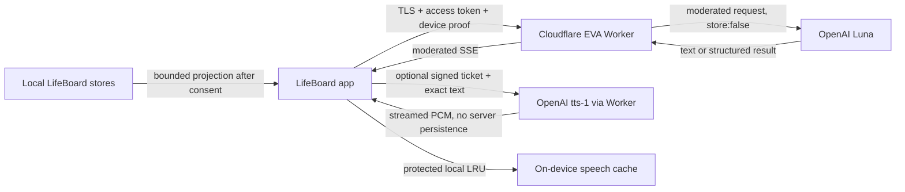

# Cloud EVA Privacy and Data Flow

**Status:** Implemented controls; production privacy/ZDR acceptance remains open
**Audience:** Product, engineering, security, privacy, support, and App Review
**Last verified:** 2026-08-17

Cloud EVA is optional intelligence layered over a local-first LifeBoard. It sends a bounded, user-authorized projection through LifeBoard's Cloudflare Worker to OpenAI for Luna text and optional `tts-1` spoken output. Dictation and transcription continue through Apple's stack. Full-duplex conversation and cloud speech-to-text are out of scope.

## Privacy promise

- Ordinary LifeBoard use and Offline EVA do not require a Cloud EVA account.
- Remote context is purpose-bound and category-specific; it is not blanket access to the LifeBoard store.
- Journal, health, Life Moments, and personal memory are independently off by default.
- The person remains the approval boundary for task, plan, calendar, habit, health, journal, or knowledge mutations.
- The Worker stores no conversation or audio history and sends OpenAI requests with `store: false`.
- `store: false` is not equivalent to Zero Data Retention. Production claims must reflect the OpenAI project's actual approved data-control status.

## Data-flow sequence

## Data inventory

| Data class | Leaves device only when | Processor | Server retention |
|---|---|---|---|
| Prompt and bounded chat history | The person submits a cloud request | Cloudflare, OpenAI | Not retained by EVA Worker |
| Tasks, projects, habits, calendar projection | Base cloud context is enabled and relevant | Cloudflare, OpenAI | Not retained as content |
| Journal | Journal grant is enabled for the account revision | Cloudflare, OpenAI | Not retained as content |
| Health/wellness | Health grant is enabled and projection is relevant | Cloudflare, OpenAI | Not retained as content |
| Life Moments | Life Moments grant is enabled | Cloudflare, OpenAI | Not retained as content |
| Personal memory | Memory grant is enabled | Cloudflare, OpenAI | Not retained as content |
| Speech source text | The person taps Speak and presents a valid ticket | Cloudflare, OpenAI | Not retained by EVA Worker |
| PCM audio | Generated in response to Speak | Cloudflare transit, device | Streamed only; protected device cache optional |
| Apple identity evidence | Sign in or reauthentication | Apple, Cloudflare | Encrypted refresh credential and pseudonymous account state |
| Adult eligibility | Apple shares a range satisfying the 18+ gate | Apple, Cloudflare | Boolean/class/device/policy/time; never birthdate |
| App trust evidence | iOS registers/asserts or Catalyst supplies App Transaction | Apple, Cloudflare | Key/session/counter and risk metadata |
| Credits, consent, usage totals | Cloud account operates | Cloudflare | Account state and append-only accounting metadata |
| Operational telemetry | Every service stage | Cloudflare Analytics Engine | Content-free fields only |

The client never sends raw Core Data/CloudKit models. Projection DTOs are bounded by route budgets and consent revision. Calendar content is read-only. Sensitive protected evidence must be unlocked and explicitly authorized before projection.

## Identity minimization

The Worker validates Sign in with Apple and derives the Durable Object account name from an HMAC of the Apple subject. It does not expose the Apple subject as an EVA identifier. Access tokens last 15 minutes. Refresh tokens rotate, have a 30-day maximum life, and are stored only as hashes; Apple refresh credentials are AES-GCM encrypted. Client credentials use ThisDeviceOnly Keychain protection.

App Attest binds supported iOS requests to an authentic app instance and exact request. Catalyst lacks App Attest, so it uses Sign in with Apple plus App Transaction evidence and lower rate limits. Simulator/debug trust evidence is rejected by production.

## Adult eligibility

LifeBoard and Cloud EVA are 18+. The app requests Apple's Declared Age Range at an 18 gate and accepts only a shared range whose lower bound is at least 18. It never requests or infers date of birth. Eligibility is device-specific, revalidated at activation and at most every 24 hours while cloud is used, and expires server-side after 24 hours. Declined, unavailable, missing, changed, or below-18 results fail closed for Cloud EVA without blocking local LifeBoard.

## Consent and revocation

The server owns the authoritative context-policy revision. The app mirrors it locally, shows each sensitive category separately, and includes the revision on every model request. A stale request receives `consent_revision_conflict`; revocation therefore takes effect before the next accepted cloud request on every device. Revocation does not remove local LifeBoard data.

## Logging and observability

Allowed fields include request ID, account pseudonym, route, environment, stage, status, latency, token/cache counts, estimated/actual cost, refusal/safety category, schema-repair outcome, attestation result class, credit transition, and rate/budget threshold.

Forbidden fields include prompts, answers, projected context, journal/health/memory content, Apple tokens, authorization codes, JWTs, refresh tokens, attestation objects, speech text, audio, and OpenAI response IDs. Contract rejection telemetry records endpoint and rejected field names only. Rejected content is never logged.

## Local speech cache

Spoken output may be stored in a protected on-device LRU cache capped at 100 MB and 30 days. Tickets and exact text hashes use protected storage for their lifetime. Chat deletion and LRU eviction remove corresponding audio and ticket metadata. The server never becomes an audio library. Local replay costs nothing; regeneration after eviction is explicit and may cost one credit.

## Deletion and user control

- Logout revokes the current device session and clears local cloud credentials.
- Apple credential revocation immediately clears the session and requires sign-in.
- Cloud-account deletion requires recent Apple reauthentication, revokes sessions, deletes account state and encrypted Apple credentials, and leaves local LifeBoard content intact.
- Deleting a conversation removes its local speech artifacts.
- Apple account events are handled through `https://api.getlifeboard.app/v1/auth/apple/events`.

## Processor and disclosure checklist

Before production enablement:

- [ ] Record the OpenAI project's actual Zero Data Retention approval and applicable endpoint exceptions.
- [ ] List OpenAI and Cloudflare in the privacy policy with purpose and data categories.
- [ ] Confirm App Store privacy labels for user ID, user content, health/fitness when enabled, product interaction, and diagnostics.
- [ ] Generate and review the Xcode privacy report; keep `NSPrivacyTracking = false`.
- [ ] Verify account deletion, Apple revocation, consent revocation, and data-retention behavior in TestFlight.
- [ ] Inspect Cloudflare logs/Analytics Engine and OpenAI project controls for prohibited content.
- [ ] Ensure user-facing AI-voice disclosure and cloud/offline distinction remain localized and accessible.

## Boundaries

Cloud EVA does not diagnose, provide emergency response, contact third parties, autonomously mutate LifeBoard, perform web/file search, invoke OpenAI tools, retain server conversation memory, or train a LifeBoard-specific model on personal content. A future proposal that changes any boundary requires a privacy threat model, contract revision, product consent design, and release review before implementation.
