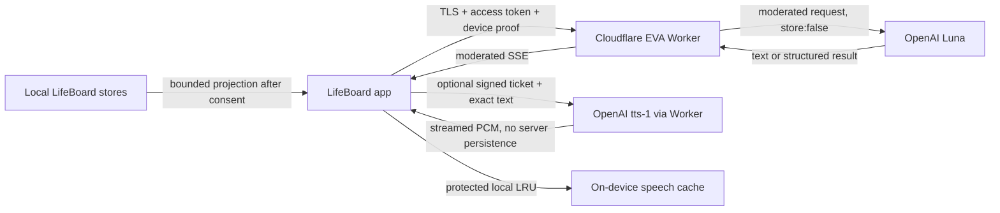

# Cloud EVA Privacy and Data Flow

**Status:** Implemented controls; production privacy/ZDR acceptance remains open
**Audience:** Product, engineering, security, privacy, support, and App Review
**Last verified:** 2026-08-21

Cloud EVA is optional intelligence layered over a local-first LifeBoard. It sends a bounded, user-authorized projection through LifeBoard's Cloudflare Worker to OpenAI for Luna text and optional `tts-1` spoken output. Dictation and transcription continue through Apple's stack. Full-duplex conversation and cloud speech-to-text are out of scope.

## Privacy promise

- Ordinary LifeBoard use and Offline EVA do not require a Cloud EVA account.
- Remote context is purpose-bound and category-specific; it is not blanket access to the LifeBoard store.
- Journal, health, Life Moments, and personal memory are independently reviewable. They may be preselected, but none is sent before explicit confirmation.
- The cloud has no write authority. Broader changes require review; a narrow set of local, today-only captures can execute immediately under deterministic policy and always produce a receipt with undo.
- The Worker stores no conversation or audio history and sends OpenAI requests with `store: false`.
- `store: false` is not equivalent to Zero Data Retention. Production claims must reflect the OpenAI project's actual approved data-control status.

## Data-flow sequence

## Data inventory

| Data class | Leaves device only when | Processor | Server retention |
|---|---|---|---|
| Prompt and bounded chat history | The person submits a cloud request | Cloudflare, OpenAI | Not retained by EVA Worker |
| Tasks, projects, habits, calendar projection | The route manifest permits the category and retrieval selects relevant records | Cloudflare, OpenAI | Not retained as content |
| Capacity, goals, day loop, weekly retrospective | Base cloud context is enabled and relevant | Cloudflare, OpenAI | Not retained as content |
| Knowledge excerpts | The route permits Knowledge, retrieval finds eligible records, and no record is protected or excluded | Cloudflare, OpenAI | Not retained as content |
| The person's own standing instruction to EVA | They have customised it in Settings and submit a cloud request | Cloudflare, OpenAI | Not retained as content |
| Journal | Journal grant, local journal-evidence permission, route eligibility, and entry-level protection all pass | Cloudflare, OpenAI | Not retained as content |
| Health/wellness | Health grant is enabled and projection is relevant | Cloudflare, OpenAI | Not retained as content |
| Life Moments | Life Moments grant is enabled | Cloudflare, OpenAI | Not retained as content |
| Personal memory | Memory grant is enabled | Cloudflare, OpenAI | Not retained as content |
| Speech source text | The person taps Speak and presents a valid ticket | Cloudflare, OpenAI | Not retained by EVA Worker |
| PCM audio | Generated in response to Speak | Cloudflare transit, device | Streamed only; protected device cache optional |
| Guest identity evidence | The person confirms Cloud EVA activation | Cloudflare | Server-random pseudonymous account and rotating session state |
| Apple identity evidence | The person chooses Protect & Sync or reauthenticates | Apple, Cloudflare | Encrypted refresh credential and pseudonymous linked account state |
| Age-band evidence | The system provides a range or regional policy requires a decision | Apple, Cloudflare | Optional class/device/policy/time; never birthdate |
| App trust evidence | iOS registers/asserts or Catalyst supplies App Transaction | Apple, Cloudflare | Key/session/counter and risk metadata |
| Rolling quota, consent, usage totals | Cloud account operates | Cloudflare | Account state and append-only accounting metadata |
| Operational telemetry | Every service stage | Cloudflare Analytics Engine | Content-free fields only |

The client never sends raw Core Data/CloudKit models. Projection DTOs are bounded by route budgets and consent revision. Calendar content is read-only. Sensitive protected evidence must be unlocked and explicitly authorized before projection. Raw local note or journal capture can remain entirely on-device when the deterministic parser recognizes the request; cloud capture receives text only when interpretation is needed and never receives store write access.

### What changed through contract v4, and what did not

Contract v3 made the envelope materially richer. A chat turn previously carried roughly 1,500
tokens — six task titles reduced to `title | due | project`. It now carries up to
the route's published input cap, with typed records that include priority,
energy, estimates, and how many times each item has been deferred or replanned.

What did **not** change is which categories require a grant. `journal`, `health`,
`lifeMoments`, and `personalMemory` remain deny-by-default and separately
granted, enforced server-side by `sensitiveContextCategories` before any model
call. The rich categories — `capacity`, `goals`, `habits`, `dayLoop`,
`retrospective`, and `calendar` — project records the person
already sees in LifeBoard and ride on the request's own authorization, exactly as
`planning` always did. Widening the list did not widen what a grant means.

Contract v4 adds two minimization controls. `turnContext` makes time and originating surface explicit, and every admitted section records a closed selection reason. A per-route manifest is the hard upper bound: `navigation`, input classification, and debug smoke receive no stored-life context; Knowledge and Journal answer routes receive only their respective evidence category. More provider capacity therefore permits intact relevant records, not unrestricted export.

Two consequences are worth stating plainly rather than leaving implied:

- **More detail per record.** `deferredCount` and `replanCount` describe a
  behavioural pattern, not just a task. They are what let EVA say "you have moved
  this four times" instead of listing work back. That is the point, and it is
  also more revealing than a title alone, so it is named here.
- **A larger moderation surface.** The whole envelope is still moderated before
  any model call. Oversized input is chunked and evaluated concurrently rather
  than truncated, so growth does not create a gap where unmoderated content could
  pass — a chunk that fails, fails the request.

The person's standing instruction (`userInstructions`) leaves the device only
when they have changed it from the built-in default. An unmodified default is
never sent: it is not their voice, and a second copy would only compete with the
server's own persona.

## Identity minimization

Guest bootstrap assigns a server-random account identifier unrelated to IP address or installation UUID. Apple linking derives the canonical account from an HMAC of the Apple subject, intersects consent, unions rolling usage, and tombstones the guest account through a durable retryable reconciliation record. The Apple subject is never exposed as an EVA identifier. Access tokens last 15 minutes. Refresh tokens rotate, have a 30-day maximum life, and are stored only as hashes; Apple refresh credentials are AES-GCM encrypted. Client credentials use ThisDeviceOnly Keychain protection, including the data-protection Keychain on Catalyst.

App Attest binds supported iOS requests to an authentic app instance and exact request. Its local key registration is account-scoped and its server challenges are independently single-use. DeviceCheck and Catalyst App Transaction evidence are advisory abuse signals. DeviceCheck bit 0 records prior guest bootstrap only after a successful query; bit 1 is preserved. Missing or failed evidence keeps the account at low trust without reducing the 20-answer allowance; account/network creation limits and budget fuses remain authoritative.

## Age eligibility

Cloud EVA is for ages 13+. A positively known lower bound below 13 is blocked. Users age 13+, adults, and users with no age signal receive the same experience. A signed server policy can require a current regional age decision; the client-supplied policy hint cannot relax it. In that mode declined, unavailable, missing, or expired evidence fails closed pending legal/compliance approval. LifeBoard never requests or infers a birth date.

## Consent and revocation

The server owns the authoritative context-policy revision. Guest bootstrap receives the exact grants confirmed on the activation screen. The app mirrors them locally, shows each sensitive category separately, and includes the revision on every model request. A stale request receives `consent_revision_conflict`; revocation therefore takes effect before the next accepted cloud request on every device. Apple linking intersects both accounts' grants and marks the result review-required until another explicit confirmation. Revocation does not remove local LifeBoard data.

`RemoteEvaContextPolicy` in the app is **not** this gate. It is a local-only
mirror of the same idea with an overlapping category enum and no production
caller; the server-authoritative `EvaConsentPolicy` is what actually authorizes a
section. Two consent models describing one boundary is a hazard, so do not add a
caller to the local one expecting it to gate anything.

Personal memory statements carry a `provenance` field of `userStated` or a
user-confirmed `inferredCandidate`. EVA may propose one concise candidate, but a proposal can never
silently overwrite something the person stated — otherwise a confident wrong
guess becomes a permanent fact about them that they never agreed to and cannot
find to correct.

There are no conversation summaries in contract v3 or later. Each Cloud assistant message
may instead store a local immutable receipt describing categories and stable
source keys without content bodies. A per-record exclusion affects future EVA
projection only; it does not delete the source and cannot rewrite history.

## Logging and observability

Allowed fields include request ID, content-free run/thread correlation IDs, account pseudonym, route, environment, contract/prompt/config versions, stage, status, latency, token/cache counts, section/category counts, selection-reason enums, estimated/actual cost, refusal/safety category, schema-repair outcome, local authority outcome, attestation result class, credit transition, and rate/budget threshold.

Forbidden fields include prompts, answers, projected context, record titles/bodies, structured capture command bodies, memory statements, journal/health content, Apple tokens, authorization codes, JWTs, refresh tokens, attestation objects, speech text, audio, and OpenAI response IDs. Contract rejection telemetry records endpoint and rejected field names only. Rejected content is never logged.

## Local speech cache

Spoken output may be stored in a protected on-device LRU cache capped at 100 MB and 30 days. Tickets and exact text hashes use protected storage for their lifetime. Chat deletion and LRU eviction remove corresponding audio and ticket metadata. The server never becomes an audio library. Local replay costs nothing; regeneration after eviction is explicit and consumes the separate helper quota.

## Deletion and user control

- Logout revokes the current device session and clears local cloud credentials.
- Apple credential revocation immediately clears the session and requires sign-in.
- Guest cloud-account deletion uses the active device session plus explicit confirmation. Apple-linked deletion uses a dedicated recent-reauthentication flow that must prove the already-linked Apple subject; it cannot switch accounts. Both revoke sessions, delete account state and encrypted Apple credentials, and leave local LifeBoard content intact.
- Deleting a conversation removes its local speech artifacts.
- Deleting or excluding an evidence source removes it from future Eva, Insights, and Home projections; deletion and exclusion do not rewrite already rendered historical messages.
- Confirmed memories can be inspected, edited, deleted, and disabled for cloud use. Candidate memory is not retained as confirmed memory without local user action.
- Apple account events are handled through `https://api.getlifeboard.app/v1/auth/apple/events`.

## Processor and disclosure checklist

Before production enablement:

- [ ] Record the OpenAI project's actual Zero Data Retention approval and applicable endpoint exceptions.
- [ ] List OpenAI and Cloudflare in the privacy policy with purpose and data categories.
- [ ] Confirm App Store privacy labels for user ID, user content, health/fitness when enabled, product interaction, and diagnostics.
- [ ] Generate and review the Xcode privacy report; keep `NSPrivacyTracking = false`.
- [ ] Verify account deletion, Apple revocation, consent revocation, and data-retention behavior in TestFlight.
- [ ] Inspect Cloudflare logs/Analytics Engine and OpenAI project controls for prohibited content.
- [ ] Ensure user-facing AI-voice disclosure and cloud/offline distinction remain localized and accessible.

## Boundaries

Cloud Eva does not diagnose, provide emergency response, contact third parties, write LifeBoard data, perform web/file search, invoke OpenAI tools, retain server conversation memory, or train a LifeBoard-specific model on personal content. The app may execute only the local direct-capture allowlist described in [Navigation and capture authority](NAVIGATION_AND_CAPTURE_AUTHORITY.md). A future proposal that changes any boundary requires a privacy threat model, contract revision, product consent design, and release review before implementation.

## Projection and exclusion invariants

- Route eligibility, user grant, local protection, record exclusion, semantic relevance, and whole-record budget admission are separate checks; all must pass.
- Omitted data is “not provided,” never evidence that the data does not exist.
- Evidence Lens exclusion is enforced before prompt construction and across Eva, Insights, and Home projections.
- Retrieved record text is delimited as untrusted content and cannot grant consent or authority.
- A context category added to a route requires privacy review and subtraction/exclusion evaluation.

See [Context and prompt architecture](CONTEXT_AND_PROMPT_ARCHITECTURE.md) for the exact manifest and [Memory, evidence, and proactivity](MEMORY_EVIDENCE_AND_PROACTIVITY.md) for correctability and exclusion behavior.
