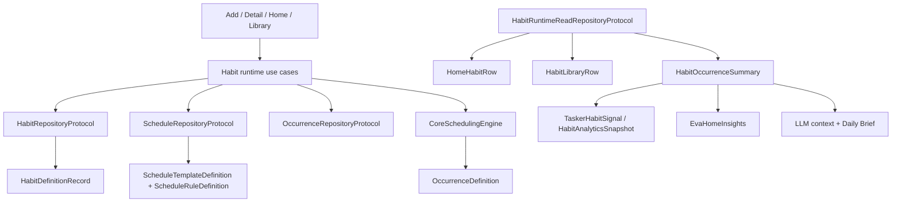
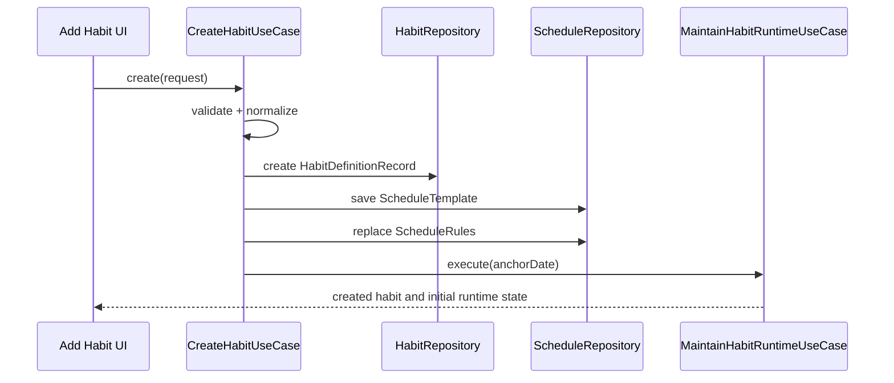
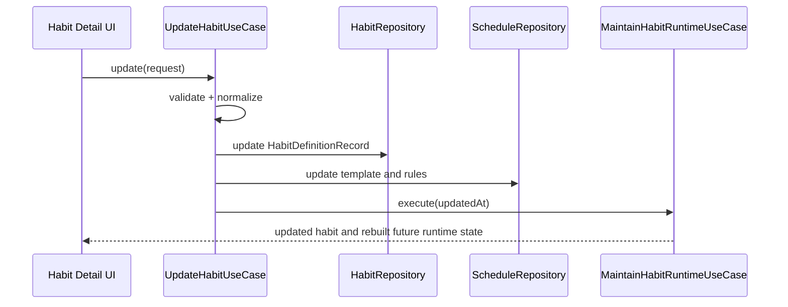
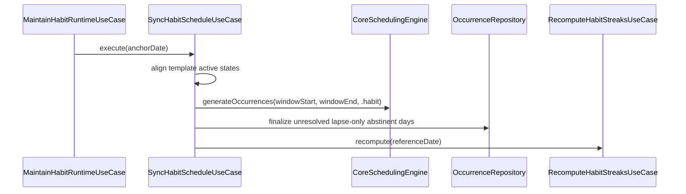
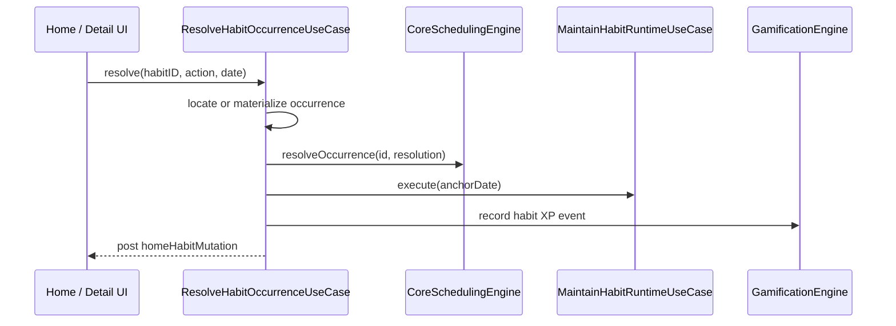
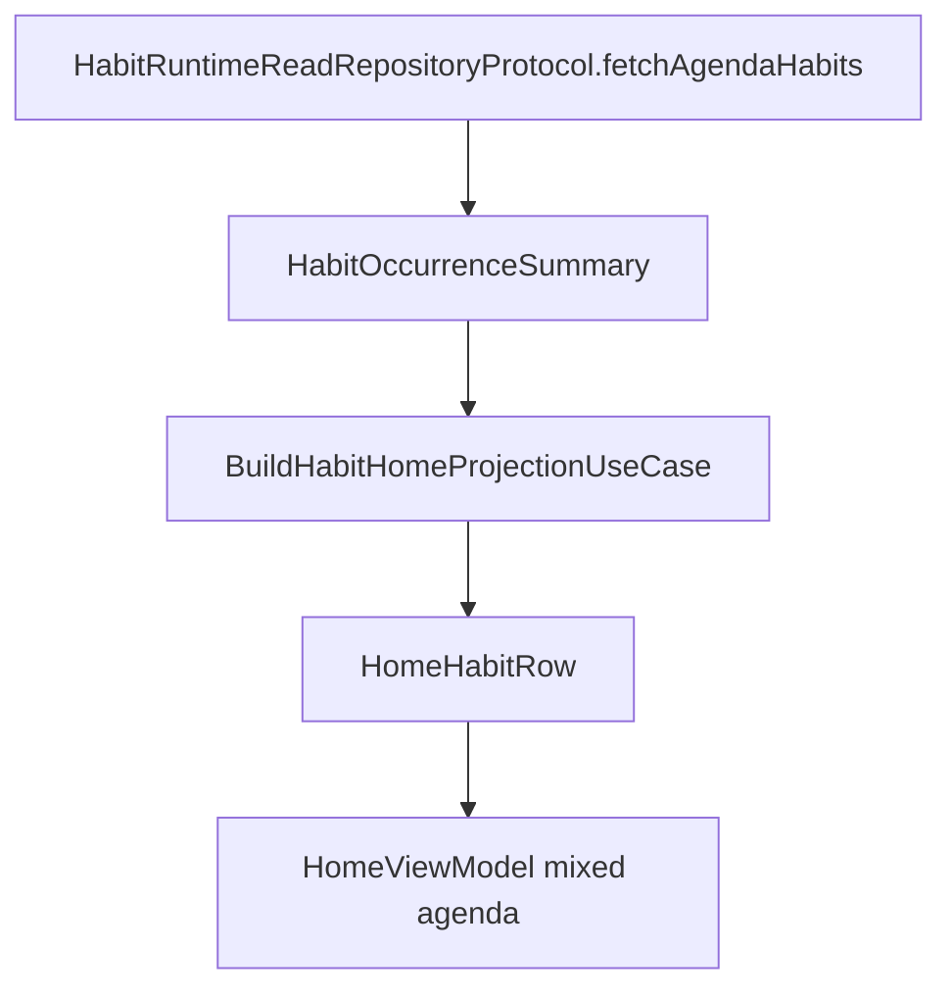
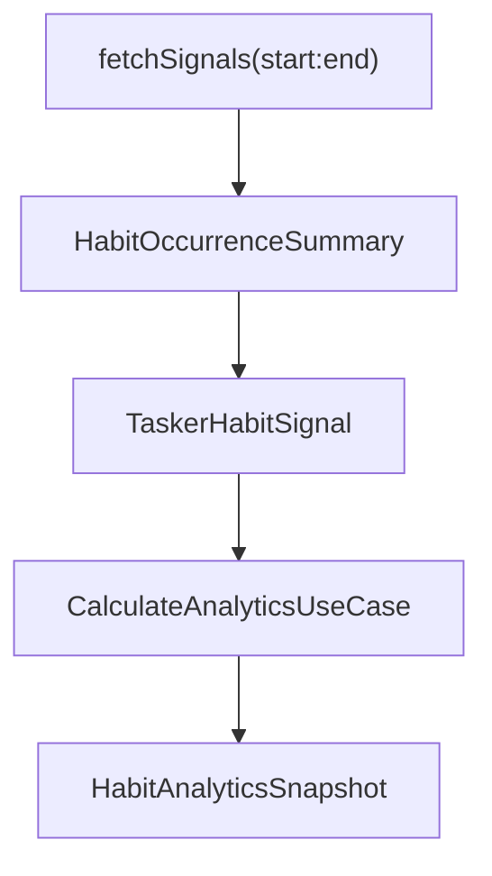
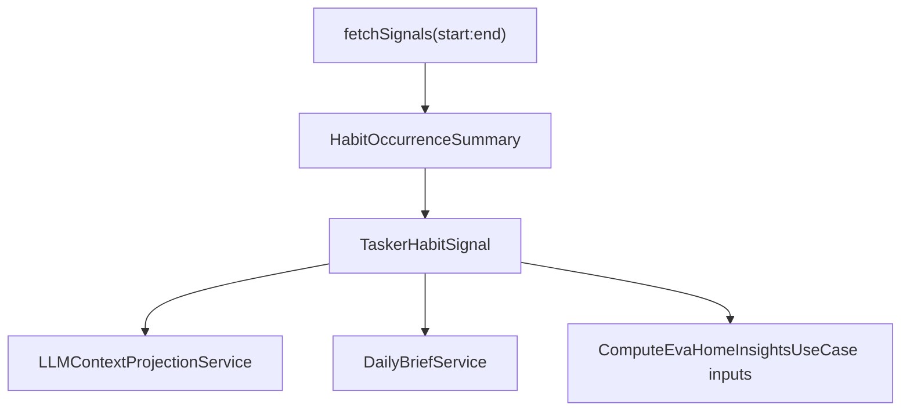

# Habits Data Model and Runtime

Last validated against code on 2026-03-22

## Summary

The habits subsystem is a dedicated recurring-behavior runtime.
It is not task recurrence and it is no longer accurately described as `ManageHabitsUseCase` plus a single `HabitDefinition` row.

The canonical runtime is built from:
- a habit definition record
- schedule template and schedule rules
- occurrence generation and resolution
- read-model projections for Home, Library, analytics, Eva, and LLM context

## Primary Source Anchors

- `To Do List/Domain/Models/HabitDefinition.swift`
- `To Do List/Domain/Models/HabitTypes.swift`
- `To Do List/Domain/Interfaces/HabitRuntimeReadRepositoryProtocol.swift`
- `To Do List/UseCases/Habit/HabitRuntimeUseCases.swift`
- `To Do List/State/Repositories/CoreDataHabitRepository.swift`
- `To Do List/State/Repositories/CoreDataHabitRuntimeReadRepository.swift`
- `To Do List/State/Repositories/CoreDataScheduleRepository.swift`
- `To Do List/State/Repositories/CoreDataOccurrenceRepository.swift`
- `To Do List/State/Services/CoreSchedulingEngine.swift`
- `To Do List/UseCases/Analytics/CalculateAnalyticsUseCase.swift`
- `To Do List/LLM/Models/LLMContextProjectionService.swift`
- `To Do List/LLM/Models/DailyBriefService.swift`

## Runtime Topology

## Domain Types and Projection Models

### Habit Definition and Typed Fields

- `HabitDefinitionRecord`
  - canonical write model for habit identity, ownership, metadata, status, and cached streak fields
  - stores raw fields such as `kindRaw`, `trackingModeRaw`, `iconSymbolName`, `iconCategoryKey`, `notes`, `archivedAt`, `successMask14Raw`, `failureMask14Raw`, and `lastHistoryRollDate`
  - exposes typed wrappers for `kind`, `trackingMode`, `icon`, `targetConfig`, `metricConfig`, `successMask14`, and `failureMask14`

- `HabitKind`
  - `positive`
  - `negative`

- `HabitTrackingMode`
  - `dailyCheckIn`
  - `lapseOnly`

- `HabitRiskState`
  - `stable`
  - `atRisk`
  - `broken`

- `HabitIconMetadata`
  - `symbolName`
  - `categoryKey`

- `HabitTargetConfig`
  - optional behavior notes and target count

- `HabitMetricConfig`
  - optional metric label and completion-note behavior

- `HabitCadenceDraft`
  - `.daily(hour:minute:)`
  - `.weekly(daysOfWeek:hour:minute:)`

### Runtime Output Models

- `HabitOccurrenceSummary`
  - canonical occurrence-backed summary for agenda/history/signal projections
- `HabitHistoryWindow`
  - day-mark history projection
- `HabitLibraryRow`
  - management projection including schedule metadata, recent history, pause/archive state, and next/last completion
- `HomeHabitRow`
  - Home-specific row model with Home presentation state
- `TaskerHabitSignal`
  - downstream analytics and AI signal model
- `HabitInsightSignal`
  - lightweight habit signal for Eva-style insight synthesis
- `HabitAnalyticsSnapshot`
  - adherence-specific analytics model
- `HabitRuntimeSyncResult`
  - maintenance result summary

## Persistence and Entity Model

### Core Data Entities Used by Habits

- `HabitDefinition`
  - stores habit identity, ownership, type/tracking metadata, pause/archive state, streak caches, icon metadata, notes, and serialized target/metric config
- `ScheduleTemplate`
  - stores schedule ownership and reminder-window metadata for the habit source
- `ScheduleRule`
  - stores daily or weekly cadence rule data
- `Occurrence`
  - stores materialized daily/weekly habit instances and current state
- `OccurrenceResolution`
  - stores user/system resolution history

### Ownership and Relationships

- `HabitDefinition.lifeAreaID`
  - required by product contract
  - still optional at some storage/domain edges
- `HabitDefinition.projectID`
  - optional supporting context
- schedule template uses `sourceType == .habit` and `sourceID == habit.id`
- occurrences are generated from schedule templates/rules for the habit source

## Repository Contracts

- `HabitRepositoryProtocol`
  - write-model persistence for `HabitDefinitionRecord`
- `HabitRuntimeReadRepositoryProtocol`
  - read projections for agenda, history, signals, and library
  - current contract:
    - `fetchAgendaHabits(for:)`
    - `fetchHistory(habitIDs:endingOn:dayCount:)`
    - `fetchSignals(start:end:)`
    - `fetchHabitLibrary(includeArchived:)`

Important read-repository behavior:
- active agenda and signal queries exclude archived habits
- active agenda and signal queries exclude paused habits
- current implementation also excludes habits with missing `lifeAreaID` from active signal/agenda projections
- Core Data reads are predicate-driven rather than fetch-all-plus-filter for the main runtime path

## Focused Use Cases

- `CreateHabitUseCase`
  - validates life area and optional project
  - normalizes impossible combinations such as positive + `lapseOnly`
  - writes habit definition
  - writes schedule template and rules
  - triggers initial maintenance / rolling occurrence generation
  - posts `homeHabitMutation`

- `UpdateHabitUseCase`
  - validates ownership
  - normalizes impossible combinations
  - updates habit metadata
  - updates schedule template/rules when cadence or reminder window changes
  - preserves best-effort rollback behavior if downstream schedule maintenance fails
  - posts `homeHabitMutation`

- `PauseHabitUseCase`
  - toggles pause state
  - aligns template activity state
  - preserves history
  - posts `homeHabitMutation`

- `ArchiveHabitUseCase`
  - soft-archives only
  - uses pause path as part of shutdown behavior
  - preserves history
  - posts `homeHabitMutation`

- `RecomputeHabitStreaksUseCase`
  - rebuilds streak caches, masks, and risk state from occurrence history

- `SyncHabitScheduleUseCase`
  - aligns template states for active/paused habits
  - generates rolling occurrences through `CoreSchedulingEngine`
  - auto-finalizes unresolved pre-today `lapseOnly` abstinent days
  - recomputes streak/risk caches
  - updates generation dates

- `ResolveHabitOccurrenceUseCase`
  - maps UI actions to canonical resolution outcomes
  - materializes same-day lapse-only occurrence when needed
  - resolves the occurrence
  - runs maintenance
  - records gamification event
  - posts `homeHabitMutation`

- `GetDueHabitsForDateUseCase`
  - reads agenda-eligible habits for a date

- `GetHabitHistoryUseCase`
  - returns trailing habit history windows

- `GetHabitLibraryUseCase`
  - returns management/library projections

- `BuildHabitHomeProjectionUseCase`
  - converts occurrence summaries into `HomeHabitRow` models

## Core Invariants

- Positive habits always normalize to `dailyCheckIn`.
- Paused habits are excluded from active agenda and signal projections.
- Archived habits are excluded from active agenda and signal projections.
- `lapseOnly` abstinent days are auto-finalized for unresolved pre-today pending occurrences.
- Reminder windows must not create `dueAt < scheduledAt`.
- Streaks and 14-day masks are caches derived from occurrence history.
- History source of truth is occurrences plus occurrence resolutions.
- `Occurrence.occurrenceKey` remains immutable once persisted.

## Action Semantics

| UX action | Habit type | Resolution semantics | Occurrence state |
| --- | --- | --- | --- |
| `Done` | positive | `completed` | `completed` |
| `Skip` | positive | `skipped` | `skipped` |
| `Stayed Clean` | negative `dailyCheckIn` | `completed` | `completed` |
| `Lapsed` | negative `dailyCheckIn` | `lapsed` | `failed` |
| `Log Lapse` | negative `lapseOnly` | materialize same-day occurrence if missing, then `lapsed` | `failed` |

## Lifecycle Flows

### Create Habit

### Update Cadence / Reminder Window

### Daily Maintenance

### Resolve Habit Action

### Home Projection

### Analytics Projection

### LLM / Daily Brief Projection

## Home, Analytics, and AI Consumers

### Home

- `BuildHabitHomeProjectionUseCase` converts summaries into `HomeHabitRow`.
- `HomeViewModel` keeps `currentHabitSignals` derived from loaded Home rows.
- `homeHabitMutation` triggers Home reload and analytics refresh.

### Analytics

- `CalculateAnalyticsUseCase` computes `HabitAnalyticsSnapshot`.
- Habit analytics are separate from task productivity metrics.
- Daily analytics cache now fingerprints supplied habit signals to avoid stale same-day reuse after habit mutations.

### Daily Brief and LLM Context

- `LLMContextProjectionService` fetches habit signals and includes them in JSON and compact context output.
- `DailyBriefService` summarizes due habits, wins, lapses, and risk.
- These consumers rely on `fetchSignals(start:end:)`, so paused-habit suppression must happen at the repository boundary.

### Eva / Home Insights

- `ComputeEvaHomeInsightsUseCase` consumes habit signals as part of Home insight generation.
- Habit signals are distinct behavior inputs, not task aliases.

## Known Partials

- `LifeArea` is product-required, but `lifeAreaID` is still optional at parts of the storage/domain surface.
- Mutation atomicity is best-effort rollback, not a single transaction spanning every repository involved in a habit mutation.
- Some fallback read paths still treat missing ownership as repair-needed data rather than impossible state because legacy data can exist.

## Cross-Links

- `docs/habits/product-feature.md`
- `docs/habits/risk-register.md`
- `docs/habits/roadmap.md`
- `docs/architecture/data-model-v2.md`
- `docs/architecture/usecases-v2.md`

