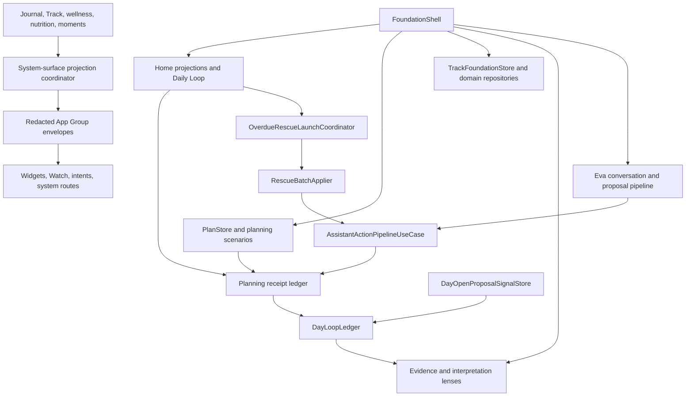

# LifeBoard Unified Implementation Guide

> **Classification: Canonical engineering and product handoff for the completed
> LifeBoard Unified Completion Program.**

**Audience:** Engineering, product, QA, and release teams
**Capability status:** Current architecture with dated completion evidence
**Source authority:** Current runtime/persistence plus the completion ledger
**Last verified:** 2026-08-13

**Last reconciled:** 2026-08-03
**Implementation checkpoint:** `12539b21`
**Status authority:** [LifeBoard Unified Completion Status](./LIFEBOARD_UNIFIED_COMPLETION_STATUS.md)
**Design authority:** [`DESIGN.md`](../../DESIGN.md)

This guide explains how the completed features work, where their boundaries
live, what they persist, how they fail, and how to extend them without reviving
retired architecture. It complements the status ledger: the ledger answers
“is it complete and what evidence exists?”; this guide answers “how does the
shipped system fit together?”

## 1. Product model

LifeBoard is a local-first life operating system organized around a deliberate
daily loop:

1. Home identifies the most useful next decision.
2. Plan turns intent into a realistic day.
3. Track records care, routines, habits, goals, and health-adjacent evidence.
4. Insights interprets local evidence without turning the day into a score.
5. Eva helps the person understand or propose changes, but never silently
   mutates canonical data.
6. Close the Day reconciles unfinished work and records tomorrow's first thing.
7. Start Today confirms the carry and opens the next deliberate day.

The north-star measure is the **deliberate-day rate**: eligible days that were
closed and subsequently opened or confirmed. It is derived locally from
planning receipts and an optional local sidecar. No usage-analytics upload is
required to compute it.

## 2. Architectural map



The important ownership rule is that presentation coordinates state, while
repositories and use cases own canonical mutations. Views do not open Core Data
stores, invent receipt formats, or write extension snapshots directly.

## 3. Cross-cutting invariants

These rules apply to every feature in this guide:

- One user act is one mutation batch, one durable receipt, and one Undo.
- Effects, haptics, summaries, and success copy happen only after persistence.
- Missing, unknown, unavailable, denied, stale, partial, explicit zero, and
  genuinely empty are different states.
- A failed fetch never becomes congratulatory empty copy.
- Additive migrations preserve stable IDs and old `PlanMutation` payloads.
- Derived indexes, proposal evidence, caches, and system-surface projections are
  rebuildable and non-authoritative.
- Feature rollback hides presentation or routing while preserving canonical
  records written while the feature was enabled.
- Sensitive information is redacted by default outside the app. A permission in
  one disclosure channel never implies permission in another.

## 4. Daily Loop

### 4.1 State and persistence

The Daily Loop does not have a separate Core Data entity or streak counter.
[`DayLoopLedger.swift`](../../LifeBoard/Features/DailyLoop/Data/DayLoopLedger.swift)
interprets applied and undone planning receipts whose stable source prefixes are:

- `planning.scenario.dayClose.<day stamp>`
- `planning.scenario.dayOpen.<day stamp>`

Closing and opening therefore inherit the same transactional apply and Undo
semantics as other planning scenarios. An undone receipt stops contributing to
the loop automatically.

[`DayCloseStore.swift`](../../LifeBoard/Features/DailyLoop/Data/DayCloseStore.swift)
owns the close/open screen state. It keeps the acted-on day separate from the
retrospective day so a morning can describe yesterday while committing work to
today. This avoids presenting today's tasks as if they were last night's
decisions.

### 4.2 Evening close

The close flow loads actionable unfinished tasks for the selected day, sorts
must-do work first, and presents one card at a time. The four decisions are:

| Direction | Meaning | Mutation behavior |
|---|---|---|
| Tomorrow | Keep it active and carry it forward. | Updates its planning day in the close scenario. |
| Someday | Preserve it without claiming it belongs tomorrow. | Changes its unscheduled disposition. |
| Done anyway | Record that it was already completed. | Uses the firm square treatment and completion mutation. |
| Release | Let the task go. | Archives its planning metadata; it is preserved and never written as a deletion tombstone. |

The deck is a real queue. `remainingCards` includes the full undecided stack so
depth accurately communicates the amount left; rendering only the front card
would make an eight-task close look nearly finished.

After reconciliation, the person may name tomorrow's first thing. The planning
scenario is then proposed and applied as one batch. The optional reflection line
is a separate canonical Journal act with its own commit control; undoing the
plan never silently deletes something the person wrote. Only the persisted
planning summary receives the `.doneAnyway` burst or release erosion.

### 4.3 Tactile behavior

The motion contract is defined in [`DESIGN.md`](../../DESIGN.md):

- current proposal lean remains bounded;
- release erosion is `0.22`;
- settled acts leave clay knots on the act thread;
- entry uses a matched zoom source;
- the morning uses the First Light settle;
- Reduce Motion replaces travel/deformation with short crossfades and stable
  end states.

The ring is absent when there was nothing to reconcile. It never renders an
empty ritual as 0% progress.

### 4.4 Morning open

[`DayOpenScenarioBuilder.swift`](../../LifeBoard/Features/DailyLoop/Domain/DayOpenScenarioBuilder.swift)
creates a deterministic proposal with the prior anchor first, then carried work.
The proposal starts selected so the primary action confirms rather than composes.
Changing the selection sets `openProposalWasEdited`.

The default policy requires explicit confirmation. Once local evidence reaches
14 eligible days, `MorningCommitPolicyResolver` compares the share of opens
before 11:00 with the 40% threshold:

```text
eligible days < 14           -> explicit confirmation
early-open share >= 40%      -> explicit confirmation
early-open share < 40%       -> zero-interaction confirmation
```

Zero-interaction confirmation writes an empty `dayOpen` receipt. It does not
move tasks, alter proposal ranking, or fabricate an acceptance signal.

### 4.5 Proposal evidence sidecar

`DayOpenProposalSignalStore` writes
`Application Support/LifeBoard/LocalOnly/DayOpenProposalSignals.v1.json` with
complete file protection, atomic replacement, backup exclusion, schema version
1, and a bounded maximum of 400 signals.

Each signal contains only receipt ID, day stamp, edited/unedited state, commit
time, and schema version. It is written only after scenario apply succeeds. A
sidecar write failure:

- does not fail or roll back the morning commitment;
- produces unknown evidence rather than “edited”;
- never changes task or planning data.

The Insights join includes signals only when their receipt is currently applied.
Undone receipts stop counting without deleting the sidecar row.

### 4.6 Evidence and rhythm

`DayLoopEvidenceReport` exposes eligible days, closes, opens before 11:00, days
with both acts, reversals, known proposal signals, and unedited share. Insights
labels this evidence as local and non-authoritative.

Home leads rhythm copy with consistency: for example,
`9 of 14 days · 1 day running`. Both values use equal typography. There is no
punitive recovery color or “broken streak” language.

The evening notification policy provides one configurable gentle nudge. Closing
the day suppresses it; there is no later follow-up notification.

## 5. Overdue Rescue and Day Rescue

### 5.1 Launch ownership

[`OverdueRescueLaunchCoordinator`](../../LifeBoard/Features/Home/UI/Modals/OverdueRescue/OverdueRescueViewModel.swift)
is the app-level owner of launcher state, plan, normal and Day Rescue task maps,
reference date, presentation context, and last batch run identity. Home supplies
services but does not own the modal lifecycle.

The same presentation host serves Home, typed/deep-linked rescue entry points,
and `.universalInputDayRescue`. Day Rescue uses today's task map and a distinct
session scope; it does not silently widen into all overdue work.

### 5.2 Apply boundary

[`RescueBatchApplier`](../../LifeBoard/Features/Home/UI/ViewModels/HomeViewModel+EvaRescueActions.swift)
performs the mutation sequence:

1. Resolve every referenced task from the canonical repository.
2. Reject missing tasks and stale/no-longer-eligible overdue work.
3. Build a validated assistant proposal.
4. Propose the run.
5. Confirm it.
6. Apply it transactionally.
7. Save planning metadata when required.
8. If metadata persistence fails, compensate through the same batch Undo path.

User Undo and compensation both call `undoAppliedRun`. Mutation behavior is not
duplicated inside the view model.

### 5.3 Truthful states

- Loading preserves the host and identifies that Rescue is preparing.
- Launch failure remains mounted with Retry and Dismiss.
- A stale card is rejected before proposal creation.
- An empty Day Rescue says “Nothing needs rescuing today.”
- Finishing a run clears presentation state but preserves the durable run ID
  required by Undo.

## 6. Canonical shell and retired architecture

Adaptive Home is the only Home implementation. The following were removed after
parity and migration coverage:

- `LegacyHomeControllerHost` and `legacyHomeController` composition;
- `adaptiveHomeV2Enabled`, its promoted default, and disable argument;
- the legacy Sunrise reflection flow and duplicate reflection stores/use cases;
- `DailyPlanDraft` as a competing source of truth;
- obsolete celebration routing types and tests;
- the UIKit `HomeViewController` shell after projection, onboarding, and routing
  ownership moved to native app-level composition.

Legacy reflection text is imported with provenance into the canonical Journal
path. It never synthesizes Daily Loop receipts or treats an old plan draft as a
completed day.

## 7. Five root experiences

### Home — what matters now?

Home places the non-pinnable loop spine above the user-owned dashboard. It shows
one dominant decision, at most four honest signals, today's commitments, the day
ahead, conditional attention, steady-care work, and loop closure. Starter
widgets for tasks, care, routines, Journal, and progress are removable and
customizable.

Smart Slot layout, schedules, freezes, sizing, and provider migration preserve
unknown placements rather than rewriting them. Customization is transactional:
Done persists, Cancel discards, and the canonical Home is restored after
navigation or process relaunch.

### Plan — when should it happen?

Plan retains Day, Week, and Backlog. Ordinary tasks are open draggable rows with
restrained separators; drag/drop and matched-zoom geometry span the full row.
The timeline supports move and resize alternatives, available-window placement,
Fits Next, scenario previews, capacity repair, estimate calibration, and Focus
restoration without mutating external calendar events.

A planning proposal remains local until Apply. Apply produces one receipt and
one Undo. Refresh/version conflict surfaces the changed records instead of
applying a stale proposal.

### Track — what needs recording or sustaining?

Track uses compact tiles for single actions and full-width modules for
multi-action surfaces such as hydration. Today shows only time-relevant work;
active experiences such as a running fast are promoted while active and return
to their area afterward.

Habits, routines, goals, medication, trackers, wellness, nutrition, fasting,
and Life Moments use canonical repositories and preserve corrections and export
identity. A missing reading is absent, not zero. Medication windows become
Unresolved rather than inferred as Missed.

### Insights — what changed?

Insights presents interpretation before metrics and puts raw provenance behind
Evidence. The Review lens contains the local Daily Loop report. Experience is an
optional view of the existing XP ledger; XP is absent from Home and celebration
copy.

Successful-empty states are actionable: an empty overview opens Track to record
a signal, and an empty Experience lens returns to Review. These transitions have
a focused UI journey and selected-state accessibility assertions.

### Eva and Journal — help me understand

Assistant prose is open on the reading surface. User messages are tactile;
structured proposals, results, and Undo earn bounded containers. The composer is
recessed and stable while long-form Journal reading remains quiet and open.

Journal supports mixed-media capture, protected attachments, autosave recovery,
restoration, reflections, saved-insight routing, and encrypted export/restore.
Eva evidence uses the same provenance and permission distinctions as the app;
it does not invent facts when a provider is absent or denied.

## 8. Capture, Inbox, and canonical Undo

Capture drafts survive interruption in the App Group pending-capture queue.
Share, widget, Siri/App Intent, and in-app producers feed the same review path.
The Inbox commit coordinator files reviewed input through canonical task or
domain writers and retains identity through Undo.

Duplicate handling distinguishes Keep Both, Merge, and Cancel. Merge is a
receipt-backed mutation, not a delete followed by an unrelated create. Failure
or compensation restores the pending capture and preserves the person's text.

The seeded termination journey proves:

```text
producer writes capture
  -> app terminates
  -> Inbox reloads same capture ID
  -> person reviews and files it
  -> canonical task exists
  -> Undo restores the same pending capture identity
```

## 9. System surfaces

System surfaces consume only
[`LifeBoardSystemSnapshotEnvelope`](../../Packages/LifeBoardContracts/Sources/LifeBoardContracts/LifeBoardSystemSurfaceSnapshotContract.swift).
Extensions never open canonical stores.

The envelope is versioned, domain-tagged, deterministically deduplicated, and
written atomically with a last-known-good backup. Readers reject future schemas,
domain mismatches, and a corrupt primary-plus-backup pair.

Every snapshot is reduced to display-ready title/value/symbol/sensitivity,
authorization, route, and timestamp fields. It contains no canonical model blob,
private source text, or free-form Journal note. Unless a value is share-eligible
or explicitly authorized, external display receives:

```text
LifeBoard
Open LifeBoard to view
```

The projection coordinator rebuilds Journal, fasting, wellness, nutrition, Life
Moments, goals, and routines after canonical mutations, debounces rapid changes,
and reloads widget timelines. Remote Eva grants do not authorize any of these
surfaces.

## 10. Remote Eva privacy boundary

[`RemoteEvaContextPolicy`](../../LifeBoard/Features/Eva/Models/RemoteEvaContextPolicy.swift)
is deny-by-default and schema-versioned. Remote use requires:

1. a non-empty account policy;
2. account-level remote Eva enablement;
3. an exact normalized match between the request account and policy account;
4. an independent grant for each included category: Journal, health, Life
   Moments, or planning context.

Authorization happens when the request is assembled. Revocation therefore
excludes the category from the next request. Duplicate category fragments are
collapsed deterministically to the latest prepared value. Unknown policy schemas
and account switches fail closed.

Remote policy is intentionally separate from widget, Watch, notification,
Spotlight, Live Activity, and lock-screen disclosure policy.

## 11. Design and accessibility implementation

The unified presentation uses warm paper, cocoa ink, apricot and sage accents,
semantic hairlines, and an opaque focus role. `actionFocus` is an accessibility
role and must remain visually distinct from decorative `accentRing`.

Interaction rules:

- touch targets are at least 44 by 44 points;
- selection uses shape, weight, accessibility traits/value, and color;
- controls scroll or wrap at large Dynamic Type instead of shrinking labels;
- focus indicators remain opaque with Increase Contrast;
- Reduce Transparency uses opaque reading surfaces;
- Reduce Motion settles clay effects and replaces spatial travel with crossfade;
- keyboard shortcuts and focus order are present on regular-width iPad and
  Catalyst;
- system and user content remain legible at accessibility XXXL and in RTL.

The Track hydration hierarchy, Insights empty-state actions, reflection signal
selector, weekday controls, and tag controls were specifically hardened during
the final audit. Settled act knots use the adaptive warm-shadow token rather
than raw black.

## 12. Feature flags and rollback

[`V2FeatureFlags.swift`](../../LifeBoard/Services/V2FeatureFlags.swift) resolves
retained staged flags in this order:

1. Debug enable/disable launch argument;
2. stored App Group or standard-defaults override;
3. Debug default `true`;
4. Release `promotedDefaults`, where every retained staged flag is pinned `true`.

Every retained flag therefore defaults on in Debug and Release. Flags are
disable-only rollback paths, not hidden unfinished features. Tests require every
staged key to have a matching promoted default and require every promoted value
to be true.

Adaptive Home is the exception because it is no longer staged: its fallback and
flag were deleted. Do not restore the obsolete
`-LIFEBOARD_DISABLE_ADAPTIVE_HOME_V2` argument.

## 13. Persistence map

| Data | Authority | Storage/protection | Undo behavior |
|---|---|---|---|
| Daily close/open | Planning scenario receipts | Existing Core Data receipt model | Receipt state changes to undone. |
| Morning proposal signal | Receipt-keyed local sidecar | Protected JSON, atomic, excluded from backup | Automatically ignored when receipt is undone. |
| Rescue batch | Assistant action run + planning receipt | Existing canonical repositories | One batch Undo; compensation uses same path. |
| Home layout | Dashboard layout repository | Versioned canonical layout envelope | Edit Cancel discards; reset is explicit. |
| Capture draft | App Group pending queue | Stable producer/capture identity | Filing Undo restores pending identity. |
| Journal media | Journal canonical metadata + protected local files | Complete protection for sensitive attachments | Restore preserves attachment identity. |
| System surfaces | Redacted projection envelopes | App Group primary + backup | Rebuilt from canonical data; never mutated externally. |
| Remote Eva grants | Account policy | Versioned account-scoped policy | Revocation applies to subsequent requests. |

The completed program retains 23 bundled `TaskModelV3` versions, currently
ending at `TaskModelV3_BehaviorFlagship`, and 18 registered signature Metal
shaders. Daily Loop, Rescue, design refinement, consent hardening, and legacy
retirement introduced no additional Core Data version.

## 14. Testing and seeded journeys

Run `xcodebuild` serially; simultaneous builds can contend for the same package,
Derived Data, simulator, and result-bundle state.

Primary gates:

```bash
./scripts/run-baseline-aware-tests.sh
./scripts/run-phase1-phase2-build-matrix.sh

./scripts/check-xcode-target-membership.sh
./scripts/token-law-guardrails.sh
./scripts/premium-ui-guardrails.sh
./scripts/phase1-foundation-guardrails.sh
./scripts/check-no-print-logs.sh
./scripts/validate_legacy_runtime_guardrails.sh
./scripts/validate_legacy_test_guardrails.sh
./scripts/validate_coredata_codegen_guardrails.sh

git diff --check
```

The release-audit checkpoint executed 2,071 unit/integration/migration tests
with 3 environment-qualified skips and zero failures. iOS Debug and Release,
Widgets Debug, Share Extension Debug, and Catalyst Debug built successfully.
The focused Insights empty-state journey also passed.

Deterministic launch fixtures cover:

- evening close and morning open, including a broken-run rhythm case;
- all four close directions, persisted summary effects, and Undo;
- Rescue normal, Day Rescue, empty, failure, retry, stale-task, compensation,
  and Undo paths;
- capture termination, App Group file, and canonical Undo identity;
- native task edit and project archive persistence;
- regular-width iPad Week, Catalyst navigation, Home hierarchy, and
  accessibility XXXL;
- system-surface redaction, future schema, corrupt-primary backup recovery,
  offline ordering, deduplication, and typed routing;
- Remote Eva account mismatch and immediate revocation.

## 15. Safe extension checklist

Before extending a completed feature:

1. Identify the canonical repository or receipt source; do not add a parallel
   store because a view needs a shortcut.
2. Model unknown/denied/stale/error separately from empty and zero.
3. Keep proposal or draft state local until Apply.
4. Use one batch/receipt/Undo for one perceived act.
5. Trigger feedback only from the persisted result.
6. Add a deterministic seeded journey for the user-visible path.
7. Update `DESIGN.md` in the same phase if interaction, copy, state, motion, or
   responsive behavior changes.
8. Update this guide only for architecture and behavior that actually shipped;
   record aspirational work in a historical plan instead.
9. Run the complete suite, serialized build matrix, all eight guardrails, model
   and shader parity checks, and `git diff --check`.

## 16. External release evidence

Code and simulator gates do not claim observations that require signed hardware.
Before public promotion, separately archive:

- paired-Watch delivery, deduplication, acknowledgement loss, and restoration;
- signed App Group producer delivery, notifications, Live Activities, haptics,
  camera, microphone, biometrics, and protected-data transitions;
- populated production-style CloudKit migration and conflict behavior;
- sustained thermal, energy, launch, memory, and frame-pacing captures;
- final iPhone visual/accessibility approval, followed by iPad and Catalyst.

An unavailable runtime is neither a pass nor a code failure. The status ledger
owns the current boundary between completed automated evidence and these pending
external observations.
