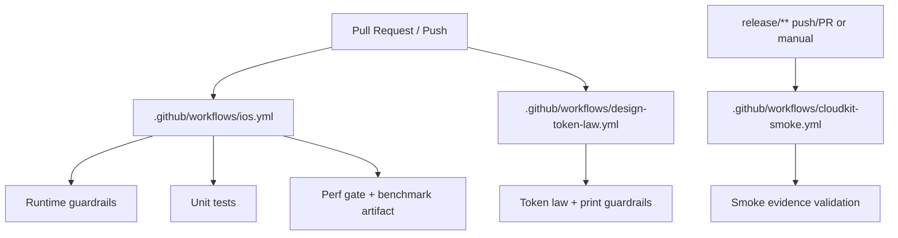
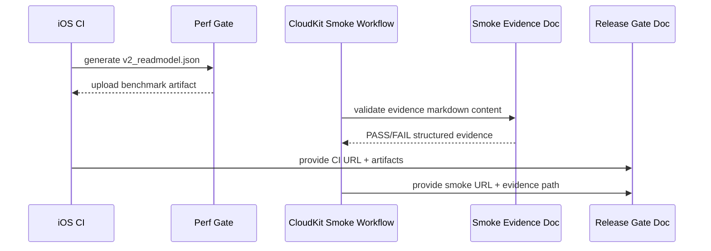

# CI, Release, and Guardrails

Last updated: 2026-02-18

This doc maps release requirements to concrete CI workflows and scripts.

Primary sources:
- `.github/workflows/ios.yml`
- `.github/workflows/cloudkit-smoke.yml`
- `.github/workflows/design-token-law.yml`
- `scripts/validate_legacy_runtime_guardrails.sh`
- `scripts/validate_cloudkit_smoke_evidence.sh`
- `scripts/install_flowctl.sh`
- `scripts/verify_flowctl.sh`
- `scripts/check-no-print-logs.sh`
- `scripts/token-law-guardrails.sh`

## CI Topology

## Workflow Inventory

| Workflow | Trigger | Core Jobs | Blocking Outputs |
| --- | --- | --- | --- |
| `.github/workflows/ios.yml` | PR + push (`main/master/develop/fn-*`) | `guardrails`, `unit-tests`, `perf-gate` | runtime grep checks, `TaskerTests`, `build/benchmarks/v2_readmodel.json`, balanced SLO |
| `.github/workflows/cloudkit-smoke.yml` | `release/**` PR/push + manual dispatch | `smoke-evidence` | runbook existence + evidence markdown validity |
| `.github/workflows/design-token-law.yml` | PR + push | `token-law` | token/lint/logging guardrails |
| `.github/workflows/main.yml` | PR review automation | codeball review | non-architecture review automation |

## Script Guardrails Map

| Script | Policy Intent | Fails When |
| --- | --- | --- |
| `scripts/validate_legacy_runtime_guardrails.sh` | Prevent runtime fallback to legacy DI/screen wiring | legacy build graph/storyboard/singleton references appear |
| `scripts/validate_cloudkit_smoke_evidence.sh` | Ensure release smoke evidence is complete and non-placeholder | required sections/PASS-FAIL fields missing or placeholders remain |
| `scripts/install_flowctl.sh` | Enforce official flowctl binary in CI, controlled local shim fallback | CI missing URL/checksum or fallback misuse |
| `scripts/verify_flowctl.sh` | Verify flowctl binary is present/executable and CI-safe | missing binary, broken version output, disallowed shim in CI |
| `scripts/check-no-print-logs.sh` | Block direct `print()` in app source | `print(` appears in production app swift files |
| `scripts/token-law-guardrails.sh` | Enforce design token and style guardrails in UI modules | disallowed color/font/shadow patterns detected |

## Release Evidence Flow

## Release Evidence Checklist

| Artifact | Required Source |
| --- | --- |
| iOS CI run URL | `.github/workflows/ios.yml` |
| CloudKit smoke run URL | `.github/workflows/cloudkit-smoke.yml` |
| Benchmark snapshot | `build/benchmarks/v2_readmodel.json` |
| Smoke evidence markdown | `docs/cloudkit-smoke-evidence/latest.md` |

## Cross-Links
- Release criteria: `docs/release-gate-v2-efgh.md`
- Smoke runbook: `docs/cloudkit-two-device-smoke.md`
- Docs index: `docs/README.md`
