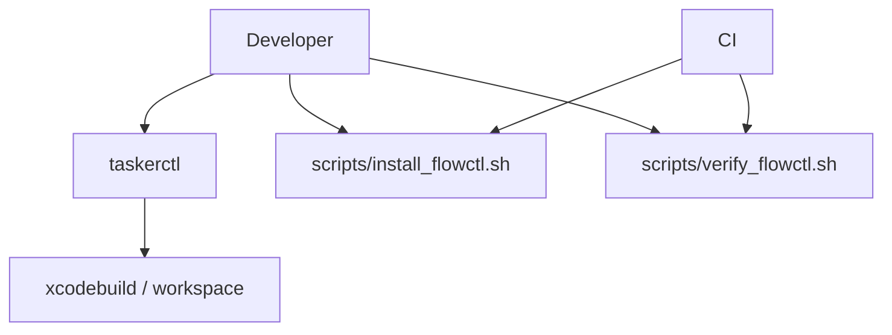

# Developer Tooling and flowctl

Last updated: 2026-02-18

This doc replaces the legacy root CLI guide content and consolidates day-to-day tooling conventions.

Primary sources:
- `taskerctl`
- `scripts/install_flowctl.sh`
- `scripts/verify_flowctl.sh`
- `.github/workflows/ios.yml`
- `README.md`

## Tooling Map



## Primary Commands

| Command | Purpose | Typical Use |
| --- | --- | --- |
| `./taskerctl setup` | Setup environment + dependencies | first-time machine bootstrap |
| `./taskerctl status` | Project and environment status | quick sanity before build/test |
| `./taskerctl clean --all` | Remove build artifacts | clear stale local state |
| `./taskerctl doctor` | Diagnostics and environment checks | pre-PR troubleshooting |
| `./taskerctl build` | Simulator build path | routine local compile check |
| `./taskerctl build device` | Device-targeted build | pre-device smoke checks |

## flowctl Policy

| Environment | Allowed Installer Mode | Required Inputs |
| --- | --- | --- |
| CI | Official binary only | `FLOWCTL_DOWNLOAD_URL` + `FLOWCTL_DOWNLOAD_SHA256` |
| Local dev | Official binary preferred | same as CI when available |
| Local fallback | Shim allowed only with explicit opt-in | `FLOWCTL_ALLOW_SHIM=1` |

## Install and Verify

```bash
# Install official binary
FLOWCTL_DOWNLOAD_URL="https://<artifact-host>/flowctl" \
FLOWCTL_DOWNLOAD_SHA256="<sha256>" \
bash scripts/install_flowctl.sh

# Verify installation
bash scripts/verify_flowctl.sh

# Local-only fallback shim (not allowed in CI)
FLOWCTL_ALLOW_SHIM=1 bash scripts/install_flowctl.sh
FLOWCTL_ALLOW_SHIM=1 bash scripts/verify_flowctl.sh
```

## Failure Modes

| Failure | Likely Cause | Recovery |
| --- | --- | --- |
| `FLOWCTL_DOWNLOAD_URL must be set in CI` | CI missing secret/env wiring | configure CI secrets/env in workflow settings |
| checksum mismatch | wrong binary or stale checksum | update artifact/checksum pair and retry |
| `shim is not allowed in CI` | CI using fallback mode | disable shim and provide official binary inputs |
| `flowctl --version failed` | binary missing/corrupt | reinstall via `scripts/install_flowctl.sh` |

## Migration Note

Legacy root CLI reference content is deprecated and removed. This document is the canonical replacement.

## Cross-Links
- CI/release guardrails: `docs/operations/ci-release-and-guardrails.md`
- Root contributor guide: `README.md`
- Docs hub: `docs/README.md`
