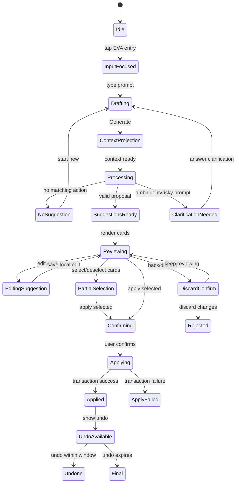

# Structured AI Deep Product Teardown for LifeBoard / EVA

Research date: 2026-04-24  
Research surface: Structured iPhone app via iPhone Mirroring  
Pass scope: Text create/edit flows, AI entry discovery, no-op state, privacy/pro gating from official docs. Voice and scan/image were intentionally skipped in this pass.

Sources:
- Structured Help Center, [What is Structured AI?](https://help.structured.app/en/articles/1782402)
- Structured Help Center, [What is Structured Pro?](https://help.structured.app/en/articles/324674)
- Structured Help Center, [Structured on iPhone](https://help.structured.app/en/articles/1069058)

## 1. Executive Summary

1. Structured AI is surfaced as a persistent bottom-tab destination, not hidden inside task creation.
2. The primary AI screen is prompt-first: large greeting, example chips, and one bottom input bar with text, mic, and scan actions.
3. Structured behaves as a hybrid command parser and scheduler: it extracts tasks, infers placement, assigns icons, creates timeline or inbox suggestions, and edits existing timeline tasks.
4. AI never silently mutated in observed flows. It generated review cards first, then required per-item Add/Save or global Accept All.
5. Create suggestions use pink `CREATE` badges; edit suggestions use orange `EDIT` badges.
6. Create card actions are `Add`, `Edit`, `Discard`; edit card actions are `Save`, `Edit`, `Discard`, `Show`.
7. Structured correctly inserted scheduled tasks into today’s timeline when explicitly told `not inbox`.
8. Structured edited only affected tasks and omitted unchanged tasks from the diff, which kept the review surface compact.
9. Post-apply timeline rows did not show persistent AI-origin badges in the observed pass.
10. Official docs state Structured AI requires Structured Pro, uses OpenAI as an external service, sends entered AI data to Structured/OpenAI servers, and may store it for up to 30 days.

## 2. What Structured AI Does

Observed directly:
- Create timeline tasks from natural language.
- Create inbox tasks from natural language.
- Infer date, start time, duration, and simple icon/category.
- Edit existing timeline tasks by moving and shortening them.
- Preserve unchanged tasks by omission from the edit suggestions.
- Show a no-op state when no matching remaining tasks exist.
- Require review before applying.
- Support individual apply/discard and global Accept All.
- Warn before discarding generated changes.

Observed in app help or official docs, not fully tested in this pass:
- Verbal instructions.
- Scan physical planner or to-do list.
- Edit, delete, and move existing tasks.
- Suggest daily, weekly, or project plans.
- Shift schedules when plans change.
- Summarize plans or completed tasks.
- Distribute inbox tasks into the day.
- Break down large goals.
- Identify scheduling conflicts.

Not tested in this pass:
- Voice UX.
- Scan/image/photo UX.
- Delete application.
- Calendar/reminders import.
- Recurrence handling.
- Paywall flow from a non-Pro account.

## 3. Complete User Journey Map

| Journey | Trigger | Input | AI processing | Review | Apply/edit/discard | Timeline result | Recovery |
| --- | --- | --- | --- | --- | --- | --- | --- |
| Text-to-plan | Bottom AI tab | Natural-language schedule | Loading status with playful copy | CREATE cards | Add/Edit/Discard per card, Accept All | Tasks appear on timeline/inbox | Back warns before discarding suggestions |
| Inbox capture | Bottom AI tab | “Add these to my inbox...” | Extracts comma-separated items | CREATE cards with Inbox label | Accept All | Items appear in Inbox newest-first | No persistent AI badge observed |
| Timeline creation | Bottom AI tab | “Create scheduled timeline tasks for today, not inbox...” | Parses explicit date/time/duration | CREATE cards with exact times | Accept All | Items inserted into today timeline | Timeline can be checked manually |
| Edit existing tasks | Bottom AI tab after tasks exist | “Move Design review... shorten Deep work...” | Reads current timeline and targets named tasks | EDIT cards only for affected tasks | Save/Edit/Discard/Show per card, Accept All | Updated time blocks | Back/discard warning available before apply |
| Repair delayed day | Bottom AI tab | “I am running 90 minutes late...” | Checks remaining scheduled tasks | No-suggestion message if nothing applicable | Start New | No mutation | Feedback icons |
| Delete tasks | AI help says supported | Not applied | Not tested | Expected suggestions first | Requires future confirmation | Not observed | Must be verified |
| Voice-to-plan | Mic entry visible | Skipped | Skipped | Skipped | Skipped | Skipped | Skipped |
| Scan-to-plan | Scan entry visible | Skipped | Skipped | Skipped | Skipped | Skipped | Skipped |

## 4. Screen-by-Screen UX Teardown

| Screenshot filename | Purpose | Layout | Primary CTA | Secondary actions | Components | Microcopy | Notes |
| --- | --- | --- | --- | --- | --- | --- | --- |
| `00_baseline_timeline_initial.png` | Timeline baseline | Date header, week strip, vertical day rail, bottom nav, FAB | Add task FAB | Tab nav | Timeline cards, completion circles | `Next up in... Ready?` | File capture blocked; observed live |
| `01_ai_home_empty.png` | AI entry hub | Large greeting, empty body, chips, bottom input | Generate after text entry | Help, mic, scan | Prompt field, chips | `Hi there! What tasks are on your agenda?` | Primary entry point |
| `02_ai_help_intro.png` | AI capability intro | Prompt card, disclaimer, response card | Start New | Feedback | Help response | Lists create/edit/delete/shift/summarize/conflict capabilities | Opened via `?` |
| `03_text_input_expanded.png` | Prompt composition | Bottom input expands into card | Generate | Mic, plus/attachment | Multiline text area | Placeholder `Tell me your plans...` | Long prompt wraps; no warning observed |
| `04_processing_loading.png` | AI thinking | Prompt card locked, spinner/status row | Stop | None | Spinner, Stop button | `Aligning the stars`, `Calibrating your calendar..` | Status copy rotates |
| `05_create_suggestions_tomorrow.png` | Generated timeline plan | Summary + stacked task cards | Accept All | Add/Edit/Discard per card | CREATE badges, icons, selection circles | “Here’s your plan...” | Pink CREATE badges |
| `06_create_timeline_today.png` | Today timeline create review | Summary + 4 cards | Accept All | Add/Edit/Discard | Exact time/duration cards | “Your timeline for today...” | Explicit `not inbox` respected |
| `07_edit_suggestions_today.png` | Existing-task edit review | Summary + affected cards only | Accept All | Save/Edit/Discard/Show | EDIT badges, selection circles | “Design review will now...” | Orange EDIT badges |
| `08_noop_shift_remaining.png` | Empty/no-op edit | Prompt + disclaimer + no-op card | Start New | Feedback | Message card | “You have no remaining tasks...” | Good clarification state |
| `09_discard_warning.png` | Leave-review safety | Popover over dimmed review | Discard Changes | Tap away | Confirmation popover | “Are you sure you want to discard your changes?” | Protects generated work |
| `10_post_apply_timeline.png` | Applied state | Normal timeline | None | Manual task interactions | Timeline blocks | Context helpers like `Task ahead!` | No AI badge visible |

## 5. Component Inventory

| Component | Purpose | Where used | States | Inputs | Outputs | EVA equivalent |
| --- | --- | --- | --- | --- | --- | --- |
| AI tab button | Global AI entry | Bottom nav | Selected/unselected | Tap | AI screen | Global EVA button/tab |
| AI input sheet | Command capture | AI screen | Empty, focused, expanded, processing | Text, mic, scan | Prompt run | Timeline-aware EVA command sheet |
| Prompt text field | Natural language input | AI screen bottom | Placeholder, multiline, long text | Typed/pasted text | Generate enabled | Multiline command composer |
| Prompt chips | Examples | AI home | Static | Tap | Prefilled/triggered prompt | Contextual EVA suggestions |
| Loading state | Progress feedback | After Generate | Spinner + rotating copy | Submitted prompt | Response or error | Grounded progress copy |
| Suggestion card | Review unit | Create/edit results | Collapsed, expanded, selected | AI proposal | Apply/edit/discard/show | EVA action card |
| CREATE badge | Action type marker | Create cards | Pink badge | Proposed create | Visual action type | `Create` badge |
| EDIT badge | Action type marker | Edit cards | Orange badge | Proposed update | Visual action type | `Move`, `Shorten`, `Edit` badges |
| Accept All button | Batch apply | Review footer | Enabled, applied/hidden | Suggestions | Mutations | Apply selected / Apply plan |
| Individual apply | Per-card mutation | Expanded cards | Add or Save | One suggestion | One mutation | Per-change apply |
| Edit suggestion control | Manual correction | Expanded cards | Opens task editor | Suggestion | Modified suggestion | Edit before apply |
| Discard control | Remove suggestion | Expanded cards | Active | Suggestion | Dismissed suggestion | Drop suggestion |
| Show control | Locate edited task | Edit cards | Active | Suggestion | Timeline/detail jump | Show in timeline |
| Discard warning | Prevent accidental exit | Back from review | Modal/popover | Back tap | Discard or continue | Unsaved proposal warning |
| Feedback controls | Rate AI result | Response footer | Thumbs up/down | Tap | Feedback | EVA feedback/rating |
| Paywall | Monetization | Not seen live; official docs say Pro | Blocked/upgrade | Tap gated feature | Upgrade | Contextual EVA upgrade |
| Permission prompt | Device access | Voice/scan skipped | Unknown | Mic/camera/photo | Allow/deny | Explicit context grant |
| Error/no-op card | Recovery | No matching tasks | Message + Start New | Unsupported/no target | No mutation | No-op with clarification |

## 6. Interaction Details

- Tap AI tab opens a standalone AI home, preserving bottom navigation.
- Tapping input focuses a bottom composer; after enough text, it expands into a larger card and shows `Generate`.
- Text field supports multiline prompt wrapping.
- Generate disables normal editing and shows a spinner, a `Stop` control, and rotating playful copy.
- Results appear as a vertical stack of cards below a summary answer.
- Tapping a card expands it and exposes item-level actions.
- Right-side circles indicate selectable suggestions; selection behavior should be further tested.
- `Accept All` applies the full visible suggestion set.
- Back from a review state shows a discard confirmation.
- After apply, Structured returns to normal app surfaces; applied timeline tasks look like ordinary tasks.
- `Show` exists on edit cards and should be copied for EVA because it links a diff to timeline context.

## 7. AI Capability Matrix

| Capability | Supported by Structured? | Evidence | UX quality | Limitations | EVA priority | EVA notes |
| --- | --- | --- | --- | --- | --- | --- |
| Create one task | Yes | CREATE card model | Strong | Not isolated in this pass | High | Support quick create |
| Create many tasks | Yes | Prompt A, today timeline prompt | Strong | Review can get tall | High | Group by day/action |
| Create inbox tasks | Yes | Inbox prompt | Strong | No AI badge after apply | High | Use for brain dumps |
| Create timeline tasks | Yes | Today timeline prompt | Strong | Needs explicit wording if inbox ambiguity exists | High | Default to timeline when times exist |
| Infer time | Yes | 7:30, 10-12, etc. | Strong | Not tested ambiguous dates deeply | High | Show confidence |
| Infer duration | Yes | 1 hr defaults, 45 min exact | Good | Some defaults unexplained | High | Explain duration assumptions |
| Infer date | Yes | Tomorrow and today parsed | Good | Locale/date ambiguity untested | High | Confirm ambiguous dates |
| Infer color/icon | Yes | Icons assigned by task type | Good | No user review of icon surfaced in card | Medium | Allow icon/color edit |
| Infer subtasks | Not observed | Help says breakdown supported | Unknown | Not tested | Medium | V1/V2 |
| Read existing tasks | Yes | Edit changed named timeline tasks | Strong | Permission prompt not seen | High | Explicit context banner |
| Avoid conflicts | Partially | Edited to non-overlap requested slots | Unknown | Conflict stress not tested | High | Diff conflict overlay |
| Edit one task | Yes | Design review moved/shortened | Strong | No before/after side-by-side | High | Add before/after diff |
| Bulk edit tasks | Yes | Two edit suggestions | Strong | More complex bulk edit untested | High | Batch operation review |
| Shift remaining day | Claimed; no-op observed | No remaining tasks state | Good no-op | Need positive case test | High | Repair my day |
| Reschedule unfinished tasks | Claimed in help | Not tested | Unknown | Deferred | High | Core EVA differentiator |
| Delete tasks | Claimed in help | Not applied | Unknown | Requires safety test | Medium | Strong safeguards |
| Scan paper planner | Official docs + visible scan icon | Skipped | Unknown | Deferred | Medium | V2 |
| Import from photo | Visible menu: Add from Photos | Skipped | Unknown | Deferred | Medium | V2 |
| Use voice | Visible mic icon + docs | Skipped | Unknown | Deferred | Medium | V2 |
| Review before apply | Yes | All mutations reviewed | Excellent | No durable diff log observed | High | Non-negotiable |
| Undo | Not observed | No post-apply undo seen | Weak/unknown | Needs deeper test | High | EVA should do better |
| Explain reasoning | Minimal | Summary answer | Moderate | No tradeoff explanation | High | EVA differentiator |
| Recommend deferral | Not observed | None | Unknown | Not tested | High | Chief-of-staff layer |
| Recommend deletion | Not observed | None | Unknown | Not tested | Medium | Safety-gated |
| Protect habits | Not observed | None | Unknown | Not part of Structured model observed | High | EVA differentiator |
| Weekly planning | Claimed in help | Not tested | Unknown | Deferred | Medium | V1/V2 |
| Weekly review | Not observed | None | Unknown | Not Structured focus | High | EVA differentiator |

## 8. Edge Case Matrix

| Scenario | Structured behavior | UX quality | Risk | EVA recommendation |
| --- | --- | --- | --- | --- |
| No matching remaining tasks | Clear no-op message, no suggestions | Good | User may expect existing tasks but current time/date filters exclude them | Explain context used and offer alternatives |
| Leaving suggestion review | Confirmation popover with `Discard Changes` | Good | Popover only offers destructive action prominently | Use Leave / Keep reviewing with clearer hierarchy |
| Long prompt | Multiline composer accepts long text | Good | Character limit not shown in app; official scraped doc mentions 2,000 characters from secondary source but not verified live | Show counter only near limit |
| Mixed casing / noisy text | AI understood edit prompt despite distorted casing | Strong | Could mask dictation errors | Show interpreted command summary before apply |
| Create today after current time | Future today slots were accepted | Strong | Past-time behavior not tested | Warn when requested time is already past |
| Conflict | Not stress-tested | Unknown | Overlap may create bad timeline | EVA should preview conflicts and fixes |
| Duplicate creation | Not tested | Unknown | Duplicate clutter | EVA should detect likely duplicates |
| AI service/network failure | Not triggered | Unknown | User loses prompt | Preserve draft and retry |
| Permission denied | Voice/scan skipped | Unknown | Feature dead end | Explain consequence and offer text fallback |
| Background during generation | Not tested | Unknown | Lost state | Persist run state |

## 9. Privacy and Permission UX

| Permission/privacy moment | Trigger | Copy observed/source | User options | Consequence | UX quality | EVA recommendation |
| --- | --- | --- | --- | --- | --- | --- |
| AI disclaimer | Every AI response area | `The AI may make mistakes or produce inaccurate information. Be sure to check important tasks.` | None | Reminder only | Useful but generic | Include “EVA used: today timeline, inbox” |
| External processing | Official help | Uses external OpenAI service; entered AI data sent to Structured/OpenAI servers; may be stored up to 30 days | Avoid AI | No AI use | Clear in docs, not prominent in observed run | Surface before first cloud run |
| Calendar/task access | Official help | OpenAI never has access when AI not in use | Use AI or ignore tab | Context sent only during use per docs | Reasonable | Local-first context packs with per-run disclosure |
| Disable AI | Official help | Can ignore tab; future optional UI visibility planned | Ignore | AI remains visible | Weak | Provide explicit hide/disable and clear history |
| Mic/camera/photo | Visible controls | Skipped | Unknown | Unknown | Deferred | Native prompts plus fallback |

Recommended EVA privacy model:
- Local-first by default for command parsing and context ranking.
- Cloud only when user opts into external reasoning.
- Per-run context receipt: “EVA used Today timeline, Inbox, Habits, Calendar conflicts.”
- No silent mutation.
- Clear assistant history delete.
- Revoke controls for calendar, reminders, photos, microphone, cloud inference.

## 10. Monetization / Pro Gating

Official docs state Structured AI requires Structured Pro on iOS and Android and is not available on Web. In this pass, AI was usable, so the account/device was effectively Pro-enabled, trial-enabled, or otherwise not blocked.

Observed:
- No paywall appeared during text create/edit.
- AI tab remained visible.
- No visible usage quota appeared.

Recommendation for LifeBoard:
- Free: limited EVA text planning and inbox parsing per week.
- Pro: unlimited text planning, timeline repair, diff/apply/undo, cloud reasoning when opted in.
- Premium: scan-to-plan, weekly review automation, advanced habit protection, proactive day repair.
- Trial: 14 days full EVA, because the value is experiential and depends on seeing applied plans.

## 11. UX Strengths

- Persistent AI tab makes the feature discoverable.
- Prompt-first UI reduces setup friction.
- Review-before-apply is consistently enforced.
- Badges clearly distinguish create vs edit at review time.
- Per-card controls support partial trust.
- `Show` on edit cards recognizes that users need spatial timeline context.
- No-op state avoids fake suggestions.
- Icons make AI-created cards scannable.
- Back/discard warning prevents accidental loss of AI output.

## 12. UX Weaknesses / Gaps

- No persistent AI-origin badges were visible after apply.
- No side-by-side before/after diff was observed for edits.
- The summary explains what changed, but not why.
- No visible undo appeared after apply in the observed pass.
- Privacy disclosure is mostly in help/docs, not prominent in the live AI flow.
- AI tab is broad but not contextual; “Repair my day” was not surfaced from the timeline when tasks were upcoming.
- The review list can become tall for multi-task plans.
- Selection circles are visually present but their precise behavior needs further testing.

## 13. EVA Build Spec

### Feature: Plan with EVA

User job: Turn a natural-language plan into reviewed timeline/inbox changes.

Entry points:
- Global EVA button/tab.
- Timeline contextual button: `Plan with EVA`.
- Inbox button: `Organize with EVA`.
- Empty-day prompt: `Plan today`.

Inputs:
- Text in MVP.
- Voice and scan deferred to V2 unless already available.

AI behavior:
- Parse tasks, dates, times, durations, placement, and project/life-area hints.
- Default timed items to timeline and untimed items to inbox.
- Generate explicit assumptions when duration/date is inferred.

Review UI:
- Group by action type and day.
- Use action badges: Create, Move, Shorten, Defer, Drop, Needs review.
- Show before/after for edits.
- Provide per-card Apply/Edit/Discard/Show and global Apply selected.

Apply behavior:
- Mutate only after confirmation.
- Preserve metadata unless explicitly changed.
- Produce bounded undo.
- Log activity in EVA history.

Edge cases:
- No matching tasks -> explain context used.
- Conflicts -> propose alternatives.
- Past times -> ask whether to schedule tomorrow or later today.
- Duplicates -> merge/skip suggestion.

Data model needs:
- AssistantActionRun, AssistantActionProposal, proposal status, affected task IDs, before/after snapshots, source context list, undo deadline, badge metadata.

Priority:
- MVP.

MVP scope:
- Text create timeline/inbox, edit existing tasks, review/apply/undo.

V2 scope:
- Voice, scan/image, weekly planning, deeper habit protection.

### Feature Requirements

| EVA feature | User job | MVP behavior | V2 behavior |
| --- | --- | --- | --- |
| Plan with EVA from text | Convert prompt to plan | Parse and propose creates/edits | Multi-turn clarification |
| Plan with EVA from voice | Capture messy verbal plan | Deferred | Transcript review and edit |
| Scan-to-plan | Import paper plan | Deferred | OCR + review + placement |
| Image-to-plan | Convert screenshot to tasks | Deferred | Photo picker + extraction |
| Inbox brain dump parser | Convert list to inbox items | Create inbox suggestions | Auto-project/life-area tags |
| Timeline task creation | Schedule timed items | Create timeline cards | Conflict-aware packing |
| Existing task editing | Move/shorten/change tasks | Update cards with before/after | Bulk repair policies |
| Bulk shift/running late repair | Repair day | Shift future tasks after review | Drop/defer lower-value work |
| Unfinished task triage | End-of-day cleanup | Suggest defer/keep/drop | Learn user patterns |
| Delete/defer/drop workflow | Reduce overload | Prefer defer/drop; confirm deletes | Vacation mode |
| Suggestion review screen | Build trust | Cards + Apply selected | Timeline diff overlay |
| Timeline diff preview | See effect | Before/after rows | Animated overlay |
| EVA action badges | Explain provenance | Temporary badges | Persistent activity log |
| Privacy controls | Trust AI | Context receipt per run | Local/cloud mode switch |
| Pro/trial gating | Monetize value | Free quota + Pro apply | Premium automations |
| Error/recovery | Avoid lost work | Retry, preserve prompt | Offline local fallback |

### Porting Spec for Tasker EVA

This section translates the Structured patterns into concrete Tasker/EVA implementation requirements. Tasker already has the right safety backbone: `AssistantActionPipelineUseCase` supports propose -> confirm -> apply -> undo, `AssistantActionRunDefinition` persists a run, and undo is bounded by a 30-minute window. The missing layer is a richer proposal schema and a Structured-style review UI for schedule-aware actions.

#### Existing Tasker Fit

| Existing Tasker concept | Current role | Fit for Structured-like EVA | Required extension |
| --- | --- | --- | --- |
| `AssistantActionPipelineUseCase` | Persists proposal, confirms, applies, generates undo | Keep as mutation gate | Add richer proposal metadata and selected-command apply |
| `AssistantCommandEnvelope` | Stores command list and rationale | Keep as run payload | Add schema v3 fields for proposal groups, source context, display cards |
| `AssistantCommand` | Create/update/delete/move/complete/restore | Good safety primitive | Add schedule-aware commands |
| `AssistantTaskSnapshot` | Full task snapshot for restore | Good undo foundation | Use for every update/delete undo |
| `AssistantDiffPreviewBuilder` | Simple text diff lines | Good fallback | Replace/augment with card-level diff model |
| `LLMContextProjectionService` | Builds assistant context | Good context source | Return context receipt metadata for UI |
| `ChatView` / assistant cards | Existing AI surface | Can host EVA plans | Add bottom-sheet command and proposal review screen |

#### Command Schema Needed

Current `AssistantCommand.createTask(projectID:title:)` cannot represent Structured-style scheduled timeline creation. EVA needs schema v3 commands that can express the full task fields shown in the review UI.

Recommended command additions:

```swift
public enum AssistantCommand {
    case createScheduledTask(
        projectID: UUID,
        title: String,
        scheduledStartAt: Date,
        scheduledEndAt: Date,
        estimatedDuration: TimeInterval?,
        lifeAreaID: UUID?,
        priority: TaskPriority?,
        energy: TaskEnergy?,
        category: TaskCategory?,
        context: TaskContext?,
        details: String?,
        tagIDs: [UUID]
    )

    case createInboxTask(
        projectID: UUID,
        title: String,
        estimatedDuration: TimeInterval?,
        lifeAreaID: UUID?,
        priority: TaskPriority?,
        category: TaskCategory?,
        details: String?,
        tagIDs: [UUID]
    )

    case updateTaskSchedule(
        taskID: UUID,
        scheduledStartAt: Date?,
        scheduledEndAt: Date?,
        estimatedDuration: TimeInterval?,
        dueDate: Date?
    )

    case updateTaskFields(
        taskID: UUID,
        title: String?,
        details: String?,
        priority: TaskPriority?,
        energy: TaskEnergy?,
        category: TaskCategory?,
        context: TaskContext?,
        lifeAreaID: UUID?,
        tagIDs: [UUID]?
    )

    case deferTask(
        taskID: UUID,
        targetDate: Date,
        reason: AssistantDeferralReason
    )

    case dropTaskFromToday(
        taskID: UUID,
        destination: AssistantDropDestination,
        reason: String
    )
}
```

Implementation rule: every update/delete/defer/drop command must capture an `AssistantTaskSnapshot` before apply and persist deterministic inverse commands in `undoCommands`.

#### Proposal Display Model

Do not render raw commands directly. Structured’s card UI works because the proposal is human-readable and action-specific. EVA should introduce a display model produced after command validation:

```swift
struct EvaProposalCard: Identifiable, Codable, Equatable {
    enum Kind: String, Codable {
        case create
        case edit
        case move
        case shorten
        case defer
        case drop
        case delete
        case noOp
        case needsReview
    }

    var id: UUID
    var runID: UUID
    var commandIndexes: [Int]
    var kind: Kind
    var title: String
    var subtitle: String
    var before: EvaTaskCardSnapshot?
    var after: EvaTaskCardSnapshot?
    var badgeText: String
    var badgeTone: EvaProposalTone
    var primaryAction: EvaProposalAction
    var secondaryActions: [EvaProposalAction]
    var riskLevel: EvaProposalRisk
    var contextExplanation: String?
    var isSelectedByDefault: Bool
}
```

Structured mapping:
- Pink `CREATE` -> `kind: .create`, primary action `Add`.
- Orange `EDIT` -> `kind: .edit` or `.move/.shorten`, primary action `Save`.
- `Show` -> timeline jump anchored to `after.scheduledStartAt`.
- `Accept All` -> apply selected proposal cards, not blindly every command.
- Back discard warning -> reject pending run only after confirmation.

#### EVA Review UI Requirements

Screen structure:
- Top context receipt: `EVA used Today timeline, Inbox, Habits, Calendar`.
- User command collapsed in a bordered prompt card.
- EVA summary in one paragraph: what will change, what remains unchanged, and why.
- Grouped proposal cards:
  - `Creates`
  - `Schedule changes`
  - `Deferrals`
  - `Drops / Deletes`
  - `Needs review`
- Sticky footer:
  - Primary: `Apply selected`
  - Secondary: `Edit request`
  - Tertiary: `Discard`
- Each card:
  - Action badge.
  - Icon/life-area color.
  - Title.
  - Before/after time row for edits.
  - Placement: Timeline or Inbox.
  - Reason/assumption line.
  - Controls: Apply/Save, Edit, Discard, Show.

Card copy examples:
- Create timeline: `Create: Design review`, `Today, 3:30-4:15 PM (45 min)`, assumption `Scheduled from your prompt.`
- Edit schedule: `Move: Design review`, `Before 3:30-4:15 PM -> After 4:00-4:30 PM`, reason `You asked to move it and shorten it.`
- No-op: `No matching tasks found`, `I checked the rest of today and found no uncompleted scheduled tasks after now.`
- Conflict: `Needs review`, `Gym would overlap Dinner by 15 min. Choose which one moves.`

#### Timeline Integration Requirements

EVA should improve beyond Structured by showing a true timeline diff before apply.

MVP:
- For each proposal card, `Show` scrolls the timeline to the affected time.
- Timeline rows use temporary overlay styles while reviewing:
  - New: green outline / `Create` badge.
  - Moved: amber outline with ghost at old time.
  - Shortened: amber end-cap marker.
  - Deferred: blue arrow badge.
  - Dropped/deleted: red strike or removal preview, never applied silently.
- Preserve the user’s current day and scroll position after returning from review.

Ideal:
- Split preview mode:
  - Left/old or ghost overlay.
  - Right/new schedule.
  - Conflict markers in the gutter.
- Animated apply:
  - Cards move to new slots.
  - Created tasks fade in.
  - Deferred tasks slide to target date/inbox.

#### Scheduling Rules EVA Should Implement

| Rule | Required behavior |
| --- | --- |
| Timed prompt | Create timeline proposals, not inbox proposals |
| Untimed prompt | Create inbox proposals unless the user asks EVA to plan/schedule |
| Date missing | Use current selected timeline day; show assumption |
| Duration missing | Infer from task type, show assumption, allow edit |
| Past time today | Ask whether to schedule later today or tomorrow |
| Existing conflict | Do not silently overlap unless the user explicitly asked for exact times |
| Calendar event conflict | Treat imported calendar as hard block by default |
| Habit/routine conflict | Treat protected habits as soft-hard blocks; explain if moving around them |
| Completed task | Do not edit unless prompt explicitly includes completed tasks |
| Recurring task | Ask one instance / future / all before applying |
| Large change | Require stronger confirmation when affecting 5+ tasks or crossing days |
| Delete | Prefer defer/drop; explicit delete requires separate confirmation |

#### State Machine



#### Error and Recovery Copy

| Situation | EVA copy |
| --- | --- |
| No tasks to shift | `I checked the rest of today and did not find uncompleted scheduled tasks to move.` |
| Prompt too vague | `I can repair your day, but I need one constraint: protect routines, protect meetings, or make the day lighter?` |
| Impossible workload | `This does not fit. I can keep 3 hours, defer 4 tasks, and leave 1 task unscheduled for review.` |
| Conflict | `This overlaps Dinner by 15 minutes. I can move Dinner later or shorten Deep Work.` |
| Past time | `2:00 AM has already passed today. Should I add it for tomorrow or schedule it later today?` |
| Service failure | `EVA could not finish this plan. Your prompt is saved; try again or create tasks manually.` |
| Apply failure | `I could not apply all changes. Nothing was partially applied.` |
| Undo expired | `The undo window has expired. I can still propose a reverse plan.` |

#### Apply and Undo Requirements

- Apply must be transactional. If one command fails, no proposal should partially apply.
- Store before snapshots for every mutated task.
- Store created task IDs after apply so undo can delete those specific created tasks.
- Undo window should use the existing 30-minute pipeline default.
- After apply, show a toast:
  - `EVA updated 2 tasks. Undo for 30 min.`
- Activity log entry:
  - user command
  - summary
  - applied cards
  - discarded cards
  - context used
  - undo status

#### Test Cases for Porting

| Test | Expected result |
| --- | --- |
| `Create scheduled timeline tasks for today, not inbox...` | Generates `createScheduledTask` cards with exact start/end |
| `Add these to my inbox...` | Generates `createInboxTask` cards only |
| `Move Design review to 4 PM for 30 minutes` | Generates one edit card with before/after time |
| `Shorten Deep Work to 45 minutes` | Generates one shorten/edit card and preserves title/project |
| `Keep Gym and Dinner unchanged` | Gym and Dinner do not appear as mutation cards |
| `I am running 90 minutes late` with no future tasks | Generates no-op card and no commands |
| `Shift everything after lunch by 45 minutes` | Generates update schedule cards only for tasks after lunch |
| `Clear tomorrow except personal routines` | Generates defer/drop/delete proposals and requires high-risk confirmation |
| Apply selected cards | Only selected command indexes apply |
| Undo after apply | Restores before snapshots and deletes created tasks |

#### Acceptance Criteria

- EVA can create at least four scheduled timeline tasks from one prompt and apply them only after review.
- EVA can create inbox tasks from a comma-separated brain dump without scheduling them.
- EVA can edit existing timeline tasks by name, time, and duration.
- EVA shows affected and unaffected tasks clearly; unchanged tasks are named in the summary but not mutated.
- EVA shows before/after for every edit.
- EVA blocks or warns on deletes, recurring edits, imported calendar edits, and large batch changes.
- EVA displays what context it used before the user applies.
- EVA can undo an applied run within the existing 30-minute window.
- EVA has deterministic tests for command generation, preview rendering, apply, failure rollback, and undo.

## 14. Recommended EVA UX Architecture

- Global EVA command button for broad planning.
- Timeline-aware bottom sheet that knows current day/time and selected task.
- Contextual `Repair my day` entry when current time passes planned tasks or pressure is high.
- Suggestion diff screen with grouped changes and before/after details.
- Apply plan screen with progress, success, and undo deadline.
- EVA activity log showing applied, dismissed, edited, and reverted changes.
- Current-time-aware timeline rules:
  - Do not schedule in the past without confirmation.
  - Protect calendar events and routines.
  - Prefer deferral before deletion.
- Habit protection layer:
  - Mark protected routines.
  - Explain when a plan moves around a habit rather than replacing it.
- Weekly planning and weekly review layer:
  - Convert backlog into week plan.
  - Review what slipped and recommend repair.

## 15. Final Prioritized Roadmap

| Phase | Feature | User value | Complexity | Dependencies | Priority |
| --- | --- | --- | --- | --- | --- |
| MVP | Text Plan with EVA | Fast plan capture | Medium | Assistant proposals | P0 |
| MVP | Timeline create suggestions | Scheduled day building | Medium | Task create/apply pipeline | P0 |
| MVP | Existing task edit suggestions | Day repair foundation | High | Before/after snapshots | P0 |
| MVP | Review/apply/undo | Trust and safety | High | AssistantActionRun | P0 |
| MVP | No-op clarification states | Avoid bad mutations | Low | Context projection | P0 |
| MVP | Context receipt privacy | Trust | Medium | Context projection metadata | P0 |
| V1 | Running-late repair | Chief-of-staff value | High | Current-time engine | P1 |
| V1 | Unfinished task triage | End-of-day cleanup | High | Priority/life-area signals | P1 |
| V1 | Conflict detection/fix | Calendar-aware planning | High | Calendar integration | P1 |
| V1 | EVA badges/activity log | Explainability | Medium | Assistant history | P1 |
| V2 | Voice plan | Low-friction capture | Medium | Speech/transcript | P2 |
| V2 | Scan/image-to-plan | Paper/screenshot import | High | OCR/photo permissions | P2 |
| V2 | Weekly planning/review | Strategic planning | High | Analytics/history | P2 |
| Later | Proactive automation | Premium differentiation | Very high | Trust model, notifications | P3 |

## 16. Appendix


### Tested Prompts

- `Tomorrow I have a morning walk at 7:30, deep work from 10 to 12, lunch at 1, design review at 3, gym at 6:30, and dinner at 8.`
- `Add these to my inbox: call dentist, buy groceries, pay electricity bill, review PRD.`
- `I am running 90 minutes late. Shift all remaining tasks today by 90 minutes.`
- `Create scheduled timeline tasks for today, not inbox: 3:30 PM Design review for 45 minutes, 4:30 PM Deep work product spec for 60 minutes, 6:30 PM Gym for 60 minutes, and 8:00 PM Dinner for 60 minutes.`
- `Edit today's timeline: move Design review to 4:00 PM for 30 minutes, shorten Deep work product spec to 45 minutes starting at 4:45 PM, keep Gym and Dinner unchanged.`

### Observed Outputs

- Tomorrow plan: six timeline CREATE suggestions.
- Inbox list: four Inbox CREATE suggestions.
- Today timeline: four timeline CREATE suggestions, applied.
- Today edit: two EDIT suggestions, applied.
- Running late: no-op message because no remaining tasks matched at that moment.

### Failed / Deferred Tests

- Screenshot file capture failed due iPhone Mirroring protected display behavior.
- Voice skipped by user request.
- Scan/image skipped by user request.
- Deletion not applied because it requires action-time confirmation and was not needed for this pass.
- Calendar/reminders import not used to avoid personal accounts.

### Open Questions

- Does Structured expose post-apply undo in a toast or only elsewhere?
- Do AI badges persist in task detail, history, or only suggestion review?
- How does deletion review differ from edit review?
- How does Structured handle recurring tasks and imported calendar events?
- What exact permission copy appears for mic, camera, and photo access?
- What happens for a non-Pro/free account tapping AI?

## 17. Top 10 EVA Capabilities to Build Based on Structured AI Research

| Capability | Why it matters | Exact UX entry point | MVP behavior | Ideal behavior |
| --- | --- | --- | --- | --- |
| Text Plan with EVA | Fastest way to capture a day | Global EVA button | Generate reviewed create cards | Multi-turn plan refinement |
| Timeline task creation | Users think in time blocks | Timeline `Plan with EVA` | Timed tasks become timeline proposals | Conflict-aware auto-layout |
| Inbox brain dump parser | Reduces capture friction | Inbox `Organize with EVA` | Untimed list becomes inbox cards | Categorize and prioritize |
| Existing task editing | Core repair workflow | Timeline command sheet | Move/shorten named tasks | Full before/after diff overlay |
| Running-late repair | High-value chief-of-staff job | Contextual `Repair my day` | Shift remaining tasks after review | Keep/defer/drop with tradeoff explanation |
| Selective suggestion review | Builds trust | EVA proposal screen | Apply/Edit/Discard per card | Apply selected with rationale |
| Timeline `Show` action | Review needs spatial context | Each edit card | Jump to affected time | Split-screen diff preview |
| No-op clarification | Prevents hallucinated mutations | Any failed command | Explain no matching context | Offer corrected prompts/actions |
| Context receipt privacy | Differentiates EVA from cloud-first AI | Top of proposal screen | Show data used | Local/cloud toggle per run |
| Undo + activity log | Makes AI actions reversible | Post-apply toast/log | Undo within window | Full replay/revert history |
