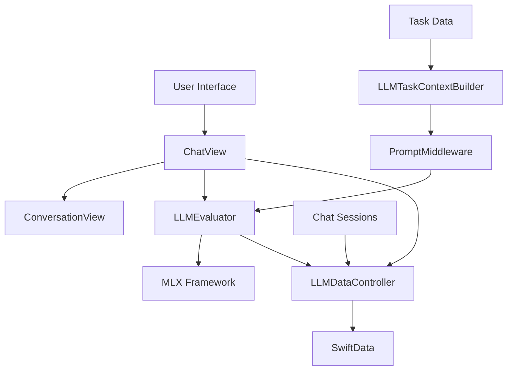
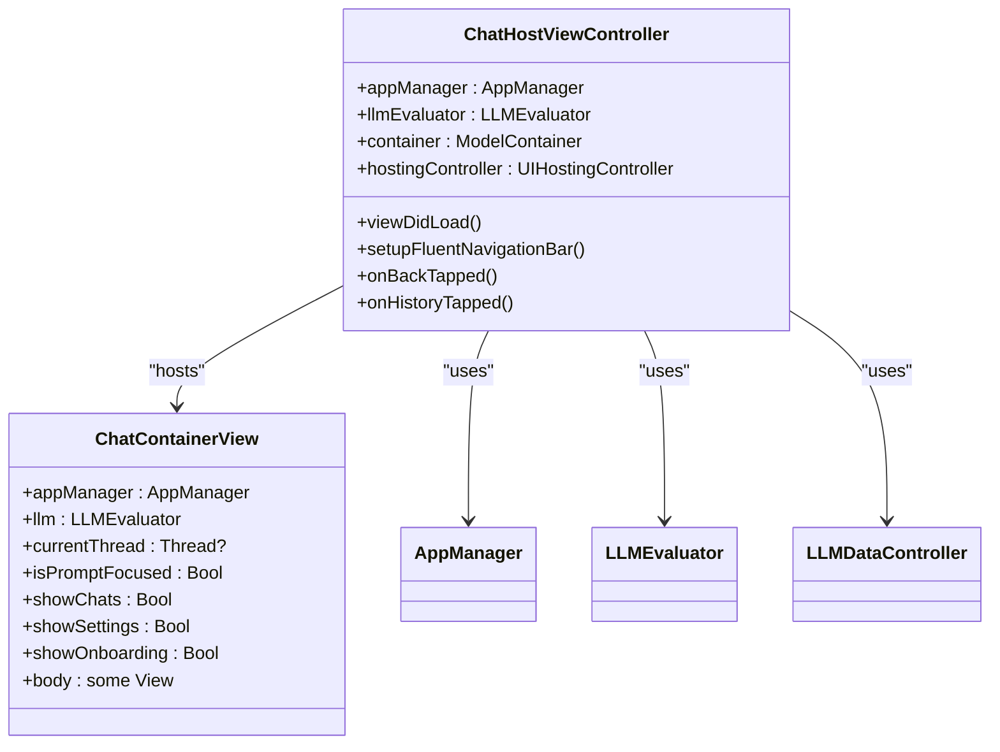
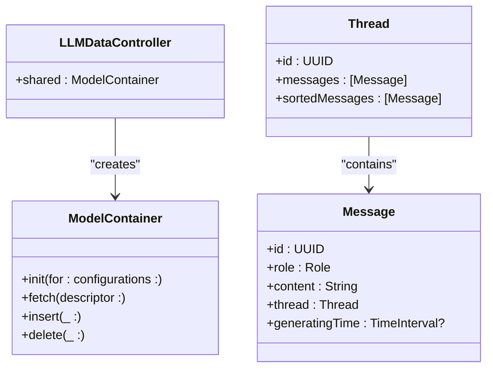
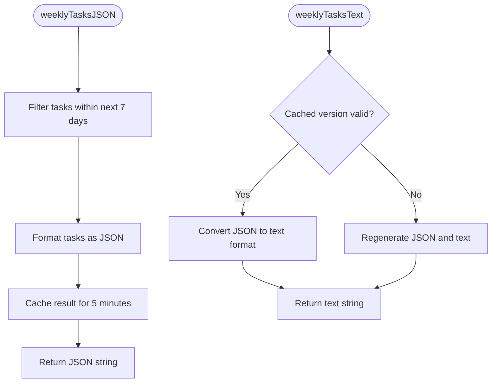
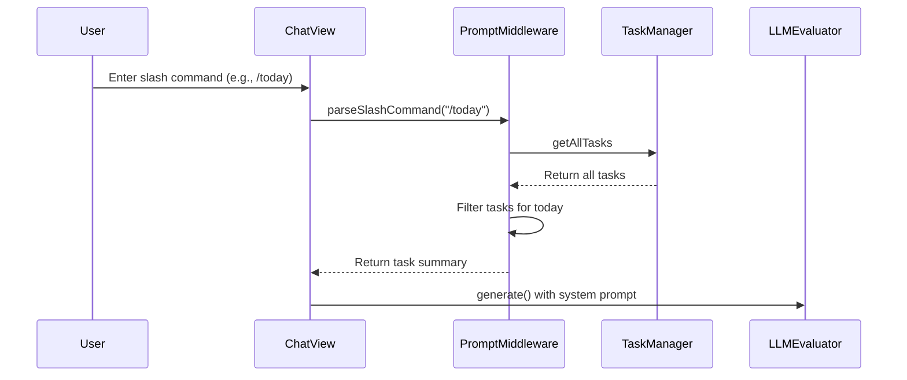
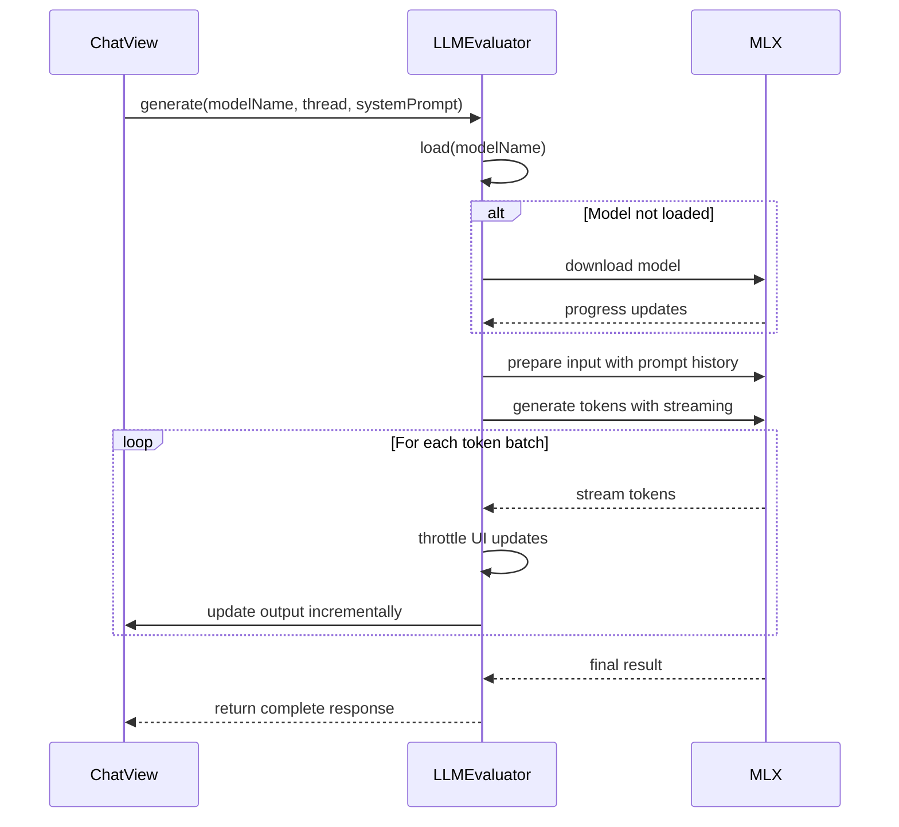
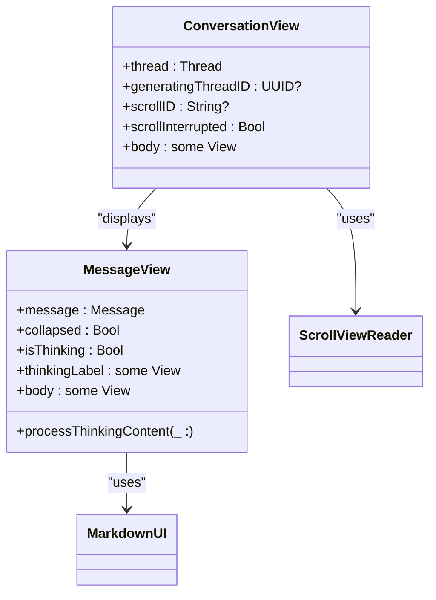
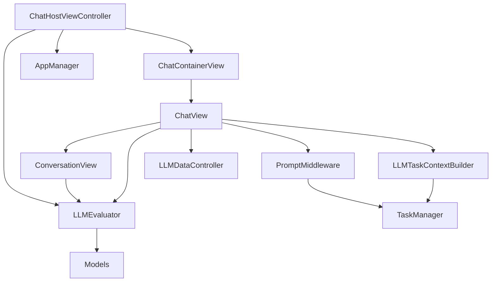

# AI Integration

<cite>
**Referenced Files in This Document**   
- [ChatHostViewController.swift](file://To%20Do%20List/LLM/ChatHostViewController.swift)
- [LLMDataController.swift](file://To%20Do%20List/LLM/Models/LLMDataController.swift)
- [LLMTaskContextBuilder.swift](file://To%20Do%20List/LLM/Models/LLMTaskContextBuilder.swift)
- [PromptMiddleware.swift](file://To%20Do%20List/LLM/Models/PromptMiddleware.swift)
- [ChatView.swift](file://To%20Do%20List/LLM/Views/Chat/ChatView.swift)
- [LLMEvaluator.swift](file://To%20Do%20List/LLM/Models/LLMEvaluator.swift)
- [ConversationView.swift](file://To%20Do%20List/LLM/Views/Chat/ConversationView.swift)
- [Models.swift](file://To%20Do%20List/LLM/Models/Models.swift)
- [AppDelegate.swift](file://To%20Do%20List/AppDelegate.swift)
</cite>

## Table of Contents
1. [Introduction](#introduction)
2. [Project Structure](#project-structure)
3. [Core Components](#core-components)
4. [Architecture Overview](#architecture-overview)
5. [Detailed Component Analysis](#detailed-component-analysis)
6. [Dependency Analysis](#dependency-analysis)
7. [Performance Considerations](#performance-considerations)
8. [Troubleshooting Guide](#troubleshooting-guide)
9. [Conclusion](#conclusion)

## Introduction
Tasker is an iOS productivity application that integrates artificial intelligence to enhance task management through a gamified interface. The AI integration centers around a local large language model (LLM) system that provides personalized assistance based on the user's task data. This documentation details the architecture and implementation of the AI-powered chat assistant system, focusing on the components that enable user interaction with the LLM, context-aware prompting, and secure local processing.

## Project Structure
The Tasker application follows a Model-View-Controller (MVC) architecture with a hybrid approach incorporating modern SwiftData patterns for the LLM module. The project is organized into feature-based directories, with the LLM functionality isolated in a dedicated directory structure.

```mermaid
graph TB
LLM[LLM Module]
subgraph LLM
LLM --> ChatHostViewController
LLM --> Models
LLM --> Views
LLM --> ModelsDir[Models]
end
Views --> ChatView
Views --> ConversationView
ModelsDir --> LLMDataController
ModelsDir --> LLMEvaluator
ModelsDir --> LLMTaskContextBuilder
ModelsDir --> PromptMiddleware
```

**Diagram sources**
- [ChatHostViewController.swift](file://To%20Do%20List/LLM/ChatHostViewController.swift)
- [ChatView.swift](file://To%20Do%20List/LLM/Views/Chat/ChatView.swift)
- [LLMDataController.swift](file://To%20Do%20List/LLM/Models/LLMDataController.swift)

**Section sources**
- [README.md](file://README.md#L1-L1617)

## Core Components
The AI integration in Tasker consists of several core components that work together to provide a seamless chat assistant experience. These components include the chat interface, data controller, context builder, prompt middleware, and model evaluator. The system is designed to operate locally on the device, ensuring user privacy while providing intelligent task suggestions and natural language processing capabilities.

**Section sources**
- [ChatHostViewController.swift](file://To%20Do%20List/LLM/ChatHostViewController.swift#L1-L141)
- [LLMDataController.swift](file://To%20Do%20List/LLM/Models/LLMDataController.swift#L1-L17)
- [LLMEvaluator.swift](file://To%20Do%20List/LLM/Models/LLMEvaluator.swift#L1-L166)

## Architecture Overview
The AI integration architecture follows a layered approach with clear separation of concerns between presentation, business logic, and data layers. The system uses SwiftUI for the chat interface, which is hosted within a UIKit view controller, and leverages SwiftData for local persistence of chat sessions.



**Diagram sources**
- [ChatView.swift](file://To%20Do%20List/LLM/Views/Chat/ChatView.swift#L1-L441)
- [LLMEvaluator.swift](file://To%20Do%20List/LLM/Models/LLMEvaluator.swift#L1-L166)
- [LLMTaskContextBuilder.swift](file://To%20Do%20List/LLM/Models/LLMTaskContextBuilder.swift#L1-L281)
- [PromptMiddleware.swift](file://To%20Do%20List/LLM/Models/PromptMiddleware.swift#L1-L56)
- [LLMDataController.swift](file://To%20Do%20List/LLM/Models/LLMDataController.swift#L1-L17)

## Detailed Component Analysis

### ChatHostViewController Analysis
The `ChatHostViewController` serves as the bridge between the UIKit-based application and the SwiftUI-based chat interface. It hosts the SwiftUI chat container and manages the navigation interface.



**Diagram sources**
- [ChatHostViewController.swift](file://To%20Do%20List/LLM/ChatHostViewController.swift#L1-L141)

**Section sources**
- [ChatHostViewController.swift](file://To%20Do%20List/LLM/ChatHostViewController.swift#L1-L141)

### LLMDataController Analysis
The `LLMDataController` is a singleton that provides a shared SwiftData container for the LLM module, ensuring all views access the same persistent store.



**Diagram sources**
- [LLMDataController.swift](file://To%20Do%20List/LLM/Models/LLMDataController.swift#L1-L17)

**Section sources**
- [LLMDataController.swift](file://To%20Do%20List/LLM/Models/LLMDataController.swift#L1-L17)

### LLMTaskContextBuilder Analysis
The `LLMTaskContextBuilder` is responsible for exporting the user's tasks as a compact JSON string that can be injected into the LLM system prompt, enabling context-aware responses.



**Diagram sources**
- [LLMTaskContextBuilder.swift](file://To%20Do%20List/LLM/Models/LLMTaskContextBuilder.swift#L1-L281)

**Section sources**
- [LLMTaskContextBuilder.swift](file://To%20Do%20List/LLM/Models/LLMTaskContextBuilder.swift#L1-L281)

### PromptMiddleware Analysis
The `PromptMiddleware` handles prompt engineering by building task summaries based on user requests, which are then incorporated into the LLM prompts to guide task suggestions.



**Diagram sources**
- [PromptMiddleware.swift](file://To%20Do%20List/LLM/Models/PromptMiddleware.swift#L1-L56)
- [ChatView.swift](file://To%20Do%20List/LLM/Views/Chat/ChatView.swift#L1-L441)

**Section sources**
- [PromptMiddleware.swift](file://To%20Do%20List/LLM/Models/PromptMiddleware.swift#L1-L56)

### ChatView Analysis
The `ChatView` implements the main chat interface, handling message input, response streaming, and context display. It processes user input and manages the conversation flow.

```mermaid
flowchart TD
A[User types message] --> B{Empty?}
B --> |No| C[Parse slash commands]
C --> D{Thread exists?}
D --> |No| E[Create new thread]
E --> F[Save to SwiftData]
D --> |Yes| F
F --> G[Build system prompt]
G --> H[Include task context]
H --> I[Call LLMEvaluator.generate()]
I --> J[Stream response tokens]
J --> K[Update UI incrementally]
K --> L[Save assistant response]
```

**Diagram sources**
- [ChatView.swift](file://To%20Do%20List/LLM/Views/Chat/ChatView.swift#L1-L441)

**Section sources**
- [ChatView.swift](file://To%20Do%20List/LLM/Views/Chat/ChatView.swift#L1-L441)

### LLMEvaluator Analysis
The `LLMEvaluator` manages API communication with the MLX framework, handling model loading, generation, and error handling for the LLM operations.



**Diagram sources**
- [LLMEvaluator.swift](file://To%20Do%20List/LLM/Models/LLMEvaluator.swift#L1-L166)
- [ChatView.swift](file://To%20Do%20List/LLM/Views/Chat/ChatView.swift#L1-L441)

**Section sources**
- [LLMEvaluator.swift](file://To%20Do%20List/LLM/Models/LLMEvaluator.swift#L1-L166)

### ConversationView Analysis
The `ConversationView` renders the chat messages with support for thinking indicators and response streaming visualization.



**Diagram sources**
- [ConversationView.swift](file://To%20Do%20List/LLM/Views/Chat/ConversationView.swift#L1-L239)

**Section sources**
- [ConversationView.swift](file://To%20Do%20List/LLM/Views/Chat/ConversationView.swift#L1-L239)

## Dependency Analysis
The AI integration components have a well-defined dependency structure that ensures separation of concerns while enabling seamless data flow between components.



**Diagram sources**
- [ChatHostViewController.swift](file://To%20Do%20List/LLM/ChatHostViewController.swift#L1-L141)
- [ChatView.swift](file://To%20Do%20List/LLM/Views/Chat/ChatView.swift#L1-L441)
- [LLMEvaluator.swift](file://To%20Do%20List/LLM/Models/LLMEvaluator.swift#L1-L166)
- [LLMTaskContextBuilder.swift](file://To%20Do%20List/LLM/Models/LLMTaskContextBuilder.swift#L1-L281)
- [PromptMiddleware.swift](file://To%20Do%20List/LLM/Models/PromptMiddleware.swift#L1-L56)
- [LLMDataController.swift](file://To%20Do%20List/LLM/Models/LLMDataController.swift#L1-L17)
- [ConversationView.swift](file://To%20Do%20List/LLM/Views/Chat/ConversationView.swift#L1-L239)

**Section sources**
- [ChatHostViewController.swift](file://To%20Do%20List/LLM/ChatHostViewController.swift#L1-L141)
- [ChatView.swift](file://To%20Do%20List/LLM/Views/Chat/ChatView.swift#L1-L441)

## Performance Considerations
The AI integration system incorporates several performance optimizations to ensure responsive user experience:

1. **Caching**: The `LLMTaskContextBuilder` caches generated JSON for 5 minutes to avoid recomputation
2. **Throttled UI Updates**: The `LLMEvaluator` updates the UI every 4 tokens to balance responsiveness with performance
3. **Background Operations**: Model loading and token generation occur on background threads
4. **Memory Management**: The system limits GPU cache and selects models based on available device memory
5. **Efficient Data Access**: The `PromptMiddleware` filters tasks efficiently using in-memory collections

The system also implements progressive enhancement by showing a loading indicator during model download and providing immediate feedback during response generation.

## Troubleshooting Guide
Common issues and their solutions for the AI integration system:

**Section sources**
- [LLMEvaluator.swift](file://To%20Do%20List/LLM/Models/LLMEvaluator.swift#L1-L166)
- [ChatView.swift](file://To%20Do%20List/LLM/Views/Chat/ChatView.swift#L1-L441)
- [LLMTaskContextBuilder.swift](file://To%20Do%20List/LLM/Models/LLMTaskContextBuilder.swift#L1-L281)

### Model Not Found Error
**Symptom**: "Failed: modelNotFound" error when generating responses
**Cause**: The requested model is not installed or not available
**Solution**: 
1. Navigate to the onboarding view
2. Select and install a model from the available list
3. Ensure the device has sufficient storage space

### Slow Response Times
**Symptom**: Long delays in receiving LLM responses
**Cause**: Model size exceeds device capabilities or GPU memory constraints
**Solution**:
1. Check available device memory
2. Select a smaller model from the available options
3. Close other memory-intensive applications

### Context Not Appearing in Prompts
**Symptom**: LLM responses don't reference current tasks
**Cause**: Task context not properly injected into the prompt
**Solution**:
1. Verify that `LLMTaskContextBuilder.weeklyTasksTextCached()` returns valid data
2. Check that `TaskManager.sharedInstance.getAllTasks` returns the expected tasks
3. Ensure the thread ID is correctly tracked in `ChatView.contextInjectedThreads`

### UI Not Updating During Generation
**Symptom**: Response appears all at once rather than streaming
**Cause**: UI update throttling or threading issues
**Solution**:
1. Verify that `displayEveryNTokens` is set to 4 in `LLMEvaluator`
2. Check that token streaming is properly implemented in `MLXLMCommon.generate`
3. Ensure the main actor is correctly used for UI updates

## Conclusion
The AI integration in Tasker provides a sophisticated local LLM system that enhances task management through natural language interaction. The architecture effectively separates concerns between presentation, business logic, and data layers while maintaining privacy through local processing. Key strengths include context-aware prompting, efficient caching, and responsive streaming of responses. The system is extensible, allowing for the addition of new models and capabilities through the modular component design. Future improvements could include enhanced error handling, more sophisticated context management, and additional prompt engineering techniques to improve response quality.