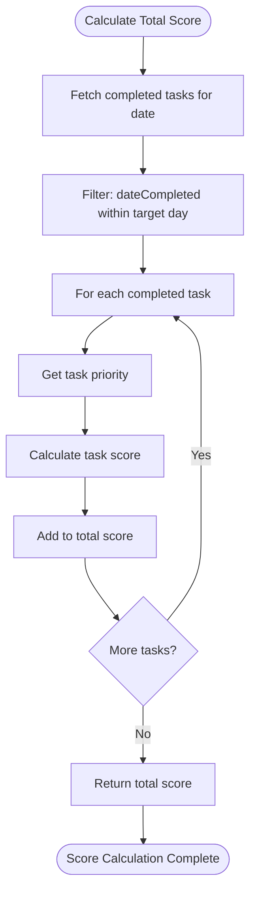
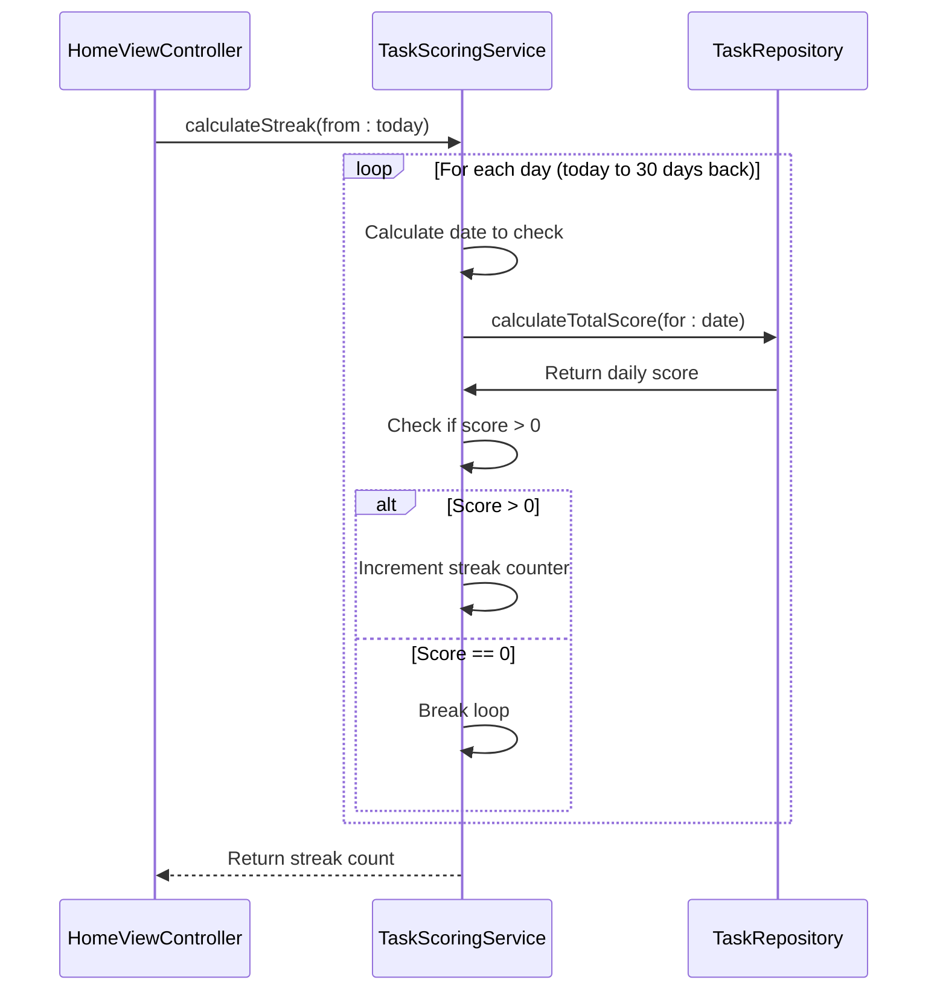
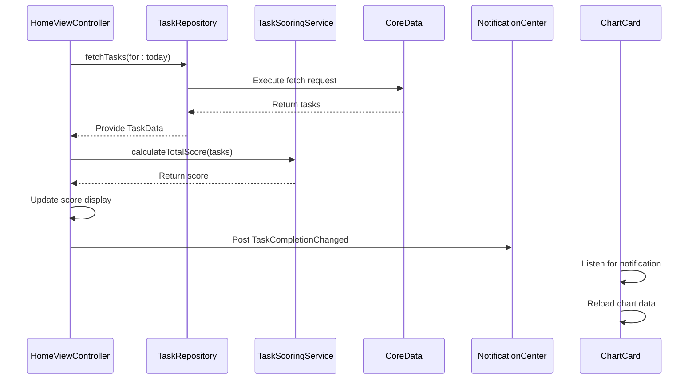

# Scoring System

<cite>
**Referenced Files in This Document**   
- [TaskScoringService.swift](file://To%20Do%20List/Services/TaskScoringService.swift)
- [TaskRepository.swift](file://To%20Do%20List/Repositories/TaskRepository.swift)
- [CoreDataTaskRepository.swift](file://To%20Do%20List/Repositories/CoreDataTaskRepository.swift)
- [TaskManager.swift](file://To%20Do%20List/ViewControllers/TaskManager.swift)
- [HomeViewController.swift](file://To%20Do%20List/ViewControllers/HomeViewController.swift)
- [ChartCard.swift](file://To%20Do%20List/Views/Cards/ChartCard.swift)
- [README.md](file://README.md)
</cite>

## Table of Contents
1. [Introduction](#introduction)
2. [Scoring Algorithm](#scoring-algorithm)
3. [Task Priority Levels](#task-priority-levels)
4. [Daily Score Calculation](#daily-score-calculation)
5. [Streak Calculation](#streak-calculation)
6. [Efficiency Score](#efficiency-score)
7. [Integration with Task Completion Events](#integration-with-task-completion-events)
8. [Score Aggregation and User Progression](#score-aggregation-and-user-progression)
9. [Common Issues and Debugging](#common-issues-and-debugging)
10. [Extensibility and Custom Scoring Rules](#extensibility-and-custom-scoring-rules)
11. [Performance Considerations](#performance-considerations)

## Introduction
The Tasker application implements a gamified scoring system to encourage consistent task completion and productivity tracking. The core of this system is the `TaskScoringService` class, which calculates points based on task priority, completion status, and timing. This document provides a comprehensive analysis of the scoring system's implementation, business logic, and integration points within the application architecture.

**Section sources**
- [TaskScoringService.swift](file://To%20Do%20List/Services/TaskScoringService.swift#L1-L153)
- [README.md](file://README.md#L650-L690)

## Scoring Algorithm
The scoring algorithm is implemented in the `TaskScoringService` class and follows a priority-based point system. Each task is assigned a point value based on its priority level, with higher priority tasks yielding more points upon completion.

The primary scoring method `calculateScore(for:)` takes a `TaskPriority` enum value and returns an integer score:

```swift
func calculateScore(for taskPriority: TaskPriority) -> Int {
    switch taskPriority {
    case .high:   return 7  // Highest priority
    case .medium: return 4  // Medium priority
    case .low:    return 2
    case .veryLow: return 1  // Low priority
    @unknown default:
        return 1  // Fallback
    }
}
```

This algorithm assigns the highest point value (7) to high-priority tasks, creating a strong incentive for users to complete their most important tasks. The point values decrease for lower priority levels, with very low priority tasks earning only 1 point.

**Section sources**
- [TaskScoringService.swift](file://To%20Do%20List/Services/TaskScoringService.swift#L15-L30)

## Task Priority Levels
The scoring system uses four distinct priority levels, defined in the `TaskPriority` enum. These levels map to a P0-P3 classification system where P0 represents the highest priority:

```swift
enum TaskPriority: Int32, CaseIterable {
    case low = 1          // P0 – Highest priority
    case medium = 2       // P1
    case high = 3         // P2
    case veryLow = 4      // P3 – Lowest priority
}
```

Despite the enum case names suggesting otherwise, the raw values indicate that `.low` (rawValue: 1) represents the highest priority (P0), while `.veryLow` (rawValue: 4) represents the lowest priority (P3). This inverted naming convention is important to understand when analyzing the scoring logic.

The scoring service maps these priority levels to point values as follows:
- P0 (low): 7 points
- P1 (medium): 4 points  
- P2 (high): 2 points
- P3 (veryLow): 1 point

This creates a significant point differential between the highest and lowest priority tasks, reinforcing the gamification aspect of completing critical tasks.

**Section sources**
- [TaskManager.swift](file://To%20Do%20List/ViewControllers/TaskManager.swift#L31-L44)
- [TaskScoringService.swift](file://To%20Do%20List/Services/TaskScoringService.swift#L15-L30)

## Daily Score Calculation
The daily score is calculated by aggregating points from all tasks completed on a specific date. The `calculateTotalScore(for:using:completion:)` method handles this calculation:



**Diagram sources**
- [TaskScoringService.swift](file://To%20Do%20List/Services/TaskScoringService.swift#L50-L80)

The method works as follows:
1. Creates a date range for the target day (start of day to end of day)
2. Constructs an NSPredicate to find tasks completed within that date range
3. Uses the TaskRepository to fetch matching tasks
4. Iterates through each completed task, calculating its individual score
5. Sums all individual scores to produce the daily total

The calculation is performed asynchronously using a completion handler to avoid blocking the main thread during Core Data operations.

**Section sources**
- [TaskScoringService.swift](file://To%20Do%20List/Services/TaskScoringService.swift#L50-L80)
- [TaskRepository.swift](file://To%20Do%20List/Repositories/TaskRepository.swift#L10-L20)

## Streak Calculation
The streak calculation determines the number of consecutive days with at least one completed task. This feature encourages daily engagement with the application.



**Diagram sources**
- [TaskScoringService.swift](file://To%20Do%20List/Services/TaskScoringService.swift#L82-L115)

The algorithm checks days in reverse chronological order (from today backward) and stops when it encounters a day with no completed tasks. It uses a DispatchGroup to ensure synchronous execution of the asynchronous score calculations, limiting the check to a maximum of 30 days for performance reasons.

**Section sources**
- [TaskScoringService.swift](file://To%20Do%20List/Services/TaskScoringService.swift#L82-L115)

## Efficiency Score
The efficiency score measures the percentage of planned tasks that were completed on a given day. This metric provides insight into daily productivity beyond just point accumulation.

```swift
func calculateEfficiency(
    for date: Date,
    using repository: TaskRepository,
    completion: @escaping (Double) -> Void
) {
    repository.getTasksForInbox(date: date) { tasks in
        let totalTasks = tasks.count
        let completedTasks = tasks.filter { $0.isComplete }.count
        
        guard totalTasks > 0 else {
            completion(0.0)
            return
        }
        
        let efficiency = Double(completedTasks) / Double(totalTasks) * 100.0
        completion(efficiency)
    }
}
```

The efficiency calculation:
1. Retrieves all tasks for the inbox on the target date
2. Counts total tasks and completed tasks
3. Calculates the percentage of completed tasks
4. Returns a value between 0.0 and 100.0

This score helps users understand not just how many points they earned, but what proportion of their planned work they actually completed.

**Section sources**
- [TaskScoringService.swift](file://To%20Do%20List/Services/TaskScoringService.swift#L117-L140)

## Integration with Task Completion Events
The scoring system integrates with task completion events through several mechanisms. When a task's completion status changes, the system updates relevant scores and visualizations.



**Diagram sources**
- [HomeViewController.swift](file://To%20Do%20List/ViewControllers/HomeViewController.swift#L975-L1020)
- [ChartCard.swift](file://To%20Do%20List/Views/Cards/ChartCard.swift#L70-L80)

The `HomeViewController` calls `updateDailyScore()` to refresh the displayed score, which in turn uses `TaskScoringService.shared.calculateTotalScore()`. Additionally, the `TaskCompletionChanged` notification triggers updates to the SwiftUI `TaskProgressCard`, ensuring all score visualizations remain synchronized.

**Section sources**
- [HomeViewController.swift](file://To%20Do%20List/ViewControllers/HomeViewController.swift#L975-L1020)
- [ChartCard.swift](file://To%20Do%20List/Views/Cards/ChartCard.swift#L70-L80)

## Score Aggregation and User Progression
Scores are aggregated daily and contribute to user progression through multiple visualizations and metrics. The primary display locations include:

1. **Navigation Bar Title**: Shows the daily score alongside the current date
2. **Pie Charts**: Visualizes task completion by priority level
3. **SwiftUI Chart Card**: Displays weekly progress with daily scores

The `updateDailyScore()` method in `HomeViewController` coordinates these updates:

```swift
func updateDailyScore(for date: Date? = nil) {
    let targetDate = date ?? dateForTheView
    if let repository = taskRepository {
        TaskScoringService.shared.calculateTotalScore(for: targetDate, using: repository) { [weak self] total in
            DispatchQueue.main.async {
                self?.scoreCounter.text = "\(total)"
                self?.updateNavigationBarTitle(date: targetDate, score: total)
                // Update chart center text
                if let chartView = self?.tinyPieChartView {
                    chartView.centerAttributedText = self?.setTinyPieChartScoreText(pieChartView: chartView, scoreOverride: total)
                }
            }
        }
    }
}
```

This method ensures that all score displays are updated simultaneously when the daily score changes, providing a consistent user experience.

**Section sources**
- [HomeViewController.swift](file://To%20Do%20List/ViewControllers/HomeViewController.swift#L975-L1020)

## Common Issues and Debugging
Several potential issues can arise with the scoring system, along with corresponding debugging strategies:

### Score Discrepancies
When scores don't match expectations, check:
1. **Task Completion Dates**: Ensure `dateCompleted` is properly set when tasks are marked complete
2. **Priority Mapping**: Verify the correct mapping between `TaskPriority` enum cases and point values
3. **Date Range Boundaries**: Confirm the start and end of day calculations are correct

### Debugging Tools
The codebase includes several debugging aids:
- **Console Logging**: The `CoreDataTaskRepository` logs task completion events
- **Notification Monitoring**: The `TaskCompletionChanged` notification can be monitored to verify event propagation
- **Fallback Logic**: The `updateDailyScore()` method includes a fallback calculation using `TaskManager` if the repository is not available

### Common Fixes
```swift
// Ensure dateCompleted is set when marking tasks complete
task.dateCompleted = task.isComplete ? Date() as NSDate : nil

// Verify priority conversion from Core Data raw values
let priority = TaskPriority(rawValue: task.taskPriority) ?? .low
```

**Section sources**
- [CoreDataTaskRepository.swift](file://To%20Do%20List/Repositories/CoreDataTaskRepository.swift#L120-L140)
- [HomeViewController.swift](file://To%20Do%20List/ViewControllers/HomeViewController.swift#L975-L1020)

## Extensibility and Custom Scoring Rules
The scoring system is designed with extensibility in mind, allowing for custom scoring rules through several mechanisms:

### Dependency Injection
The `TaskRepository` protocol enables dependency injection, allowing different repository implementations to be used for testing or extended functionality:

```swift
protocol TaskRepository {
    func fetchTasks(predicate: NSPredicate?, 
                   sortDescriptors: [NSSortDescriptor]?, 
                   completion: @escaping ([TaskData]) -> Void)
    // Additional methods...
}
```

### Singleton with Override Potential
While `TaskScoringService` uses a singleton pattern (`static let shared`), this can be extended to support dependency injection in future versions:

```swift
final class TaskScoringService {
    static let shared = TaskScoringService()
    // Additional instance methods can be added
}
```

### Potential Extension Points
1. **Time-Based Bonuses**: Add multipliers for completing high-priority tasks early
2. **Streak Bonuses**: Award bonus points for maintaining long completion streaks
3. **Project-Based Scoring**: Implement different scoring rules for specific projects
4. **Dynamic Difficulty**: Adjust point values based on historical completion patterns

These extension points could be implemented by adding new methods to `TaskScoringService` or creating specialized scoring service subclasses.

**Section sources**
- [TaskRepository.swift](file://To%20Do%20List/Repositories/TaskRepository.swift#L10-L117)
- [TaskScoringService.swift](file://To%20Do%20List/Services/TaskScoringService.swift#L1-L153)

## Performance Considerations
The scoring system incorporates several performance optimizations to ensure responsive user experience:

### Asynchronous Operations
All score calculations are performed asynchronously to prevent UI blocking:

```swift
func calculateTotalScore(
    for date: Date,
    using repository: TaskRepository,
    completion: @escaping (Int) -> Void
) {
    // Core Data fetch performed on background queue
    repository.fetchTasks(predicate: completedOnDatePredicate) { tasks in
        // Score calculation on background
        var totalScore = 0
        for task in tasks {
            totalScore += self.calculateScore(for: task.priority)
        }
        // Result returned on main queue
        completion(totalScore)
    }
}
```

### Synchronous Streak Calculation
The streak calculation uses a synchronous approach with `DispatchGroup` to ensure predictable behavior:

```swift
group.wait() // Synchronous wait for each day's score calculation
```

While this blocks the current thread, it limits the operation to a maximum of 30 days and is typically called infrequently.

### Caching Opportunities
Potential performance improvements include:
1. **Daily Score Caching**: Cache daily scores to avoid recalculation
2. **Streak Caching**: Store the current streak value and update only when tasks are completed
3. **Batch Updates**: Process multiple task completions in a single scoring update

The current implementation prioritizes accuracy over performance, recalculating scores whenever needed rather than maintaining cached values that could become stale.

**Section sources**
- [TaskScoringService.swift](file://To%20Do%20List/Services/TaskScoringService.swift#L50-L115)
- [CoreDataTaskRepository.swift](file://To%20Do%20List/Repositories/CoreDataTaskRepository.swift#L40-L60)