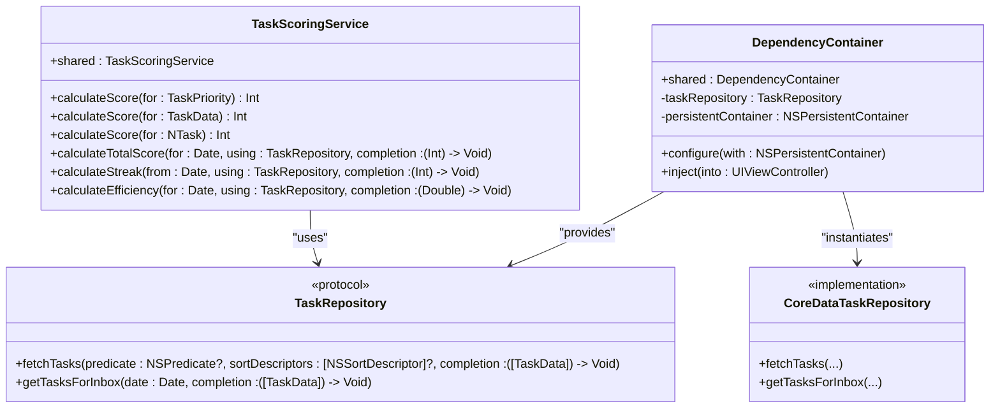
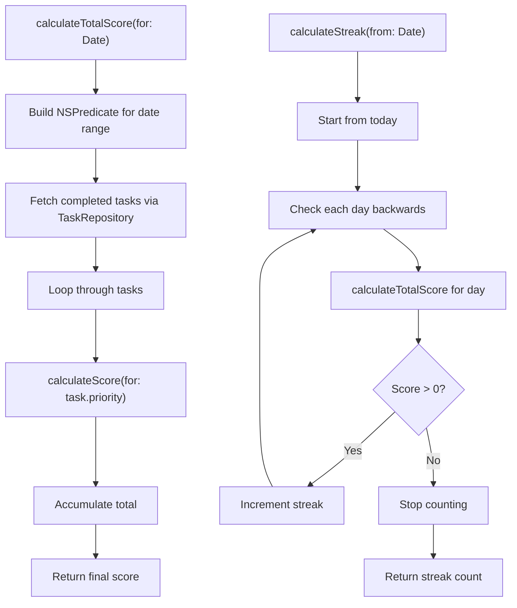
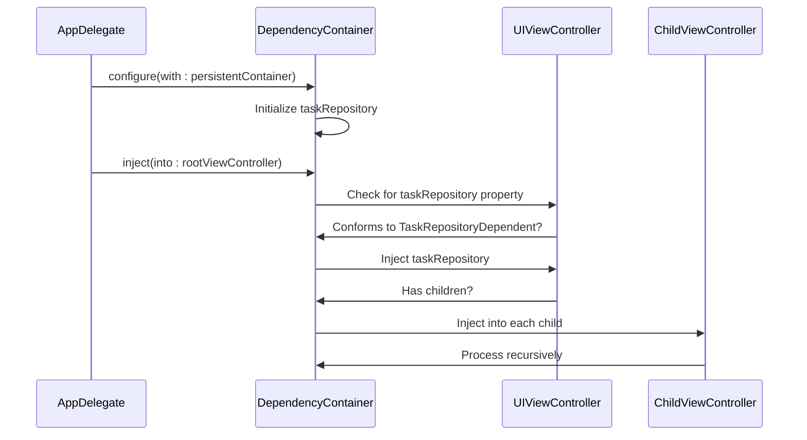
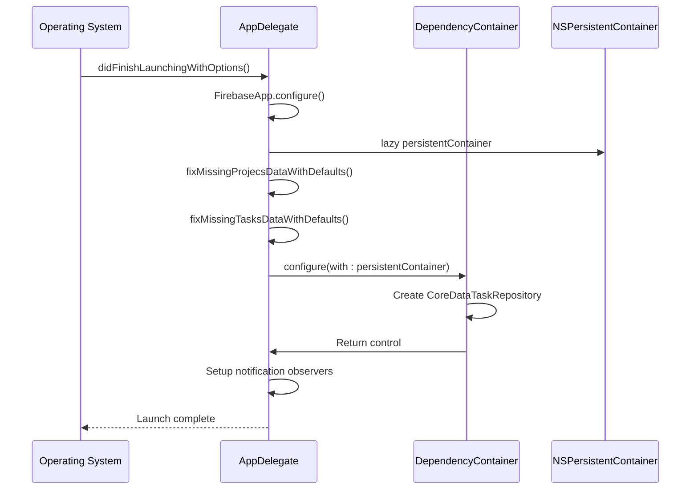
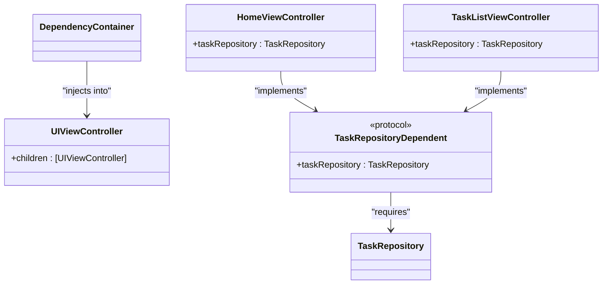
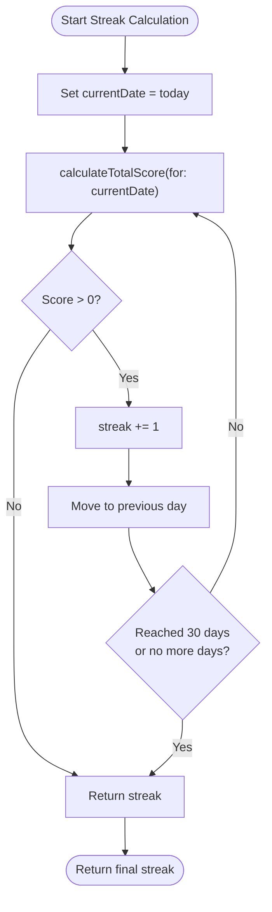

# Business Logic Layer

<cite>
**Referenced Files in This Document**   
- [TaskScoringService.swift](file://To%20Do%20List/Services/TaskScoringService.swift)
- [DependencyContainer.swift](file://To%20Do%20List/Managers/DependencyContainer.swift)
- [AppDelegate.swift](file://To%20Do%20List/AppDelegate.swift)
- [CoreDataTaskRepository.swift](file://To%20Do%20List/Repositories/CoreDataTaskRepository.swift)
- [TaskRepository.swift](file://To%20Do%20List/Repositories/TaskRepository.swift)
- [TaskData.swift](file://To%20Do%20List/Models/TaskData.swift)
- [TaskManager.swift](file://To%20Do%20List/ViewControllers/TaskManager.swift)
</cite>

## Table of Contents
1. [Introduction](#introduction)
2. [Core Components Overview](#core-components-overview)
3. [TaskScoringService: Gamification and Scoring Logic](#taskscoringservice-gamification-and-scoring-logic)
4. [DependencyContainer: Dependency Injection and Lifecycle Management](#dependencycontainer-dependency-injection-and-lifecycle-management)
5. [Architecture and Initialization Sequence](#architecture-and-initialization-sequence)
6. [Dependency Injection Flow and Service Resolution](#dependency-injection-flow-and-service-resolution)
7. [Scoring Algorithm Details](#scoring-algorithm-details)
8. [Streak Tracking and Analytics](#streak-tracking-and-analytics)
9. [Best Practices and Common Pitfalls](#best-practices-and-common-pitfalls)
10. [Conclusion](#conclusion)

## Introduction

The Business Logic Layer of the Tasker application is responsible for implementing core functionality related to task scoring, gamification, and dependency management. This document provides a comprehensive analysis of two key components: **TaskScoringService**, which calculates user scores based on task completion, priority, and timeliness; and **DependencyContainer**, which manages object lifecycles and enables dependency injection across view controllers and services.

These components work together to support a modular, testable architecture that promotes loose coupling and separation of concerns. The scoring system contributes to user engagement through gamification, while the dependency container ensures clean initialization and service provisioning during app launch.

**Section sources**
- [TaskScoringService.swift](file://To%20Do%20List/Services/TaskScoringService.swift#L1-L154)
- [DependencyContainer.swift](file://To%20Do%20List/Managers/DependencyContainer.swift#L1-L81)

## Core Components Overview

The business logic layer consists of two primary components:

- **TaskScoringService**: Calculates scores for completed tasks based on priority levels, computes daily totals, tracks user streaks, and measures efficiency.
- **DependencyContainer**: Centralizes service instantiation and dependency injection, ensuring consistent access to shared resources like the task repository and Core Data stack.

These components interact with the data layer via protocols such as `TaskRepository` and leverage Core Data for persistence. They are initialized early in the app lifecycle and provide services to view controllers and other business logic modules.



**Diagram sources**
- [TaskScoringService.swift](file://To%20Do%20List/Services/TaskScoringService.swift#L1-L154)
- [DependencyContainer.swift](file://To%20Do%20List/Managers/DependencyContainer.swift#L1-L81)
- [TaskRepository.swift](file://To%20Do%20List/Repositories/TaskRepository.swift#L1-L118)
- [CoreDataTaskRepository.swift](file://To%20Do%20List/Repositories/CoreDataTaskRepository.swift#L1-L455)

**Section sources**
- [TaskScoringService.swift](file://To%20Do%20List/Services/TaskScoringService.swift#L1-L154)
- [DependencyContainer.swift](file://To%20Do%20List/Managers/DependencyContainer.swift#L1-L81)

## TaskScoringService: Gamification and Scoring Logic

The `TaskScoringService` class is responsible for implementing gamification features by calculating user scores based on task completion behavior. It supports multiple scoring methods and analytics functions that contribute to user engagement.

### Scoring Methods

The service provides several overloaded `calculateScore` methods to handle different input types:
- `calculateScore(for: TaskPriority)` – Returns a fixed point value based on priority level
- `calculateScore(for: TaskData)` – Delegates to priority-based scoring
- `calculateScore(for: NTask)` – Extracts priority from managed object and delegates

### Analytics Functions

In addition to individual task scoring, the service offers higher-level analytics:
- **Total Score Calculation**: Sums scores for all tasks completed on a given date
- **Streak Tracking**: Counts consecutive days with at least one completed task
- **Efficiency Measurement**: Calculates percentage of planned tasks completed



**Diagram sources**
- [TaskScoringService.swift](file://To%20Do%20List/Services/TaskScoringService.swift#L1-L154)

**Section sources**
- [TaskScoringService.swift](file://To%20Do%20List/Services/TaskScoringService.swift#L1-L154)

## DependencyContainer: Dependency Injection and Lifecycle Management

The `DependencyContainer` class serves as the central hub for managing application dependencies and enabling dependency injection throughout the view controller hierarchy.

### Key Responsibilities

- **Singleton Management**: Provides a shared instance accessible globally
- **Service Instantiation**: Initializes core services like `TaskRepository`
- **Dependency Injection**: Injects services into view controllers dynamically
- **Lifecycle Coordination**: Ensures dependencies are ready before use

### Supported Dependencies

:taskRepository: – Instance of `CoreDataTaskRepository` used for all task data operations  
:persistentContainer: – Core Data stack managed by `NSPersistentCloudKitContainer`

### Injection Mechanism

The container uses runtime reflection to detect properties conforming to dependency protocols and injects appropriate instances. It also recursively processes child view controllers to ensure full hierarchy injection.



**Diagram sources**
- [DependencyContainer.swift](file://To%20Do%20List/Managers/DependencyContainer.swift#L1-L81)
- [AppDelegate.swift](file://To%20Do%20List/AppDelegate.swift#L1-L193)

**Section sources**
- [DependencyContainer.swift](file://To%20Do%20List/Managers/DependencyContainer.swift#L1-L81)

## Architecture and Initialization Sequence

The application follows a structured initialization sequence during launch to ensure all dependencies are properly configured before UI presentation.

### App Launch Flow

1. **Firebase Configuration**: Initialize Firebase services
2. **Core Data Setup**: Load `NSPersistentCloudKitContainer`
3. **Data Consolidation**: Fix missing project/task defaults
4. **Dependency Configuration**: Configure `DependencyContainer` with persistent container
5. **Notification Setup**: Register for CloudKit and remote change notifications



**Diagram sources**
- [AppDelegate.swift](file://To%20Do%20List/AppDelegate.swift#L1-L193)
- [DependencyContainer.swift](file://To%20Do%20List/Managers/DependencyContainer.swift#L1-L81)

**Section sources**
- [AppDelegate.swift](file://To%20Do%20List/AppDelegate.swift#L1-L193)

## Dependency Injection Flow and Service Resolution

The dependency injection system enables loose coupling between view controllers and data services through protocol-based design and runtime property injection.

### Protocol Definition

```swift
protocol TaskRepositoryDependent: AnyObject {
    var taskRepository: TaskRepository! { get set }
}
```

Any view controller adopting this protocol will automatically receive a `taskRepository` instance during injection.

### Injection Process

1. Call `DependencyContainer.shared.inject(into: viewController)`
2. Container checks for `taskRepository` property using `class_getProperty`
3. If found and conforms to `TaskRepositoryDependent`, assign instance
4. Recursively inject into all child view controllers

### Benefits

- **Testability**: Services can be mocked in tests
- **Modularity**: View controllers don't need to know about service creation
- **Consistency**: All components use the same shared instances
- **Flexibility**: Easy to swap implementations (e.g., mock repositories)



**Diagram sources**
- [DependencyContainer.swift](file://To%20Do%20List/Managers/DependencyContainer.swift#L1-L81)
- [TaskRepository.swift](file://To%20Do%20List/Repositories/TaskRepository.swift#L1-L118)

**Section sources**
- [DependencyContainer.swift](file://To%20Do%20List/Managers/DependencyContainer.swift#L1-L81)

## Scoring Algorithm Details

The scoring algorithm assigns point values based on task priority, with higher-priority tasks yielding more points.

### Priority-to-Score Mapping

| TaskPriority | Score Value |
|------------|-------------|
| high       | 7           |
| medium     | 4           |
| low        | 2           |
| veryLow    | 1           |

This differs from the `scoreValue` property in `TaskPriority` enum (which returns 3, 2, 1, 0), indicating that `TaskScoringService` uses its own gamification-specific scoring scale.

### Total Score Calculation

The total score for a date is calculated as:
```
totalScore = Σ(calculateScore(for: task.priority)) for all completed tasks on date
```

Where:
- Predicate filters tasks completed within the target day
- Each task's priority is converted to points using the mapping above
- Points are summed across all qualifying tasks

### Efficiency Calculation

Efficiency is measured as:
```
efficiency = (completedTasks / totalTasks) × 100%
```

Using tasks from the inbox project for the specified date, regardless of completion status.

**Section sources**
- [TaskScoringService.swift](file://To%20Do%20List/Services/TaskScoringService.swift#L1-L154)
- [TaskManager.swift](file://To%20Do%20List/ViewControllers/TaskManager.swift#L30-L50)

## Streak Tracking and Analytics

The streak tracking system measures user consistency by counting consecutive days with completed tasks.

### Streak Calculation Logic

1. Start from the current day
2. Move backward one day at a time
3. For each day, calculate total score using `calculateTotalScore`
4. If score > 0, increment streak and continue
5. If score == 0, stop counting
6. Maximum lookback: 30 days

### Implementation Characteristics

- **Synchronous Processing**: Uses `DispatchGroup().wait()` to block until each day's score is calculated
- **Performance Consideration**: Potentially blocking operation; could be optimized with async/await
- **Business Rule**: A streak requires at least one scored task per day

### Use Cases

- **User Motivation**: Display current streak in UI to encourage daily usage
- **Gamification**: Award badges or rewards for milestone streaks
- **Analytics**: Track user engagement patterns over time



**Diagram sources**
- [TaskScoringService.swift](file://To%20Do%20List/Services/TaskScoringService.swift#L1-L154)

**Section sources**
- [TaskScoringService.swift](file://To%20Do%20List/Services/TaskScoringService.swift#L1-L154)

## Best Practices and Common Pitfalls

### Best Practices

1. **Use Dependency Injection Over Singletons**: Prefer injecting `TaskScoringService` rather than accessing `.shared`
2. **Adopt Protocol-Based Design**: View controllers should conform to `TaskRepositoryDependent` for clean injection
3. **Handle Nil Safely**: Always check for `weak self` in completion handlers
4. **Maintain Thread Safety**: Perform Core Data operations on correct queue

### Common Issues

- **Retain Cycles**: Avoid strong references in completion blocks; use `[weak self]`
- **Improper Initialization**: Ensure `DependencyContainer.configure()` is called before injection
- **Missing Protocol Conformance**: View controllers must adopt `TaskRepositoryDependent` to receive injection
- **Blocking Main Thread**: `calculateStreak` uses synchronous waits which could impact UI responsiveness

### Adding New Services

To add a new service:

1. Define a protocol for the service
2. Implement the concrete class
3. Add property to `DependencyContainer`
4. Initialize in `configure(with:)` method
5. Create injection logic (property check + assignment)
6. Update relevant view controllers to adopt dependency protocol

### Testing Considerations

- Mock `TaskRepository` to isolate `TaskScoringService` tests
- Use dependency injection to provide test doubles
- Verify streak logic with simulated task completion data
- Test edge cases like empty task lists or date boundary conditions

**Section sources**
- [DependencyContainer.swift](file://To%20Do%20List/Managers/DependencyContainer.swift#L1-L81)
- [TaskScoringService.swift](file://To%20Do%20List/Services/TaskScoringService.swift#L1-L154)

## Conclusion

The business logic layer of the Tasker application demonstrates a well-structured approach to gamification and dependency management. The `TaskScoringService` provides a flexible scoring system that incentivizes task completion through priority-based points, streak tracking, and efficiency metrics. Meanwhile, the `DependencyContainer` enables a clean, modular architecture by centralizing service instantiation and automating dependency injection.

Key strengths include protocol-oriented design, separation of concerns, and thoughtful initialization sequencing. Opportunities for improvement include modernizing the synchronous streak calculation and expanding the dependency injection system to support more service types. Overall, these components form a robust foundation for user engagement and maintainable code organization.