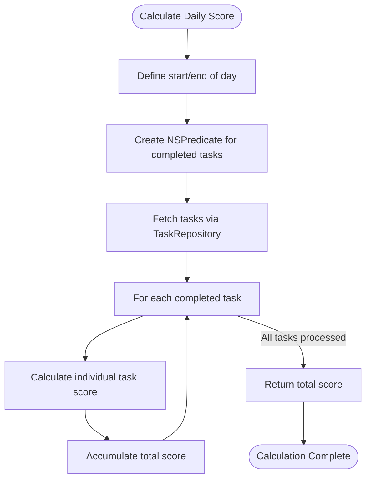
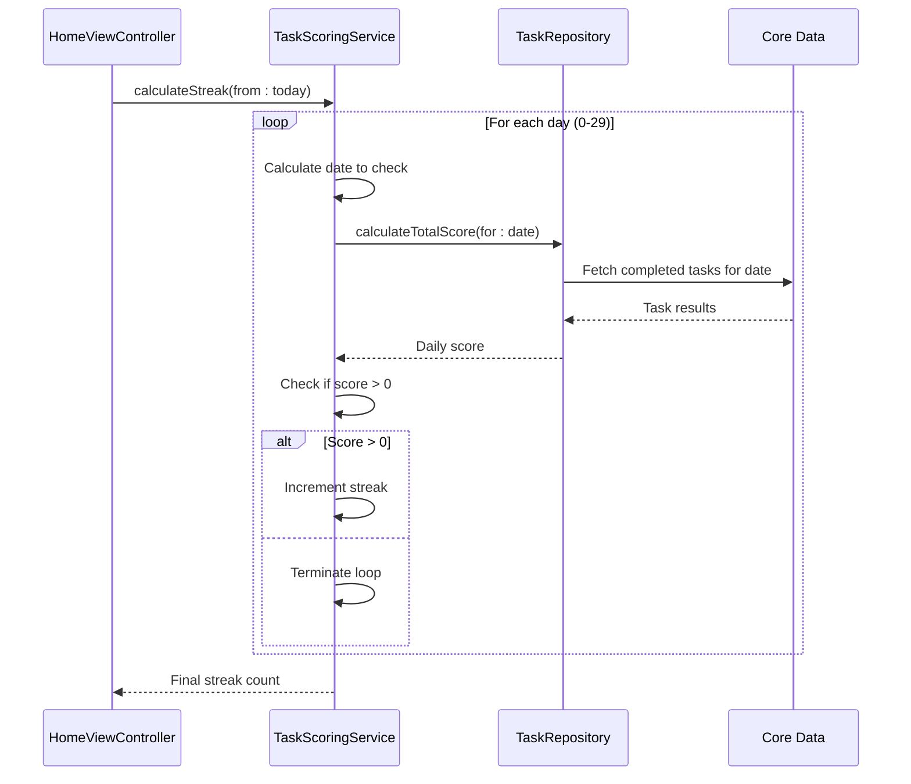

# Task Scoring Service

<cite>
**Referenced Files in This Document**   
- [TaskScoringService.swift](file://To%20Do%20List/Services/TaskScoringService.swift)
- [TaskData.swift](file://To%20Do%20List/Models/TaskData.swift)
- [TaskRepository.swift](file://To%20Do%20List/Repositories/TaskRepository.swift)
- [TaskManager.swift](file://To%20Do%20List/ViewControllers/TaskManager.swift)
- [README.md](file://README.md)
- [CoreDataTaskRepository.swift](file://To%20Do%20List/Repositories/CoreDataTaskRepository.swift)
</cite>

## Table of Contents
1. [Introduction](#introduction)
2. [Scoring System Overview](#scoring-system-overview)
3. [Priority-Based Scoring](#priority-based-scoring)
4. [Daily Score Calculation](#daily-score-calculation)
5. [Streak Tracking Mechanism](#streak-tracking-mechanism)
6. [Efficiency Score Calculation](#efficiency-score-calculation)
7. [Integration with Analytics and UI](#integration-with-analytics-and-ui)
8. [Edge Case Handling](#edge-case-handling)
9. [Best Practices for Scoring Consistency](#best-practices-for-scoring-consistency)

## Introduction
The Task Scoring Service is a dedicated component within the Tasker application responsible for implementing gamification logic through a comprehensive scoring system. This service calculates scores based on task completion, priority levels, and due date adherence, providing users with a motivational framework for productivity. The scoring system rewards timely completion of high-priority tasks while penalizing overdue items through a streak-based mechanism. This document provides a detailed analysis of the scoring logic, implementation patterns, and integration points within the application architecture.

## Scoring System Overview
The Task Scoring Service implements a gamification framework that transforms task completion into a rewarding experience through point accumulation and streak tracking. The system is designed to incentivize users to complete high-priority tasks promptly while maintaining consistent daily productivity. The scoring mechanism is implemented as a singleton class with multiple calculation methods that can be accessed throughout the application.

The service operates on three primary metrics:
- **Individual task scoring**: Points awarded based on task priority
- **Daily score accumulation**: Total points earned on a specific date
- **Streak tracking**: Consecutive days with completed tasks

The scoring system is tightly integrated with the task management workflow, calculating scores whenever tasks are completed or modified. This real-time feedback loop provides immediate reinforcement for productive behavior.

**Section sources**
- [TaskScoringService.swift](file://To%20Do%20List/Services/TaskScoringService.swift#L1-L20)

## Priority-Based Scoring
The scoring system assigns point values to tasks based on their priority level, with higher priority tasks yielding greater rewards. The priority system follows a four-tier hierarchy (P0-P3) with corresponding point values that reflect the importance and urgency of each task.

### Priority Level Configuration
The TaskPriority enum defines four priority levels with corresponding raw values and point allocations:

```swift
enum TaskPriority: Int32, CaseIterable {
    case low = 1          // P0 – Highest priority
    case medium = 2       // P1
    case high = 3         // P2
    case veryLow = 4      // P3 – Lowest priority
}
```

### Scoring Formula
The scoring formula maps each priority level to a specific point value:

```swift
func calculateScore(for taskPriority: TaskPriority) -> Int {
    switch taskPriority {
    case .high:   return 7  // Highest priority
    case .medium: return 4  // Medium priority
    case .low:    return 2
    case .veryLow: return 1  // Low priority
    @unknown default:
        return 1  // Fallback
    }
}
```

This scoring structure creates a non-linear reward system where high-priority tasks (P0) are worth 7 points, medium-priority tasks (P1) are worth 4 points, low-priority tasks (P2) are worth 2 points, and very low-priority tasks (P3) are worth 1 point. This incentivizes users to focus on completing the most critical tasks first.

The service provides multiple overloads of the calculateScore method to accommodate different input types, including TaskPriority enum values, TaskData objects, and NTask managed objects, ensuring flexibility in integration with various components of the application.

**Section sources**
- [TaskScoringService.swift](file://To%20Do%20List/Services/TaskScoringService.swift#L25-L50)
- [TaskManager.swift](file://To%20Do%20List/ViewControllers/TaskManager.swift#L31-L45)

## Daily Score Calculation
The daily score calculation aggregates points from all completed tasks on a specific date, providing users with a comprehensive measure of their productivity for that day. This calculation is performed asynchronously using a repository pattern to fetch relevant task data.

### Calculation Process
The calculateTotalScore method follows these steps:
1. Determine the start and end of the target day
2. Create a predicate to filter completed tasks within that date range
3. Fetch tasks using the TaskRepository
4. Sum the individual scores of all completed tasks
5. Return the total score via completion handler



**Diagram sources**
- [TaskScoringService.swift](file://To%20Do%20List/Services/TaskScoringService.swift#L52-L85)

**Section sources**
- [TaskScoringService.swift](file://To%20Do%20List/Services/TaskScoringService.swift#L52-L85)
- [TaskRepository.swift](file://To%20Do%20List/Repositories/TaskRepository.swift#L10-L20)

## Streak Tracking Mechanism
The streak tracking system monitors consecutive days with completed tasks, providing users with a motivational metric for maintaining consistent productivity. The system implements a 30-day maximum history to balance motivation with achievable goals.

### Streak Calculation Algorithm
The calculateStreak method follows this algorithm:
1. Start from the current day and work backwards
2. For each day, calculate the total score of completed tasks
3. If the daily score is greater than zero, increment the streak
4. If the daily score is zero, terminate the streak calculation
5. Continue until a day with no completed tasks is found or 30 days are checked

The implementation uses a synchronous dispatch group to ensure all daily score calculations complete before returning the final streak count. This approach guarantees accurate results but may impact performance with large task histories.



**Diagram sources**
- [TaskScoringService.swift](file://To%20Do%20List/Services/TaskScoringService.swift#L87-L120)

**Section sources**
- [TaskScoringService.swift](file://To%20Do%20List/Services/TaskScoringService.swift#L87-L120)
- [README.md](file://README.md#L853-L868)

## Efficiency Score Calculation
The efficiency score measures the percentage of planned tasks that were completed on a specific date, providing insight into task management effectiveness. This metric complements the point-based scoring system by focusing on completion rates rather than point accumulation.

### Efficiency Formula
The calculateEfficiency method uses the following formula:
```
Efficiency = (Completed Tasks / Total Tasks) × 100
```

The implementation:
1. Fetches all tasks for the inbox project on the target date
2. Counts the total number of tasks
3. Filters for completed tasks
4. Calculates the percentage completion
5. Returns 0.0 if no tasks exist for the date

This efficiency metric helps users understand their productivity beyond just point accumulation, highlighting whether they are successfully completing their planned work rather than just focusing on high-point tasks.

**Section sources**
- [TaskScoringService.swift](file://To%20Do%20List/Services/TaskScoringService.swift#L122-L153)
- [TaskRepository.swift](file://To%20Do%20List/Repositories/TaskRepository.swift#L100-L110)

## Integration with Analytics and UI
The scoring system is integrated with analytics and UI components to provide real-time feedback and historical tracking of productivity metrics. The integration follows a clean architecture pattern with clear separation between data processing and presentation layers.

### Data Flow Architecture
```mermaid
graph TB
subgraph "Data Layer"
CD[(Core Data)]
Repo[TaskRepository]
end
subgraph "Service Layer"
Score[TaskScoringService]
end
subgraph "Presentation Layer"
UI[HomeViewController]
Charts[DGCharts Framework]
end
UI --> Repo: fetchTasks(for: today)
Repo --> CD: Execute NSFetchRequest
CD --> Repo: Return TaskData
Repo --> UI: Provide task list
UI --> Score: calculateDailyScore(tasks)
Score --> UI: Return score value
UI --> Charts: update charts/labels
Charts --> UI: Render visualizations
```

**Diagram sources**
- [README.md](file://README.md#L925-L976)
- [TaskScoringService.swift](file://To%20Do%20List/Services/TaskScoringService.swift)

The integration follows this sequence:
1. HomeViewController requests tasks for the current day from TaskRepository
2. TaskRepository fetches NTask entities from Core Data and converts them to TaskData objects
3. HomeViewController passes the task list to TaskScoringService for score calculation
4. TaskScoringService returns the daily score to HomeViewController
5. HomeViewController updates UI elements and charts with the score data

The DGCharts framework is used to visualize historical productivity trends, with the scoring service providing the underlying data for line charts and pie charts that display daily scores and completion ratios.

**Section sources**
- [README.md](file://README.md#L925-L976)
- [TaskScoringService.swift](file://To%20Do%20List/Services/TaskScoringService.swift)
- [TaskRepository.swift](file://To%20Do%20List/Repositories/TaskRepository.swift)

## Edge Case Handling
The scoring system addresses several edge cases to ensure robust and consistent behavior across various scenarios.

### Task Rescheduling
When tasks are rescheduled to future dates, they do not contribute to the daily score until completed on their new due date. The rescheduling functionality is implemented in the TaskRepository protocol:

```swift
func reschedule(taskID: NSManagedObjectID, to newDate: Date, completion: ((Result<Void, Error>) -> Void)?)
```

This ensures that rescheduled tasks are properly accounted for in the scoring system only when completed on their intended date, preventing manipulation of daily scores through strategic rescheduling.

**Section sources**
- [TaskRepository.swift](file://To%20Do%20List/Repositories/TaskRepository.swift#L42-L45)
- [CoreDataTaskRepository.swift](file://To%20Do%20List/Repositories/CoreDataTaskRepository.swift#L138-L150)

### Recurring Tasks
The current implementation does not explicitly handle recurring tasks, treating each task instance as a separate entity. When a recurring task is completed, it contributes to the daily score based on its priority level. The system does not differentiate between one-time and recurring tasks in the scoring calculation, ensuring consistent treatment of all completed tasks.

### Manual Score Adjustments
The scoring system does not provide direct methods for manual score adjustments, maintaining data integrity by deriving all scores from actual task completion events. This prevents manipulation of the scoring system while ensuring that scores accurately reflect user productivity.

## Best Practices for Scoring Consistency
To maintain scoring consistency and prevent manipulation, the following best practices should be observed:

### Data Integrity
- Ensure all task completions are properly recorded with accurate timestamps
- Validate task priority levels against the defined enum values
- Maintain consistent date formatting across all components
- Synchronize score calculations with Core Data persistence

### Performance Optimization
- Cache frequently accessed score calculations when appropriate
- Use background queues for streak calculations to prevent UI blocking
- Implement efficient predicates for task filtering
- Consider pagination for historical data queries

### User Experience
- Provide immediate visual feedback when scores are updated
- Display streak information prominently in the UI
- Offer historical comparisons to motivate improvement
- Ensure scoring rules are transparent and easily accessible

### Testing and Validation
- Implement unit tests for all scoring calculations
- Verify edge cases such as midnight transitions and timezone changes
- Test streak calculations with various completion patterns
- Validate score consistency across device synchronization

These best practices ensure that the scoring system remains reliable, performant, and motivating for users while maintaining data integrity across the application ecosystem.

**Section sources**
- [TaskScoringService.swift](file://To%20Do%20List/Services/TaskScoringService.swift)
- [README.md](file://README.md)
- [TaskRepository.swift](file://To%20Do%20List/Repositories/TaskRepository.swift)