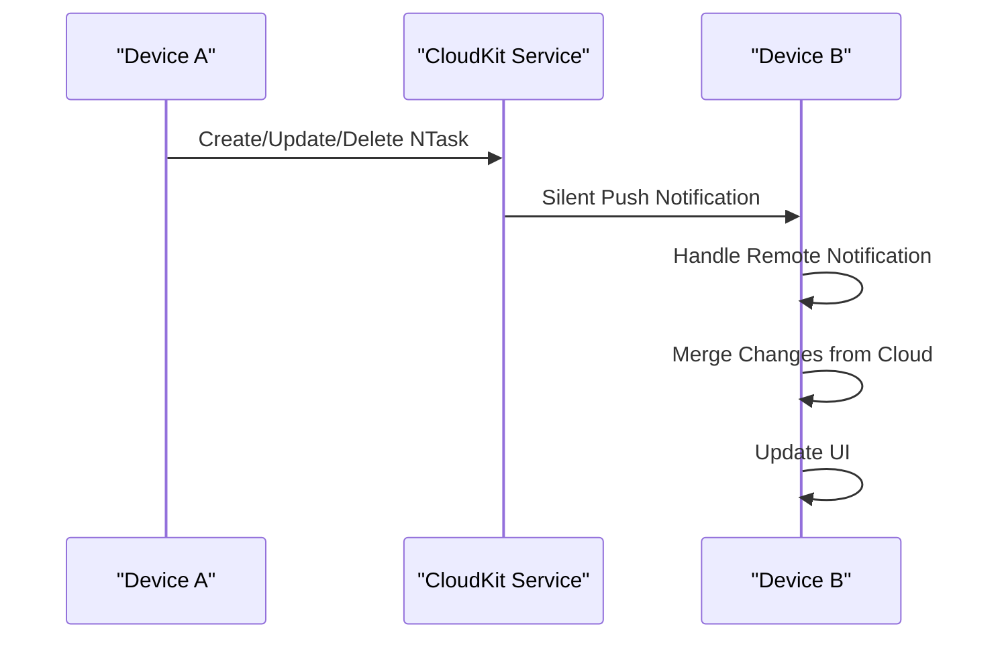
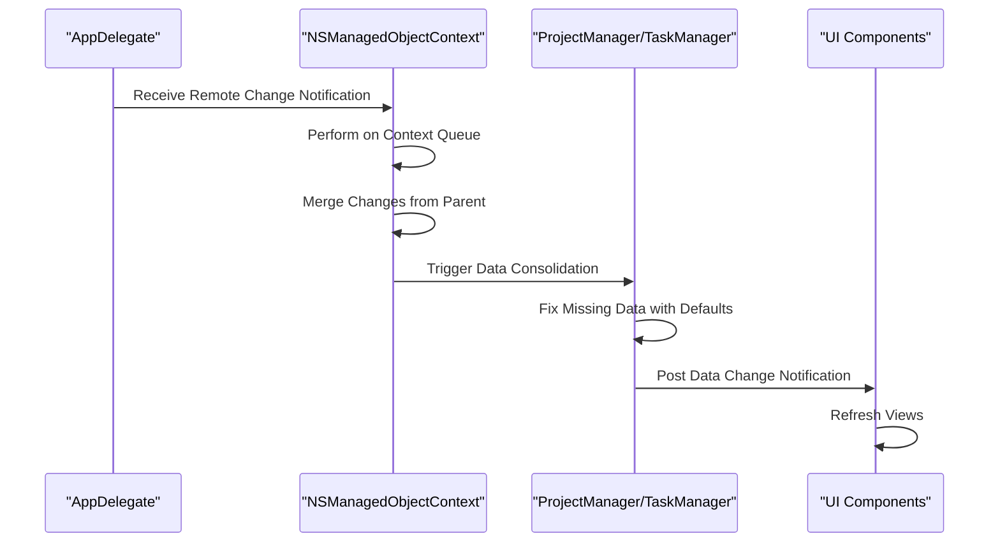

# Background Sync and Subscriptions

<cite>
**Referenced Files in This Document**   
- [AppDelegate.swift](file://To%20Do%20List/AppDelegate.swift)
- [README.md](file://README.md)
</cite>

## Table of Contents
1. [Introduction](#introduction)
2. [CloudKit Subscription Mechanism](#cloudkit-subscription-mechanism)
3. [Subscription Registration and Configuration](#subscription-registration-and-configuration)
4. [Push Notification Handling](#push-notification-handling)
5. [Background Context Refresh and UI Updates](#background-context-refresh-and-ui-updates)
6. [Background Fetch and Eventual Consistency](#background-fetch-and-eventual-consistency)
7. [Subscription Types and Payload Configuration](#subscription-types-and-payload-configuration)
8. [Battery-Efficient Sync Strategies](#battery-efficient-sync-strategies)
9. [Common Issues and Error Handling](#common-issues-and-error-handling)
10. [Subscription Cleanup and User Logout](#subscription-cleanup-and-user-logout)

## Introduction
Tasker implements a robust background synchronization system using CloudKit subscriptions to ensure seamless data consistency across devices. This document details how the application leverages Apple's CloudKit framework to receive push notifications when remote changes occur, enabling real-time updates even when the app is running in the background. The synchronization architecture combines silent push notifications with background fetch mechanisms to provide a reliable, battery-efficient solution for maintaining data consistency across the user's device ecosystem.

**Section sources**
- [README.md](file://README.md#L1321-L1354)

## CloudKit Subscription Mechanism
Tasker utilizes NSPersistentCloudKitContainer to automatically manage CloudKit subscriptions at the record level for NTask entities. When a task is created, modified, or deleted on one device, CloudKit generates a push notification that is delivered to all other devices associated with the same iCloud account. The system is configured to use the private database by default, ensuring user data privacy and security. The container identifier `iCloud.TaskerCloudKit` establishes a dedicated CloudKit container for the application, isolating its data from other apps and services.

The subscription mechanism is built on Core Data's integration with CloudKit, where each NTask record change triggers a subscription event. These events are delivered as silent push notifications to the application, which then initiates the synchronization process. The system automatically handles the creation and management of subscriptions for all record types in the persistent store, eliminating the need for manual subscription management in most cases.

**Diagram sources**
- [README.md](file://README.md#L1321-L1354)
- [AppDelegate.swift](file://To%20Do%20List/AppDelegate.swift#L19-L25)

## Subscription Registration and Configuration
The CloudKit subscription registration process begins during application launch in the AppDelegate. The persistent container is configured with specific options to enable remote change notifications and history tracking. The container setup includes setting the CloudKit container identifier to `iCloud.TaskerCloudKit` and enabling both NSPersistentHistoryTrackingKey and NSPersistentStoreRemoteChangeNotificationPostOptionKey options.

Subscription registration occurs automatically when the persistent container is accessed. In AppDelegate, this is triggered by the statement `_ = persistentContainer` which forces the container to load immediately, ensuring that subscriptions are registered as early as possible during the application lifecycle. The configuration also sets the view context to automatically merge changes from the parent context, which simplifies the merging process when remote changes are received.

The system uses record-level subscriptions rather than query-level subscriptions, meaning that notifications are sent for any change to an NTask record regardless of the specific query parameters. This approach provides comprehensive coverage of all task modifications while minimizing the complexity of subscription management.

**Section sources**
- [AppDelegate.swift](file://To%20Do%20List/AppDelegate.swift#L70-L100)
- [README.md](file://README.md#L1321-L1354)

## Push Notification Handling
Push notification handling is implemented in AppDelegate through the registration for remote notifications and the handling of remote change events. During application launch, the app registers for remote notifications using `application.registerForRemoteNotifications()`, which enables the receipt of silent push notifications from CloudKit.

The core notification handling occurs through the `handlePersistentStoreRemoteChange` method, which is registered as an observer for NSPersistentStoreRemoteChange notifications. When a remote change notification is received, this method performs the following steps:
1. Executes on the managed object context's queue to ensure thread safety
2. Merges the changes from the remote store into the local context
3. Triggers post-sync validation and cleanup through ProjectManager and TaskManager
4. Posts a custom notification to inform the UI layer of data changes

The silent push notifications contain minimal payload information, as the actual data synchronization is handled through the Core Data and CloudKit integration. This design reduces network bandwidth usage and improves battery efficiency by avoiding the transmission of complete record data in the push notification itself.

**Diagram sources**
- [AppDelegate.swift](file://To%20Do%20List/AppDelegate.swift#L150-L180)
- [README.md](file://README.md#L1340-L1354)

## Background Context Refresh and UI Updates
When remote changes are detected, Tasker initiates a background context refresh to ensure data consistency across the application. The refresh process begins in the `handlePersistentStoreRemoteChange` method, where the view context merges changes from the persistent store coordinator. This merging process automatically updates all managed objects in the context with the latest values from CloudKit.

After merging the changes, the system triggers post-sync validation and cleanup through ProjectManager.sharedInstance.fixMissingProjecsDataWithDefaults() and TaskManager.sharedInstance.fixMissingTasksDataWithDefaults(). These methods ensure data integrity by repairing any inconsistencies that may have arisen during the synchronization process, such as missing default projects or tasks.

The UI update process is decoupled from the data synchronization through the use of NotificationCenter. After the context merge and data consolidation, the app posts a custom "DataDidChangeFromCloudSync" notification. UI components that need to reflect the latest data subscribe to this notification and refresh their content accordingly. This pattern ensures that UI updates occur only after the data has been fully synchronized and validated.

**Section sources**
- [AppDelegate.swift](file://To%20Do%20List/AppDelegate.swift#L150-L180)
- [README.md](file://README.md#L1345-L1354)

## Background Fetch and Eventual Consistency
To complement the push notification system and ensure eventual consistency, Tasker implements background fetch capabilities. While the primary synchronization mechanism relies on push notifications, background fetch serves as a fallback to recover from potential missed notifications or connectivity issues.

The background fetch mechanism works in conjunction with the persistent container's automatic synchronization features. When the app enters the background, the system may initiate a fetch operation to check for updates from CloudKit. This process is managed by the NSPersistentCloudKitContainer, which handles the coordination between Core Data and CloudKit without requiring explicit implementation in the application code.

Eventual consistency is achieved through the combination of real-time push notifications and periodic background synchronization. If a push notification is missed due to temporary connectivity issues, the background fetch mechanism will eventually detect the changes during the next synchronization cycle. The use of NSPersistentHistoryTrackingKey enables the system to track and reconcile changes that occurred while the device was offline, ensuring that no updates are lost over time.

The merge policy NSMergeByPropertyStoreTrumpMergePolicy provides intelligent conflict resolution by favoring changes from the persistent store (remote changes) over local changes when conflicts occur. This policy helps maintain consistency across devices while minimizing data loss in scenarios where the same record is modified simultaneously on different devices.

**Section sources**
- [README.md](file://README.md#L1321-L1354)
- [AppDelegate.swift](file://To%20Do%20List/AppDelegate.swift#L100-L110)

## Subscription Types and Payload Configuration
Tasker primarily uses private database subscriptions, which store user data in the individual's personal iCloud account. This approach prioritizes user privacy and data security, as the task information is not accessible to other users or the application developer. The private database is the default and recommended choice for user-specific data like personal tasks and projects.

The payload configuration for CloudKit subscriptions is managed automatically by the NSPersistentCloudKitContainer. The system configures subscriptions to deliver silent push notifications with minimal payload, relying on the Core Data and CloudKit integration to fetch the actual record changes when needed. This design reduces network traffic and improves battery efficiency by avoiding the transmission of complete record data in the push notification.

Record-level subscriptions are used for NTask entities, meaning that a notification is generated for any create, update, or delete operation on a task record. This approach provides comprehensive coverage of all task modifications without the complexity of managing multiple query-based subscriptions. The subscription includes all fields of the NTask entity, ensuring that any change to task properties (name, priority, due date, etc.) triggers a synchronization event.

The container configuration specifies the container identifier as `iCloud.TaskerCloudKit`, which creates a dedicated CloudKit container for the application. This isolation prevents conflicts with other applications and provides a clean namespace for the app's data.

**Section sources**
- [README.md](file://README.md#L1321-L1354)
- [AppDelegate.swift](file://To%20Do%20List/AppDelegate.swift#L85-L90)

## Battery-Efficient Sync Strategies
Tasker employs several strategies to ensure that background synchronization is battery-efficient and minimizes impact on device performance. The primary approach leverages Apple's push notification infrastructure, which is optimized for power efficiency across the entire device ecosystem.

The use of silent push notifications allows the system to wake the application only when necessary, rather than maintaining a persistent connection to the server. When a change occurs on another device, CloudKit delivers a lightweight push notification to all other devices, triggering the synchronization process only when actual data changes are available.

The integration with NSPersistentCloudKitContainer abstracts much of the synchronization complexity and leverages system-optimized background processing. The container automatically batches multiple changes into single notifications when possible, reducing the frequency of wake events and conserving battery life.

Additional battery-saving measures include:
- Using the private database, which has lower synchronization overhead than the public database
- Relying on the system's background fetch scheduling rather than implementing custom polling mechanisms
- Minimizing payload size by transmitting only notification metadata rather than complete record data
- Consolidating multiple changes into single merge operations to reduce processing overhead

The system also respects iOS background execution limits and power-saving modes, adapting its synchronization behavior based on the device's current state and user settings.

**Section sources**
- [README.md](file://README.md#L1321-L1354)
- [AppDelegate.swift](file://To%20Do%20List/AppDelegate.swift#L19-L25)

## Common Issues and Error Handling
Despite the robust synchronization architecture, several common issues can occur with CloudKit subscriptions and background sync. The system implements specific error handling and recovery mechanisms to address these challenges.

Missed push notifications can occur due to temporary connectivity issues, device power constraints, or iOS power-saving features. To mitigate this, Tasker relies on the background fetch mechanism as a fallback to detect and synchronize missed changes. The NSPersistentHistoryTrackingKey enables the system to identify and reconcile changes that occurred during periods of disconnection.

Subscription expiration is another potential issue, though NSPersistentCloudKitContainer automatically manages subscription lifecycle in most cases. The system periodically validates subscriptions and recreates them if necessary during container initialization. The persistent container's automatic configuration reduces the risk of subscription drift or expiration.

Network-related errors are handled through the standard CloudKit error handling mechanisms. The system monitors for CloudKit container events through the NSPersistentCloudKitContainer.eventChangedNotification, logging event types and any associated errors for debugging purposes. Transient network errors are typically resolved automatically through retry mechanisms built into the CloudKit framework.

Data consistency issues are addressed through the post-sync validation and cleanup routines in ProjectManager and TaskManager. These methods ensure that critical data structures remain intact even if synchronization errors occur, preventing data corruption or loss.

**Section sources**
- [AppDelegate.swift](file://To%20Do%20List/AppDelegate.swift#L120-L140)
- [README.md](file://README.md#L1345-L1354)

## Subscription Cleanup and User Logout
Proper subscription cleanup is essential during user logout to prevent unnecessary background activity and conserve battery life. When a user logs out of the application, the system should invalidate CloudKit subscriptions and disconnect from the synchronization service.

While the provided code does not explicitly show logout functionality, the architecture supports clean subscription management through the lifecycle of the persistent container. Destroying or reinitializing the NSPersistentCloudKitContainer instance effectively removes all active subscriptions associated with that container.

Best practices for subscription cleanup during logout include:
- Disabling remote change notifications by removing the NSPersistentStoreRemoteChange observer
- Invalidating the persistent container and releasing references to prevent background synchronization
- Clearing any cached data associated with the user's account
- Resetting the CloudKit container to its initial state for the next user

The system's use of the private database ensures that user data remains isolated, so logout primarily involves disconnecting from the synchronization service rather than deleting data. When a new user logs in, a fresh set of subscriptions is established for their iCloud account.

**Section sources**
- [AppDelegate.swift](file://To%20Do%20List/AppDelegate.swift#L110-L120)
- [README.md](file://README.md#L1321-L1354)