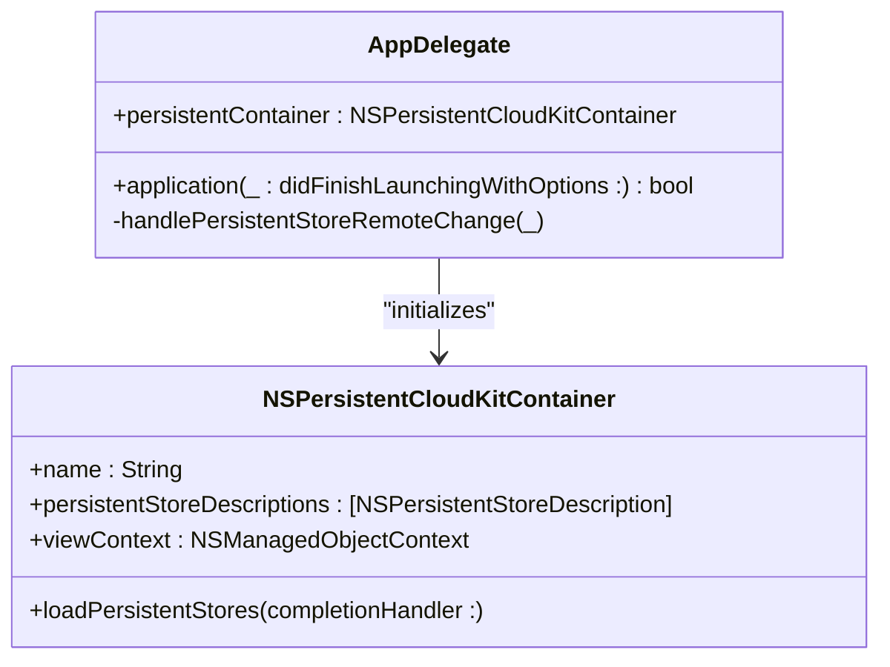
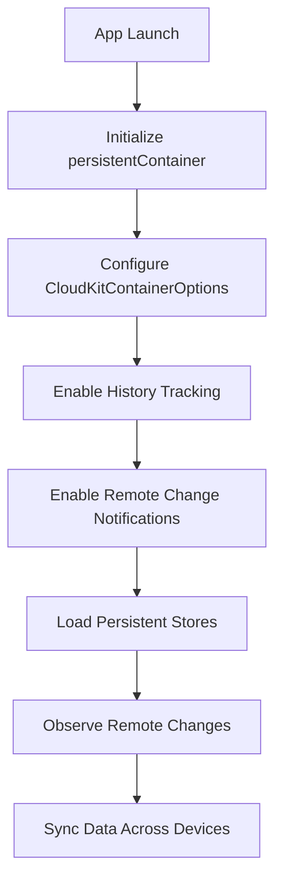
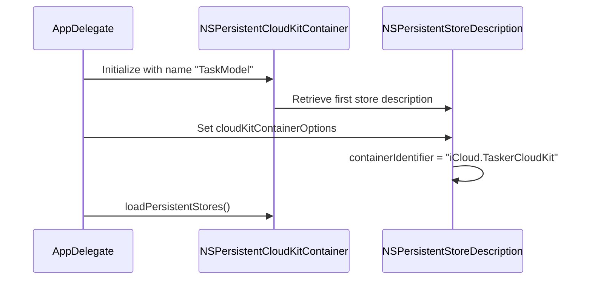
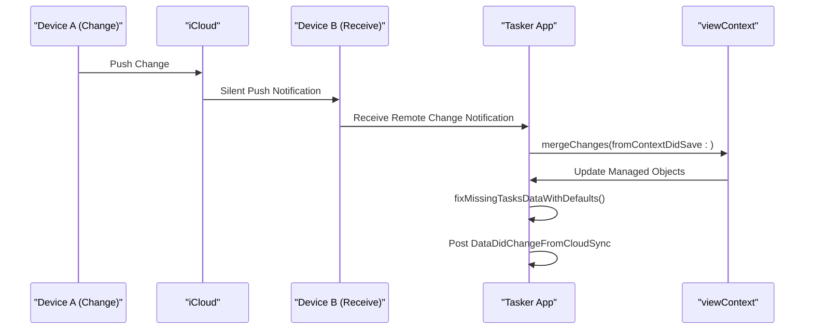

# CloudKit Configuration

<cite>
**Referenced Files in This Document**   
- [AppDelegate.swift](file://To%20Do%20List/AppDelegate.swift)
</cite>

## Table of Contents
1. [Introduction](#introduction)
2. [NSPersistentCloudKitContainer Initialization](#nspersistentcloudkitcontainer-initialization)
3. [Core Data and CloudKit Integration](#core-data-and-cloudkit-integration)
4. [CloudKit Container Configuration](#cloudkit-container-configuration)
5. [Persistent Store Setup and Synchronization](#persistent-store-setup-and-synchronization)
6. [Remote Change Handling and Context Merging](#remote-change-handling-and-context-merging)
7. [CloudKit Event Monitoring and Debugging](#cloudkit-event-monitoring-and-debugging)
8. [Best Practices for CloudKit in Tasker](#best-practices-for-cloudkit-in-tasker)
9. [Conclusion](#conclusion)

## Introduction
This document details the CloudKit configuration within the Tasker iOS application, focusing on the integration of `NSPersistentCloudKitContainer` with Core Data to enable seamless, cross-device data synchronization via iCloud. The implementation is centered in `AppDelegate.swift`, where the persistent container is initialized, configured, and monitored for remote changes. The document explains the initialization process, container identifier setup, schema coordination, and synchronization mechanisms, along with error handling and debugging strategies essential for robust iCloud integration.

**Section sources**
- [AppDelegate.swift](file://To%20Do%20List/AppDelegate.swift#L1-L50)

## NSPersistentCloudKitContainer Initialization
The `NSPersistentCloudKitContainer` is lazily initialized in the `AppDelegate` class as a computed property named `persistentContainer`. This ensures the container is only created when first accessed, typically during app launch. The container is initialized with the name `"TaskModel"`, which corresponds to the Core Data model file used by the application.

**Diagram sources**
- [AppDelegate.swift](file://To%20Do%20List/AppDelegate.swift#L98-L100)

**Section sources**
- [AppDelegate.swift](file://To%20Do%20List/AppDelegate.swift#L98-L100)

## Core Data and CloudKit Integration
The integration between Core Data and CloudKit is achieved through the `NSPersistentCloudKitContainer`, which extends `NSPersistentContainer` to automatically synchronize Core Data entities with CloudKit records. This allows the app to store user tasks and projects in iCloud, ensuring data consistency across all devices associated with the same Apple ID.

The integration includes enabling history tracking and remote change notifications, which are essential for detecting and merging changes from other devices. These features are configured directly on the persistent store description before the store is loaded.

**Diagram sources**
- [AppDelegate.swift](file://To%20Do%20List/AppDelegate.swift#L105-L120)

**Section sources**
- [AppDelegate.swift](file://To%20Do%20List/AppDelegate.swift#L105-L120)

## CloudKit Container Configuration
The CloudKit container is explicitly configured using a custom container identifier: `iCloud.TaskerCloudKit`. This identifier must match a container configured in the Apple Developer portal and associated with the app’s entitlements. Using a reverse-DNS style naming convention ensures uniqueness and avoids conflicts with other applications.

The container options are set via the `cloudKitContainerOptions` property of the persistent store description. This step is critical for enabling CloudKit synchronization and must be performed before the persistent store is loaded.

**Diagram sources**
- [AppDelegate.swift](file://To%20Do%20List/AppDelegate.swift#L107-L108)

**Section sources**
- [AppDelegate.swift](file://To%20Do%20List/AppDelegate.swift#L107-L108)

## Persistent Store Setup and Synchronization
The persistent store is loaded asynchronously using the `loadPersistentStores(completionHandler:)` method. Upon successful loading, the app logs the store name and its associated CloudKit container identifier for verification. If an error occurs during loading, the app triggers a fatal error, which is appropriate during development but should be handled more gracefully in production.

Additionally, the `viewContext` is configured to automatically merge changes from the parent context, ensuring that updates from other devices are reflected in the UI without requiring a full context refresh. A merge policy (`NSMergeByPropertyStoreTrumpMergePolicy`) is set to resolve conflicts by favoring the store's version of the data.

**Section sources**
- [AppDelegate.swift](file://To%20Do%20List/AppDelegate.swift#L121-L135)

## Remote Change Handling and Context Merging
To respond to changes from other devices, the app registers for the `.NSPersistentStoreRemoteChange` notification. When a remote change is detected, the `handlePersistentStoreRemoteChange(_:)` method is invoked. This method performs the merge on the view context’s queue to ensure thread safety.

After merging changes, the app triggers data consolidation logic to repair any missing or inconsistent data, ensuring data integrity across sync operations. A custom notification (`DataDidChangeFromCloudSync`) is posted to inform the UI layer of changes, enabling dynamic updates.

**Diagram sources**
- [AppDelegate.swift](file://To%20Do%20List/AppDelegate.swift#L175-L190)

**Section sources**
- [AppDelegate.swift](file://To%20Do%20List/AppDelegate.swift#L175-L190)

## CloudKit Event Monitoring and Debugging
For debugging purposes, the app observes `NSPersistentCloudKitContainer.eventChangedNotification`. This allows developers to monitor CloudKit operations such as record uploads, downloads, and errors in real time. Each event is logged to the console with its type and any associated error, providing visibility into the synchronization process.

This logging mechanism is invaluable during development for diagnosing sync issues, failed uploads, or permission problems. It should be disabled or filtered in production builds to avoid excessive logging.

**Section sources**
- [AppDelegate.swift](file://To%20Do%20List/AppDelegate.swift#L70-L89)

## Best Practices for CloudKit in Tasker
- **Container Naming**: Use a unique, reverse-DNS style identifier (`iCloud.TaskerCloudKit`) to avoid naming conflicts.
- **Environment Handling**: Ensure the CloudKit container is properly configured in both development and production environments via the Apple Developer portal.
- **Error Handling**: Replace `fatalError()` with user-friendly error handling in production to prevent app crashes when iCloud is unavailable.
- **User Account Availability**: While not explicitly checked in the current code, best practice includes verifying iCloud account availability using `CKContainer.default().status(forAccount:)` before enabling sync features.
- **Schema Initialization**: Ensure the Core Data model schema is properly annotated for CloudKit in Xcode, including assigning record zones and enabling CloudKit support per entity.
- **Debugging**: Enable CloudKit logging in Xcode using the argument `-com.apple.CoreData.CloudKitDebug 1` to gain deeper insights into sync operations.

**Section sources**
- [AppDelegate.swift](file://To%20Do%20List/AppDelegate.swift#L70-L89)

## Conclusion
The Tasker app effectively leverages `NSPersistentCloudKitContainer` to synchronize Core Data with iCloud, enabling seamless task and project management across devices. The configuration in `AppDelegate.swift` demonstrates proper initialization, container setup, change handling, and debugging practices. By following CloudKit best practices and ensuring robust error handling, the app can provide a reliable and consistent user experience in both development and production environments.