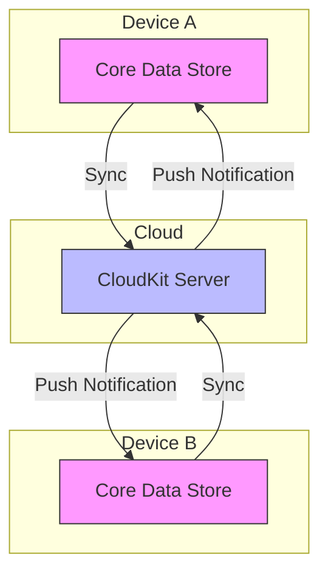
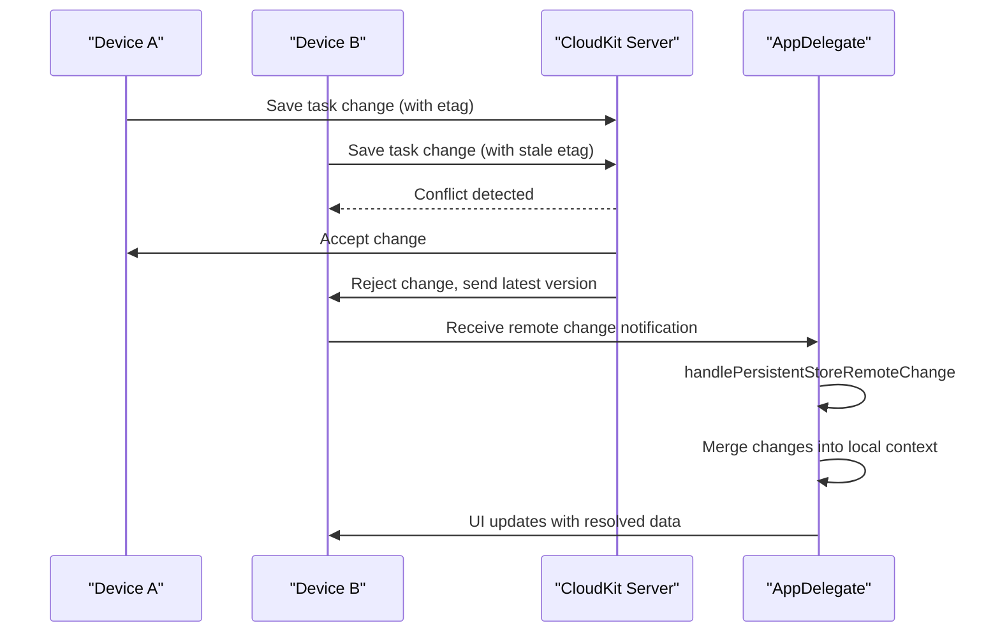

# Conflict Resolution

<cite>
**Referenced Files in This Document**   
- [CoreDataTaskRepository.swift](file://To%20Do%20List/Repositories/CoreDataTaskRepository.swift)
- [README.md](file://README.md)
</cite>

## Table of Contents
1. [Introduction](#introduction)
2. [Core Data and CloudKit Synchronization Overview](#core-data-and-cloudkit-synchronization-overview)
3. [Conflict Detection Mechanism](#conflict-detection-mechanism)
4. [Merge Policy: NSMergeByPropertyStoreTrumpMergePolicy](#merge-policy-nsmergebypropertystoretrumpmergepolicy)
5. [Real-World Conflict Scenarios](#real-world-conflict-scenarios)
6. [Data Consistency and Automatic Resolution](#data-consistency-and-automatic-resolution)
7. [Observing Conflict Resolution Events](#observing-conflict-resolution-events)
8. [Testing Conflict Scenarios](#testing-conflict-scenarios)
9. [Monitoring with CloudKit Dashboard](#monitoring-with-cloudkit-dashboard)
10. [Conclusion](#conclusion)

## Introduction
This document details the conflict resolution strategy implemented in Tasker, a productivity application that synchronizes task data across multiple devices using Core Data and CloudKit. When the same task is modified simultaneously on different devices, write conflicts can occur. Tasker leverages Apple's built-in mechanisms to automatically detect and resolve these conflicts, ensuring data consistency without requiring user intervention. This document explains the underlying architecture, merge policies, real-world scenarios, and developer tools for observing and testing conflict resolution.

## Core Data and CloudKit Synchronization Overview
Tasker uses `NSPersistentCloudKitContainer` to enable seamless synchronization of task data across devices via iCloud. The persistent container is configured with a dedicated CloudKit container identifier (`iCloud.TaskerCloudKit`) and enables key features such as history tracking and remote change notifications.



**Diagram sources**
- [README.md](file://README.md#L1321-L1354)

**Section sources**
- [README.md](file://README.md#L1321-L1354)

## Conflict Detection Mechanism
CloudKit automatically detects write conflicts when two or more devices attempt to modify the same record simultaneously. Each record in CloudKit maintains a version token (etag), and any update must include the current token. If the token has changed since the last fetch (indicating another device modified the record), CloudKit rejects the update and triggers a conflict resolution process.

On the client side, Core Data uses persistent history tracking (`NSPersistentHistoryTrackingKey`) to monitor changes across the persistent store. When a remote change is detected via silent push notification, the system posts an `NSPersistentStoreRemoteChange` notification, which initiates the merging of changes into the local context.



**Diagram sources**
- [README.md](file://README.md#L1321-L1354)
- [AppDelegate.swift](file://To%20Do%20List/AppDelegate.swift#L150-L192)

**Section sources**
- [README.md](file://README.md#L1321-L1354)

## Merge Policy: NSMergeByPropertyStoreTrumpMergePolicy
To resolve conflicts during the merge process, Tasker configures its background managed object context with the `NSMergeByPropertyStoreTrumpMergePolicy`. This policy determines how conflicting property values are handled when merging changes from different contexts.

In `CoreDataTaskRepository.swift`, the background context is configured as follows:

```swift
self.backgroundContext.mergePolicy = NSMergeByPropertyStoreTrumpMergePolicy
```

This merge policy means that when a conflict occurs:
- For each individual property, the value from the **store** (i.e., the version that was successfully saved to CloudKit) **overrides** the value in the current context.
- This ensures that the most recently accepted change by CloudKit becomes the authoritative value.
- The local pending changes are discarded for conflicting properties, but non-conflicting changes from other properties may still be preserved depending on the exact merge behavior.

This approach prioritizes server-side consistency and prevents data loss due to race conditions, ensuring that all devices converge to the same state after synchronization.

**Section sources**
- [CoreDataTaskRepository.swift](file://To%20Do%20List/Repositories/CoreDataTaskRepository.swift#L16-L17)

## Real-World Conflict Scenarios
The following scenarios illustrate how Tasker handles common conflict situations using the configured merge policy.

### Scenario 1: Simultaneous Completion Status Change
Two users mark the same task as complete on different devices at the same time:
- **Device A**: Sets `isComplete = true`
- **Device B**: Also sets `isComplete = true`

Since both changes are identical, no conflict occurs. Both devices will reflect the completed status after sync.

### Scenario 2: Conflicting Due Date and Completion Updates
A task is edited simultaneously:
- **Device A**: Marks task as complete (`isComplete = true`)
- **Device B**: Reschedules task to next week (`dueDate = nextWeek`)

CloudKit accepts one change first (e.g., completion). The second device receives a conflict, downloads the latest version, and applies its `dueDate` change on top. The final state will be `isComplete = true` and `dueDate = nextWeek`.

### Scenario 3: Opposite Completion States
Conflicting completion actions:
- **Device A**: Marks task complete (`isComplete = true`)
- **Device B**: Unmarks task (`isComplete = false`)

The last write wins based on CloudKit's etag mechanism. The winning device's `isComplete` value will override the other due to `NSMergeByPropertyStoreTrumpMergePolicy`, ensuring a consistent final state across devices.

## Data Consistency and Automatic Resolution
Tasker ensures data consistency through several mechanisms:
- **Local-first architecture**: All changes are made locally first, ensuring responsiveness even without network connectivity.
- **Automatic background sync**: Changes are pushed to CloudKit when possible, and remote changes are pulled via silent push notifications.
- **Post-sync validation**: After merging remote changes, the app runs data integrity checks using `fixMissingTasksDataWithDefaults()` and `fixMissingProjecsDataWithDefaults()` to ensure all tasks have valid projects and default values.
- **Thread-safe merging**: The `handlePersistentStoreRemoteChange` method performs merges on the managed object context queue to prevent race conditions.

These mechanisms work together to ensure that users see a consistent view of their tasks across all devices without manual intervention.

**Section sources**
- [README.md](file://README.md#L1321-L1354)
- [AppDelegate.swift](file://To%20Do%20List/AppDelegate.swift#L150-L192)

## Observing Conflict Resolution Events
Developers can observe synchronization events, including conflict resolution, using `NSPersistentCloudKitContainerEvent` notifications. These events provide insight into the sync process and can be used for debugging or user feedback.

Key notification types include:
- `NSPersistentStoreRemoteChange`: Posted when remote changes are detected
- `NSPersistentCloudKitContainer.eventChangedNotification`: Posted for CloudKit container events (e.g., import/export, errors)

Example observation setup:
```swift
NotificationCenter.default.addObserver(
    self,
    selector: #selector(handlePersistentStoreRemoteChange),
    name: .NSPersistentStoreRemoteChange,
    object: nil
)
```

Upon receiving these notifications, developers can log events, refresh UI components, or trigger analytics to monitor sync health and conflict frequency.

**Section sources**
- [README.md](file://README.md#L1321-L1354)
- [AppDelegate.swift](file://To%20Do%20List/AppDelegate.swift#L150-L192)

## Testing Conflict Scenarios
To validate conflict resolution behavior, developers should test using multiple devices or simulators:

### Test Setup
1. Launch Tasker on two iOS simulators signed into the same iCloud account
2. Open the same task on both devices
3. Make conflicting edits simultaneously (e.g., toggle completion on one, change due date on the other)
4. Observe synchronization behavior after a few seconds

### Expected Outcomes
- One device's change will be accepted by CloudKit
- The other device will receive a push notification and update to match
- Both devices should display identical task states post-sync
- Console logs should show merge operations and final property values

Automated tests can also simulate these scenarios using XCTestCase and mock CloudKit responses to ensure robustness under various conflict conditions.

## Monitoring with CloudKit Dashboard
The CloudKit Dashboard provides valuable insights into synchronization events and conflicts:

### Key Metrics to Monitor
- **Record Save Conflicts**: Number of write conflicts detected
- **Push Notifications Sent**: Indicates sync activity
- **Zone Migration Events**: Schema changes affecting sync
- **Error Logs**: Details on failed operations

### Diagnostic Steps
1. Navigate to the CloudKit Dashboard for `iCloud.TaskerCloudKit`
2. Select the relevant environment (Development/Production)
3. View the "Logs" tab to inspect conflict events
4. Use the "Data" tab to verify record versions and modification timestamps
5. Filter by record type (`NTask`) to analyze task-specific sync behavior

These tools help developers verify that conflict resolution is working as expected and identify any anomalies in the synchronization pipeline.

## Conclusion
Tasker implements a robust conflict resolution system using Core Data's integration with CloudKit. By enabling history tracking and configuring the `NSMergeByPropertyStoreTrumpMergePolicy`, the app automatically resolves write conflicts when tasks are modified on multiple devices. The system ensures data consistency without user intervention, leveraging CloudKit's server-side conflict detection and Core Data's merge capabilities. Developers can observe sync events through notifications and validate behavior using multiple test devices or the CloudKit Dashboard. This architecture provides a seamless, reliable cross-device experience for users managing their tasks.