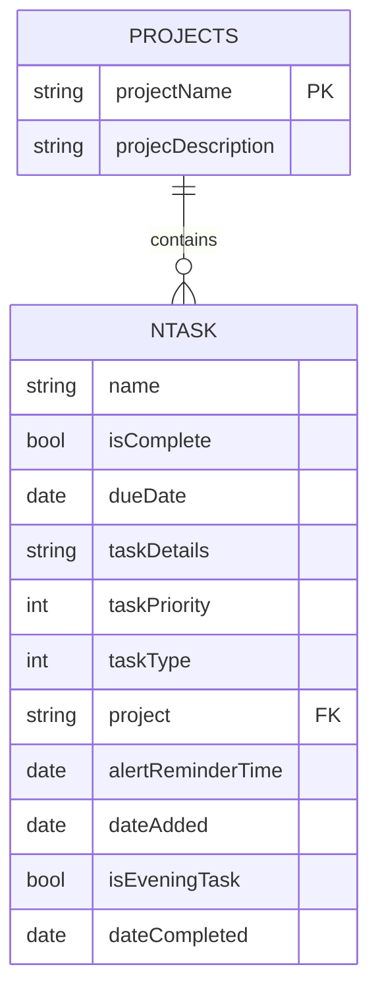

# Core Data Model

<cite>
**Referenced Files in This Document**   
- [NTask+CoreDataClass.swift](file://To%20Do%20List/NTask+CoreDataClass.swift)
- [NTask+CoreDataProperties.swift](file://To%20Do%20List/NTask+CoreDataProperties.swift)
- [NTask+Extensions.swift](file://To%20Do%20List/NTask+Extensions.swift)
- [TaskData.swift](file://To%20Do%20List/Models/TaskData.swift)
- [TaskManager.swift](file://To%20Do%20List/ViewControllers/TaskManager.swift)
- [README.md](file://README.md)
</cite>

## Table of Contents
1. [Introduction](#introduction)
2. [NTask Entity](#ntask-entity)
3. [Projects Entity](#projects-entity)
4. [Entity Relationship](#entity-relationship)
5. [TaskData Presentation Model](#taskdata-presentation-model)
6. [TaskPriority and TaskType Enums](#taskpriority-and-tasktype-enums)
7. [Data Validation and Constraints](#data-validation-and-constraints)
8. [Data Access Patterns](#data-access-patterns)
9. [Data Lifecycle and Synchronization](#data-lifecycle-and-synchronization)
10. [Sample Data Instances](#sample-data-instances)

## Introduction
This document provides comprehensive documentation for the Core Data model used in the Tasker application, focusing on the `NTask` and `Projects` entities. It details the attributes, relationships, and data access patterns that form the foundation of the app's task management system. The model uses a hybrid approach where `NTask` entities are linked to `Projects` via a string-based foreign key rather than a formal Core Data relationship, with plans for future migration to a proper relational model. The documentation also covers the `TaskData` struct, which serves as a type-safe presentation layer abstraction over the Core Data managed objects.

## NTask Entity

The `NTask` entity represents individual tasks within the Tasker application. It contains comprehensive information about each task, including its name, status, scheduling, and categorization details.

**Attribute Details:**
- **name**: `String` (required) – The title of the task displayed in lists and detail views
- **isComplete**: `Bool` (required, default: `false`) – Indicates whether the task has been completed
- **dueDate**: `Date` (optional) – The scheduled completion date for the task; nil indicates unscheduled
- **taskDetails**: `String` (optional) – Additional notes or description for the task
- **taskPriority**: `Int32` (required, default: `3`) – Priority level mapped to `TaskPriority` enum (1-4)
- **taskType**: `Int32` (required, default: `1`) – Type classification mapped to `TaskType` enum (1-4)
- **project**: `String` (optional, default: "Inbox") – String reference to project name (acts as foreign key)
- **alertReminderTime**: `Date` (optional) – Time for local notification reminders
- **dateAdded**: `Date` (optional) – Timestamp when the task was created (automatically set)
- **isEveningTask**: `Bool` (required, default: `false`) – Convenience flag for UI logic, synchronized with taskType
- **dateCompleted**: `Date` (optional) – Timestamp when the task was marked complete

The entity includes a computed method `getTaskScore(task:)` that returns a numerical score based on task priority, with higher priority tasks receiving higher scores.

**Section sources**
- [NTask+CoreDataProperties.swift](file://To%20Do%20List/NTask+CoreDataProperties.swift#L15-L53)
- [README.md](file://README.md#L870-L886)

## Projects Entity

The `Projects` entity serves as a categorization system for tasks in the Tasker application. It functions as a master list of project categories to which tasks can be assigned.

**Attribute Details:**
- **projectName**: `String` (optional) – Primary identifier and natural key for the project
- **projecDescription**: `String` (optional) – User-facing description of the project (note: attribute name contains typo preserved for compatibility)

> **Note:** The attribute name "projecDescription" contains a spelling error but is preserved for Core Data compatibility reasons.

The entity currently exists as a simple categorization table, with tasks referencing projects through the `project` string field in the `NTask` entity rather than a formal Core Data relationship.

**Section sources**
- [README.md](file://README.md#L887-L924)

## Entity Relationship

The relationship between `Projects` and `NTask` entities is currently implemented at the business logic level rather than through Core Data's native relationship system. This creates a logical one-to-many relationship where one project can contain many tasks.



**Relationship Characteristics:**
- **Cardinality**: One `Projects` entity can be associated with many `NTask` entities
- **Implementation**: String-based foreign key (`project` field in `NTask` references `projectName` in `Projects`)
- **Delete Rule**: When a project is deleted, tasks are not automatically deleted. Instead, a manual merge routine (`mergeInboxDuplicates`) reassigns orphaned tasks to the "Inbox" project
- **Future Migration**: Planned to convert the string-based reference into a formal Core Data relationship with a "Nullify" delete rule

This hybrid approach provides flexibility but requires careful management to maintain data integrity, as there are no database-level constraints enforcing referential integrity.

**Diagram sources**
- [README.md](file://README.md#L887-L924)

**Section sources**
- [README.md](file://README.md#L887-L924)

## TaskData Presentation Model

The `TaskData` struct serves as a presentation model abstraction over the `NTask` Core Data entity, providing a clean separation between the persistence layer and the user interface.

```swift
struct TaskData {
    let id: NSManagedObjectID?
    let name: String
    let details: String?
    let type: TaskType
    let priority: TaskPriority
    let dueDate: Date
    let project: String
    let isComplete: Bool
    let dateAdded: Date
    let dateCompleted: Date?
    
    init(managedObject: NTask) {
        self.id = managedObject.objectID
        self.name = managedObject.name ?? "Untitled Task"
        self.details = managedObject.taskDetails
        self.type = TaskType(rawValue: managedObject.taskType) ?? .morning
        self.priority = TaskPriority(rawValue: managedObject.taskPriority) ?? .medium
        self.dueDate = managedObject.dueDate as Date? ?? Date()
        self.project = managedObject.project ?? "Inbox"
        self.isComplete = managedObject.isComplete
        self.dateAdded = managedObject.dateAdded as Date? ?? Date()
        self.dateCompleted = managedObject.dateCompleted as Date?
    }
}
```

**Key Benefits:**
- **Type Safety**: Uses `TaskType` and `TaskPriority` enums instead of raw integers
- **Non-Optional Defaults**: Provides sensible defaults for optional Core Data attributes
- **Value Semantics**: As a struct, it follows value semantics which is preferred for SwiftUI
- **Decoupling**: Separates UI logic from Core Data implementation details
- **Thread Safety**: Can be safely passed between threads without managed object context concerns

The struct includes two initializers: one for converting from a managed object and another for creating new instances with specified values.

**Section sources**
- [TaskData.swift](file://To%20Do%20List/Models/TaskData.swift#L1-L56)

## TaskPriority and TaskType Enums

The `TaskPriority` and `TaskType` enums provide type-safe access to task priority and type values, abstracting the underlying integer storage in Core Data.

### TaskPriority Enum
```swift
enum TaskPriority: Int32, CaseIterable {
    case low = 1          // P0 – Highest priority
    case medium = 2       // P1
    case high = 3         // P2
    case veryLow = 4      // P3 – Lowest priority
    
    var description: String {
        switch self {
        case .low: return "Low"
        case .medium: return "Medium"
        case .high: return "High"
        case .veryLow: return "Very Low"
        }
    }
    
    var scoreValue: Int {
        switch self {
        case .high:      return 3
        case .medium:    return 2
        case .low:       return 1
        case .veryLow:   return 0
        }
    }
}
```

### TaskType Enum
```swift
enum TaskType: Int32, CaseIterable {
    case morning = 1
    case evening = 2
    case upcoming = 3
    
    var description: String {
        switch self {
        case .morning: return "Morning"
        case .evening: return "Evening"
        case .upcoming: return "Upcoming"
        }
    }
}
```

**Extension Integration:**
The `NTask+Extensions.swift` file provides computed properties that bridge the Core Data attributes with these enums:

```swift
extension NTask {
    var type: TaskType {
        get { return TaskType(rawValue: self.taskType) ?? .morning }
        set { self.taskType = newValue.rawValue }
    }
    
    var priority: TaskPriority {
        get { return TaskPriority(rawValue: self.taskPriority) ?? .medium }
        set { self.taskPriority = newValue.rawValue }
    }
}
```

This design pattern ensures type safety while maintaining compatibility with Core Data's integer-based storage.

**Section sources**
- [TaskManager.swift](file://To%20Do%20List/ViewControllers/TaskManager.swift#L15-L31)
- [NTask+Extensions.swift](file://To%20Do%20List/NTask+Extensions.swift#L10-L15)

## Data Validation and Constraints

The Core Data model implements several validation rules and constraints to ensure data integrity.

**Required Fields:**
- `name`: Must not be null; tasks without names default to "Untitled Task" in the presentation layer
- `isComplete`: Required boolean with default value of `false`
- `taskPriority`: Required integer with default value of `3` (medium priority)
- `taskType`: Required integer with default value of `1` (morning task)
- `isEveningTask`: Required boolean with default value of `false`

**Data Range Constraints:**
- `taskPriority`: Valid range is 1-4, corresponding to `TaskPriority` enum cases
- `taskType`: Valid range is 1-3, corresponding to `TaskType` enum cases (1=morning, 2=evening, 3=upcoming)

**Default Values:**
- New tasks are automatically assigned:
  - `taskPriority` = 3 (medium)
  - `taskType` = 1 (morning)
  - `isComplete` = false
  - `project` = "Inbox"
  - `dateAdded` = current timestamp

**Business Logic Constraints:**
- The `updateEveningTaskStatus(_:)` method ensures consistency between `isEveningTask` flag and `taskType` value
- When `isEveningTask` is set to true, `taskType` is automatically set to `.evening`
- When `isEveningTask` is set to false and the current type is evening, it reverts to morning

**Section sources**
- [NTask+CoreDataProperties.swift](file://To%20Do%20List/NTask+CoreDataProperties.swift#L15-L53)
- [NTask+Extensions.swift](file://To%20Do%20List/NTask+Extensions.swift#L25-L35)

## Data Access Patterns

The application uses several patterns for accessing and querying task data, primarily through the `TaskManager` singleton.

**Fetch Requests:**
- Basic fetch: `NSFetchRequest<NTask>(entityName: "NTask")`
- Predicate-based filtering for specific criteria
- Sort descriptors for ordered results

**Common Query Patterns:**
```swift
// Get all upcoming tasks
func getUpcomingTasks() -> [NTask] {
    let predicate = NSPredicate(format: "taskType == %d", TaskType.upcoming.rawValue)
    let sortByDate = NSSortDescriptor(key: "dueDate", ascending: true)
    return fetchTasks(predicate: predicate, sortDescriptors: [sortByDate])
}

// Get tasks for a specific project
func getTasksForProjectByName(projectName: String) -> [NTask] {
    let predicate = NSPredicate(format: "project CONTAINS[c] %@", projectName)
    return fetchTasks(predicate: predicate, sortDescriptors: [NSSortDescriptor(key: "dueDate", ascending: true)])
}
```

**Compound Predicates:**
For complex queries like retrieving all Inbox tasks for a specific date, the app combines multiple predicates:
- Tasks due today in Inbox
- Overdue tasks that are still open
- Tasks completed today
- Tasks with nil project

**Performance Considerations:**
- Uses case-insensitive predicates (`==[c]`, `CONTAINS[c]`) for flexible matching
- Applies sort descriptors for consistent ordering
- Caches results in the `TaskManager` for frequently accessed data
- Plans to migrate to `NSFetchedResultsController` for efficient table view updates

**Section sources**
- [TaskManager.swift](file://To%20Do%20List/ViewControllers/TaskManager.swift#L45-L100)

## Data Lifecycle and Synchronization

The data lifecycle management in Tasker involves several considerations for persistence, synchronization, and future schema evolution.

**Persistence Strategy:**
- Core Data with SQLite backend
- Managed object context hierarchy for thread safety
- `TaskManager` singleton coordinates all data operations

**Synchronization Considerations:**
- No explicit CloudKit integration currently visible in code
- String-based project references allow flexibility during synchronization
- Future migration plans suggest awareness of potential conflicts

**Migration Strategies:**
- **Current State**: String-based foreign key relationship between tasks and projects
- **Future Plan**: Convert to formal Core Data relationship with "Nullify" delete rule
- **Migration Approach**: Lightweight migration using Xcode's automatic migration feature
- **Conflict Resolution**: Manual merge routine (`mergeInboxDuplicates`) handles orphaned tasks when projects are deleted

**Data Integrity Measures:**
- Default values ensure required fields are populated
- Business logic enforces consistency between related fields (e.g., `isEveningTask` and `taskType`)
- Presentation layer (`TaskData`) provides fallback values for optional attributes

**Section sources**
- [README.md](file://README.md#L270-L280)
- [TaskManager.swift](file://To%20Do%20List/ViewControllers/TaskManager.swift#L15-L31)

## Sample Data Instances

The following examples illustrate real-world usage of the data model:

**Example 1: Morning High-Priority Task**
```json
{
  "name": "Morning Workout",
  "isComplete": false,
  "dueDate": "2025-06-10T07:00:00Z",
  "taskDetails": "30-minute cardio and strength training",
  "taskPriority": 1,
  "taskType": 1,
  "project": "Health",
  "alertReminderTime": "2025-06-10T06:45:00Z",
  "dateAdded": "2025-06-09T18:30:00Z",
  "isEveningTask": false,
  "dateCompleted": null
}
```

**Example 2: Completed Evening Task**
```json
{
  "name": "Evening Reading",
  "isComplete": true,
  "dueDate": "2025-06-09T21:00:00Z",
  "taskDetails": "Read 20 pages of 'Design Patterns'",
  "taskPriority": 3,
  "taskType": 2,
  "project": "Personal Development",
  "alertReminderTime": "2025-06-09T20:45:00Z",
  "dateAdded": "2025-06-09T08:15:00Z",
  "isEveningTask": true,
  "dateCompleted": "2025-06-09T21:15:00Z"
}
```

**Example 3: Upcoming Task with No Project**
```json
{
  "name": "Doctor Appointment",
  "isComplete": false,
  "dueDate": "2025-06-15T14:00:00Z",
  "taskDetails": "Annual physical examination",
  "taskPriority": 2,
  "taskType": 3,
  "project": "Inbox",
  "alertReminderTime": "2025-06-15T13:30:00Z",
  "dateAdded": "2025-06-08T10:20:00Z",
  "isEveningTask": false,
  "dateCompleted": null
}
```

These examples demonstrate the various states and configurations possible within the data model, showing how the attributes work together to represent different types of tasks in the application.

**Section sources**
- [README.md](file://README.md#L870-L886)
- [NTask+CoreDataProperties.swift](file://To%20Do%20List/NTask+CoreDataProperties.swift#L15-L53)