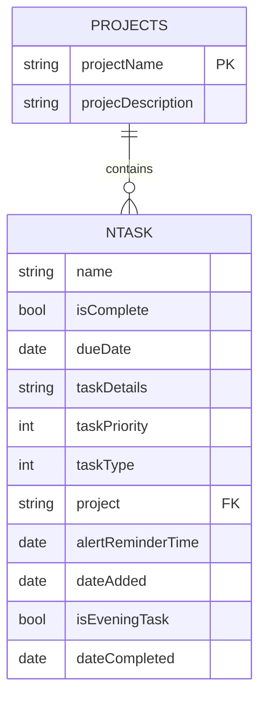

# NTask Entity

<cite>
**Referenced Files in This Document**   
- [NTask+CoreDataClass.swift](file://To%20Do%20List/NTask+CoreDataClass.swift)
- [NTask+CoreDataProperties.swift](file://To%20Do%20List/NTask+CoreDataProperties.swift)
- [NTask+Extensions.swift](file://To%20Do%20List/NTask+Extensions.swift)
- [TaskData.swift](file://To%20Do%20List/Models/TaskData.swift)
- [README.md](file://README.md)
</cite>

## Table of Contents
1. [Introduction](#introduction)
2. [Core Attributes](#core-attributes)
3. [Type-Safe Enum Integration](#type-safe-enum-integration)
4. [Data Constraints and Validation](#data-constraints-and-validation)
5. [Fetch Request Examples](#fetch-request-examples)
6. [CloudKit Synchronization](#cloudkit-synchronization)
7. [Schema Diagram](#schema-diagram)
8. [Sample JSON Representations](#sample-json-representations)

## Introduction
The NTask entity is the primary data model in the Tasker application, representing individual tasks within the productivity system. Built on Core Data, NTask stores comprehensive task information including title, priority, due date, completion status, and project association. The entity is designed with extensibility in mind, supporting gamification features through a scoring system and enabling cross-device synchronization via CloudKit. This documentation provides a comprehensive overview of the NTask data model, its attributes, relationships, and integration patterns within the application architecture.

## Core Attributes
The NTask entity contains several attributes that define a task's properties and behavior. These attributes are defined in the Core Data model and exposed through managed object properties.

**Attribute Details:**
- **name**: `String`, non-optional - The task title displayed in lists and detail views
- **isComplete**: `Bool`, non-optional, default `false` - Flag indicating whether the task has been completed
- **dueDate**: `Date`, optional - The scheduled completion date for the task (nil indicates unscheduled)
- **taskDetails**: `String`, optional - Additional description or notes about the task
- **taskPriority**: `Int32`, non-optional, default `3` - Priority level stored as raw value of TaskPriority enum
- **taskType**: `Int32`, non-optional, default `1` - Category type stored as raw value of TaskType enum
- **project**: `String`, optional - Associated project name acting as a foreign key to Projects entity
- **alertReminderTime**: `Date`, optional - Time for local notification reminders
- **dateAdded**: `Date`, optional - Creation timestamp automatically set when task is created
- **isEveningTask**: `Bool`, non-optional, default `false` - Convenience flag for evening tasks (legacy UI logic)
- **dateCompleted**: `Date`, optional - Timestamp when task was marked complete

**Section sources**
- [NTask+CoreDataProperties.swift](file://To%20Do%20List/NTask+CoreDataProperties.swift#L10-L30)
- [README.md](file://README.md#L870-L886)

## Type-Safe Enum Integration
The NTask entity uses raw-value enums to provide type-safe handling of priority and task type properties, enhancing code safety and readability while maintaining Core Data compatibility.

### TaskPriority Enum
The TaskPriority enum maps integer values to meaningful priority levels, enabling type-safe operations:

```swift
enum TaskPriority: Int32, CaseIterable {
    case highest = 1    // P0: 7 points
    case high = 2       // P1: 4 points
    case medium = 3     // P2: 3 points (default)
    case low = 4        // P3: 2 points
}
```

### TaskType Enum
The TaskType enum categorizes tasks into different types for organizational purposes:

```swift
enum TaskType: Int32, CaseIterable {
    case morning = 1    // Morning tasks
    case evening = 2    // Evening tasks
    case upcoming = 3   // Future-dated tasks
    case inbox = 4      // Uncategorized tasks
}
```

### Type-Safe Accessors
The NTask+Extensions.swift file provides computed properties that wrap the raw integer values with type-safe enum access:

```swift
extension NTask {
    var priority: TaskPriority {
        get { return TaskPriority(rawValue: self.taskPriority) ?? .medium }
        set { self.taskPriority = newValue.rawValue }
    }
    
    var type: TaskType {
        get { return TaskType(rawValue: self.taskType) ?? .morning }
        set { self.taskType = newValue.rawValue }
    }
}
```

This pattern enables developers to work with meaningful enum values while Core Data stores the efficient integer representation.

**Section sources**
- [NTask+Extensions.swift](file://To%20Do%20List/NTask+Extensions.swift#L5-L50)
- [README.md](file://README.md#L436-L474)

## Data Constraints and Validation
The NTask entity enforces several constraints to maintain data integrity and ensure consistent application behavior.

### Required Constraints
- **name**: Must not be null - All tasks require a title
- **taskPriority**: Valid range 1-4 - Ensures priority values map to defined enum cases
- **taskType**: Valid range 1-4 - Ensures type values map to defined enum cases
- **isComplete**: Boolean flag with default value of `false`

### Default Values
- **taskPriority**: Defaults to `3` (TaskPriority.medium)
- **taskType**: Defaults to `1` (TaskPriority.morning)
- **project**: Defaults to "Inbox" for tasks without explicit project assignment
- **isComplete**: Defaults to `false`
- **isEveningTask**: Defaults to `false`

### Validation Rules
- Project existence is validated with automatic "Inbox" creation if needed
- Task priority values are bounded to the 1-4 range
- Date fields are validated for proper formatting and logical consistency
- Completion status changes automatically set or clear the dateCompleted timestamp

**Section sources**
- [README.md](file://README.md#L730-L771)
- [NTask+CoreDataProperties.swift](file://To%20Do%20List/NTask+CoreDataProperties.swift#L10-L30)

## Fetch Request Examples
The NTask entity supports various fetch requests for filtering tasks based on different criteria, enabling efficient data retrieval for different views and use cases.

### Completion Status Filtering
Fetch completed tasks:
```swift
let request = NTask.fetchRequest()
request.predicate = NSPredicate(format: "isComplete == YES")
```

Fetch incomplete tasks:
```swift
let request = NTask.fetchRequest()
request.predicate = NSPredicate(format: "isComplete == NO")
```

### Due Date Filtering
Fetch tasks due today:
```swift
let request = NTask.fetchRequest()
let startDate = Calendar.current.startOfDay(for: Date())
let endDate = Calendar.current.date(byAdding: .day, value: 1, to: startDate)!
request.predicate = NSPredicate(format: "dueDate >= %@ AND dueDate < %@", 
                              startDate as NSDate, endDate as NSDate)
```

Fetch upcoming tasks:
```swift
let request = NTask.fetchRequest()
request.predicate = NSPredicate(format: "dueDate > %@", Date() as NSDate)
```

### Project Filtering
Fetch tasks for a specific project:
```swift
let request = NTask.fetchRequest()
request.predicate = NSPredicate(format: "project == %@", "Work")
```

### Combined Filtering with Sorting
Fetch high-priority tasks due today, sorted by priority:
```swift
let request = NTask.fetchRequest()
let startDate = Calendar.current.startOfDay(for: Date())
let endDate = Calendar.current.date(byAdding: .day, value: 1, to: startDate)!
request.predicate = NSPredicate(format: "taskPriority <= 2 AND dueDate >= %@ AND dueDate < %@", 
                              startDate as NSDate, endDate as NSDate)
request.sortDescriptors = [
    NSSortDescriptor(key: "taskPriority", ascending: true),
    NSSortDescriptor(key: "dueDate", ascending: true)
]
```

**Section sources**
- [README.md](file://README.md#L592-L651)
- [CoreDataTaskRepository.swift](file://README.md#L592-L651)

## CloudKit Synchronization
The NTask entity integrates with CloudKit for seamless cross-device synchronization, enabling users to access their tasks across multiple devices.

### Container Configuration
The application uses NSPersistentCloudKitContainer for automatic synchronization:

```swift
lazy var persistentContainer: NSPersistentCloudKitContainer = {
    let container = NSPersistentCloudKitContainer(name: "TaskModel")
    
    guard let description = container.persistentStoreDescriptions.first else {
        fatalError("Failed to retrieve a persistent store description.")
    }
    
    description.cloudKitContainerOptions = NSPersistentCloudKitContainerOptions(
        containerIdentifier: "iCloud.TaskerCloudKit"
    )
    
    description.setOption(true as NSNumber, forKey: NSPersistentHistoryTrackingKey)
    description.setOption(true as NSNumber, forKey: NSPersistentStoreRemoteChangeNotificationPostOptionKey)
    
    return container
}()
```

### Synchronization Features
- **Container Identifier**: `iCloud.TaskerCloudKit` for dedicated CloudKit container
- **Remote Change Notifications**: Real-time sync with silent push notifications
- **History Tracking**: `NSPersistentHistoryTrackingKey` for robust sync conflict resolution
- **Merge Policy**: `NSMergeByPropertyStoreTrumpMergePolicy` for intelligent conflict handling
- **Background Sync**: Automatic merging of remote changes via `handlePersistentStoreRemoteChange`
- **Data Consolidation**: Post-sync validation and cleanup with ProjectManager and TaskManager
- **Offline Capability**: Local-first architecture with automatic sync on reconnection
- **Privacy-focused**: User data remains in their personal iCloud private database

### Conflict Resolution Strategy
The application employs a multi-layered conflict resolution approach:
1. **Automatic Merging**: Core Data's built-in merge policy handles most conflicts
2. **History Tracking**: Persistent history tracking enables detection of changes
3. **Remote Change Notifications**: Immediate awareness of remote modifications
4. **Background Context Operations**: Prevents UI blocking during sync operations
5. **Data Validation**: Post-sync validation ensures data integrity

**Section sources**
- [README.md](file://README.md#L1321-L1354)
- [README.md](file://README.md#L925-L976)

## Schema Diagram
The following entity relationship diagram illustrates the NTask entity structure, its attributes, and relationship with the Projects entity.



**Diagram sources**
- [README.md](file://README.md#L887-L924)

## Sample JSON Representations
The following examples show NTask instances in both local and synced states, demonstrating the data structure used in the application.

### Local State (Unsynced)
```json
{
  "name": "Complete project proposal",
  "isComplete": false,
  "dueDate": "2025-06-15T09:00:00Z",
  "taskDetails": "Finalize the Q3 project proposal with team leads",
  "taskPriority": 1,
  "taskType": 1,
  "project": "Work",
  "alertReminderTime": "2025-06-15T08:30:00Z",
  "dateAdded": "2025-06-06T14:30:00Z",
  "isEveningTask": false,
  "dateCompleted": null
}
```

### Synced State (With CloudKit Metadata)
```json
{
  "recordName": "F2C8B5A1-1234-5678-9ABC-DEF012345678",
  "recordType": "NTask",
  "creationDate": "2025-06-06T14:30:00Z",
  "modificationDate": "2025-06-06T14:35:00Z",
  "creatorUserRecordID": "USER:123456789",
  "fields": {
    "name": {
      "value": "Complete project proposal"
    },
    "isComplete": {
      "value": false
    },
    "dueDate": {
      "value": "2025-06-15T09:00:00Z"
    },
    "taskDetails": {
      "value": "Finalize the Q3 project proposal with team leads"
    },
    "taskPriority": {
      "value": 1
    },
    "taskType": {
      "value": 1
    },
    "project": {
      "value": "Work"
    },
    "alertReminderTime": {
      "value": "2025-06-15T08:30:00Z"
    },
    "dateAdded": {
      "value": "2025-06-06T14:30:00Z"
    },
    "isEveningTask": {
      "value": false
    },
    "dateCompleted": {
      "value": null
    }
  },
  "zoneID": {
    "zoneName": "Primary",
    "ownerName": "_defaultOwner"
  }
}
```

**Section sources**
- [TaskData.swift](file://To%20Do%20List/Models/TaskData.swift#L5-L50)
- [README.md](file://README.md#L524-L571)