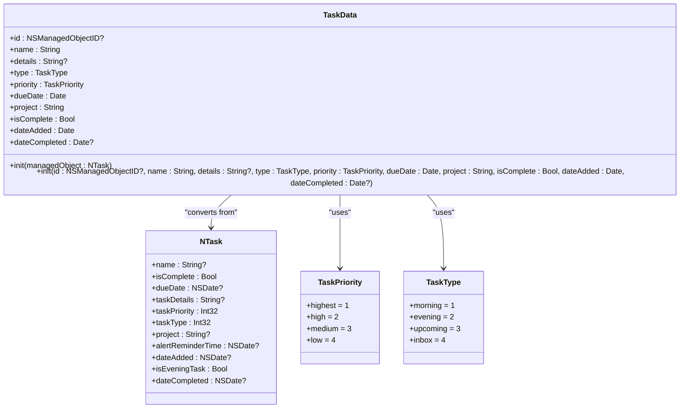
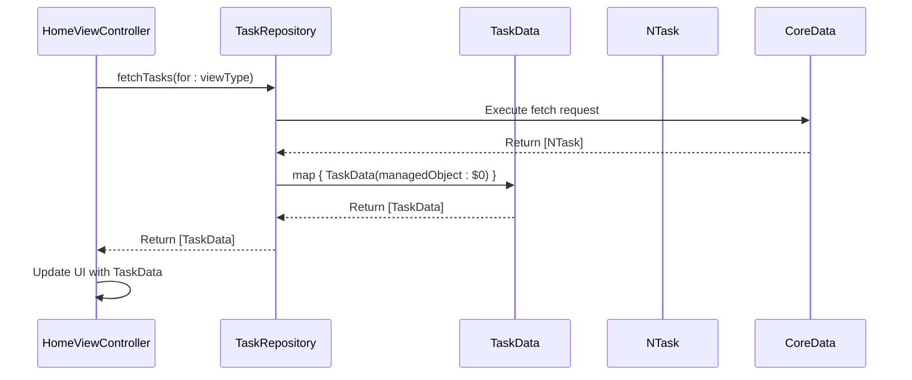
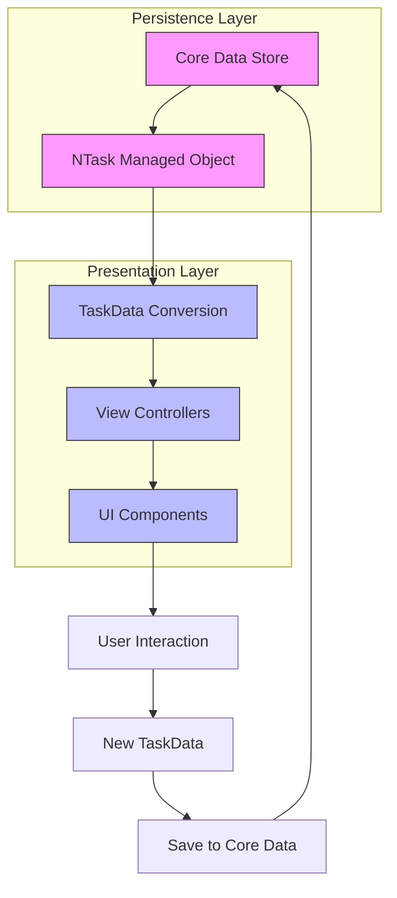

# TaskData Presentation Model

<cite>
**Referenced Files in This Document**   
- [TaskData.swift](file://To%20Do%20List/Models/TaskData.swift)
- [NTask+CoreDataProperties.swift](file://To%20Do%20List/NTask+CoreDataProperties.swift)
- [HomeViewController.swift](file://To%20Do%20List/ViewControllers/HomeViewController.swift)
- [README.md](file://README.md)
</cite>

## Table of Contents
1. [Introduction](#introduction)
2. [Core Data Integration and Enum Conversion](#core-data-integration-and-enum-conversion)
3. [TaskData Structure and Initialization](#taskdata-structure-and-initialization)
4. [Null Safety and Default Value Handling](#null-safety-and-default-value-handling)
5. [Immutability and UI Layer Design](#immutability-and-ui-layer-design)
6. [Usage in View Controllers](#usage-in-view-controllers)
7. [Performance Implications of Data Conversion](#performance-implications-of-data-conversion)
8. [Testability and Separation of Concerns](#testability-and-separation-of-concerns)
9. [Edge Case Handling](#edge-case-handling)
10. [Data Flow Architecture](#data-flow-architecture)

## Introduction

The `TaskData` struct serves as a presentation-layer abstraction over the `NTask` Core Data entity in the Tasker application. This documentation provides a comprehensive analysis of how `TaskData` encapsulates Core Data managed object access through computed properties that convert raw values into type-safe Swift enums (`TaskPriority`, `TaskType`). The model enables clean separation between persistence logic and UI presentation, supporting immutability in the view layer while facilitating data flow to view controllers such as `HomeViewController` and `AddTaskViewController`. This document examines initialization processes, null safety mechanisms, performance considerations, and architectural benefits of this design pattern.

**Section sources**
- [README.md](file://README.md#L524-L571)
- [TaskData.swift](file://To%20Do%20List/Models/TaskData.swift#L0-L56)

## Core Data Integration and Enum Conversion

The `TaskData` model bridges Core Data's primitive storage system with Swift's type-safe enum system. The underlying `NTask` Core Data entity stores priority and type information as `Int32` values, which are then converted to meaningful Swift enums in the presentation layer.



**Diagram sources**
- [TaskData.swift](file://To%20Do%20List/Models/TaskData.swift#L0-L56)
- [NTask+CoreDataProperties.swift](file://To%20Do%20List/NTask+CoreDataProperties.swift#L0-L53)

**Section sources**
- [README.md](file://README.md#L436-L474)
- [NTask+CoreDataProperties.swift](file://To%20Do%20List/NTask+CoreDataProperties.swift#L0-L53)

## TaskData Structure and Initialization

The `TaskData` struct defines a comprehensive set of properties that mirror the essential attributes of a task in the application. It provides two primary initializers: one for converting from an existing `NTask` managed object, and another for creating new tasks.

```swift
struct TaskData {
    let id: NSManagedObjectID?
    let name: String
    let details: String?
    let type: TaskType
    let priority: TaskPriority
    let dueDate: Date
    let project: String
    let isComplete: Bool
    let dateAdded: Date
    let dateCompleted: Date?
    
    init(managedObject: NTask) {
        self.id = managedObject.objectID
        self.name = managedObject.name ?? "Untitled Task"
        self.details = managedObject.taskDetails
        self.type = TaskType(rawValue: managedObject.taskType) ?? .morning
        self.priority = TaskPriority(rawValue: managedObject.taskPriority) ?? .medium
        self.dueDate = managedObject.dueDate as Date? ?? Date()
        self.project = managedObject.project ?? "Inbox"
        self.isComplete = managedObject.isComplete
        self.dateAdded = managedObject.dateAdded as Date? ?? Date()
        self.dateCompleted = managedObject.dateCompleted as Date?
    }
    
    init(id: NSManagedObjectID? = nil, 
         name: String,
         details: String? = nil,
         type: TaskType,
         priority: TaskPriority,
         dueDate: Date,
         project: String = "Inbox",
         isComplete: Bool = false,
         dateAdded: Date = Date(),
         dateCompleted: Date? = nil) {
        self.id = id
        self.name = name
        self.details = details
        self.type = type
        self.priority = priority
        self.dueDate = dueDate
        self.project = project
        self.isComplete = isComplete
        self.dateAdded = dateAdded
        self.dateCompleted = dateCompleted
    }
}
```

The conversion initializer extracts values from the `NTask` managed object, applying type conversion and null safety checks where necessary. The raw `Int32` values from Core Data are converted to their corresponding enum types using the `rawValue` initializer pattern.

**Section sources**
- [TaskData.swift](file://To%20Do%20List/Models/TaskData.swift#L0-L56)

## Null Safety and Default Value Handling

The `TaskData` implementation includes robust null safety mechanisms to handle potentially missing values from the Core Data store. When converting from `NTask`, optional string properties are provided with sensible defaults:

- **Name**: Defaults to "Untitled Task" if `nil`
- **Project**: Defaults to "Inbox" if `nil`
- **Due Date**: Defaults to current date if `nil`
- **Date Added**: Defaults to current date if `nil`

For enum conversions, the implementation uses the nil-coalescing operator (`??`) to provide default values when the raw value initializer returns `nil`:

```swift
self.type = TaskType(rawValue: managedObject.taskType) ?? .morning
self.priority = TaskPriority(rawValue: managedObject.taskPriority) ?? .medium
```

This ensures that even if invalid or corrupted data exists in the persistent store, the presentation layer will always have valid, predictable values. The default `.morning` type and `.medium` priority align with the application's business rules for new tasks.

**Section sources**
- [TaskData.swift](file://To%20Do%20List/Models/TaskData.swift#L0-L56)
- [README.md](file://README.md#L730-L771)

## Immutability and UI Layer Design

The `TaskData` struct enforces immutability in the UI layer by declaring all properties with `let`. This design choice provides several benefits:

1. **Predictable State**: Once created, a `TaskData` instance cannot be modified, preventing unintended state changes
2. **Thread Safety**: Immutable data can be safely passed between threads without synchronization concerns
3. **Simpler Debugging**: State changes are explicit through new instance creation rather than property mutation
4. **Functional Programming Alignment**: Encourages a functional approach to state management

When a task needs to be updated, the application creates a new `TaskData` instance with the modified values rather than mutating the existing one. This pattern supports SwiftUI's reactive architecture and UIKit's data source patterns, where table views and collection views are reloaded with new data rather than modifying individual cells.

**Section sources**
- [TaskData.swift](file://To%20Do%20List/Models/TaskData.swift#L0-L56)

## Usage in View Controllers

The `HomeViewController` demonstrates how `TaskData` is used to populate UI components and perform analytics calculations. The controller interacts with the task repository to fetch tasks, which are automatically converted to `TaskData` instances.



**Diagram sources**
- [HomeViewController.swift](file://To%20Do%20List/ViewControllers/HomeViewController.swift#L0-L199)
- [TaskData.swift](file://To%20Do%20List/Models/TaskData.swift#L0-L56)

In analytics calculations, `TaskData` enables type-safe operations:

```swift
private func priorityBreakdown(for date: Date) -> [TaskPriority: Int] {
    var counts: [TaskPriority: Int] = [.high: 0, .medium: 0, .low: 0, .veryLow: 0]
    let allTasks = TaskManager.sharedInstance.getAllTasks
    
    for task in allTasks {
        guard task.isComplete else { continue }
        let referenceDate: Date?
        if let completed = task.dateCompleted as Date? {
            referenceDate = completed
        } else if let due = task.dueDate as Date? {
            referenceDate = due
        } else {
            referenceDate = nil
        }
        guard let ref = referenceDate,
              Calendar.current.isDate(ref, inSameDayAs: date) else { continue }
        let priority = TaskPriority(rawValue: task.taskPriority) ?? .low
        counts[priority, default: 0] += 1
    }
    return counts
}
```

**Section sources**
- [HomeViewController.swift](file://To%20Do%20List/ViewControllers/HomeViewController.swift#L0-L199)

## Performance Implications of Data Conversion

The frequent conversion between `NTask` and `TaskData` has several performance implications:

**Advantages:**
- **Type Safety**: Eliminates runtime crashes from invalid enum values
- **Compile-Time Checking**: Catches errors during development rather than at runtime
- **Clean Separation**: Prevents Core Data context issues in UI threads

**Potential Concerns:**
- **Memory Overhead**: Creating new `TaskData` instances for each `NTask` increases memory usage
- **CPU Cost**: The mapping operation has O(n) complexity where n is the number of tasks
- **Redundant Conversions**: Multiple conversions may occur during complex operations

The current implementation mitigates these concerns through:
- **Batch Processing**: Converting all tasks in a single `map` operation
- **Lazy Loading**: Only converting data when needed for presentation
- **Caching**: The `HomeViewController` likely caches converted data to avoid repeated conversions

For large datasets, the application could implement pagination or virtualization to limit the number of conversions performed at any given time.

**Section sources**
- [TaskData.swift](file://To%20Do%20List/Models/TaskData.swift#L0-L56)
- [HomeViewController.swift](file://To%20Do%20List/ViewControllers/HomeViewController.swift#L0-L199)

## Testability and Separation of Concerns

The `TaskData` pattern significantly enhances testability and enforces separation of concerns:

**Separation of Concerns:**
- **Data Layer**: `NTask` handles persistence and Core Data integration
- **Presentation Layer**: `TaskData` handles UI representation and type safety
- **Business Logic**: View controllers handle user interactions and flow

**Testability Benefits:**
- **Mockable Data**: `TaskData` instances can be easily created for unit tests without requiring a Core Data stack
- **Deterministic Behavior**: Pure conversion logic without side effects
- **Isolated Testing**: Presentation logic can be tested independently of persistence

The clean separation allows for comprehensive testing of UI components with mock `TaskData` instances, while data access logic can be tested with actual `NTask` entities. This decoupling enables faster test execution and more reliable test results.

**Section sources**
- [TaskData.swift](file://To%20Do%20List/Models/TaskData.swift#L0-L56)
- [README.md](file://README.md#L1529-L1546)

## Edge Case Handling

The `TaskData` implementation includes specific handling for various edge cases that may arise from incomplete or invalid data:

**Incomplete Due Dates:**
When `dueDate` is `nil` in the `NTask` entity, `TaskData` defaults to the current date:
```swift
self.dueDate = managedObject.dueDate as Date? ?? Date()
```

**Invalid Priority Values:**
If the `taskPriority` raw value doesn't correspond to a valid `TaskPriority` case, the implementation defaults to `.medium`:
```swift
self.priority = TaskPriority(rawValue: managedObject.taskPriority) ?? .medium
```

**Missing Project Assignment:**
Tasks without an assigned project default to the "Inbox" category:
```swift
self.project = managedObject.project ?? "Inbox"
```

**Corrupted Data Protection:**
The nil-coalescing pattern (`??`) provides a safety net against corrupted or migrated data that might contain invalid enum raw values. This ensures the application remains functional even if the persistent store contains unexpected values.

**Section sources**
- [TaskData.swift](file://To%20Do%20List/Models/TaskData.swift#L0-L56)
- [README.md](file://README.md#L730-L771)

## Data Flow Architecture

The overall data flow architecture follows a clean pattern from Core Data through the presentation layer:



**Diagram sources**
- [TaskData.swift](file://To%20Do%20List/Models/TaskData.swift#L0-L56)
- [NTask+CoreDataProperties.swift](file://To%20Do%20List/NTask+CoreDataProperties.swift#L0-L53)
- [HomeViewController.swift](file://To%20Do%20List/ViewControllers/HomeViewController.swift#L0-L199)

This architecture ensures that Core Data implementation details are completely isolated from the presentation layer, allowing for flexible UI development and easier maintenance. The `TaskData` struct serves as the contract between data persistence and user interface, enabling clean, type-safe, and maintainable code.

**Section sources**
- [README.md](file://README.md#L730-L771)
- [TaskData.swift](file://To%20Do%20List/Models/TaskData.swift#L0-L56)