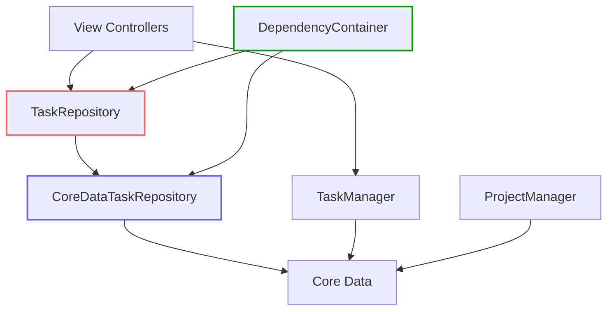
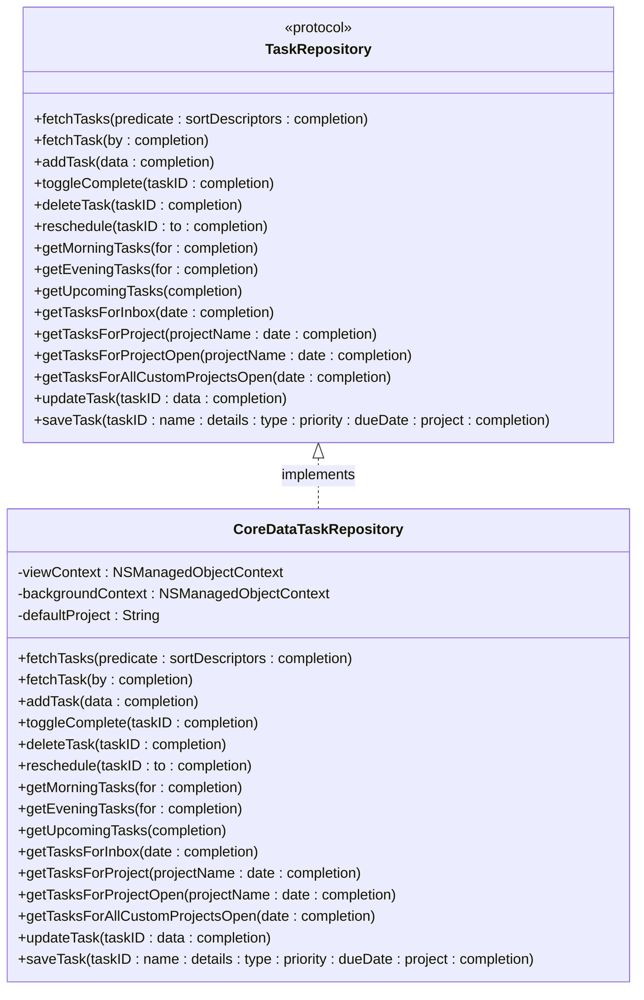
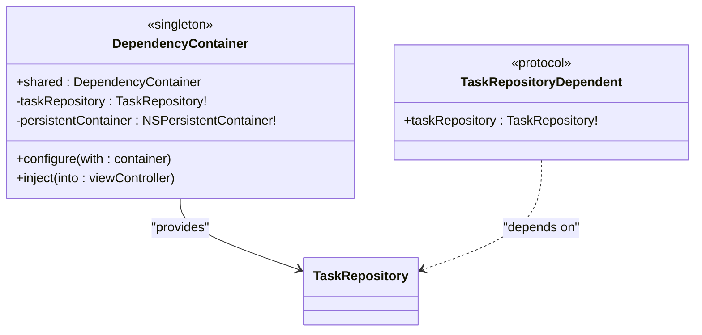
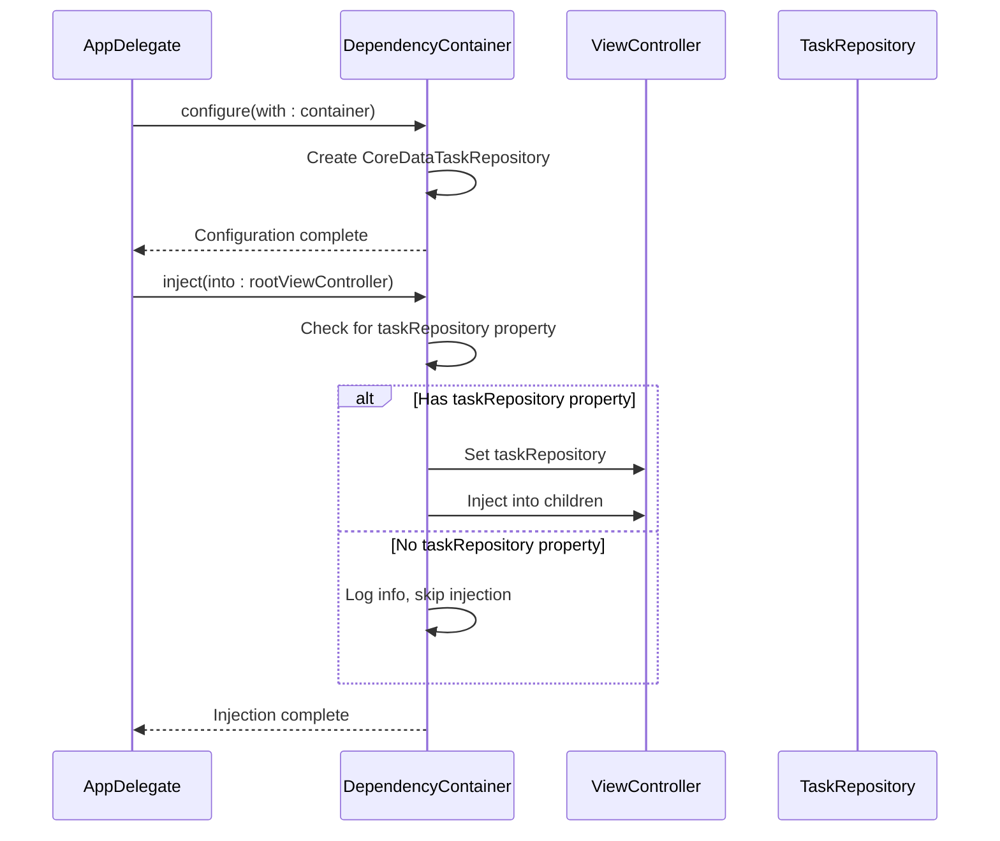
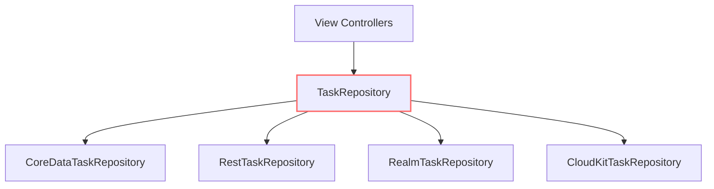
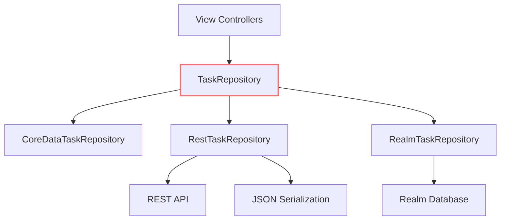
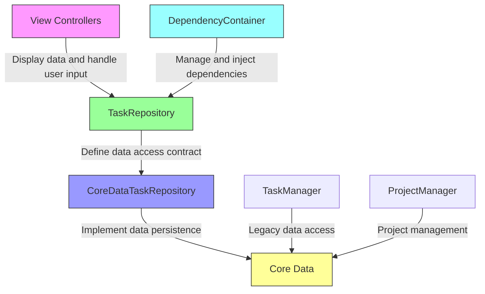
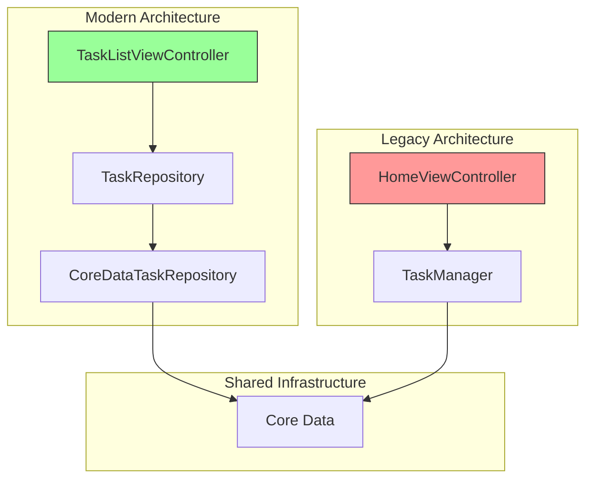

# Repository Pattern and Dependency Injection

<cite>
**Referenced Files in This Document**   
- [TaskRepository.swift](file://To%20Do%20List/Repositories/TaskRepository.swift)
- [CoreDataTaskRepository.swift](file://To%20Do%20List/Repositories/CoreDataTaskRepository.swift)
- [DependencyContainer.swift](file://To%20Do%20List/Managers/DependencyContainer.swift)
- [TaskManager.swift](file://To%20Do%20List/ViewControllers/TaskManager.swift)
- [ProjectManager.swift](file://To%20Do%20List/ViewControllers/ProjectManager.swift)
- [README.md](file://README.md)
</cite>

## Table of Contents
1. [Introduction](#introduction)
2. [Architecture Overview](#architecture-overview)
3. [Core Components](#core-components)
4. [Repository Pattern Implementation](#repository-pattern-implementation)
5. [Dependency Injection System](#dependency-injection-system)
6. [Protocol-Oriented Design Benefits](#protocol-oriented-design-benefits)
7. [Testing and Mocking Strategy](#testing-and-mocking-strategy)
8. [Future Data Source Migration](#future-data-source-migration)
9. [Separation of Concerns](#separation-of-concerns)
10. [Code Examples](#code-examples)

## Introduction
The Tasker application implements a modern repository pattern architecture with dependency injection to improve testability, maintainability, and flexibility. This documentation provides a comprehensive analysis of how the repository pattern is implemented, how dependency injection is used to resolve dependencies, and the benefits of this architectural approach. The system is currently in a hybrid state, transitioning from a legacy singleton-based architecture to a more modular, protocol-driven design.

## Architecture Overview



**Diagram sources**
- [TaskRepository.swift](file://To%20Do%20List/Repositories/TaskRepository.swift)
- [CoreDataTaskRepository.swift](file://To%20Do%20List/Repositories/CoreDataTaskRepository.swift)
- [DependencyContainer.swift](file://To%20Do%20List/Managers/DependencyContainer.swift)

**Section sources**
- [README.md](file://README.md#L974-L985)

## Core Components

The Tasker application's data access architecture consists of several key components that work together to provide a flexible and testable system. The core components include the TaskRepository protocol, CoreDataTaskRepository implementation, and DependencyContainer for dependency management. These components work alongside legacy systems like TaskManager and ProjectManager during the transition period.

**Section sources**
- [TaskRepository.swift](file://To%20Do%20List/Repositories/TaskRepository.swift)
- [CoreDataTaskRepository.swift](file://To%20Do%20List/Repositories/CoreDataTaskRepository.swift)
- [DependencyContainer.swift](file://To%20Do%20List/Managers/DependencyContainer.swift)

## Repository Pattern Implementation

### TaskRepository Protocol

The TaskRepository protocol defines the abstraction boundary for task data access operations. It specifies a comprehensive set of methods for CRUD operations, task retrieval, and state management, enabling loose coupling between consumers and the underlying data storage implementation.



**Diagram sources**
- [TaskRepository.swift](file://To%20Do%20List/Repositories/TaskRepository.swift)
- [CoreDataTaskRepository.swift](file://To%20Do%20List/Repositories/CoreDataTaskRepository.swift)

**Section sources**
- [TaskRepository.swift](file://To%20Do%20List/Repositories/TaskRepository.swift#L1-L117)

### CoreDataTaskRepository Implementation

The CoreDataTaskRepository class provides a concrete implementation of the TaskRepository protocol using Core Data as the persistence mechanism. It leverages both view and background contexts to ensure UI responsiveness while maintaining data consistency.

Key implementation features:
- Uses background context for write operations to prevent UI blocking
- Uses view context for read operations to ensure data consistency
- Implements comprehensive error handling with Result types
- Supports asynchronous operations with completion handlers
- Handles task state changes and notifications

```swift
final class CoreDataTaskRepository: TaskRepository {
    private let viewContext: NSManagedObjectContext
    private let backgroundContext: NSManagedObjectContext
    private let defaultProject: String
    
    init(container: NSPersistentContainer, defaultProject: String = "Inbox") {
        self.viewContext = container.viewContext
        self.backgroundContext = container.newBackgroundContext()
        self.defaultProject = defaultProject
        
        self.viewContext.automaticallyMergesChangesFromParent = true
        self.backgroundContext.mergePolicy = NSMergeByPropertyObjectTrumpMergePolicy
    }
}
```

The implementation uses background contexts for all write operations (add, update, delete, toggle) to ensure the UI remains responsive. After successful operations, it posts notifications to inform the UI of data changes, particularly the "TaskCompletionChanged" notification which triggers chart updates.

**Section sources**
- [CoreDataTaskRepository.swift](file://To%20Do%20List/Repositories/CoreDataTaskRepository.swift#L1-L455)

## Dependency Injection System

### DependencyContainer Implementation

The DependencyContainer class serves as a service locator and dependency injector for the application. It follows the singleton pattern to provide a centralized point for managing and distributing dependencies across view controllers.



**Diagram sources**
- [DependencyContainer.swift](file://To%20Do%20List/Managers/DependencyContainer.swift)

**Section sources**
- [DependencyContainer.swift](file://To%20Do%20List/Managers/DependencyContainer.swift#L1-L81)

The DependencyContainer is configured during application initialization with the Core Data persistent container, which it uses to instantiate the CoreDataTaskRepository. It then provides this repository to view controllers through the inject method, which uses reflection to identify and populate the taskRepository property.

```swift
func configure(with container: NSPersistentContainer) {
    print("🔧 DependencyContainer: Starting configuration...")
    self.persistentContainer = container
    self.taskRepository = CoreDataTaskRepository(container: container)
    print("✅ DependencyContainer: Configuration completed successfully")
}
```

### Dependency Injection Process

The dependency injection process follows a specific flow to ensure all view controllers receive the necessary dependencies:



**Diagram sources**
- [DependencyContainer.swift](file://To%20Do%20List/Managers/DependencyContainer.swift)

**Section sources**
- [DependencyContainer.swift](file://To%20Do%20List/Managers/DependencyContainer.swift#L40-L80)

The injection process uses Swift's reflection capabilities to check if a view controller has a taskRepository property. If the property exists and the view controller conforms to the TaskRepositoryDependent protocol, the container injects the task repository instance. This approach allows for gradual migration of view controllers to the new architecture without requiring immediate changes to all components.

## Protocol-Oriented Design Benefits

### Testability

The protocol-oriented design significantly improves testability by enabling easy mocking of dependencies. View controllers depend on the TaskRepository protocol rather than a concrete implementation, allowing for the injection of mock repositories during testing.

```swift
class MockTaskRepository: TaskRepository {
    var fetchTasksCalled = false
    var addTaskCalled = false
    var tasksToReturn: [TaskData] = []
    
    func fetchTasks(predicate: NSPredicate?, sortDescriptors: [NSSortDescriptor]?, completion: @escaping ([TaskData]) -> Void) {
        fetchTasksCalled = true
        completion(tasksToReturn)
    }
    
    func addTask(data: TaskData, completion: ((Result<NTask, Error>) -> Void)?) {
        addTaskCalled = true
        let managedTask = NTask(context: NSManagedObjectContext(concurrencyType: .mainQueueConcurrencyType))
        completion?(.success(managedTask))
    }
}
```

This approach allows for comprehensive unit testing of view controllers without requiring a real Core Data stack, leading to faster and more reliable tests.

### Backend Interchangeability

The repository pattern enables backend interchangeability by abstracting the data access layer behind a protocol. This means the application can potentially switch to alternative data sources without requiring changes to the view controllers or business logic.



**Diagram sources**
- [TaskRepository.swift](file://To%20Do%20List/Repositories/TaskRepository.swift)

**Section sources**
- [README.md](file://README.md#L974-L985)

The TaskRepository protocol defines a contract that any data source implementation must fulfill, allowing for seamless substitution of different storage mechanisms based on requirements or performance considerations.

## Testing and Mocking Strategy

### Unit Testing with Mock Repositories

The repository pattern facilitates unit testing by allowing the injection of mock repositories that simulate data access behavior without relying on actual data storage.

```swift
func testHomeViewControllerLoadsTasks() {
    // Given
    let mockRepository = MockTaskRepository()
    mockRepository.tasksToReturn = [TaskData(name: "Test Task", type: .morning, priority: .medium)]
    
    let viewController = HomeViewController()
    viewController.taskRepository = mockRepository
    
    // When
    viewController.viewDidLoad()
    
    // Then
    XCTAssertTrue(mockRepository.fetchTasksCalled)
    XCTAssertEqual(viewController.tableView.numberOfRows(inSection: 0), 1)
}
```

This testing approach isolates the view controller's behavior from the data access layer, ensuring that tests focus on the controller's logic rather than data persistence concerns.

### Integration Testing

For integration testing, the actual CoreDataTaskRepository can be used with an in-memory Core Data store to test the complete data access flow while maintaining test speed and isolation.

```swift
func testCoreDataTaskRepositoryAddsTask() {
    // Given
    let container = NSPersistentContainer(name: "TestModel")
    container.persistentStoreDescriptions.first?.url = URL(fileURLWithPath: "/dev/null")
    container.loadPersistentStores { _, error in
        if let error = error {
            XCTFail("Failed to load store: \(error)")
        }
    }
    
    let repository = CoreDataTaskRepository(container: container)
    let taskData = TaskData(name: "Integration Test", type: .morning, priority: .high)
    
    // When
    let expectation = self.expectation(description: "Add task")
    repository.addTask(data: taskData) { result in
        switch result {
        case .success:
            expectation.fulfill()
        case .failure(let error):
            XCTFail("Failed to add task: \(error)")
        }
    }
    
    // Then
    waitForExpectations(timeout: 1.0)
}
```

**Section sources**
- [CoreDataTaskRepository.swift](file://To%20Do%20List/Repositories/CoreDataTaskRepository.swift)
- [TaskRepository.swift](file://To%20Do%20List/Repositories/TaskRepository.swift)

## Future Data Source Migration

### Migration to Alternative Data Sources

The repository pattern is designed to support future migration to alternative data sources such as REST APIs or Realm. The protocol abstraction allows for the creation of new implementations that can be seamlessly integrated into the existing architecture.



**Diagram sources**
- [TaskRepository.swift](file://To%20Do%20List/Repositories/TaskRepository.swift)

**Section sources**
- [README.md](file://README.md#L270-L280)

To migrate to a REST API backend, a new RestTaskRepository class would be created that implements the TaskRepository protocol. This implementation would handle HTTP requests, JSON serialization, and API authentication while presenting the same interface to the rest of the application.

### Project Repository Implementation

As indicated in the roadmap, a ProjectRepository is planned to replace the current string-based project lookups in managers. This will provide similar benefits of abstraction and testability for project data access.

```swift
protocol ProjectRepository {
    func fetchProjects(completion: @escaping ([ProjectData]) -> Void)
    func createProject(data: ProjectData, completion: (Result<Projects, Error>) -> Void)
    func deleteProject(id: NSManagedObjectID, completion: (Result<Void, Error>) -> Void)
    func updateProject(id: NSManagedObjectID, data: ProjectData, completion: (Result<Void, Error>) -> Void)
}
```

This implementation would follow the same patterns as the TaskRepository, using protocols for abstraction and dependency injection for resolution.

## Separation of Concerns

### Component Responsibilities

The repository pattern enforces a clear separation of concerns between different components in the application architecture.



**Diagram sources**
- [TaskRepository.swift](file://To%20Do%20List/Repositories/TaskRepository.swift)
- [CoreDataTaskRepository.swift](file://To%20Do%20List/Repositories/CoreDataTaskRepository.swift)
- [DependencyContainer.swift](file://To%20Do%20List/Managers/DependencyContainer.swift)

**Section sources**
- [README.md](file://README.md#L974-L985)

View controllers are responsible for displaying data and handling user interactions, but they no longer contain data access logic. The TaskRepository protocol defines the contract for data access, while the CoreDataTaskRepository handles the actual implementation details. The DependencyContainer manages the creation and distribution of dependencies, ensuring that components are properly connected without tight coupling.

### Legacy vs. Modern Architecture

The application is currently in a hybrid state, with some components using the modern repository pattern while others still rely on the legacy TaskManager singleton.



**Diagram sources**
- [README.md](file://README.md#L974-L985)

This transitional state allows for incremental migration of components to the new architecture without requiring a complete rewrite. The roadmap indicates that the HomeViewController and AddTaskViewController are next in line for migration to the repository pattern.

## Code Examples

### Protocol Definition

```swift
/// Protocol defining the contract for any task repository implementation
/// This allows for dependency injection and makes the code testable by providing
/// a way to mock the repository in tests
protocol TaskRepository {
    /// Fetches tasks based on the provided predicate and sort descriptors
    /// - Parameters:
    ///   - predicate: Optional predicate to filter the tasks
    ///   - sortDescriptors: Optional sort descriptors to sort the tasks
    ///   - completion: Completion handler that receives the fetched tasks
    func fetchTasks(predicate: NSPredicate?, 
                   sortDescriptors: [NSSortDescriptor]?, 
                   completion: @escaping ([TaskData]) -> Void)
    
    /// Adds a new task to the repository
    /// - Parameters:
    ///   - data: The task data to add
    ///   - completion: Optional completion handler that receives the result
    func addTask(data: TaskData, completion: ((Result<NTask, Error>) -> Void)?)
    
    /// Toggles the completion status of a task
    /// - Parameters:
    ///   - taskID: The ID of the task to toggle
    ///   - completion: Optional completion handler that receives the result
    func toggleComplete(taskID: NSManagedObjectID, completion: ((Result<Void, Error>) -> Void)?)
}
```

### Dependency Injection in View Controller

```swift
class TaskListViewController: UIViewController, TaskRepositoryDependent {
    var taskRepository: TaskRepository!
    private var tasks: [TaskData] = []
    
    override func viewDidLoad() {
        super.viewDidLoad()
        loadTasks()
    }
    
    private func loadTasks() {
        taskRepository.fetchTasks(
            predicate: nil,
            sortDescriptors: [NSSortDescriptor(key: "dueDate", ascending: true)]
        ) { [weak self] tasks in
            self?.tasks = tasks
            self?.tableView.reloadData()
        }
    }
}
```

### DependencyContainer Usage

```swift
// In AppDelegate
func application(_ application: UIApplication, didFinishLaunchingWithOptions launchOptions: [UIApplication.LaunchOptionsKey: Any]?) -> Bool {
    
    // Configure the dependency container with the persistent container
    guard let container = (window?.rootViewController as? UINavigationController)?.topViewController as? NSPersistentContainer else {
        fatalError("Application root view controller must be a container")
    }
    
    DependencyContainer.shared.configure(with: container)
    
    // Inject dependencies into the root view controller and its children
    if let rootVC = window?.rootViewController {
        DependencyContainer.shared.inject(into: rootVC)
    }
    
    return true
}
```

**Section sources**
- [TaskRepository.swift](file://To%20Do%20List/Repositories/TaskRepository.swift#L1-L117)
- [CoreDataTaskRepository.swift](file://To%20Do%20List/Repositories/CoreDataTaskRepository.swift#L1-L455)
- [DependencyContainer.swift](file://To%20Do%20List/Managers/DependencyContainer.swift#L1-L81)