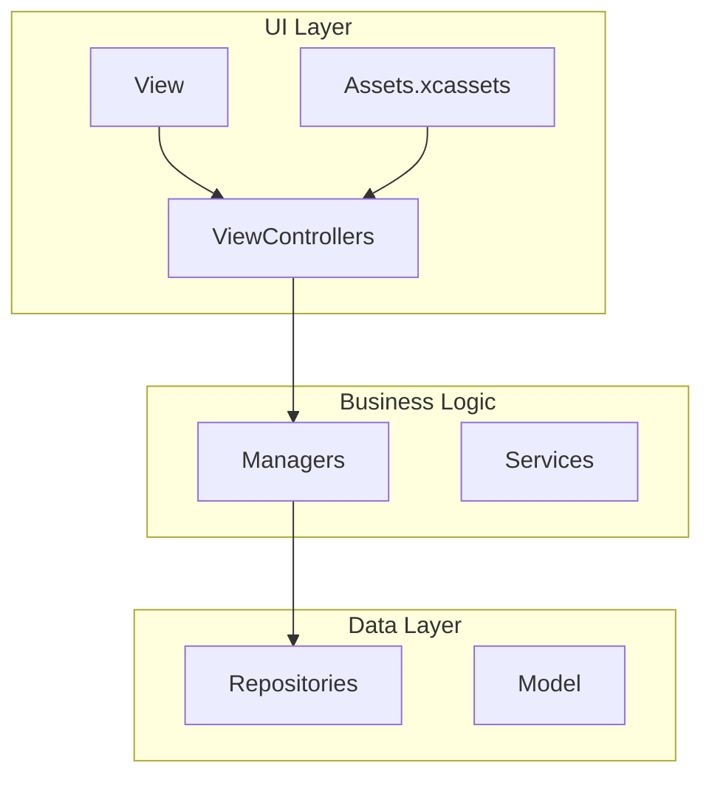
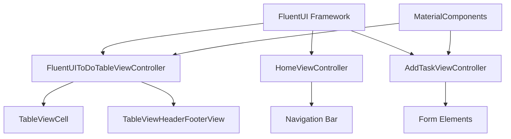
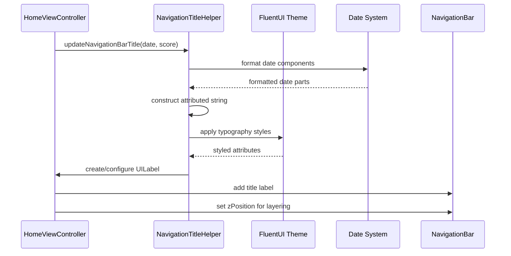
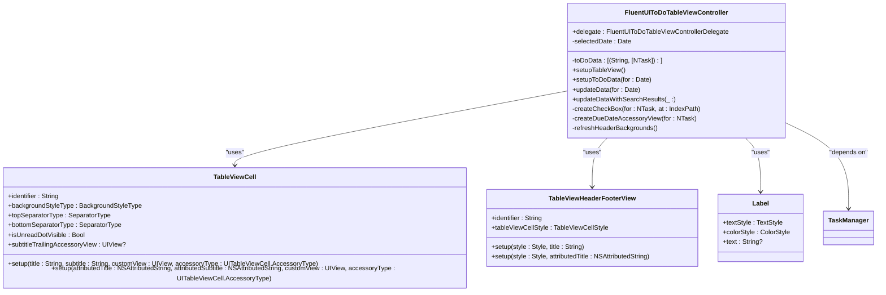
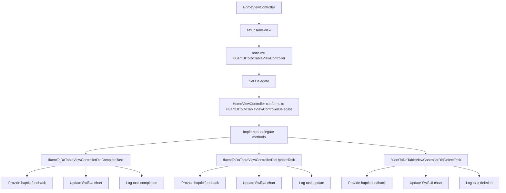
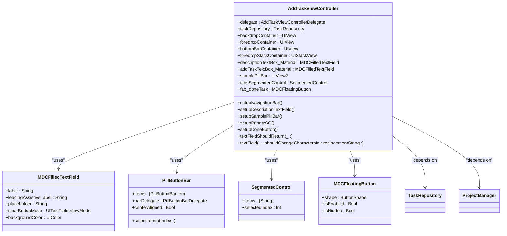
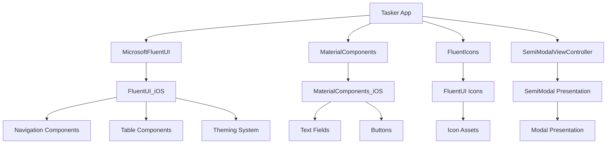

# FluentUI Components

<cite>
**Referenced Files in This Document**   
- [Podfile](file://Podfile)
- [HomeViewController+NavigationBarTitle.swift](file://To%20Do%20List/ViewControllers/HomeViewController+NavigationBarTitle.swift)
- [HomeViewController+FluentUIDelegate.swift](file://To%20Do%20List/ViewControllers/HomeViewController+FluentUIDelegate.swift)
- [AddTaskViewController.swift](file://To%20Do%20List/ViewControllers/AddTaskViewController.swift)
- [FluentUIToDoTableViewController.swift](file://To%20Do%20List/ViewControllers/FluentUIToDoTableViewController.swift)
- [UIViewController+Navigation.swift](file://Pods/MicrosoftFluentUI/Sources/FluentUI_iOS/Components/Navigation/UIViewController+Navigation.swift)
</cite>

## Table of Contents
1. [Introduction](#introduction)
2. [Project Structure](#project-structure)
3. [Core Components](#core-components)
4. [Architecture Overview](#architecture-overview)
5. [Detailed Component Analysis](#detailed-component-analysis)
6. [Dependency Analysis](#dependency-analysis)
7. [Performance Considerations](#performance-considerations)
8. [Troubleshooting Guide](#troubleshooting-guide)
9. [Conclusion](#conclusion)

## Introduction
This document details the implementation and integration of Microsoft FluentUI components within the Tasker iOS application. It focuses on how FluentUI is used to standardize navigation, interface elements, and user interactions across view controllers, particularly in HomeViewController and AddTaskViewController. The documentation covers component initialization, theming, delegation patterns, and alignment with iOS Human Interface Guidelines. It also discusses the benefits of design consistency, developer productivity impacts, and compatibility with accessibility features like dynamic font scaling and dark mode.

## Project Structure
The Tasker application follows a feature-based organization with clear separation between UI components, business logic, and data management layers. FluentUI integration is primarily concentrated in the ViewControllers directory, with supporting assets in the Assets.xcassets catalog.

**Diagram sources**
- [README.md](file://README.md#L1449-L1500)

**Section sources**
- [README.md](file://README.md#L1449-L1500)

## Core Components
The core FluentUI components in Tasker include standardized navigation bars, table views with consistent styling, and modal presentation patterns. These components are implemented through FluentUIToDoTableViewController, which extends UITableView with FluentUI styling, and integration with HomeViewController and AddTaskViewController for consistent interface elements.

**Section sources**
- [FluentUIToDoTableViewController.swift](file://To%20Do%20List/ViewControllers/FluentUIToDoTableViewController.swift#L0-L799)
- [HomeViewController+NavigationBarTitle.swift](file://To%20Do%20List/ViewControllers/HomeViewController+NavigationBarTitle.swift#L0-L167)

## Architecture Overview
FluentUI components are integrated throughout the Tasker application to provide a consistent user experience. The architecture leverages FluentUI's theming system, navigation patterns, and UI components to create a cohesive interface across different view controllers.

**Diagram sources**
- [FluentUIToDoTableViewController.swift](file://To%20Do%20List/ViewControllers/FluentUIToDoTableViewController.swift#L0-L799)
- [AddTaskViewController.swift](file://To%20Do%20List/ViewControllers/AddTaskViewController.swift#L0-L517)

## Detailed Component Analysis

### Navigation and Interface Standardization
FluentUI is used to implement consistent navigation and interface elements across Tasker's view controllers. The integration ensures standardized appearance and behavior for navigation bars, buttons, and gesture recognizers, aligning with both Fluent Design principles and iOS Human Interface Guidelines.

#### Navigation Bar Implementation
The navigation system in Tasker leverages FluentUI's navigation capabilities to create a consistent experience across view controllers. The HomeViewController implements a custom navigation title that combines date information with daily score metrics, while maintaining FluentUI styling.

**Diagram sources**
- [HomeViewController+NavigationBarTitle.swift](file://To%20Do%20List/ViewControllers/HomeViewController+NavigationBarTitle.swift#L0-L167)

**Section sources**
- [HomeViewController+NavigationBarTitle.swift](file://To%20Do%20List/ViewControllers/HomeViewController+NavigationBarTitle.swift#L0-L167)

#### Table View and Cell Styling
The FluentUIToDoTableViewController implements FluentUI components for standardized table presentation, including themed cells, headers, and interactive elements. This ensures consistent visual treatment of task data across the application.

**Diagram sources**
- [FluentUIToDoTableViewController.swift](file://To%20Do%20List/ViewControllers/FluentUIToDoTableViewController.swift#L0-L799)

**Section sources**
- [FluentUIToDoTableViewController.swift](file://To%20Do%20List/ViewControllers/FluentUIToDoTableViewController.swift#L0-L799)

### HomeViewController Integration
The HomeViewController integrates FluentUI components to create a consistent navigation experience and standardized interface elements. This includes custom navigation bar styling and delegation patterns for task management.

**Diagram sources**
- [HomeViewController+FluentUIDelegate.swift](file://To%20Do%20List/ViewControllers/HomeViewController+FluentUIDelegate.swift#L0-L106)

**Section sources**
- [HomeViewController+FluentUIDelegate.swift](file://To%20Do%20List/ViewControllers/HomeViewController+FluentUIDelegate.swift#L0-L106)

### AddTaskViewController Implementation
The AddTaskViewController demonstrates FluentUI integration with form elements and navigation controls, combining FluentUI components with Material Components for iOS to create a cohesive interface.

**Diagram sources**
- [AddTaskViewController.swift](file://To%20Do%20List/ViewControllers/AddTaskViewController.swift#L0-L517)

**Section sources**
- [AddTaskViewController.swift](file://To%20Do%20List/ViewControllers/AddTaskViewController.swift#L0-L517)

## Dependency Analysis
The FluentUI integration in Tasker is managed through CocoaPods, with explicit versioning to ensure compatibility and stability across development teams.

**Diagram sources**
- [Podfile](file://Podfile#L0-L39)

**Section sources**
- [Podfile](file://Podfile#L0-L39)

## Performance Considerations
The FluentUI implementation in Tasker considers performance implications of component rendering, particularly in table views with dynamic data. The architecture employs several optimization strategies to maintain smooth scrolling and responsive interactions.

The FluentUIToDoTableViewController uses efficient cell reconfiguration patterns that minimize layout recalculations during task state changes. Instead of reloading entire sections, the implementation reconfigures individual cells using the reconfigureCell(at:) method, which updates only the necessary visual elements.

Theming is applied consistently through the fluentTheme property, avoiding redundant theme lookups during cell configuration. The navigation bar title implementation in HomeViewController+NavigationBarTitle.swift uses attributed strings with pre-configured font styles rather than applying styles individually, reducing text rendering overhead.

For accessibility, the implementation supports dynamic font scaling through FluentUI's typography system, which automatically adjusts text sizes based on user preferences. Dark mode compatibility is maintained through FluentUI's color system, which provides appropriate color variants based on the current interface style.

## Troubleshooting Guide
When encountering issues with FluentUI components in Tasker, consider the following common problems and solutions:

**Section sources**
- [FluentUIToDoTableViewController.swift](file://To%20Do%20List/ViewControllers/FluentUIToDoTableViewController.swift#L0-L799)
- [HomeViewController+NavigationBarTitle.swift](file://To%20Do%20List/ViewControllers/HomeViewController+NavigationBarTitle.swift#L0-L167)
- [AddTaskViewController.swift](file://To%20Do%20List/ViewControllers/AddTaskViewController.swift#L0-L517)

## Conclusion
The integration of FluentUI in Tasker provides a consistent, professional interface across all view controllers. By leveraging FluentUI components for navigation, table views, and form elements, the application achieves design consistency that enhances user experience and developer productivity. The implementation aligns with iOS Human Interface Guidelines while incorporating Fluent Design principles, creating a cohesive interface that supports accessibility features like dynamic font scaling and dark mode. The delegation patterns between view controllers ensure proper separation of concerns, while the CocoaPods-based dependency management guarantees version consistency across development environments.