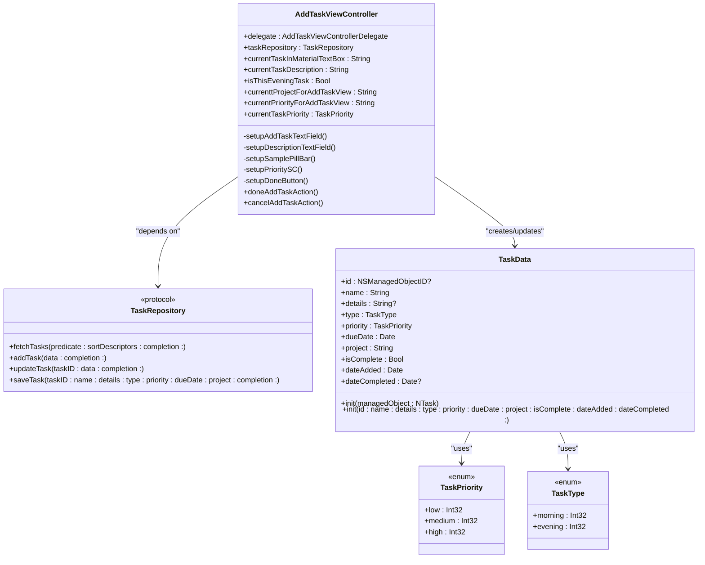
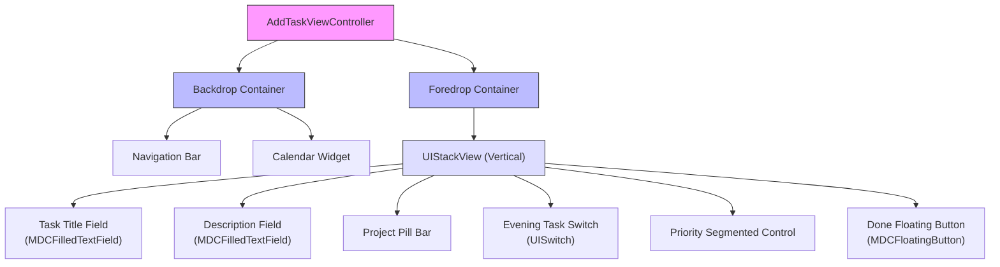
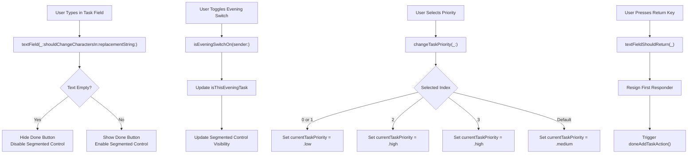
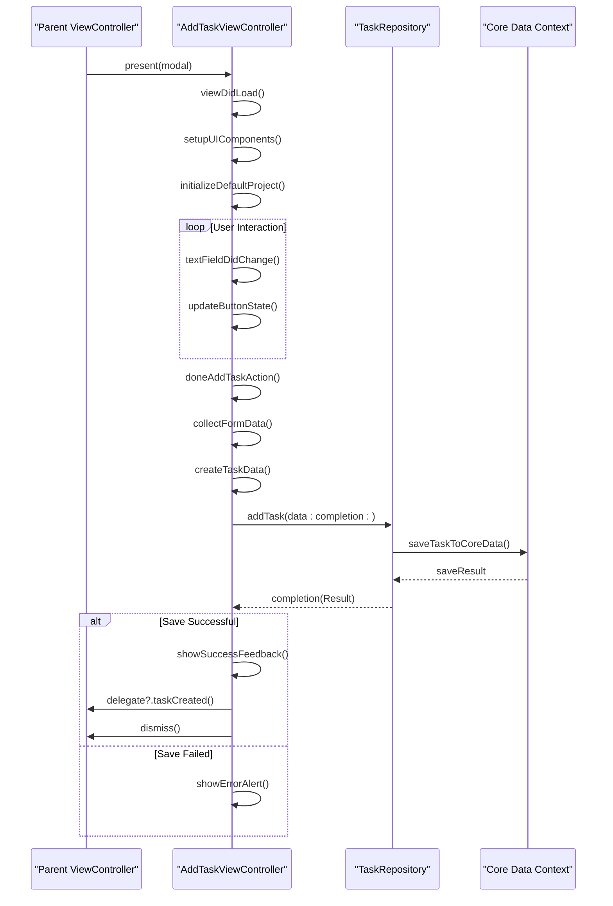

# AddTaskViewController

<cite>
**Referenced Files in This Document**   
- [AddTaskViewController.swift](file://To%20Do%20List/ViewControllers/AddTaskViewController.swift#L1-L518)
- [AddTaskForedropView.swift](file://To%20Do%20List/View/AddTaskForedropView.swift#L1-L212)
- [TaskRepository.swift](file://To%20Do%20List/Repositories/TaskRepository.swift#L1-L118)
- [TaskData.swift](file://To%20Do%20List/Models/TaskData.swift#L1-L57)
- [NTask+Extensions.swift](file://To%20Do%20List/NTask+Extensions.swift#L1-L76)
- [TaskManager.swift](file://To%20Do%20List/ViewControllers/TaskManager.swift#L10-L209)
</cite>

## Table of Contents
1. [Introduction](#introduction)
2. [Core Architecture and Dependencies](#core-architecture-and-dependencies)
3. [UI Components and Layout Structure](#ui-components-and-layout-structure)
4. [Form Input and Validation Logic](#form-input-and-validation-logic)
5. [Task Creation and Editing Workflow](#task-creation-and-editing-workflow)
6. [Data Binding and Model Integration](#data-binding-and-model-integration)
7. [Error Handling and User Feedback](#error-handling-and-user-feedback)
8. [Accessibility and User Experience](#accessibility-and-user-experience)
9. [Best Practices and Design Patterns](#best-practices-and-design-patterns)

## Introduction

The AddTaskViewController is a modal view controller responsible for managing the creation and editing of tasks within the Tasker application. It provides a form-based interface that allows users to input task details including title, description, priority, project assignment, and time categorization (morning/evening). The controller follows a clean architectural pattern with separation of concerns, utilizing dependency injection for the TaskRepository to handle data persistence through Core Data. The interface employs a backdrop/foredrop design pattern for visual hierarchy and uses Material Design components for consistent UI elements. This documentation provides a comprehensive analysis of its implementation, focusing on its modal presentation, input validation, integration with data models, and user interaction patterns.

## Core Architecture and Dependencies

The AddTaskViewController implements a dependency-injected architecture that separates concerns between presentation logic and data management. It conforms to the TaskRepositoryDependent protocol, requiring injection of a TaskRepository instance for data persistence operations. The controller maintains a weak delegate reference to communicate state changes back to its presenting view controller. It leverages Core Data through the repository pattern, ensuring testability and separation from direct managed object context manipulation. The architecture follows a layered approach where UI events trigger updates to in-memory state, which are then persisted through the repository. This design enables easy mocking of dependencies for unit testing and promotes reusability across different presentation contexts.



**Diagram sources**
- [AddTaskViewController.swift](file://To%20Do%20List/ViewControllers/AddTaskViewController.swift#L1-L518)
- [TaskRepository.swift](file://To%20Do%20List/Repositories/TaskRepository.swift#L1-L118)
- [TaskData.swift](file://To%20Do%20List/Models/TaskData.swift#L1-L57)
- [TaskManager.swift](file://To%20Do%20List/ViewControllers/TaskManager.swift#L10-L209)

**Section sources**
- [AddTaskViewController.swift](file://To%20Do%20List/ViewControllers/AddTaskViewController.swift#L1-L518)
- [TaskRepository.swift](file://To%20Do%20List/Repositories/TaskRepository.swift#L1-L118)

## UI Components and Layout Structure

The AddTaskViewController employs a structured layout using UIStackView for vertical arrangement of form elements within a foredrop container. The interface utilizes Material Design components from the MaterialComponents framework, specifically MDCFilledTextField for text input fields. The layout consists of a task title field, description text area, project selection pill bar, priority segmented control, evening task switch, and a floating action button for completion. These components are arranged in a logical order within a UIStackView with consistent spacing and margins. The backdrop container displays a calendar widget and navigation elements, creating a layered visual effect. The pill bar for project selection is dynamically populated from ProjectManager.sharedInstance.displayedProjects, ensuring consistency with the application's project system. The floating action button (fab_doneTask) serves as the primary action button, with its visibility and state tied to the validity of the task title input.



**Diagram sources**
- [AddTaskViewController.swift](file://To%20Do%20List/ViewControllers/AddTaskViewController.swift#L1-L518)
- [AddTaskForedropView.swift](file://To%20Do%20List/View/AddTaskForedropView.swift#L1-L212)

**Section sources**
- [AddTaskViewController.swift](file://To%20Do%20List/ViewControllers/AddTaskViewController.swift#L1-L518)
- [AddTaskForedropView.swift](file://To%20Do%20List/View/AddTaskForedropView.swift#L1-L212)

## Form Input and Validation Logic

The AddTaskViewController implements real-time input validation through the UITextFieldDelegate protocol, specifically using the textField(_:shouldChangeCharactersIn:replacementString:) method. Validation is primarily focused on the task title field, where the Done button's visibility and enabled state are directly tied to whether the title field contains text. As the user types, the controller updates the currentTaskInMaterialTextBox property and immediately shows or hides the fab_doneTask button based on input emptiness. The description field is optional and does not affect form validity. The evening task switch controls both the task type and the visibility of the priority segmented control, creating a contextual interface. The priority selection uses a SegmentedControl with options "None", "Low", "High", and "Max" (representing highest), mapping these selections to TaskPriority enum values. The controller also implements textFieldShouldReturn(_:) to allow form submission via the keyboard return key, enhancing keyboard navigation efficiency.



**Diagram sources**
- [AddTaskViewController.swift](file://To%20Do%20List/ViewControllers/AddTaskViewController.swift#L1-L518)
- [AddTaskForedropView.swift](file://To%20Do%20List/View/AddTaskForedropView.swift#L1-L212)

**Section sources**
- [AddTaskViewController.swift](file://To%20Do%20List/ViewControllers/AddTaskViewController.swift#L1-L518)
- [AddTaskForedropView.swift](file://To%20Do%20List/View/AddTaskForedropView.swift#L1-L212)

## Task Creation and Editing Workflow

The AddTaskViewController supports both new task creation and existing task editing through a unified interface, with the mode determined by the presence of an existing task ID. The workflow begins with modal presentation from a parent view controller, typically triggered by a user action such as tapping an "Add" button. During viewDidLoad and viewWillAppear, the controller sets up its UI components and initializes the default project to "Inbox". The user interacts with the form elements to specify task details, with real-time validation ensuring the task title is not empty before enabling submission. When the user taps the Done button or presses return on the keyboard, the doneAddTaskAction() method is invoked, which collects all form data and creates a TaskData instance. This data object is then passed to the TaskRepository's addTask method for persistence. Upon successful save, the controller notifies its delegate and dismisses itself. The same interface can be used for editing by pre-populating fields with existing task data, though this specific implementation focuses primarily on creation.



**Diagram sources**
- [AddTaskViewController.swift](file://To%20Do%20List/ViewControllers/AddTaskViewController.swift#L1-L518)
- [TaskRepository.swift](file://To%20Do%20List/Repositories/TaskRepository.swift#L1-L118)
- [TaskData.swift](file://To%20Do%20List/Models/TaskData.swift#L1-L57)

**Section sources**
- [AddTaskViewController.swift](file://To%20Do%20List/ViewControllers/AddTaskViewController.swift#L1-L518)
- [TaskRepository.swift](file://To%20Do%20List/Repositories/TaskRepository.swift#L1-L118)

## Data Binding and Model Integration

The AddTaskViewController implements a manual data binding pattern between its UI components and the underlying TaskData model. Form inputs are synchronized with in-memory properties such as currentTaskInMaterialTextBox, currentTaskDescription, currenttProjectForAddTaskView, and currentTaskPriority. These properties serve as the single source of truth for form state and are updated in real-time through UITextFieldDelegate methods and control event handlers. When the user submits the form, these properties are used to construct a TaskData instance that encapsulates all task attributes. The TaskData struct acts as a presentation-layer model that abstracts Core Data implementation details, providing type-safe access to task properties through enums like TaskPriority and TaskType. This model is then passed to the TaskRepository for persistence. The integration with Core Data is indirect, with the repository handling the conversion between TaskData and NTask managed objects, maintaining separation between the UI layer and data persistence concerns.

```mermaid
erDiagram
TASKDATA {
NSManagedObjectID? id
String name
String? details
TaskType type
TaskPriority priority
Date dueDate
String project
Bool isComplete
Date dateAdded
Date? dateCompleted
}
TASKPRIORITY {
Int32 low
Int32 medium
Int32 high
}
TASKTYPE {
Int32 morning
Int32 evening
}
TASKDATA }|--|| TASKPRIORITY : "has"
TASKDATA }|--|| TASKTYPE : "has"
class AddTaskViewController {
String currentTaskInMaterialTextBox
String currentTaskDescription
String currenttProjectForAddTaskView
TaskPriority currentTaskPriority
Bool isThisEveningTask
}
AddTaskViewController ..> TASKDATA : "constructs"
AddTaskViewController --> MDCFilledTextField : "binds title"
AddTaskViewController --> MDCFilledTextField : "binds description"
AddTaskViewController --> PillButtonBar : "binds project"
AddTaskViewController --> UISwitch : "binds evening"
AddTaskViewController --> SegmentedControl : "binds priority"
```

**Diagram sources**
- [AddTaskViewController.swift](file://To%20Do%20List/ViewControllers/AddTaskViewController.swift#L1-L518)
- [TaskData.swift](file://To%20Do%20List/Models/TaskData.swift#L1-L57)
- [NTask+Extensions.swift](file://To%20Do%20List/NTask+Extensions.swift#L1-L76)

**Section sources**
- [AddTaskViewController.swift](file://To%20Do%20List/ViewControllers/AddTaskViewController.swift#L1-L518)
- [TaskData.swift](file://To%20Do%20List/Models/TaskData.swift#L1-L57)

## Error Handling and User Feedback

The AddTaskViewController implements defensive programming practices to handle potential errors in dependency injection and user input. During viewDidLoad and viewWillAppear, the controller includes diagnostic logging to verify that the TaskRepository dependency has been properly injected, with fallback injection attempted if the repository is nil. This prevents crashes due to missing dependencies while providing visibility into initialization issues. For user feedback, the controller uses visual cues rather than explicit error messages - the Done button remains hidden until a task title is entered, providing immediate feedback on form validity. The implementation includes comprehensive logging throughout the workflow, with descriptive console messages for key events such as view loading, button actions, and state changes. While the current implementation does not show explicit error alerts for save failures, the TaskRepository protocol includes Result-based completion handlers that could be used to display error messages to users in future enhancements. The delegate pattern allows the presenting controller to respond to both success and failure scenarios appropriately.

**Section sources**
- [AddTaskViewController.swift](file://To%20Do%20List/ViewControllers/AddTaskViewController.swift#L1-L518)
- [TaskRepository.swift](file://To%20Do%20List/Repositories/TaskRepository.swift#L1-L118)

## Accessibility and User Experience

The AddTaskViewController incorporates several features to enhance accessibility and user experience. The interface follows a logical tab order with the task title field automatically becoming first responder upon presentation, reducing the number of taps required to begin input. Keyboard navigation is supported through the return key functionality, which triggers form submission when the title field is active. The use of Material Design components ensures consistent touch targets and visual feedback. The pill bar for project selection provides large, tappable areas for project selection, improving usability on mobile devices. Dynamic type is supported through the use of system fonts and proper constraints, allowing the interface to adapt to user text size preferences. The layered backdrop/foredrop design creates visual hierarchy, focusing attention on the form elements while maintaining context with the calendar view in the background. The floating action button follows Material Design guidelines for placement and size, making it easily reachable with a thumb in one-handed use scenarios.

**Section sources**
- [AddTaskViewController.swift](file://To%20Do%20List/ViewControllers/AddTaskViewController.swift#L1-L518)
- [AddTaskForedropView.swift](file://To%20Do%20List/View/AddTaskForedropView.swift#L1-L212)

## Best Practices and Design Patterns

The AddTaskViewController exemplifies several iOS development best practices and design patterns. It follows the Single Responsibility Principle by focusing exclusively on task creation/editing functionality. The dependency injection pattern is used for the TaskRepository, promoting testability and loose coupling. The repository pattern abstracts data access, separating UI concerns from persistence logic. The controller uses a protocol (TaskRepositoryDependent) to define its dependency requirements, enabling flexible composition. The code is organized using extensions to group related functionality, such as UI setup methods in the AddTaskForedropView extension. Enum-based types (TaskPriority, TaskType) ensure type-safe input selection and prevent invalid states. The implementation follows Apple's Human Interface Guidelines for modal presentations and form design. The use of auto layout with proper constraints ensures adaptability across different device sizes and orientations. The fallback dependency injection in viewWillAppear demonstrates defensive programming to handle edge cases in the application lifecycle.

**Section sources**
- [AddTaskViewController.swift](file://To%20Do%20List/ViewControllers/AddTaskViewController.swift#L1-L518)
- [TaskRepository.swift](file://To%20Do%20List/Repositories/TaskRepository.swift#L1-L118)
- [TaskData.swift](file://To%20Do%20List/Models/TaskData.swift#L1-L57)
- [TaskManager.swift](file://To%20Do%20List/ViewControllers/TaskManager.swift#L10-L209)