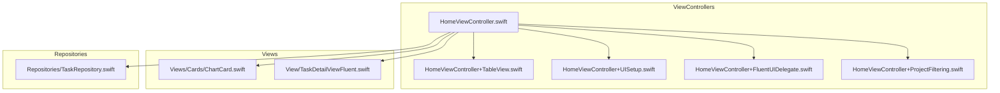
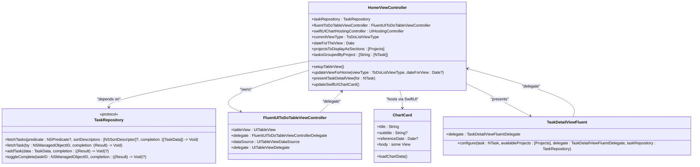
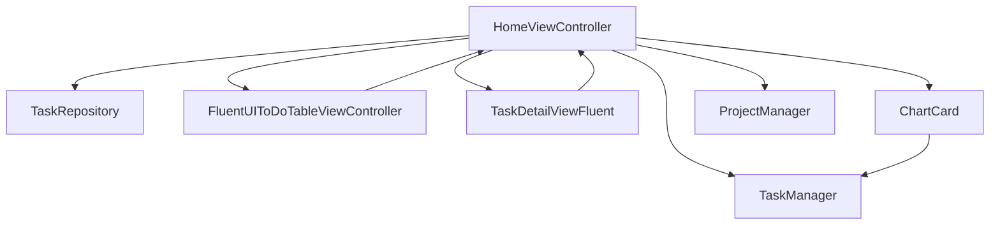

# HomeViewController

<cite>
**Referenced Files in This Document**   
- [HomeViewController.swift](file://To%20Do%20List/ViewControllers/HomeViewController.swift)
- [HomeViewController+TableView.swift](file://To%20Do%20List/ViewControllers/HomeViewController+TableView.swift)
- [HomeViewController+UISetup.swift](file://To%20Do%20List/ViewControllers/HomeViewController+UISetup.swift)
- [HomeViewController+FluentUIDelegate.swift](file://To%20Do%20List/ViewControllers/HomeViewController+FluentUIDelegate.swift)
- [HomeViewController+ProjectFiltering.swift](file://To%20Do%20List/ViewControllers/HomeViewController+ProjectFiltering.swift)
- [HomeViewController+NavigationBarTitle.swift](file://To%20Do%20List/ViewControllers/HomeViewController+NavigationBarTitle.swift)
- [HomeViewController+Animations.swift](file://To%20Do%20List/ViewControllers/HomeViewController+Animations.swift)
- [ChartCard.swift](file://To%20Do%20List/Views/Cards/ChartCard.swift)
- [TaskRepository.swift](file://To%20Do%20List/Repositories/TaskRepository.swift)
- [TaskDetailViewFluent.swift](file://To%20Do%20List/View/TaskDetailViewFluent.swift)
</cite>

## Table of Contents
1. [Introduction](#introduction)
2. [Project Structure](#project-structure)
3. [Core Components](#core-components)
4. [Architecture Overview](#architecture-overview)
5. [Detailed Component Analysis](#detailed-component-analysis)
6. [Dependency Analysis](#dependency-analysis)
7. [Performance Considerations](#performance-considerations)
8. [Troubleshooting Guide](#troubleshooting-guide)
9. [Conclusion](#conclusion)

## Introduction
The `HomeViewController` serves as the central dashboard for the Tasker application, orchestrating task display, analytics visualization, and navigation to key features. Built using UIKit with storyboard integration, it leverages FluentUI for consistent styling and TinyConstraints for Auto Layout. The view controller manages dynamic content through a FluentUI-based table view, displays task analytics via a SwiftUI-powered `TaskProgressCard`, and integrates with `TaskRepository` for data access. It supports multiple view modes (Today, Custom Date, Project Grouped), handles user interactions like task completion and editing, and provides smooth animations for UI transitions. This document provides a comprehensive analysis of its implementation, architecture, and integration points.

## Project Structure
The project follows a feature-based organization with dedicated directories for view controllers, views, and repositories. The `HomeViewController` is located in the `ViewControllers` directory and is split into multiple extensions for modular maintenance. Key assets such as icons and colors are organized in `Assets.xcassets`, while core data models and business logic are managed through `TaskManager` and `ProjectManager`. The use of extensions allows separation of concerns, with distinct files handling table view logic, UI setup, animations, and delegate methods.



**Diagram sources**
- [HomeViewController.swift](file://To%20Do%20List/ViewControllers/HomeViewController.swift)
- [HomeViewController+TableView.swift](file://To%20Do%20List/ViewControllers/HomeViewController+TableView.swift)
- [HomeViewController+UISetup.swift](file://To%20Do%20List/ViewControllers/HomeViewController+UISetup.swift)
- [ChartCard.swift](file://To%20Do%20List/Views/Cards/ChartCard.swift)
- [TaskDetailViewFluent.swift](file://To%20Do%20List/View/TaskDetailViewFluent.swift)
- [TaskRepository.swift](file://To%20Do%20List/Repositories/TaskRepository.swift)

**Section sources**
- [HomeViewController.swift](file://To%20Do%20List/ViewControllers/HomeViewController.swift)

## Core Components
The `HomeViewController` is composed of several key components that work together to deliver the dashboard experience. These include the FluentUI table view for task display, the SwiftUI `TaskProgressCard` for analytics, the bottom app bar for navigation, and the backdrop container for calendar and chart views. The controller uses dependency injection to receive a `TaskRepository` instance, enabling testability and separation of data access logic. It also manages state through properties like `currentViewType`, `dateForTheView`, and `projectsToDisplayAsSections`, which determine how tasks are filtered and displayed.

**Section sources**
- [HomeViewController.swift](file://To%20Do%20List/ViewControllers/HomeViewController.swift)
- [HomeViewController+TableView.swift](file://To%20Do%20List/ViewControllers/HomeViewController+TableView.swift)
- [HomeViewController+UISetup.swift](file://To%20Do%20List/ViewControllers/HomeViewController+UISetup.swift)

## Architecture Overview
The `HomeViewController` follows a Model-View-Controller (MVC) pattern with elements of dependency injection and delegation. It acts as the controller, mediating between the view (FluentUI table, SwiftUI chart) and the model (TaskRepository, Core Data). The architecture is modular, with functionality split across extensions for better maintainability. The controller uses the repository pattern to abstract data access, allowing for easy mocking in tests. It also employs a delegate pattern for communication with the `FluentUIToDoTableViewController` and `TaskDetailViewFluent`, ensuring loose coupling between components.



**Diagram sources**
- [HomeViewController.swift](file://To%20Do%20List/ViewControllers/HomeViewController.swift)
- [TaskRepository.swift](file://To%20Do%20List/Repositories/TaskRepository.swift)
- [HomeViewController+FluentUIDelegate.swift](file://To%20Do%20List/ViewControllers/HomeViewController+FluentUIDelegate.swift)
- [TaskDetailViewFluent.swift](file://To%20Do%20Do%20List/View/TaskDetailViewFluent.swift)
- [ChartCard.swift](file://To%20Do%20List/Views/Cards/ChartCard.swift)

## Detailed Component Analysis

### HomeViewController Implementation
The `HomeViewController` is implemented as a `UIViewController` subclass that conforms to multiple protocols including `ChartViewDelegate`, `MDCRippleTouchControllerDelegate`, `UITableViewDataSource`, `UITableViewDelegate`, `SearchBarDelegate`, and `TaskRepositoryDependent`. It uses a combination of UIKit, FluentUI, and SwiftUI to create a rich user interface. The controller is responsible for setting up the view hierarchy, managing data flow, and handling user interactions.

#### View Lifecycle and Setup
The view controller's lifecycle is managed through standard UIKit methods. In `viewDidLoad`, it sets up the backdrop and foredrop containers, configures the bottom app bar, and initializes the FluentUI table view. It also observes system notifications for theme changes, app state transitions, and task completion events. The `viewWillAppear` and `viewDidAppear` methods handle UI updates and animations, ensuring a responsive user experience.

```swift
override func viewDidLoad() {
    super.viewDidLoad()
    
    notificationCenter.addObserver(self, selector: #selector(themeChanged), name: .themeChanged, object: nil)
    notificationCenter.addObserver(self, selector: #selector(appMovedToForeground), name: UIApplication.willEnterForegroundNotification, object: nil)
    notificationCenter.addObserver(self, selector: #selector(taskCompletionChanged), name: NSNotification.Name("TaskCompletionChanged"), object: nil)
    
    setupBackdrop()
    setupHomeFordrop()
    setupBottomAppBar()
    setupFluentUINavigationBar()
    
    fluentToDoTableViewController = FluentUIToDoTableViewController(style: .insetGrouped)
    fluentToDoTableViewController?.delegate = self
    
    setupSwiftUIChartCard()
    updateViewForHome(viewType: .todayHomeView)
}
```

**Section sources**
- [HomeViewController.swift](file://To%20Do%20List/ViewControllers/HomeViewController.swift#L200-L300)

#### Table View Implementation
The table view is implemented using the FluentUI framework, which provides a modern, consistent UI across the application. The controller acts as both the data source and delegate for the table view, implementing methods like `numberOfSections`, `numberOfRowsInSection`, `viewForHeaderInSection`, and `cellForRowAt`. Tasks are grouped by project and displayed in sections, with each cell representing a single task.

```swift
func tableView(_ tableView: UITableView, cellForRowAt indexPath: IndexPath) -> UITableViewCell {
    guard let cell = tableView.dequeueReusableCell(withIdentifier: cellReuseID, for: indexPath) as? TableViewCell else {
        fatalError("Unable to dequeue TableViewCell – check registration")
    }
    
    var task: NTask?
    
    switch currentViewType {
    case .allProjectsGrouped, .selectedProjectsGrouped:
        if indexPath.section > 0 {
            let actualSection = indexPath.section - 1
            if actualSection < projectsToDisplayAsSections.count {
                let projectName = projectsToDisplayAsSections[actualSection].projectName ?? ""
                task = tasksGroupedByProject[projectName]?[indexPath.row]
            }
        }
    case .todayHomeView, .customDateView:
        if indexPath.section < ToDoListSections.count {
            let section = ToDoListSections[indexPath.section]
            if indexPath.row < section.items.count {
                let taskListItem = section.items[indexPath.row]
                task = TaskManager.sharedInstance.getTaskFromTaskListItem(taskListItem: taskListItem)
            }
        }
    default:
        let allTaskItems = ToDoListSections.flatMap({ $0.items })
        if indexPath.row < allTaskItems.count {
            let taskListItem = allTaskItems[indexPath.row]
            task = TaskManager.sharedInstance.getTaskFromTaskListItem(taskListItem: taskListItem)
        }
    }
    
    if let task = task {
        configureCellForTask(cell, with: task, at: indexPath)
        if shouldAnimateCells {
            animateTableViewReloadSingleCell(at: indexPath)
        }
    }
    
    return cell
}
```

**Section sources**
- [HomeViewController+TableView.swift](file://To%20Do%20List/ViewControllers/HomeViewController+TableView.swift#L50-L150)

#### Task Selection and Detail View
When a user selects a task from the table view, the `presentTaskDetailView(for:)` method is called to display a detailed view of the task. This view is implemented as a `TaskDetailViewFluent` component, which uses FluentUI controls to provide a consistent look and feel. The detail view allows users to edit task properties such as title, description, due date, priority, and project assignment.

```swift
func presentTaskDetailView(for task: NTask) {
    let overlayView = UIView(frame: view.bounds)
    overlayView.backgroundColor = UIColor.black.withAlphaComponent(0.5)
    overlayView.alpha = 0
    view.addSubview(overlayView)
    self.overlayView = overlayView
    
    let tapGesture = UITapGestureRecognizer(target: self, action: #selector(dismissFluentDetailView))
    overlayView.addGestureRecognizer(tapGesture)
    
    let detailView = TaskDetailViewFluent(frame: CGRect(x: 0, y: 0, width: view.bounds.width * 0.9, height: view.bounds.height * 0.8))
    detailView.configure(task: task, availableProjects: ProjectManager.sharedInstance.getAllProjects(), delegate: self, taskRepository: taskRepository)
    detailView.alpha = 0
    detailView.translatesAutoresizingMaskIntoConstraints = false
    
    view.addSubview(detailView)
    
    NSLayoutConstraint.activate([
        detailView.centerXAnchor.constraint(equalTo: view.centerXAnchor),
        detailView.centerYAnchor.constraint(equalTo: view.centerYAnchor),
        detailView.widthAnchor.constraint(equalTo: view.widthAnchor, multiplier: 0.9),
        detailView.heightAnchor.constraint(lessThanOrEqualTo: view.heightAnchor, multiplier: 0.8)
    ])
    
    self.presentedFluentDetailView = detailView
    
    UIView.animate(withDuration: 0.3) {
        overlayView.alpha = 1
        detailView.alpha = 1
    }
}
```

**Section sources**
- [HomeViewController+TaskSelection.swift](file://To%20Do%20List/ViewControllers/HomeViewController+TaskSelection.swift#L50-L100)
- [TaskDetailViewFluent.swift](file://To%20Do%20List/View/TaskDetailViewFluent.swift#L50-L100)

#### FluentUI Delegate Implementation
The `HomeViewController` conforms to the `FluentUIToDoTableViewControllerDelegate` protocol to receive notifications when tasks are completed, updated, or deleted. These events trigger UI updates such as refreshing the chart data and providing haptic feedback to the user.

```swift
extension HomeViewController: FluentUIToDoTableViewControllerDelegate {
    
    func fluentToDoTableViewControllerDidCompleteTask(_ controller: FluentUIToDoTableViewController, task: NTask) {
        let impactFeedback = UIImpactFeedbackGenerator(style: task.isComplete ? .medium : .light)
        impactFeedback.prepare()
        impactFeedback.impactOccurred()
        
        DispatchQueue.main.asyncAfter(deadline: .now() + 0.1) { [weak self] in
            self?.updateSwiftUIChartCard()
        }
    }
    
    func fluentToDoTableViewControllerDidUpdateTask(_ controller: FluentUIToDoTableViewController, task: NTask) {
        let impactFeedback = UIImpactFeedbackGenerator(style: .light)
        impactFeedback.prepare()
        impactFeedback.impactOccurred()
        
        DispatchQueue.main.asyncAfter(deadline: .now() + 0.15) { [weak self] in
            self?.updateSwiftUIChartCard()
        }
    }
    
    func fluentToDoTableViewControllerDidDeleteTask(_ controller: FluentUIToDoTableViewController, task: NTask) {
        let impactFeedback = UIImpactFeedbackGenerator(style: .heavy)
        impactFeedback.prepare()
        impactFeedback.impactOccurred()
        
        updateSwiftUIChartCard()
    }
}
```

**Section sources**
- [HomeViewController+FluentUIDelegate.swift](file://To%20Do%20List/ViewControllers/HomeViewController+FluentUIDelegate.swift#L10-L50)

### ChartCard Implementation
The `ChartCard` is a SwiftUI view that displays a line chart of task completion scores over time. It uses the `DGCharts` library via a `UIViewRepresentable` wrapper to integrate with the UIKit-based application. The chart is updated whenever the reference date changes or a task completion event is received via `NotificationCenter`.

```swift
struct ChartCard: View {
    let title: String
    let subtitle: String?
    let referenceDate: Date?
    @State private var chartData: [ChartDataEntry] = []
    @State private var isLoading = true
    
    var body: some View {
        VStack(alignment: .leading, spacing: 16) {
            VStack(alignment: .leading, spacing: 4) {
                Text(title)
                    .font(.headline)
                    .fontWeight(.semibold)
                    .foregroundColor(.primary)
                if let subtitle = subtitle {
                    Text(subtitle)
                        .font(.caption)
                        .foregroundColor(.secondary)
                }
            }
            .accessibilityElement(children: .combine)
            
            ZStack {
                if isLoading {
                    RoundedRectangle(cornerRadius: 12)
                        .fill(Color.gray.opacity(0.1))
                        .frame(height: 200)
                        .overlay(
                            ProgressView()
                                .scaleEffect(1.2)
                        )
                } else {
                    LineChartViewRepresentable(data: chartData, referenceDate: referenceDate)
                        .frame(height: 200)
                        .background(
                            RoundedRectangle(cornerRadius: 12)
                                .fill(Color(.systemBackground))
                                .shadow(color: .black.opacity(0.05), radius: 2, x: 0, y: 1)
                        )
                }
            }
        }
        .padding(16)
        .background(
            RoundedRectangle(cornerRadius: 16)
                .fill(Color(.secondarySystemBackground))
                .shadow(color: .black.opacity(0.1), radius: 8, x: 0, y: 4)
        )
        .onAppear {
            loadChartData()
        }
        .onChange(of: referenceDate) { _ in
            loadChartData()
        }
        .onReceive(NotificationCenter.default.publisher(for: Notification.Name("TaskCompletionChanged"))) { _ in
            loadChartData()
        }
    }
    
    private func loadChartData() {
        isLoading = true
        TaskManager.sharedInstance.context.perform {
            let newData = ChartDataService.shared.generateLineChartData(for: referenceDate)
            DispatchQueue.main.async {
                self.chartData = newData
                withAnimation(.easeInOut(duration: 0.3)) {
                    self.isLoading = false
                }
            }
        }
    }
}
```

**Section sources**
- [ChartCard.swift](file://To%20Do%20List/Views/Cards/ChartCard.swift#L50-L150)

## Dependency Analysis
The `HomeViewController` has several key dependencies that enable its functionality. These include the `TaskRepository` for data access, `FluentUIToDoTableViewController` for task display, `TaskDetailViewFluent` for task editing, and `ChartCard` for analytics visualization. The controller uses dependency injection to receive the `TaskRepository` instance, making it testable and decoupled from the concrete implementation.



**Diagram sources**
- [HomeViewController.swift](file://To%20Do%20List/ViewControllers/HomeViewController.swift)
- [TaskRepository.swift](file://To%20Do%20List/Repositories/TaskRepository.swift)
- [TaskDetailViewFluent.swift](file://To%20Do%20List/View/TaskDetailViewFluent.swift)
- [ChartCard.swift](file://To%20Do%20List/Views/Cards/ChartCard.swift)

**Section sources**
- [HomeViewController.swift](file://To%20Do%20List/ViewControllers/HomeViewController.swift)
- [TaskRepository.swift](file://To%20Do%20List/Repositories/TaskRepository.swift)

## Performance Considerations
The `HomeViewController` implements several performance optimizations to ensure a smooth user experience. These include:

- **Cell Reuse**: The table view uses cell reuse identifiers to minimize memory allocation and improve scrolling performance.
- **Batch Updates**: Table view updates are performed using `reloadData()` with animations to provide visual feedback without blocking the main thread.
- **Asynchronous Data Loading**: Chart data is loaded asynchronously on the Core Data context queue to prevent UI blocking.
- **Lazy Initialization**: Components like the SwiftUI chart hosting controller are lazily initialized to reduce startup time.
- **Efficient Filtering**: Task filtering and grouping are performed using efficient algorithms that minimize Core Data fetch requests.

For large task lists, consider implementing pagination or virtualization to further improve performance. Additionally, the use of `DispatchGroup` for concurrent data fetching ensures that multiple data sources are loaded efficiently.

## Troubleshooting Guide
Common issues with the `HomeViewController` and their solutions include:

- **Blank Table View**: Ensure that `fluentToDoTableViewController` is properly initialized and that `setupTableView()` is called in `viewDidLoad`. Verify that `ToDoListSections` is populated with data before calling `reloadData()`.
- **Chart Not Updating**: Check that the `TaskCompletionChanged` notification is being posted when tasks are completed. Verify that `updateSwiftUIChartCard()` is called in response to this notification.
- **UI Layout Issues**: Ensure that Auto Layout constraints are properly set up for all views. Use `viewDidLayoutSubviews` to debug frame calculations.
- **Memory Leaks**: Check for strong reference cycles, especially in closures and delegates. Use weak references when capturing `self` in asynchronous callbacks.
- **Performance Issues**: Profile the application using Instruments to identify bottlenecks. Consider optimizing Core Data fetch requests and reducing the frequency of UI updates.

## Conclusion
The `HomeViewController` is a central component of the Tasker application, providing a comprehensive dashboard for task management and analytics. Its modular design, use of modern UI frameworks, and adherence to best practices make it a robust and maintainable implementation. By leveraging FluentUI for consistent styling, SwiftUI for advanced analytics, and the repository pattern for testable data access, the controller delivers a high-quality user experience while remaining flexible and extensible. Future improvements could include enhanced accessibility support, improved performance for large datasets, and additional customization options for the user interface.