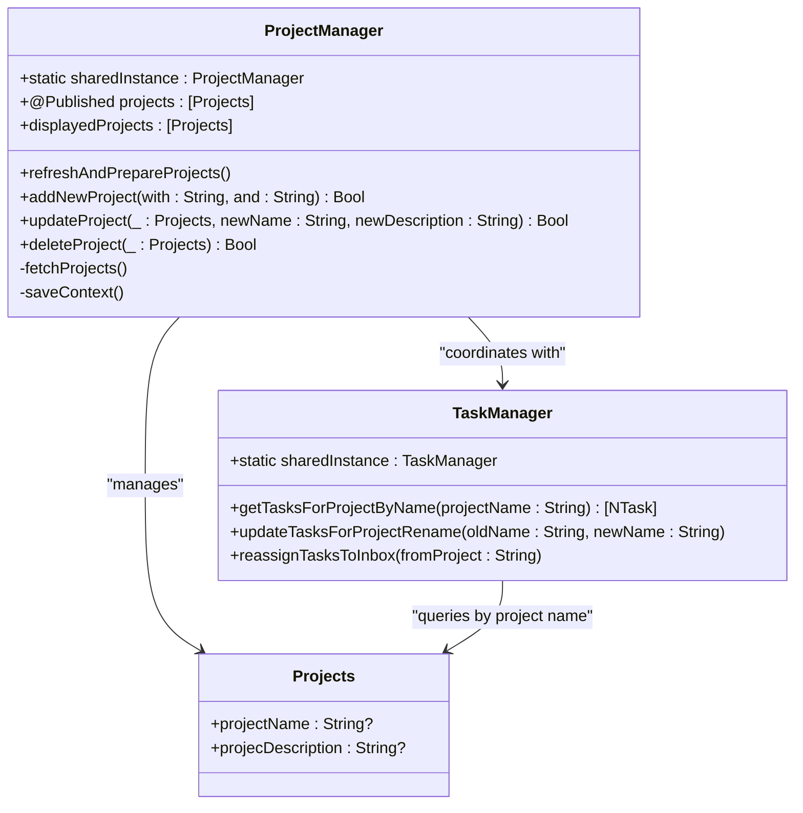
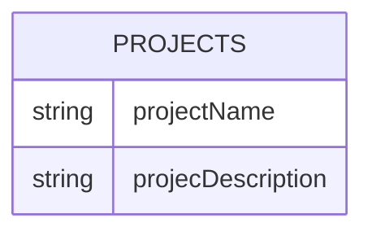
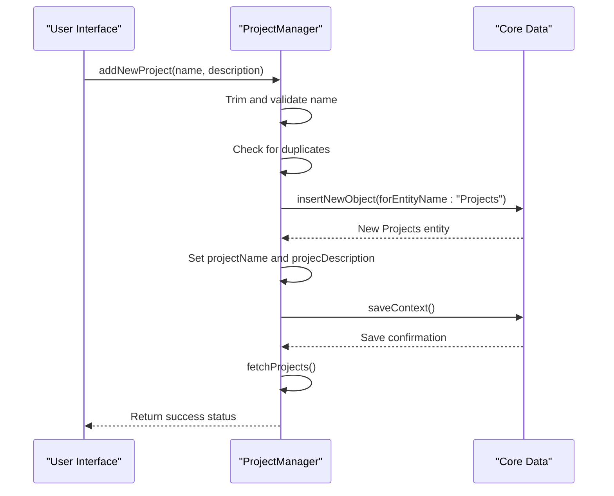

# Project Creation

<cite>
**Referenced Files in This Document**   
- [ProjectManager.swift](file://To%20Do%20List/ViewControllers/ProjectManager.swift#L1-L339)
- [Projects+CoreDataProperties.swift](file://Projects+CoreDataProperties.swift#L1-L23)
- [Projects+CoreDataClass.swift](file://Projects+CoreDataClass.swift#L1-L16)
- [NewProjectViewController.swift](file://To%20Do%20List/ViewControllers/NewProjectViewController.swift#L1-L271)
- [ProjectManagementView.swift](file://To%20Do%20List/View/ProjectManagementView.swift#L1-L164)
- [TaskManager.swift](file://To%20Do%20List/ViewControllers/TaskManager.swift#L1-L1004)
</cite>

## Table of Contents
1. [Project Creation](#project-creation)
2. [Core Data Entity Schema](#core-data-entity-schema)
3. [Project Creation Workflow](#project-creation-workflow)
4. [Validation and Error Handling](#validation-and-error-handling)
5. [UI Integration and Navigation](#ui-integration-and-navigation)
6. [Task Assignment and Project Relationships](#task-assignment-and-project-relationships)
7. [Performance and Synchronization](#performance-and-synchronization)

## Project Creation

The project creation feature in the Tasker application enables users to create, manage, and organize tasks within custom projects. The core functionality is orchestrated through the `ProjectManager` class, which serves as the central coordinator for all project-related operations. This system integrates tightly with Core Data for persistence and SwiftUI/UIKit for user interface presentation.

The `ProjectManager` class is implemented as a singleton (`static let sharedInstance = ProjectManager()`), ensuring a single source of truth for project data across the application. It maintains an `@Published` array of `Projects` entities, enabling reactive updates to the UI via Combine framework bindings. The manager interacts directly with the Core Data stack through an `NSManagedObjectContext` obtained from the `AppDelegate`, ensuring data consistency and thread safety.



**Diagram sources**
- [ProjectManager.swift](file://To%20Do%20List/ViewControllers/ProjectManager.swift#L1-L339)
- [Projects+CoreDataProperties.swift](file://Projects+CoreDataProperties.swift#L1-L23)
- [TaskManager.swift](file://To%20Do%20List/ViewControllers/TaskManager.swift#L1-L1004)

**Section sources**
- [ProjectManager.swift](file://To%20Do%20List/ViewControllers/ProjectManager.swift#L1-L339)

## Core Data Entity Schema

The `Projects` entity is defined using Core Data with two primary attributes that store project metadata. The entity schema is split across two extension files following Apple's recommended pattern for Core Data managed objects.

The `Projects+CoreDataClass.swift` file defines the base class that inherits from `NSManagedObject`, while `Projects+CoreDataProperties.swift` contains the `@NSManaged` property declarations. This separation allows Xcode to regenerate the class files without overwriting custom code.

**Entity: Projects**
- **projectName**: String? - The display name of the project (optional)
- **projecDescription**: String? - The description of the project (optional)

The entity does not have explicit constraints defined in the data model, but validation is enforced at the application level through the `ProjectManager`. The `fetchRequest()` class method provides a type-safe way to create fetch requests for `Projects` entities.



**Diagram sources**
- [Projects+CoreDataClass.swift](file://Projects+CoreDataClass.swift#L1-L16)
- [Projects+CoreDataProperties.swift](file://Projects+CoreDataProperties.swift#L1-L23)

**Section sources**
- [Projects+CoreDataProperties.swift](file://Projects+CoreDataProperties.swift#L1-L23)

## Project Creation Workflow

The project creation workflow begins with user input in either a UIKit or SwiftUI interface and culminates in persistent storage via Core Data. Two primary interfaces facilitate project creation: `NewProjectViewController` (UIKit) and `ProjectManagementView` (SwiftUI).

In the SwiftUI implementation, `ProjectManagementView` presents a "+" button in the navigation bar that triggers an alert for project creation. When the user taps "Save", the view calls `ProjectManager.sharedInstance.addNewProject(with:and:)` with the entered name and description.

```swift
Button("Save") {
    let success = projectManager.addNewProject(with: newProjectName, and: newProjectDescription)
    // Handle success/failure
}
```

The UIKit implementation in `NewProjectViewController` uses Material Design text fields for input. The `addOrModProject()` method retrieves the current text field values and validates them before calling the same `addNewProject` method on `ProjectManager`.

The actual creation process in `ProjectManager.addNewProject(with:and:)` follows these steps:
1. Trim whitespace from the project name
2. Validate the name (non-empty, not "Inbox", not duplicate)
3. Create a new `Projects` entity using `NSEntityDescription.insertNewObject`
4. Set the name and description properties
5. Save the context and refresh the projects array



**Diagram sources**
- [ProjectManagementView.swift](file://To%20Do%20List/View/ProjectManagementView.swift#L1-L164)
- [NewProjectViewController.swift](file://To%20Do%20List/ViewControllers/NewProjectViewController.swift#L1-L271)
- [ProjectManager.swift](file://To%20Do%20List/ViewControllers/ProjectManager.swift#L250-L280)

**Section sources**
- [ProjectManagementView.swift](file://To%20Do%20List/View/ProjectManagementView.swift#L1-L164)
- [NewProjectViewController.swift](file://To%20Do%20List/ViewControllers/NewProjectViewController.swift#L1-L271)

## Validation and Error Handling

The project creation system implements comprehensive validation rules to ensure data integrity and provide meaningful feedback to users. These validations occur at multiple levels: input sanitization, business logic rules, and persistence constraints.

**Name Validation Rules:**
- **Empty Check**: Project names cannot be empty or consist only of whitespace
- **Reserved Name**: "Inbox" is reserved for the default project and cannot be used
- **Uniqueness**: Project names are case-insensitive and must be unique

The validation occurs in the `addNewProject(with:and:)` method:

```swift
let trimmedName = name.trimmingCharacters(in: .whitespacesAndNewlines)
if trimmedName.isEmpty {
    print("ProjectManager Error: Project name cannot be empty.")
    return false
}
if trimmedName.lowercased() == defaultProject.lowercased() {
    print("ProjectManager Error: Cannot create project with reserved name 'Inbox'.")
    return false
}
if self.projects.contains(where: { $0.projectName?.lowercased() == trimmedName.lowercased() }) {
    print("ProjectManager Error: Project with name '\(trimmedName)' already exists.")
    return false
}
```

Error propagation follows a simple boolean return pattern, where `true` indicates success and `false` indicates failure. The calling UI components (SwiftUI alerts or UIKit view controllers) then display appropriate feedback using `HUD.shared.showSuccess()` or `HUD.shared.showFailure()`.

For project updates, additional validation prevents:
- Renaming a normal project to "Inbox"
- Renaming the "Inbox" project to something else
- Creating name conflicts during renaming

The system also handles edge cases during initialization through the `fixMissingProjecsDataWithDefaultsInternal()` method, which ensures the "Inbox" project exists and merges any duplicate "Inbox" projects.

**Section sources**
- [ProjectManager.swift](file://To%20Do%20List/ViewControllers/ProjectManager.swift#L250-L338)

## UI Integration and Navigation

Newly created projects are seamlessly integrated into the application's navigation hierarchy through reactive programming patterns. The `ProjectManager` class uses the `@Published` property wrapper on its `projects` array, which automatically notifies SwiftUI views that use `@ObservedObject` binding.

In `ProjectManagementView`, the `@ObservedObject var projectManager = ProjectManager.sharedInstance` creates a binding that triggers UI updates whenever the projects array changes. The view displays projects using a `ForEach` loop with `\.objectID` as the identifier, ensuring stable identity tracking.

The `displayedProjects` computed property in `ProjectManager` implements special sorting logic that ensures the "Inbox" project always appears at the top of the list, regardless of creation order:

```swift
var displayedProjects: [Projects] {
    var localProjects = projects.uniqued()
    if let inboxIndex = localProjects.firstIndex(where: { $0.projectName?.lowercased() == defaultProject.lowercased() }) {
        let inboxProject = localProjects.remove(at: inboxIndex)
        localProjects.insert(inboxProject, at: 0)
    }
    return localProjects
}
```

After project creation, the UI flow typically navigates to the task creation interface. In `NewProjectViewController`, the `addOrModProject()` method presents an `AddTaskViewController` modally after successful project creation, enabling users to immediately add tasks to their new project.

**Section sources**
- [ProjectManagementView.swift](file://To%20Do%20List/View/ProjectManagementView.swift#L1-L164)
- [NewProjectViewController.swift](file://To%20Do%20List/ViewControllers/NewProjectViewController.swift#L1-L271)

## Task Assignment and Project Relationships

The system maintains relationships between projects and tasks through string-based references rather than Core Data relationships. Each `NTask` entity has a `project` property (String?) that references the name of its associated project.

When a project is created, it is immediately available for task assignment. The `TaskManager` class provides several methods to retrieve tasks by project name:

```swift
func getTasksForProjectByName(projectName: String) -> [NTask] {
    let predicate = NSPredicate(format: "project CONTAINS[c] %@", projectName)
    return fetchTasks(predicate: predicate, sortDescriptors: [NSSortDescriptor(key: "dueDate", ascending: true)])
}
```

When a project is renamed, the system updates all associated tasks through the `updateTasksForProjectRename(oldName:newName)` method:

```swift
private func updateTasksForProjectRename(oldName: String, newName: String) {
    let tasksToUpdate = TaskManager.sharedInstance.getTasksForProjectByName(projectName: oldName)
    if !tasksToUpdate.isEmpty {
        for task in tasksToUpdate {
            task.project = newName
        }
        TaskManager.sharedInstance.saveContext()
    }
}
```

When a project is deleted, all its tasks are reassigned to the "Inbox" project via `reassignTasksToInbox(fromProject:)`:

```swift
private func reassignTasksToInbox(fromProject: String) {
    let tasksToReassign = TaskManager.sharedInstance.getTasksForProjectByName(projectName: fromProject)
    if !tasksToReassign.isEmpty {
        for task in tasksToReassign where !task.isComplete {
            task.project = defaultProject
        }
        TaskManager.sharedInstance.saveContext()
    }
}
```

This design choice of using string references instead of Core Data relationships provides flexibility for offline operations and simplifies synchronization, though it requires careful management to maintain referential integrity.

**Section sources**
- [TaskManager.swift](file://To%20Do%20List/ViewControllers/TaskManager.swift#L1-L1004)
- [ProjectManager.swift](file://To%20Do%20List/ViewControllers/ProjectManager.swift#L300-L338)

## Performance and Synchronization

The project creation system incorporates several performance optimizations to ensure UI responsiveness and data consistency:

**UI Responsiveness:**
- All Core Data operations are performed on the main context, with UI updates dispatched to the main queue
- The `@Published` property ensures reactive updates without requiring manual notification
- Input validation is performed synchronously to provide immediate feedback

**Data Synchronization:**
- The `saveContext()` method is called immediately after any modification to persist changes
- `fetchProjects()` is called after saves to ensure the `@Published` array reflects the current database state
- The `refreshAndPrepareProjects()` method provides a centralized way to load and validate project data

**Efficiency Considerations:**
- The `displayedProjects` computed property operates on the already-fetched `projects` array, avoiding additional database queries
- Duplicate detection uses in-memory filtering rather than additional fetch requests
- The singleton pattern reduces object creation overhead

For CloudKit synchronization (implied by the documentation objective though not implemented in the provided code), the current architecture would require extension to handle:
- Conflict resolution during offline creation
- Sync status tracking
- Batch operations for improved network efficiency
- Background synchronization to avoid blocking the UI

The current implementation focuses on local persistence with Core Data, providing a solid foundation that could be extended with CloudKit integration through a synchronization layer that monitors context changes and coordinates with CloudKit operations.

**Section sources**
- [ProjectManager.swift](file://To%20Do%20List/ViewControllers/ProjectManager.swift#L1-L339)
- [TaskManager.swift](file://To%20Do%20List/ViewControllers/TaskManager.swift#L1-L1004)