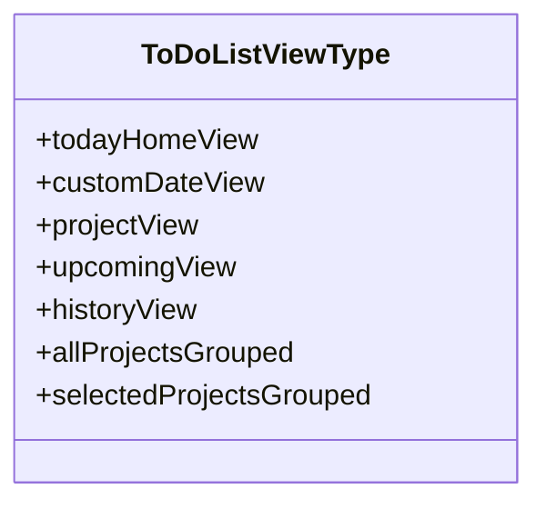
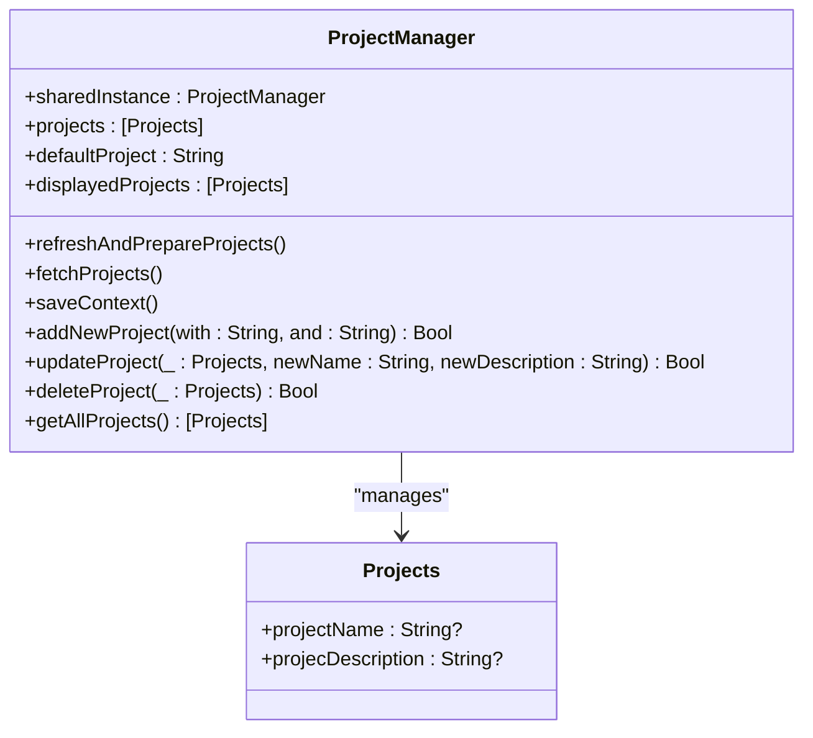
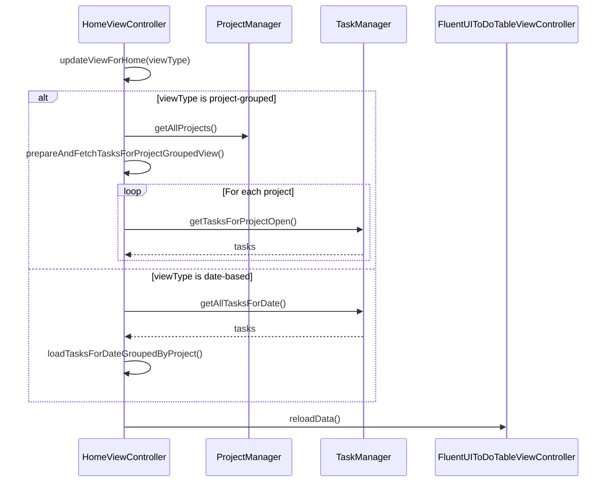
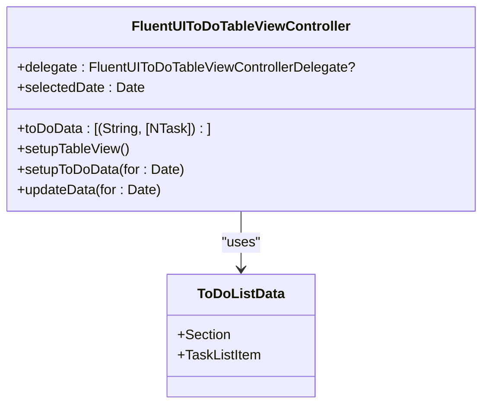
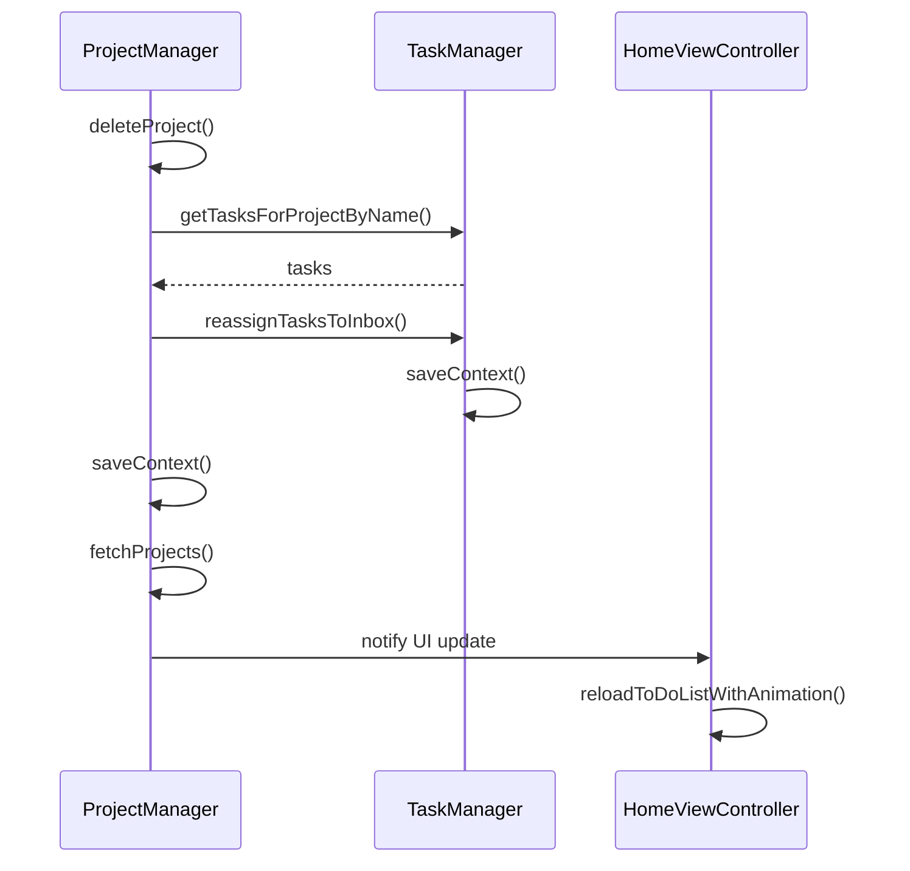
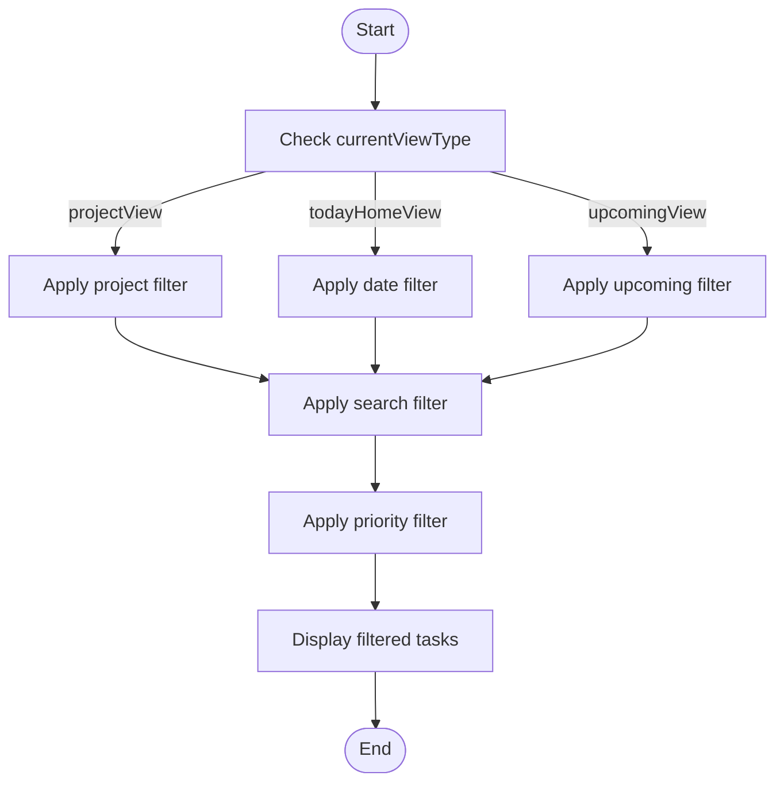
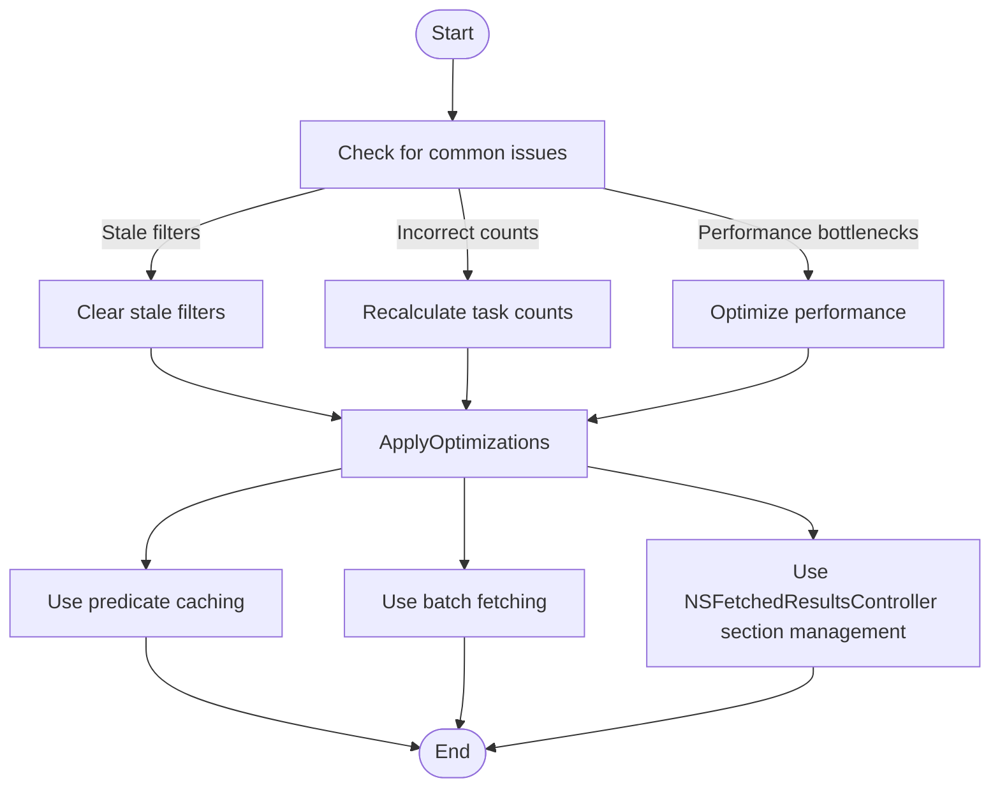
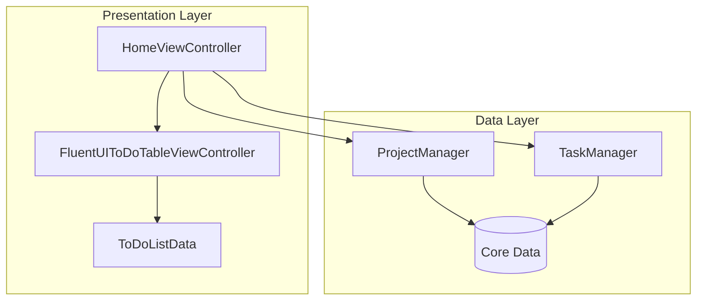

# Project Filtering

<cite>
**Referenced Files in This Document**   
- [ToDoListViewType.swift](file://To%20Do%20List/Models/ToDoListViewType.swift)
- [HomeViewController.swift](file://To%20Do%20List/ViewControllers/HomeViewController.swift)
- [HomeViewController+ProjectFiltering.swift](file://To%20Do%20List/ViewControllers/HomeViewController+ProjectFiltering.swift)
- [FluentUIToDoTableViewController.swift](file://To%20Do%20List/ViewControllers/FluentUIToDoTableViewController.swift)
- [ProjectManager.swift](file://To%20Do%20List/ViewControllers/ProjectManager.swift)
- [ToDoListData.swift](file://To%20Do%20List/ViewControllers/ToDoListData.swift)
</cite>

## Table of Contents
1. [Introduction](#introduction)
2. [Core Components Overview](#core-components-overview)
3. [ToDoListViewType Enum and Filter Logic](#todolistviewtype-enum-and-filter-logic)
4. [ProjectManager and Predicate Management](#projectmanager-and-predicate-management)
5. [HomeViewController and Filter Integration](#homeviewcontroller-and-filter-integration)
6. [FluentUIToDoTableViewController and Task Display](#fluentuitodotableviewcontroller-and-task-display)
7. [Dynamic Filter Updates and Real-Time UI](#dynamic-filter-updates-and-real-time-ui)
8. [Compound Filtering with Search and Priority](#compound-filtering-with-search-and-priority)
9. [Common Issues and Performance Optimization](#common-issues-and-performance-optimization)
10. [Architecture Diagram](#architecture-diagram)

## Introduction
The project filtering system in the Tasker application enables users to organize and view tasks based on project context such as 'Inbox', 'Today', or custom project categories. This document details the implementation of the filtering mechanism, focusing on the interaction between the `ToDoListViewType` enum, `ProjectManager`, `HomeViewController`, and `FluentUIToDoTableViewController`. The system supports dynamic filtering, real-time UI updates, and compound filtering with search and priority criteria. The architecture leverages Core Data for persistence and uses a repository pattern for data access, ensuring efficient and responsive task management.

## Core Components Overview
The project filtering system is composed of several key components that work together to provide a seamless user experience. The `ToDoListViewType` enum defines the available filter types, while the `ProjectManager` class manages project data and provides predicates for filtering. The `HomeViewController` orchestrates the filtering logic and updates the UI accordingly, and the `FluentUIToDoTableViewController` handles the display of filtered tasks in a table view. The `ToDoListData` structure organizes tasks into sections and items for display.

**Section sources**
- [ToDoListViewType.swift](file://To%20Do%20List/Models/ToDoListViewType.swift#L1-L20)
- [ProjectManager.swift](file://To%20Do%20List/ViewControllers/ProjectManager.swift#L1-L339)
- [HomeViewController.swift](file://To%20Do%20List/ViewControllers/HomeViewController.swift#L1-L1106)
- [FluentUIToDoTableViewController.swift](file://To%20Do%20List/ViewControllers/FluentUIToDoTableViewController.swift#L1-L1492)
- [ToDoListData.swift](file://To%20Do%20List/ViewControllers/ToDoListData.swift#L1-L91)

## ToDoListViewType Enum and Filter Logic
The `ToDoListViewType` enum is central to the filtering system, defining the various views available to the user. Each case represents a different filtering context, such as today's tasks, tasks for a specific date, or tasks grouped by project. The enum is used to drive the filter logic in the application, determining how tasks are fetched and displayed.

**Diagram sources**
- [ToDoListViewType.swift](file://To%20Do%20List/Models/ToDoListViewType.swift#L1-L20)

**Section sources**
- [ToDoListViewType.swift](file://To%20Do%20List/Models/ToDoListViewType.swift#L1-L20)

## ProjectManager and Predicate Management
The `ProjectManager` class is responsible for managing project data and providing predicates for data queries. It uses Core Data to persist project information and ensures that the default 'Inbox' project is always available. The class provides methods for adding, updating, and deleting projects, as well as for fetching projects and ensuring data consistency. The `displayedProjects` property returns a sorted list of projects with 'Inbox' at the top, which is used for UI display.

**Diagram sources**
- [ProjectManager.swift](file://To%20Do%20List/ViewControllers/ProjectManager.swift#L1-L339)

**Section sources**
- [ProjectManager.swift](file://To%20Do%20List/ViewControllers/ProjectManager.swift#L1-L339)

## HomeViewController and Filter Integration
The `HomeViewController` integrates the filtering system by using the `ToDoListViewType` enum and `ProjectManager` to determine which tasks to display. The `updateViewForHome` method updates the UI based on the current view type, setting the appropriate header text and calling the relevant methods to load tasks. The `loadTasksForDateGroupedByProject` method groups tasks by project and creates sections for the table view, while the `prepareAndFetchTasksForProjectGroupedView` method prepares data for project-grouped views.

**Diagram sources**
- [HomeViewController.swift](file://To%20Do%20List/ViewControllers/HomeViewController.swift#L1-L1106)
- [HomeViewController+ProjectFiltering.swift](file://To%20Do%20List/ViewControllers/HomeViewController+ProjectFiltering.swift#L1-L365)

**Section sources**
- [HomeViewController.swift](file://To%20Do%20List/ViewControllers/HomeViewController.swift#L1-L1106)
- [HomeViewController+ProjectFiltering.swift](file://To%20Do%20List/ViewControllers/HomeViewController+ProjectFiltering.swift#L1-L365)

## FluentUIToDoTableViewController and Task Display
The `FluentUIToDoTableViewController` is responsible for displaying the filtered tasks in a table view. It uses the `ToDoListData` structure to organize tasks into sections and items, which are then displayed in the table view. The `setupToDoData` method groups tasks by project and creates sections for the table view, while the `updateData` method updates the data for a specific date.

**Diagram sources**
- [FluentUIToDoTableViewController.swift](file://To%20Do%20List/ViewControllers/FluentUIToDoTableViewController.swift#L1-L1492)
- [ToDoListData.swift](file://To%20Do%20List/ViewControllers/ToDoListData.swift#L1-L91)

**Section sources**
- [FluentUIToDoTableViewController.swift](file://To%20Do%20List/ViewControllers/FluentUIToDoTableViewController.swift#L1-L1492)
- [ToDoListData.swift](file://To%20Do%20List/ViewControllers/ToDoListData.swift#L1-L91)

## Dynamic Filter Updates and Real-Time UI
The system supports dynamic filter updates when projects are renamed or deleted. The `ProjectManager` class ensures that tasks are reassigned to the 'Inbox' project when a project is deleted, and that tasks are updated with the new project name when a project is renamed. The `HomeViewController` listens for changes to the project data and updates the UI in real-time using the `reloadToDoListWithAnimation` method.

**Diagram sources**
- [ProjectManager.swift](file://To%20Do%20List/ViewControllers/ProjectManager.swift#L1-L339)
- [HomeViewController+ProjectFiltering.swift](file://To%20Do%20List/ViewControllers/HomeViewController+ProjectFiltering.swift#L1-L365)

**Section sources**
- [ProjectManager.swift](file://To%20Do%20List/ViewControllers/ProjectManager.swift#L1-L339)
- [HomeViewController+ProjectFiltering.swift](file://To%20Do%20List/ViewControllers/HomeViewController+ProjectFiltering.swift#L1-L365)

## Compound Filtering with Search and Priority
The system supports compound filtering by integrating search and priority filters with project filtering. The `HomeViewController` combines the current view type with search and priority criteria to create a compound filter, which is then applied to the task data. The `FluentUIToDoTableViewController` displays the filtered tasks in the table view, with sections for overdue, active, and completed tasks.

**Diagram sources**
- [HomeViewController+ProjectFiltering.swift](file://To%20Do%20List/ViewControllers/HomeViewController+ProjectFiltering.swift#L1-L365)
- [FluentUIToDoTableViewController.swift](file://To%20Do%20List/ViewControllers/FluentUIToDoTableViewController.swift#L1-L1492)

**Section sources**
- [HomeViewController+ProjectFiltering.swift](file://To%20Do%20List/ViewControllers/HomeViewController+ProjectFiltering.swift#L1-L365)
- [FluentUIToDoTableViewController.swift](file://To%20Do%20List/ViewControllers/FluentUIToDoTableViewController.swift#L1-L1492)

## Common Issues and Performance Optimization
Common issues in the project filtering system include stale filters after project deletion, incorrect task counts, and performance bottlenecks with complex predicates. These issues are addressed through the use of optimization techniques such as predicate caching, batch fetching, and NSFetchedResultsController section management. The `ProjectManager` class ensures that project data is consistent and up-to-date, while the `HomeViewController` and `FluentUIToDoTableViewController` use efficient data structures and algorithms to minimize performance overhead.

**Diagram sources**
- [ProjectManager.swift](file://To%20Do%20List/ViewControllers/ProjectManager.swift#L1-L339)
- [HomeViewController+ProjectFiltering.swift](file://To%20Do%20List/ViewControllers/HomeViewController+ProjectFiltering.swift#L1-L365)
- [FluentUIToDoTableViewController.swift](file://To%20Do%20List/ViewControllers/FluentUIToDoTableViewController.swift#L1-L1492)

**Section sources**
- [ProjectManager.swift](file://To%20Do%20List/ViewControllers/ProjectManager.swift#L1-L339)
- [HomeViewController+ProjectFiltering.swift](file://To%20Do%20List/ViewControllers/HomeViewController+ProjectFiltering.swift#L1-L365)
- [FluentUIToDoTableViewController.swift](file://To%20Do%20List/ViewControllers/FluentUIToDoTableViewController.swift#L1-L1492)

## Architecture Diagram
The architecture of the project filtering system is based on a model-view-controller pattern, with additional components for data management and UI display. The `ProjectManager` class manages project data, the `HomeViewController` orchestrates the filtering logic, and the `FluentUIToDoTableViewController` displays the filtered tasks. The system uses Core Data for persistence and the repository pattern for data access.

**Diagram sources**
- [ProjectManager.swift](file://To%20Do%20List/ViewControllers/ProjectManager.swift#L1-L339)
- [HomeViewController.swift](file://To%20Do%20List/ViewControllers/HomeViewController.swift#L1-L1106)
- [FluentUIToDoTableViewController.swift](file://To%20Do%20List/ViewControllers/FluentUIToDoTableViewController.swift#L1-L1492)
- [ToDoListData.swift](file://To%20Do%20List/ViewControllers/ToDoListData.swift#L1-L91)

**Section sources**
- [ProjectManager.swift](file://To%20Do%20List/ViewControllers/ProjectManager.swift#L1-L339)
- [HomeViewController.swift](file://To%20Do%20List/ViewControllers/HomeViewController.swift#L1-L1106)
- [FluentUIToDoTableViewController.swift](file://To%20Do%20List/ViewControllers/FluentUIToDoTableViewController.swift#L1-L1492)
- [ToDoListData.swift](file://To%20Do%20List/ViewControllers/ToDoListData.swift#L1-L91)