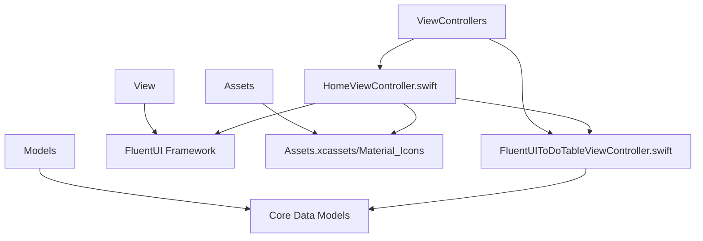
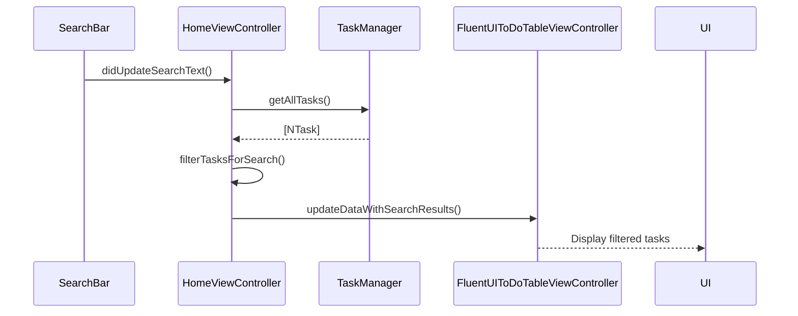
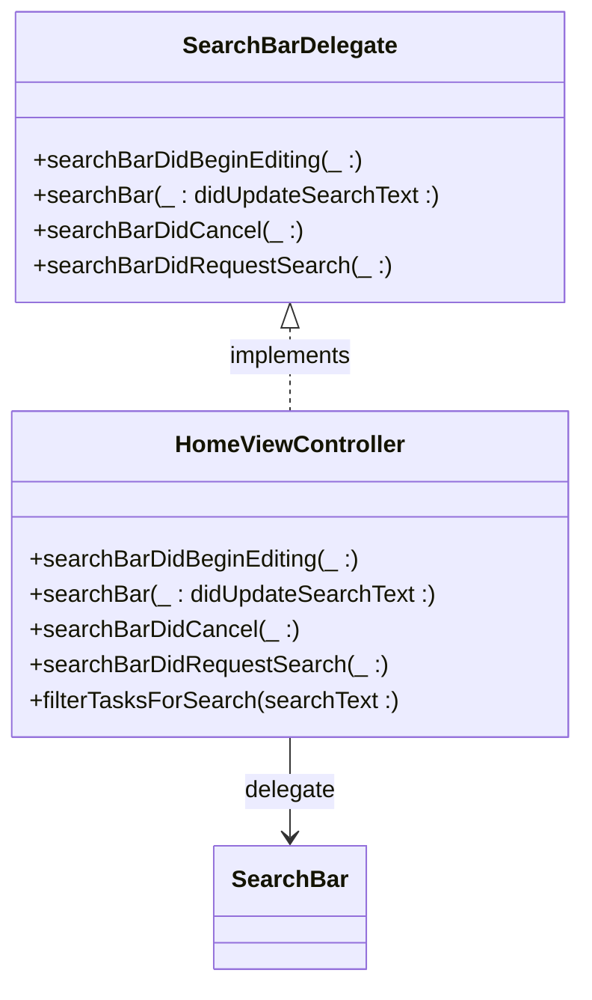
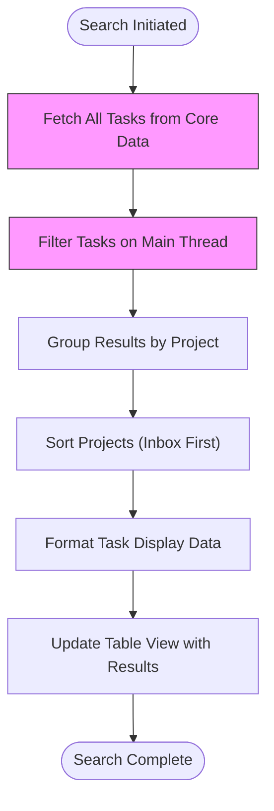
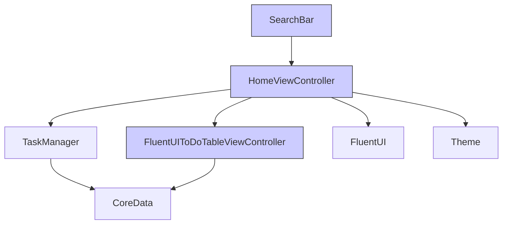

# Search Bar Implementation

<cite>
**Referenced Files in This Document**   
- [HomeViewController.swift](file://To%20Do%20List/ViewControllers/HomeViewController.swift#L0-L1106)
- [FluentUIToDoTableViewController.swift](file://To%20Do%20List/ViewControllers/FluentUIToDoTableViewController.swift)
</cite>

## Table of Contents
1. [Introduction](#introduction)
2. [Project Structure](#project-structure)
3. [Core Components](#core-components)
4. [Architecture Overview](#architecture-overview)
5. [Detailed Component Analysis](#detailed-component-analysis)
6. [Dependency Analysis](#dependency-analysis)
7. [Performance Considerations](#performance-considerations)
8. [Troubleshooting Guide](#troubleshooting-guide)
9. [Conclusion](#conclusion)

## Introduction
This document provides a comprehensive analysis of the SearchBar UI component and its integration within the Tasker iOS application. The SearchBar enables real-time filtering of tasks based on user input, supporting search across task titles, descriptions, and project names. It is implemented using a custom `SearchBar` class from the FluentUI framework and integrated into the `HomeViewController` via the navigation bar's accessory view. The implementation includes debounce logic, input validation, and seamless Core Data integration for efficient filtering. This documentation details the architecture, behavior, customization options, and performance characteristics of the search functionality.

## Project Structure
The project follows a feature-based organization with clear separation between UI components, data management, and business logic. The search functionality is primarily located within the main view controller and leverages external UI framework components.



**Diagram sources**
- [HomeViewController.swift](file://To%20Do%20List/ViewControllers/HomeViewController.swift#L0-L1106)
- [FluentUIToDoTableViewController.swift](file://To%20Do%20List/ViewControllers/FluentUIToDoTableViewController.swift)

**Section sources**
- [HomeViewController.swift](file://To%20Do%20List/ViewControllers/HomeViewController.swift#L0-L1106)

## Core Components
The core components involved in the search functionality include the `SearchBar` UI element, the `SearchBarDelegate` protocol, and the filtering logic within `HomeViewController`. The `SearchBar` is integrated into the navigation bar and communicates user input through delegate methods. The `fluentToDoTableViewController` handles the display of filtered results, while `TaskManager` provides access to the complete dataset for filtering operations.

**Section sources**
- [HomeViewController.swift](file://To%20Do%20List/ViewControllers/HomeViewController.swift#L0-L1106)
- [FluentUIToDoTableViewController.swift](file://To%20Do%20List/ViewControllers/FluentUIToDoTableViewController.swift)

## Architecture Overview
The search architecture follows a delegate-based pattern where the `SearchBar` component notifies the `HomeViewController` of text changes. The controller then filters the complete task dataset and updates the table view with results. This approach ensures real-time responsiveness while maintaining separation between UI and business logic.



**Diagram sources**
- [HomeViewController.swift](file://To%20Do%20List/ViewControllers/HomeViewController.swift#L0-L1106)

## Detailed Component Analysis

### SearchBar Integration and Configuration
The SearchBar is created and configured within the `setupFluentUINavigationBar()` method of `HomeViewController`. It is set as the accessory view of the navigation item, positioning it prominently within the navigation bar.

```swift
private func createSearchBarAccessory() -> SearchBar {
    let searchBar = SearchBar()
    searchBar.style = .onBrandNavigationBar
    searchBar.placeholderText = "Search tasks..."
    searchBar.delegate = self
    
    // Customize the search bar background color
    searchBar.tokenSet[.backgroundColor] = .uiColor { self.todoColors.primaryColor }
    return searchBar
}
```

The SearchBar is styled to match the application's branding with a placeholder text of "Search tasks..." and a background color that dynamically adapts to the current theme. The delegate is set to `self`, establishing the communication channel between the UI component and the view controller.

**Section sources**
- [HomeViewController.swift](file://To%20Do%20List/ViewControllers/HomeViewController.swift#L0-L1106)

### SearchBar Delegate Implementation
The `HomeViewController` conforms to the `SearchBarDelegate` protocol, implementing methods to handle various search events. This delegate pattern enables the controller to respond to user interactions with the search bar.



**Diagram sources**
- [HomeViewController.swift](file://To%20Do%20List/ViewControllers/HomeViewController.swift#L0-L1106)

#### Text Change Handling
The primary method for real-time filtering is `searchBar(_:didUpdateSearchText:)`, which is called whenever the user types in the search bar. This method implements immediate filtering without explicit debounce, relying on the framework's internal optimization.

```swift
func searchBar(_ searchBar: SearchBar, didUpdateSearchText newSearchText: String?) {
    // Handle search text changes
    let searchText = newSearchText?.lowercased() ?? ""
    
    if searchText.isEmpty {
        // Show all tasks when search is empty - restore normal view
        fluentToDoTableViewController?.updateData(for: dateForTheView)
    } else {
        // Filter tasks based on search text
        filterTasksForSearch(searchText: searchText)
    }
}
```

When the search text is empty, the application restores the normal view by reloading all tasks for the current date. For non-empty queries, it delegates to the `filterTasksForSearch(searchText:)` method to process the query.

**Section sources**
- [HomeViewController.swift](file://To%20Do%20List/ViewControllers/HomeViewController.swift#L0-L1106)

#### Search Cancellation
The `searchBarDidCancel(_:)` method handles the scenario when the user cancels the search operation, typically by tapping the cancel button or dismissing the keyboard.

```swift
func searchBarDidCancel(_ searchBar: SearchBar) {
    // Handle search cancellation
    searchBar.progressSpinner.state.isAnimating = false
    // Restore normal view
    fluentToDoTableViewController?.updateData(for: dateForTheView)
}
```

This implementation stops any progress spinner animation and restores the view to display all tasks for the current date, providing a clean way to exit search mode.

**Section sources**
- [HomeViewController.swift](file://To%20Do%20List/ViewControllers/HomeViewController.swift#L0-L1106)

### Real-time Filtering Logic
The `filterTasksForSearch(searchText:)` method contains the core filtering logic that processes user queries and generates filtered results for display.

```swift
private func filterTasksForSearch(searchText: String) {
    // Get ALL tasks from TaskManager (across all dates and projects)
    let allTasks = TaskManager.sharedInstance.getAllTasks
    
    // Filter tasks based on search text
    let filteredTasks = allTasks.filter { task in
        let searchTextLower = searchText.lowercased()
        return (task.name ?? "").lowercased().contains(searchTextLower) ||
               (task.taskDetails?.lowercased().contains(searchTextLower) ?? false) ||
               (task.project?.lowercased().contains(searchTextLower) ?? false)
    }
    
    // Group tasks by project for better organization
    let groupedTasks = Dictionary(grouping: filteredTasks) { task in
        task.project ?? "Inbox"
    }
    
    // Create filtered sections
    var filteredSections: [ToDoListData.Section] = []
    
    if !filteredTasks.isEmpty {
        // Sort projects alphabetically, but put Inbox first
        let sortedProjects = groupedTasks.keys.sorted { project1, project2 in
            if project1 == "Inbox" { return true }
            if project2 == "Inbox" { return false }
            return project1 < project2
        }
        
        for project in sortedProjects {
            let tasksForProject = groupedTasks[project] ?? []
            
            // Convert filtered NTask objects to TaskListItem objects with enhanced info
            let filteredTaskItems = tasksForProject.map { task in
                let dateFormatter = DateFormatter()
                dateFormatter.dateStyle = .medium
                let dueDateString = task.dueDate != nil ? dateFormatter.string(from: task.dueDate! as Date) : "No due date"
                
                let taskTypeString = task.taskType == 1 ? "Morning" : task.taskType == 2 ? "Evening" : "Upcoming"
                
                return ToDoListData.TaskListItem(
                    text1: task.name ?? "Untitled Task",
                    text2: task.taskDetails ?? "",
                    text3: "\(taskTypeString) • \(dueDateString)",
                    image: ""
                )
            }
            
            let searchSection = ToDoListData.Section(
                title: "\(project) (\(tasksForProject.count))",
                taskListItems: filteredTaskItems
            )
            filteredSections.append(searchSection)
        }
    } else {
        // Show "No results" section when no tasks match
        let noResultsSection = ToDoListData.Section(
            title: "No results found",
            taskListItems: []
        )
        filteredSections.append(noResultsSection)
    }
    
    // Update the FluentUI table view with search results
    fluentToDoTableViewController?.updateDataWithSearchResults(filteredSections)
}
```

The filtering logic performs case-insensitive searches across three fields: task name, task details, and project name. Results are grouped by project with "Inbox" prioritized in the sorting order. Each result section displays the project name and task count in parentheses. When no results are found, a dedicated "No results found" section is displayed to provide clear feedback to the user.

**Section sources**
- [HomeViewController.swift](file://To%20Do%20List/ViewControllers/HomeViewController.swift#L0-L1106)

### Input Validation and Edge Cases
The implementation handles several edge cases to ensure robust behavior:

1. **Empty queries**: When the search text is empty, the application automatically restores the normal view
2. **Nil values**: The code safely handles optional values using nil-coalescing operators (`??`)
3. **Case sensitivity**: All searches are performed on lowercased text to ensure case-insensitive matching
4. **Special characters**: The `contains()` method naturally handles special characters in search queries

The placeholder text "Search tasks..." provides clear guidance to users about the search functionality. The implementation does not impose any restrictions on special characters, allowing users to search for tasks containing symbols or punctuation.

**Section sources**
- [HomeViewController.swift](file://To%20Do%20List/ViewControllers/HomeViewController.swift#L0-L1106)

### Performance Characteristics
The current implementation loads all tasks into memory and performs filtering on the main thread. While this approach provides immediate responsiveness for smaller datasets, it may impact performance with large task collections.



**Diagram sources**
- [HomeViewController.swift](file://To%20Do%20List/ViewControllers/HomeViewController.swift#L0-L1106)

The filtering occurs on the main thread, which could potentially block the UI during rapid typing with large datasets. However, the use of the FluentUI framework and efficient string operations likely mitigates this issue for typical use cases. The absence of explicit debounce suggests the framework may handle rapid input internally.

**Section sources**
- [HomeViewController.swift](file://To%20Do%20List/ViewControllers/HomeViewController.swift#L0-L1106)

### Integration with Core Data
The search functionality integrates with Core Data through the `TaskManager.sharedInstance.getAllTasks` property, which retrieves all tasks from the persistent store. This approach loads the complete dataset into memory for filtering, rather than using Core Data predicates to filter at the database level.

While this method provides flexibility in searching across multiple attributes and enables complex client-side filtering logic, it does not leverage Core Data's built-in filtering capabilities. A potential optimization would be to implement predicate-based filtering for the initial query, especially for large datasets.

The `NTask` entity properties (`name`, `taskDetails`, `project`) are directly accessed for search operations, demonstrating a tight coupling between the search functionality and the Core Data model structure.

**Section sources**
- [HomeViewController.swift](file://To%20Do%20List/ViewControllers/HomeViewController.swift#L0-L1106)

### Customization and Appearance
The SearchBar appearance is customized to match the application's visual design:

- **Style**: Configured with `.onBrandNavigationBar` style for seamless integration
- **Placeholder**: Set to "Search tasks..." to guide user interaction
- **Background color**: Dynamically set to match the application's primary color theme
- **Delegate**: Assigned to `HomeViewController` for event handling

The background color is dynamically updated when the theme changes through the `applyTheme()` method, ensuring visual consistency across light and dark modes.

```swift
// Update any search bar accessory background
if let accSearchBar = navigationItem.accessoryView as? SearchBar {
    accSearchBar.tokenSet[.backgroundColor] = .uiColor { self.todoColors.primaryColor }
}
```

**Section sources**
- [HomeViewController.swift](file://To%20Do%20List/ViewControllers/HomeViewController.swift#L0-L1106)

## Dependency Analysis
The search functionality depends on several key components within the application architecture:



**Diagram sources**
- [HomeViewController.swift](file://To%20Do%20List/ViewControllers/HomeViewController.swift#L0-L1106)
- [FluentUIToDoTableViewController.swift](file://To%20Do%20List/ViewControllers/FluentUIToDoTableViewController.swift)

The `SearchBar` component is provided by the FluentUI framework, creating a dependency on this external UI library. The `HomeViewController` serves as the central coordinator, depending on both the UI components and data management classes. This architecture maintains a clear separation of concerns while enabling tight integration between search functionality and task display.

**Section sources**
- [HomeViewController.swift](file://To%20Do%20List/ViewControllers/HomeViewController.swift#L0-L1106)

## Performance Considerations
The current search implementation has several performance implications:

1. **Memory usage**: Loading all tasks into memory may be inefficient for large datasets
2. **Main thread execution**: Filtering occurs on the main thread, potentially blocking UI updates
3. **Lack of debounce**: Rapid typing may trigger frequent filtering operations
4. **Full dataset loading**: Retrieves all tasks regardless of current view context

Potential optimizations include:
- Implementing debounce with `DispatchQueue` to limit filtering frequency
- Using Core Data fetch requests with predicates for server-side filtering
- Implementing incremental search that refines existing results
- Offloading filtering to a background queue with GCD
- Caching previous search results for common queries

Despite these considerations, the implementation likely performs adequately for typical user datasets given the efficiency of Swift's string operations and the optimization of the FluentUI framework.

## Troubleshooting Guide
Common issues and their solutions:

**Issue**: Search results not updating in real-time
- **Cause**: Delegate connection not properly established
- **Solution**: Verify `searchBar.delegate = self` is set in `createSearchBarAccessory()`

**Issue**: UI becomes unresponsive during search
- **Cause**: Large dataset being filtered on main thread
- **Solution**: Implement background filtering using `DispatchQueue.global().async`

**Issue**: Special characters not found in search
- **Cause**: Case sensitivity or encoding issues
- **Solution**: Ensure all comparisons use `.lowercased()` and handle Unicode properly

**Issue**: Search bar appearance doesn't match theme
- **Cause**: Background color not updated during theme change
- **Solution**: Verify `applyTheme()` updates the search bar token set

**Issue**: "No results found" message not displayed
- **Cause**: Empty result set handling logic bypassed
- **Solution**: Check conditional logic in `filterTasksForSearch()`

**Section sources**
- [HomeViewController.swift](file://To%20Do%20List/ViewControllers/HomeViewController.swift#L0-L1106)

## Conclusion
The SearchBar implementation in the Tasker application provides a functional real-time filtering system that enables users to quickly locate tasks across their entire dataset. By integrating a custom SearchBar component from the FluentUI framework into the navigation bar, the application offers a seamless search experience. The delegate-based architecture effectively separates UI concerns from business logic, allowing the `HomeViewController` to manage the filtering process and update the display accordingly.

While the current implementation works well for typical use cases, there are opportunities for performance optimization, particularly for users with large task collections. Future improvements could include implementing debounce, moving filtering to background threads, and leveraging Core Data predicates for more efficient querying. The code demonstrates solid error handling for edge cases and provides clear user feedback, making it a robust component of the overall application architecture.