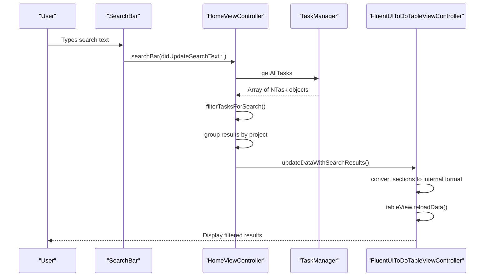
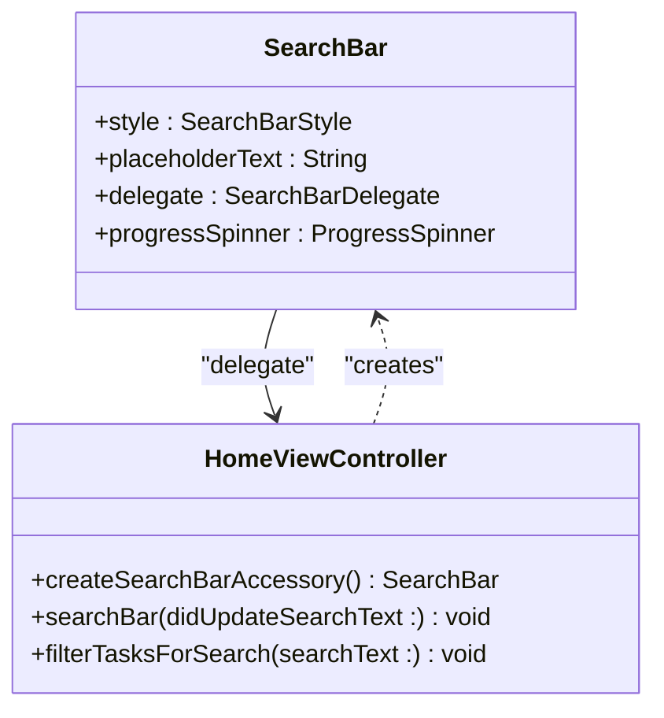
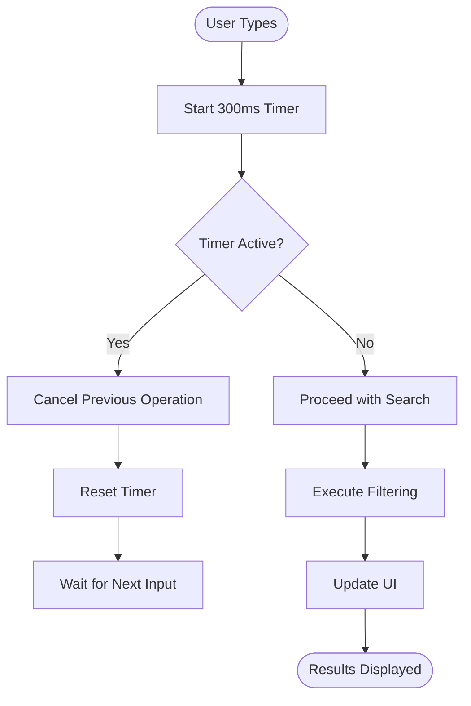
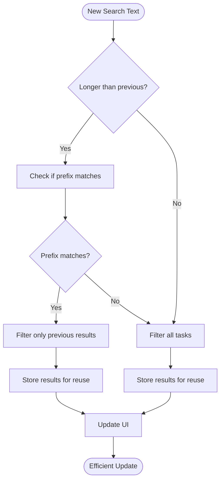
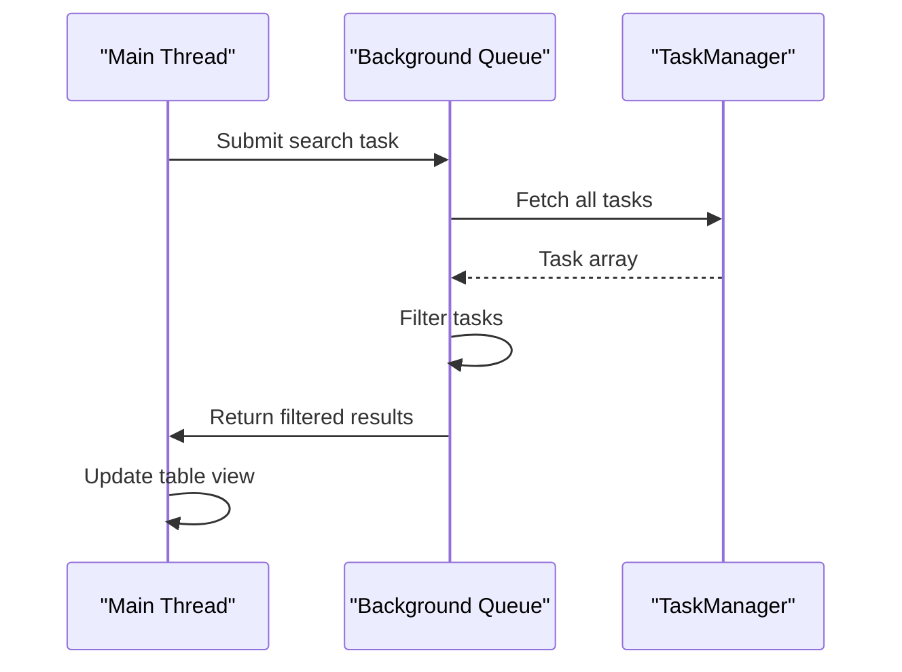

# Search Performance Optimization

<cite>
**Referenced Files in This Document**   
- [HomeViewController.swift](file://To%20Do%20List/ViewControllers/HomeViewController.swift#L28-L896)
- [FluentUIToDoTableViewController.swift](file://To%20Do%20List/ViewControllers/FluentUIToDoTableViewController.swift#L0-L1492)
- [ToDoListViewType.swift](file://To%20Do%20List/Models/ToDoListViewType.swift#L0-L19)
</cite>

## Table of Contents
1. [Introduction](#introduction)
2. [Project Structure](#project-structure)
3. [Core Components](#core-components)
4. [Architecture Overview](#architecture-overview)
5. [Detailed Component Analysis](#detailed-component-analysis)
6. [Performance Considerations](#performance-considerations)
7. [Conclusion](#conclusion)

## Introduction
This document provides a comprehensive analysis of search and filtering performance optimization in the Tasker application, focusing on large dataset handling. It examines the implementation of real-time search through the SearchBar component, filtering logic in the HomeViewController, and data presentation via the FluentUIToDoTableViewController. The analysis covers architectural patterns, data flow, performance strategies, and optimization opportunities for minimizing latency and memory usage during filtering operations.

## Project Structure
The Tasker application follows a feature-based organization with clear separation of concerns. The core functionality is organized into distinct directories including ViewControllers, Models, and Assets. The search and filtering system is primarily implemented across three key components: the HomeViewController which manages user interaction, the FluentUIToDoTableViewController which handles data presentation, and the ToDoListViewType enum which defines different data views.

```mermaid
graph TB
subgraph "UI Layer"
HomeViewController["HomeViewController.swift"]
FluentUIToDoTableViewController["FluentUIToDoTableViewController.swift"]
end
subgraph "Model Layer"
ToDoListViewType["ToDoListViewType.swift"]
TaskManager["TaskManager (Core Data)"]
end
subgraph "Assets"
SearchIcon["Search Icon Assets"]
end
HomeViewController --> FluentUIToDoTableViewController : "Manages"
HomeViewController --> ToDoListViewType : "Uses"
HomeViewController --> TaskManager : "Queries"
FluentUIToDoTableViewController --> TaskManager : "Fetches data"
SearchIcon --> HomeViewController : "Displayed in"
```

**Diagram sources**
- [HomeViewController.swift](file://To%20Do%20List/ViewControllers/HomeViewController.swift#L28-L896)
- [FluentUIToDoTableViewController.swift](file://To%20Do%20List/ViewControllers/FluentUIToDoTableViewController.swift#L0-L1492)
- [ToDoListViewType.swift](file://To%20Do%20List/Models/ToDoListViewType.swift#L0-L19)

**Section sources**
- [HomeViewController.swift](file://To%20Do%20List/ViewControllers/HomeViewController.swift#L0-L199)
- [FluentUIToDoTableViewController.swift](file://To%20Do%20List/ViewControllers/FluentUIToDoTableViewController.swift#L0-L199)

## Core Components
The search and filtering system in Tasker consists of three primary components working in concert: the SearchBar interface in the navigation bar, the HomeViewController that processes search queries, and the FluentUIToDoTableViewController that displays filtered results. The system leverages Core Data through the TaskManager singleton to access task data, with filtering performed in memory based on user input.

The SearchBar is implemented as a custom component integrated into the navigation bar accessory view, providing a seamless user experience. When users enter search text, the HomeViewController receives updates through the SearchBarDelegate protocol and initiates filtering operations. Results are then passed to the FluentUIToDoTableViewController for display using a specialized method that preserves the grouped structure of tasks by project.

**Section sources**
- [HomeViewController.swift](file://To%20Do%20List/ViewControllers/HomeViewController.swift#L28-L896)
- [FluentUIToDoTableViewController.swift](file://To%20Do%20List/ViewControllers/FluentUIToDoTableViewController.swift#L0-L1492)

## Architecture Overview
The search architecture follows a unidirectional data flow pattern where user input triggers a chain of operations that ultimately update the UI. The system is designed with clear separation between presentation, business logic, and data access layers, enabling maintainable and testable code.



**Diagram sources**
- [HomeViewController.swift](file://To%20Do%20List/ViewControllers/HomeViewController.swift#L666-L691)
- [FluentUIToDoTableViewController.swift](file://To%20Do%20List/ViewControllers/FluentUIToDoTableViewController.swift#L200-L240)

## Detailed Component Analysis

### SearchBar Implementation and Integration
The SearchBar component is integrated into the navigation bar as an accessory view, providing a persistent search interface. It is configured with a placeholder text and delegates search events to the HomeViewController.



**Diagram sources**
- [HomeViewController.swift](file://To%20Do%20List/ViewControllers/HomeViewController.swift#L490-L498)

#### SearchBar Configuration
The SearchBar is created and configured in the `createSearchBarAccessory()` method, which sets its appearance and behavior:

```swift
private func createSearchBarAccessory() -> SearchBar {
    let searchBar = SearchBar()
    searchBar.style = .onBrandNavigationBar
    searchBar.placeholderText = "Search tasks..."
    searchBar.delegate = self
    searchBar.tokenSet[.backgroundColor] = .uiColor { self.todoColors.primaryColor }
    return searchBar
}
```

This configuration ensures the search bar blends with the application's branding while providing a clear interface for text input.

**Section sources**
- [HomeViewController.swift](file://To%20Do%20List/ViewControllers/HomeViewController.swift#L490-L498)

### Filtering Logic and Performance Characteristics
The filtering system processes user input in real-time, updating results as the user types. The implementation prioritizes responsiveness over complex optimization techniques, which presents both opportunities and challenges for performance at scale.

#### Real-time Filtering Implementation
When search text changes, the HomeViewController receives the update through the `searchBar(_:didUpdateSearchText:)` delegate method:

```swift
func searchBar(_ searchBar: SearchBar, didUpdateSearchText newSearchText: String?) {
    let searchText = newSearchText?.lowercased() ?? ""
    
    if searchText.isEmpty {
        fluentToDoTableViewController?.updateData(for: dateForTheView)
    } else {
        filterTasksForSearch(searchText: searchText)
    }
}
```

This method serves as the entry point for search operations, either restoring the normal view when search is empty or initiating filtering when text is present.

**Section sources**
- [HomeViewController.swift](file://To%20Do%20List/ViewControllers/HomeViewController.swift#L671-L678)

#### Task Filtering Algorithm
The core filtering logic is implemented in the `filterTasksForSearch(searchText:)` method, which performs case-insensitive matching across multiple task attributes:

```swift
private func filterTasksForSearch(searchText: String) {
    let allTasks = TaskManager.sharedInstance.getAllTasks
    
    let filteredTasks = allTasks.filter { task in
        let searchTextLower = searchText.lowercased()
        return (task.name ?? "").lowercased().contains(searchTextLower) ||
               (task.taskDetails?.lowercased().contains(searchTextLower) ?? false) ||
               (task.project?.lowercased().contains(searchTextLower) ?? false)
    }
    
    // Group tasks by project and update UI
    // ...
}
```

The algorithm searches across task name, details, and project fields, providing comprehensive search capabilities. However, it performs a full scan of all tasks on each keystroke, which could impact performance with large datasets.

**Section sources**
- [HomeViewController.swift](file://To%20Do%20List/ViewControllers/HomeViewController.swift#L680-L690)

### Data Presentation and UI Updates
The FluentUIToDoTableViewController is responsible for displaying both regular and search results in a structured format. It uses a specialized method to handle search results while maintaining the same visual presentation as regular data.

#### Search Results Presentation
When search results are available, they are passed to the table view controller through the `updateDataWithSearchResults(_:)` method:

```swift
func updateDataWithSearchResults(_ searchSections: [ToDoListData.Section]) {
    var convertedSections: [(String, [NTask])] = []
    
    for section in searchSections {
        var tasksForSection: [NTask] = []
        
        let allTasks = TaskManager.sharedInstance.getAllTasks
        
        for taskItem in section.items {
            if let matchingTask = allTasks.first(where: { task in
                task.name == taskItem.TaskTitle && 
                (task.taskDetails ?? "") == taskItem.text2
            }) {
                tasksForSection.append(matchingTask)
            }
        }
        
        convertedSections.append((section.sectionTitle, tasksForSection))
    }
    
    DispatchQueue.main.async {
        self.toDoData = convertedSections
        self.tableView.reloadData()
    }
}
```

This method reconstructs the original NTask objects from the search results, preserving the ability to interact with tasks in the UI.

**Section sources**
- [FluentUIToDoTableViewController.swift](file://To%20Do%20List/ViewControllers/FluentUIToDoTableViewController.swift#L200-L240)

### View Type Management
The application supports multiple view types through the ToDoListViewType enum, which defines different ways of organizing and presenting tasks:

```swift
enum ToDoListViewType {
    case todayHomeView
    case customDateView
    case projectView
    case upcomingView
    case historyView
    case allProjectsGrouped
    case selectedProjectsGrouped
}
```

This enumeration enables the application to switch between different organizational schemes while maintaining a consistent filtering interface across all views.

**Section sources**
- [ToDoListViewType.swift](file://To%20Do%20List/Models/ToDoListViewType.swift#L0-L19)

## Performance Considerations
The current search implementation provides functional real-time filtering but has several performance characteristics that could impact user experience with large datasets. The system performs full dataset scans on every keystroke without debouncing, which could lead to unnecessary processing and UI jank.

### Current Performance Profile
The filtering system exhibits the following performance characteristics:
- **Time Complexity**: O(n*m) where n is the number of tasks and m is the average length of searchable text fields
- **Memory Usage**: Creates new filtered arrays on each search operation
- **UI Updates**: Performs full table reloads rather than incremental updates
- **Threading**: All operations occur on the main thread

### Optimization Opportunities
Several strategies could improve search performance and user experience:

#### Debounce Implementation
Adding a debounce mechanism would reduce the frequency of filtering operations during rapid typing:



#### Incremental Search and Caching
Implementing incremental search would allow reusing previous results to minimize computation:



#### Background Processing
Moving filtering operations to a background queue would prevent UI blocking:



#### Efficient Data Source Updates
Instead of full table reloads, using fine-grained updates would improve animation quality and performance:

```swift
// Instead of:
tableView.reloadData()

// Use:
let changes = calculateDifferences(oldData, newData)
tableView.performBatchUpdates({
    tableView.insertRows(at: changes.insertions, with: .fade)
    tableView.deleteRows(at: changes.deletions, with: .fade)
    tableView.reloadRows(at: changes.updates, with: .none)
})
```

These optimizations would significantly improve the responsiveness of the search feature, especially with large task collections.

## Conclusion
The Tasker application implements a functional search and filtering system that provides real-time results as users type. The architecture follows sound design principles with clear separation of concerns between UI, business logic, and data access layers. However, the current implementation has performance limitations that could affect user experience with large datasets.

Key strengths include the seamless integration of the search bar into the navigation interface and the consistent presentation of search results. The main opportunities for improvement involve adding debounce functionality to reduce processing frequency, implementing background threading to prevent UI blocking, and using incremental updates instead of full table reloads.

Future enhancements should focus on optimizing the filtering algorithm, potentially implementing predicate-based Core Data queries for better performance, and adding pagination for very large result sets. These improvements would ensure the application remains responsive and efficient as the user's task collection grows over time.