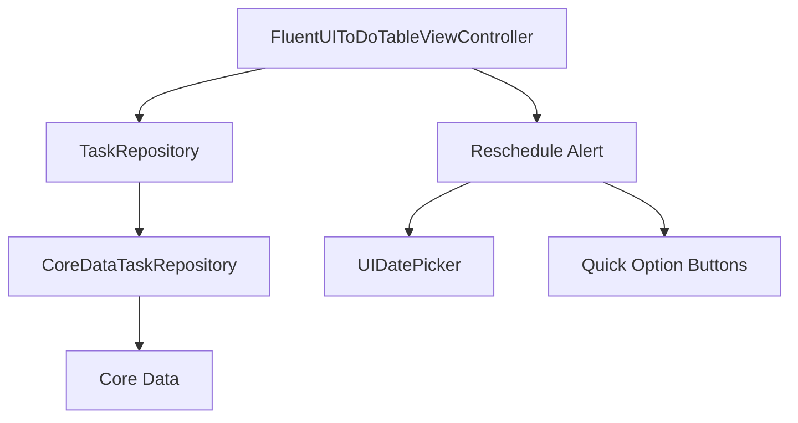
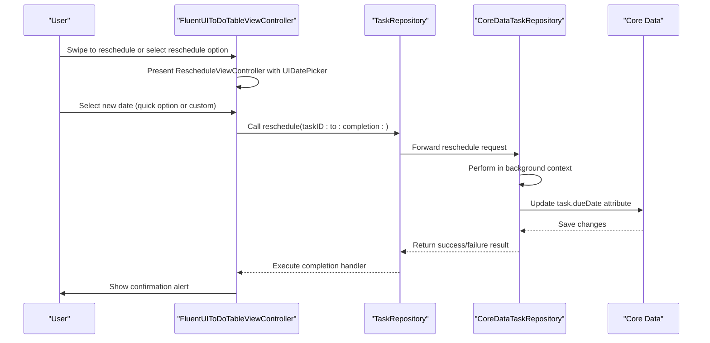
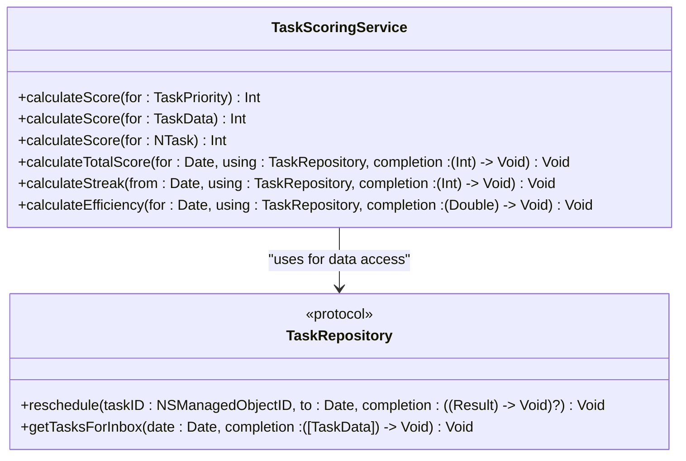

# Rescheduling Logic

<cite>
**Referenced Files in This Document**   
- [TaskManager.swift](file://To%20Do%20List/ViewControllers/TaskManager.swift)
- [TaskScoringService.swift](file://To%20Do%20List/Services/TaskScoringService.swift)
- [CoreDataTaskRepository.swift](file://To%20Do%20List/Repositories/CoreDataTaskRepository.swift)
- [TaskRepository.swift](file://To%20Do%20List/Repositories/TaskRepository.swift)
- [FluentUIToDoTableViewController.swift](file://To%20Do%20List/ViewControllers/FluentUIToDoTableViewController.swift)
- [README.md](file://README.md)
</cite>

## Table of Contents
1. [Introduction](#introduction)
2. [Rescheduling Implementation Overview](#rescheduling-implementation-overview)
3. [Task Rescheduling Flow](#task-rescheduling-flow)
4. [Impact on Analytics and Scoring](#impact-on-analytics-and-scoring)
5. [Common Rescheduling Scenarios](#common-rescheduling-scenarios)
6. [Potential Issues and Considerations](#potential-issues-and-considerations)

## Introduction
The Tasker application implements a comprehensive task rescheduling system that allows users to defer or postpone tasks to future dates. This document details the rescheduling logic, including how the system handles task deferment, date manipulation, and the impact on analytics and scoring. The implementation leverages Core Data for persistence, utilizes a repository pattern for data access, and integrates with the user interface through dedicated view controllers. The rescheduling functionality is designed to maintain data consistency across devices via CloudKit synchronization while providing a seamless user experience.

## Rescheduling Implementation Overview

The rescheduling logic in Tasker is implemented through a layered architecture that separates concerns between the user interface, business logic, and data persistence layers. The system uses a repository pattern to abstract data access operations, allowing for better testability and maintainability.



**Diagram sources**
- [FluentUIToDoTableViewController.swift](file://To%20Do%20List/ViewControllers/FluentUIToDoTableViewController.swift#L1270-L1300)
- [CoreDataTaskRepository.swift](file://To%20Do%20List/Repositories/CoreDataTaskRepository.swift#L138-L145)

**Section sources**
- [TaskRepository.swift](file://To%20Do%20List/Repositories/TaskRepository.swift#L40-L45)
- [CoreDataTaskRepository.swift](file://To%20Do%20List/Repositories/CoreDataTaskRepository.swift#L138-L145)

## Task Rescheduling Flow

The task rescheduling process follows a well-defined sequence of operations that begins with user interaction and ends with data persistence. When a user chooses to reschedule a task, the system presents a dedicated interface with both quick options and a custom date picker.



**Diagram sources**
- [FluentUIToDoTableViewController.swift](file://To%20Do%20List/ViewControllers/FluentUIToDoTableViewController.swift#L677-L683)
- [CoreDataTaskRepository.swift](file://To%20Do%20List/Repositories/CoreDataTaskRepository.swift#L138-L145)

**Section sources**
- [FluentUIToDoTableViewController.swift](file://To%20Do%20List/ViewControllers/FluentUIToDoTableViewController.swift#L1270-L1300)
- [CoreDataTaskRepository.swift](file://To%20Do%20List/Repositories/CoreDataTaskRepository.swift#L138-L145)

The rescheduling operation is implemented in the `CoreDataTaskRepository` class, which handles the actual data manipulation:

```swift
func reschedule(taskID: NSManagedObjectID, to newDate: Date, completion: ((Result<Void, Error>) -> Void)?) {
    backgroundContext.perform {
        do {
            guard let task = try self.backgroundContext.existingObject(with: taskID) as? NTask else {
                throw NSError(domain: "TaskRepository", code: 404, userInfo: [NSLocalizedDescriptionKey: "Task not found"])
            }
            
            task.dueDate = newDate as NSDate
            
            try self.backgroundContext.save()
            DispatchQueue.main.async { completion?(.success(())) }
        } catch {
            print("❌ Task reschedule error: \(error)")
            DispatchQueue.main.async { completion?(.failure(error)) }
        }
    }
}
```

This implementation uses a background managed object context to perform the update, ensuring that the user interface remains responsive during the operation. The method follows a standard pattern of retrieving the task by its object ID, updating the due date property, and saving the changes to the persistent store.

## Impact on Analytics and Scoring

Rescheduling tasks has significant implications for the application's analytics, streak tracking, and daily scoring calculations. The `TaskScoringService` class is responsible for managing these aspects of the application's gamification system.



**Diagram sources**
- [TaskScoringService.swift](file://To%20Do%20List/Services/TaskScoringService.swift#L15-L154)
- [TaskRepository.swift](file://To%20Do%20List/Repositories/TaskRepository.swift#L40-L117)

**Section sources**
- [TaskScoringService.swift](file://To%20Do%20List/Services/TaskScoringService.swift#L15-L154)

When a task is rescheduled, it does not immediately impact the scoring system. The scoring calculations are based on tasks that have been completed on a specific date, as determined by the `dateCompleted` timestamp. Rescheduling a task only updates the `dueDate` property, leaving the `dateCompleted` unchanged until the task is actually marked as complete.

The scoring algorithm assigns points based on task priority:

```swift
func calculateScore(for taskPriority: TaskPriority) -> Int {
    switch taskPriority {
    case .high:   return 7  // Highest priority
    case .medium: return 4  // Medium priority
    case .low:    return 2
    case .veryLow: return 1  // Low priority
    @unknown default:
        return 1  // Fallback
    }
}
```

The daily total score is calculated by summing the scores of all tasks completed on that date:

```swift
func calculateTotalScore(
    for date: Date,
    using repository: TaskRepository,
    completion: @escaping (Int) -> Void
) {
    let startOfDay = date.startOfDay
    let endOfDay = Calendar.current.date(byAdding: .day, value: 1, to: startOfDay)!
    
    let completedOnDatePredicate = NSPredicate(
        format: "dateCompleted >= %@ AND dateCompleted < %@ AND isComplete == YES",
        startOfDay as NSDate,
        endOfDay as NSDate
    )
    
    repository.fetchTasks(predicate: completedOnDatePredicate, sortDescriptors: nil) { [weak self] tasks in
        guard let self = self else {
            completion(0)
            return
        }
        
        var totalScore = 0
        for task in tasks {
            totalScore += self.calculateScore(for: task.priority)
        }
        
        completion(totalScore)
    }
}
```

Similarly, the streak calculation is unaffected by rescheduling operations. The streak represents consecutive days on which at least one task was completed, and is calculated by checking for non-zero scores on consecutive days:

```swift
func calculateStreak(
    from fromDate: Date,
    using repository: TaskRepository,
    completion: @escaping (Int) -> Void
) {
    let calendar = Calendar.current
    let startOfToday = calendar.startOfDay(for: Date())
    
    var currentDate = startOfToday
    var streak = 0
    var checkNextDay = true
    
    let group = DispatchGroup()
    
    for dayOffset in 0..<30 {
        if !checkNextDay {
            break
        }
        
        currentDate = calendar.date(byAdding: .day, value: -dayOffset, to: startOfToday)!
        
        group.enter()
        calculateTotalScore(for: currentDate, using: repository) { score in
            if score > 0 {
                streak += 1
                checkNextDay = true
            } else {
                checkNextDay = false
            }
            group.leave()
        }
        
        group.wait()
    }
    
    completion(streak)
}
```

## Common Rescheduling Scenarios

The Tasker application supports several common rescheduling scenarios through its user interface. These scenarios are designed to accommodate typical user needs when managing their task lists.

### Tomorrow Rescheduling
One of the most frequent rescheduling actions is moving a task to the next day. This is supported through a dedicated quick option button in the reschedule interface:

```swift
let tomorrowButton = createQuickOptionButton(title: "Tomorrow") {
    let tomorrow = Calendar.current.date(byAdding: .day, value: 1, to: Date()) ?? Date()
    self.selectDate(tomorrow)
}
```

### Day After Tomorrow
For tasks that need to be postponed by two days, the interface provides a "Day After Tomorrow" option:

```swift
let dayAfterButton = createQuickOptionButton(title: "Day After Tomorrow") {
    let dayAfter = Calendar.current.date(byAdding: .day, value: 2, to: Date()) ?? Date()
    self.selectDate(dayAfter)
}
```

### Next Week
Tasks that need to be moved to the following week can be rescheduled using the "Next Week" option, which specifically targets the next Monday:

```swift
let nextWeekButton = createQuickOptionButton(title: "Next Week") {
    let nextMonday = self.getNextMonday()
    self.selectDate(nextMonday)
}

private func getNextMonday() -> Date {
    let calendar = Calendar.current
    let today = Date()
    
    let components = calendar.dateComponents([.weekday], from: today)
    let daysUntilMonday = (9 - (components.weekday ?? 1)) % 7
    let daysToAdd = daysUntilMonday == 0 ? 7 : daysUntilMonday
    
    return calendar.date(byAdding: .day, value: daysToAdd, to: today) ?? today
}
```

### Custom Date and Time
For maximum flexibility, users can select any future date and time using the UIDatePicker component:

```swift
datePicker = UIDatePicker()
datePicker.datePickerMode = .dateAndTime
datePicker.preferredDatePickerStyle = .wheels
datePicker.minimumDate = Date()
```

The date picker is initialized with either the task's current due date (if set) or tomorrow's date as a default:

```swift
if let currentDueDate = task.dueDate as Date? {
    datePicker.date = currentDueDate
} else {
    datePicker.date = Calendar.current.date(byAdding: .day, value: 1, to: Date()) ?? Date()
}
```

After rescheduling, the user receives confirmation feedback:

```swift
private func rescheduleTask(_ task: NTask, to date: Date) {
    task.dueDate = date as NSDate
    saveTask(task)
    
    let formatter = DateFormatter()
    formatter.dateStyle = .medium
    formatter.timeStyle = .short
    
    let alert = UIAlertController(
        title: "Task Rescheduled",
        message: "'\(task.name)' has been rescheduled to \(formatter.string(from: date))",
        preferredStyle: .alert
    )
    alert.addAction(UIAlertAction(title: "OK", style: .default))
    present(alert, animated: true)
}
```

## Potential Issues and Considerations

While the rescheduling implementation is robust, there are several potential issues and considerations that developers and users should be aware of.

### Timezone Handling
The current implementation does not explicitly address timezone considerations in task rescheduling. Since the application uses `Date` objects and `NSDate` for storage, the dates are stored in the device's local timezone. This could potentially lead to inconsistencies when users travel across timezones or when viewing tasks on devices with different timezone settings. The system relies on CloudKit for synchronization, but CloudKit's handling of date/time values across different timezones should be carefully evaluated.

### Consistency Across Devices
The application uses CloudKit for cross-device synchronization, which helps maintain consistency across a user's devices. However, there could be edge cases where conflicts arise if a task is rescheduled on multiple devices simultaneously. The current implementation does not show explicit conflict resolution logic, relying instead on Core Data's built-in mechanisms for handling such scenarios.

### Infinite Recurrence Loops
The current rescheduling implementation does not support recurring tasks, which eliminates the risk of infinite recurrence loops. Tasks are rescheduled to a specific date and time without creating a recurrence pattern. This design choice simplifies the implementation and avoids potential issues with recursive scheduling.

### Background Context Operations
The rescheduling operation is performed on a background managed object context to prevent UI blocking. However, the implementation uses `group.wait()` in the streak calculation, which could potentially block the main thread if the operation takes longer than expected. This synchronous waiting pattern should be reviewed to ensure optimal performance.

### Error Handling
The error handling in the rescheduling implementation is straightforward but could be enhanced. Currently, errors are logged to the console and propagated through the completion handler, but there is no specific handling for different types of errors (e.g., network errors during CloudKit synchronization, validation errors, or concurrency conflicts).

### User Experience Considerations
The reschedule interface provides both quick options and a custom date picker, offering a good balance between convenience and flexibility. However, the interface does not provide visual feedback about how rescheduling might impact the user's daily task load or scoring potential. Adding such feedback could enhance the user experience by helping users make more informed decisions about when to schedule their tasks.