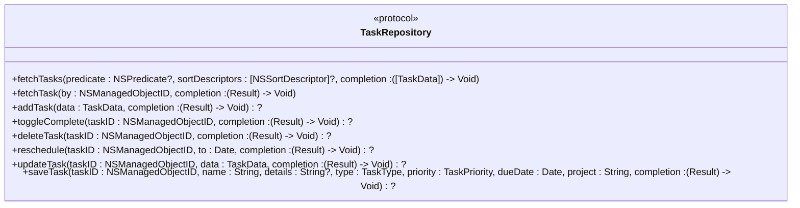
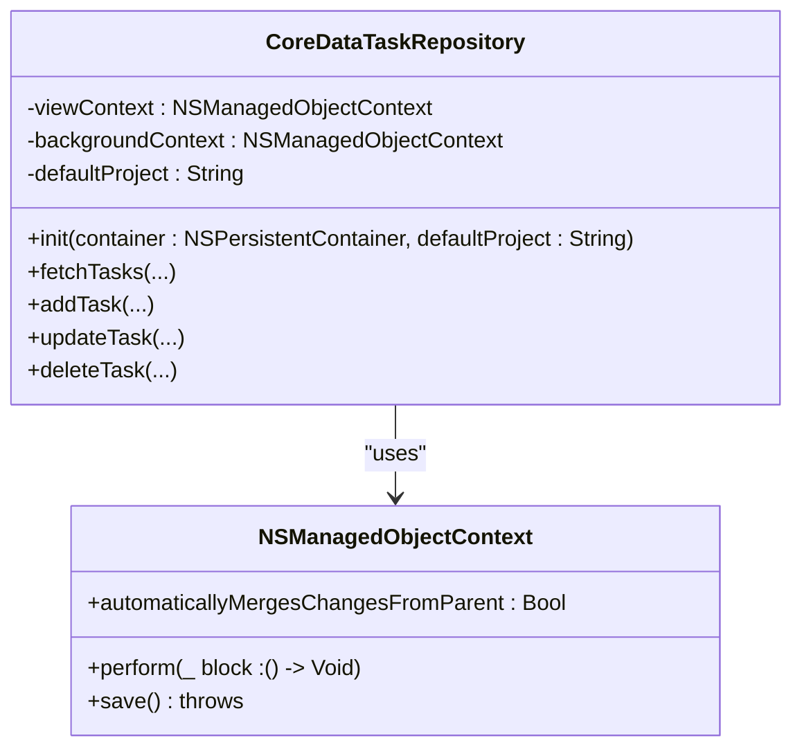
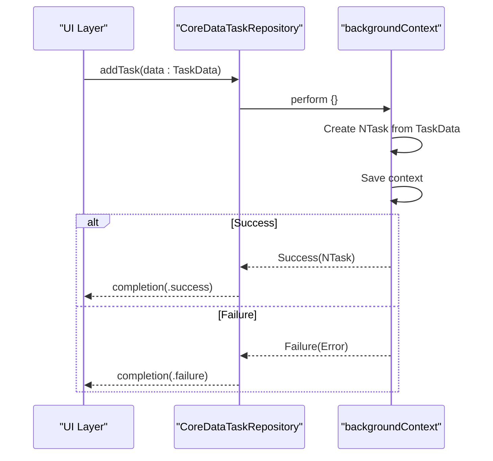
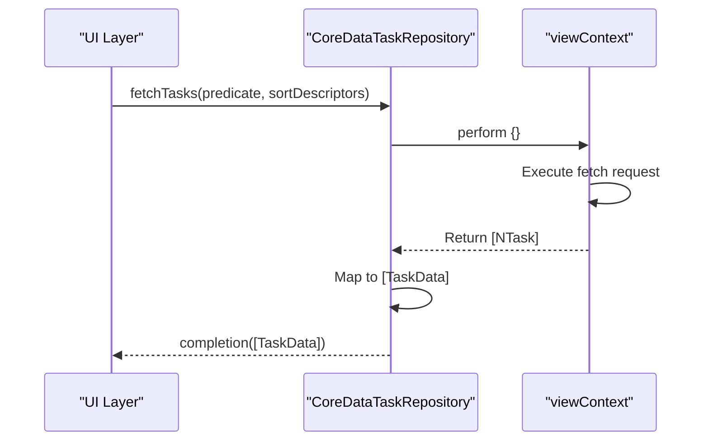
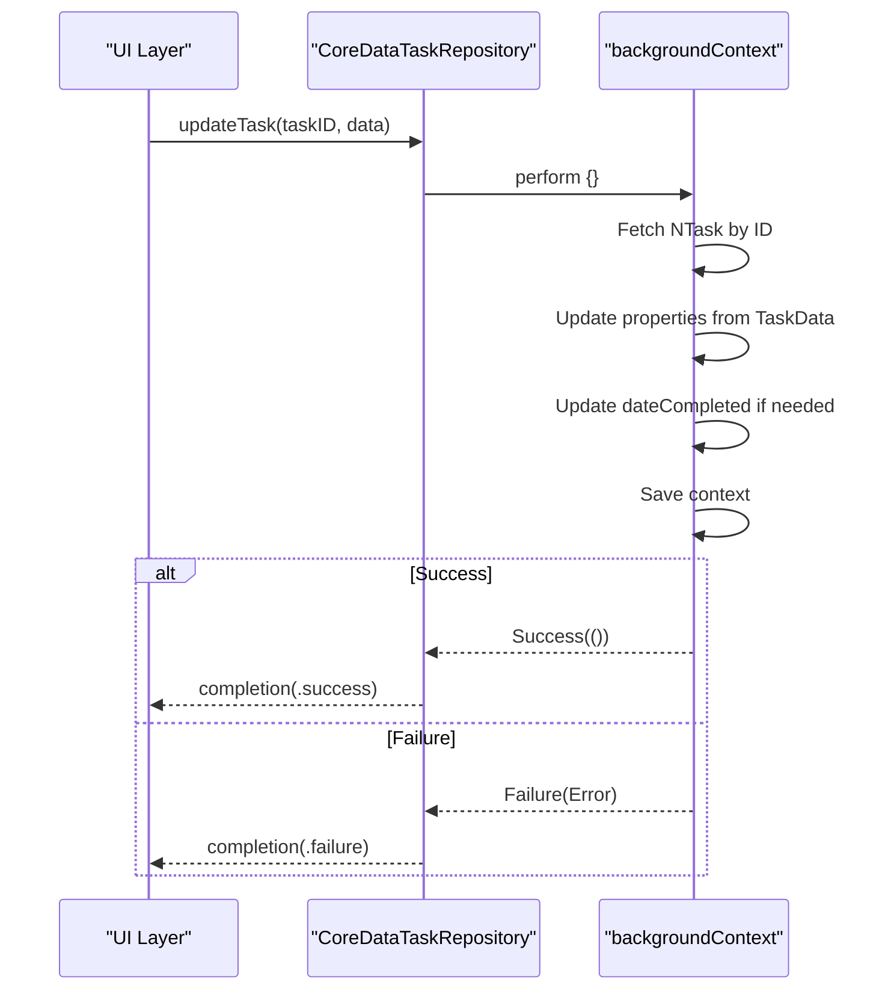
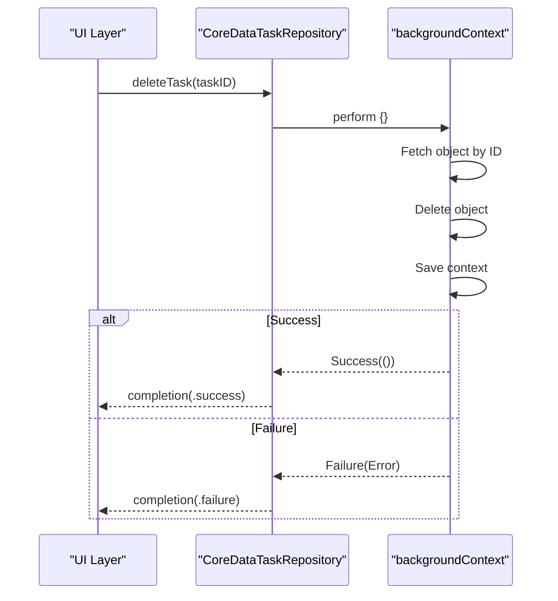
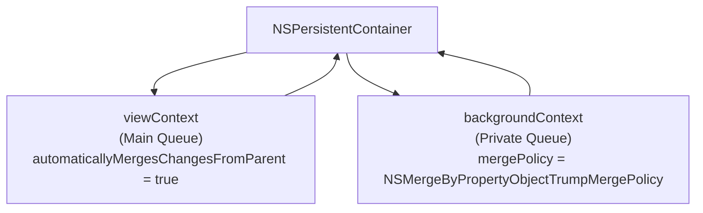
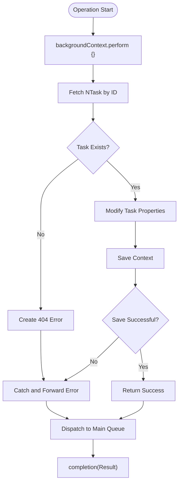

# Task CRUD Operations

<cite>
**Referenced Files in This Document**   
- [TaskRepository.swift](file://To%20Do%20List/Repositories/TaskRepository.swift)
- [CoreDataTaskRepository.swift](file://To%20Do%20List/Repositories/CoreDataTaskRepository.swift)
- [TaskData.swift](file://To%20Do%20List/Models/TaskData.swift)
- [NTask+CoreDataClass.swift](file://To%20Do%20List/NTask+CoreDataClass.swift)
- [NTask+CoreDataProperties.swift](file://To%20Do%20List/NTask+CoreDataProperties.swift)
</cite>

## Table of Contents
1. [Introduction](#introduction)
2. [TaskRepository Protocol Overview](#taskrepository-protocol-overview)
3. [CoreDataTaskRepository Implementation](#coredatataskrepository-implementation)
4. [CRUD Operations](#crud-operations)
    - [Create Task](#create-task)
    - [Fetch Tasks](#fetch-tasks)
    - [Update Task](#update-task)
    - [Delete Task](#delete-task)
5. [Data Mapping: NSManagedObject to Value Type](#data-mapping-nsmanagedobject-to-value-type)
6. [Thread Safety and Context Management](#thread-safety-and-context-management)
7. [Error Handling and Validation](#error-handling-and-validation)
8. [Context Merging and Conflict Resolution](#context-merging-and-conflict-resolution)
9. [Performance Considerations](#performance-considerations)
10. [Best Practices for Efficient Data Management](#best-practices-for-efficient-data-management)

## Introduction
This document provides a comprehensive analysis of the Task CRUD operations within the Tasker application, focusing on the `TaskRepository` protocol and its `CoreDataTaskRepository` implementation. It details how tasks are created, read, updated, and deleted using Core Data with proper thread safety, data mapping, and error handling. The architecture emphasizes separation of concerns by mapping Core Data entities to value types for clean UI integration.

## TaskRepository Protocol Overview
The `TaskRepository` protocol defines a contract for all task persistence operations, enabling dependency injection and testability. It abstracts the underlying storage mechanism and exposes asynchronous methods for all CRUD operations.



**Diagram sources**
- [TaskRepository.swift](file://To%20Do%20List/Repositories/TaskRepository.swift#L6-L117)

**Section sources**
- [TaskRepository.swift](file://To%20Do%20List/Repositories/TaskRepository.swift#L6-L117)

## CoreDataTaskRepository Implementation
`CoreDataTaskRepository` is the concrete implementation of `TaskRepository` using Core Data. It manages two contexts: a `viewContext` for UI-related reads and a `backgroundContext` for all write operations to ensure thread safety.



**Diagram sources**
- [CoreDataTaskRepository.swift](file://To%20Do%20List/Repositories/CoreDataTaskRepository.swift#L10-L25)

**Section sources**
- [CoreDataTaskRepository.swift](file://To%20Do%20List/Repositories/CoreDataTaskRepository.swift#L10-L25)

## CRUD Operations

### Create Task
The `addTask` method creates a new task using the background context to avoid blocking the main thread. It maps `TaskData` to a new `NTask` managed object and saves it.



**Diagram sources**
- [CoreDataTaskRepository.swift](file://To%20Do%20List/Repositories/CoreDataTaskRepository.swift#L74-L92)

**Section sources**
- [CoreDataTaskRepository.swift](file://To%20Do%20List/Repositories/CoreDataTaskRepository.swift#L74-L92)

### Fetch Tasks
The `fetchTasks` method uses the `viewContext` to retrieve tasks, ensuring the UI always displays the most up-to-date information. It supports filtering via predicates and sorting.



**Diagram sources**
- [CoreDataTaskRepository.swift](file://To%20Do%20List/Repositories/CoreDataTaskRepository.swift#L54-L72)

**Section sources**
- [CoreDataTaskRepository.swift](file://To%20Do%20List/Repositories/CoreDataTaskRepository.swift#L54-L72)

### Update Task
The `updateTask` method modifies an existing task's properties using the background context. It preserves the completion status and updates `dateCompleted` only when the status changes.



**Diagram sources**
- [CoreDataTaskRepository.swift](file://To%20Do%20List/Repositories/CoreDataTaskRepository.swift#L348-L380)

**Section sources**
- [CoreDataTaskRepository.swift](file://To%20Do%20List/Repositories/CoreDataTaskRepository.swift#L348-L380)

### Delete Task
The `deleteTask` method removes a task from persistence by deleting its managed object in the background context.



**Diagram sources**
- [CoreDataTaskRepository.swift](file://To%20Do%20List/Repositories/CoreDataTaskRepository.swift#L122-L136)

**Section sources**
- [CoreDataTaskRepository.swift](file://To%20Do%20List/Repositories/CoreDataTaskRepository.swift#L122-L136)

## Data Mapping: NSManagedObject to Value Type
The architecture separates persistence from presentation using `TaskData`, a value type that wraps `NTask`. This ensures the UI layer is not coupled to Core Data.

```mermaid
classDiagram
class NTask {
+name : String?
+isComplete : Bool
+dueDate : NSDate?
+taskDetails : String?
+taskPriority : Int32
+taskType : Int32
+project : String?
+dateAdded : NSDate?
+dateCompleted : NSDate?
}
class TaskData {
+id : NSManagedObjectID?
+name : String
+isComplete : Bool
+dueDate : Date
+details : String?
+priority : TaskPriority
+type : TaskType
+project : String
+dateAdded : Date
+dateCompleted : Date?
}
TaskData --> NTask : "init(managedObject : )"
NTask --> TaskData : "mapped to"
```

**Diagram sources**
- [TaskData.swift](file://To%20Do%20List/Models/TaskData.swift#L10-L56)
- [NTask+CoreDataProperties.swift](file://To%20Do%20List/NTask+CoreDataProperties.swift#L15-L45)

**Section sources**
- [TaskData.swift](file://To%20Do%20List/Models/TaskData.swift#L10-L56)

## Thread Safety and Context Management
The implementation uses a parent-child context relationship for thread safety:
- `viewContext`: Main queue context for UI reads
- `backgroundContext`: Private queue context for all writes



**Diagram sources**
- [CoreDataTaskRepository.swift](file://To%20Do%20List/Repositories/CoreDataTaskRepository.swift#L34-L48)

**Section sources**
- [CoreDataTaskRepository.swift](file://To%20Do%20List/Repositories/CoreDataTaskRepository.swift#L34-L48)

## Error Handling and Validation
All operations include comprehensive error handling with descriptive error messages. The repository validates task existence before modification.



**Diagram sources**
- [CoreDataTaskRepository.swift](file://To%20Do%20List/Repositories/CoreDataTaskRepository.swift#L94-L380)

**Section sources**
- [CoreDataTaskRepository.swift](file://To%20Do%20List/Repositories/CoreDataTaskRepository.swift#L94-L380)

## Context Merging and Conflict Resolution
The repository configures context merging to handle concurrent modifications:
- `viewContext.automaticallyMergesChangesFromParent = true`: Automatically receives changes from parent
- `backgroundContext.mergePolicy = NSMergeByPropertyObjectTrumpMergePolicy`: Background changes override conflicting main context changes

This prevents context staleness and ensures UI reflects the latest saved state, even when multiple contexts modify the same object.

**Section sources**
- [CoreDataTaskRepository.swift](file://To%20Do%20List/Repositories/CoreDataTaskRepository.swift#L44-L48)

## Performance Considerations
The current implementation prioritizes data consistency over batch performance:
- **Frequent Small Saves**: Each operation performs an individual save, which can lead to overhead with many rapid operations
- **Background Processing**: All writes occur off the main thread, preventing UI blocking
- **Automatic Merging**: Real-time updates to UI but may trigger multiple UI refreshes

For high-frequency operations, consider batching multiple changes into a single save to reduce I/O overhead.

**Section sources**
- [CoreDataTaskRepository.swift](file://To%20Do%20List/Repositories/CoreDataTaskRepository.swift#L74-L380)

## Best Practices for Efficient Data Management
1. **Use Background Context for Writes**: Always perform mutations in private queue contexts
2. **Leverage Automatic Merging**: Enable `automaticallyMergesChangesFromParent` for real-time UI updates
3. **Choose Appropriate Merge Policy**: Use `NSMergeByPropertyObjectTrumpMergePolicy` to prioritize background changes
4. **Batch High-Frequency Operations**: Group multiple changes into a single save when possible
5. **Validate Object Existence**: Always check for object existence before modification
6. **Map to Value Types**: Use structs like `TaskData` to decouple UI from Core Data
7. **Handle Errors Gracefully**: Provide meaningful error feedback and recovery options
8. **Use Predicates for Filtering**: Filter at the fetch level rather than in memory
9. **Sort Efficiently**: Apply sort descriptors at the fetch request level
10. **Minimize Context Swapping**: Reduce unnecessary object transfers between contexts

**Section sources**
- [CoreDataTaskRepository.swift](file://To%20Do%20List/Repositories/CoreDataTaskRepository.swift#L10-L454)
- [TaskData.swift](file://To%20Do%20List/Models/TaskData.swift#L10-L56)