# Task Lifecycle Workflows

<cite>
**Referenced Files in This Document**   
- [TaskManager.swift](file://To%20Do%20List/ViewControllers/TaskManager.swift)
- [TaskRepository.swift](file://To%20Do%20List/Repositories/TaskRepository.swift)
- [CoreDataTaskRepository.swift](file://To%20Do%20List/Repositories/CoreDataTaskRepository.swift)
- [TaskData.swift](file://To%20Do%20List/Models/TaskData.swift)
- [NTask+CoreDataProperties.swift](file://To%20Do%20List/NTask+CoreDataProperties.swift)
- [TaskListViewController.swift](file://To%20Do%20List/ViewControllers/TaskListViewController.swift)
- [AppDelegate.swift](file://To%20Do%20List/AppDelegate.swift)
</cite>

## Table of Contents
1. [Introduction](#introduction)
2. [Project Structure](#project-structure)
3. [Core Components](#core-components)
4. [Architecture Overview](#architecture-overview)
5. [Detailed Component Analysis](#detailed-component-analysis)
6. [Task Lifecycle Workflows](#task-lifecycle-workflows)
7. [Data Flow and Synchronization](#data-flow-and-synchronization)
8. [Error Handling and Edge Cases](#error-handling-and-edge-cases)
9. [Best Practices](#best-practices)
10. [Conclusion](#conclusion)

## Introduction
This document provides a comprehensive analysis of the task lifecycle workflows in the Tasker application. It details the complete journey of a task from creation to deletion, covering user interactions, data validation, persistence, and synchronization. The system employs both legacy (TaskManager) and modern (TaskRepository) patterns, with a transition toward dependency injection and testable architecture. Tasks are persisted using Core Data with CloudKit synchronization for cross-device consistency.

## Project Structure
The Tasker application follows a layered architecture with clear separation of concerns. The project is organized into feature-based directories including Model, Models, Repositories, Services, View, and ViewControllers. Asset resources are contained in Assets.xcassets, while core data models are defined in the root directory. The architecture supports both legacy singleton patterns and modern dependency injection through a repository pattern.

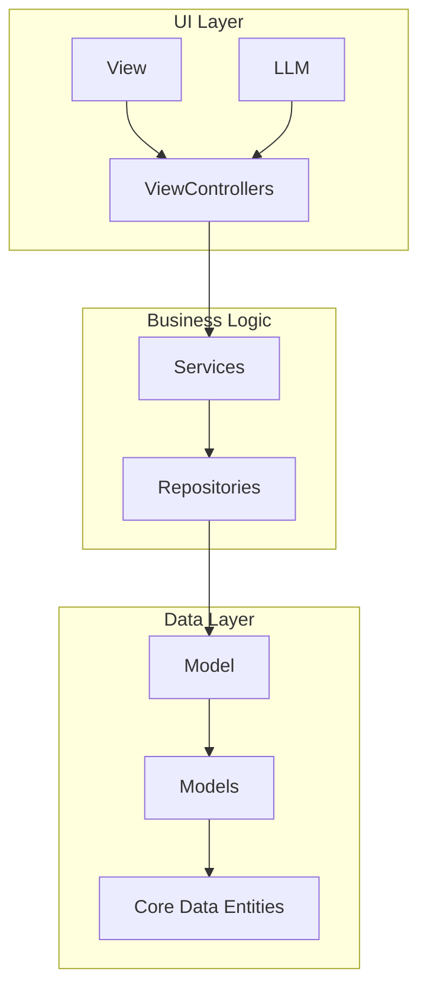
```mermaid
graph TB
subgraph "UI Layer"
A[ViewControllers]
B[View]
C[LLM]
end
subgraph "Business Logic"
D[Services]
E[Repositories]
end
subgraph "Data Layer"
F[Model]
G[Models]
H[Core Data Entities]
end
A --> D
B --> A
C --> A
D --> E
E --> F
F --> G
G --> H
```

**Diagram sources**
- [TaskManager.swift](file://To%20Do%20List/ViewControllers/TaskManager.swift)
- [TaskRepository.swift](file://To%20Do%20List/Repositories/TaskRepository.swift)
- [TaskData.swift](file://To%20Do%20List/Models/TaskData.swift)

**Section sources**
- [TaskManager.swift](file://To%20Do%20List/ViewControllers/TaskManager.swift)
- [TaskRepository.swift](file://To%20Do%20List/Repositories/TaskRepository.swift)

## Core Components
The task management system consists of several key components that work together to manage the task lifecycle. The TaskManager provides legacy singleton access to task operations, while TaskRepository introduces a protocol-based approach for dependency injection. TaskData serves as a presentation model that bridges the Core Data entities with the UI layer. Core Data entities like NTask represent the persistent data model, and ViewControllers handle user interactions and UI updates.

**Section sources**
- [TaskManager.swift](file://To%20Do%20List/ViewControllers/TaskManager.swift)
- [TaskRepository.swift](file://To%20Do%20List/Repositories/TaskRepository.swift)
- [TaskData.swift](file://To%20Do%20List/Models/TaskData.swift)

## Architecture Overview
The Tasker application employs a layered architecture with clear separation between UI, business logic, and data persistence layers. The system is transitioning from a legacy singleton pattern (TaskManager) to a modern repository pattern (TaskRepository) for improved testability and maintainability. Core Data serves as the primary persistence mechanism with CloudKit integration for seamless cross-device synchronization. The architecture supports offline-first operations with automatic background synchronization when connectivity is available.

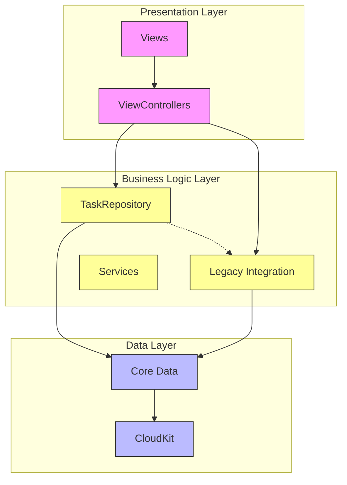
```mermaid
graph TB
subgraph "Presentation Layer"
A[ViewControllers]
B[Views]
end
subgraph "Business Logic Layer"
C[TaskRepository]
D[TaskManager]
E[Services]
end
subgraph "Data Layer"
F[Core Data]
G[CloudKit]
end
A --> C
A --> D
B --> A
C --> F
D --> F
F --> G
C -.-> D[Legacy Integration]
style A fill:#f9f,stroke:#333
style B fill:#f9f,stroke:#333
style C fill:#ff9,stroke:#333
style D fill:#ff9,stroke:#333
style E fill:#ff9,stroke:#333
style F fill:#bbf,stroke:#333
style G fill:#bbf,stroke:#333
```

**Diagram sources**
- [TaskManager.swift](file://To%20Do%20List/ViewControllers/TaskManager.swift)
- [TaskRepository.swift](file://To%20Do%20List/Repositories/TaskRepository.swift)
- [AppDelegate.swift](file://To%20Do%20List/AppDelegate.swift)

## Detailed Component Analysis

### TaskManager Analysis
The TaskManager class is a singleton that provides legacy access to task management functionality. It handles CRUD operations for tasks using Core Data and maintains various filtering methods for retrieving tasks based on project, date, and completion status. The class uses NSManagedObjectContext for database operations and provides methods for retrieving tasks in different contexts.

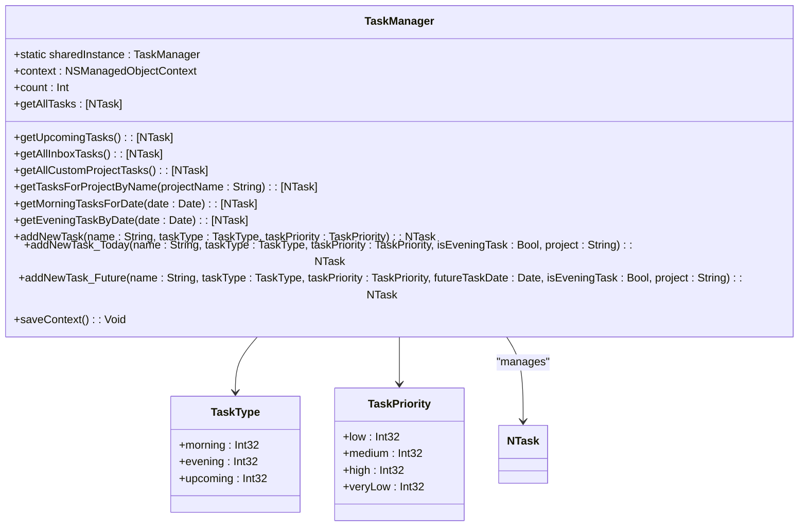
```mermaid
classDiagram
class TaskManager {
+static sharedInstance : TaskManager
+context : NSManagedObjectContext
+count : Int
+getAllTasks : [NTask]
+getUpcomingTasks() : [NTask]
+getAllInboxTasks() : [NTask]
+getAllCustomProjectTasks() : [NTask]
+getTasksForProjectByName(projectName : String) : [NTask]
+getMorningTasksForDate(date : Date) : [NTask]
+getEveningTaskByDate(date : Date) : [NTask]
+addNewTask(name : String, taskType : TaskType, taskPriority : TaskPriority) : NTask
+addNewTask_Today(name : String, taskType : TaskType, taskPriority : TaskPriority, isEveningTask : Bool, project : String) : NTask
+addNewTask_Future(name : String, taskType : TaskType, taskPriority : TaskPriority, futureTaskDate : Date, isEveningTask : Bool, project : String) : NTask
+saveContext() : Void
}
class TaskType {
+morning : Int32
+evening : Int32
+upcoming : Int32
}
class TaskPriority {
+low : Int32
+medium : Int32
+high : Int32
+veryLow : Int32
}
TaskManager --> TaskType
TaskManager --> TaskPriority
TaskManager --> NTask : "manages"
```

**Diagram sources**
- [TaskManager.swift](file://To%20Do%20List/ViewControllers/TaskManager.swift#L0-L199)

**Section sources**
- [TaskManager.swift](file://To%20Do%20List/ViewControllers/TaskManager.swift)

### TaskRepository Analysis
The TaskRepository protocol defines a modern, testable interface for task management operations. It uses dependency injection and asynchronous completion handlers to improve code maintainability and testability. The protocol abstracts data access operations and allows for different implementations, including mocking for unit tests.

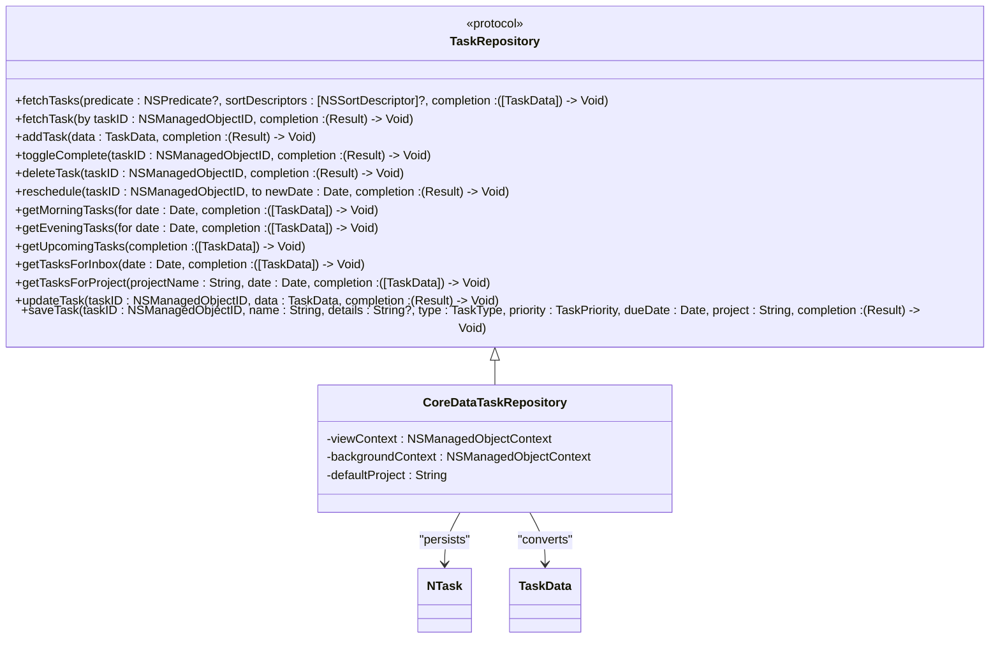
```mermaid
classDiagram
class TaskRepository {
<<protocol>>
+fetchTasks(predicate : NSPredicate?, sortDescriptors : [NSSortDescriptor]?, completion : ([TaskData]) -> Void)
+fetchTask(by taskID : NSManagedObjectID, completion : (Result<NTask, Error>) -> Void)
+addTask(data : TaskData, completion : (Result<NTask, Error>) -> Void)
+toggleComplete(taskID : NSManagedObjectID, completion : (Result<Void, Error>) -> Void)
+deleteTask(taskID : NSManagedObjectID, completion : (Result<Void, Error>) -> Void)
+reschedule(taskID : NSManagedObjectID, to newDate : Date, completion : (Result<Void, Error>) -> Void)
+getMorningTasks(for date : Date, completion : ([TaskData]) -> Void)
+getEveningTasks(for date : Date, completion : ([TaskData]) -> Void)
+getUpcomingTasks(completion : ([TaskData]) -> Void)
+getTasksForInbox(date : Date, completion : ([TaskData]) -> Void)
+getTasksForProject(projectName : String, date : Date, completion : ([TaskData]) -> Void)
+updateTask(taskID : NSManagedObjectID, data : TaskData, completion : (Result<Void, Error>) -> Void)
+saveTask(taskID : NSManagedObjectID, name : String, details : String?, type : TaskType, priority : TaskPriority, dueDate : Date, project : String, completion : (Result<Void, Error>) -> Void)
}
class CoreDataTaskRepository {
-viewContext : NSManagedObjectContext
-backgroundContext : NSManagedObjectContext
-defaultProject : String
}
TaskRepository <|-- CoreDataTaskRepository
CoreDataTaskRepository --> NTask : "persists"
CoreDataTaskRepository --> TaskData : "converts"
```

**Diagram sources**
- [TaskRepository.swift](file://To%20Do%20List/Repositories/TaskRepository.swift#L0-L117)

**Section sources**
- [TaskRepository.swift](file://To%20Do%20List/Repositories/TaskRepository.swift)

### CoreDataTaskRepository Analysis
The CoreDataTaskRepository class provides the concrete implementation of the TaskRepository protocol using Core Data. It uses separate view and background contexts to ensure thread safety and optimal performance. The repository handles all data access operations asynchronously and converts between Core Data managed objects and the TaskData presentation model.

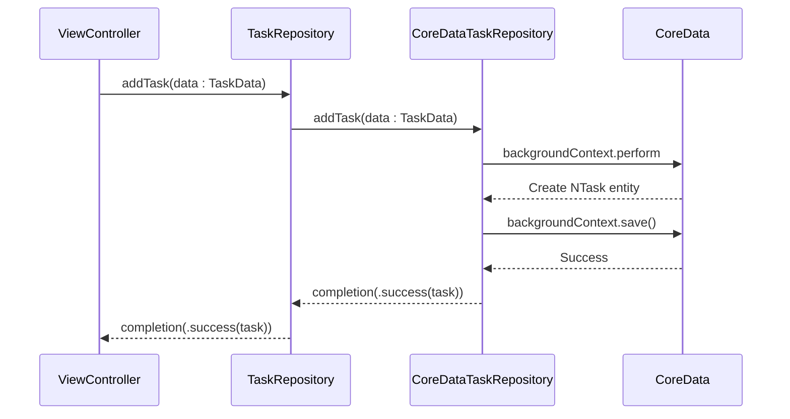
```mermaid
sequenceDiagram
participant ViewController
participant TaskRepository
participant CoreDataTaskRepository
participant CoreData
ViewController->>TaskRepository : addTask(data : TaskData)
TaskRepository->>CoreDataTaskRepository : addTask(data : TaskData)
CoreDataTaskRepository->>CoreData : backgroundContext.perform
CoreData-->>CoreDataTaskRepository : Create NTask entity
CoreDataTaskRepository->>CoreData : backgroundContext.save()
CoreData-->>CoreDataTaskRepository : Success
CoreDataTaskRepository-->>TaskRepository : completion(.success(task))
TaskRepository-->>ViewController : completion(.success(task))
```

**Diagram sources**
- [CoreDataTaskRepository.swift](file://To%20Do%20List/Repositories/CoreDataTaskRepository.swift#L0-L199)

**Section sources**
- [CoreDataTaskRepository.swift](file://To%20Do%20List/Repositories/CoreDataTaskRepository.swift)

## Task Lifecycle Workflows

### Task Creation Workflow
The task creation process begins with user input in the UI layer, typically through an AddTaskViewController. The entered data is validated and packaged into a TaskData object, which is then passed to the TaskRepository for persistence. The CoreDataTaskRepository creates a new NTask entity in the background context, sets its properties, and saves the context.

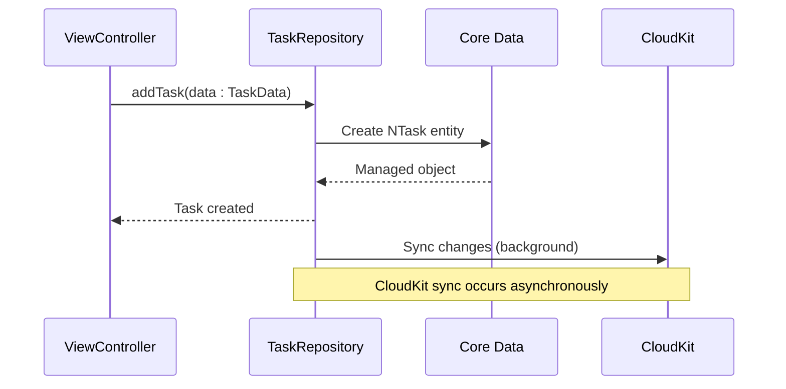
```mermaid
sequenceDiagram
participant UI as ViewController
participant Repository as TaskRepository
participant CoreData as Core Data
participant CloudKit as CloudKit
UI->>Repository : addTask(data : TaskData)
Repository->>CoreData : Create NTask entity
CoreData-->>Repository : Managed object
Repository-->>UI : Task created
Repository->>CloudKit : Sync changes (background)
Note over Repository,CloudKit : CloudKit sync occurs asynchronously
```

**Diagram sources**
- [CoreDataTaskRepository.swift](file://To%20Do%20List/Repositories/CoreDataTaskRepository.swift#L100-L150)
- [TaskData.swift](file://To%20Do%20List/Models/TaskData.swift#L0-L56)

**Section sources**
- [CoreDataTaskRepository.swift](file://To%20Do%20List/Repositories/CoreDataTaskRepository.swift)
- [TaskData.swift](file://To%20Do%20List/Models/TaskData.swift)

### Task Editing Workflow
When a user edits a task, the TaskDetailView captures the changes and passes them to the TaskRepository's saveTask method. The repository retrieves the task using its NSManagedObjectID, updates the properties in the background context, and saves the changes. The UI is updated through NSFetchedResultsController or completion handlers.

```mermaid
flowchart TD
A[User edits task] --> B[TaskDetailView captures changes]
B --> C[Call TaskRepository.saveTask()]
C --> D[CoreDataTaskRepository performs update]
D --> E[Update NTask properties]
E --> F[Save background context]
F --> G[Merge changes to view context]
G --> H[UI updates via NSFetchedResultsController]
H --> I[Sync to CloudKit]
```

**Diagram sources**
- [CoreDataTaskRepository.swift](file://To%20Do%20List/Repositories/CoreDataTaskRepository.swift#L250-L300)
- [TaskDetailView.swift](file://To%20Do%20List/View/TaskDetailView.swift)

**Section sources**
- [CoreDataTaskRepository.swift](file://To%20Do%20List/Repositories/CoreDataTaskRepository.swift)
- [TaskDetailView.swift](file://To%20Do%20List/View/TaskDetailView.swift)

### Task Completion Workflow
Marking a task as complete triggers the toggleComplete method on TaskRepository. The CoreDataTaskRepository toggles the isComplete property and sets the dateCompleted timestamp if the task is being completed. The change is saved to Core Data and triggers a notification for UI updates and analytics calculations.

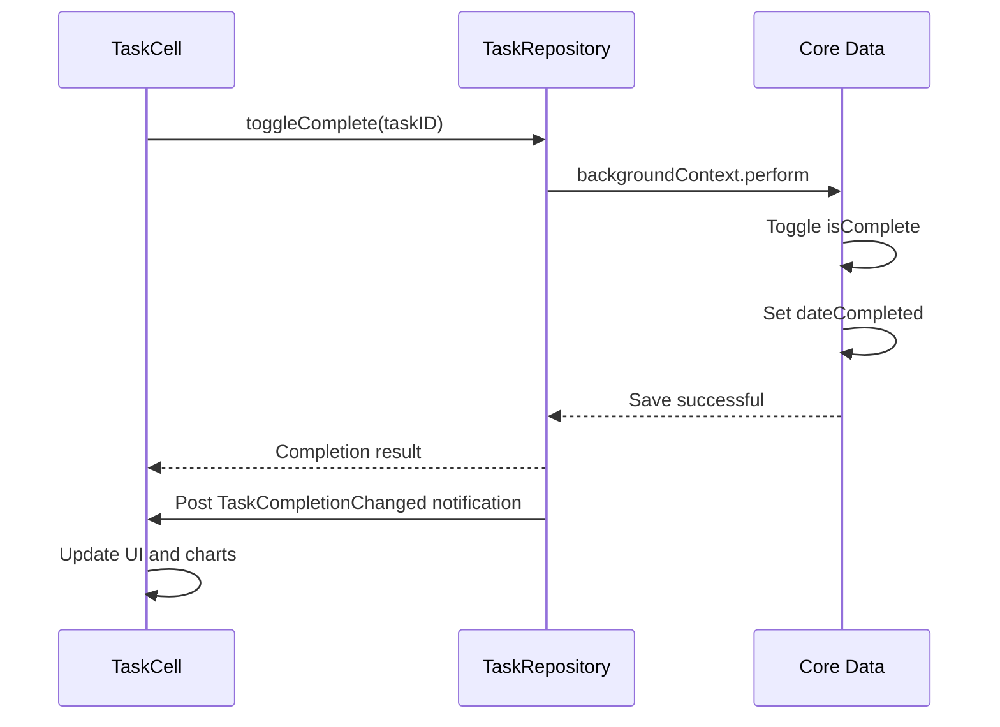
```mermaid
sequenceDiagram
participant UI as TaskCell
participant Repository as TaskRepository
participant CoreData as Core Data
UI->>Repository : toggleComplete(taskID)
Repository->>CoreData : backgroundContext.perform
CoreData->>CoreData : Toggle isComplete
CoreData->>CoreData : Set dateCompleted
CoreData-->>Repository : Save successful
Repository-->>UI : Completion result
Repository->>UI : Post TaskCompletionChanged notification
UI->>UI : Update UI and charts
```

**Diagram sources**
- [CoreDataTaskRepository.swift](file://To%20Do%20List/Repositories/CoreDataTaskRepository.swift#L150-L200)
- [TaskCard.swift](file://To%20Do%20List/View/TaskCard.swift)

**Section sources**
- [CoreDataTaskRepository.swift](file://To%20Do%20List/Repositories/CoreDataTaskRepository.swift)
- [TaskCard.swift](file://To%20Do%20List/View/TaskCard.swift)

### Task Deletion Workflow
Deleting a task involves calling the deleteTask method on TaskRepository with the task's NSManagedObjectID. The CoreDataTaskRepository performs the deletion in the background context, removing the NTask entity from the persistent store. The UI is updated through NSFetchedResultsController or completion handlers.

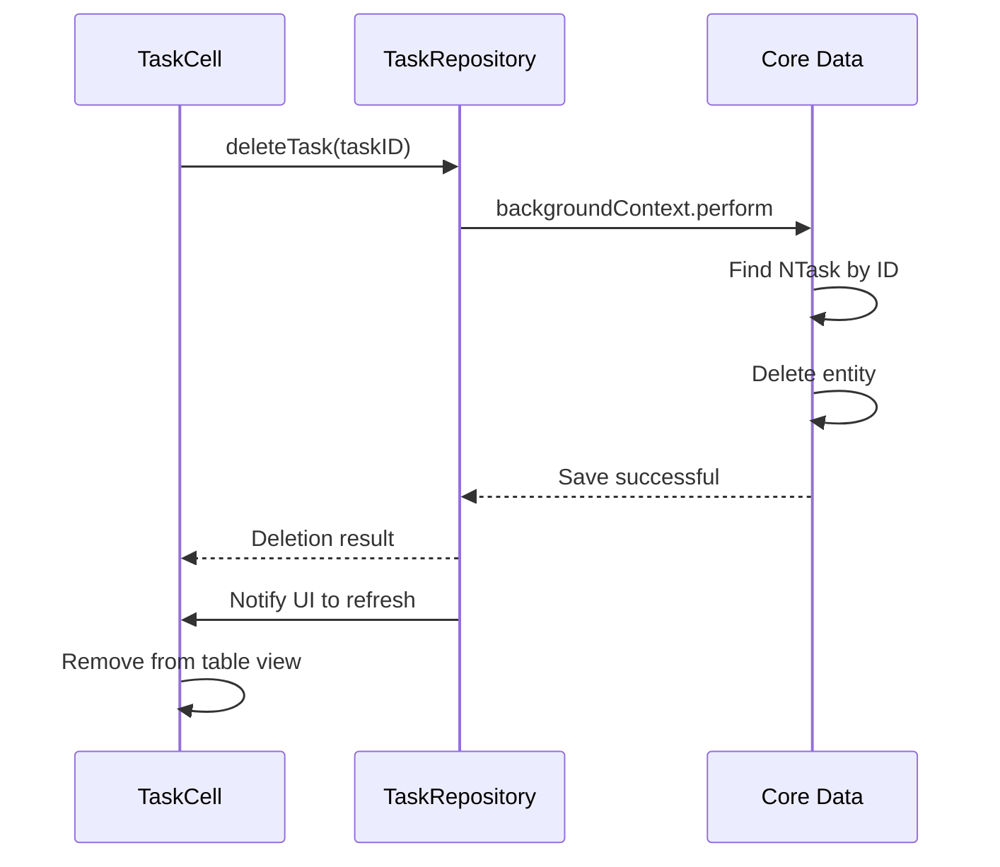
```mermaid
sequenceDiagram
participant UI as TaskCell
participant Repository as TaskRepository
participant CoreData as Core Data
UI->>Repository : deleteTask(taskID)
Repository->>CoreData : backgroundContext.perform
CoreData->>CoreData : Find NTask by ID
CoreData->>CoreData : Delete entity
CoreData-->>Repository : Save successful
Repository-->>UI : Deletion result
Repository->>UI : Notify UI to refresh
UI->>UI : Remove from table view
```

**Diagram sources**
- [CoreDataTaskRepository.swift](file://To%20Do%20List/Repositories/CoreDataTaskRepository.swift#L200-L250)
- [TaskCard.swift](file://To%20Do%20List/View/TaskCard.swift)

**Section sources**
- [CoreDataTaskRepository.swift](file://To%20Do%20List/Repositories/CoreDataTaskRepository.swift)
- [TaskCard.swift](file://To%20Do%20List/View/TaskCard.swift)

## Data Flow and Synchronization

### Core Data Entity Model
The NTask entity represents the core data model for tasks in the application. It contains properties for task name, completion status, due date, priority, project assignment, and timestamps for creation and completion.

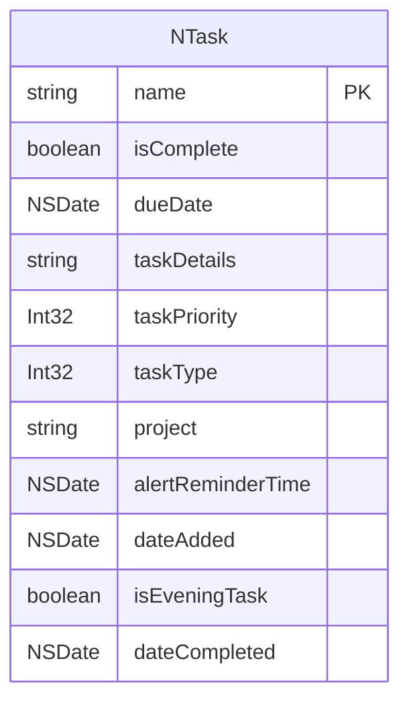
```mermaid
erDiagram
NTask {
string name PK
boolean isComplete
NSDate dueDate
string taskDetails
Int32 taskPriority
Int32 taskType
string project
NSDate alertReminderTime
NSDate dateAdded
boolean isEveningTask
NSDate dateCompleted
}
```

**Diagram sources**
- [NTask+CoreDataProperties.swift](file://To%20Do%20List/NTask+CoreDataProperties.swift#L0-L53)

**Section sources**
- [NTask+CoreDataProperties.swift](file://To%20Do%20List/NTask+CoreDataProperties.swift)

### TaskData Presentation Model
The TaskData struct serves as a presentation model that bridges the Core Data entities with the UI layer. It provides a clean, Swift-native interface to task data, abstracting away Core Data specifics and enabling easier testing and manipulation.

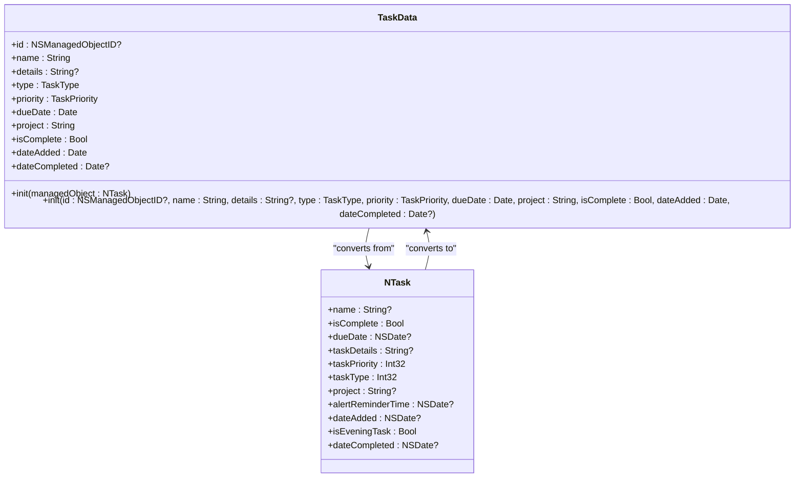
```mermaid
classDiagram
class TaskData {
+id : NSManagedObjectID?
+name : String
+details : String?
+type : TaskType
+priority : TaskPriority
+dueDate : Date
+project : String
+isComplete : Bool
+dateAdded : Date
+dateCompleted : Date?
+init(managedObject : NTask)
+init(id : NSManagedObjectID?, name : String, details : String?, type : TaskType, priority : TaskPriority, dueDate : Date, project : String, isComplete : Bool, dateAdded : Date, dateCompleted : Date?)
}
class NTask {
+name : String?
+isComplete : Bool
+dueDate : NSDate?
+taskDetails : String?
+taskPriority : Int32
+taskType : Int32
+project : String?
+alertReminderTime : NSDate?
+dateAdded : NSDate?
+isEveningTask : Bool
+dateCompleted : NSDate?
}
TaskData --> NTask : "converts from"
NTask --> TaskData : "converts to"
```

**Diagram sources**
- [TaskData.swift](file://To%20Do%20List/Models/TaskData.swift#L0-L56)
- [NTask+CoreDataProperties.swift](file://To%20Do%20List/NTask+CoreDataProperties.swift#L0-L53)

**Section sources**
- [TaskData.swift](file://To%20Do%20List/Models/TaskData.swift)
- [NTask+CoreDataProperties.swift](file://To%20Do%20List/NTask+CoreDataProperties.swift)

### CloudKit Synchronization
The application uses NSPersistentCloudKitContainer to synchronize task data across devices via iCloud. The Core Data stack is configured with CloudKit container options, enabling automatic background synchronization and conflict resolution.

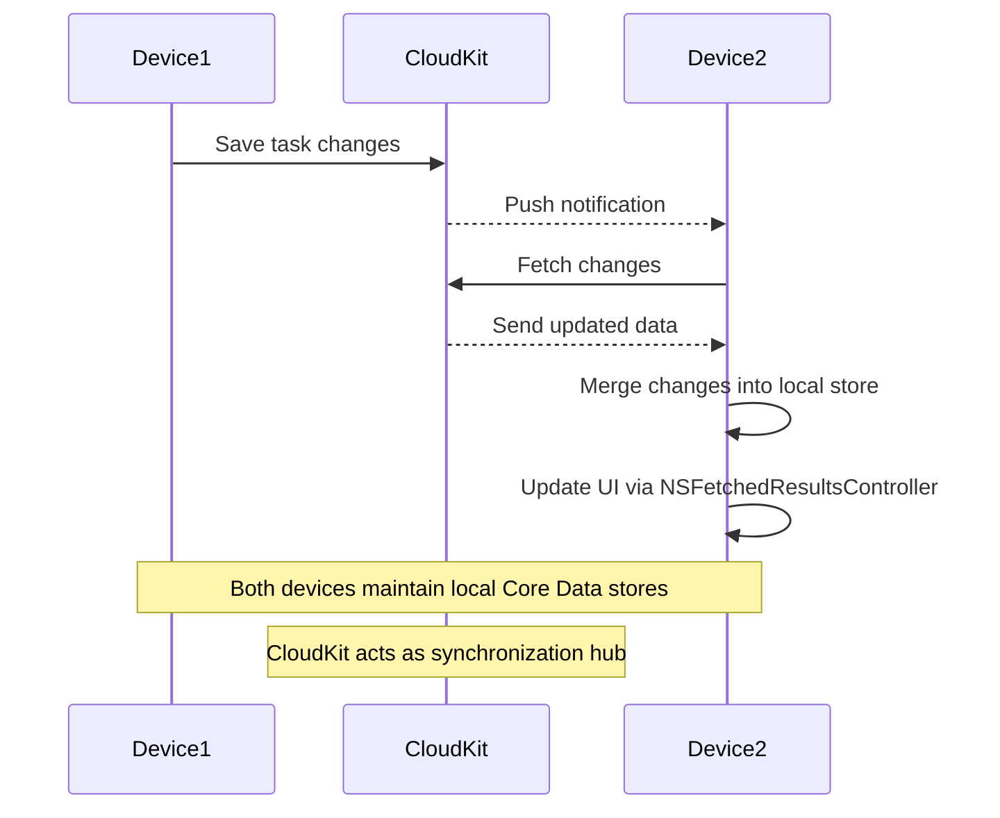
```mermaid
sequenceDiagram
participant Device1
participant CloudKit
participant Device2
Device1->>CloudKit : Save task changes
CloudKit-->>Device2 : Push notification
Device2->>CloudKit : Fetch changes
CloudKit-->>Device2 : Send updated data
Device2->>Device2 : Merge changes into local store
Device2->>Device2 : Update UI via NSFetchedResultsController
Note over Device1,Device2 : Both devices maintain local Core Data stores
Note over CloudKit : CloudKit acts as synchronization hub
```

**Diagram sources**
- [AppDelegate.swift](file://To%20Do%20List/AppDelegate.swift#L100-L192)

**Section sources**
- [AppDelegate.swift](file://To%20Do%20List/AppDelegate.swift)

## Error Handling and Edge Cases

### Incomplete Task Submissions
The system handles incomplete task submissions through validation at multiple levels. The UI layer validates required fields before submission, while the data layer ensures data integrity through Core Data constraints. If a task is created with incomplete data, default values are applied based on business rules.

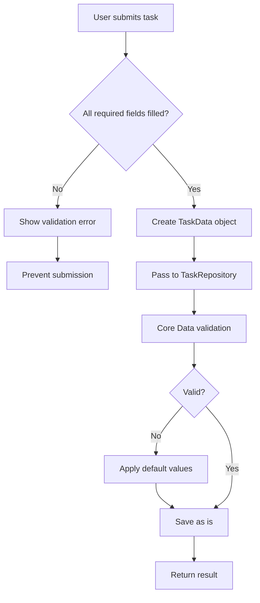
```mermaid
flowchart TD
A[User submits task] --> B{All required fields filled?}
B --> |No| C[Show validation error]
C --> D[Prevent submission]
B --> |Yes| E[Create TaskData object]
E --> F[Pass to TaskRepository]
F --> G[Core Data validation]
G --> H{Valid?}
H --> |No| I[Apply default values]
I --> J[Save with defaults]
H --> |Yes| J[Save as is]
J --> K[Return result]
```

**Section sources**
- [TaskRepository.swift](file://To%20Do%20List/Repositories/TaskRepository.swift)
- [CoreDataTaskRepository.swift](file://To%20Do%20List/Repositories/CoreDataTaskRepository.swift)

### Offline Persistence
The application follows an offline-first design, allowing users to create, edit, and complete tasks without network connectivity. All changes are persisted locally using Core Data and synchronized with CloudKit when connectivity is restored.

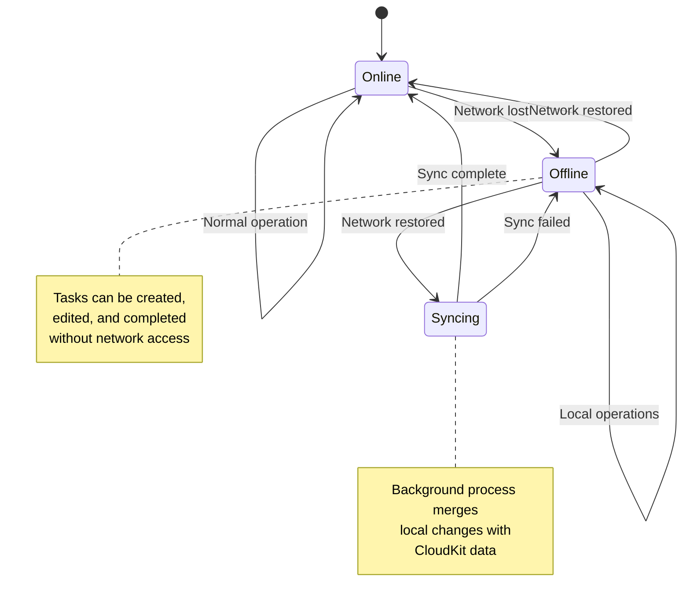
```mermaid
stateDiagram-v2
[*] --> Online
Online --> Offline : Network lost
Offline --> Online : Network restored
Online --> Online : Normal operation
Offline --> Offline : Local operations
Offline --> Syncing : Network restored
Syncing --> Online : Sync complete
Syncing --> Offline : Sync failed
note right of Offline
Tasks can be created,<br/>edited, and completed<br/>without network access
end note
note right of Syncing
Background process merges<br/>local changes with<br/>CloudKit data
end note
```

**Section sources**
- [AppDelegate.swift](file://To%20Do%20List/AppDelegate.swift)
- [CoreDataTaskRepository.swift](file://To%20Do%20List/Repositories/CoreDataTaskRepository.swift)

### Conflict Resolution During Sync
When conflicts occur during CloudKit synchronization, the system uses NSMergeByPropertyStoreTrumpMergePolicy to resolve them. This policy favors the store's version of conflicting properties, ensuring data consistency across devices.

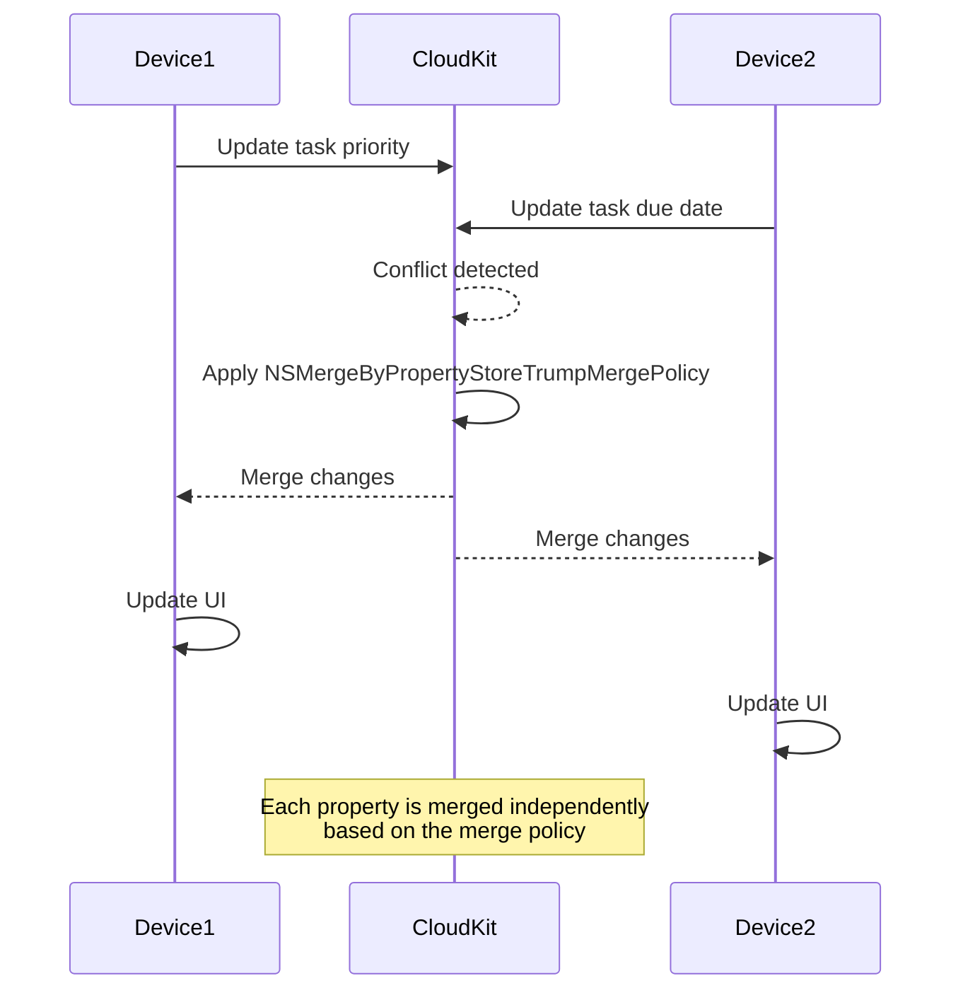
```mermaid
sequenceDiagram
participant Device1
participant CloudKit
participant Device2
Device1->>CloudKit : Update task priority
Device2->>CloudKit : Update task due date
CloudKit-->>CloudKit : Conflict detected
CloudKit->>CloudKit : Apply NSMergeByPropertyStoreTrumpMergePolicy
CloudKit-->>Device1 : Merge changes
CloudKit-->>Device2 : Merge changes
Device1->>Device1 : Update UI
Device2->>Device2 : Update UI
Note over CloudKit : Each property is merged independently<br/>based on the merge policy
```

**Diagram sources**
- [AppDelegate.swift](file://To%20Do%20List/AppDelegate.swift#L150-L192)

**Section sources**
- [AppDelegate.swift](file://To%20Do%20List/AppDelegate.swift)

## Best Practices

### Legacy and Modern Pattern Integration
The application demonstrates a practical approach to transitioning from legacy singleton patterns to modern dependency injection. The TaskManager singleton coexists with the TaskRepository protocol, allowing for gradual migration while maintaining backward compatibility.

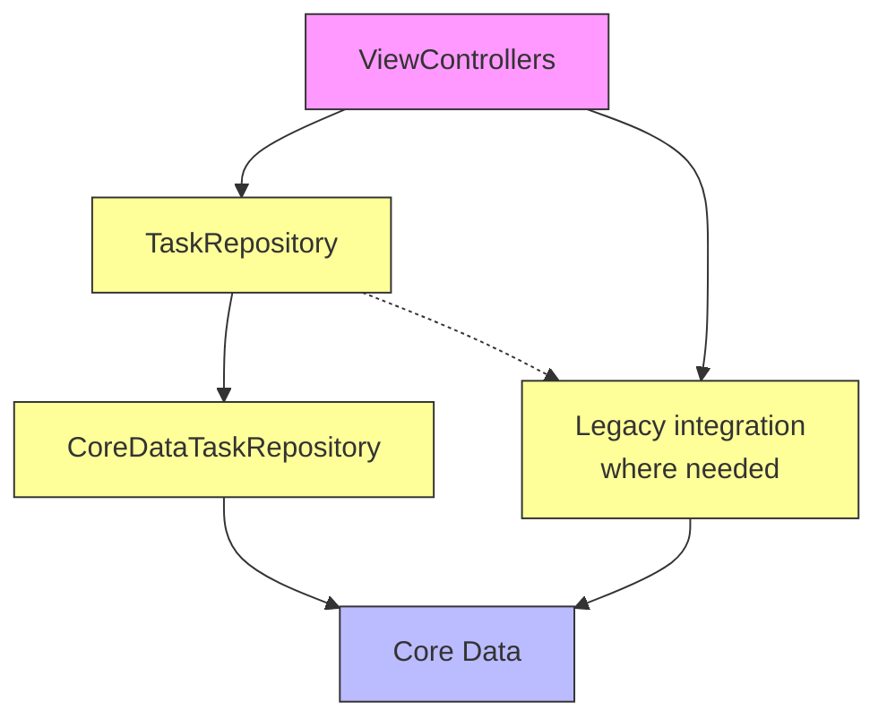
```mermaid
graph TB
A[ViewControllers] --> B[TaskRepository]
A --> C[TaskManager]
B --> D[CoreDataTaskRepository]
D --> E[Core Data]
C --> E
B -.-> C[Legacy integration<br/>where needed]
style A fill:#f9f,stroke:#333
style B fill:#ff9,stroke:#333
style C fill:#ff9,stroke:#333
style D fill:#ff9,stroke:#333
style E fill:#bbf,stroke:#333
```

**Section sources**
- [TaskManager.swift](file://To%20Do%20List/ViewControllers/TaskManager.swift)
- [TaskRepository.swift](file://To%20Do%20List/Repositories/TaskRepository.swift)

### Priority Assignment (P0-P4)
The system implements a priority system with four levels (P0-P3) represented by TaskPriority enum. Each priority level has a corresponding score value used in the gamification system, with higher priorities yielding more points when completed.

```swift
enum TaskPriority: Int32, CaseIterable {
    case low = 1          // P0 – Highest priority
    case medium = 2       // P1
    case high = 3         // P2
    case veryLow = 4      // P3 – Lowest priority
    
    var scoreValue: Int {
        switch self {
        case .high:      return 3
        case .medium:    return 2
        case .low:       return 1
        case .veryLow:   return 0
        }
    }
}
```

**Section sources**
- [TaskManager.swift](file://To%20Do%20List/ViewControllers/TaskManager.swift#L10-L50)

### Due Date Scheduling
Tasks can be scheduled for specific dates with different types (morning, evening, upcoming). The system handles date scheduling through the dueDate property and taskType classification, allowing for flexible task organization.

```swift
// Example: Creating a future task
let futureTask = taskManager.addNewTask_Future(
    name: "Complete project",
    taskType: .upcoming,
    taskPriority: .high,
    futureTaskDate: Date().adding(days: 7),
    isEveningTask: false,
    project: "Work"
)
```

**Section sources**
- [TaskManager.swift](file://To%20Do%20List/ViewControllers/TaskManager.swift#L700-L750)

### State Transitions
The task state model includes completion status and date tracking, enabling rich analytics and user feedback. The isComplete flag controls the visual representation of tasks, while dateCompleted enables historical analysis and streak tracking.

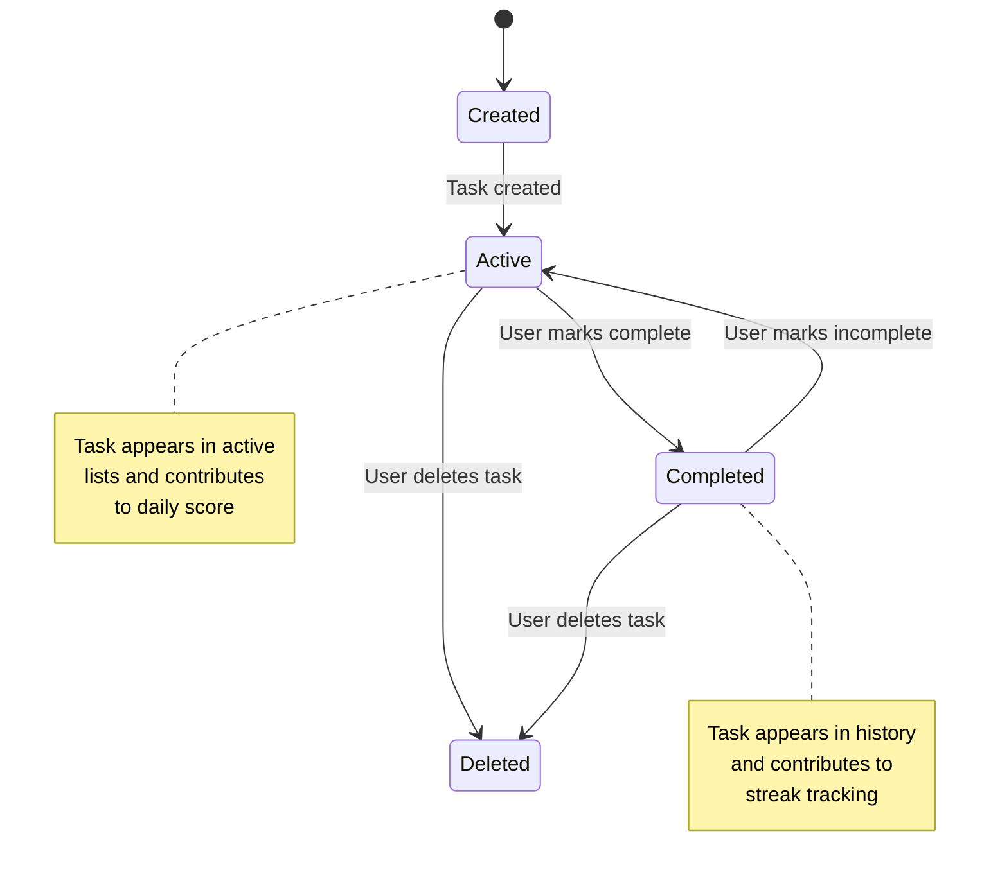
```mermaid
stateDiagram-v2
[*] --> Created
Created --> Active : Task created
Active --> Completed : User marks complete
Completed --> Active : User marks incomplete
Active --> Deleted : User deletes task
Completed --> Deleted : User deletes task
note right of Active
Task appears in active<br/>lists and contributes<br/>to daily score
end note
note right of Completed
Task appears in history<br/>and contributes to<br/>streak tracking
end note
```

**Section sources**
- [CoreDataTaskRepository.swift](file://To%20Do%20List/Repositories/CoreDataTaskRepository.swift#L150-L200)
- [NTask+CoreDataProperties.swift](file://To%20Do%20List/NTask+CoreDataProperties.swift)

## Conclusion
The Tasker application implements a robust task lifecycle management system with comprehensive support for creation, editing, completion, and deletion workflows. The architecture successfully bridges legacy and modern patterns, providing a solid foundation for future development. The integration of Core Data with CloudKit enables seamless cross-device synchronization while maintaining offline functionality. The use of a presentation model (TaskData) effectively separates concerns between the UI and data layers, improving code maintainability and testability. As the application continues to evolve, further migration from the TaskManager singleton to the TaskRepository protocol will enhance testability and flexibility.