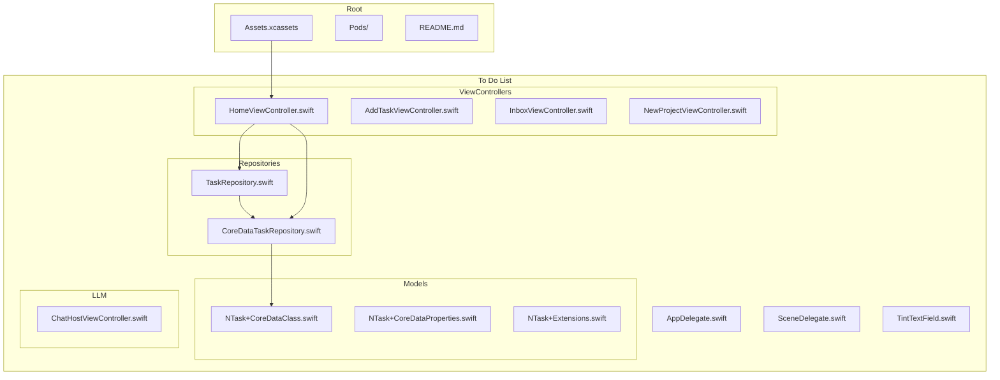
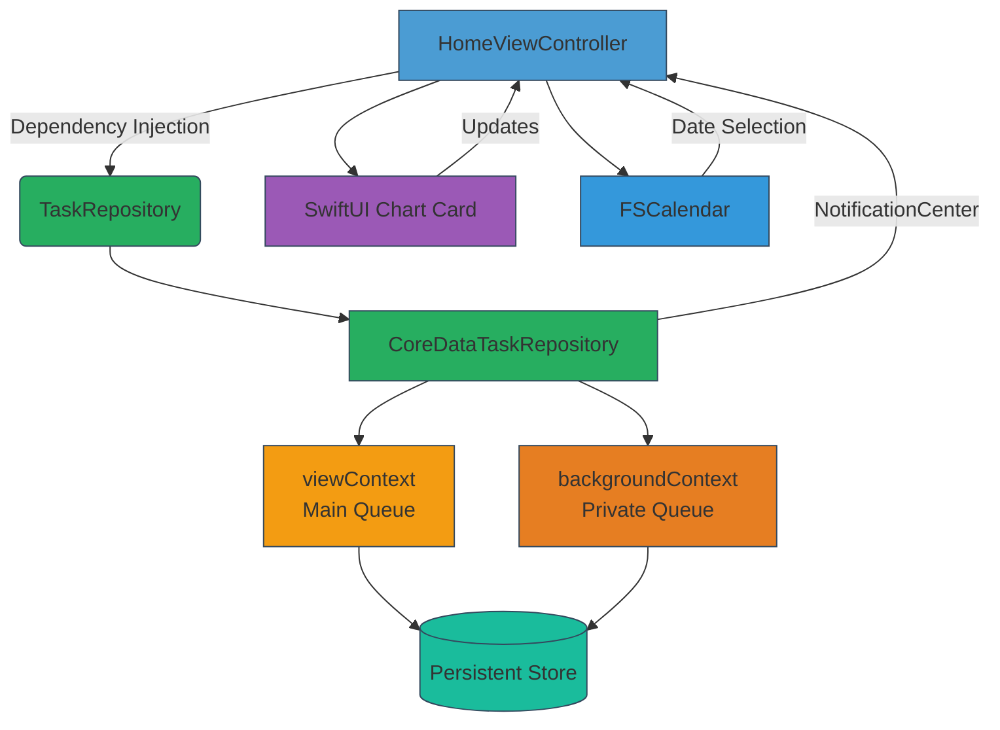
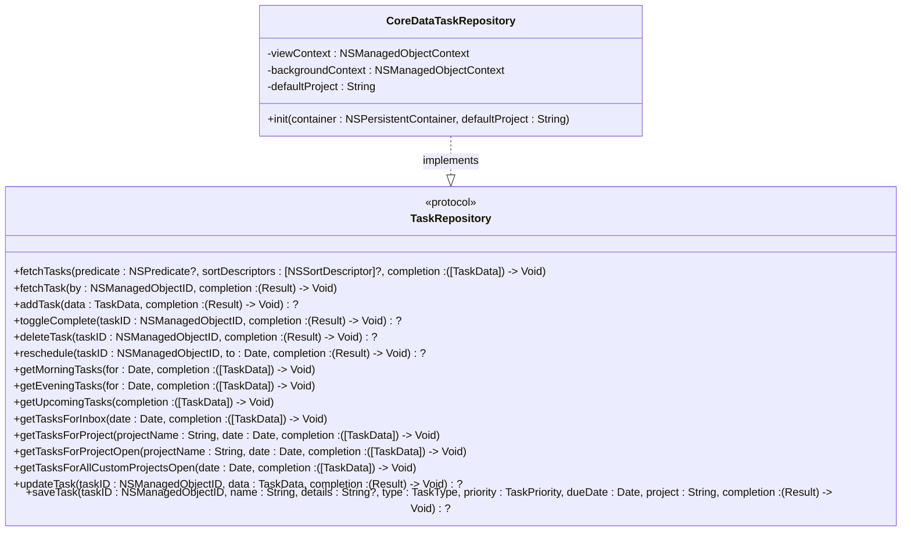
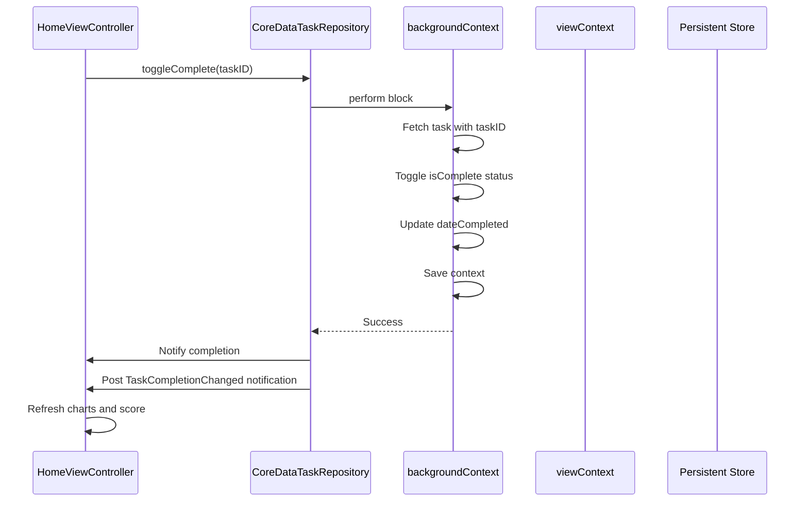
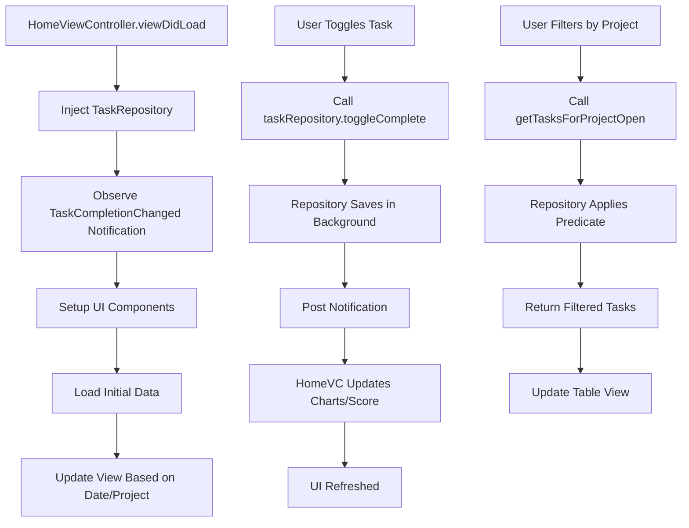
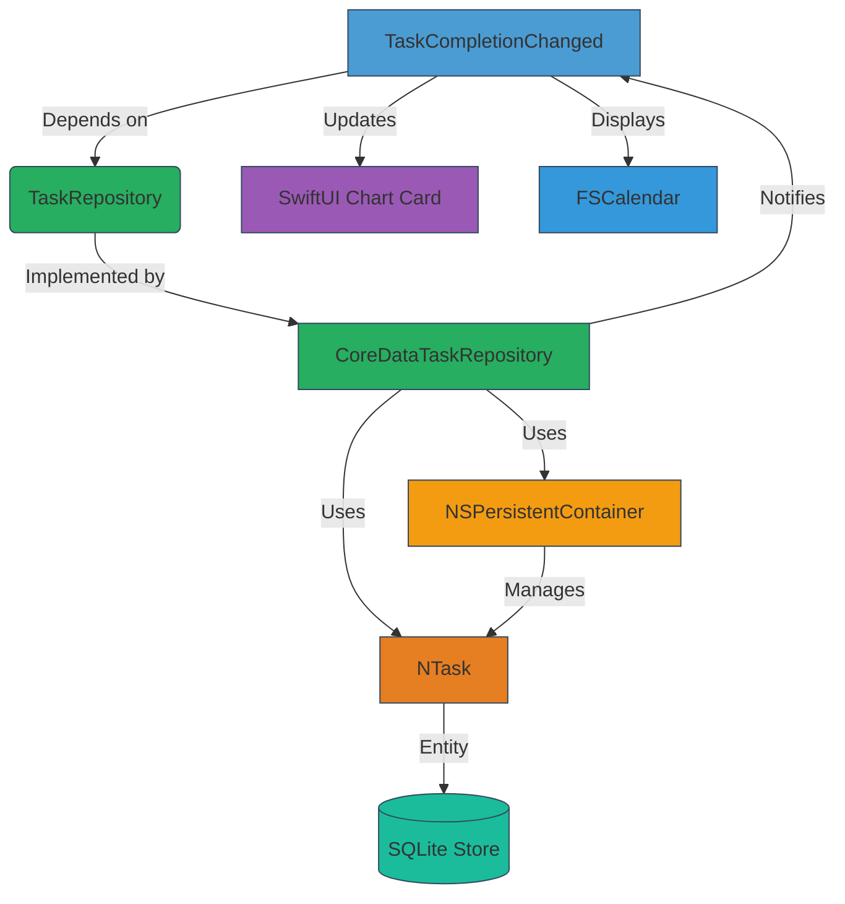

# Task Management System

<cite>
**Referenced Files in This Document**   
- [TaskRepository.swift](file://To Do List/Repositories/TaskRepository.swift)
- [CoreDataTaskRepository.swift](file://To Do List/Repositories/CoreDataTaskRepository.swift)
- [HomeViewController.swift](file://To Do List/ViewControllers/HomeViewController.swift)
- [NTask+CoreDataClass.swift](file://To Do List/NTask+CoreDataClass.swift)
- [NTask+CoreDataProperties.swift](file://To Do List/NTask+CoreDataProperties.swift)
- [NTask+Extensions.swift](file://To Do List/NTask+Extensions.swift)
</cite>

## Table of Contents
1. [Introduction](#introduction)
2. [Project Structure](#project-structure)
3. [Core Components](#core-components)
4. [Architecture Overview](#architecture-overview)
5. [Detailed Component Analysis](#detailed-component-analysis)
6. [Dependency Analysis](#dependency-analysis)
7. [Performance Considerations](#performance-considerations)
8. [Troubleshooting Guide](#troubleshooting-guide)
9. [Conclusion](#conclusion)

## Introduction
This document provides a comprehensive analysis of the task management system's Repository pattern implementation. It focuses on the separation between the `TaskRepository` protocol and its concrete `CoreDataTaskRepository` implementation using Core Data. The system enables dependency injection, promotes testability, and ensures thread-safe data access across the application. Special attention is given to how tasks are queried by type (morning/evening), how completion updates trigger UI refreshes and score recalculations, and the mechanisms in place for maintaining data consistency across contexts.

## Project Structure

**Diagram sources**
- [TaskRepository.swift](file://To Do List/Repositories/TaskRepository.swift)
- [CoreDataTaskRepository.swift](file://To Do List/Repositories/CoreDataTaskRepository.swift)
- [HomeViewController.swift](file://To Do List/ViewControllers/HomeViewController.swift)

**Section sources**
- [TaskRepository.swift](file://To Do List/Repositories/TaskRepository.swift)
- [CoreDataTaskRepository.swift](file://To Do List/Repositories/CoreDataTaskRepository.swift)

## Core Components

The core components of the task management system revolve around the Repository pattern, which abstracts data access logic behind a protocol. The `TaskRepository` defines a comprehensive contract for all CRUD operations and specialized queries, enabling loose coupling between the UI layer and persistence mechanism. The `CoreDataTaskRepository` provides a concrete implementation using Core Data with proper context management for thread safety. The `HomeViewController` consumes this repository via dependency injection, allowing it to remain agnostic of the underlying data storage details while supporting rich querying capabilities including filtering by `TaskType`, project, and date ranges.

**Section sources**
- [TaskRepository.swift](file://To Do List/Repositories/TaskRepository.swift#L1-L117)
- [CoreDataTaskRepository.swift](file://To Do List/Repositories/CoreDataTaskRepository.swift#L1-L455)
- [HomeViewController.swift](file://To Do List/ViewControllers/HomeViewController.swift#L1-L1106)

## Architecture Overview

**Diagram sources**
- [TaskRepository.swift](file://To Do List/Repositories/TaskRepository.swift)
- [CoreDataTaskRepository.swift](file://To Do List/Repositories/CoreDataTaskRepository.swift)
- [HomeViewController.swift](file://To Do List/ViewControllers/HomeViewController.swift)

## Detailed Component Analysis

### TaskRepository Protocol Analysis

The `TaskRepository` protocol defines a comprehensive interface for task data operations, enabling dependency injection and testability. It abstracts all data access concerns from the view layer.

**Diagram sources**
- [TaskRepository.swift](file://To Do List/Repositories/TaskRepository.swift#L1-L117)
- [CoreDataTaskRepository.swift](file://To Do List/Repositories/CoreDataTaskRepository.swift#L1-L455)

### CoreDataTaskRepository Implementation Analysis

The `CoreDataTaskRepository` implements the `TaskRepository` protocol using Core Data with proper concurrency management. It utilizes two managed object contexts: a `viewContext` for UI-related fetches and a `backgroundContext` for all write operations.

**Diagram sources**
- [CoreDataTaskRepository.swift](file://To Do List/Repositories/CoreDataTaskRepository.swift#L1-L455)
- [HomeViewController.swift](file://To Do List/ViewControllers/HomeViewController.swift#L1-L1106)

### HomeViewController Integration Analysis

The `HomeViewController` integrates with the repository pattern through dependency injection, consuming the `TaskRepository` protocol rather than the concrete implementation.

**Diagram sources**
- [HomeViewController.swift](file://To Do List/ViewControllers/HomeViewController.swift#L1-L1106)
- [CoreDataTaskRepository.swift](file://To Do List/Repositories/CoreDataTaskRepository.swift#L1-L455)

**Section sources**
- [HomeViewController.swift](file://To Do List/ViewControllers/HomeViewController.swift#L1-L1106)
- [CoreDataTaskRepository.swift](file://To Do List/Repositories/CoreDataTaskRepository.swift#L1-L455)

## Dependency Analysis

**Diagram sources**
- [HomeViewController.swift](file://To Do List/ViewControllers/HomeViewController.swift)
- [TaskRepository.swift](file://To Do List/Repositories/TaskRepository.swift)
- [CoreDataTaskRepository.swift](file://To Do List/Repositories/CoreDataTaskRepository.swift)
- [NTask+CoreDataClass.swift](file://To Do List/NTask+CoreDataClass.swift)

## Performance Considerations

The system employs several performance optimization techniques:

- **Context Separation**: Read operations use `viewContext` while writes occur on `backgroundContext`, preventing UI blocking
- **Batch Processing**: Fetch requests are optimized with appropriate predicates and sort descriptors
- **Faulting**: Core Data's faulting mechanism minimizes memory usage by loading objects only when needed
- **Asynchronous Operations**: All Core Data operations are performed asynchronously using `perform` blocks
- **Predicate Optimization**: Complex queries use compound predicates to efficiently filter data at the storage level
- **Notification-Based Updates**: Rather than polling, the system uses `NotificationCenter` to propagate changes only when necessary

The repository pattern also enables easy substitution of implementations for testing or alternative storage mechanisms without affecting the UI layer.

## Troubleshooting Guide

Common issues and their solutions:

- **Stale Data Display**: Ensure all UI updates occur after context saves and notifications are properly observed. The system uses `TaskCompletionChanged` notification to trigger refreshes.
- **Thread Safety Violations**: Always use `perform` or `performAndWait` when accessing Core Data contexts from background threads. The repository encapsulates this logic.
- **Context Merge Issues**: The `viewContext` has `automaticallyMergesChangesFromParent = true` to receive changes from background saves.
- **Missing UI Updates**: Verify that observers for `TaskCompletionChanged` are properly added and removed in `viewDidLoad` and `deinit`.
- **Performance Bottlenecks**: For large datasets, consider implementing pagination or using `fetchLimit` and `fetchOffset` in requests.

**Section sources**
- [CoreDataTaskRepository.swift](file://To Do List/Repositories/CoreDataTaskRepository.swift#L1-L455)
- [HomeViewController.swift](file://To Do List/ViewControllers/HomeViewController.swift#L1-L1106)

## Conclusion

The task management system demonstrates a robust implementation of the Repository pattern with Core Data. By defining a clear protocol and providing a thread-safe concrete implementation, the system achieves separation of concerns, testability, and maintainability. The integration with `HomeViewController` through dependency injection allows for flexible composition and easy testing. The use of notifications ensures that UI components like charts and score displays stay synchronized with data changes. This architecture provides a solid foundation for future enhancements while maintaining performance and data consistency across the application.