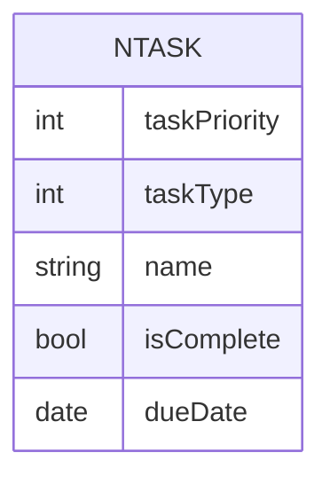
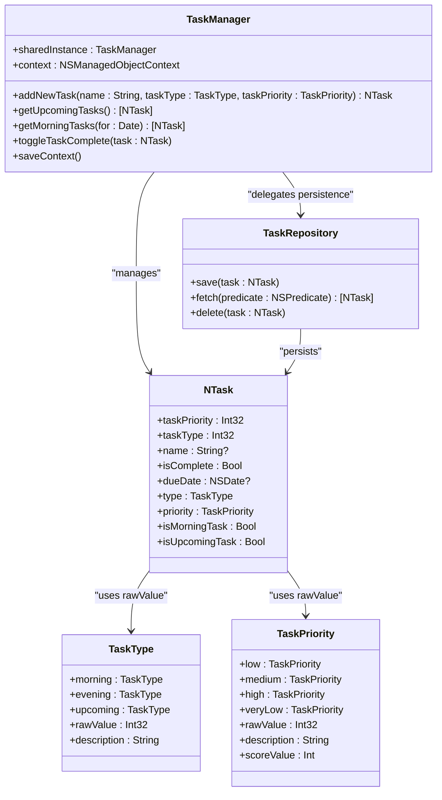

# Task Priority and Type System

<cite>
**Referenced Files in This Document**   
- [TaskManager.swift](file://To Do List/ViewControllers/TaskManager.swift#L15-L50)
- [NTask+CoreDataProperties.swift](file://To Do List/NTask+CoreDataProperties.swift#L10-L20)
- [NTask+Extensions.swift](file://To Do List/NTask+Extensions.swift#L5-L40)
- [TaskRepository.swift](file://To Do List/Repositories/TaskRepository.swift)
- [README.md](file://README.md#L436-L474)
</cite>

## Table of Contents
1. [Introduction](#introduction)
2. [Core Enum Definitions](#core-enum-definitions)
3. [Core Data Integration](#core-data-integration)
4. [Type-Safe Accessors and Business Logic](#type-safe-accessors-and-business-logic)
5. [Task Scoring and Gamification](#task-scoring-and-gamification)
6. [Filtering and Sorting Mechanisms](#filtering-and-sorting-mechanisms)
7. [Integration with TaskManager and TaskRepository](#integration-with-taskmanager-and-taskrepository)
8. [Common Issues and Error Handling](#common-issues-and-error-handling)
9. [Extensibility and Future Enhancements](#extensibility-and-future-enhancements)
10. [Architecture Overview](#architecture-overview)

## Introduction
The Task Priority and Type System forms the foundation of task categorization, filtering, and gamification mechanics in the Tasker application. This system leverages Swift's type-safe enumerations to define task priorities (P0-P4) and task types (Morning, Evening, Upcoming, Inbox), enabling robust business logic while maintaining seamless persistence through Core Data. The design emphasizes data integrity, performance, and developer ergonomics by using raw values for database storage and computed properties for safe access.

**Section sources**
- [README.md](file://README.md#L436-L474)

## Core Enum Definitions

### TaskType Enum
The `TaskType` enum categorizes tasks based on time-of-day context and scheduling:

```swift
enum TaskType: Int32, CaseIterable {
    case morning = 1
    case evening = 2
    case upcoming = 3
}
```

Each case corresponds to a specific workflow:
- **Morning (1)**: Tasks intended for morning completion
- **Evening (2)**: Tasks scheduled for evening execution
- **Upcoming (3)**: Future-dated tasks not tied to a specific daily routine

The enum includes a descriptive property for UI presentation:

```swift
var description: String {
    switch self {
    case .morning: return "Morning"
    case .evening: return "Evening"
    case .upcoming: return "Upcoming"
    }
}
```

### TaskPriority Enum
The `TaskPriority` enum defines urgency levels for task management:

```swift
enum TaskPriority: Int32, CaseIterable {
    case low = 1          // P0 – Highest priority
    case medium = 2       // P1
    case high = 3         // P2
    case veryLow = 4      // P3 – Lowest priority
}
```

Despite the naming convention suggesting otherwise, lower raw values indicate higher priority:
- **Low (1)**: P0 – Critical tasks requiring immediate attention
- **Medium (2)**: P1 – Important but not urgent tasks
- **High (3)**: P2 – Standard priority tasks
- **Very Low (4)**: P3 – Low-priority or optional tasks

A `scoreValue` property supports gamification mechanics:

```swift
var scoreValue: Int {
    switch self {
    case .high:      return 3
    case .medium:    return 2
    case .low:       return 1
    case .veryLow:   return 0
    }
}
```

**Section sources**
- [TaskManager.swift](file://To Do List/ViewControllers/TaskManager.swift#L15-L50)

## Core Data Integration

### Entity Storage Strategy
The `NTask` Core Data entity stores enum values as `Int32` attributes to ensure efficient database operations:

```swift
@NSManaged public var taskPriority: Int32 // 1-4 where 1 is highest
@NSManaged public var taskType: Int32     // 1-4 where 1 is morning
```

This approach provides:
- **Database efficiency**: Native integer storage with optimal indexing
- **Backward compatibility**: Stable schema across app versions
- **Query performance**: Fast predicate-based filtering using numeric values

### Raw Value Conversion
Enums seamlessly convert between Swift types and Core Data storage using raw values:

**Saving to Core Data:**
```swift
managed.taskType = data.type.rawValue
managed.taskPriority = data.priority.rawValue
```

**Retrieving from Core Data:**
```swift
self.type = TaskType(rawValue: managedObject.taskType) ?? .morning
self.priority = TaskPriority(rawValue: managedObject.taskPriority) ?? .medium
```

Default fallback values ensure data integrity when invalid raw values are encountered.



**Diagram sources**
- [NTask+CoreDataProperties.swift](file://To Do List/NTask+CoreDataProperties.swift#L10-L20)

**Section sources**
- [README.md](file://README.md#L436-L474)
- [NTask+CoreDataProperties.swift](file://To Do List/NTask+CoreDataProperties.swift#L10-L20)

## Type-Safe Accessors and Business Logic

### Computed Properties
The `NTask+Extensions.swift` file provides type-safe accessors that encapsulate enum conversion logic:

```swift
extension NTask {
    var type: TaskType {
        get { TaskType(rawValue: self.taskType) ?? .morning }
        set { self.taskType = newValue.rawValue }
    }
    
    var priority: TaskPriority {
        get { TaskPriority(rawValue: self.taskPriority) ?? .medium }
        set { self.taskPriority = newValue.rawValue }
    }
}
```

These computed properties:
- Eliminate manual raw value conversion throughout the codebase
- Ensure consistent fallback behavior for invalid values
- Provide a clean, semantic API for task manipulation

### Convenience Boolean Flags
The extension includes boolean computed properties for common filtering conditions:

```swift
var isMorningTask: Bool { return type == .morning }
var isUpcomingTask: Bool { return type == .upcoming }
var isHighPriority: Bool { return priority == .high }
var isMediumPriority: Bool { return priority == .medium }
var isLowPriority: Bool { return priority == .low }
```

### Evening Task Synchronization
A dedicated method maintains consistency between `taskType` and `isEveningTask` flags:

```swift
func updateEveningTaskStatus(_ isEvening: Bool) {
    self.isEveningTask = isEvening
    if isEvening {
        self.taskType = TaskType.evening.rawValue
    } else if self.taskType == TaskType.evening.rawValue {
        self.taskType = TaskType.morning.rawValue
    }
}
```

This ensures that UI state and data model remain synchronized when toggling evening task status.

**Section sources**
- [NTask+Extensions.swift](file://To Do List/NTask+Extensions.swift#L5-L40)

## Task Scoring and Gamification

### Priority-Based Scoring
The system implements a gamification mechanic where task completion yields points based on priority:

```swift
func getTaskScore(task: NTask) -> Int {
    if task.taskPriority == 1 {
        return 7  // P0: Highest priority
    } else if task.taskPriority == 2 {
        return 4  // P1: High priority
    } else if task.taskPriority == 3 {
        return 3  // P2: Medium priority
    } else if task.taskPriority == 4 {
        return 2  // P3: Low priority
    } else {
        return 1  // Default fallback
    }
}
```

This scoring system incentivizes users to complete higher-priority tasks first.

### Visual Indicators
The UI represents priorities through distinct visual elements:
- **P0 (Highest)**: Red circle with "!!" icon, 7-point scoring
- **P1 (High)**: Orange circle with "!" icon, 4-point scoring
- **P2 (Medium)**: Yellow circle with "-" icon, 3-point scoring
- **P3 (Low)**: Green circle with "↓" icon, 2-point scoring

These indicators provide immediate visual feedback about task importance and potential point value.

**Section sources**
- [NTask+CoreDataProperties.swift](file://To Do List/NTask+CoreDataProperties.swift#L30-L50)
- [README.md](file://README.md#L1057-L1090)

## Filtering and Sorting Mechanisms

### Predicate-Based Filtering
The `TaskManager` class implements numerous filtering methods using NSPredicate with enum raw values:

```swift
func getUpcomingTasks() -> [NTask] {
    let predicate = NSPredicate(format: "taskType == %d", TaskType.upcoming.rawValue)
    let sortByDate = NSSortDescriptor(key: "dueDate", ascending: true)
    return fetchTasks(predicate: predicate, sortDescriptors: [sortByDate])
}

func getMorningTasksForProject(projectName: String) -> [NTask] {
    let predicate = NSCompoundPredicate(andPredicateWithSubpredicates: [
        NSPredicate(format: "taskType == %d", TaskType.morning.rawValue),
        NSPredicate(format: "project ==[c] %@", projectName)
    ])
    return fetchTasks(predicate: predicate, sortDescriptors: [NSSortDescriptor(key: "dueDate", ascending: true)])
}
```

### Time-Based Retrieval
Specialized methods retrieve tasks based on temporal context:

```swift
func getMorningTasks(for date: Date) -> [NTask] {
    let startOfDay = date.startOfDay
    let endOfDay = Calendar.current.date(byAdding: .day, value: 1, to: startOfDay)!
    
    let dueTodayPredicate = NSPredicate(
        format: "taskType == %d AND dueDate >= %@ AND dueDate < %@",
        1, startOfDay as NSDate, endOfDay as NSDate
    )
    
    let overdueUnfinishedPredicate = NSPredicate(
        format: "taskType == %d AND dueDate < %@ AND isComplete == NO",
        1, startOfDay as NSDate
    )
    
    let combinedPredicate = NSCompoundPredicate(orPredicateWithSubpredicates: [
        dueTodayPredicate,
        overdueUnfinishedPredicate
    ])
    
    return fetchTasks(predicate: combinedPredicate, sortDescriptors: [NSSortDescriptor(key: "dueDate", ascending: true)])
}
```

These methods support complex views like the home screen, which displays both today's tasks and overdue items.

**Section sources**
- [TaskManager.swift](file://To Do List/ViewControllers/TaskManager.swift#L150-L250)

## Integration with TaskManager and TaskRepository

### Task Creation
The `TaskManager` provides multiple methods for creating tasks with specified types and priorities:

```swift
@discardableResult
func addNewTask(name: String, taskType: TaskType, taskPriority: TaskPriority) -> NTask {
    let task = NSEntityDescription.insertNewObject(forEntityName: "NTask", into: context) as! NTask
    
    task.name = name
    task.isComplete = false
    task.taskDetails = ""
    task.type = taskType
    task.priority = taskPriority
    
    saveContext()
    return task
}
```

Legacy compatibility methods accept raw integers and convert them to enum values:

```swift
func addNewTask(name: String, taskType: Int, taskPriority: Int) {
    let type = TaskType(rawValue: Int32(taskType)) ?? .morning
    let priority = TaskPriority(rawValue: Int32(taskPriority)) ?? .medium
    addNewTask(name: name, taskType: type, taskPriority: priority)
}
```

### Repository Layer
The `TaskRepository.swift` file (though not fully visible) likely provides an abstraction layer between the data store and business logic, following repository pattern principles. It would handle:
- Converting between domain models and Core Data entities
- Implementing CRUD operations with proper error handling
- Managing batch operations and performance optimizations

This separation ensures that the `TaskManager` can focus on business rules while the repository handles persistence concerns.

**Section sources**
- [TaskManager.swift](file://To Do List/ViewControllers/TaskManager.swift#L600-L650)
- [TaskRepository.swift](file://To Do List/Repositories/TaskRepository.swift)

## Common Issues and Error Handling

### Invalid Raw Value Conversion
When retrieving enum values from Core Data, invalid raw values may occur due to:
- Schema migrations
- Data corruption
- Manual database editing

The system handles this through safe unwrapping with defaults:

```swift
TaskType(rawValue: self.taskType) ?? .morning
TaskPriority(rawValue: self.taskPriority) ?? .medium
```

This prevents runtime crashes and maintains application stability.

### Data Integrity Maintenance
The `fixMissingTasksDataWithDefaults()` method ensures data consistency during app initialization:

```swift
func fixMissingTasksDataWithDefaults() {
    let allTasks = fetchTasks(predicate: nil)
    for each in allTasks {
        if each.project?.isEmpty ?? true {
            each.project = "inbox"
            saveContext()
        }
    }
}
```

Similar logic should be implemented for enum fields to handle any potential data inconsistencies.

### Context Saving Errors
The `saveContext()` method includes comprehensive error handling:

```swift
func saveContext() {
    do {
        try context.save()
    } catch let error as NSError {
        print("❌ TaskManager: Core Data save FAILED! Error: \(error), UserInfo: \(error.userInfo)")
    }
}
```

This ensures that persistence failures are logged and do not crash the application.

**Section sources**
- [TaskManager.swift](file://To Do List/ViewControllers/TaskManager.swift#L950-L1000)
- [NTask+CoreDataProperties.swift](file://To Do List/NTask+CoreDataProperties.swift#L40-L50)

## Extensibility and Future Enhancements

### Adding New Priority Levels
To extend the priority system:
1. Add new cases to the `TaskPriority` enum
2. Update the `scoreValue` property to include new point values
3. Modify UI components to display new priority indicators
4. Update any switch statements that handle priorities

Example extension:
```swift
enum TaskPriority: Int32, CaseIterable {
    case critical = 0     // New highest priority
    case low = 1
    case medium = 2
    case high = 3
    case veryLow = 4
}
```

### Adding New Task Types
To introduce additional task categories:
1. Add new cases to the `TaskType` enum
2. Update the `description` property for UI display
3. Implement new filtering methods in `TaskManager`
4. Create corresponding UI components and icons

### Migration Strategy
When modifying enum raw values:
- Preserve existing values for backward compatibility
- Use new numeric values for additions
- Implement migration scripts for existing data
- Test thoroughly with existing databases

The current design supports such extensions without breaking existing data, as long as raw value conflicts are avoided.

**Section sources**
- [TaskManager.swift](file://To Do List/ViewControllers/TaskManager.swift#L15-L50)
- [README.md](file://README.md#L436-L474)

## Architecture Overview



**Diagram sources**
- [TaskManager.swift](file://To Do List/ViewControllers/TaskManager.swift#L15-L50)
- [NTask+CoreDataProperties.swift](file://To Do List/NTask+CoreDataProperties.swift#L10-L20)
- [NTask+Extensions.swift](file://To Do List/NTask+Extensions.swift#L5-L40)

**Section sources**
- [TaskManager.swift](file://To Do List/ViewControllers/TaskManager.swift#L15-L50)
- [NTask+CoreDataProperties.swift](file://To Do List/NTask+CoreDataProperties.swift#L10-L20)
- [NTask+Extensions.swift](file://To Do List/NTask+Extensions.swift#L5-L40)