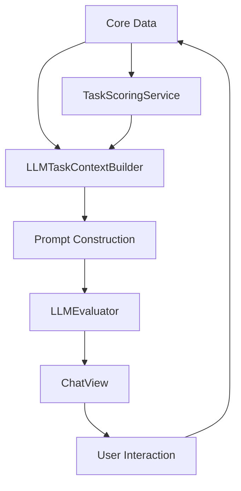
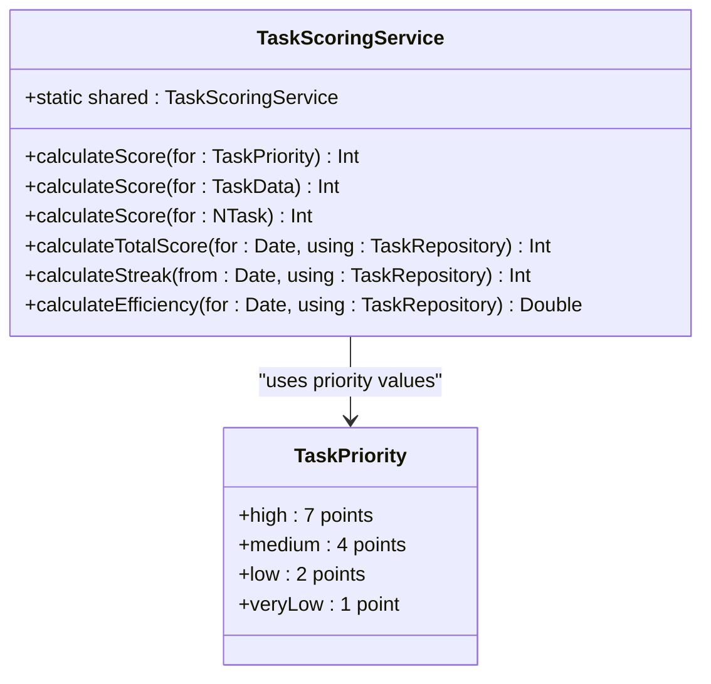
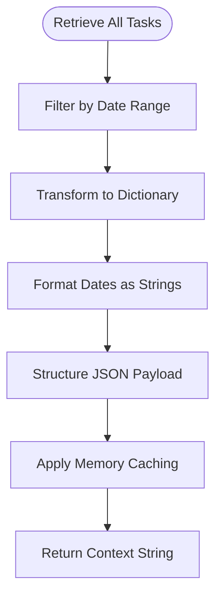
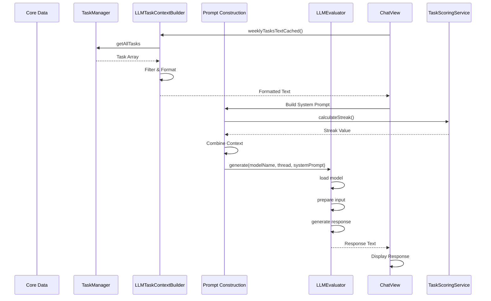
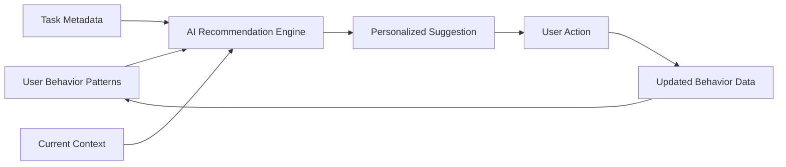

# AI Personalization and Context Integration

<cite>
**Referenced Files in This Document**   
- [TaskScoringService.swift](file://To%20Do%20List/Services/TaskScoringService.swift)
- [LLMTaskContextBuilder.swift](file://To%20Do%20List/LLM/Models/LLMTaskContextBuilder.swift)
- [LLMEvaluator.swift](file://To%20Do%20List/LLM/Models/LLMEvaluator.swift)
- [ChatView.swift](file://To%20Do%20List/LLM/Views/Chat/ChatView.swift)
- [PromptMiddleware.swift](file://To%20Do%20List/LLM/Models/PromptMiddleware.swift)
- [ChartDataService.swift](file://To%20Do%20List/Services/ChartDataService.swift)
- [Models.swift](file://To%20Do%20List/LLM/Models/Models.swift)
</cite>

## Table of Contents
1. [Introduction](#introduction)
2. [Core Components Overview](#core-components-overview)
3. [TaskScoringService: Behavioral Data Provider](#taskscoringservice-behavioral-data-provider)
4. [LLMTaskContextBuilder: Context Aggregation](#llmtaskcontextbuilder-context-aggregation)
5. [Data Flow from Core Data to LLM](#data-flow-from-core-data-to-llm)
6. [Personalized AI Interaction Examples](#personalized-ai-interaction-examples)
7. [Privacy Considerations](#privacy-considerations)
8. [Enhancement Opportunities](#enhancement-opportunities)

## Introduction
Tasker leverages artificial intelligence to deliver personalized task management suggestions by integrating user behavior patterns with task metadata. This document details how the system combines behavioral analytics from TaskScoringService with contextual task data through LLMTaskContextBuilder to generate relevant AI recommendations. The architecture enables dynamic, context-aware interactions that adapt to individual user habits, priorities, and historical patterns while maintaining privacy and performance constraints.

## Core Components Overview
The AI personalization system in Tasker consists of several interconnected components that work together to provide intelligent suggestions:

- **TaskScoringService**: Analyzes user behavior and calculates scores based on task completion patterns, priority preferences, and streak history
- **LLMTaskContextBuilder**: Aggregates task metadata and behavioral context into structured formats suitable for LLM processing
- **LLMEvaluator**: Executes the language model inference and generates responses
- **ChatView**: Presents the AI interface and manages user interactions
- **PromptMiddleware**: Constructs dynamic prompts with filtered task summaries

These components form a pipeline that transforms raw user data into personalized AI-driven recommendations.



**Diagram sources**
- [TaskScoringService.swift](file://To%20Do%20List/Services/TaskScoringService.swift)
- [LLMTaskContextBuilder.swift](file://To%20Do%20List/LLM/Models/LLMTaskContextBuilder.swift)
- [ChatView.swift](file://To%20Do%20List/LLM/Views/Chat/ChatView.swift)

## TaskScoringService: Behavioral Data Provider

TaskScoringService is the core component responsible for quantifying user behavior and task importance. It provides behavioral data that informs AI recommendations by analyzing completion patterns, priority preferences, and consistency metrics.

### Scoring Methodology
The service implements a priority-based scoring system where tasks are assigned point values according to their priority level:



**Diagram sources**
- [TaskScoringService.swift](file://To%20Do%20List/Services/TaskScoringService.swift#L14-L33)

### Behavioral Analytics Functions
The service provides several key behavioral metrics:

**Completion Patterns Analysis**
```swift
func calculateTotalScore(for date: Date, using repository: TaskRepository, completion: @escaping (Int) -> Void)
```
Calculates the total score of completed tasks for a specific date by summing individual task scores based on priority.

**Streak History Tracking**
```swift
func calculateStreak(from fromDate: Date, using repository: TaskRepository, completion: @escaping (Int) -> Void)
```
Determines consecutive days with completed tasks, measuring user consistency and engagement patterns.

**Efficiency Measurement**
```swift
func calculateEfficiency(for date: Date, using repository: TaskRepository, completion: @escaping (Double) -> Void)
```
Computes the percentage of planned tasks completed, providing insight into daily productivity effectiveness.

**Section sources**
- [TaskScoringService.swift](file://To%20Do%20List/Services/TaskScoringService.swift#L3-L153)
- [ChartDataService.swift](file://To%20Do%20List/Services/ChartDataService.swift#L94-L159)

## LLMTaskContextBuilder: Context Aggregation

LLMTaskContextBuilder serves as the bridge between user behavior data and the AI recommendation engine. It transforms structured task data and behavioral context into compact, LLM-friendly formats.

### Context Construction Process
The builder follows a multi-step process to create contextual representations:



**Diagram sources**
- [LLMTaskContextBuilder.swift](file://To%20Do%20List/LLM/Models/LLMTaskContextBuilder.swift#L6-L281)

### Context Types and Structure
The builder generates two primary context types:

**Weekly Tasks Context**
```json
{
  "context_type": "weekly_tasks",
  "current_date": "2025-04-15",
  "week_start_date": "2025-04-13",
  "tasks_due_today": [...],
  "tasks_week": [...]
}
```

**Project Details Context**
```json
{
  "context_type": "project_details",
  "projects": [
    {
      "projectName": "Work",
      "tasks": [...]
    }
  ]
}
```

### Caching Mechanism
To optimize performance, the builder implements an in-memory caching system with a 5-minute TTL:

```swift
private static let cacheTTL: TimeInterval = 60 * 5 // 5 minutes
private static var cachedWeekly: (generated: Date, json: String)?
private static var cachedProjects: (generated: Date, json: String)?
```

This prevents redundant computation when multiple AI interactions occur within a short timeframe.

**Section sources**
- [LLMTaskContextBuilder.swift](file://To%20Do%20List/LLM/Models/LLMTaskContextBuilder.swift#L6-L281)

## Data Flow from Core Data to LLM

The data pipeline from persistent storage to AI recommendations follows a well-defined sequence:



**Diagram sources**
- [ChatView.swift](file://To%20Do%20List/LLM/Views/Chat/ChatView.swift#L250-L441)
- [LLMTaskContextBuilder.swift](file://To%20Do%20List/LLM/Models/LLMTaskContextBuilder.swift)
- [TaskScoringService.swift](file://To%20Do%20List/Services/TaskScoringService.swift)

### Key Integration Points
1. **Task Retrieval**: `TaskManager.sharedInstance.getAllTasks` provides access to all task entities
2. **Context Injection**: `ChatView.contextInjectedThreads` ensures context is added only once per conversation
3. **Prompt Assembly**: Dynamic system prompts combine static instructions with real-time behavioral data
4. **Response Generation**: Streaming API provides incremental output for better user experience

The integration maintains efficiency by:
- Caching context data to prevent redundant processing
- Limiting context size to fit within LLM token constraints
- Using background threads for data processing
- Implementing memory management for large data sets

**Section sources**
- [ChatView.swift](file://To%20Do%20List/LLM/Views/Chat/ChatView.swift#L250-L441)
- [LLMEvaluator.swift](file://To%20Do%20List/LLM/Models/LLMEvaluator.swift#L110-L166)

## Personalized AI Interaction Examples

The integration of behavioral data and task context enables several personalized AI interactions:

### Task Rescheduling Suggestions
When a user consistently completes high-priority tasks in the morning but has afternoon tasks overdue, the AI can suggest:
"Based on your pattern of completing high-priority tasks in the morning, would you like to reschedule your 3:00 PM meeting preparation task to tomorrow morning when you're most productive?"

This recommendation leverages:
- Historical completion timing patterns
- Current task priority levels
- User's typical productivity windows

### Priority Adjustment Recommendations
For tasks that remain incomplete despite multiple due date extensions, the AI might suggest:
"I've noticed this task has been pending for 3 weeks despite 2 deadline extensions. Would you like to either lower its priority or break it into smaller subtasks?"

This insight comes from:
- Task completion history and delays
- Priority level versus completion rate analysis
- User's streak maintenance patterns

### Proactive Planning Assistance
At the start of each week, the AI can offer:
"Your productivity streak is at 7 days. To maintain this, I recommend scheduling your 3 high-priority tasks from the backlog on Tuesday and Thursday when you typically complete the most work."

This combines:
- Current streak status
- Historical productivity patterns
- Upcoming task load analysis



**Diagram sources**
- [PromptMiddleware.swift](file://To%20Do%20List/LLM/Models/PromptMiddleware.swift#L1-L56)
- [ChatView.swift](file://To%20Do%20List/LLM/Views/Chat/ChatView.swift#L350-L400)

**Section sources**
- [PromptMiddleware.swift](file://To%20Do%20List/LLM/Models/PromptMiddleware.swift#L1-L56)
- [ChatView.swift](file://To%20Do%20List/LLM/Views/Chat/ChatView.swift#L350-L400)

## Privacy Considerations

Tasker implements several privacy-preserving measures when using personal data for AI context:

### Local Processing
All AI processing occurs on-device using locally installed models, ensuring that sensitive task data never leaves the user's device:
- No cloud-based LLM services are used
- Model weights are downloaded and stored locally
- Conversations are not transmitted to external servers

### Context Minimization
The system follows the principle of minimal necessary context:
- Only tasks from the current week are included in context
- Personal details are excluded from prompts
- Context is cleared when switching conversations

### User Control
Users maintain full control over their data:
- AI features are opt-in during onboarding
- Users can delete conversation history at any time
- Model downloads require explicit user approval

### Data Access Patterns
The architecture ensures privacy through:
- Encapsulated data access through service layers
- No persistent storage of processed context
- Automatic context expiration after 5 minutes

These measures ensure that personal productivity data remains private while still enabling personalized AI assistance.

**Section sources**
- [ChatHostViewController.swift](file://To%20Do%20List/LLM/ChatHostViewController.swift)
- [LLMDataController.swift](file://To%20Do%20List/LLM/Models/LLMDataController.swift)

## Enhancement Opportunities

Several opportunities exist to further enhance the personalization capabilities:

### Additional User Metrics
The system could incorporate:
- Time estimation accuracy (planned vs. actual completion time)
- Recurring task completion consistency
- Category-based productivity analysis
- Device usage patterns (app open frequency, session duration)

### Advanced Machine Learning Models
Potential enhancements include:
- Predictive completion likelihood models
- Optimal scheduling algorithms based on historical patterns
- Anomaly detection for unusual productivity drops
- Cluster analysis for task type preferences

### Behavioral Pattern Recognition
Implementing more sophisticated pattern recognition could enable:
- Automatic priority adjustment based on completion history
- Intelligent deadline suggestion system
- Proactive task decomposition for frequently delayed items
- Personalized productivity coaching based on long-term trends

### Integration with External Data
With user permission, integration with:
- Calendar availability patterns
- Location-based task suggestions
- Health data (sleep patterns, activity levels)
- Email and communication patterns

These enhancements would require careful consideration of privacy implications and user consent mechanisms, but could significantly improve the relevance and value of AI recommendations.

**Section sources**
- [TaskScoringService.swift](file://To%20Do%20List/Services/TaskScoringService.swift)
- [LLMTaskContextBuilder.swift](file://To%20Do%20List/LLM/Models/LLMTaskContextBuilder.swift)
- [Models.swift](file://To%20Do%20List/LLM/Models/Models.swift)