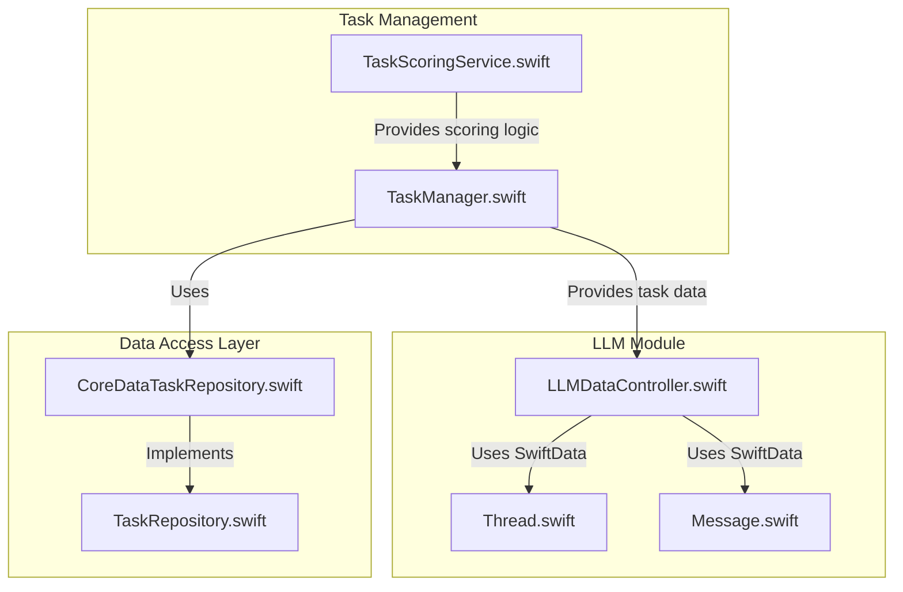
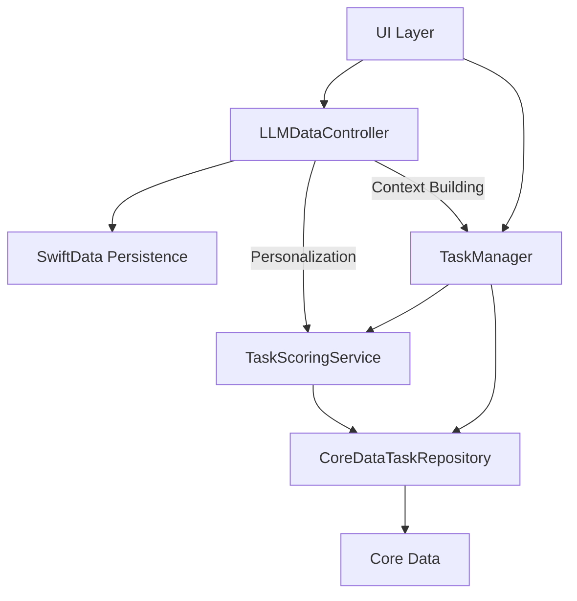
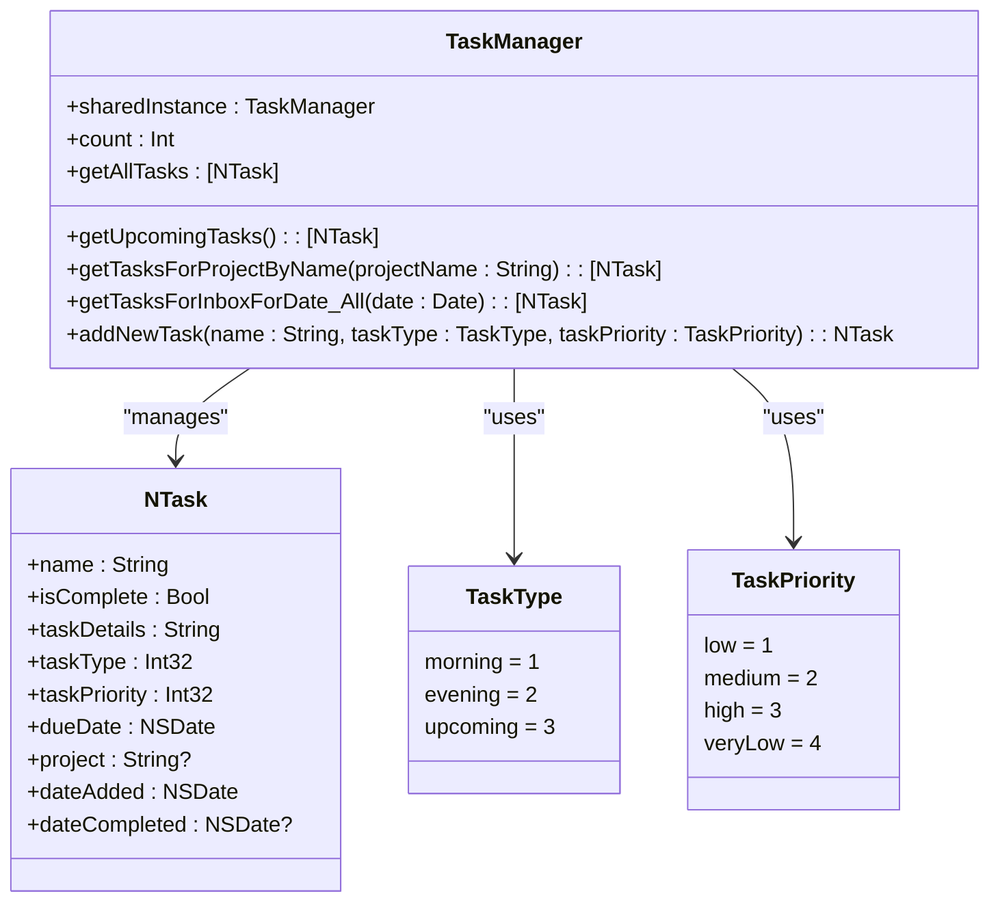
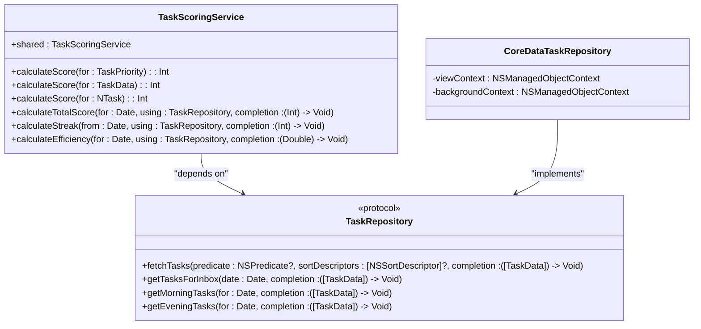
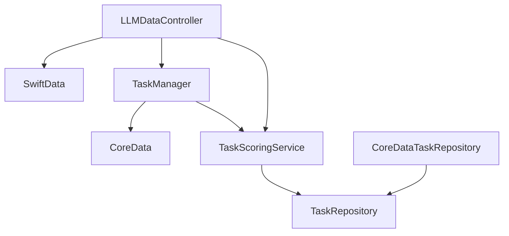

# LLMDataController

<cite>
**Referenced Files in This Document**   
- [LLMDataController.swift](file://To%20Do%20List/LLM/Models/LLMDataController.swift)
- [TaskManager.swift](file://To%20Do%20List/ViewControllers/TaskManager.swift)
- [TaskScoringService.swift](file://To%20Do%20List/Services/TaskScoringService.swift)
- [CoreDataTaskRepository.swift](file://To%20Do%20List/Repositories/CoreDataTaskRepository.swift)
- [TaskRepository.swift](file://To%20Do%20List/Repositories/TaskRepository.swift)
</cite>

## Table of Contents
1. [Introduction](#introduction)
2. [Project Structure](#project-structure)
3. [Core Components](#core-components)
4. [Architecture Overview](#architecture-overview)
5. [Detailed Component Analysis](#detailed-component-analysis)
6. [Dependency Analysis](#dependency-analysis)
7. [Performance Considerations](#performance-considerations)
8. [Troubleshooting Guide](#troubleshooting-guide)
9. [Conclusion](#conclusion)

## Introduction

The **LLMDataController** is a central component in the Tasker application responsible for managing data persistence within the LLM (Large Language Model) module. It ensures that all views and components within the LLM system share the same persistent store by providing a singleton instance of a `ModelContainer` using SwiftData. This controller plays a critical role in enabling AI-driven features by maintaining a consistent and accessible data layer for thread and message entities used in AI interactions.

Although the current implementation of `LLMDataController` focuses solely on data container initialization and persistence setup, it is designed to support broader AI integration, including prompt engineering, context building, and communication with external LLM APIs. The system leverages user task data from `TaskManager` and scoring logic from `TaskScoringService` to personalize AI suggestions and optimize user experience.

This document provides a comprehensive analysis of the LLMDataController and its integration with core task management components, detailing its architecture, dependencies, and potential for extension.

## Project Structure

The Tasker project follows a modular structure with clear separation of concerns across different functional areas. The LLM-related components are organized under the `LLM/Models` directory, while task data management and business logic are distributed across ViewControllers, Services, and Repositories.



**Diagram sources**
- [LLMDataController.swift](file://To%20Do%20List/LLM/Models/LLMDataController.swift)
- [TaskManager.swift](file://To%20Do%20List/ViewControllers/TaskManager.swift)
- [TaskScoringService.swift](file://To%20Do%20List/Services/TaskScoringService.swift)
- [CoreDataTaskRepository.swift](file://To%20Do%20List/Repositories/CoreDataTaskRepository.swift)
- [TaskRepository.swift](file://To%20Do%20List/Repositories/TaskRepository.swift)

**Section sources**
- [LLMDataController.swift](file://To%20Do%20List/LLM/Models/LLMDataController.swift)
- [TaskManager.swift](file://To%20Do%20List/ViewControllers/TaskManager.swift)

## Core Components

The core components involved in the LLM system include:

- **LLMDataController**: Singleton that initializes and provides shared access to the SwiftData container for LLM-related entities.
- **TaskManager**: Central task management class that handles CRUD operations and filtering of tasks using Core Data.
- **TaskScoringService**: Service responsible for calculating task scores based on priority and user completion patterns.
- **TaskRepository**: Protocol defining data access operations for tasks, enabling dependency injection and testability.
- **CoreDataTaskRepository**: Concrete implementation of `TaskRepository` using Core Data.

These components work together to provide a rich context for AI interactions by combining real-time task data with historical user behavior and scoring metrics.

**Section sources**
- [LLMDataController.swift](file://To%20Do%20List/LLM/Models/LLMDataController.swift#L1-L17)
- [TaskManager.swift](file://To%20Do%20List/ViewControllers/TaskManager.swift#L1-L1004)
- [TaskScoringService.swift](file://To%20Do%20List/Services/TaskScoringService.swift#L1-L154)

## Architecture Overview

The architecture of the LLM integration in Tasker follows a layered design pattern with clear separation between data persistence, business logic, and service layers.



The `LLMDataController` acts as the entry point for LLM-related data operations, while `TaskManager` serves as the primary source of user task context. The `TaskScoringService` enhances personalization by providing gamification and scoring logic that can be used to weight AI suggestions.

**Diagram sources**
- [LLMDataController.swift](file://To%20Do%20List/LLM/Models/LLMDataController.swift)
- [TaskManager.swift](file://To%20Do%20List/ViewControllers/TaskManager.swift)
- [TaskScoringService.swift](file://To%20Do%20List/Services/TaskScoringService.swift)
- [CoreDataTaskRepository.swift](file://To%20Do%20List/Repositories/CoreDataTaskRepository.swift)

## Detailed Component Analysis

### LLMDataController Analysis

The `LLMDataController` is implemented as a singleton enum with a static shared instance of `ModelContainer`. It uses SwiftData to manage persistence for `Thread` and `Message` entities, which are essential for maintaining conversation history with the LLM.

```mermaid
classDiagram
class LLMDataController {
+static shared : ModelContainer
}
class Thread {
+id : UUID
+title : String
+messages : [Message]
+createdAt : Date
}
class Message {
+id : UUID
+content : String
+sender : SenderType
+timestamp : Date
+thread : Thread
}
enum SenderType {
USER
ASSISTANT
}
LLMDataController --> Thread : "manages"
LLMDataController --> Message : "manages"
Thread --> Message : "contains"
```

**Diagram sources**
- [LLMDataController.swift](file://To%20Do%20List/LLM/Models/LLMDataController.swift#L1-L17)

**Section sources**
- [LLMDataController.swift](file://To%20Do%20List/LLM/Models/LLMDataController.swift#L1-L17)

### TaskManager Analysis

The `TaskManager` class is a singleton responsible for managing all task-related operations in the Tasker app. It provides extensive filtering capabilities to retrieve tasks based on various criteria including project, date, completion status, and time of day.

Key features include:
- Support for three task types: Morning, Evening, and Upcoming
- Four priority levels with corresponding score values
- Comprehensive filtering methods for different use cases
- Integration with Core Data for persistence



**Diagram sources**
- [TaskManager.swift](file://To%20Do%20List/ViewControllers/TaskManager.swift#L1-L1004)

**Section sources**
- [TaskManager.swift](file://To%20Do%20List/ViewControllers/TaskManager.swift#L1-L1004)

### TaskScoringService Analysis

The `TaskScoringService` provides scoring and gamification logic for tasks, which can be used to personalize AI suggestions. It calculates scores based on task priority and tracks user performance metrics such as daily scores, streaks, and efficiency.



**Diagram sources**
- [TaskScoringService.swift](file://To%20Do%20List/Services/TaskScoringService.swift#L1-L154)
- [TaskRepository.swift](file://To%20Do%20List/Repositories/TaskRepository.swift#L1-L118)
- [CoreDataTaskRepository.swift](file://To%20Do%20List/Repositories/CoreDataTaskRepository.swift#L1-L455)

**Section sources**
- [TaskScoringService.swift](file://To%20Do%20List/Services/TaskScoringService.swift#L1-L154)
- [TaskRepository.swift](file://To%20Do%20List/Repositories/TaskRepository.swift#L1-L118)
- [CoreDataTaskRepository.swift](file://To%20Do%20List/Repositories/CoreDataTaskRepository.swift#L1-L455)

## Dependency Analysis

The LLM system components have well-defined dependencies that enable modularity and testability.



The use of protocols like `TaskRepository` enables dependency injection, making the system more flexible and easier to test. The `CoreDataTaskRepository` implements this protocol using Core Data, but alternative implementations could be substituted for testing or different persistence strategies.

**Diagram sources**
- [TaskScoringService.swift](file://To%20Do%20List/Services/TaskScoringService.swift)
- [TaskRepository.swift](file://To%20Do%20List/Repositories/TaskRepository.swift)
- [CoreDataTaskRepository.swift](file://To%20Do%20List/Repositories/CoreDataTaskRepository.swift)

**Section sources**
- [TaskScoringService.swift](file://To%20Do%20List/Services/TaskScoringService.swift#L1-L154)
- [TaskRepository.swift](file://To%20Do%20List/Repositories/TaskRepository.swift#L1-L118)
- [CoreDataTaskRepository.swift](file://To%20Do%20List/Repositories/CoreDataTaskRepository.swift#L1-L455)

## Performance Considerations

The current architecture demonstrates several performance-conscious design decisions:

1. **Context Management**: The `CoreDataTaskRepository` uses separate view and background contexts to prevent UI blocking during data operations.
2. **Batch Operations**: Fetching and filtering operations are performed efficiently using Core Data predicates and sort descriptors.
3. **Memory Efficiency**: The system avoids maintaining in-memory copies of all tasks, instead relying on predicate-based fetching.
4. **Thread Safety**: Operations are performed on appropriate dispatch queues to ensure thread safety.

However, potential improvements include:
- Implementing caching mechanisms for frequently accessed data
- Optimizing complex predicate combinations
- Adding pagination for large result sets
- Implementing debounced updates for real-time AI suggestions

The `LLMDataController` currently has minimal performance impact as it only initializes the SwiftData container once at startup.

## Troubleshooting Guide

Common issues and their solutions:

**Issue**: LLMDataController fails to initialize
- **Cause**: SwiftData container creation fails due to model validation errors
- **Solution**: Ensure `Thread` and `Message` models conform to SwiftData requirements and check for any CloudKit configuration conflicts

**Issue**: Task data not appearing in AI suggestions
- **Cause**: TaskManager filtering predicates not matching expected criteria
- **Solution**: Verify date formatting and comparison logic in predicate construction

**Issue**: Performance degradation with large task sets
- **Cause**: Inefficient Core Data fetch requests
- **Solution**: Add fetch limits, implement pagination, and optimize sort descriptors

**Issue**: Task scoring inconsistencies
- **Cause**: Race conditions in streak calculation
- **Solution**: Refactor `calculateStreak` to use asynchronous completion handlers instead of synchronous dispatch group waits

**Section sources**
- [LLMDataController.swift](file://To%20Do%20List/LLM/Models/LLMDataController.swift#L1-L17)
- [TaskManager.swift](file://To%20Do%20List/ViewControllers/TaskManager.swift#L1-L1004)
- [TaskScoringService.swift](file://To%20Do%20List/Services/TaskScoringService.swift#L1-L154)

## Conclusion

The `LLMDataController` serves as a foundational component for AI integration in the Tasker application, providing a shared persistent store for LLM-related data. While its current implementation is minimal, focusing on SwiftData container initialization, it is positioned to support more sophisticated AI features.

The integration with `TaskManager` and `TaskScoringService` enables rich context building and personalization for AI suggestions. By leveraging task data, priority levels, and user scoring patterns, the system can generate highly relevant and personalized recommendations.

Future enhancements could include:
- Expanding the LLMDataController to handle prompt engineering and API communication
- Implementing advanced context building by combining task data with user behavior patterns
- Adding support for multiple LLM providers through configurable adapters
- Enhancing security measures for data transmission and privacy protection
- Implementing comprehensive error handling for network failures and rate limiting

The current architecture provides a solid foundation for these extensions, with clear separation of concerns and well-defined interfaces between components.