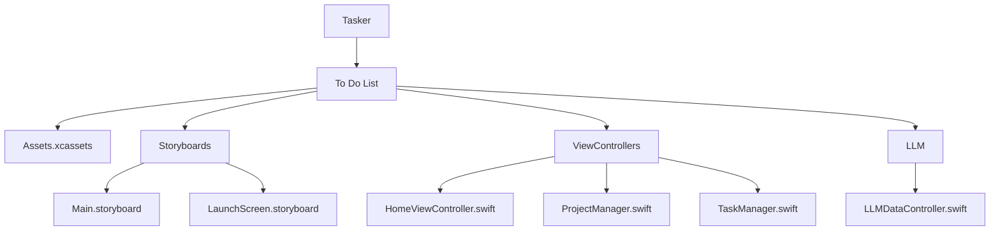
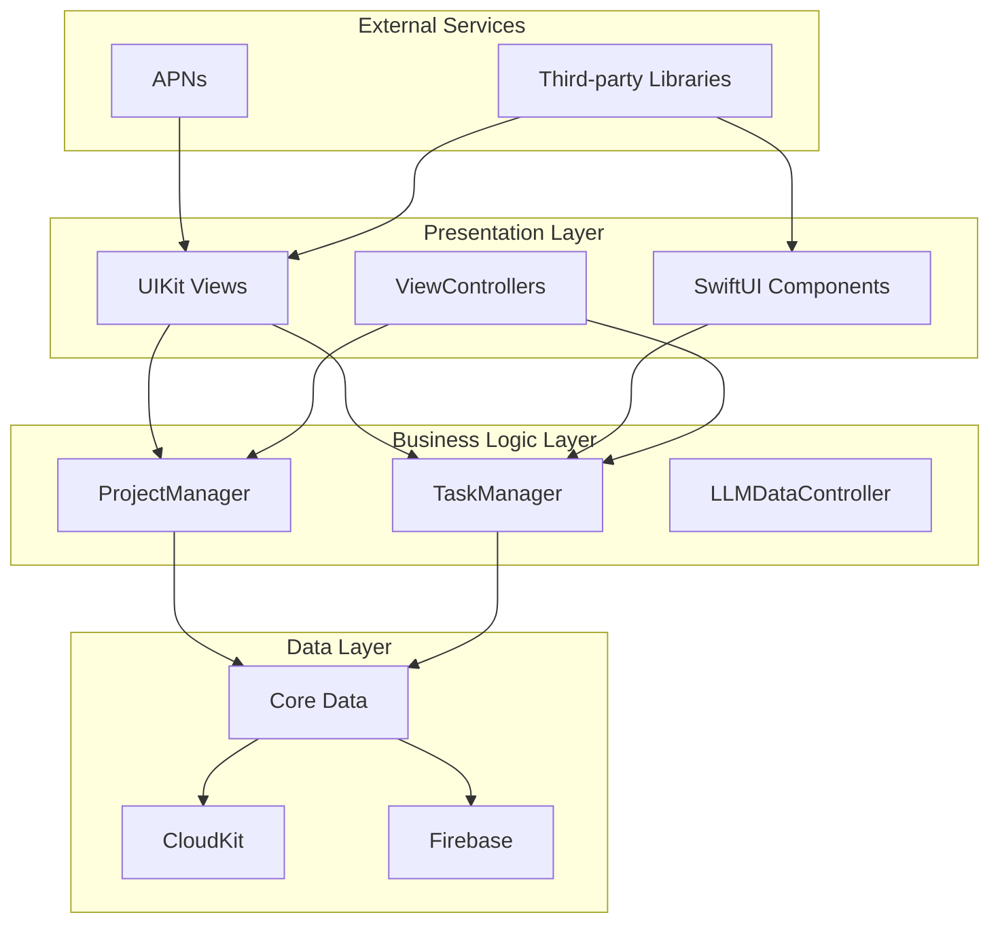
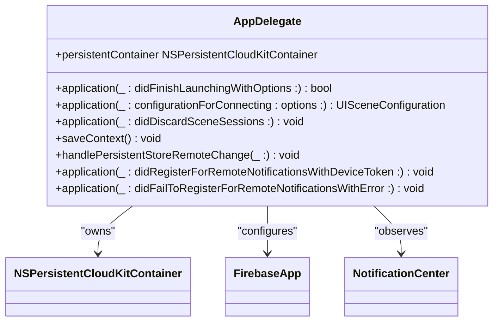
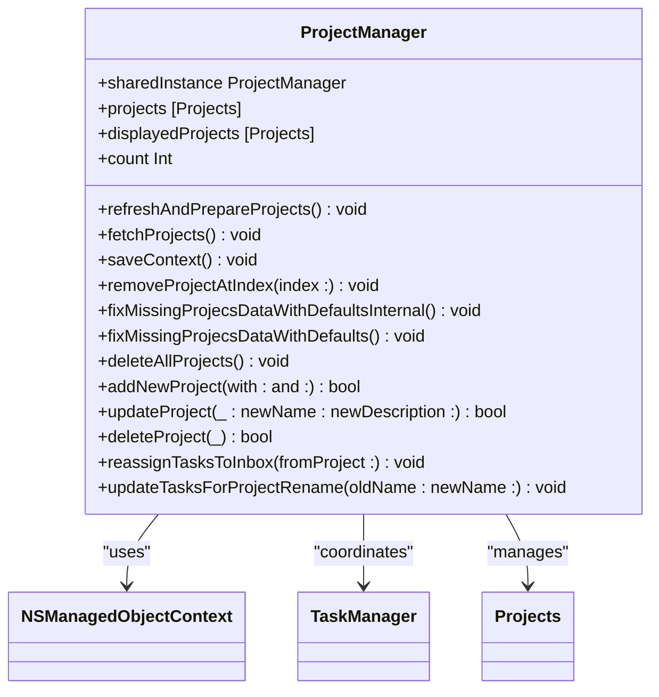
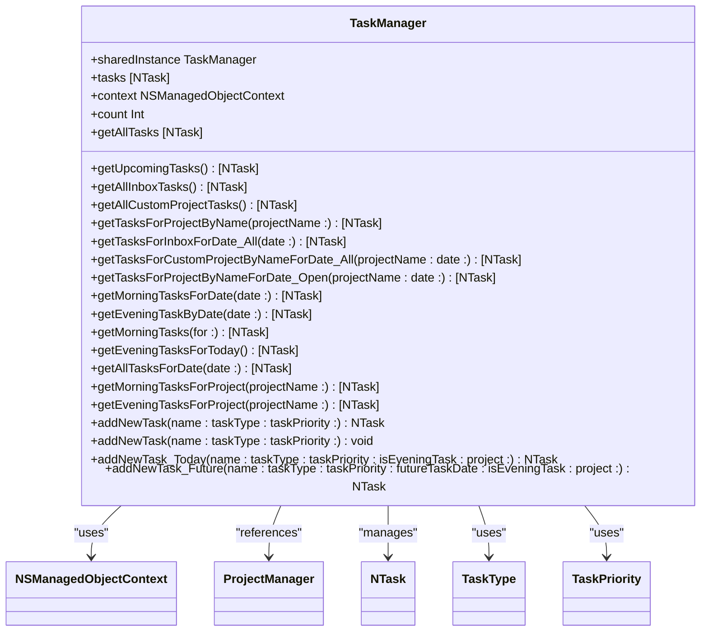
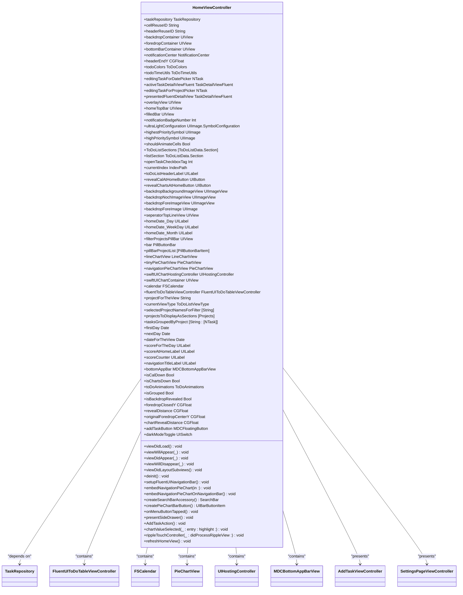
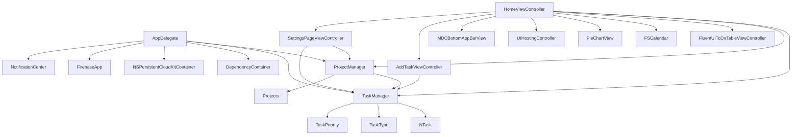

# Architecture Overview

<cite>
**Referenced Files in This Document**   
- [AppDelegate.swift](file://To%20Do%20List/AppDelegate.swift#L1-L193)
- [ProjectManager.swift](file://To%20Do%20List/ViewControllers/ProjectManager.swift#L1-L339)
- [TaskManager.swift](file://To%20Do%20List/ViewControllers/TaskManager.swift#L1-L1004)
- [HomeViewController.swift](file://To%20Do%20List/ViewControllers/HomeViewController.swift#L1-L1106)
- [Main.storyboard](file://To%20Do%20List/Storyboards/Base.lproj/Main.storyboard#L1-L254)
- [LLMDataController.swift](file://To%20Do%20List/LLM/Models/LLMDataController.swift#L1-L17)
</cite>

## Table of Contents
1. [Introduction](#introduction)
2. [Project Structure](#project-structure)
3. [Core Components](#core-components)
4. [Architecture Overview](#architecture-overview)
5. [Detailed Component Analysis](#detailed-component-analysis)
6. [Dependency Analysis](#dependency-analysis)
7. [Performance Considerations](#performance-considerations)
8. [Troubleshooting Guide](#troubleshooting-guide)
9. [Conclusion](#conclusion)

## Introduction
The Tasker application implements a hybrid architecture combining elements of Model-View-Controller (MVC) and Clean Architecture patterns. This documentation provides a comprehensive analysis of the application's high-level design, focusing on the integration of legacy MVC components with modern architectural principles. The system leverages Core Data with CloudKit synchronization for data persistence, Firebase for analytics, and incorporates SwiftUI components within a predominantly UIKit interface. The architecture demonstrates a transitional state from traditional iOS development patterns toward more testable, maintainable, and extensible design principles.

## Project Structure

**Diagram sources**
- [Main.storyboard](file://To%20Do%20List/Storyboards/Base.lproj/Main.storyboard#L1-L254)

**Section sources**
- [Main.storyboard](file://To%20Do%20List/Storyboards/Base.lproj/Main.storyboard#L1-L254)

## Core Components

The Tasker application's core functionality revolves around task and project management, with critical components including AppDelegate for application lifecycle management, ProjectManager and TaskManager for business logic, and HomeViewController as the primary user interface controller. The architecture demonstrates a hybrid approach, maintaining legacy MVC patterns while incorporating elements of dependency injection and repository patterns. The AppDelegate initializes the Core Data stack with CloudKit synchronization and configures the dependency container, establishing the foundation for the application's data management and service coordination.

**Section sources**
- [AppDelegate.swift](file://To%20Do%20List/AppDelegate.swift#L1-L193)
- [ProjectManager.swift](file://To%20Do%20List/ViewControllers/ProjectManager.swift#L1-L339)
- [TaskManager.swift](file://To%20Do%20List/ViewControllers/TaskManager.swift#L1-L1004)

## Architecture Overview

**Diagram sources**
- [AppDelegate.swift](file://To%20Do%20List/AppDelegate.swift#L1-L193)
- [ProjectManager.swift](file://To%20Do%20List/ViewControllers/ProjectManager.swift#L1-L339)
- [TaskManager.swift](file://To%20Do%20List/ViewControllers/TaskManager.swift#L1-L1004)
- [LLMDataController.swift](file://To%20Do%20List/LLM/Models/LLMDataController.swift#L1-L17)

## Detailed Component Analysis

### AppDelegate Analysis

The AppDelegate serves as the application's entry point and lifecycle manager, responsible for initializing critical services and configuring the dependency injection system. It establishes the Core Data stack with CloudKit synchronization, configures Firebase analytics, and sets up remote notification handling. The application delegate also implements change monitoring for both Core Data remote changes and CloudKit container events, ensuring data consistency across devices. This component plays a pivotal role in the application's startup sequence and maintains the persistent container throughout the application's lifecycle.

**Diagram sources**
- [AppDelegate.swift](file://To%20Do%20List/AppDelegate.swift#L1-L193)

**Section sources**
- [AppDelegate.swift](file://To%20Do%20List/AppDelegate.swift#L1-L193)

### ProjectManager Analysis

The ProjectManager class implements the singleton pattern to manage project-related data and operations, serving as a bridge between the user interface and Core Data persistence. It maintains a published array of projects for SwiftUI integration and provides methods for CRUD operations, data validation, and default project management. The class includes sophisticated logic for handling duplicate "Inbox" projects, merging their tasks, and ensuring data consistency. ProjectManager also coordinates with TaskManager for cross-entity operations such as task reassignment during project deletion or renaming.

**Diagram sources**
- [ProjectManager.swift](file://To%20Do%20List/ViewControllers/ProjectManager.swift#L1-L339)

**Section sources**
- [ProjectManager.swift](file://To%20Do%20List/ViewControllers/ProjectManager.swift#L1-L339)

### TaskManager Analysis

The TaskManager class serves as the central business logic component for task management operations, implementing a singleton pattern to ensure consistent state across the application. It provides comprehensive methods for task retrieval, filtering, and creation, with specialized functions for different task types (morning, evening, upcoming) and project contexts. The class leverages Core Data predicates for efficient data fetching and includes sophisticated logic for handling task completion, overdue tasks, and date-based filtering. TaskManager also maintains compatibility with legacy code while incorporating modern Swift patterns and enumerations for task type and priority management.

**Diagram sources**
- [TaskManager.swift](file://To%20Do%20List/ViewControllers/TaskManager.swift#L1-L1004)

**Section sources**
- [TaskManager.swift](file://To%20Do%20List/ViewControllers/TaskManager.swift#L1-L1004)

### HomeViewController Analysis

The HomeViewController represents the primary user interface component, implementing a hybrid approach that combines UIKit with SwiftUI elements. It manages the main application screen, coordinating between the FluentUI table view, calendar integration, and chart displays. The view controller handles user interactions, navigation, and state management for the home screen, including task filtering, search functionality, and theme adaptation. It also implements the TaskRepositoryDependent protocol for dependency injection, demonstrating the application's transition toward more modular design patterns. The component integrates multiple third-party libraries for enhanced UI capabilities and chart visualization.

**Diagram sources**
- [HomeViewController.swift](file://To%20Do%20List/ViewControllers/HomeViewController.swift#L1-L1106)

**Section sources**
- [HomeViewController.swift](file://To%20Do%20List/ViewControllers/HomeViewController.swift#L1-L1106)

## Dependency Analysis

**Diagram sources**
- [AppDelegate.swift](file://To%20Do%20List/AppDelegate.swift#L1-L193)
- [ProjectManager.swift](file://To%20Do%20List/ViewControllers/ProjectManager.swift#L1-L339)
- [TaskManager.swift](file://To%20Do%20List/ViewControllers/TaskManager.swift#L1-L1004)
- [HomeViewController.swift](file://To%20Do%20List/ViewControllers/HomeViewController.swift#L1-L1106)
- [Main.storyboard](file://To%20Do%20List/Storyboards/Base.lproj/Main.storyboard#L1-L254)

## Performance Considerations
The application demonstrates several performance optimization strategies, including the use of Core Data fetch requests with predicates for efficient data retrieval, background context operations for non-UI tasks, and lazy loading of resources. The architecture minimizes unnecessary data fetching by maintaining published properties that trigger UI updates only when data changes. However, potential performance bottlenecks exist in the form of multiple save operations in sequence, such as when handling remote store changes, which could be optimized through batch processing. The use of @Published properties in manager classes ensures that UI updates are only triggered when necessary, reducing redundant rendering.

## Troubleshooting Guide

Common issues in the Tasker application typically relate to data synchronization, UI rendering, and dependency injection. For CloudKit synchronization problems, verify that the container identifier in the persistent store description matches the configured iCloud container. If UI updates are not reflecting data changes, ensure that the @Published properties in manager classes are being updated on the main thread. For dependency injection failures, confirm that the DependencyContainer is properly configured in the AppDelegate and that the inject(into:) method is called before presenting view controllers. When encountering Core Data errors during application launch, check the persistent store loading completion handler for specific error details and ensure that the data model version is compatible with existing data.

**Section sources**
- [AppDelegate.swift](file://To%20Do%20List/AppDelegate.swift#L1-L193)
- [ProjectManager.swift](file://To%20Do%20List/ViewControllers/ProjectManager.swift#L1-L339)
- [TaskManager.swift](file://To%20Do%20List/ViewControllers/TaskManager.swift#L1-L1004)

## Conclusion
The Tasker application demonstrates a transitional architecture that blends traditional iOS development patterns with modern software design principles. The hybrid approach of MVC and Clean Architecture elements provides a foundation for improved testability, maintainability, and extensibility. The application successfully integrates multiple persistence technologies, including Core Data with CloudKit synchronization and SwiftData for LLM components, while maintaining a cohesive user experience across UIKit and SwiftUI interfaces. Future development should focus on completing the transition to dependency injection, implementing comprehensive unit testing, and further decoupling business logic from presentation concerns to fully realize the benefits of Clean Architecture.