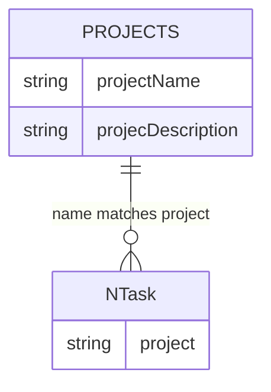
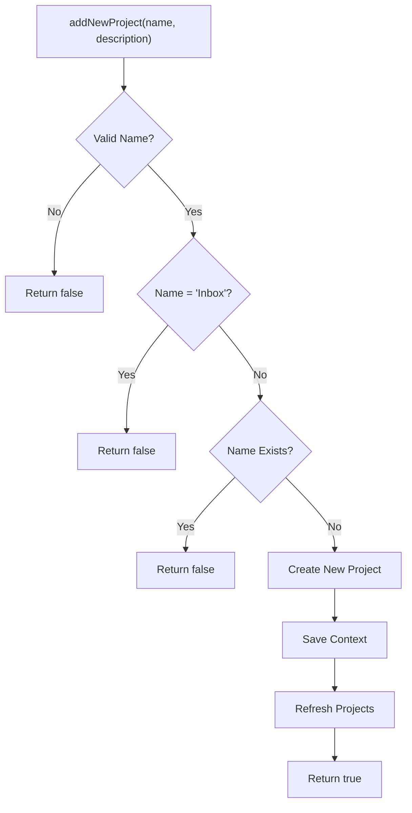
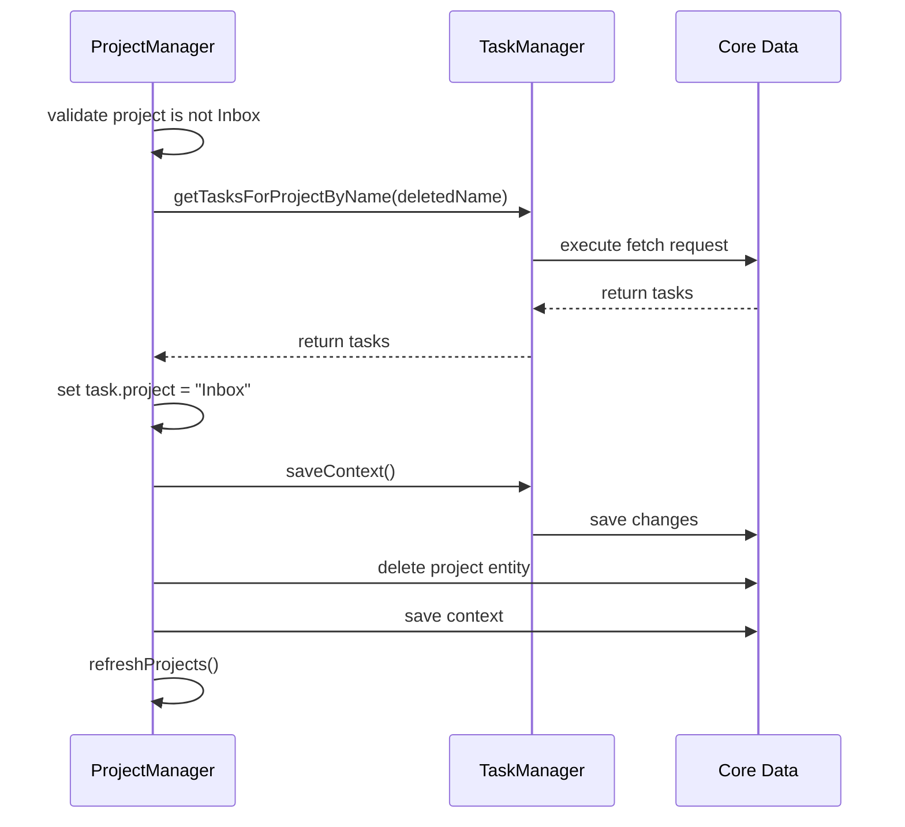

# ProjectManager Implementation

<cite>
**Referenced Files in This Document**   
- [ProjectManager.swift](file://To%20Do%20List/ViewControllers/ProjectManager.swift#L0-L338)
- [Projects+CoreDataClass.swift](file://Projects+CoreDataClass.swift#L0-L15)
- [Projects+CoreDataProperties.swift](file://Projects+CoreDataProperties.swift#L0-L22)
- [TaskManager.swift](file://To%20Do%20List/ViewControllers/TaskManager.swift#L0-L1004)
- [HomeViewController.swift](file://To%20Do%20List/ViewControllers/HomeViewController.swift#L0-L1106)
- [AddTaskViewController.swift](file://To%20Do%20List/ViewControllers/AddTaskViewController.swift#L0-L400)
- [DependencyContainer.swift](file://To%20Do%20List/Managers/DependencyContainer.swift#L0-L81)
- [README.md](file://README.md#L974-L985)
</cite>

## Table of Contents
1. [Introduction](#introduction)
2. [Project Structure and Architecture Context](#project-structure-and-architecture-context)
3. [Core Responsibilities of ProjectManager](#core-responsibilities-of-projectmanager)
4. [Data Model: Projects Entity](#data-model-projects-entity)
5. [Key Methods and Business Logic](#key-methods-and-business-logic)
6. [Integration with Core Data](#integration-with-core-data)
7. [Interaction with TaskManager and Task Relationships](#interaction-with-taskmanager-and-task-relationships)
8. [Usage in View Controllers](#usage-in-view-controllers)
9. [Coexistence with Modern Architecture (ProjectRepository)](#coexistence-with-modern-architecture-projectrepository)
10. [Potential Issues and Risks](#potential-issues-and-risks)
11. [Best Practices for Extension and Maintenance](#best-practices-for-extension-and-maintenance)
12. [Conclusion](#conclusion)

## Introduction

The **ProjectManager** component in the Tasker application is a legacy singleton class responsible for managing all project-related business logic. It serves as the central coordinator for creating, updating, and deleting project entities, enforcing data integrity, and maintaining consistency between projects and their associated tasks. Built on top of Core Data, ProjectManager operates within a hybrid architecture that is gradually transitioning toward a modern repository pattern. This document provides a comprehensive analysis of its implementation, responsibilities, integration points, and role in the current codebase.

**Section sources**
- [ProjectManager.swift](file://To%20Do%20List/ViewControllers/ProjectManager.swift#L0-L338)

## Project Structure and Architecture Context

The Tasker application follows a layered architecture with a mix of legacy and modern components. The **ProjectManager** resides in the `ViewControllers` directory, indicating its historical coupling to the UI layer, despite its role as a business logic manager. The codebase is undergoing a migration from a singleton-based pattern to a dependency-injected repository pattern, as documented in the README.

The **DependencyContainer** manages modern dependencies like `TaskRepository`, while **ProjectManager** remains a direct singleton access point. This hybrid state results in coexistence between old and new patterns, with **ProjectManager** still widely used across view controllers for project operations.

```mermaid
graph TB
subgraph "Modern Architecture"
A[DependencyContainer]
B[TaskRepository]
C[CoreDataTaskRepository]
end
subgraph "Legacy Architecture"
D[ProjectManager]
E[TaskManager]
end
F[HomeViewController] --> D
G[AddTaskViewController] --> D
H[ProjectManagementView] --> D
F --> A
G --> A
A --> B
D --> E
E --> "Core Data"
B --> "Core Data"
```

**Diagram sources**
- [DependencyContainer.swift](file://To%20Do%20List/Managers/DependencyContainer.swift#L0-L81)
- [README.md](file://README.md#L974-L985)

**Section sources**
- [DependencyContainer.swift](file://To%20Do%20List/Managers/DependencyContainer.swift#L0-L81)
- [README.md](file://README.md#L974-L985)

## Core Responsibilities of ProjectManager

The **ProjectManager** class has several key responsibilities in the Tasker application:

- **Singleton Management**: Provides a single shared instance via `static let sharedInstance`.
- **Project State Management**: Maintains a `@Published` array of `Projects` as the source of truth for SwiftUI and Combine-based UI updates.
- **Default Project Handling**: Ensures the existence and integrity of the default "Inbox" project.
- **CRUD Operations**: Implements methods for creating, reading, updating, and deleting project entities.
- **Data Validation**: Enforces business rules such as preventing duplicate project names and protecting the default project.
- **UI-Specific Ordering**: Provides a `displayedProjects` computed property that ensures the "Inbox" project appears at the top of lists.

The class is marked as `ObservableObject`, enabling it to integrate with SwiftUI views through the `@ObservedObject` property wrapper.

**Section sources**
- [ProjectManager.swift](file://To%20Do%20List/ViewControllers/ProjectManager.swift#L0-L338)

## Data Model: Projects Entity

The **Projects** entity is a Core Data-managed object that represents a project in the Tasker application. It is defined across two partial files that extend the same class.

### Entity Properties

The **Projects** entity has the following attributes:

- **projectName**: String? - The name of the project (e.g., "Work", "Personal")
- **projecDescription**: String? - A description of the project (note: typo in property name)

There are no explicit relationships defined in the CoreDataProperties file, but the entity is logically connected to tasks through the `project` attribute in the `NTask` entity, which stores the project name as a string.



**Diagram sources**
- [Projects+CoreDataProperties.swift](file://Projects+CoreDataProperties.swift#L0-L22)
- [TaskManager.swift](file://To%20Do%20List/ViewControllers/TaskManager.swift#L0-L1004)

**Section sources**
- [Projects+CoreDataClass.swift](file://Projects+CoreDataClass.swift#L0-L15)
- [Projects+CoreDataProperties.swift](file://Projects+CoreDataProperties.swift#L0-L22)

## Key Methods and Business Logic

### createProject (addNewProject)

The `addNewProject(with:and:)` method creates a new project with validation:

- **Validation Rules**:
  - Project name cannot be empty or whitespace-only
  - Project name cannot be "Inbox" (reserved)
  - Project name must be unique (case-insensitive)

- **Process Flow**:
  1. Validate input parameters
  2. Check for existing project with same name
  3. Create new `Projects` entity using `NSEntityDescription.insertNewObject`
  4. Set name and description
  5. Save context and refresh project list



**Diagram sources**
- [ProjectManager.swift](file://To%20Do%20List/ViewControllers/ProjectManager.swift#L200-L230)

**Section sources**
- [ProjectManager.swift](file://To%20Do%20List/ViewControllers/ProjectManager.swift#L200-L230)

### assignTaskToProject

While there is no explicit `assignTaskToProject` method, project-task assignment is handled through string-based references. When a task's `project` attribute is set to a project name, it is implicitly assigned. The **TaskManager**'s `getTasksForProjectByName` method uses a `CONTAINS[c]` predicate to find tasks belonging to a project.

This approach creates a loose coupling between tasks and projects, relying on string matching rather than Core Data relationships.

**Section sources**
- [TaskManager.swift](file://To%20Do%20List/ViewControllers/TaskManager.swift#L0-L1004)

### deleteProject

The `deleteProject(_:)` method implements cascade behavior when deleting a project:

- **Validation**: Prevents deletion of the default "Inbox" project
- **Cascade Behavior**: Reassigns all tasks from the deleted project to the "Inbox" project
- **Data Integrity**: Ensures no tasks are orphaned

The method calls `reassignTasksToInbox(fromProject:)` which uses **TaskManager** to find and update all tasks belonging to the deleted project.



**Diagram sources**
- [ProjectManager.swift](file://To%20Do%20List/ViewControllers/ProjectManager.swift#L280-L300)
- [TaskManager.swift](file://To%20Do%20List/ViewControllers/TaskManager.swift#L0-L1004)

**Section sources**
- [ProjectManager.swift](file://To%20Do%20List/ViewControllers/ProjectManager.swift#L280-L300)

## Integration with Core Data

**ProjectManager** integrates with Core Data through the `NSManagedObjectContext` injected during initialization:

- **Context Injection**: Obtains the view context from `AppDelegate`'s persistent container
- **Fetching**: Uses `NSFetchRequest<NSManagedObject>` to retrieve all `Projects` entities
- **Persistence**: Implements `saveContext()` to commit changes to the persistent store
- **Thread Safety**: Ensures UI updates via `@Published` occur on the main thread using `DispatchQueue.main.async`

The `fetchProjects()` method is central to data synchronization, updating the `projects` array which triggers UI updates through Combine's publisher system.

```swift
private func fetchProjects() {
    let fetchRequest = NSFetchRequest<NSManagedObject>(entityName: "Projects")
    do {
        let results = try context.fetch(fetchRequest)
        DispatchQueue.main.async {
            self.projects = results as? [Projects] ?? []
        }
    } catch {
        // Handle error
    }
}
```

**Section sources**
- [ProjectManager.swift](file://To%20Do%20List/ViewControllers/ProjectManager.swift#L0-L338)

## Interaction with TaskManager and Task Relationships

**ProjectManager** has a tight coupling with **TaskManager** for maintaining data integrity between projects and tasks:

- **Task Reassignment**: During project deletion or renaming, **ProjectManager** calls **TaskManager** to update affected tasks
- **Shared Constants**: Both classes reference the default project name ("Inbox")
- **Cross-Manager Operations**: **ProjectManager** triggers `TaskManager.sharedInstance.saveContext()` after modifying task references

This interdependence creates a potential circular dependency and violates separation of concerns, as project operations directly manipulate task data.

The relationship is unidirectional and string-based, lacking formal Core Data relationships, which impacts query performance and referential integrity.

**Section sources**
- [ProjectManager.swift](file://To%20Do%20List/ViewControllers/ProjectManager.swift#L0-L338)
- [TaskManager.swift](file://To%20Do%20List/ViewControllers/TaskManager.swift#L0-L1004)

## Usage in View Controllers

**ProjectManager** is widely used across the UI layer, demonstrating its deep integration:

### HomeViewController

- **Initialization**: Sets `projectForTheView` to `ProjectManager.sharedInstance.defaultProject`
- **Project Filtering**: Uses `getAllProjects()` to populate filter options
- **Task Display**: References default project name when determining task project affiliation

```swift
var projectForTheView = ProjectManager.sharedInstance.defaultProject
```

### AddTaskViewController

- **Project Selection**: Uses `displayedProjects` to populate the project selection UI
- **Default Reference**: Retrieves `defaultProject` for setting initial project selection

```swift
let allDisplayProjects = ProjectManager.sharedInstance.displayedProjects
let inboxTitle = ProjectManager.sharedInstance.defaultProject
```

### SwiftUI Views

- **ProjectManagementView**: Uses `@ObservedObject var projectManager = ProjectManager.sharedInstance` to bind directly to the singleton

This widespread usage illustrates the tight coupling between **ProjectManager** and the UI layer, making it challenging to replace or refactor.

**Section sources**
- [HomeViewController.swift](file://To%20Do%20List/ViewControllers/HomeViewController.swift#L163)
- [AddTaskViewController.swift](file://To%20Do%20List/ViewControllers/AddTaskViewController.swift#L309-L322)
- [ProjectManagementView.swift](file://To%20Do%20List/View/ProjectManagementView.swift#L6)

## Coexistence with Modern Architecture (ProjectRepository)

The codebase is in a transitional state, with **ProjectManager** existing alongside modern architectural patterns:

- **Migration Status**: According to the README, migration to `ProjectRepository` is "Not started"
- **Dependency Injection**: New view controllers use `DependencyContainer` for dependency injection, but **ProjectManager** is still accessed via singleton
- **Hybrid Usage**: Some view controllers (like `HomeViewController`) have both injected dependencies (`taskRepository`) and singleton references (`ProjectManager`)

The README outlines a clear migration path:
1. Refactor `HomeViewController` to use repository
2. Move project CRUD to dedicated repository
3. Remove remaining singleton usage; mark as deprecated

This indicates that **ProjectManager** is considered a legacy component awaiting replacement.

**Section sources**
- [README.md](file://README.md#L974-L985)
- [DependencyContainer.swift](file://To%20Do%20List/Managers/DependencyContainer.swift#L0-L81)

## Potential Issues and Risks

### Memory Leaks

The singleton pattern combined with `@Published` properties creates potential memory retention issues:

- **Strong Reference Cycles**: View controllers holding references to the singleton may prevent deallocation
- **Combine Subscribers**: Observers of the `@Published` property may not be properly cleaned up

### Thread-Safety Concerns

- **Context Access**: The managed object context is shared across threads, but there is no explicit confinement or synchronization
- **UI Updates**: While `fetchProjects()` dispatches to the main queue, other operations may modify the context from background threads without protection
- **Race Conditions**: Concurrent access to `projects` array could lead to inconsistencies

### Architectural Issues

- **Tight Coupling**: Deep integration with UI components makes testing and replacement difficult
- **Violation of Single Responsibility**: Manages data persistence, UI state, and business logic
- **String-Based Relationships**: Lack of formal Core Data relationships reduces data integrity and query efficiency

**Section sources**
- [ProjectManager.swift](file://To%20Do%20List/ViewControllers/ProjectManager.swift#L0-L338)

## Best Practices for Extension and Maintenance

When extending **ProjectManager** functionality, follow these best practices to minimize coupling and technical debt:

1. **Avoid New UI Dependencies**: Do not add new view controller references; instead, use delegation or Combine publishers
2. **Encapsulate Logic**: Move complex business logic to dedicated service classes
3. **Prepare for Migration**: Structure new methods to be easily extractable into a future `ProjectRepository`
4. **Improve Data Integrity**: Consider adding formal Core Data relationships between `Projects` and `NTask`
5. **Add Thread Safety**: Wrap context operations in synchronization mechanisms
6. **Deprecate Gradually**: Mark the singleton interface as deprecated and encourage use of a protocol-based abstraction

For new features, prefer implementing them in the modern repository pattern rather than extending the legacy **ProjectManager**.

**Section sources**
- [ProjectManager.swift](file://To%20Do%20List/ViewControllers/ProjectManager.swift#L0-L338)
- [README.md](file://README.md#L974-L985)

## Conclusion

The **ProjectManager** component is a critical but legacy part of the Tasker application, serving as the central authority for project management. While it effectively handles project CRUD operations and maintains data integrity with tasks, its singleton pattern, tight UI coupling, and lack of thread safety present significant technical challenges. The codebase is actively migrating toward a modern repository pattern, but **ProjectManager** remains widely used. Future development should focus on isolating its responsibilities, improving data relationships, and ultimately replacing it with a properly injected `ProjectRepository` to achieve a cleaner, more maintainable architecture.