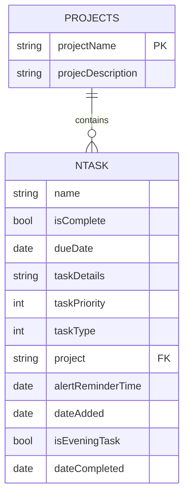
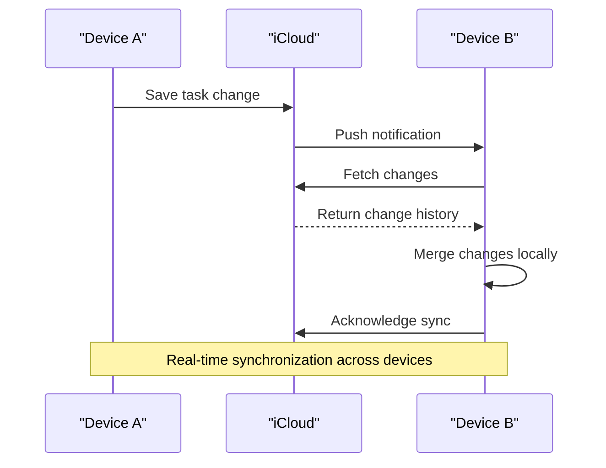

# Core Data and CloudKit Integration

<cite>
**Referenced Files in This Document**   
- [NTask+CoreDataClass.swift](file://To%20Do%20List/NTask+CoreDataClass.swift)
- [NTask+CoreDataProperties.swift](file://To%20Do%20List/NTask+CoreDataProperties.swift)
- [NTask+Extensions.swift](file://To%20Do%20List/NTask+Extensions.swift)
- [Projects+CoreDataClass.swift](file://Projects+CoreDataClass.swift)
- [Projects+CoreDataProperties.swift](file://Projects+CoreDataProperties.swift)
- [README.md](file://README.md)
</cite>

## Table of Contents
1. [Data Model Overview](#data-model-overview)
2. [NTask Entity Details](#ntask-entity-details)
3. [Projects Entity Details](#projects-entity-details)
4. [Entity Relationship and Data Integrity](#entity-relationship-and-data-integrity)
5. [CloudKit Synchronization Configuration](#cloudkit-synchronization-configuration)
6. [Synchronization Features and Behavior](#synchronization-features-and-behavior)
7. [Conflict Resolution and Merge Policy](#conflict-resolution-and-merge-policy)
8. [Privacy and Security Considerations](#privacy-and-security-considerations)
9. [Troubleshooting Common Synchronization Issues](#troubleshooting-common-synchronization-issues)

## Data Model Overview

The Tasker application utilizes Core Data as its primary persistence framework, with entities designed to support task management and project categorization. The two main entities are `NTask` and `Projects`, which together form the foundation of the application's data model. While a logical one-to-many relationship exists between projects and tasks, the current implementation uses a string-based reference rather than a formal Core Data relationship. This design choice will be addressed in a future migration.



**Diagram sources**
- [README.md](file://README.md#L887-L924)

**Section sources**
- [README.md](file://README.md#L853-L868)

## NTask Entity Details

The `NTask` entity represents individual tasks within the Tasker application. It contains comprehensive attributes for task tracking, scheduling, and categorization.

### Attributes

| Attribute | Type | Optional | Default | Description |
|---------|------|--------|--------|-----------|
| **name** | String | No | — | Task title displayed in lists and detail views |
| **isComplete** | Bool | No | false | Flag indicating whether the task has been completed |
| **dueDate** | Date | Yes | — | Scheduled completion date (nil indicates unscheduled) |
| **taskDetails** | String | Yes | — | Detailed description or notes about the task |
| **taskPriority** | Int32 | No | 3 | Priority level (1=highest, 2=high, 3=medium, 4=low) |
| **taskType** | Int32 | No | 1 | Category type (1=morning, 2=evening, 3=upcoming, 4=inbox) |
| **project** | String | Yes | "Inbox" | String reference to the associated project name |
| **alertReminderTime** | Date | Yes | — | Time for local notification reminders |
| **dateAdded** | Date | Yes | now() | Timestamp when the task was created |
| **isEveningTask** | Bool | No | false | Convenience flag for evening tasks (legacy UI support) |
| **dateCompleted** | Date | Yes | — | Timestamp when the task was marked complete |

### Type-Safe Enum Wrappers

The `NTask+Extensions.swift` file provides type-safe accessors that convert between raw integer values and enum types:

```swift
// Task priority enum
enum TaskPriority: Int32, CaseIterable {
    case highest = 1    // P0: 7 points
    case high = 2       // P1: 4 points
    case medium = 3     // P2: 3 points (default)
    case low = 4        // P3: 2 points
}

// Task type enum
enum TaskType: Int32, CaseIterable {
    case morning = 1    // Morning tasks
    case evening = 2    // Evening tasks
    case upcoming = 3   // Future-dated tasks
    case inbox = 4      // Uncategorized tasks
}
```

These enums are exposed through computed properties on the `NTask` entity, enabling type-safe access:

```swift
extension NTask {
    var priority: TaskPriority {
        get { return TaskPriority(rawValue: self.taskPriority) ?? .medium }
        set { self.taskPriority = newValue.rawValue }
    }
    
    var type: TaskType {
        get { return TaskType(rawValue: self.taskType) ?? .morning }
        set { self.taskType = newValue.rawValue }
    }
}
```

**Section sources**
- [NTask+CoreDataProperties.swift](file://To%20Do%20List/NTask+CoreDataProperties.swift#L0-L53)
- [NTask+Extensions.swift](file://To%20Do%20List/NTask+Extensions.swift#L0-L75)
- [README.md](file://README.md#L870-L886)

## Projects Entity Details

The `Projects` entity serves as a categorization system for tasks, allowing users to organize their tasks into meaningful groups.

### Attributes

| Attribute | Type | Optional | Default | Description |
|---------|------|--------|--------|-----------|
| **projectName** | String | Yes | — | Primary identifier and natural key for the project |
| **projecDescription** | String | Yes | — | User-facing description of the project (note: attribute name contains typo for compatibility) |

The entity is defined as a simple Core Data object with minimal attributes, focusing on providing a categorization framework for tasks.

```swift
@objc(Projects)
public class Projects: NSManagedObject {
}
```

Despite its simplicity, the `Projects` entity plays a crucial role in the application's organization system, with all tasks referencing a project by name.

**Section sources**
- [Projects+CoreDataClass.swift](file://Projects+CoreDataClass.swift#L0-L15)
- [Projects+CoreDataProperties.swift](file://Projects+CoreDataProperties.swift#L0-L22)
- [README.md](file://README.md#L887-L924)

## Entity Relationship and Data Integrity

Currently, the relationship between `Projects` and `NTask` entities is implemented at the application logic level rather than through Core Data's relationship system. This creates a logical one-to-many relationship where one project can contain multiple tasks.

### Current Implementation

The relationship is maintained through a string reference in the `NTask` entity:

- **Foreign Key**: The `project` attribute in `NTask` stores the `projectName` of the associated `Projects` entity
- **Relationship Direction**: `Projects 1 — * NTask` (one-to-many)
- **Delete Rule**: When a project is deleted, its associated tasks persist with the `project` field retaining the name of the deleted project

### Data Integrity Management

Since the relationship is not enforced by Core Data, data integrity is maintained through application-level logic:

```swift
func mergeInboxDuplicates() {
    // Manual merge routine to re-assign tasks to "Inbox" 
    // when their project is deleted
}
```

A future migration is planned to convert this string-based reference into a formal Core Data relationship with a *Nullify* delete rule, which would automatically clear the relationship when a project is deleted without removing the tasks.

**Section sources**
- [README.md](file://README.md#L887-L924)

## CloudKit Synchronization Configuration

The Tasker application implements seamless multi-device synchronization using Apple's CloudKit integration with Core Data through `NSPersistentCloudKitContainer`.

### Container Setup

The persistent container is configured as a `NSPersistentCloudKitContainer` with specific options for iCloud synchronization:

```swift
lazy var persistentContainer: NSPersistentCloudKitContainer = {
    let container = NSPersistentCloudKitContainer(name: "TaskModel")
    
    guard let description = container.persistentStoreDescriptions.first else {
        fatalError("Failed to retrieve a persistent store description.")
    }
    
    // CloudKit container setup
    description.cloudKitContainerOptions = NSPersistentCloudKitContainerOptions(
        containerIdentifier: "iCloud.TaskerCloudKit"
    )
    
    // Enable history tracking and remote notifications
    description.setOption(true as NSNumber, forKey: NSPersistentHistoryTrackingKey)
    description.setOption(true as NSNumber, forKey: NSPersistentStoreRemoteChangeNotificationPostOptionKey)
    
    return container
}()
```

### Configuration Parameters

| Parameter | Value | Purpose |
|---------|-------|---------|
| **Container Name** | "TaskModel" | Name of the Core Data model file |
| **CloudKit Container** | "iCloud.TaskerCloudKit" | Dedicated iCloud container identifier |
| **History Tracking** | Enabled | Enables persistent history tracking for change management |
| **Remote Notifications** | Enabled | Allows silent push notifications for real-time sync |

**Section sources**
- [README.md](file://README.md#L1321-L1354)

## Synchronization Features and Behavior

The CloudKit integration provides robust synchronization capabilities that ensure data consistency across all of a user's devices.

### Key Synchronization Features

- **Real-time Sync**: Changes are propagated across devices using silent push notifications
- **Background Sync**: Automatic merging of remote changes via `handlePersistentStoreRemoteChange`
- **Offline Capability**: Local-first architecture ensures full functionality without internet connectivity
- **Automatic Reconnection**: Seamless synchronization when network connectivity is restored
- **Data Consolidation**: Post-sync validation and cleanup using `ProjectManager` and `TaskManager`

### Synchronization Workflow



**Diagram sources**
- [README.md](file://README.md#L1355-L1380)

**Section sources**
- [README.md](file://README.md#L1355-L1380)

## Conflict Resolution and Merge Policy

The application employs sophisticated conflict resolution mechanisms to handle simultaneous edits across multiple devices.

### Merge Policy

The system uses `NSMergeByPropertyStoreTrumpMergePolicy`, which implements intelligent conflict handling by:

- Preserving the most recent value for each individual property
- Merging changes at the property level rather than choosing one entire object over another
- Resolving conflicts in favor of the store (persistent store) values when there are conflicts

### History Tracking

Persistent history tracking is enabled to provide robust conflict resolution:

- **NSPersistentHistoryTrackingKey**: Enables the persistent history transaction system
- Change sets are tracked and can be fetched to understand what changes occurred
- Allows the system to reconstruct the sequence of changes across devices

### Conflict Scenarios and Resolution

| Scenario | Resolution Strategy |
|--------|-------------------|
| **Simultaneous edits to different properties** | Both changes are preserved (property-level merging) |
| **Simultaneous edits to the same property** | Most recent change wins (timestamp-based) |
| **Task creation on multiple devices** | Both tasks are preserved with unique identifiers |
| **Task deletion during edit** | Deletion takes precedence over edits |

The background sync process automatically handles these scenarios through the `handlePersistentStoreRemoteChange` method, which processes remote change notifications and merges updates into the local store.

**Section sources**
- [README.md](file://README.md#L1355-L1380)

## Privacy and Security Considerations

The application prioritizes user privacy and data security in its CloudKit implementation.

### Data Storage Location

- **Private Database**: All user task data is stored in the user's personal iCloud private database
- **No Public Data**: No task information is stored in the public or shared databases
- **End-to-End Encryption**: iCloud private database content is end-to-end encrypted by Apple

### Privacy Features

- **User-Controlled Sync**: Users can disable iCloud sync in system settings
- **Local-First Architecture**: All data is stored locally first, with sync as an enhancement
- **No Data Mining**: Task content is not used for analytics or advertising
- **Minimal Metadata**: Only necessary metadata is synchronized (no usage patterns or behavior tracking)

The privacy-focused design ensures that sensitive task information remains under the user's control and protected by iCloud's security infrastructure.

**Section sources**
- [README.md](file://README.md#L1380-L1385)

## Troubleshooting Common Synchronization Issues

Despite the robust synchronization system, users may occasionally encounter issues that require troubleshooting.

### Common Issues and Solutions

#### Network Connectivity Problems
- **Symptoms**: Sync delays, "Syncing..." indicators persist
- **Solutions**:
  - Check internet connection on all devices
  - Toggle airplane mode to reset network stack
  - Ensure iCloud Drive is enabled in Settings > [User Name] > iCloud

#### iCloud Storage Quota Limits
- **Symptoms**: Sync failures, error messages about storage limits
- **Solutions**:
  - Check iCloud storage usage in Settings > [User Name] > iCloud
  - Upgrade iCloud storage plan if needed
  - Offload infrequently used apps to free up space

#### Account Authentication Issues
- **Symptoms**: "Sign in to iCloud" prompts, sync stopped notifications
- **Solutions**:
  - Verify Apple ID sign-in status in Settings
  - Sign out and back into iCloud account
  - Ensure same Apple ID is used on all devices

#### Data Conflicts and Duplicates
- **Symptoms**: Duplicate tasks, lost edits, inconsistent data
- **Solutions**:
  - Force sync by closing and reopening the app
  - Restart devices to clear temporary sync states
  - Contact support for data recovery if needed

### Developer-Level Troubleshooting

For development and debugging purposes:

- **Enable CloudKit Logging**: Use Console app to monitor CloudKit operations
- **Check Container Status**: Verify "iCloud.TaskerCloudKit" container in CloudKit Dashboard
- **Test in Development Environment**: Use separate development container to avoid production data issues
- **Monitor Sync Performance**: Use Xcode's Core Data instrumentation to identify bottlenecks

Regular testing in both development and production environments ensures reliable synchronization behavior.

**Section sources**
- [README.md](file://README.md#L1355-L1385)