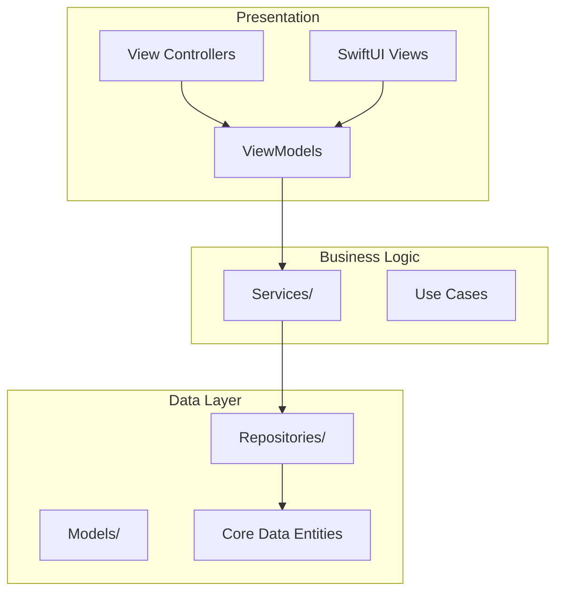
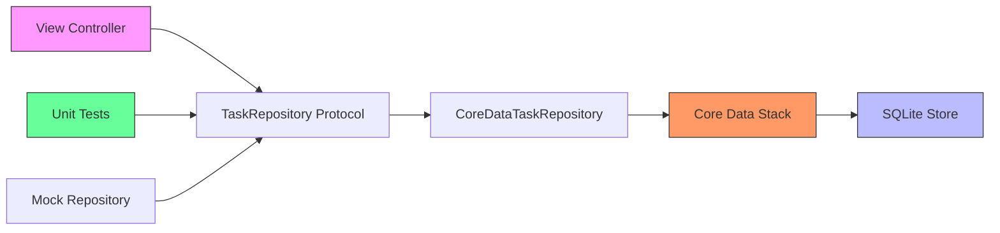
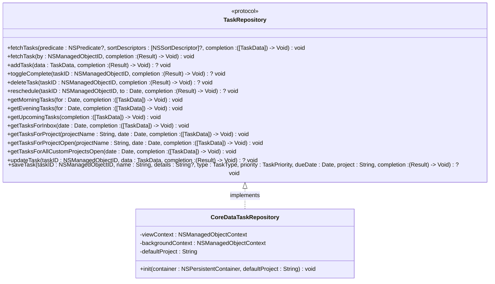
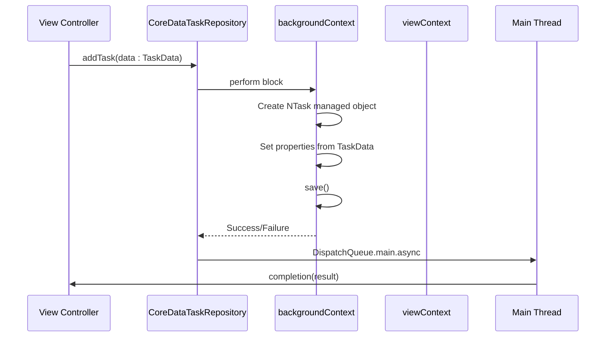
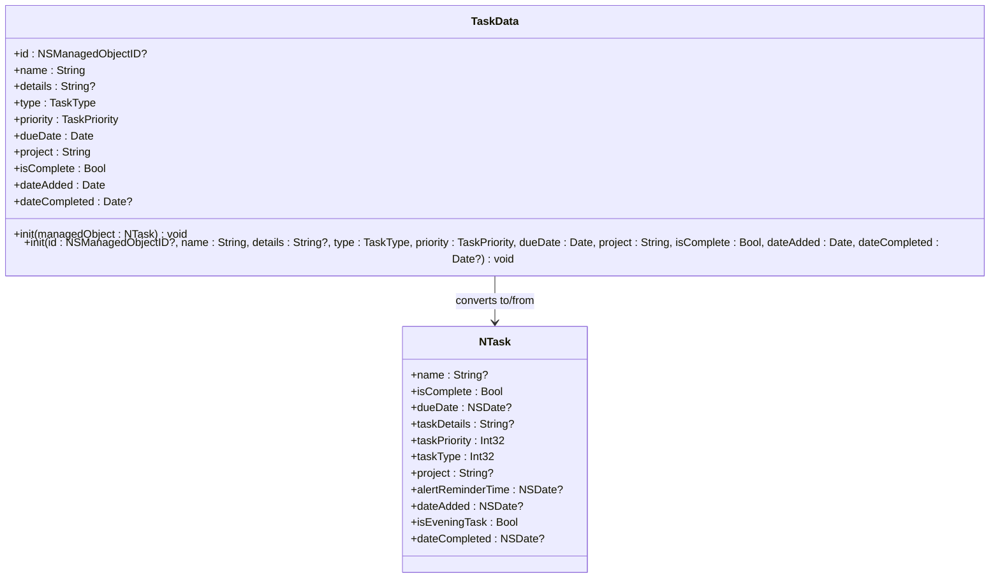
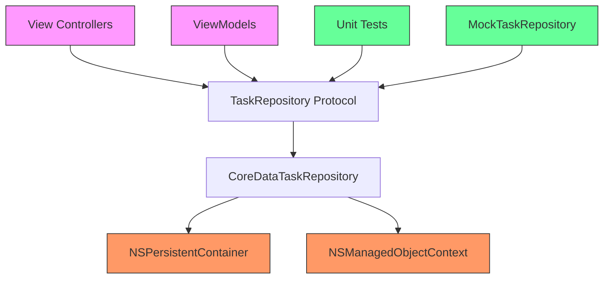

# Repository Pattern Implementation

<cite>
**Referenced Files in This Document**   
- [TaskRepository.swift](file://To%20Do%20List/Repositories/TaskRepository.swift#L1-L117)
- [CoreDataTaskRepository.swift](file://To%20Do%20List/Repositories/CoreDataTaskRepository.swift#L1-L454)
- [TaskData.swift](file://To%20Do%20List/Models/TaskData.swift#L1-L56)
- [NTask+CoreDataProperties.swift](file://To%20Do%20List/NTask+CoreDataProperties.swift#L1-L53)
- [NTask+CoreDataClass.swift](file://To%20Do%20List/NTask+CoreDataClass.swift#L1-L16)
- [README.md](file://README.md#L572-L985)
</cite>

## Table of Contents
1. [Introduction](#introduction)
2. [Project Structure](#project-structure)
3. [Core Components](#core-components)
4. [Architecture Overview](#architecture-overview)
5. [Detailed Component Analysis](#detailed-component-analysis)
6. [Dependency Analysis](#dependency-analysis)
7. [Performance Considerations](#performance-considerations)
8. [Troubleshooting Guide](#troubleshooting-guide)
9. [Conclusion](#conclusion)

## Introduction
The Tasker application implements a clean, testable architecture using the Repository Pattern to abstract data access operations. This document details how the `TaskRepository` protocol defines a clear interface for task data operations and how `CoreDataTaskRepository` provides a concrete implementation using Core Data. The design enables dependency injection, improves testability, and separates concerns between data access and business logic. The repository handles all CRUD operations, complex queries, and threading considerations while presenting a clean API to view controllers and services.

## Project Structure
The project follows a layered architecture with clear separation of concerns. The repository implementation resides in dedicated directories, separating data access logic from UI and business logic components.

**Diagram sources**
- [TaskRepository.swift](file://To%20Do%20List/Repositories/TaskRepository.swift#L1-L117)
- [CoreDataTaskRepository.swift](file://To%20Do%20List/Repositories/CoreDataTaskRepository.swift#L1-L454)
- [TaskData.swift](file://To%20Do%20List/Models/TaskData.swift#L1-L56)

**Section sources**
- [TaskRepository.swift](file://To%20Do%20List/Repositories/TaskRepository.swift#L1-L117)
- [CoreDataTaskRepository.swift](file://To%20Do%20List/Repositories/CoreDataTaskRepository.swift#L1-L454)

## Core Components
The repository pattern implementation consists of three key components: the `TaskRepository` protocol defining the interface, the `CoreDataTaskRepository` class providing the concrete implementation, and the `TaskData` struct serving as the data transfer object between layers. This separation ensures that the presentation layer remains decoupled from Core Data implementation details.

**Section sources**
- [TaskRepository.swift](file://To%20Do%20List/Repositories/TaskRepository.swift#L1-L117)
- [CoreDataTaskRepository.swift](file://To%20Do%20List/Repositories/CoreDataTaskRepository.swift#L1-L454)
- [TaskData.swift](file://To%20Do%20List/Models/TaskData.swift#L1-L56)

## Architecture Overview
The repository pattern acts as an intermediary between the application's business logic and the data storage layer. It encapsulates the complexity of data access, providing a simplified interface to the rest of the application. This architecture enables easy testing through mocking and allows for future data source changes without affecting the rest of the codebase.

**Diagram sources**
- [TaskRepository.swift](file://To%20Do%20List/Repositories/TaskRepository.swift#L1-L117)
- [CoreDataTaskRepository.swift](file://To%20Do%20List/Repositories/CoreDataTaskRepository.swift#L1-L454)

## Detailed Component Analysis

### TaskRepository Protocol Analysis
The `TaskRepository` protocol defines a comprehensive interface for all task data operations, enabling dependency injection and making the codebase highly testable. By using protocol-oriented programming, the application can easily swap implementations for testing or future enhancements.

**Diagram sources**
- [TaskRepository.swift](file://To%20Do%20List/Repositories/TaskRepository.swift#L1-L117)

**Section sources**
- [TaskRepository.swift](file://To%20Do%20List/Repositories/TaskRepository.swift#L1-L117)

### CoreDataTaskRepository Implementation Analysis
The `CoreDataTaskRepository` class provides a concrete implementation of the `TaskRepository` protocol using Core Data. It handles all threading considerations by using separate managed object contexts for the main thread (viewContext) and background operations (backgroundContext), ensuring optimal performance and thread safety.

**Diagram sources**
- [CoreDataTaskRepository.swift](file://To%20Do%20List/Repositories/CoreDataTaskRepository.swift#L1-L454)

**Section sources**
- [CoreDataTaskRepository.swift](file://To%20Do%20List/Repositories/CoreDataTaskRepository.swift#L1-L454)

### TaskData Model Analysis
The `TaskData` struct serves as a plain Swift data transfer object that decouples the presentation layer from Core Data implementation details. It provides two initialization methods: one for converting from a Core Data managed object and another for creating new instances with specified properties.

**Diagram sources**
- [TaskData.swift](file://To%20Do%20List/Models/TaskData.swift#L1-L56)
- [NTask+CoreDataProperties.swift](file://To%20Do%20List/NTask+CoreDataProperties.swift#L1-L53)

**Section sources**
- [TaskData.swift](file://To%20Do%20List/Models/TaskData.swift#L1-L56)
- [NTask+CoreDataProperties.swift](file://To%20Do%20List/NTask+CoreDataProperties.swift#L1-L53)

## Dependency Analysis
The repository pattern implementation shows a clear dependency hierarchy, with higher-level components depending on abstractions rather than concrete implementations. This design enables easy testing and future extensibility.

**Diagram sources**
- [TaskRepository.swift](file://To%20Do%20List/Repositories/TaskRepository.swift#L1-L117)
- [CoreDataTaskRepository.swift](file://To%20Do%20List/Repositories/CoreDataTaskRepository.swift#L1-L454)

**Section sources**
- [TaskRepository.swift](file://To%20Do%20List/Repositories/TaskRepository.swift#L1-L117)
- [CoreDataTaskRepository.swift](file://To%20Do%20List/Repositories/CoreDataTaskRepository.swift#L1-L454)

## Performance Considerations
The repository implementation addresses Core Data's threading requirements through a dual-context approach. The `viewContext` is configured with `automaticallyMergesChangesFromParent = true`, allowing it to automatically receive changes saved on the background context. The `backgroundContext` uses a `NSMergeByPropertyObjectTrumpMergePolicy` to resolve merge conflicts appropriately.

For read operations, the repository uses the `viewContext` to ensure the UI always displays the most recent data. Write operations (create, update, delete) are performed on the `backgroundContext` to prevent blocking the main thread. All completion handlers are dispatched to the main queue using `DispatchQueue.main.async` to ensure UI updates occur on the correct thread.

The implementation also includes comprehensive error handling with descriptive error messages logged to the console, aiding in debugging and monitoring.

## Troubleshooting Guide
Common issues with the repository implementation typically involve threading conflicts or data consistency problems:

1. **Threading Violations**: Always perform Core Data operations within the appropriate context's perform block. Never access managed objects across threads directly.

2. **Context Merge Issues**: Ensure the `viewContext` has `automaticallyMergesChangesFromParent = true` set, as implemented in the `CoreDataTaskRepository` initialization.

3. **Missing Object Errors**: When fetching objects by `NSManagedObjectID`, always handle the case where the object might not exist (404 error), as shown in the `fetchTask(by:completion:)` method.

4. **Notification Handling**: The repository posts a `TaskCompletionChanged` notification when tasks are completed, which should be observed by components that need to update their state (e.g., analytics services).

5. **Memory Management**: The use of completion closures with `[weak self]` references is recommended when capturing the repository to prevent retain cycles, though this is not shown in the current implementation.

**Section sources**
- [CoreDataTaskRepository.swift](file://To%20Do%20List/Repositories/CoreDataTaskRepository.swift#L1-L454)
- [README.md](file://README.md#L925-L976)

## Conclusion
The repository pattern implementation in Tasker provides a robust, maintainable architecture for data access. By defining a clear protocol interface and providing a well-structured concrete implementation, the codebase achieves separation of concerns, improved testability, and easier maintenance. The dual-context approach properly handles Core Data's threading requirements, while the `TaskData` struct effectively decouples the presentation layer from persistence details. This implementation serves as a strong foundation for future enhancements and demonstrates best practices in iOS application architecture.