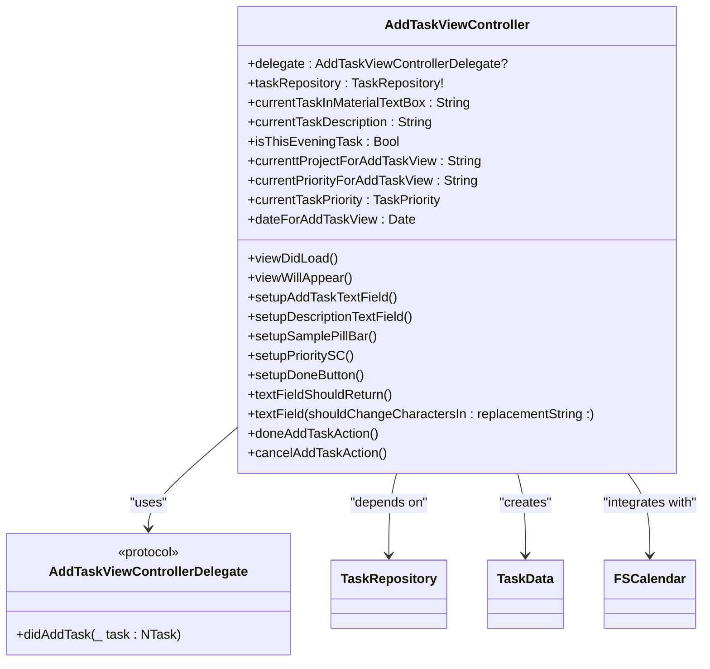
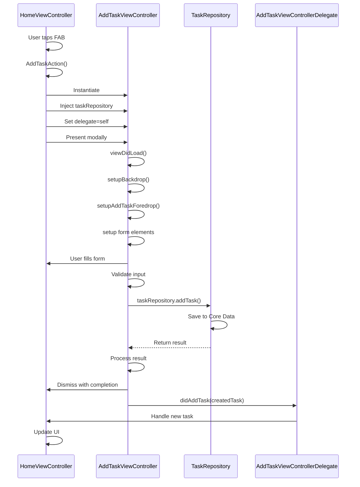
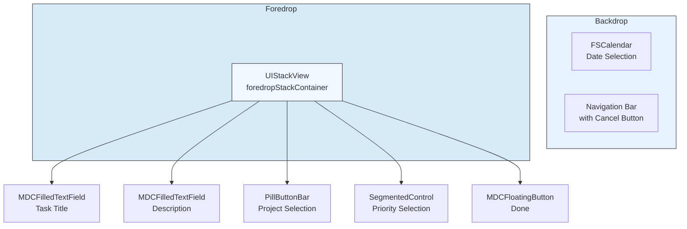
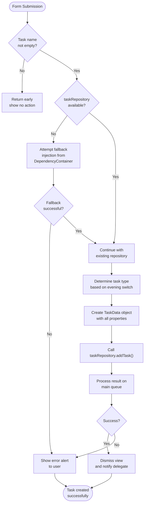

# AddTaskViewController

<cite>
**Referenced Files in This Document**   
- [AddTaskViewController.swift](file://To%20Do%20List/ViewControllers/AddTaskViewController.swift)
- [AddTaskViewController+Foredrop.swift](file://To%20Do%20List/ViewControllers/AddTaskViewController+Foredrop.swift)
- [AddTaskViewControllerDelegate.swift](file://To%20Do%20List/ViewControllers/AddTaskViewControllerDelegate.swift)
- [HomeViewController.swift](file://To%20Do%20List/ViewControllers/HomeViewController.swift)
- [HomeViewController+UISetup.swift](file://To%20Do%20List/ViewControllers/HomeViewController+UISetup.swift)
</cite>

## Table of Contents
1. [Introduction](#introduction)
2. [Core Functionality](#core-functionality)
3. [Modal Presentation Pattern](#modal-presentation-pattern)
4. [Form-Based UI Structure](#form-based-ui-structure)
5. [Input Validation and Task Creation](#input-validation-and-task-creation)
6. [Delegation and Result Communication](#delegation-and-result-communication)
7. [Dependency Injection with DependencyContainer](#dependency-injection-with-dependencycontainer)
8. [Edge Case Handling](#edge-case-handling)
9. [Accessibility Features](#accessibility-features)

## Introduction
The AddTaskViewController is a critical component in the Tasker application responsible for managing the creation and editing of tasks through a modal interface. It provides a comprehensive form-based UI that allows users to input task details including title, description, priority, project assignment, and due date. The controller follows modern iOS development patterns including dependency injection, delegation, and proper lifecycle management. This document provides a detailed analysis of its implementation, integration points, and behavior.

**Section sources**
- [AddTaskViewController.swift](file://To%20Do%20List/ViewControllers/AddTaskViewController.swift#L1-L518)

## Core Functionality
The AddTaskViewController serves as the primary interface for task creation workflows in the Tasker application. It implements a form-based approach using Material Design components from the MaterialComponents library, specifically MDCFilledTextField for text inputs. The controller manages several key pieces of task metadata including the task name, description, priority level, project assignment, and whether the task is designated as an evening task.

The controller maintains state through various properties that track user input in real-time:
- `currentTaskInMaterialTextBox`: Stores the current text in the task title field
- `currentTaskDescription`: Stores the current text in the description field
- `currentTaskPriority`: Tracks the selected priority level using the TaskPriority enum
- `currenttProjectForAddTaskView`: Maintains the currently selected project
- `isThisEveningTask`: Boolean flag indicating if the task is an evening task
- `dateForAddTaskView`: Stores the selected due date

These properties are updated dynamically as the user interacts with the form elements, enabling real-time validation and UI updates.



**Diagram sources**
- [AddTaskViewController.swift](file://To%20Do%20List/ViewControllers/AddTaskViewController.swift#L17-L518)
- [AddTaskViewControllerDelegate.swift](file://To%20Do%20List/ViewControllers/AddTaskViewControllerDelegate.swift#L1-L14)

**Section sources**
- [AddTaskViewController.swift](file://To%20Do%20List/ViewControllers/AddTaskViewController.swift#L17-L518)

## Modal Presentation Pattern
The AddTaskViewController is presented modally from the HomeViewController via a floating action button (FAB) located in the bottom app bar. This presentation pattern follows iOS human interface guidelines for primary actions, providing a seamless user experience for task creation.

The presentation is triggered by the `AddTaskAction` method in HomeViewController, which is connected to the floating button's touchUpInside event. When activated, this method instantiates the AddTaskViewController, injects the necessary dependencies (including the taskRepository), sets itself as the delegate, and presents the view controller modally using the default presentation style.

The modal interface features a backdrop design pattern with layered UI elements:
- **Backdrop Container**: Contains the calendar widget and navigation elements
- **Foredrop Container**: Houses the form elements in a sheet that appears from the bottom
- **Visual Hierarchy**: Implemented with shadows, rounded corners, and proper z-indexing to create depth

This layered approach provides visual context by showing the underlying calendar while focusing user attention on the task creation form. The controller handles its own dismissal through the cancel and done actions, ensuring proper cleanup and memory management.



**Diagram sources**
- [HomeViewController.swift](file://To%20Do%20List/ViewControllers/HomeViewController.swift#L629-L650)
- [HomeViewController+UISetup.swift](file://To%20Do%20List/ViewControllers/HomeViewController+UISetup.swift#L165-L170)
- [AddTaskViewController.swift](file://To%20Do%20List/ViewControllers/AddTaskViewController.swift#L17-L518)

**Section sources**
- [HomeViewController.swift](file://To%20Do%20List/ViewControllers/HomeViewController.swift#L629-L650)
- [HomeViewController+UISetup.swift](file://To%20Do%20List/ViewControllers/HomeViewController+UISetup.swift#L165-L170)

## Form-Based UI Structure
The AddTaskViewController implements a comprehensive form-based user interface using Material Design components and custom UI elements. The form is structured within a UIStackView container that organizes the input elements vertically with consistent spacing and margins.

The primary UI components include:

**Text Inputs:**
- **Task Title Field**: MDCFilledTextField for the main task name with real-time validation
- **Description Field**: MDCFilledTextField with placeholder text "Description (optional)" and assistive label "Add task details"

**Priority Selection:**
- Implemented as a segmented control with four priority levels: "None", "Low", "High", and "Max" (representing P0-P4 priority levels)
- The control is initialized in the AddTaskForedropView extension and integrated into the form layout

**Project Assignment:**
- Utilizes a pill bar interface (samplePillBar) for project selection
- The pill bar is populated with project options including the default "Inbox" project
- Users can select existing projects or create new ones through this interface

**Due Date Scheduling:**
- Integrated FSCalendar instance for visual date selection
- The calendar is displayed in the backdrop container, providing context for due date selection
- Date selection is managed through the dateForAddTaskView property

**Evening Task Toggle:**
- UISwitch control labeled "Evening" for designating tasks as evening tasks
- The switch state is tracked by the isThisEveningTask property
- When enabled, the task is assigned the .evening type; otherwise, it defaults to .morning

**Action Buttons:**
- **Cancel Button**: Positioned in the navigation bar with "Cancel" title that dismisses the view controller
- **Done Button**: MDCFloatingButton positioned at the bottom of the form that triggers task creation
- The done button's visibility is dynamically controlled based on whether the task title field contains text

The form layout is managed through a combination of Auto Layout constraints and programmatic frame calculations, ensuring proper positioning across different device sizes and orientations.



**Diagram sources**
- [AddTaskViewController.swift](file://To%20Do%20List/ViewControllers/AddTaskViewController.swift#L17-L518)
- [AddTaskViewController+Foredrop.swift](file://To%20Do%20List/ViewControllers/AddTaskViewController+Foredrop.swift#L5-L171)

**Section sources**
- [AddTaskViewController.swift](file://To%20Do%20List/ViewControllers/AddTaskViewController.swift#L17-L518)
- [AddTaskViewController+Foredrop.swift](file://To%20Do%20List/ViewControllers/AddTaskViewController+Foredrop.swift#L5-L171)

## Input Validation and Task Creation
The AddTaskViewController implements comprehensive input validation and task creation workflows through a combination of delegate methods and action handlers. The validation process ensures data integrity before persisting tasks to the repository.

**Real-time Validation:**
The controller implements the UITextFieldDelegate protocol to monitor text changes in both the task title and description fields. The `textField(_:shouldChangeCharactersIn:replacementString:)` method updates the corresponding state properties (`currentTaskInMaterialTextBox` and `currentTaskDescription`) and immediately updates the UI based on validation rules:

- The done button and priority segmented control are hidden when the task title is empty
- The done button is disabled when the task title is empty
- These UI updates provide immediate visual feedback to users about form completeness

**Task Creation Process:**
When the user submits the form (either by tapping the done button or pressing return in the text field), the `doneAddTaskAction()` method is invoked. This method implements a robust task creation workflow:

1. **Validation Check**: Ensures the task name is not empty before proceeding
2. **Repository Validation**: Verifies the taskRepository dependency is available, with fallback injection from DependencyContainer if needed
3. **Task Type Determination**: Sets the task type based on the evening switch state
4. **TaskData Construction**: Creates a TaskData object with all collected information
5. **Repository Persistence**: Calls taskRepository.addTask() with the constructed TaskData
6. **Result Handling**: Processes the result asynchronously on the main queue

The task creation process includes comprehensive error handling with user-facing alerts for failures, ensuring the application remains stable even when unexpected errors occur.



**Diagram sources**
- [AddTaskViewController+Foredrop.swift](file://To%20Do%20List/ViewControllers/AddTaskViewController+Foredrop.swift#L61-L171)
- [AddTaskViewController.swift](file://To%20Do%20List/ViewControllers/AddTaskViewController.swift#L233-L235)

**Section sources**
- [AddTaskViewController+Foredrop.swift](file://To%20Do%20List/ViewControllers/AddTaskViewController+Foredrop.swift#L61-L171)

## Delegation and Result Communication
The AddTaskViewController employs the delegation pattern to communicate results back to its presenting view controller, typically the HomeViewController. This design follows iOS best practices for modal view controller communication, maintaining loose coupling between components.

**Delegate Protocol:**
The controller defines a weak reference to an `AddTaskViewControllerDelegate` which is a protocol specifying the `didAddTask(_:)` method. This protocol is defined in a separate file and marked with the `AnyObject` constraint to ensure weak reference semantics:

```swift
protocol AddTaskViewControllerDelegate: AnyObject {
    func didAddTask(_ task: NTask)
}
```

**Delegate Implementation:**
The HomeViewController conforms to this delegate protocol and implements the `didAddTask(_:)` method to handle the newly created task. When a task is successfully created and saved, the AddTaskViewController notifies its delegate before dismissing itself:

1. The `doneAddTaskAction()` method calls `taskRepository.addTask()` with the task data
2. Upon successful completion, the closure is executed on the main queue
3. The view controller dismisses with a completion handler
4. After dismissal, the delegate's `didAddTask()` method is called with the created NTask object
5. If the delegate is nil, an error message is logged but no crash occurs

This sequence ensures that the presenting view controller receives the new task object after the modal interface has been dismissed, allowing for proper UI updates without interference from the presentation animation.

The delegation pattern also supports the editing workflow, where the same interface can be used to modify existing tasks. In edit mode, the controller would be populated with existing task data, and upon saving, it would notify the delegate of the updated task.

**Section sources**
- [AddTaskViewControllerDelegate.swift](file://To%20Do%20List/ViewControllers/AddTaskViewControllerDelegate.swift#L1-L14)
- [AddTaskViewController+Foredrop.swift](file://To%20Do%20List/ViewControllers/AddTaskViewController+Foredrop.swift#L61-L171)

## Dependency Injection with DependencyContainer
The AddTaskViewController implements dependency injection to receive its TaskRepository dependency, promoting testability and separation of concerns. The controller declares a required taskRepository property that must be injected before use.

**Dependency Injection Pattern:**
The controller follows a protocol-based dependency injection approach through the `TaskRepositoryDependent` protocol (inferred from the property declaration). The taskRepository is injected by the presenting view controller (HomeViewController) before presentation:

```swift
let addTaskVC = AddTaskViewController()
addTaskVC.taskRepository = self.taskRepository
addTaskVC.delegate = self
present(addTaskVC, animated: true)
```

**Fallback Mechanism:**
The implementation includes a robust fallback mechanism to handle cases where dependency injection might fail. During `viewWillAppear`, the controller checks if taskRepository is nil and attempts fallback injection from the DependencyContainer singleton:

```swift
if taskRepository == nil {
    print("❌ AddTaskViewController: taskRepository is STILL nil in viewWillAppear!")
    print("🚨 AddTaskViewController: This is a critical issue - attempting fallback injection")
    
    // Try to inject dependencies as a fallback
    DependencyContainer.shared.inject(into: self)
}
```

This defensive programming approach prevents crashes due to missing dependencies while logging diagnostic information to help identify configuration issues during development.

**DependencyContainer Usage:**
The DependencyContainer serves as a service locator that can inject dependencies into view controllers. This hybrid approach combines the benefits of dependency injection with the convenience of a service locator for fallback scenarios, ensuring the application remains functional even when the primary injection path fails.

The dependency injection pattern enables easier unit testing by allowing mock repositories to be injected during testing, and supports the application's architecture migration from singleton-based access to dependency injection.

**Section sources**
- [AddTaskViewController.swift](file://To%20Do%20List/ViewControllers/AddTaskViewController.swift#L20-L21)
- [AddTaskViewController.swift](file://To%20Do%20List/ViewControllers/AddTaskViewController.swift#L198-L215)
- [AddTaskViewController+Foredrop.swift](file://To%20Do%20List/ViewControllers/AddTaskViewController+Foredrop.swift#L75-L90)

## Edge Case Handling
The AddTaskViewController implements comprehensive edge case handling to ensure robust operation under various conditions. The controller anticipates and gracefully manages several potential failure scenarios:

**Incomplete Form Submission:**
When the user attempts to create a task with an empty title, the controller prevents submission and returns early without showing an alert:

```swift
guard !currentTaskInMaterialTextBox.isEmpty else { 
    print("⚠️ AddTask: Task name is empty, returning early")
    return 
}
```

This silent failure prevents cluttering the interface with validation alerts while still preventing invalid data from being processed.

**Missing Dependencies:**
The controller includes multiple safety checks for the taskRepository dependency:
- Checks in `viewDidLoad` and logs the state
- Re-checks in `viewWillAppear` with fallback injection attempt
- Validates before use in `doneAddTaskAction()` with comprehensive error handling

If the repository remains unavailable, the controller shows a user-friendly alert instead of crashing:

```swift
let alert = UIAlertController(title: "Error", message: "Unable to save task. Please try again.", preferredStyle: .alert)
alert.addAction(UIAlertAction(title: "OK", style: .default))
self.present(alert, animated: true)
```

**Asynchronous Error Handling:**
Errors from the repository are handled gracefully with user-facing alerts that include the localized error description:

```swift
case .failure(let error):
    let alert = UIAlertController(
        title: "Error Creating Task",
        message: "Failed to create task: \(error.localizedDescription)",
        preferredStyle: .alert
    )
    alert.addAction(UIAlertAction(title: "OK", style: .default))
    self?.present(alert, animated: true)
```

**Nil Delegate Handling:**
The controller safely handles cases where the delegate might be nil after dismissal by checking the delegate before calling:

```swift
if let delegate = self?.delegate {
    delegate.didAddTask(createdTask)
} else {
    print("❌ AddTask: ERROR - Delegate is nil after dismissal!")
}
```

These edge case handling mechanisms ensure the application remains stable and provides appropriate feedback to users even when unexpected conditions occur.

**Section sources**
- [AddTaskViewController+Foredrop.swift](file://To%20Do%20List/ViewControllers/AddTaskViewController+Foredrop.swift#L61-L171)
- [AddTaskViewController.swift](file://To%20Do%20List/ViewControllers/AddTaskViewController.swift#L198-L215)

## Accessibility Features
The AddTaskViewController incorporates several accessibility features to ensure the interface is usable by all users, including those with disabilities. While specific accessibility properties are not explicitly set in the provided code, the implementation leverages components and patterns that support accessibility:

**Dynamic Type Support:**
The use of `UIFont.preferredFont(forTextStyle:)` and system fonts ensures that text scales appropriately based on the user's preferred content size category. This allows users with visual impairments to increase text size system-wide, and the interface will automatically adapt.

**VoiceOver Compatibility:**
Material Design components (MDCFilledTextField) and standard UIKit controls (UISwitch, UIButton) have built-in VoiceOver support. These components provide appropriate accessibility labels, traits, and hints that enable screen readers to describe the interface to visually impaired users.

**Keyboard Navigation:**
The implementation supports keyboard navigation through the text fields:
- The task title field becomes first responder automatically when the view appears
- Pressing return in the text field triggers the done action, providing a keyboard shortcut for submission
- The text field delegate methods handle keyboard events appropriately

**Focus Management:**
The controller manages focus through the `becomeFirstResponder()` call on the task title field, ensuring that the keyboard appears immediately when the modal is presented, reducing the number of taps required to begin input.

**Error Feedback:**
Error states are communicated through UIAlertControllers, which are accessible and can be navigated using VoiceOver. The error messages include localized descriptions that provide meaningful information about what went wrong.

While the code does not explicitly set accessibility identifiers or custom labels, the use of standard, well-supported UI components ensures a baseline level of accessibility compliance.

**Section sources**
- [AddTaskViewController.swift](file://To%20Do%20List/ViewControllers/AddTaskViewController.swift#L17-L518)
- [AddTaskViewController+Foredrop.swift](file://To%20Do%20List/ViewControllers/AddTaskViewController+Foredrop.swift#L5-L171)