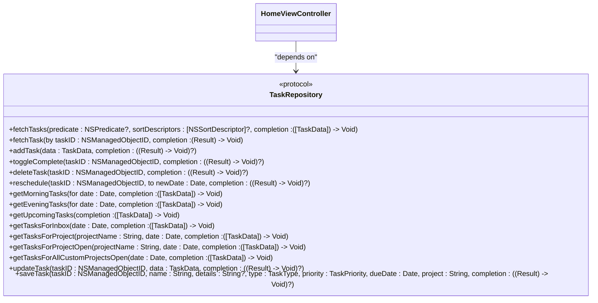
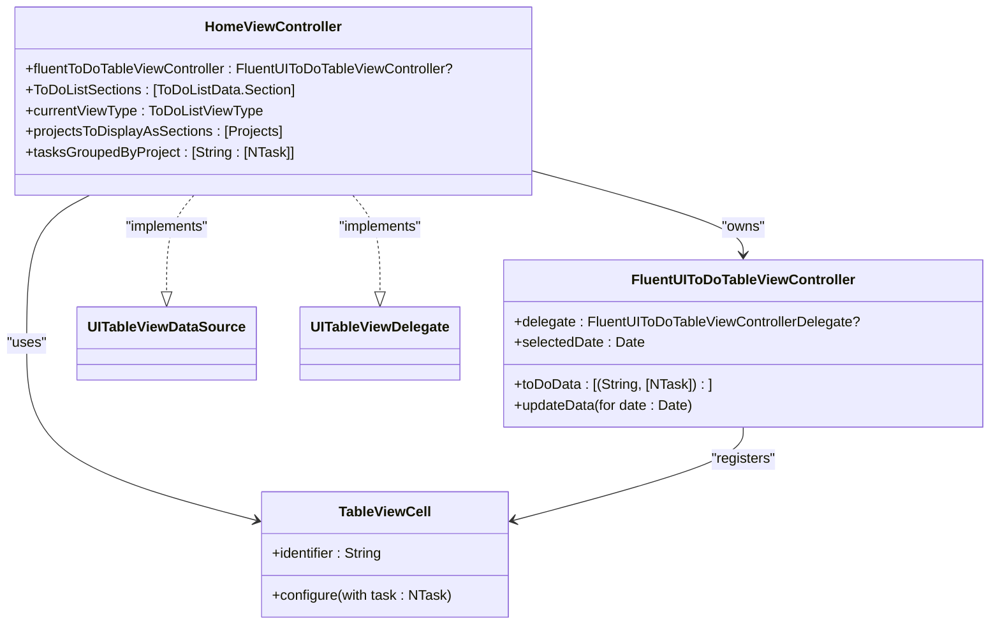
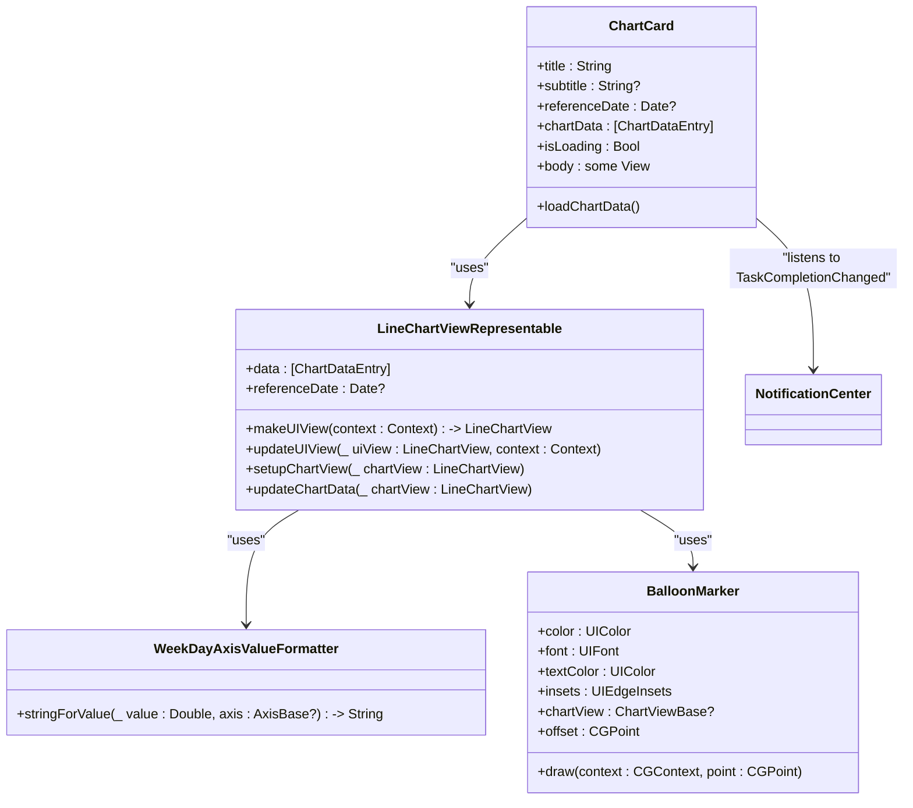
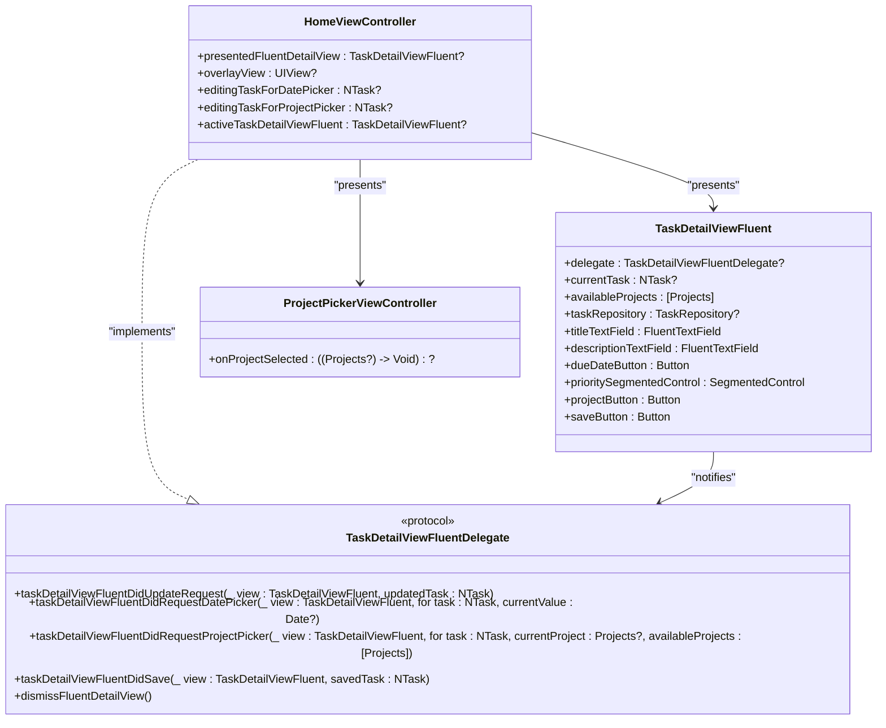
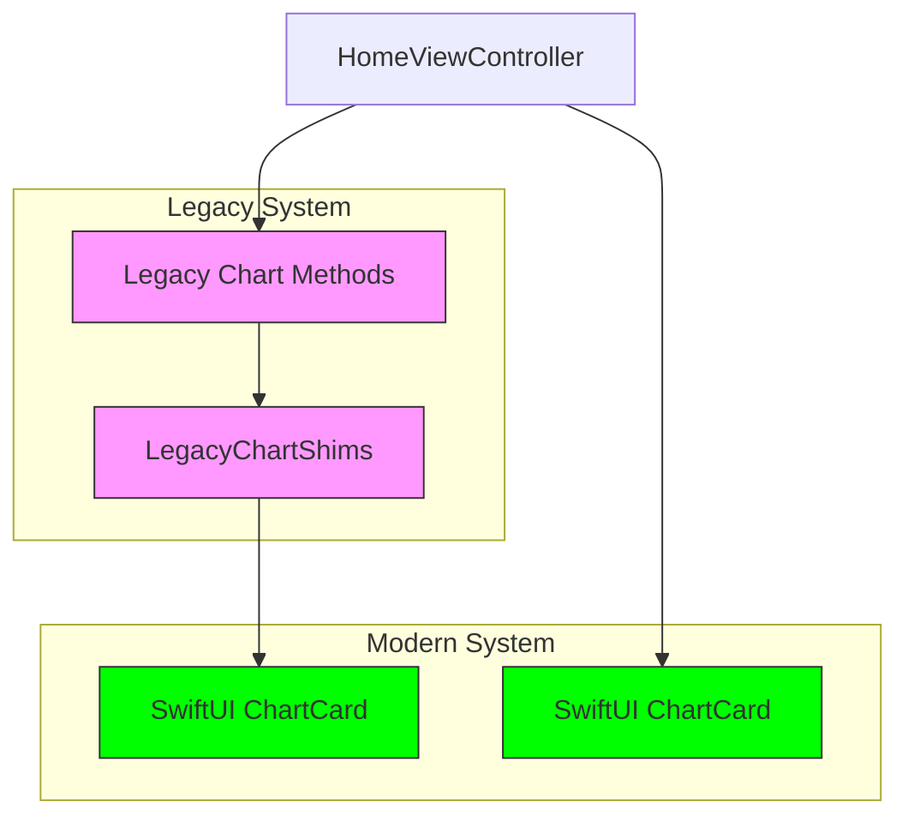
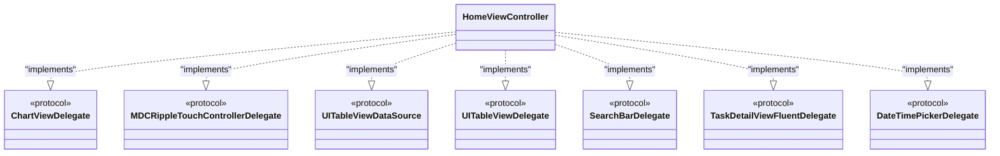
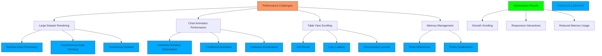

# HomeViewController

<cite>
**Referenced Files in This Document**   
- [HomeViewController.swift](file://To%20Do%20List/ViewControllers/HomeViewController.swift)
- [HomeViewController+TableView.swift](file://To%20Do%20List/ViewControllers/HomeViewController+TableView.swift)
- [HomeViewController+TaskDetailFluent.swift](file://To%20Do%20List/ViewControllers/HomeViewController+TaskDetailFluent.swift)
- [HomeViewController+LegacyChartShims.swift](file://To%20Do%20List/ViewControllers/HomeViewController+LegacyChartShims.swift)
- [ChartCard.swift](file://To%20Do%20List/Views/Cards/ChartCard.swift)
- [TaskRepository.swift](file://To%20Do%20List/Repositories/TaskRepository.swift)
- [FluentUIToDoTableViewController.swift](file://To%20Do%20List/ViewControllers/FluentUIToDoTableViewController.swift)
- [TaskDetailViewFluent.swift](file://To%20Do%20List/View/TaskDetailViewFluent.swift)
- [README.md](file://README.md)
</cite>

## Table of Contents
1. [Introduction](#introduction)
2. [Core Responsibilities](#core-responsibilities)
3. [View Type Management](#view-type-management)
4. [Task Data Integration](#task-data-integration)
5. [Table View Implementation](#table-view-implementation)
6. [UI Component Composition](#ui-component-composition)
7. [Task Detail Interaction](#task-detail-interaction)
8. [Chart Visualization System](#chart-visualization-system)
9. [Lifecycle and Event Handling](#lifecycle-and-event-handling)
10. [Performance Considerations](#performance-considerations)

## Introduction

The HomeViewController serves as the central dashboard for the Tasker application, orchestrating the primary user interface for task management. It integrates multiple UI components, data sources, and navigation patterns to provide a comprehensive task management experience. This document details its architecture, functionality, and implementation patterns, focusing on its role in rendering task lists, managing view states, and coordinating user interactions.

## Core Responsibilities

The HomeViewController acts as the main coordinator for the application's dashboard interface, managing several critical responsibilities:

- **Central Dashboard Orchestration**: Serves as the primary interface for task visualization and interaction
- **View State Management**: Maintains and transitions between different view types (Today, Custom Date, Project)
- **Navigation Coordination**: Handles transitions to task detail views and other application sections
- **Bottom App Bar Integration**: Provides access to AI assistant features through the Material Design bottom app bar
- **UI Component Composition**: Combines various reusable components like TaskProgressCard and ChartCard
- **Event Handling**: Manages user interactions including task completion, editing, and filtering

The controller follows a modular architecture using Swift extensions to separate concerns, with distinct files handling table view logic, task detail presentation, chart integration, and UI setup.

**Section sources**
- [HomeViewController.swift](file://To%20Do%20List/ViewControllers/HomeViewController.swift#L1-L199)

## View Type Management

The HomeViewController manages different task viewing modes through the ToDoListViewType enum, which defines the current display context for tasks. This enum-based approach provides a type-safe way to handle various filtering and grouping scenarios.

### ToDoListViewType Enum

The view type system provides flexible list filtering:

```swift
enum ToDoListViewType {
    case todayHomeView      // Today's tasks
    case customDateView     // Tasks for specific date
    case projectView        // Tasks filtered by project
    case upcomingView       // Future tasks
    case historyView        // Completed tasks
    case allProjectsGrouped // All tasks grouped by project
    case selectedProjectsGrouped // Selected projects only
}
```

The controller maintains the current view state in the `currentViewType` property and responds to view type changes by reconfiguring the displayed data. Different view types affect how tasks are grouped and presented in the table view:

- **Today and Custom Date Views**: Display tasks grouped by project for a specific date
- **Project Views**: Show tasks filtered by specific project criteria
- **Grouped Views**: Present tasks organized into sections based on project membership

The view type system enables seamless transitions between different organizational paradigms, allowing users to switch between date-based and project-based task organization.

**Section sources**
- [README.md](file://README.md#L572-L587)
- [HomeViewController.swift](file://To%20Do%20List/ViewControllers/HomeViewController.swift#L1-L199)

## Task Data Integration

The HomeViewController interacts with task data through the TaskRepository protocol, following dependency injection principles to maintain loose coupling and testability.

### TaskRepository Protocol

The TaskRepository defines a comprehensive contract for task data operations:



**Diagram sources**
- [TaskRepository.swift](file://To%20Do%20List/Repositories/TaskRepository.swift#L1-L117)

The HomeViewController receives a TaskRepository instance through dependency injection, allowing it to fetch and manipulate task data without direct knowledge of the underlying persistence mechanism. This abstraction enables easier testing and potential replacement of the data layer.

The controller uses various repository methods to populate its views:
- `getTasksForInbox` and `getTasksForProject` for date-specific task retrieval
- `getUpcomingTasks` for future task views
- `toggleComplete` for updating task completion status
- `saveTask` for persisting task modifications

This repository pattern ensures that data access logic is centralized and consistent across the application.

**Section sources**
- [TaskRepository.swift](file://To%20Do%20List/Repositories/TaskRepository.swift#L1-L117)
- [HomeViewController.swift](file://To%20Do%20List/ViewControllers/HomeViewController.swift#L1-L199)

## Table View Implementation

The HomeViewController implements table view functionality through delegation patterns, using the FluentUIToDoTableViewController as its base implementation.

### Table View Architecture



**Diagram sources**
- [HomeViewController+TableView.swift](file://To%20Do%20List/ViewControllers/HomeViewController+TableView.swift#L1-L199)
- [FluentUIToDoTableViewController.swift](file://To%20Do%20List/ViewControllers/FluentUIToDoTableViewController.swift#L1-L199)

### Data Source Implementation

The HomeViewController implements the UITableViewDataSource protocol to provide data for the table view. The implementation varies based on the current view type:

```swift
func numberOfSections(in tableView: UITableView) -> Int {
    switch currentViewType {
    case .allProjectsGrouped, .selectedProjectsGrouped:
        return projectsToDisplayAsSections.count > 0 ? projectsToDisplayAsSections.count + 1 : 1
    case .todayHomeView, .customDateView:
        return ToDoListSections.count
    default:
        return ToDoListSections.count > 0 ? ToDoListSections.count : 1
    }
}

func tableView(_ tableView: UITableView, numberOfRowsInSection section: Int) -> Int {
    switch currentViewType {
    case .allProjectsGrouped, .selectedProjectsGrouped:
        if section == 0 {
            return 0
        } else {
            let actualSection = section - 1
            let projectName = projectsToDisplayAsSections[actualSection].projectName ?? ""
            return tasksGroupedByProject[projectName]?.count ?? 0
        }
    case .todayHomeView, .customDateView:
        if section < ToDoListSections.count {
            return ToDoListSections[section].items.count
        } else {
            return 0
        }
    default:
        return ToDoListSections.flatMap({ $0.items }).count
    }
}
```

The controller maintains different data structures based on the view type:
- `ToDoListSections` for date-based views
- `projectsToDisplayAsSections` and `tasksGroupedByProject` for project-based views

This flexible data model allows the same table view implementation to display tasks in multiple organizational formats.

**Section sources**
- [HomeViewController+TableView.swift](file://To%20Do%20List/ViewControllers/HomeViewController+TableView.swift#L1-L199)

## UI Component Composition

The HomeViewController composes several reusable UI components to create the dashboard interface, with a particular focus on the TaskProgressCard (implemented as ChartCard in SwiftUI).

### ChartCard Implementation

The ChartCard is a SwiftUI component that provides the primary analytics visualization for the dashboard:



**Diagram sources**
- [ChartCard.swift](file://To%20Do%20List/Views/Cards/ChartCard.swift#L1-L199)

The ChartCard component features:
- **Dynamic Data Loading**: Fetches chart data on appearance and when the reference date changes
- **Loading State**: Displays a progress indicator while data is being loaded
- **Real-time Updates**: Listens for TaskCompletionChanged notifications to refresh when tasks are completed
- **Accessibility Support**: Includes comprehensive accessibility labels and hints
- **Interactive Features**: Supports pinch-to-zoom, double-tap zoom, and drag-to-pan gestures

The HomeViewController hosts this SwiftUI component within a UIHostingController, integrating it seamlessly into the UIKit interface.

### FluentUI Integration

The controller leverages Microsoft's FluentUI design system for a modern, accessible interface. Key components include:
- **FluentUIToDoTableViewController**: Base table view controller with FluentUI styling
- **TableViewCell**: Custom table cells with priority indicators and due date displays
- **SegmentedControl**: For task type selection and priority assignment
- **FluentTextField**: Styled text fields for task editing

This combination of UIKit and SwiftUI components allows the application to benefit from modern declarative UI patterns while maintaining compatibility with existing UIKit infrastructure.

**Section sources**
- [ChartCard.swift](file://To%20Do%20List/Views/Cards/ChartCard.swift#L1-L199)
- [HomeViewController.swift](file://To%20Do%20List/ViewControllers/HomeViewController.swift#L1-L199)

## Task Detail Interaction

The HomeViewController handles task detail presentation and editing through the TaskDetailViewFluent component and its delegate methods.

### Task Detail Architecture



**Diagram sources**
- [HomeViewController+TaskDetailFluent.swift](file://To%20Do%20List/ViewControllers/HomeViewController+TaskDetailFluent.swift#L1-L98)
- [TaskDetailViewFluent.swift](file://To%20Do%20List/View/TaskDetailViewFluent.swift#L1-L199)

### Interaction Flow

When a user interacts with a task, the HomeViewController presents a TaskDetailViewFluent modal view. The interaction flow follows this sequence:

1. **Presentation**: The task detail view is presented as a semi-modal view with an overlay
2. **Editing**: Users can modify task properties including title, description, due date, priority, and project
3. **Date Selection**: Tapping the due date button presents a FluentUI.DateTimePicker
4. **Project Selection**: Tapping the project button presents a ProjectPickerViewController in a bottom sheet
5. **Saving**: Changes are batched and saved only when the user taps the save button
6. **Dismissal**: The view is animated out and removed from the hierarchy

The controller implements the TaskDetailViewFluentDelegate protocol to handle callbacks from the detail view:

```swift
func taskDetailViewFluentDidSave(_ view: TaskDetailViewFluent, savedTask: NTask) {
    fluentToDoTableViewController?.tableView.reloadData()
    updateLineChartData()
    dismissFluentDetailView()
}

func taskDetailViewFluentDidRequestDatePicker(_ view: TaskDetailViewFluent, for task: NTask, currentValue: Date?) {
    let dateTimePicker = FluentUI.DateTimePicker()
    dateTimePicker.delegate = self
    self.editingTaskForDatePicker = task
    self.activeTaskDetailViewFluent = view
    dateTimePicker.present(from: self, with: .dateTime, startDate: currentValue ?? Date())
}
```

This delegate-based approach ensures loose coupling between the dashboard and detail views while maintaining clear communication channels.

**Section sources**
- [HomeViewController+TaskDetailFluent.swift](file://To%20Do%20List/ViewControllers/HomeViewController+TaskDetailFluent.swift#L1-L98)
- [TaskDetailViewFluent.swift](file://To%20Do%20List/View/TaskDetailViewFluent.swift#L1-L199)

## Chart Visualization System

The HomeViewController manages chart visualization through a migration from legacy UIKit charts to a modern SwiftUI implementation.

### Chart Migration Architecture



**Diagram sources**
- [HomeViewController+LegacyChartShims.swift](file://To%20Do%20List/ViewControllers/HomeViewController+LegacyChartShims.swift#L1-L40)
- [ChartCard.swift](file://To%20Do%20List/Views/Cards/ChartCard.swift#L1-L199)

The chart system has undergone a significant migration from legacy UIKit-based charts to a SwiftUI implementation:

- **Legacy Charts**: The controller originally used DGCharts for line and pie charts, with `lineChartView` and `tinyPieChartView` properties
- **Migration Strategy**: A compatibility layer (`HomeViewController+LegacyChartShims.swift`) forwards legacy calls to the new SwiftUI implementation
- **Modern Implementation**: The primary chart is now the SwiftUI `ChartCard` component, hosted in a `UIHostingController`

Key migration methods include:

```swift
@objc func updateLineChartData() {
    updateSwiftUIChartCard()
}

@objc func animateLineChart(chartView: LineChartView) {
    // No longer applicable – the SwiftUI chart animates internally.
}

@objc func setupChartsInBackdrop() {
    if swiftUIChartContainer == nil {
        setupSwiftUIChartCard()
    }
}
```

This approach allows for gradual migration while maintaining application functionality. The legacy charts are kept but hidden, ensuring backward compatibility during the transition period.

The new SwiftUI chart provides enhanced features:
- **Dynamic Data Loading**: Fetches data on the Core Data context queue for consistency
- **Real-time Updates**: Responds to TaskCompletionChanged notifications
- **Accessibility**: Comprehensive accessibility support with labels and hints
- **Interactive Features**: Pinch-to-zoom, double-tap zoom, and drag-to-pan gestures
- **Animation**: Smooth animations when data changes

**Section sources**
- [HomeViewController+LegacyChartShims.swift](file://To%20Do%20List/ViewControllers/HomeViewController+LegacyChartShims.swift#L1-L40)
- [ChartCard.swift](file://To%20Do%20List/Views/Cards/ChartCard.swift#L1-L199)
- [HomeViewController.swift](file://To%20Do%20List/ViewControllers/HomeViewController.swift#L1-L199)

## Lifecycle and Event Handling

The HomeViewController manages its lifecycle through standard UIViewController methods and custom event handling patterns.

### Lifecycle Management

The controller follows the standard UIViewController lifecycle:
- **Initialization**: Sets up stored properties and dependencies
- **View Loading**: Configures UI components and establishes constraints
- **Appearance**: Updates data and refreshes the interface when the view appears
- **Disappearance**: Cleans up resources and observers when the view disappears

Key lifecycle methods include:
- `viewDidLoad()`: Initial setup of UI components and constraints
- `viewWillAppear(_:)`: Refreshes data and updates the interface before appearance
- `viewDidAppear(_:)`: Performs post-appearance tasks and animations
- `viewWillDisappear(_:)`: Cleans up resources and observers

### Event Handling

The controller implements multiple delegate protocols to handle user interactions:



**Diagram sources**
- [HomeViewController.swift](file://To%20Do%20List/ViewControllers/HomeViewController.swift#L1-L199)
- [HomeViewController+TaskDetailFluent.swift](file://To%20Do%20List/ViewControllers/HomeViewController+TaskDetailFluent.swift#L1-L98)

The controller uses NotificationCenter to observe system events and coordinate between components:
- Listens for TaskCompletionChanged notifications to update charts
- Uses NotificationCenter.default to post and observe custom events
- Integrates with UNUserNotificationCenter for notification handling

Analytics integration is handled through Firebase, with events tracked for key user actions:
- View appearance and disappearance
- Task completion and editing
- Navigation events
- Filter and view type changes

This comprehensive event handling system ensures that user interactions are properly captured and responded to, while also providing valuable analytics data.

**Section sources**
- [HomeViewController.swift](file://To%20Do%20List/ViewControllers/HomeViewController.swift#L1-L199)
- [HomeViewController+TaskDetailFluent.swift](file://To%20Do%20List/ViewControllers/HomeViewController+TaskDetailFluent.swift#L1-L98)

## Performance Considerations

The HomeViewController implements several strategies to maintain UI responsiveness, particularly when handling large datasets.

### Performance Optimization Strategies



**Diagram sources**
- [HomeViewController.swift](file://To%20Do%20List/ViewControllers/HomeViewController.swift#L1-L199)
- [HomeViewController+TableView.swift](file://To%20Do%20List/ViewControllers/HomeViewController+TableView.swift#L1-L199)

### Key Performance Features

The controller addresses performance challenges through several mechanisms:

**Table View Optimization**
- Implements cell reuse with `dequeueReusableCell(withIdentifier:for:)`
- Uses efficient data structures for task grouping and section management
- Minimizes work in `cellForRowAt` by using pre-computed data
- Implements batched updates to reduce UI thrashing

**Animation Management**
- Controls animation through the `shouldAnimateCells` flag
- Uses `animateTableViewReload()` to coordinate table view reload animations
- Implements `animateTableViewReloadSingleCell(at:)` for targeted animations
- Leverages UIView animations with appropriate duration and easing

**Memory Management**
- Uses weak references for delegates to prevent retain cycles
- Properly removes observers and cleans up resources in deinit
- Implements timely deallocation of modal views and overlays
- Uses lazy loading for heavy components like charts

**Data Processing**
- Performs heavy data operations on background queues
- Uses Core Data context.perform for thread-safe operations
- Implements incremental updates rather than full reloads when possible
- Caches computed data to avoid redundant calculations

These optimizations ensure that the interface remains responsive even with large numbers of tasks, providing a smooth user experience across different device capabilities.

**Section sources**
- [HomeViewController.swift](file://To%20Do%20List/ViewControllers/HomeViewController.swift#L1-L199)
- [HomeViewController+TableView.swift](file://To%20Do%20List/ViewControllers/HomeViewController+TableView.swift#L1-L199)