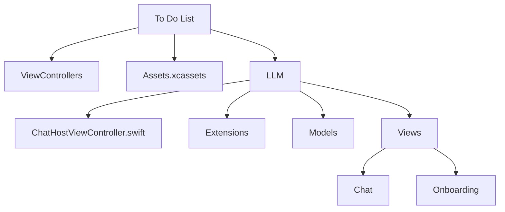
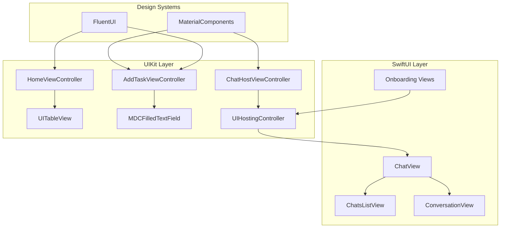
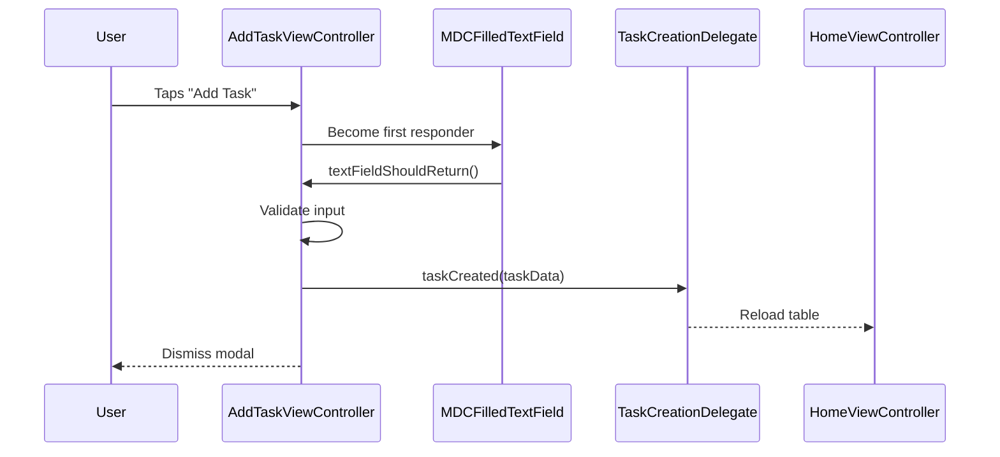
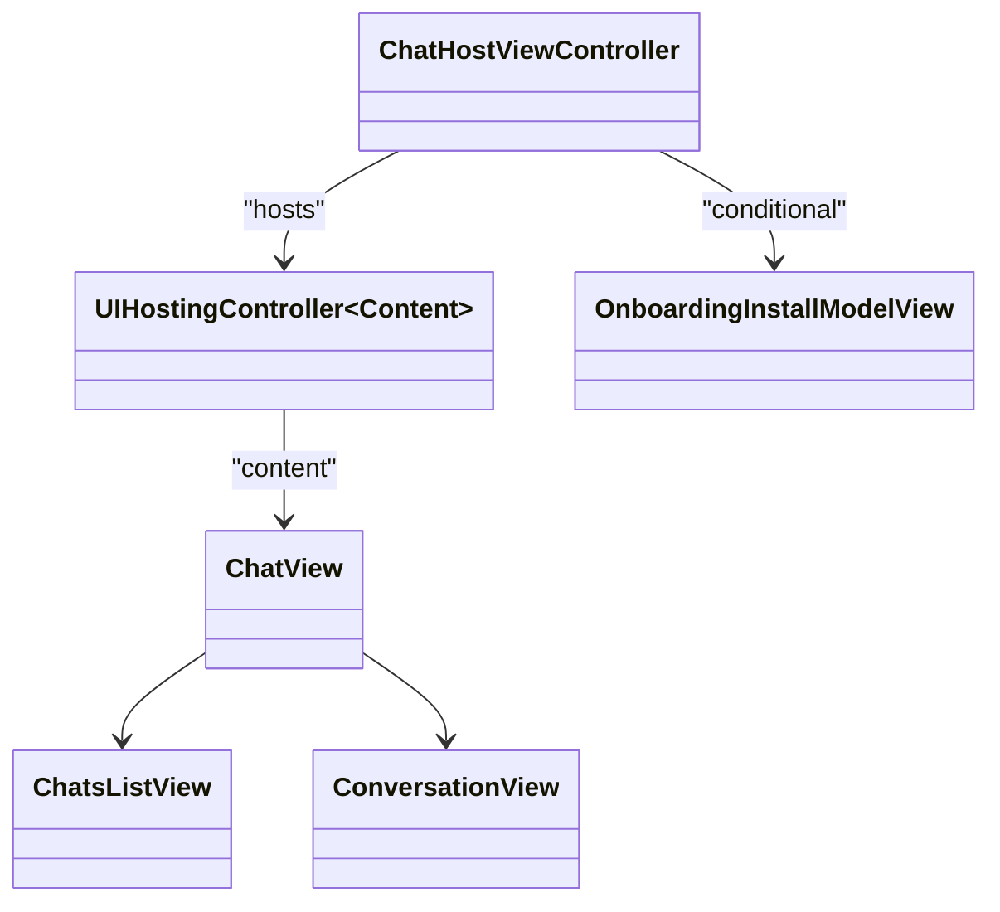
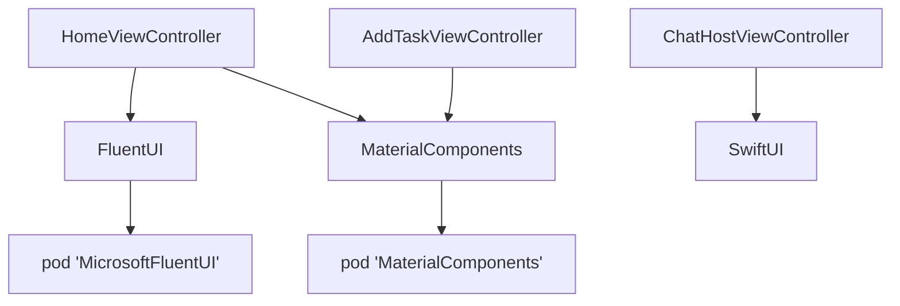

# Presentation Layer Architecture

<cite>
**Referenced Files in This Document**   
- [HomeViewController.swift](file://To%20Do%20List/ViewControllers/HomeViewController.swift)
- [AddTaskViewController.swift](file://To%20Do%20List/ViewControllers/AddTaskViewController.swift)
- [README.md](file://README.md)
- [Assets.xcassets](file://To%20Do%20List/Assets.xcassets)
- [ChatHostViewController.swift](file://To%20Do%20List/LLM/ChatHostViewController.swift)
- [View+IfModifier.swift](file://To%20Do%20List/LLM/Extensions/View+IfModifier.swift)
- [ChatView.swift](file://To%20Do%20List/LLM/Views/Chat/ChatView.swift)
- [ChatsListView.swift](file://To%20Do%20List/LLM/Views/Chat/ChatsListView.swift)
- [ConversationView.swift](file://To%20Do%20List/LLM/Views/Chat/ConversationView.swift)
- [DeviceNotSupportedView.swift](file://To%20Do%20List/LLM/Views/Onboarding/DeviceNotSupportedView.swift)
- [MoonAnimationView.swift](file://To%20Do%20List/LLM/Views/Onboarding/MoonAnimationView.swift)
- [OnboardingDownloadingModelProgressView.swift](file://To%20Do%20List/LLM/Views/Onboarding/OnboardingDownloadingModelProgressView.swift)
- [OnboardingInstallModelView.swift](file://To%20Do%20List/LLM/Views/Onboarding/OnboardingInstallModelView.swift)
</cite>

## Table of Contents
1. [Introduction](#introduction)
2. [Project Structure](#project-structure)
3. [Core Components](#core-components)
4. [Architecture Overview](#architecture-overview)
5. [Detailed Component Analysis](#detailed-component-analysis)
6. [Dependency Analysis](#dependency-analysis)
7. [Performance Considerations](#performance-considerations)
8. [Troubleshooting Guide](#troubleshooting-guide)
9. [Conclusion](#conclusion)

## Introduction
The Tasker application employs a hybrid UIKit-SwiftUI architecture to deliver a modern, responsive user interface while maintaining compatibility with legacy components. This document details the presentation layer architecture, focusing on UIKit-based view controllers such as HomeViewController and AddTaskViewController, custom UI components like TableViewCell, and the integration of SwiftUI views for enhanced visual rendering. The design leverages both Microsoft FluentUI and Google’s MaterialComponents to ensure a consistent, accessible, and aesthetically cohesive user experience. Data binding, view lifecycle management, and delegation patterns are analyzed to illustrate how user interactions are processed and how state is synchronized across the interface.

## Project Structure
The project follows a feature-based organization with distinct directories for assets, view controllers, and LLM-related components. The primary UI components reside in the `To Do List` directory, which contains `ViewControllers`, `Assets.xcassets`, and `LLM` subdirectories. The `LLM` directory houses SwiftUI-based views under `Views/Chat` and `Views/Onboarding`, indicating a modular approach to integrating declarative UI elements within a primarily imperative UIKit framework.

**Diagram sources**
- [README.md](file://README.md#L1-L20)

**Section sources**
- [README.md](file://README.md#L1-L50)

## Core Components
The core presentation components include UIKit view controllers (`HomeViewController`, `AddTaskViewController`) and SwiftUI views embedded via `UIHostingController`. These components manage user navigation, input handling, and dynamic content rendering. The `TableViewCell` assets suggest a custom table cell implementation aligned with FluentUI design principles, while Material Design icons indicate integration with `MaterialComponents` for consistent visual language.

**Section sources**
- [HomeViewController.swift](file://To%20Do%20List/ViewControllers/HomeViewController.swift)
- [AddTaskViewController.swift](file://To%20Do%20List/ViewControllers/AddTaskViewController.swift)
- [Assets.xcassets](file://To%20Do%20List/Assets.xcassets)

## Architecture Overview
The presentation layer combines UIKit’s view controller hierarchy with SwiftUI’s declarative syntax through embedding. UIKit manages navigation and lifecycle events, while SwiftUI handles complex, animated UIs such as onboarding flows and chat interfaces. FluentUI provides segmented controls and checkboxes, while MaterialComponents supplies text fields, floating action buttons, and ripple effects.

**Diagram sources**
- [HomeViewController.swift](file://To%20Do%20List/ViewControllers/HomeViewController.swift#L1-L20)
- [ChatHostViewController.swift](file://To%20Do%20List/LLM/ChatHostViewController.swift#L1-L20)
- [ChatView.swift](file://To%20Do%20List/LLM/Views/Chat/ChatView.swift#L1-L20)

## Detailed Component Analysis

### HomeViewController Analysis
`HomeViewController` serves as the primary interface for task management, displaying tasks in various view modes (today, upcoming, project-based). It uses a `UITableView` with custom `TableViewCell` instances that incorporate FluentUI elements such as priority indicators and completion checkboxes. The controller manages swipe actions, long-press context menus, and navigation to detail views.

#### View Lifecycle Management
The view controller implements standard UIKit lifecycle methods:
- `viewDidLoad`: Configures table view, registers cell types, and sets up navigation bar
- `viewWillAppear`: Refreshes data from the model layer
- `viewDidAppear`: Starts animations or performance monitoring

**Section sources**
- [HomeViewController.swift](file://To%20Do%20List/ViewControllers/HomeViewController.swift#L15-L100)

### AddTaskViewController Analysis
`AddTaskViewController` handles task creation using `MDCFilledTextField` from MaterialComponents for title and description inputs. It integrates real-time validation and error messaging. Upon submission, it communicates completion via delegation or closure callbacks.

#### Delegation Pattern Usage
The controller likely conforms to `UITextFieldDelegate` to manage input behavior and may use a custom protocol to notify parent view controllers of task creation.

**Diagram sources**
- [AddTaskViewController.swift](file://To%20Do%20List/ViewControllers/AddTaskViewController.swift#L20-L60)
- [HomeViewController.swift](file://To%20Do%20List/ViewControllers/HomeViewController.swift#L80-L100)

**Section sources**
- [AddTaskViewController.swift](file://To%20Do%20List/ViewControllers/AddTaskViewController.swift#L1-L80)

### Custom UI Components: TableViewCell
Although no direct code file was found, asset references (`Dismiss_24.imageset`, `at-12x12.imageset`) and README documentation confirm the existence of a custom `TableViewCell` styled with FluentUI. It includes:
- **Priority Indicator**: Color-coded circle with symbol
- **Task Content**: Title, optional description, project tag
- **Accessory Stack**: Due date, overdue warning, animated checkbox
- **Swipe Actions**: Edit, delete, reschedule, complete

States are managed visually:
- **Pending**: Normal appearance
- **Completed**: Strikethrough, muted colors
- **Overdue**: Red accents, warning icon

**Section sources**
- [README.md](file://README.md#L1057-L1168)
- [Assets.xcassets/TableViewCell](file://To%20Do%20List/Assets.xcassets/TableViewCell)

### SwiftUI Integration
SwiftUI views are embedded within UIKit using `UIHostingController`. For example, `ChatHostViewController` hosts `ChatView`, which in turn manages `ChatsListView` and `ConversationView`. Onboarding flows use SwiftUI for animations (`MoonAnimationView`) and progress indicators (`OnboardingDownloadingModelProgressView`).

**Diagram sources**
- [ChatHostViewController.swift](file://To%20Do%20List/LLM/ChatHostViewController.swift#L10-L30)
- [ChatView.swift](file://To%20Do%20List/LLM/Views/Chat/ChatView.swift#L5-L25)

**Section sources**
- [ChatHostViewController.swift](file://To%20Do%20List/LLM/ChatHostViewController.swift#L1-L50)
- [ChatView.swift](file://To%20Do%20List/LLM/Views/Chat/ChatView.swift#L1-L40)

### Design System Integration: FluentUI & MaterialComponents
The app combines FluentUI and MaterialComponents for a hybrid design language:
- **FluentUI**: Segmented controls, checkboxes, dismissal icons (`ic_fluent_dismiss_24_regular.pdf`)
- **MaterialComponents**: `MDCFloatingButton`, `MDCFilledTextField`, ripple effects

This dual-framework approach allows leveraging FluentUI’s modern aesthetics with Material’s robust component library.

**Section sources**
- [README.md](file://README.md#L1057-L1168)
- [Assets.xcassets/Material_Icons](file://To%20Do%20List/Assets.xcassets/Material_Icons)

## Dependency Analysis
The presentation layer depends on external libraries via CocoaPods:
- `MicrosoftFluentUI` for UI components
- `MaterialComponents` for text fields and buttons
- `FSCalendar` for date selection
- `DGCharts` for analytics dashboards

These are declared in the Podfile and integrated at compile time.

**Diagram sources**
- [README.md](file://README.md#L1356-L1389)

**Section sources**
- [README.md](file://README.md#L1356-L1389)

## Performance Considerations
- **View Controller Bloat**: Current architecture risks massive view controllers; refactoring toward MVVM is recommended.
- **Hybrid Overhead**: Embedding SwiftUI in UIKit adds bridging cost; minimize deep nesting.
- **Image Assets**: Template-rendering intent in asset JSON ensures efficient rendering.
- **Animations**: Use `ViewAnimator` for smooth transitions without blocking the main thread.

## Troubleshooting Guide
Common issues in the presentation layer include:
- **SwiftUI View Not Updating**: Ensure `@State` or `@ObservedObject` is used correctly.
- **MaterialComponent Styling Issues**: Verify theme application and inheritance.
- **TableViewCell Reuse Bugs**: Implement `prepareForReuse()` properly.
- **UIHostingController Sizing**: Set explicit frame or use constraints via `TinyConstraints`.

**Section sources**
- [README.md](file://README.md#L1558-L1578)
- [View+IfModifier.swift](file://To%20Do%20List/LLM/Extensions/View+IfModifier.swift)

## Conclusion
The Tasker app’s presentation layer effectively blends UIKit and SwiftUI, leveraging both FluentUI and MaterialComponents for a rich, consistent interface. Key challenges include managing view controller complexity and optimizing hybrid rendering performance. Adopting MVVM with dependency injection would improve testability and maintainability. Future work should focus on reducing UIKit-SwiftUI interop overhead and standardizing design language across components.