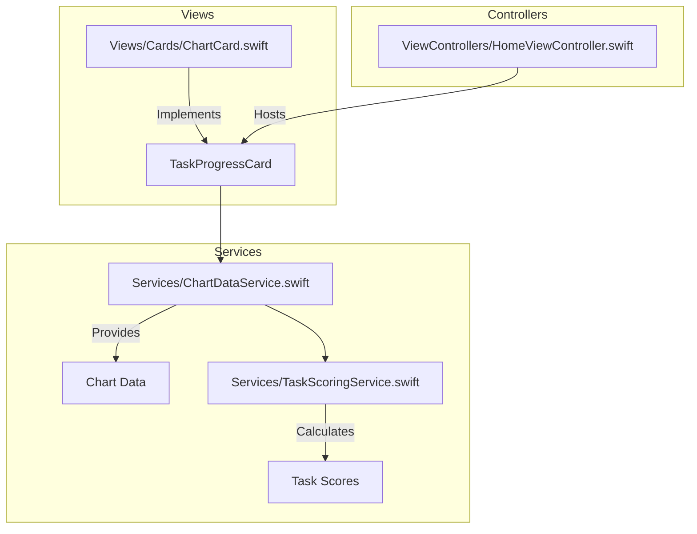
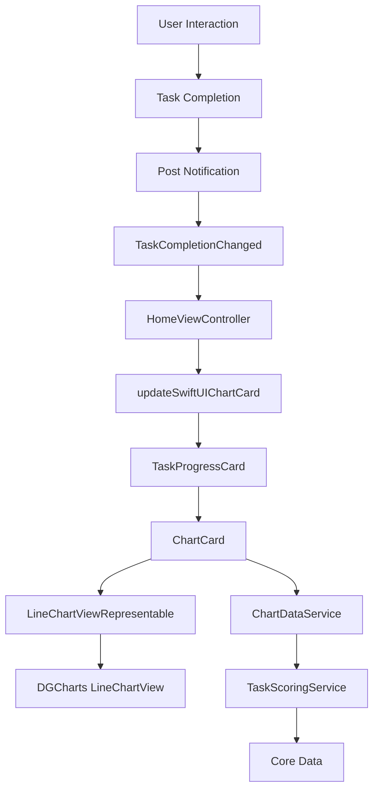
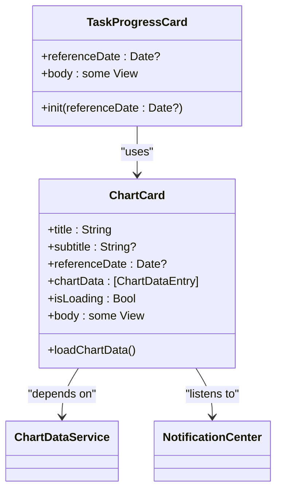
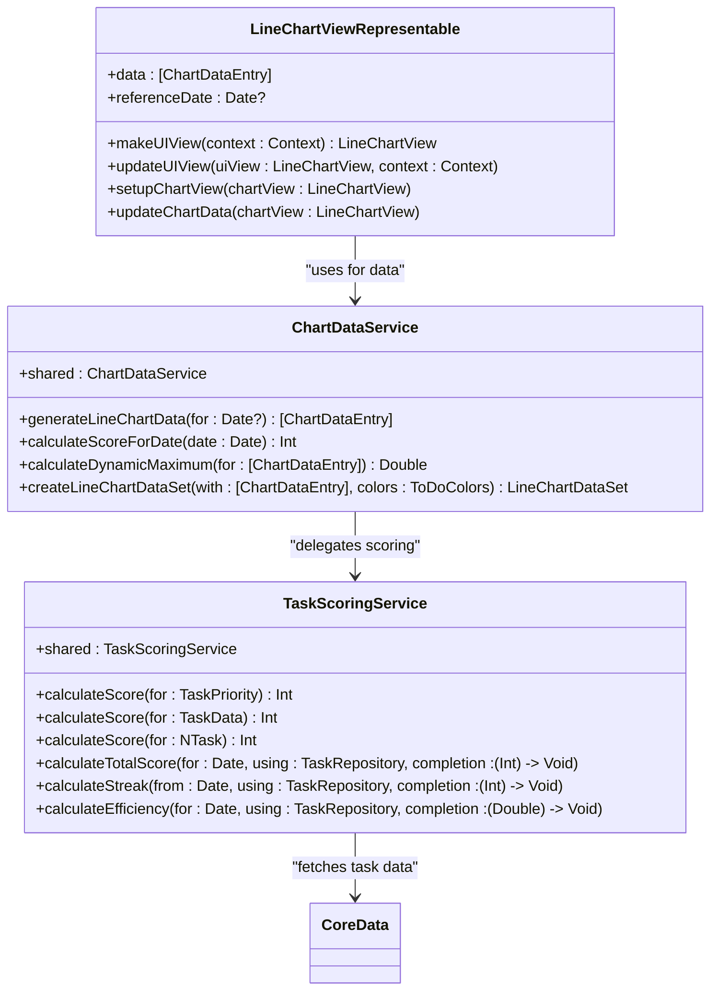
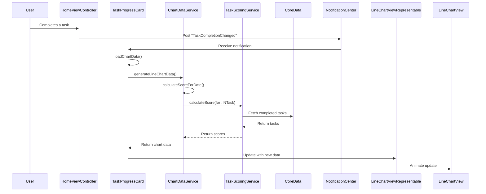
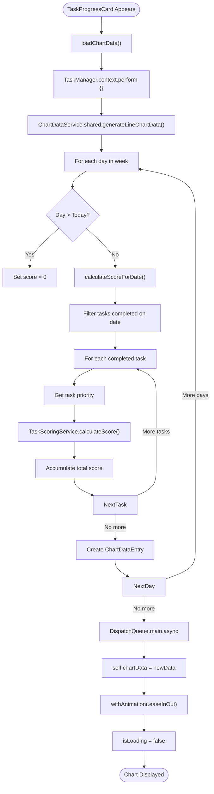
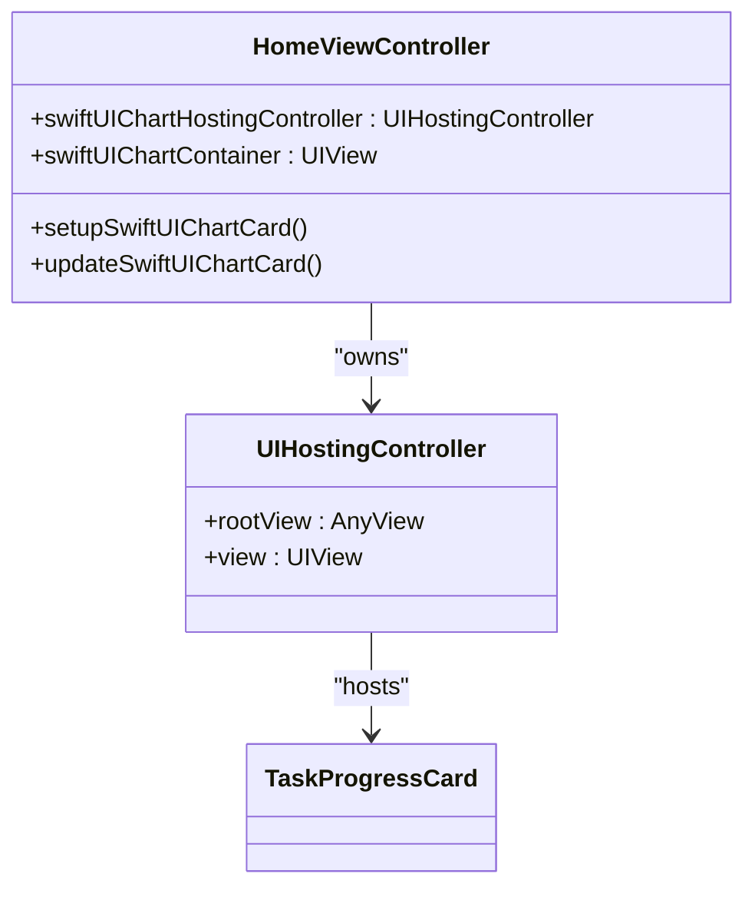
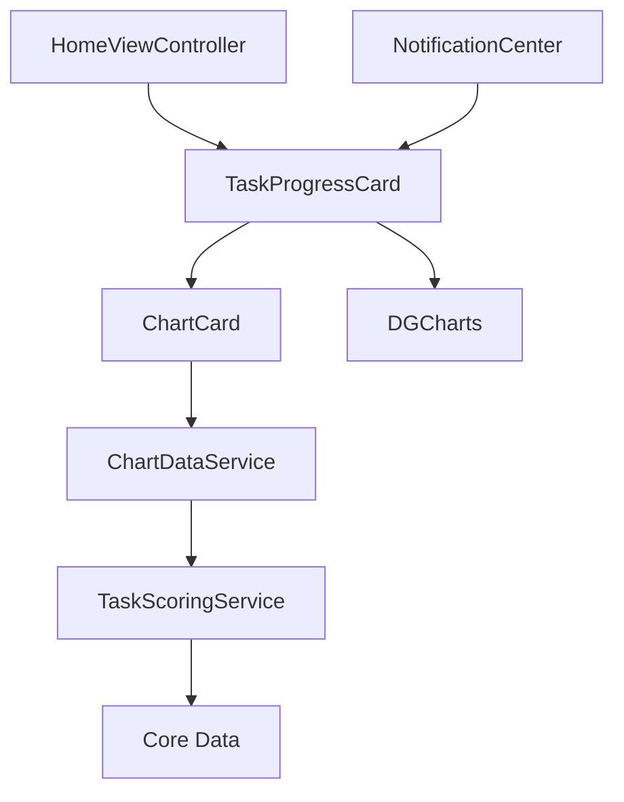

# TaskProgressCard

<cite>
**Referenced Files in This Document**   
- [HomeViewController.swift](file://To Do List/ViewControllers/HomeViewController.swift#L0-L1106)
- [ChartCard.swift](file://To Do List/Views/Cards/ChartCard.swift#L0-L255)
- [ChartDataService.swift](file://To Do List/Services/ChartDataService.swift#L0-L230)
- [TaskScoringService.swift](file://To Do List/Services/TaskScoringService.swift#L0-L154)
</cite>

## Table of Contents
1. [Introduction](#introduction)
2. [Project Structure](#project-structure)
3. [Core Components](#core-components)
4. [Architecture Overview](#architecture-overview)
5. [Detailed Component Analysis](#detailed-component-analysis)
6. [Dependency Analysis](#dependency-analysis)
7. [Performance Considerations](#performance-considerations)
8. [Troubleshooting Guide](#troubleshooting-guide)
9. [Conclusion](#conclusion)

## Introduction
The TaskProgressCard is a SwiftUI-based visual component embedded within the UIKit interface of the Tasker application. It serves as a central element in the app's gamification system, displaying daily task completion metrics and scoring feedback. The component visualizes weekly progress through a line chart, showing completed vs total tasks, performance scores, and streak information. It is integrated into the HomeViewController using UIHostingController to bridge SwiftUI and UIKit, and updates in real-time based on user actions via NotificationCenter events. The card uses DGCharts for data visualization and adheres to FluentUI design principles for typography and layout consistency.

## Project Structure
The TaskProgressCard implementation is distributed across multiple directories in the project structure, reflecting a modular architecture that separates concerns between views, services, and data management. The core visual component resides in the Views/Cards directory, while supporting business logic is encapsulated in the Services directory. This separation enables maintainability and testability of the scoring and chart data generation systems.

**Diagram sources**
- [ChartCard.swift](file://To Do List/Views/Cards/ChartCard.swift#L0-L255)
- [ChartDataService.swift](file://To Do List/Services/ChartDataService.swift#L0-L230)
- [TaskScoringService.swift](file://To Do List/Services/TaskScoringService.swift#L0-L154)
- [HomeViewController.swift](file://To Do List/ViewControllers/HomeViewController.swift#L0-L1106)

**Section sources**
- [HomeViewController.swift](file://To Do List/ViewControllers/HomeViewController.swift#L0-L1106)
- [ChartCard.swift](file://To Do List/Views/Cards/ChartCard.swift#L0-L255)

## Core Components
The TaskProgressCard system consists of four primary components that work together to display task completion metrics: the TaskProgressCard SwiftUI view, the ChartCard container, the ChartDataService for data generation, and the TaskScoringService for score calculation. These components are interconnected through dependency injection and notification patterns, enabling real-time updates when tasks are completed or modified.

**Section sources**
- [ChartCard.swift](file://To Do List/Views/Cards/ChartCard.swift#L0-L255)
- [ChartDataService.swift](file://To Do List/Services/ChartDataService.swift#L0-L230)
- [TaskScoringService.swift](file://To Do List/Services/TaskScoringService.swift#L0-L154)

## Architecture Overview
The TaskProgressCard follows a layered architecture that integrates SwiftUI components within a UIKit-based application. The component is hosted in the HomeViewController using UIHostingController, which acts as a bridge between the UIKit and SwiftUI frameworks. Data flows from the Core Data persistence layer through service classes to the SwiftUI view hierarchy, with updates propagated via NotificationCenter events.

**Diagram sources**
- [HomeViewController.swift](file://To Do List/ViewControllers/HomeViewController.swift#L0-L1106)
- [ChartCard.swift](file://To Do List/Views/Cards/ChartCard.swift#L0-L255)
- [ChartDataService.swift](file://To Do List/Services/ChartDataService.swift#L0-L230)
- [TaskScoringService.swift](file://To Do List/Services/TaskScoringService.swift#L0-L154)

## Detailed Component Analysis

### TaskProgressCard Analysis
The TaskProgressCard is a public SwiftUI struct that serves as a specialized wrapper around the more generic ChartCard component. It is configured with default values for displaying weekly task completion scores and is designed to be embedded within the HomeViewController's dashboard layout.

**Diagram sources**
- [ChartCard.swift](file://To Do List/Views/Cards/ChartCard.swift#L0-L255)

**Section sources**
- [ChartCard.swift](file://To Do List/Views/Cards/ChartCard.swift#L0-L255)

#### For Object-Oriented Components:

**Diagram sources**
- [ChartCard.swift](file://To Do List/Views/Cards/ChartCard.swift#L0-L255)
- [ChartDataService.swift](file://To Do List/Services/ChartDataService.swift#L0-L230)
- [TaskScoringService.swift](file://To Do List/Services/TaskScoringService.swift#L0-L154)

#### For API/Service Components:

**Diagram sources**
- [HomeViewController.swift](file://To Do List/ViewControllers/HomeViewController.swift#L0-L1106)
- [ChartCard.swift](file://To Do List/Views/Cards/ChartCard.swift#L0-L255)
- [ChartDataService.swift](file://To Do List/Services/ChartDataService.swift#L0-L230)
- [TaskScoringService.swift](file://To Do List/Services/TaskScoringService.swift#L0-L154)

#### For Complex Logic Components:

**Diagram sources**
- [ChartDataService.swift](file://To Do List/Services/ChartDataService.swift#L0-L230)
- [TaskScoringService.swift](file://To Do List/Services/TaskScoringService.swift#L0-L154)

**Section sources**
- [ChartCard.swift](file://To Do List/Views/Cards/ChartCard.swift#L0-L255)
- [ChartDataService.swift](file://To Do List/Services/ChartDataService.swift#L0-L230)
- [TaskScoringService.swift](file://To Do List/Services/TaskScoringService.swift#L0-L154)

### Integration with HomeViewController
The TaskProgressCard is integrated into the HomeViewController through a hosting pattern that uses UIHostingController to embed the SwiftUI view within the UIKit view hierarchy. This integration is managed through a dedicated container view that positions the card within the backdrop layer of the home screen.

**Diagram sources**
- [HomeViewController.swift](file://To Do List/ViewControllers/HomeViewController.swift#L0-L1106)

**Section sources**
- [HomeViewController.swift](file://To Do List/ViewControllers/HomeViewController.swift#L0-L1106)

## Dependency Analysis
The TaskProgressCard component has a well-defined dependency chain that flows from presentation to data access. The SwiftUI view depends on service classes for data, which in turn depend on the Core Data persistence layer. This dependency structure enables separation of concerns and facilitates testing of individual components.

**Diagram sources**
- [ChartCard.swift](file://To Do List/Views/Cards/ChartCard.swift#L0-L255)
- [ChartDataService.swift](file://To Do List/Services/ChartDataService.swift#L0-L230)
- [TaskScoringService.swift](file://To Do List/Services/TaskScoringService.swift#L0-L154)
- [HomeViewController.swift](file://To Do List/ViewControllers/HomeViewController.swift#L0-L1106)

**Section sources**
- [ChartCard.swift](file://To Do List/Views/Cards/ChartCard.swift#L0-L255)
- [ChartDataService.swift](file://To Do List/Services/ChartDataService.swift#L0-L230)
- [TaskScoringService.swift](file://To Do List/Services/TaskScoringService.swift#L0-L154)

## Performance Considerations
The TaskProgressCard implementation includes several performance optimizations to ensure smooth rendering and responsive updates. The chart data generation occurs on the Core Data context queue to prevent blocking the main thread, and animations are carefully orchestrated to provide visual feedback without compromising performance. The component minimizes re-renders by using state management and only updating when necessary, such as when the reference date changes or when a task completion notification is received.

The line chart employs a two-phase animation strategy: an initial cubic easing animation for the main data presentation, followed by a subtle bounce effect to draw attention to the update. This approach enhances the user experience while maintaining performance across different device capabilities. Additionally, the chart uses dynamic maximum scaling to ensure optimal visualization of score ranges, preventing unnecessary recalculations of the chart bounds.

## Troubleshooting Guide
Common issues with the TaskProgressCard typically relate to data synchronization, layout constraints, or animation glitches. When the chart fails to update after task completion, verify that the "TaskCompletionChanged" notification is being posted correctly from the task management system. If the chart appears blank or shows loading states indefinitely, check that the ChartDataService can access the Core Data context and retrieve completed tasks.

Layout issues may occur when the hosting container constraints are not properly configured. Ensure that the swiftUIChartContainer in HomeViewController has appropriate leading, trailing, top, and height constraints relative to the backdropContainer. Animation problems can often be resolved by verifying that chart updates occur on the main queue and that the withAnimation block is properly structured.

For debugging purposes, the component includes extensive logging that can be enabled by setting the DEBUG flag. This logging shows the chart data generation process, including the score calculation for each day and the final data points passed to the chart view.

## Conclusion
The TaskProgressCard is a sophisticated component that effectively bridges SwiftUI and UIKit frameworks to deliver a rich, interactive visualization of task completion metrics. Its architecture demonstrates a thoughtful approach to component design, with clear separation of concerns between presentation, business logic, and data access. The integration with the gamification system through real-time score calculation and streak tracking enhances user engagement, while the use of modern iOS development patterns ensures maintainability and scalability. The component successfully addresses the challenges of consistent appearance across different screen sizes through adaptive layout constraints and provides a smooth user experience with carefully orchestrated animations.