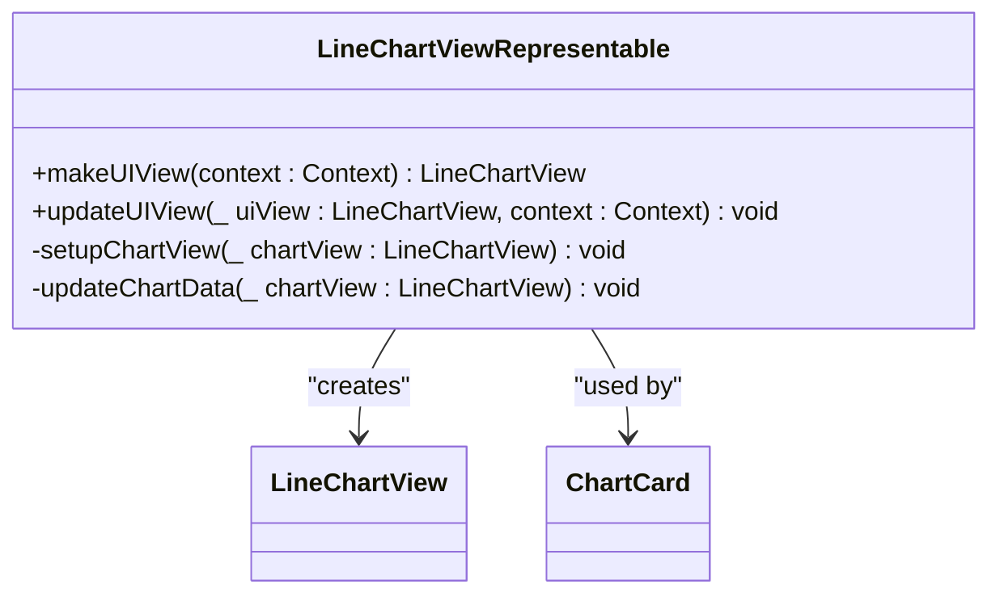
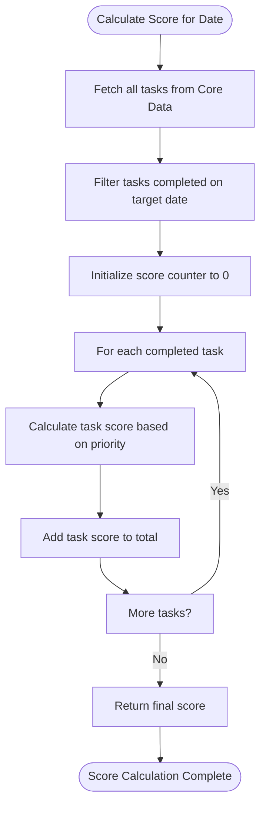
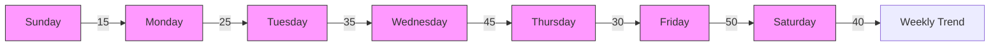

# Data Visualization Integration

<cite>
**Referenced Files in This Document**   
- [ChartCard.swift](file://To%20Do%20List/Views/Cards/ChartCard.swift)
- [ChartDataService.swift](file://To%20Do%20List/Services/ChartDataService.swift)
- [README.md](file://README.md)
</cite>

## Table of Contents
1. [Introduction](#introduction)
2. [Core Components Overview](#core-components-overview)
3. [ChartCard Implementation](#chartcard-implementation)
4. [Chart Data Service](#chart-data-service)
5. [Data Model Mapping](#data-model-mapping)
6. [Visual Design and Theming](#visual-design-and-theming)
7. [Real-time Data Synchronization](#real-time-data-synchronization)
8. [Chart Types and Examples](#chart-types-and-examples)
9. [Performance Optimization](#performance-optimization)
10. [Extensibility and Customization](#extensibility-and-customization)

## Introduction
The Tasker application implements a comprehensive data visualization system using the DGCharts framework to provide users with actionable productivity insights. This documentation details the integration of DGCharts within Tasker's analytics system, focusing on the ChartCard component that renders task completion trends, scoring patterns, and streak visualization. The system transforms raw task data into meaningful visual representations that help users track their productivity over time. The implementation follows modern iOS development practices with SwiftUI for declarative UI construction and UIKit integration for advanced chart rendering through DGCharts.

## Core Components Overview
The data visualization system in Tasker consists of two primary components: ChartCard and ChartDataService. These components work together to fetch, process, and render task analytics data in an interactive and visually appealing manner. The architecture follows a clean separation of concerns where ChartDataService handles data processing and ChartCard manages the UI presentation. This separation enables efficient updates and maintains code maintainability. The system leverages Core Data for persistent storage and implements real-time updates through NotificationCenter observers, ensuring that visualizations remain synchronized with the underlying data.

**Section sources**
- [ChartCard.swift](file://To%20Do%20List/Views/Cards/ChartCard.swift)
- [ChartDataService.swift](file://To%20Do%20List/Services/ChartDataService.swift)

## ChartCard Implementation

### ChartCard Structure and Properties
The ChartCard component is a SwiftUI view that serves as a container for data visualizations. It accepts configuration parameters including title, subtitle, and reference date, allowing for flexible reuse across different analytics contexts. The component maintains internal state for chart data and loading status, providing a smooth user experience during data loading.

```swift
struct ChartCard: View {
    let title: String
    let subtitle: String?
    let referenceDate: Date?
    @State private var chartData: [ChartDataEntry] = []
    @State private var isLoading = true
}
```

The ChartCard uses a VStack layout to organize its content, with a header section displaying the title and subtitle, followed by a ZStack container that manages the loading state and chart rendering. When loading, a ProgressView is displayed within a RoundedRectangle placeholder. Once data is loaded, the LineChartViewRepresentable component takes over to render the actual chart.

**Section sources**
- [ChartCard.swift](file://To%20Do%20List/Views/Cards/ChartCard.swift#L25-L255)

### LineChartViewRepresentable Integration
The LineChartViewRepresentable struct bridges SwiftUI and UIKit by conforming to the UIViewRepresentable protocol. This allows the DGCharts LineChartView to be embedded within the SwiftUI hierarchy. The component implements two essential methods: makeUIView for creating the chart view instance and updateUIView for updating the chart when data changes.



**Diagram sources**
- [ChartCard.swift](file://To%20Do%20List/Views/Cards/ChartCard.swift#L110-L220)

**Section sources**
- [ChartCard.swift](file://To%20Do%20List/Views/Cards/ChartCard.swift#L110-L220)

### Chart Configuration and Styling
The setupChartView method configures the appearance and behavior of the LineChartView. This includes setting background colors, enabling grid lines, configuring axis properties, and setting up interactive features. The chart is configured with enhanced interaction capabilities including pinch-to-zoom, double-tap to zoom, drag panning, and tap highlighting.

```swift
private func setupChartView(_ chartView: LineChartView) {
    chartView.scaleXEnabled = true
    chartView.scaleYEnabled = true
    chartView.pinchZoomEnabled = true
    chartView.doubleTapToZoomEnabled = true
    chartView.dragEnabled = true
    chartView.highlightPerTapEnabled = true
    chartView.setViewPortOffsets(left: 20, top: 20, right: 20, bottom: 50)
}
```

X-axis configuration includes setting the label position to bottom, disabling grid lines, and using a custom WeekDayAxisValueFormatter to display day names. The Y-axis is configured with grid lines, custom colors, and appropriate font styling. A BalloonMarker is implemented to provide detailed tooltips when users interact with data points.

**Section sources**
- [ChartCard.swift](file://To%20Do%20List/Views/Cards/ChartCard.swift#L145-L205)

## Chart Data Service

### Data Generation and Processing
The ChartDataService class is responsible for generating chart data from raw task information. As a singleton, it provides a centralized service for data processing across the application. The generateLineChartData method creates data points for a weekly view, processing tasks completed on each day of the week.

```swift
func generateLineChartData(for referenceDate: Date? = nil) -> [ChartDataEntry] {
    var yValues: [ChartDataEntry] = []
    let currentReferenceDate = referenceDate ?? Date.today()
    let week = calendar.daysWithSameWeekOfYear(as: currentReferenceDate)
    let today = Date.today()
    
    for (index, day) in week.enumerated() {
        let score: Int
        if day > today {
            score = 0
        } else {
            score = calculateScoreForDate(date: day)
        }
        
        let safeYValue = yValue.isNaN || yValue.isInfinite ? 0.0 : yValue
        let dataEntry = ChartDataEntry(x: Double(index), y: safeYValue)
        yValues.append(dataEntry)
    }
    
    return yValues
}
```

The service implements robust error handling by validating data values and ensuring they are not NaN or infinite before creating ChartDataEntry objects. Future dates are handled by setting their score to zero while maintaining the weekly structure.

**Section sources**
- [ChartDataService.swift](file://To%20Do%20List/Services/ChartDataService.swift#L15-L85)

### Score Calculation Logic
The calculateScoreForDate method implements the core scoring algorithm that determines the value of each data point. It calculates the total score for tasks completed on a specific date by summing the individual scores of completed tasks. The scoring system is based on task priority, with higher priority tasks contributing more points.



The method uses a startOfDay and endOfDay range to identify tasks completed on the specific date. It leverages the TaskScoringService to calculate individual task scores based on priority levels (P0: 7pts, P1: 4pts, P2: 3pts, P3: 2pts). Comprehensive logging is implemented for debugging purposes, showing detailed information about the calculation process.

**Section sources**
- [ChartDataService.swift](file://To%20Do%20List/Services/ChartDataService.swift#L90-L185)

### Dynamic Chart Configuration
The ChartDataService includes helper methods for dynamic chart configuration, ensuring optimal visualization regardless of the data range. The calculateDynamicMaximum method determines the appropriate Y-axis scale by finding the maximum score in the dataset and applying a 20% buffer, with a minimum scale of 10 to maintain readability for low-score weeks.

```swift
func calculateDynamicMaximum(for dataEntries: [ChartDataEntry]) -> Double {
    let maxScore = dataEntries.map { $0.y }.max() ?? 0
    return max(maxScore * 1.2, 10)
}
```

The createLineChartDataSet method configures the visual appearance of the line chart, including line width, circle radius, colors, and gradient fill. A linear gradient fill is implemented to enhance visual appeal, with colors transitioning from semi-transparent accent color to fully transparent.

```swift
let gradientColors = [
    colors.secondaryAccentColor.withAlphaComponent(0.5).cgColor,
    colors.secondaryAccentColor.withAlphaComponent(0.25).cgColor,
    colors.secondaryAccentColor.withAlphaComponent(0.0).cgColor
]
```

**Section sources**
- [ChartDataService.swift](file://To%20Do%20List/Services/ChartDataService.swift#L200-L229)

## Data Model Mapping

### TaskData to ChartDataEntry Transformation
The system maps task data from the TaskData model to ChartDataEntry objects used by DGCharts. The TaskData struct serves as a presentation layer model that decouples the UI from Core Data dependencies. Each ChartDataEntry represents a single data point with x and y values, where the x value corresponds to the day of the week (0-6) and the y value represents the total score for tasks completed on that day.

```swift
let dataEntry = ChartDataEntry(x: Double(index), y: safeYValue)
```

The transformation process involves aggregating task completion data by date and calculating the total score for each day. This aggregation is performed on the Core Data context queue to ensure data consistency and prevent threading issues.

**Section sources**
- [ChartDataService.swift](file://To%20Do%20List/Services/ChartDataService.swift#L50-L85)

### Axis Configuration
The X-axis is configured to display days of the week using a custom WeekDayAxisValueFormatter. This formatter converts the numeric index (0-6) to abbreviated day names (Sun, Mon, etc.), providing a user-friendly representation of the time dimension.

```swift
xAxis.labelPosition = .bottom
xAxis.drawGridLinesEnabled = false
xAxis.drawAxisLineEnabled = true
xAxis.axisLineColor = colors.primaryTextColor.withAlphaComponent(0.3)
xAxis.labelTextColor = colors.primaryTextColor
xAxis.labelFont = .systemFont(ofSize: 11, weight: .medium)
xAxis.granularity = 1
xAxis.labelCount = 7
xAxis.valueFormatter = WeekDayAxisValueFormatter()
```

The Y-axis is configured with grid lines, custom colors, and appropriate scaling. The axis minimum is set to 0, and the maximum is calculated dynamically based on the data to ensure optimal use of the chart area.

```swift
leftAxis.drawGridLinesEnabled = true
leftAxis.gridColor = colors.primaryTextColor.withAlphaComponent(0.1)
leftAxis.gridLineWidth = 0.5
leftAxis.drawAxisLineEnabled = false
leftAxis.labelTextColor = colors.primaryTextColor
leftAxis.labelFont = .systemFont(ofSize: 10, weight: .regular)
leftAxis.granularity = 5
leftAxis.axisMinimum = 0
```

**Section sources**
- [ChartCard.swift](file://To%20Do%20List/Views/Cards/ChartCard.swift#L165-L185)

## Visual Design and Theming

### FluentUI and Material Design Integration
The chart components integrate both FluentUI and Material Design principles to create a cohesive visual experience. The ToDoColors class provides a centralized color system with primary and secondary accent colors that are applied consistently across the application.

```swift
var primaryColor = #colorLiteral(red: 0.5490196078, green: 0.5450980392, blue: 0.8196078431, alpha: 1)
var secondaryAccentColor = #colorLiteral(red: 0.9824339747, green: 0.5298179388, blue: 0.176022768, alpha: 1)
```

The chart styling follows Material Design guidelines with appropriate elevation, shadows, and color usage. The ChartCard has a secondarySystemBackground fill with a subtle shadow, creating a card-like appearance that stands out from the background.

```swift
.background(
    RoundedRectangle(cornerRadius: 16)
        .fill(Color(.secondarySystemBackground))
        .shadow(color: .black.opacity(0.1), radius: 8, x: 0, y: 4)
)
```

**Section sources**
- [ChartCard.swift](file://To%20Do%20List/Views/Cards/ChartCard.swift#L60-L70)
- [README.md](file://README.md#L1356-L1389)

### Accessibility Features
The implementation includes comprehensive accessibility support to ensure the charts are usable by all users. The chart view is configured as an accessibility element with appropriate labels, hints, and traits.

```swift
chartView.isAccessibilityElement = true
chartView.accessibilityLabel = "Weekly task completion chart"
chartView.accessibilityHint = "Shows daily task completion scores for the current week. Double tap to zoom, pinch to scale, drag to pan."
chartView.accessibilityTraits = [.adjustable, .updatesFrequently]
```

Dynamic type support is implemented for text elements, allowing users to adjust text size according to their preferences while maintaining the visual hierarchy.

```swift
Text(title)
    .font(.headline)
    .fontWeight(.semibold)
    .foregroundColor(.primary)
    .dynamicTypeSize(.large...(.accessibility5))
```

**Section sources**
- [ChartCard.swift](file://To%20Do%20List/Views/Cards/ChartCard.swift#L195-L205)

## Real-time Data Synchronization

### Data Update Mechanisms
The ChartCard implements multiple mechanisms to ensure real-time synchronization between data changes and chart rendering. The onAppear modifier triggers initial data loading when the view appears, while the onChange modifier responds to changes in the reference date parameter.

```swift
.onAppear {
    loadChartData()
}
.onChange(of: referenceDate) { _ in
    loadChartData()
}
```

Additionally, the component observes the "TaskCompletionChanged" notification through NotificationCenter, allowing it to respond to task completion events from other parts of the application.

```swift
.onReceive(NotificationCenter.default.publisher(for: Notification.Name("TaskCompletionChanged"))) { _ in
    loadChartData()
}
```

The loadChartData method performs data loading on the Core Data context queue to ensure thread safety, then updates the UI on the main queue with animation.

```swift
TaskManager.sharedInstance.context.perform {
    let newData = ChartDataService.shared.generateLineChartData(for: referenceDate)
    DispatchQueue.main.async {
        self.chartData = newData
        withAnimation(.easeInOut(duration: 0.3)) {
            self.isLoading = false
        }
    }
}
```

**Section sources**
- [ChartCard.swift](file://To%20Do%20List/Views/Cards/ChartCard.swift#L100-L110)

### Animation and Transition Effects
The implementation includes smooth animations to enhance the user experience when data updates. The isLoading state is animated using withAnimation, providing a seamless transition from the loading state to the rendered chart.

```swift
withAnimation(.easeInOut(duration: 0.3)) {
    self.isLoading = false
}
```

The chart itself includes animation configuration with cubic easing for a natural appearance.

```swift
chartView.animate(xAxisDuration: 0.8, yAxisDuration: 0.8, easingOption: .easeInOutCubic)
```

A subtle bounce effect is implemented after the main animation to draw attention to the updated data.

```swift
DispatchQueue.main.asyncAfter(deadline: .now() + 1.2) {
    chartView.animate(yAxisDuration: 0.3, easingOption: .easeOutBack)
}
```

**Section sources**
- [ChartCard.swift](file://To%20Do%20List/Views/Cards/ChartCard.swift#L105-L115)

## Chart Types and Examples

### Line Charts for Trend Visualization
The primary chart type implemented is the line chart, which visualizes task completion trends over time. The line chart shows daily task completion scores for the current week, with data points connected by a line to illustrate trends.



The line chart includes interactive features such as tap highlighting, which displays a BalloonMarker with detailed information about the selected data point.

**Section sources**
- [ChartCard.swift](file://To%20Do%20List/Views/Cards/ChartCard.swift)
- [README.md](file://README.md#L1269-L1319)

### Potential Chart Extensions
While the current implementation focuses on line charts, the architecture supports extension to other chart types. The README documentation mentions additional chart types that could be implemented:

**Bar Charts**: For project performance comparison, showing completion statistics for different projects side by side.

**Pie Charts**: For priority distribution visualization, showing the proportion of tasks at different priority levels.

**TinyPieChart**: For completion ratio visualization with dynamic center text displaying the current score.

The modular design of ChartDataService makes it possible to create specialized data generation methods for different chart types while reusing the core scoring logic.

**Section sources**
- [README.md](file://README.md#L1269-L1319)

## Performance Optimization

### Large Dataset Handling
The implementation includes several optimizations for handling large datasets efficiently. Data processing occurs on the Core Data context queue to prevent blocking the main thread, ensuring smooth UI performance.

```swift
TaskManager.sharedInstance.context.perform {
    let newData = ChartDataService.shared.generateLineChartData(for: referenceDate)
    DispatchQueue.main.async {
        self.chartData = newData
    }
}
```

The system fetches all tasks once and filters them in memory, which is more efficient than making multiple Core Data fetch requests during week generation.

```swift
let allTasks = TaskManager.sharedInstance.getAllTasks
let tasksCompletedOnDate = allTasks.filter { task in
    guard task.isComplete, let completedDate = task.dateCompleted as Date? else { return false }
    return completedDate >= startOfDay && completedDate < endOfDay
}
```

This approach reduces database access overhead and improves performance, especially when dealing with large numbers of tasks.

**Section sources**
- [ChartDataService.swift](file://To%20Do%20List/Services/ChartDataService.swift#L100-L120)

### Memory Management During Animation
The implementation manages memory effectively during animations by using appropriate animation durations and easing functions. The chart animations are configured with moderate durations (0.8-1.2 seconds) to provide a smooth experience without excessive resource consumption.

```swift
chartView.animate(xAxisDuration: 0.8, yAxisDuration: 0.8, easingOption: .easeInOutCubic)
```

The loading state is managed with a simple ProgressView, minimizing memory usage during data loading. The isLoading state is animated with a short duration (0.3 seconds) to provide immediate feedback without prolonged animation overhead.

The use of @State properties for chartData and isLoading ensures that SwiftUI's reactive system efficiently manages view updates, only re-rendering when necessary.

**Section sources**
- [ChartCard.swift](file://To%20Do%20List/Views/Cards/ChartCard.swift#L210-L220)

## Extensibility and Customization

### Extending Chart Types
The architecture supports extending the visualization system with new chart types for additional analytics views. Developers can create new SwiftUI views similar to ChartCard but configured for different chart types (bar charts, pie charts, etc.).

The ChartDataService can be extended with new methods for generating data in different formats suitable for various chart types. For example, a generateBarChartData method could return data grouped by project for project performance comparison.

```swift
func generateBarChartData(forProject project: String) -> [BarChartDataEntry] {
    // Implementation for project-specific data
}
```

The existing createLineChartDataSet method demonstrates the pattern for creating specialized data set configurations, which can be replicated for other chart types.

**Section sources**
- [ChartDataService.swift](file://To%20Do%20List/Services/ChartDataService.swift#L200-L229)

### Handling Dynamic Data Ranges
The system handles dynamic data ranges through the calculateDynamicMaximum method, which automatically adjusts the Y-axis scale based on the data. This ensures that charts remain readable regardless of the score range.

```swift
func calculateDynamicMaximum(for dataEntries: [ChartDataEntry]) -> Double {
    let maxScore = dataEntries.map { $0.y }.max() ?? 0
    return max(maxScore * 1.2, 10)
}
```

The referenceDate parameter allows the chart to display data for different time periods, enabling weekly views centered on different dates. This flexibility supports features like historical trend analysis and comparison of productivity across different weeks.

The implementation gracefully handles future dates by setting their score to zero while maintaining the weekly structure, ensuring consistent chart appearance.

**Section sources**
- [ChartDataService.swift](file://To%20Do%20List/Services/ChartDataService.swift#L200-L205)