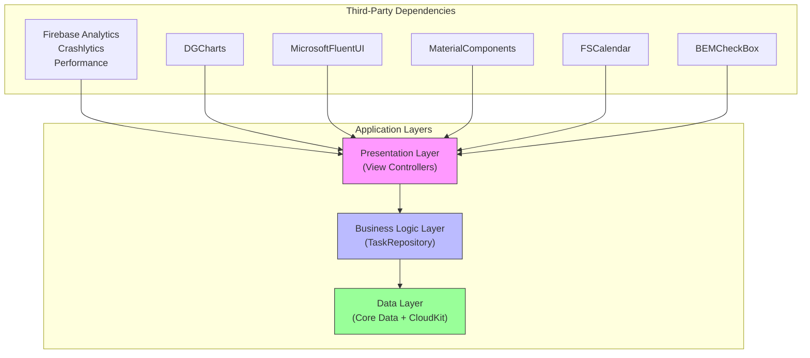
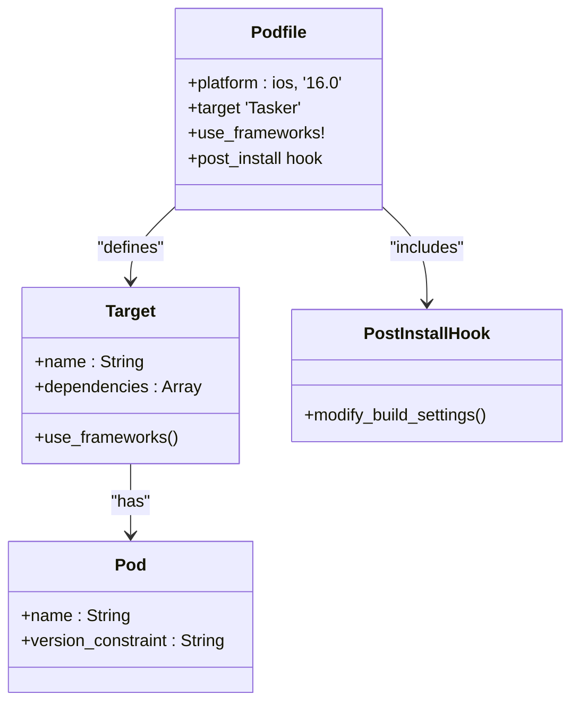
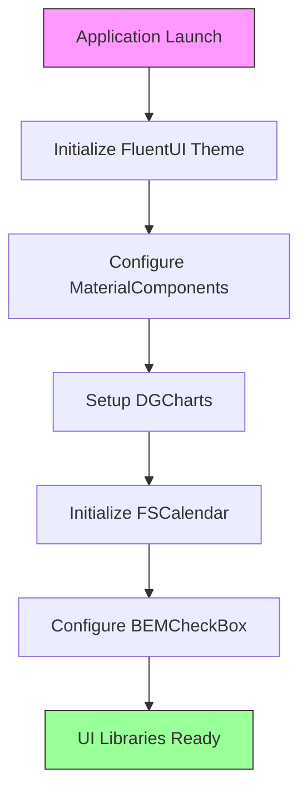
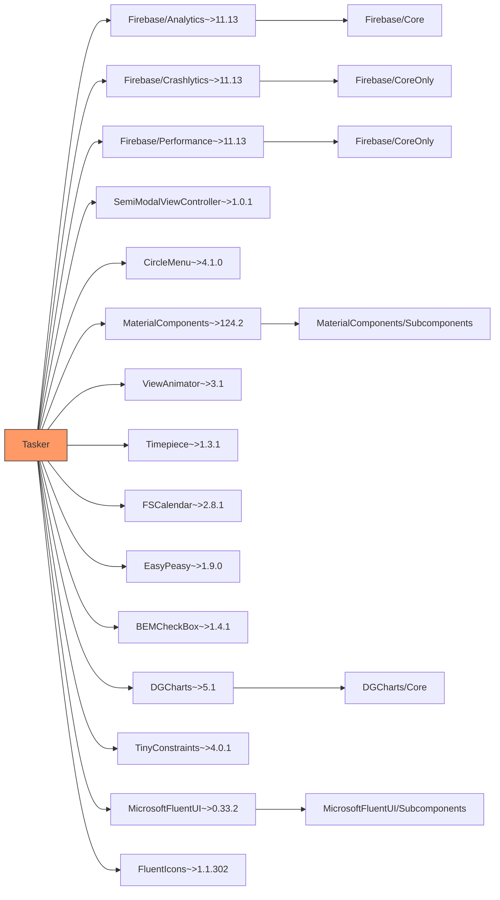
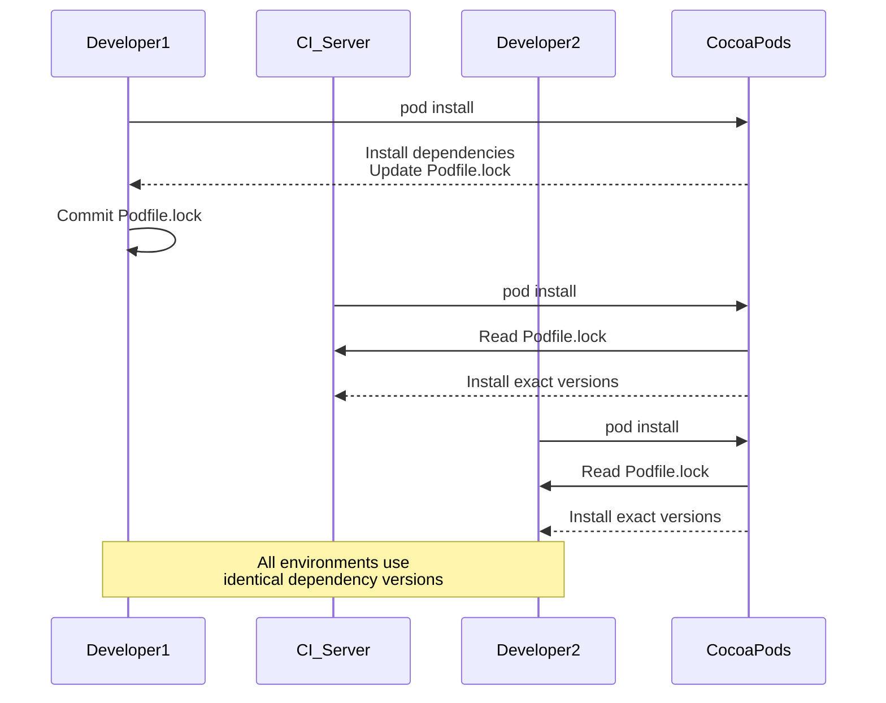

# Dependency Management Workflow

<cite>
**Referenced Files in This Document**   
- [Podfile](file://Podfile#L1-L39)
- [Podfile.lock](file://Podfile.lock#L1-L1078)
- [README.md](file://README.md#L1-L1617)
- [AppDelegate.swift](file://To%20Do%20List/AppDelegate.swift#L1-L50)
- [HomeViewController.swift](file://To%20Do%20List/ViewControllers/HomeViewController.swift#L1-L200)
- [HomeViewController+Charts.swift](file://To%20Do%20List/ViewControllers/HomeViewController+Charts.swift#L1-L150)
- [Services/ChartDataService.swift](file://To%20Do%20List/Services/ChartDataService.swift#L1-L50)
</cite>

## Table of Contents
1. [Introduction](#introduction)
2. [Project Structure](#project-structure)
3. [Core Components](#core-components)
4. [Architecture Overview](#architecture-overview)
5. [Detailed Component Analysis](#detailed-component-analysis)
6. [Dependency Analysis](#dependency-analysis)
7. [Performance Considerations](#performance-considerations)
8. [Troubleshooting Guide](#troubleshooting-guide)
9. [Conclusion](#conclusion)

## Introduction
This document provides a comprehensive analysis of the CocoaPods dependency management system in the Tasker iOS application. It examines the Podfile configuration, dependency specifications, integration workflow, and best practices for maintaining a healthy dependency ecosystem. The documentation covers the role of each major dependency in the application architecture, the process of adding and updating dependencies, and strategies for resolving common issues. Special attention is given to the Podfile.lock's role in ensuring reproducible builds and the integration of third-party libraries with the Xcode project structure.

## Project Structure
The Tasker project follows a feature-based organization with clear separation between assets, source code, and documentation. The root directory contains essential configuration files for dependency management (Podfile, Podfile.lock), application metadata (README.md, privacy.html), and support files. The main application code resides in the "To Do List" directory, which houses assets, view controllers, services, and model files. The project uses xcassets for managing images and icons, with a well-organized structure for different UI components including buttons, top bar elements, material icons, and table view cells.

```mermaid
graph TB
root["Tasker Project Root"]
subgraph "Configuration & Documentation"
root --> Podfile["Podfile"]
root --> PodfileLock["Podfile.lock"]
root --> README["README.md"]
root --> privacy["privacy.html"]
root --> support["support/index.html"]
end
subgraph "Assets"
root --> Assets["To Do List/Assets.xcassets"]
Assets --> AppIcon["AppIcon.appiconset"]
Assets --> Buttons["Buttons/"]
Assets --> HomeTopBar["HomeTopBar/"]
Assets --> MaterialIcons["Material_Icons/"]
Assets --> TableViewCell["TableViewCell/"]
end
subgraph "Source Code"
root --> Source["To Do List/"]
Source --> AppDelegate["AppDelegate.swift"]
Source --> ViewControllers["ViewControllers/"]
Source --> Services["Services/"]
Source --> LLM["LLM/"]
Source --> View["View/"]
end
```

**Diagram sources**
- [Podfile](file://Podfile#L1-L39)
- [README.md](file://README.md#L1-L50)

**Section sources**
- [Podfile](file://Podfile#L1-L39)
- [README.md](file://README.md#L1-L100)

## Core Components
The core components of the Tasker application include the dependency management system (CocoaPods), the main application logic (TaskManager and TaskRepository), and the UI framework components (FluentUI, MaterialComponents). The Podfile defines the iOS platform target and specifies all third-party dependencies with version constraints. The application architecture is transitioning from a legacy MVC pattern to a more modern repository pattern with dependency injection, as evidenced by the coexistence of TaskManager and TaskRepository components. The UI is built using a combination of Microsoft FluentUI and Google's MaterialComponents, providing a modern, consistent user experience across the application.

**Section sources**
- [Podfile](file://Podfile#L1-L39)
- [README.md](file://README.md#L1-L200)

## Architecture Overview
The Tasker application follows a hybrid architecture that combines traditional MVC patterns with modern repository and dependency injection patterns. The dependency management system is centered around CocoaPods, which handles all third-party libraries including Firebase for analytics and crash reporting, DGCharts for data visualization, and FluentUI for the user interface. The application is structured with clear separation between data management (Core Data with CloudKit), business logic (TaskRepository), and presentation layers (View Controllers with FluentUI components). This architecture enables both backward compatibility with existing code and forward progress toward a more testable, maintainable codebase.



**Diagram sources**
- [Podfile](file://Podfile#L1-L39)
- [README.md](file://README.md#L1-L300)

## Detailed Component Analysis

### CocoaPods Configuration Analysis
The Podfile configuration establishes iOS 16.0 as the minimum deployment target and defines dependencies for the main Tasker target and its test suite. The configuration includes Firebase services for analytics, crash reporting, and performance monitoring, along with UI and utility libraries that enhance the application's functionality and user experience.

#### Podfile Structure and Target Definitions
The Podfile specifies the iOS platform version and defines dependencies within a target block for the main application. It includes a nested target for unit tests that inherits search paths from the parent target. A post-install hook ensures consistent deployment target settings across all pods.



**Diagram sources**
- [Podfile](file://Podfile#L1-L39)

**Section sources**
- [Podfile](file://Podfile#L1-L39)

### Firebase Integration
Firebase is integrated as a suite of services that provide critical functionality for analytics, crash reporting, and performance monitoring. The application uses Firebase Analytics to track user behavior, Firebase Crashlytics to capture and report crashes, and Firebase Performance to monitor application performance metrics.

#### Firebase Services and Their Roles
The Firebase dependency is split into multiple subspecs, each providing specific functionality to the application. This modular approach allows for targeted inclusion of only the required Firebase services, optimizing app size and performance.

```mermaid
graph TD
Firebase["Firebase"]
Analytics["Firebase/Analytics"]
Crashlytics["Firebase/Crashlytics"]
Performance["Firebase/Performance"]
Firebase --> Analytics
Firebase --> Crashlytics
Firebase --> Performance
Analytics --> AppDelegate
Crashlytics --> AppDelegate
Performance --> AppDelegate
class AppDelegate style fill:#f96,stroke:#333
```

**Diagram sources**
- [Podfile](file://Podfile#L6-L9)
- [AppDelegate.swift](file://To%20Do%20List/AppDelegate.swift#L1-L50)

**Section sources**
- [Podfile](file://Podfile#L6-L9)
- [AppDelegate.swift](file://To%20Do%20List/AppDelegate.swift#L1-L50)

### UI and Utility Libraries
The application leverages several third-party libraries to enhance the user interface and provide utility functionality. These include Microsoft FluentUI for modern UI components, Google's MaterialComponents for Material Design elements, DGCharts for data visualization, and various specialized libraries for specific UI needs.

#### UI Component Library Integration
The UI libraries work together to create a cohesive and modern user interface. FluentUI provides the primary design language, while MaterialComponents adds specific Material Design elements. DGCharts enables sophisticated data visualization for the application's analytics features.



**Diagram sources**
- [Podfile](file://Podfile#L11-L28)
- [HomeViewController.swift](file://To%20Do%20List/ViewControllers/HomeViewController.swift#L1-L50)

**Section sources**
- [Podfile](file://Podfile#L11-L28)
- [HomeViewController.swift](file://To%20Do%20List/ViewControllers/HomeViewController.swift#L1-L50)

## Dependency Analysis
The dependency graph of the Tasker application reveals a well-structured ecosystem of third-party libraries that support various aspects of the application's functionality. The Podfile.lock file provides a complete record of all installed dependencies and their exact versions, ensuring reproducible builds across different development environments.

### Dependency Graph and Version Constraints
The application uses version constraints with the tilde operator (~>) to allow for patch and minor version updates while preventing breaking changes from major version updates. This approach balances the need for security updates and bug fixes with the stability required for a production application.



**Diagram sources**
- [Podfile](file://Podfile#L1-L39)
- [Podfile.lock](file://Podfile.lock#L1-L100)

**Section sources**
- [Podfile](file://Podfile#L1-L39)
- [Podfile.lock](file://Podfile.lock#L1-L100)

### Podfile.lock and Reproducible Builds
The Podfile.lock file is critical for ensuring that all developers and build systems use exactly the same versions of dependencies. It contains the precise versions of all pods and their subdependencies, creating a snapshot of the dependency tree at the time of the last pod install or update.

#### Role of Podfile.lock in Build Consistency
The lockfile prevents "it works on my machine" issues by ensuring that every installation of dependencies results in the same versions being installed, regardless of when or where the installation occurs.



**Diagram sources**
- [Podfile.lock](file://Podfile.lock#L1-L50)

**Section sources**
- [Podfile.lock](file://Podfile.lock#L1-L50)

## Performance Considerations
The dependency management strategy in Tasker considers performance implications through careful selection of libraries and version constraints. The use of modular pods (such as specific Firebase components rather than the entire Firebase SDK) helps minimize application size and startup time. The post-install hook that sets the deployment target ensures consistent build settings across all dependencies, preventing potential performance issues from mismatched configurations.

The integration of performance monitoring through Firebase Performance allows the team to track the impact of dependencies on application responsiveness, rendering performance, and network requests. This data-driven approach enables informed decisions about dependency updates and optimizations.

[No sources needed since this section provides general guidance]

## Troubleshooting Guide
Common issues with CocoaPods in the Tasker project can be addressed through systematic troubleshooting. Installation failures are often resolved by cleaning the CocoaPods cache and reinstalling dependencies. Linking errors typically require verifying that the correct Xcode workspace is opened (Tasker.xcworkspace rather than Tasker.xcodeproj) and that all pods are properly integrated.

Build conflicts may arise from version incompatibilities between dependencies. These can be resolved by updating all dependencies to compatible versions or by using dependency resolution tools provided by CocoaPods. When adding new dependencies, it's important to follow the same version constraint patterns used in the existing Podfile to maintain consistency.

For issues related to specific libraries, consulting the library's documentation and release notes can provide insights into known issues and required configuration steps. The README.md file in the Tasker project provides basic installation instructions, including the requirement to run "pod install" and open the workspace file.

**Section sources**
- [Podfile](file://Podfile#L1-L39)
- [README.md](file://README.md#L1-L50)

## Conclusion
The CocoaPods dependency management system in Tasker provides a robust foundation for managing third-party libraries and ensuring consistent builds across development environments. The well-structured Podfile with clear version constraints, combined with the Podfile.lock for reproducible builds, creates a reliable dependency ecosystem. The selection of libraries supports the application's goals of providing a modern user interface, comprehensive analytics, and robust error reporting. As the application continues to evolve, maintaining good dependency hygiene through regular updates, security patching, and removal of unused pods will be essential for long-term maintainability and performance.

[No sources needed since this section summarizes without analyzing specific files]